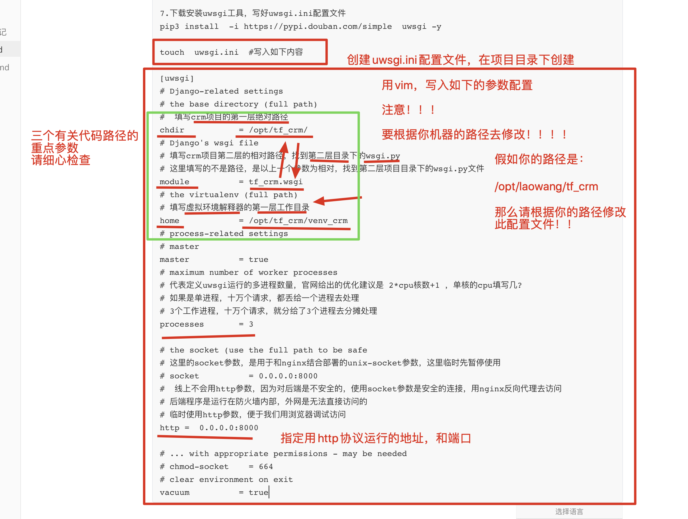
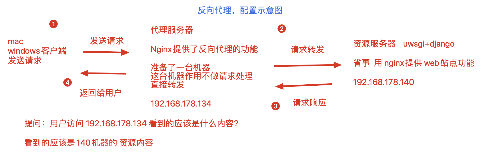
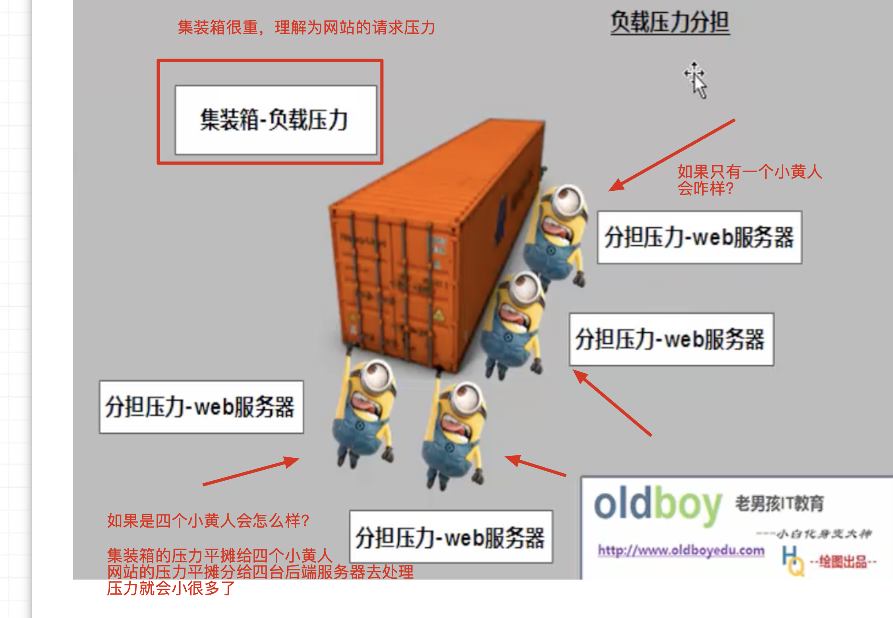
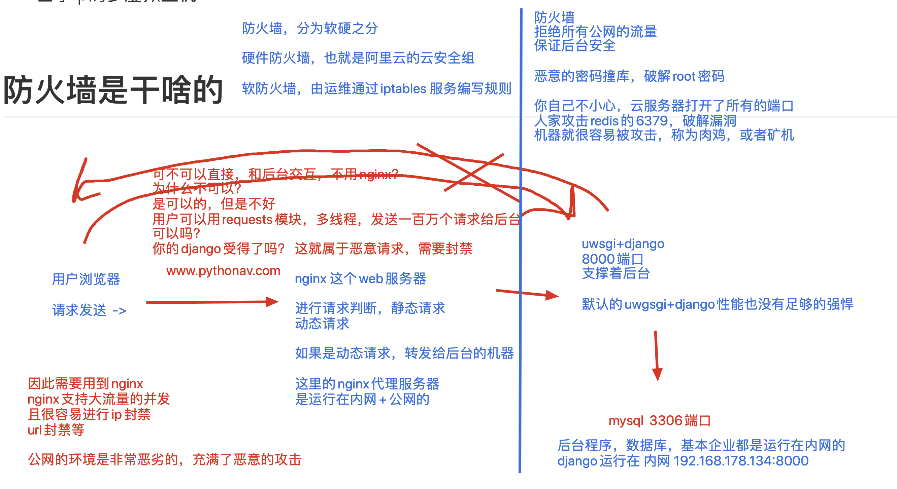

## 昨日作业标题

```
1.编译安装好python3

2.练习linux运行一个简单的django项目
	Pip3安装django模块
	通过django-admin命令生成项目文件夹
	简单修改django的项目文件夹，配置文件修改
	即可启动访问

3.安装配置好virtualenv工具，可以在linux下创建出多个隔离的，干净的，多个python3解释器
创建venv1运行django版本1
创建venv2运行django版本2

4.完成linux上启动所教的crm项目,能够登录查看用户数据（配置好数据库），截图展示

5.
原本是通过python3 manage.py runserver这种方式启动项目，仅仅是用于调试项目是否正常运行的命令
线上就是更换了启动方式
安装uwsgi工具，写好配置文件，启动django项目即可


装好uwsgi工具，使用uwsgi.ini配置文件，启动crm项目，截图展示，静态文件丢失暂时忽略
```

## 遇见的问题

```
44个同学交了作业，每天上课57人，  有13个没交的，需要告诉我是什么问题，班主任会帮忙跟进

基本都是完成到第三题
1.看来编译python3环境基本没问题
2.linux简单启动django 基本也没问题
3.安装虚拟环境工具，使用问题也没问题

4.主要是到了启动crm，涉及的操作较多
照着上课笔记+视频，梳理好笔记，应该一、二、三做些什么，遇见问题及时和我沟通

------
4，5没做,或是遇见了错误问题
```

## 后面课程安排

应该是补充四天linux课程，linux结束就是python开发项目复习+串讲

- Nginx虚拟主机配置
  - 多虚拟主机配置
  - 访问日志功能
  - 404页面优化
  - 反向代理功能
  - 负载均衡配置，负载均衡算法介绍
  - Nginx结合uwsgi，进行项目部署
  - Nginx+vue+uwsgi+mariadb+redis，进行路飞学城部署
- redis数据库
  - 五大数据类型
  - 数据持久化机制
  - 主从复制
  - 主从复制-高可用-哨兵功能
  - redis集群搭建
- docker容器技术
  - 容器，镜像，仓库的基本管理
  - dockerfile实战
- Saltstack，rabbitmq

## 今日任务

- supervisor工具使用，进程管理工具
- nginx

## supervisor工具

```
目前你所学的linux技能
对crm的进程进行管理，启停

ps -ef|grep python3  
ps -ef|grep  uwsgi  #检查uwsgi的进程，确认django是否存活，假如检测到pid是  5999

停止uwsgi，kill -9  5999 


#检测uwsgi如果挂掉之后，自动帮你重启
#使用supervisor这个python开发的进程管理工具，用它启动uwsgi之后，uwsgi进程挂掉后，自动会再启动 


比如，crm的部署技术栈
nginx+uwsgi+django+mysql  ，我们可以手动的，单独启动每一个进程 

还可以通过supervisor一键启动这四个进程，进行批量管理，批量启停 ，很好用
```

安装supervisor工具

```
1.使用yum命令即可直接安装
[root@s25linux ~]# yum install  supervisor -y

2.生成supervisor的配置文件
[root@s25linux ~]# echo_supervisord_conf >  /etc/supervisord.conf

3.修改supervisor的配置文件，添加管理crm的任务
vim  /etc/supervisor.conf #再最底行，添加如下内容

#[program:xx]是被管理的进程配置参数，xx是进程的名称

[program:s25crm]
command=写入启动uwsgi的命令  ;supervisor其实就是在帮你执行命令而已！
autostart=true       ; 在supervisord启动的时候也自动启动
startsecs=10         ; 启动10秒后没有异常退出，就表示进程正常启动了，默认为1秒
autorestart=true     ; 程序退出后自动重启,可选值：[unexpected,true,false]，默认为unexpected，表示进程意外杀死后才重启
stopasgroup=true     ;默认为false,进程被杀死时，是否向这个进程组发送stop信号，包括子进程
killasgroup=true     ;默认为false，向进程组发送kill信号，包括子进程

```

master--工头进程，主人进程--突然工头挂了..

worker---主进程突然挂了，工作进程就变为了僵尸进程，

worker

worker

因此，杀死uwsgi，需要向这个进程组，发送终止信号，杀死一组进程

## 再次在linux系统上使用uwsgi启动crm的配置笔记

还不会的同学，，可认真听了~~~~

```
1.编译安装好python3的开发环境
讲师机器环境是：/opt/python369/bin/python3
以及pip3的绝对路径：/opt/python369/bin/pip3

2.生成一个新的虚拟环境，去运行crm，以及uwsgi
pip3 install -i https://pypi.douban.com/simple   virtualenv  #安装虚拟环境工具
通过命令生成新的虚拟环境
virtualenv      --python=python3     venv_crm_again 

[root@s25linux opt]# source venv_crm_again/bin/activate
(venv_crm_again) [root@s25linux opt]# echo $PATH
/opt/venv_crm_again/bin:/opt/python369/bin:/usr/local/sbin:/usr/local/bin:/usr/sbin:/usr/bin::/root/bin


3.在虚拟环境下，安装，crm所需的模块信息
pip3 install -i https://pypi.douban.com/simple -r requirements.txt

#此模块依赖文件的信息，如下，大家也可以手动的复制粘贴，也可以~~~
(venv_crm_again) [root@s25linux tf_crm]# cat requirements.txt
Django==1.11.25
django-multiselectfield==0.1.11
PyMySQL==0.9.3
pytz==2019.3
uWSGI==2.0.18

4.模块依赖解决了，检查你是否需要修改crm项目的settings.py 
修改如下参数ALLOWED_HOSTS = ["*"]

5.注意需要启动mysql，提前配置好yum源，阿里云的yum源，如果下载过慢，怎么办？
择优dns选择，不同的dns服务器，解析速度也有快慢之分，就好比移动，联通信号由快慢一样
可以在腾讯，阿里云，114的dns服务器之间做选择
dns劫持，dns被人劫持了，你访问baidu.com ，强制给你解析到某恶意网站的ip上，因此浏览器看到不一样的内容了

#填入2个阿里的dns服务器地址
vim  /etc/resolv.conf  #

nameserver  223.5.5.5  
nameserver 223.6.6.6

yum install  mariadb-server mariadb -y

#启动mysql
systemctl start mariadb
systemctl status mariadb 

#从windows中导出数据
mysqldump -uroot -p  --database  tf_crm  >  tf_crm.sql   #这个命令是在cmd命令行敲的！！！！

#发送此sql文件，给linux，进行数据导入
mysql -uroot -p   tf_crm <   tf_crm.sql #数据导入的命令，注意，你linux的机器，得提前创建tf_crm库！！

6.尝试调试crm，是否能够运行
 python3 manage.py runserver 0.0.0.0:7777  #可以查看到页面后，表示此项目可以用uwsgi部署了
 
7.下载安装uwsgi工具，写好uwsgi.ini配置文件
pip3 install  -i https://pypi.douban.com/simple  uwsgi -y 

touch  uwsgi.ini  #写入如下内容

[uwsgi]
# Django-related settings
# the base directory (full path)
#  填写crm项目的第一层绝对路径
chdir           = /opt/tf_crm/
# Django's wsgi file
# 填写crm项目第二层的相对路径，找到第二层目录下的wsgi.py
# 这里填写的不是路径，是以上一个参数为相对，找到第二层项目目录下的wsgi.py文件
module          = tf_crm.wsgi
# the virtualenv (full path)
# 填写虚拟环境解释器的第一层工作目录
home            = /opt/venv_crm_again
# process-related settings
# master
master          = true
# maximum number of worker processes
# 代表定义uwsgi运行的多进程数量，官网给出的优化建议是 2*cpu核数+1 ，单核的cpu填写几?
# 如果是单进程，十万个请求，都丢给一个进程去处理
# 3个工作进程，十万个请求，就分给了3个进程去分摊处理
processes       = 3

# the socket (use the full path to be safe
# 这里的socket参数，是用于和nginx结合部署的unix-socket参数，这里临时先暂停使用
# socket          = 0.0.0.0:8000
#  线上不会用http参数，因为对后端是不安全的，使用socket参数是安全的连接，用nginx反向代理去访问
# 后端程序是运行在防火墙内部，外网是无法直接访问的
# 临时使用http参数，便于我们用浏览器调试访问
http =  0.0.0.0:8000

# ... with appropriate permissions - may be needed
# chmod-socket    = 664
# clear environment on exit
vacuum          = true
```



```

接着上面的笔记

8.uwsgi和uwsgi.ini都配置完毕之后，开始使用supervisor工具进行管理了
先明确，启动uwsgi的绝对路径命令是什么
	8.1   找到uwsgi的绝对路径  /opt/venv_crm_again/bin/uwsgi
	8.2  找到uwsgi.ini的绝对路径    /opt/tf_crm/uwsgi.ini  
	8.3   因此 启动 crm项目的 完整绝对路径命令是
			/opt/venv_crm_again/bin/uwsgi     --ini   /opt/tf_crm/uwsgi.ini  

9.修改supervisor的配置文件
vim  /etc/supervisord.conf #写入如下

[program:s25crm]
command=/opt/venv_crm_again/bin/uwsgi     --ini   /opt/tf_crm/uwsgi.ini      				 ;supervisor其实就是在帮你执行命令而已！
autostart=true       ; 在supervisord启动的时候也自动启动
startsecs=10         ; 启动10秒后没有异常退出，就表示进程正常启动了，默认为1秒
autorestart=true     ; 程序退出后自动重启,可选值：[unexpected,true,false]，默认为unexpected，表示进程意外杀死后才重启
stopasgroup=true     ;默认为false,进程被杀死时，是否向这个进程组发送stop信号，包括子进程
killasgroup=true     ;默认为false，向进程组发送kill信号，包括子进程


10.启动supervisor，默认就会直接启动uwsgi了 
supervisord -c /etc/supervisord.conf   #启动supervisor服务端，指定配置文件启动

启动完毕supervisor之后，检查进程信息

ps -ef|grep  supervisor #检查supervisor是否存在了进程，是否启动
ps -ef|grep  uwsgi  #检查uwsgi是否启动

11.进度supervisor任务管理终端
看到如下的结果，表示你自定义的任务s25crm，也就是uwsgi进程，正确的启动了
supervisorctl -c /etc/supervisord.conf
(venv_crm_again) [root@s25linux tf_crm]# supervisorctl -c /etc/supervisord.conf
s25crm                           RUNNING   pid 41451, uptime 0:01:34
supervisor>

12.看到了没有静态文件的 crm界面，就是正确的了

13.supervisorctl的管理命令

提供了如下命令
(venv_crm_again) [root@s25linux tf_crm]# supervisorctl -c /etc/supervisord.conf
s25crm                           RUNNING   pid 41451, uptime 0:01:34
supervisor>
supervisor>start s25crm
supervisor>stop s25crm 
supervisor>status 
supervisor>start all 
supervisor>stop all 

14.uwsgi异常崩溃的话，supervisor会立即重启uwsgi

15.如果要运行多个 uwsgi项目，在supervisor中定义多个任务即可


```


## nginx学习

需要装2个虚拟机

```
nginx   官方nginx
tenginx  淘宝nginx

这2个一模一样，淘宝的nginx，官方文档更详细
小提示： 如果你想删除 编译安装的软件  1，清空PATH  2，删除文件夹即可

注意，编译软件之前，还是需要解决系统的开发环境，例如如下
yum install gcc patch libffi-devel python-devel  zlib-devel bzip2-devel openssl-devel ncurses-devel sqlite-devel readline-devel tk-devel gdbm-devel db4-devel libpcap-devel xz-devel openssl openssl-devel -y


1.进入淘宝nginx官网，下载源代码，进行编译安装
http://tengine.taobao.org/index_cn.html

2.在linux的opt目录下，下载nginx源代码
wget http://tengine.taobao.org/download/tengine-2.3.2.tar.gz

3.解压缩源代码，准备编译三部曲
[root@s25linux opt]# tar -zxvf  tengine-2.3.2.tar.gz

4.进入源码目录，指定nginx的安装位置
[root@s25linux tengine-2.3.2]# ./configure --prefix=/opt/tngx232/

5.编译且编译安装，生成nginx的可执行命令目录
make && make install 

6.安装完毕后，会生成/opt/tngx232/文件夹，nginx可以使用的配置都在这里了
[root@s25linux tngx232]# ls
conf  html  logs  sbin

conf  明显是存放*.conf配置文件的
html  存放网页的静态文件的目录
logs  日志
sbin  存放nginx的可执行命令 


7.添加nginx到PATH中，可以快捷执行命令

永久修改PATH，开机就去读
vim /etc/profile  
写入PATH="/opt/tngx232/sbin:/usr/local/sbin:/usr/local/bin:/usr/sbin:/usr/bin:"

8.首次启动nginx，注意要关闭防火墙
直接输入nginx命令即可启动
有关nginx的命令

nginx						 #首次输入是直接启动，不得再次输入 
nginx -s reload  #平滑重启，重新读取nginx的配置文件，而不重启进程
nginx -s stop  	#停止nginx进程 
nginx -t   #检测nginx.conf语法是否正确

9.默认访问nginx的首页站点url是
http://192.168.178.140:80/index.html
```

### nginx的配置文件学习

```
nginx的配置文件是c语言的代码风格 

以; 号 表示每一行配置的结束


nginx.conf中 是以代码块形式 编写的

例如 主要的几个代码块

http{   }  #里面定义了多个代码，是nginx的核心功能配置点

server{  }  #虚拟主机代码块，定义了网站的目录地址，以及首页文件名字，监听的端口，等等功能

location {  }  #域名匹配代码块。。

####比喻代码块的含义
def  hello():
	 我是缩进，被hello这个函数 控制
	 我们都是缩进内的代码块。。。
	 
	 
func hello(){

		我们都是在花括号内的代码。。
		我们是各改代码块。。。。
}	 

```


课上的nginx.conf 注释如下

```

#user  nobody;
#  定义nginx的工作进程数，以cpu核数 为准
worker_processes  5;
# 想用哪个用能，直接打开注释，或者写进来即可
error_log  logs/error.log;
#error_log  logs/error.log  notice;
#error_log  logs/error.log  info;
#error_log  "pipe:rollback logs/error_log interval=1d baknum=7 maxsize=2G";
# pid文件的作用是，pid是用于启停进程的号码
# ps -ef去获取nginx的进程id
# 吧pid写入到 此 nginx.pid文件中，
pid        logs/nginx.pid;


events {
    worker_connections  1024;
}
# 这个http区域，是nginx的核心功能区域
http {
    include       mime.types;
    default_type  application/octet-stream;
    #打开此nginx的访问日志功能，即可查看日志
    log_format  main  '$remote_addr - $remote_user [$time_local] "$request" '
                      '$status $body_bytes_sent "$http_referer" '
                      '"$http_user_agent" "$http_x_forwarded_for"';

    access_log  logs/access.log  main;

    sendfile        on;
    #tcp_nopush     on;

    #keepalive_timeout  0;
    keepalive_timeout  65;
    #nginx开启静态资源压缩，比如nginx返回磁盘的html文件特别大，里面包含了诸多的js css，图片引用
    #  一个html文件 达到4m大小
    #  传输图片 等等都是高兴的 1080p图片
    #  打开此功能，能够极大的提升网站访问，以及静态资源压缩
    gzip  on;

    # 提供静态资源缓存功能，第一次访问过网页之后，nginx能够让图片js等静态资源，缓存到浏览器上
    # 浏览器下次访问网站，速度就几乎是秒开了
    # 想要用这些功能，只需要在nginx里打开某些配置即可，作者都已经写好了该功能
    #
    #这里的server区域配置，就是虚拟主机的核心配置
    # nginx支持编写多个server{} 区域块，以达到多虚拟主机，多个站点的功能
    #   server{} 区域块，可以存在多个，且默认是自上而下去加载，去匹配的
    #   目前这里是第一个server {} 区域块，端口是85
    server {
        # 定义该网站的端口
        listen       85;
        #填写域名，没有就默认即可
        server_name  localhost;
        #更改nginx的编码支持
        charset utf-8;
        # 如此添加一行参数，当用户请求出错，出现404的时候，就返回 root定义的目录去寻找40x.html文件
        # 讲师机器的配置，也就是去  /s25python/ 这个目录下 寻找 40x.html
        error_page  404  /40x.html;
        #access_log  logs/host.access.log  main;
        
        
       #access_log  "pipe:rollback logs/host.access_log interval=1d baknum=7 maxsize=2G"  main;
        # nginx的域名匹配，所有的请求，都会进入到这里
        # 例如  192.168.178.140:85/lubenwei.jpg
        #    192.168.178.140:85/menggededianhua.txt
        location / {
            #这个root参数，是定义该虚拟主机，资料存放路径的，可以自由修改
            #  当用户访问  192.168.178.140:85的时候，就返回该目录的资料
            root   /s25python/;
           # index参数，用于定义nginx的首页文件名字  ，只要在/s25nginx目录下存在index.html文件即可
            index  index.html index.htm;
        }

    }

#这里就是上一个Server{}的标签闭合处了，，可以写入第二个server{}
# 注意 ，注意，server{} 标签快，是平级的关系，不得嵌套，检查好你的花括号
# 这里是第二个虚拟主机的配置了
server  {
listen 89;
server_name  _;
#nginx的域名匹配
# 当用户访问 192.168.178.140:89的时候，返回该目录的内容
location  / {
        root   /s25linux/;
        index  index.html;

}

}
}
```


###nginx的web站点功能

也称之为是nginx的虚拟主机站点配置

指的就是在nginx中，能够通过文件目录的不同，可以定义多个不同的网站

```
修改nginx的首页内容，你们信不信我，一分钟做出一个dnf(腾讯的游戏官网)的官网~ 相信的扣1，觉得我在吹牛皮的，扣2  

1.如何修改nginx的首页地址，进入html目录下，找到index.html文件，默认读取的是这个文件

[root@s25linux html]# pwd
/opt/tngx232/html
[root@s25linux html]# ls
50x.html  index.html

2.在自己的站点下，存放一些静态资料，如gif，jpg等
[root@s25linux html]# ls
50x.html  55kai.jpg  index.html  s25.html
```


### nginx的多站点功能


- 基于域名的多虚拟主机

```
修改hosts文件，强制写入域名对应关系，比较麻烦
```

- 基于端口的多虚拟主机

```
1.修改nginx.conf配置如下，定义2个server{} 区域块即可
```

第一个虚拟主机的配置

```
    #   目前这里是第一个server {} 区域块，端口是85
    server {
        # 定义该网站的端口
        listen       85;
        #填写域名，没有就默认即可
        server_name  localhost;
        #更改nginx的编码支持
        charset utf-8;

        #access_log  logs/host.access.log  main;
        #access_log  "pipe:rollback logs/host.access_log interval=1d baknum=7 maxsize=2G"  main;
        # nginx的域名匹配，所有的请求，都会进入到这里
        # 例如  192.168.178.140:85/lubenwei.jpg
        #    192.168.178.140:85/menggededianhua.txt
        location / {
            #这个root参数，是定义该虚拟主机，资料存放路径的，可以自由修改
            #  当用户访问  192.168.178.140:85的时候，就返回该目录的资料
            root   /s25python/;
           # index参数，用于定义nginx的首页文件名字  ，只要在/s25nginx目录下存在index.html文件即可
            index  index.html index.htm;
        }

    }
```

第二个虚拟主机的配置

```
#这里就是上一个Server{}的标签闭合处了，，可以写入第二个server{}
# 注意 ，注意，server{} 标签快，是平级的关系，不得嵌套，检查好你的花括号
# 这里是第二个虚拟主机的配置了
server  {
listen 89;
server_name  _;
#nginx的域名匹配
# 当用户访问 192.168.178.140:89的时候，返回该目录的内容
location  / {
        root   /s25linux/;
        index  index.html;

}

}
```

改完配置文件后，分别创建2个站点的资源目录

```
[root@s25linux conf]#
[root@s25linux conf]# mkdir /s25linux   /s25python
[root@s25linux conf]#
[root@s25linux conf]#
[root@s25linux conf]# echo "i like linux ,i very  happy"  >  /s25linux/index.html
[root@s25linux conf]#
[root@s25linux conf]#
[root@s25linux conf]# echo "i use python,i very  nb"  >  /s25python/index.html

#注意，改了配置文件，一定要平滑重启，否则不生效

[root@s25linux conf]# nginx  -s reload

#此时分贝访问2个站点，即可看到2个站点的资料
192.168.178.140:85
192.168.178.140:85
```


### nginx的404页面优化

```
如果nginx不做404优化，那么页面是非常丑的。。

1.修改nginx.conf，修改一行参数即可

server {
        # 定义该网站的端口
        listen       85;
        #填写域名，没有就默认即可
        server_name  localhost;
        #更改nginx的编码支持
        charset utf-8;
        # 如此添加一行参数，当用户请求出错，出现404的时候，就返回 root定义的目录去寻找40x.html文件
        # 讲师机器的配置，也就是去  /s25python/ 这个目录下 寻找 40x.html
        error_page  404  /40x.html;   #注意别忘了分号
        
        ......
        
        
手动创建一个40x.html，咱们也可以去网上搜索404的html模板，修改此40x.html即可
[root@s25linux conf]# cat /s25python/40x.html

<meta charset=utf8>

我是自定义的404页面，你看我美不美...

注意还得重启nginx
nginx -s reload  


```

### Nginx的访客日志

```
nginx的方可日志，能够记录，分析用户的请求行为
-什么时间点，访问的最频繁，比如路飞的网站，网站的流量，基本都在晚上，学生下了班，在线学习各种技术
-记录用户的请求频率，以此检测是否是爬虫等恶意请求，进行封禁。
-检测躲在代理ip后的 真实用户ip
-检测用户ip，请求时间，请求的url内容，等等。。。。
```

如何配置日志呢

```
修改nginx.conf  在 http{}代码块中，打开如下注释即可

    #打开此nginx的访问日志功能，即可查看日志
    log_format  main  '$remote_addr - $remote_user [$time_local] "$request" '
                      '$status $body_bytes_sent "$http_referer" '
                      '"$http_user_agent" "$http_x_forwarded_for"';
   
   
#如果25期所有学生，在班级，同时访问路飞官网
# nginx日志检测到的ip地址是一样，还是不一样的？
# 答案是一样的，因为大家都从同一路由器转发出去的公网
# 我们都是通过同一个宽带运营商提供的公网ip和路飞通信的

    access_log  logs/access.log  main;
    
    
    日志变量解释
    $remote_addr    记录客户端ip
$remote_user    远程用户，没有就是 “-”
$time_local 　　 对应[14/Aug/2018:18:46:52 +0800]
$request　　　 　对应请求信息"GET /favicon.ico HTTP/1.1"
$status　　　  　状态码
$body_bytes_sent　　571字节 请求体的大小
$http_referer　　对应“-”　　由于是直接输入浏览器就是 -
$http_user_agent　　客户端身份信息，以此可以nginx判断，用户客户端是手机浏览器，就转发移动端页面给与用户
如果是pc的客户端，就转发给pc页面给与用查看


$http_x_forwarded_for　　记录客户端的来源真实ip 97.64.34.118，机器A用机器B的ip去访问，可以抓出机器A的地址，这个参数不是万能的，爬虫和反扒是相互的。。。


重启nginx -s reload 

实时监测访客日志的信息
```

### nginx反向代理

```
反向代理
反向，代理

代理是什么？你在生活中见过那些代理的事儿？
如下的几种代理情况

海外代购
	我们再国内，想买的东西买不到，，------>  代购 ----->  国外的产品
	我们拿到东西  <-------代理(人肉拿回来，寄回来)<-------国外的产品

租房的中介

你刚来北京，要住房 ，怎么办？

找中介，支付中介费

由于房东一般很难找到，或者说不想和客户直接打交道 

超哥要租房 ------->  找到中介(只是做了一个中间人，租房请求转达给了房东) ------>房东(资源属于房东)
超哥拿到房子的钥匙<------中介（拿到资源后，转发给用户）<-------房东


直接找到房东本人的
用户----> 房东
用户<---房东


买票，黄牛这个代理

超哥想过年回家买票，，直接去12306买不着


用户买票------>找黄牛----->拿到资源
用户拿票<----黄牛<------某资源

---------
在技术领域的反向代理


```


```
正向代理，，代理服务器，代理的是客户端


反向代理，，代理服务器，，代理的是服务端


```


反向代理，实验配置

```
讲道理，需要准备2台linux服务器

192.168.178.134

192.168.178.140
```



```
考虑到咱们同学的笔记本，安装2个虚拟机会比较卡，
因此决定用如下的方案，很巧妙，用到了nginx支持的多虚拟主机功能

准备1台机器即可

如192.168.178.140 ，基于端口的不同，运行不同的站点
1.准备一台linux机器，安装好nginx之后，，修改nginx.conf如下，配置好2个server{}标签
```

第一个server{}标签，用于反向代理的作用，修改nginx.conf如下

```
    #   第一个虚拟主机的配置，作用是反向代理了
    #
    server {
        listen       80;
        server_name  localhost;
        charset utf-8;
        error_page  404  /40x.html;
        # 这里的locaiton 路径匹配，如果你写的是root参数，就是一个web站点功能
        # 如果你写的是proxy_pass参数，就是一个请求转发，反向代理功能
        location / {
        #当请求发送给  192.168.178.140:80的时候
        #直接通过如下的参数，转发给90端口
        proxy_pass  http://192.168.178.140:90;
        }

    }
```

第二个server{}标签，作用是返回机器上的资料，也就是一个web站点的功能

```
#第二个虚拟主机，作用是web站点功能，资源服务器，提供页面的
server  {
listen 90;
server_name  _;
#当请求来到   192.168.178.140:90的时候，就返回/s25proxy目录下的index.html
location  / {
        root   /s25proxy/;
        index  index.html;
}

}

创建资源文件夹，以及html页面内容
[root@s25linux conf]# cat /s25proxy/index.html
<meta charset=utf8>

我是资源服务器，我是192.168.178.140 的90端口

重启nginx
nginx -s reload
```

测试访问代理服务器，查看页面效果


反向代理对于项目部署的意义


### nginx负载均衡





```
nginx负载均衡实验的搭建
1.修改nginx.conf如下

```

第一个虚拟主机server{}的作用，是反向代理，80端口

```
    # 用upstream关键词定义负载均衡池，写入资源服务器的地址
    # 负载均衡的算法，默认是轮询机制，一台服务器处理一次
    upstream  s25real_server  {
server   192.168.178.140:90;
server  192.168.178.140:95;
}
    server {
        listen       80;
        server_name  localhost;
        charset utf-8;
        error_page  404  /40x.html;
        # 这里的locaiton 路径匹配，如果你写的是root参数，就是一个web站点功能
        # 如果你写的是proxy_pass参数，就是一个请求转发，反向代理功能
        location / {
        #当请求发送给  192.168.178.140:80的时候
        #直接通过如下的参数，转发给90端口
         proxy_pass  http://s25real_server;
        }

    }
```

第二个server{}标签的配置，作用是提供资源给用户看的，90端口

```
#第二个虚拟主机，作用是web站点功能，资源服务器，提供页面的
server  {
listen 90;
server_name  _;
#当请求来到   192.168.178.140:90的时候，就返回/s25proxy目录下的index.html
location  / {
        root   /s25lol/;
        index  index.html;
}

}
```

第三个server{}标签的作用，同样是返回资源页面，查看负载均衡效果的，95端口

```
#第三个server{}虚拟主机，作用是 提供资源服务器的内容的
server {
listen 95;
server_name _;
location   /   {
root  /s25dnf/;
index  index.html;

}
}
```

此时分别准备2个资源服务器的内容

```
准备好 /s25lol/index.html
准备好  /s25dnf/index.html
```

最终访问效果如下


负载均衡实验原理图


###  

### nginx负载均衡算法

```
1.默认是轮询机制，每台服务器处理一次
2.加权轮询，修改nginx.conf如下，给与机器不同的权重
    upstream  s25real_server  {
server   192.168.178.140:90 weight=4;
server  192.168.178.140:95 weight=1;
}

```





