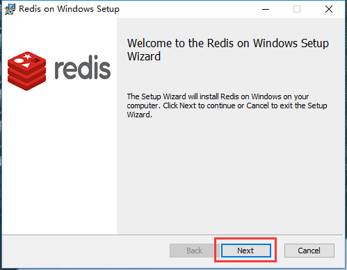
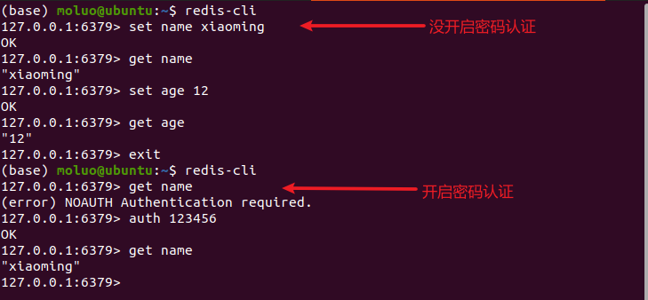

mysql是一种关系型数据库（RDB、RMDBS）。

# 数据库类型

## 关系型数据库（RMDBS）

数据库中表与表的数据之间存在某种关联的内在关系，因为这种关系，所以我们称这种数据库为关系型数据库。

典型：Mysql/MariaDB、postgreSQL、Oracle、SQLServer、DB2、Access、SQLlite3

特点： 

1. 全部使用SQL（结构化查询语言）进行数据库操作。
2. 都存在主外键关系，表，等等关系特征。
3. 大部分都支持各种关系型的数据库的特性：存储过程、触发器、视图、临时表、模式、函数


## 非关系型数据库（NoSQL）

NOSQL：not only sql，泛指非关系型数据库。

泛指那些不使用SQL语句进行数据操作的数据库，所有数据库中只要不使用SQL语句的都是非关系型数据库。

典型：Redis、MongoDB、hbase、 Hadoop、elasticsearch、图数据库。。。。

特点：

1. 每一款都不一样。用途不一致，功能不一致，各有各的操作方式。
2. 基本不支持主外键关系，也没有事务的概念。（MongoDB号称最接近关系型数据库的，所以MongoDB有这些的。）

# redis

Redis（Remote Dictionary Server ，远程字典服务） 是一个高性能的key-value数据格式的内存数据库，是NoSQL数据库。redis的出现主要是为了替代早起的Memcache缓存系统的。
内存型(数据存放在内存中)的非关系型(nosql)key-value(键值存储)数据库，
支持数据的持久化(基于RDB和AOF，注: 数据持久化时将数据存放到文件中，每次启动redis之后会先将文
件中数据加载到内存)，经常用来做缓存、数据共享、购物车、消息队列、计数器、限流等。(最基本的就是缓存一些经常用到的数据，提高读写速度)。

redis的官方只提供了linux版本的redis，window系统的redis是微软团队根据官方的linux版本高仿的。

官方原版: https://redis.io/

中文官网:http://www.redis.cn

## 3.1 redis下载和安装

下载地址： https://github.com/MicrosoftArchive/redis/releases

 




 


使用以下命令启动redis服务端

```
redis-server C:/tool/redis/redis.windows.conf
```


关闭上面这个cmd窗口就关闭redis服务器服务了。


**redis作为windows服务启动方式**

```
redis-server --service-install redis.windows.conf
```


启动服务：redis-server --service-start
停止服务：redis-server --service-stop

```
# 如果连接操作redis，可以在终端下，使用以下命令：
redis-cli
```

ubuntu下安装：

```python
安装命令：sudo apt-get install -y redis-server
卸载命令：sudo apt-get purge --auto-remove redis-server 
关闭命令：sudo service redis-server stop 
开启命令：sudo service redis-server start 
重启命令：sudo service redis-server restart
配置文件：/etc/redis/redis.conf
```


## 3.2 redis的配置

```bash
sudo cat /etc/redis/redis.conf
```

redis 安装成功以后,window下的配置文件保存在软件 安装目录下,如果是mac或者linux,则默认安装/etc/redis/redis.conf

### 3.2.1 redis的核心配置选项

redis与mysql类似，也是C/S架构的软件，所以存在客户端和服务端，默认的redis的服务端时redis-server，默认提供的redis客户端是redis-cli。

绑定ip：如果需要远程访问，可将此注释，或绑定1个真实ip

```bash
bind 127.0.0.1
```

端⼝，默认为6379

```bash
port 6379
```

是否以守护进程运行 [windows下需要设置]

- 如果以守护进程运行，则不会在命令阻塞，类似于服务
- 如果以守护进程运行，则当前终端被阻塞
- 设置为yes表示守护进程，设置为no表示⾮守护进程
- 推荐设置为yes

```bash
daemonize yes
```

RDB持久化的备份文件

```bash
dbfilename dump.rdb
```

RDB持久化数据库数据文件的所在目录

```bash
dir /var/lib/redis
```

日志等级和日期文件的所在目录

```bash
loglevel notice
logfile /var/log/redis/redis-server.log
```

进程ID文件

```bash
pidfile /var/run/redis/redis-server.pid
```

数据库，默认有16个，数据名是不能自定义的，只能是0-15之间，当然这个15是数据库数量-1

```bash
database 16
```

redis的登录密码，生产阶段打开，开发阶段避免麻烦，一般都是注释的。

```
# requirepass foobared
```

注意：开启了以后，redis-cli终端下使用 `auth 密码`来认证登录。



RDB持久化的备份频率，文件格式是二进制

```python
save 900 1
save 300 10
save 60 10000
```

RDB持久化备份文件的文件名和路径

```python
dbfilename dump.rdb
dir /var/lib/redis
```


AOF持久化的开启配置项，默认是no关闭的。备份的文件格式：文本格式

```bash
appendonly no
```

AOF持久化的备份文件，存储路径与RDB备份文件路径是一致的。

```bash
appendfilename "appendonly.aof"
```

AOF持久化备份的频率[时间]

```bash
# appendfsync always   # 每次修改键对应数据时都会触发一次aof
appendfsync everysec    # 每秒备份，工作中最常用。
# appendfsync no
```

一主二从三哨兵


### 3.2.2 Redis的使用

redis是一款基于CS架构的数据库，所以redis有客户端redis-cli，也有服务端redis-server。

其中，客户端可以使用python等编程语言，也可以终端下使用命令行工具管理redis数据库，甚至可以安装一些别人开发的界面工具，例如：RDM。


redis-cli客户端连接服务器：

```bash
# redis-cli -h `redis服务器ip` -p `redis服务器port`
redis-cli -h 10.16.244.3 -p 6379
```


## 3.3 redis数据类型

```
redis就是一个全局的大字典，key就是数据的唯一标识符。根据key对应的值不同，可以划分成5个基本数据类型。
1. string类型:
	字符串类型，是 Redis 中最为基础的数据存储类型，它在 Redis 中是二进制安全的，也就是byte类型。
	单个数据的最大容量是512M。
		key: b"值"
	
2. hash类型:
	哈希类型，用于存储对象/字典，对象/字典的结构为键值对。key、域、值的类型都为string。域在同一个hash中是唯一的。
		key:{
            域（属性）: 值，
            域:值，            
            域:值，
            域:值，
            ...
		}
3. list类型:
	列表类型，它的子成员类型为string。
		key: [ 值1，值2, 值3..... ]
4. set类型:
	无序集合，它的子成员类型为string类型，元素唯一不重复，没有修改操作。
		key: {值1, 值4, 值3, ...., 值5}

5. zset类型(sortedSet):
	有序集合，它的子成员值的类型为string类型，元素唯一不重复，没有修改操作。权重值1从小到大排列。
		key: {
			值1 权重值1(数字);
			值2 权重值2;
			值3 权重值3;
			值4 权重值4;
		}
```

redis中的所有数据操作，如果设置的键不存在则为添加，如果设置的键已经存在则修改

### 3.4 string

#### 设置键值

set 设置的数据没有额外操作时，是不会过期的。

```bash
set key value
```

设置键为`name`值为`xiaoming`的数据

```bash
set name xiaoming
```


设置一个键，当键不存在时才能设置成功，用于一个变量只能被设置一次的情况。

```bash
setnx  key  value
```

一般用于给数据加锁

```bash
127.0.0.1:6379> setnx goods_1 101
(integer) 1
127.0.0.1:6379> setnx goods_1 102
(integer) 0  # 表示设置不成功

127.0.0.1:6379> del goods_1
(integer) 1
127.0.0.1:6379> setnx goods_1 102
(integer) 1
```


#### 设置键值的过期时间

redis中可以对一切的数据进行设置有效期。

以秒为单位

```bash
setex key seconds value
```

设置键为`name`值为`xiaoming`过期时间为20秒的数据

```bash
setex name 20 xiaoming
```

实用set设置的数据会永久存储在redis中，如果实用setex对同名的key进行设置，可以把永久有效的数据设置为有时间的临时数据。


#### 设置多个键值

```bash
mset key1 value1 key2 value2 ...
```

例3：设置键为`a1`值为`python`、键为`a2`值为`java`、键为`a3`值为`c`

```bash
mset a1 python a2 java a3 c
```


#### 字符串拼接值

```bash
append key value
```

向键为`a1`中拼接值`haha`

```bash
append title "我的"
append title "redis"
append title "学习之路"
```

#### 根据键获取值

根据键获取值，如果不存在此键则返回`nil`，相当于python的None

```bash
get key
```

获取键`name`的值

```bash
get name
```

根据多个键获取多个值

```bash
mget key1 key2 ...
```

获取键`a1、a2、a3`的值

```bash
mget a1 a2 a3
```

####  自增自减

```bash
set id 1
incr id   # 相当于id+1
get id    # 2
incr id   # 相当于id+1
get id    # 3


set goods_id_1 10
decr goods_id_1  # 相当于 id-1
get goods_id_1    # 8
decr goods_id_1   # 相当于id-1
get goods_id_1    # 8
```


#### 获取字符串的长度

```bash
set name xiaoming
strlen name  # 8 
```


#### 比特流操作

签到记录

8位就是1byte  ==>  0010 0100

```bash
BITCOUNT   # 统计字符串被设置为1的bit数.
BITPOS     # 返回字符串里面第一个被设置为1或者0的bit位。
SETBIT     # 设置一个bit数据的值 
GETBIT     # 获取一个bit数据的值
```

```bash
SETBIT mykey 7 1   
# 00000001
getbit mykey 7
# 00000001
SETBIT mykey 4 1
# 00001001
SETBIT mykey 15 1
# 0000100100000001
BITCOUNT mykey
# 3
BITPOS mykey 1
# 4
```


### 3.5 key操作

redis中所有的数据都是通过key（键）来进行操作，这里我们学习一下关于任何数据类型都通用的命令。

#### 查找键

参数支持简单的正则表达式

```bash
keys pattern
```

查看所有键

```bash
keys *
```

例子：

```bash
# 查看名称中包含`a`的键
keys *a*
# 查看以a开头的键
keys a*
# 查看以a结尾的键
keys *a
# 数字结尾
keys *[1-9]
```


#### 判断键是否存在

如果存在返回`1`，不存在返回`0`

```bash
exists key1
```

判断键`title`是否存在

```bash
exists title
```

#### 查看键的数据类型

```bash
type key

# string    字符串
# hash      哈希类型
# list      列表类型
# set       无序集合
# zset      有序集合
```

查看键的值类型

```bash
type name
# string
sadd member_list xiaoming xiaohong xiaobai
# (integer) 3
type member_list
# set
hset user_1 name xiaobai age 17 sex 1
# (integer) 3
type user_1
# hash
lpush brothers zhangfei guangyu liubei xiaohei
# (integer) 4
type brothers
# list

zadd achievements 61 xiaoming 62 xiaohong 83 xiaobai  78 xiaohei 87 xiaohui 99 xiaolong
# (integer) 6
type achievements
# zset
```

#### 删除键以及键对应的值

```bash
del key1 key2 ...
```

#### 查看键的有效期

```bash
ttl key

# 结果结果是秒作为单位的整数
# -1 表示永不过期
# -2 表示当前数据已经过期，查看一个不存在的数据的有效期就是-2
```


#### 设置key的有效期

给已有的数据重新设置有效期，redis中所有的数据都可以通过expire来设置它的有效期。有效期到了，数据就被删除。

```bash
expire key seconds
```

#### 清空所有key

慎用，一旦执行，则redis所有数据库0~15的全部key都会被清除

```bash
flushall
```

#### key重命名

```bash
rename  oldkey newkey
```

把name重命名为username

```bash
set name xioaming
rename name username
get username
```

select切换数据库

```bash
redis的配置文件中，默认有0~15之间的16个数据库，默认操作的就是0号数据库
select <数据库ID>
```

操作效果：

```bash
# 默认处于0号库
127.0.0.1:6379> select 1
OK
# 这是在1号库
127.0.0.1:6379[1]> set name xiaoming
OK
127.0.0.1:6379[1]> select 2
OK
# 这是在2号库
127.0.0.1:6379[2]> set name xiaohei
OK
```

auth认证

```bash
在redis中，如果配置了requirepass登录密码，则进入redis-cli的操作数据之前，必须要进行登录认证。
注意：在redis6.0以后，redis新增了用户名和密码登录，可以选择使用，也可以选择不适用，默认关闭的。
      在redis6.0以前，redis只可以在配置文件中，可以选择开启密码认证，也可以关闭密码认证，默认关闭的。
      
redis-cli
127.0.0.1:6379> auth <密码>
OK  # 认证通过
```


### 3.6 hash

类似python的字典，但是成员只能是string，专门用于结构化的数据信息。

结构：

```
键key:{
   	域field:值value
}
```

#### 设置指定键的属性/域

设置指定键的单个属性，如果key不存在，则表示创建一个key对应的哈希数据，如果key存在，而field不存在，则表示当前哈希数据新增一个成员，如果field存在，则表示修改哈希对应的对应成员的值。

```bash
hset key field value
# redis5.0版本以后，hset可以一次性设置多个哈希的成员数据
hset key field1 value1 field2 value2 field3 value3 ...
```

设置键 `user_1`的属性`name`为`xiaoming`

```bash
127.0.0.1:6379> hset user_1 name xiaoming   # user_1没有会自动创建
(integer) 1
127.0.0.1:6379> hset user_1 name xiaohei    # user_1中重复的属性会被修改
(integer) 0
127.0.0.1:6379> hset user_1 age 16          # user_1中重复的属性会被新增
(integer) 1
127.0.0.1:6379> hset user:1 name xiaohui    # user:1会在redis界面操作中以:作为目录分隔符
(integer) 1
127.0.0.1:6379> hset user:1 age 15
(integer) 1
127.0.0.1:6379> hset user:2 name xiaohong age 16  # 一次性添加或修改多个属性
```

设置指定键的多个属性[hmset已经慢慢淘汰了，hset就可以实现多个属性]

```bash
hmset key field1 value1 field2 value2 ...
```

设置键`user_1`的属性`name`为`xiaohong`、属性`age`为`17`，属性`sex`为1

```bash
hmset user:3 name xiaohong age 17 sex 1
```

#### 获取指定键的域/属性的值

获取指定键所有的域/属性

```bash
hkeys key
```

获取键user的所有域/属性

```bash
127.0.0.1:6379> hkeys user:2
1) "name"
2) "age"
127.0.0.1:6379> hkeys user:3
1) "name"
2) "age"
3) "sex"
```

获取指定键的单个域/属性的值

```
hget key field
```

获取键`user:3`属性`name`的值

```bash
127.0.0.1:6379> hget user:3 name
"xiaohong"
```

获取指定键的多个域/属性的值

```bash
hmget key field1 field2 ...
```

获取键`user:2`属性`name`、`age`的值

```bash
127.0.0.1:6379> hmget user:2 name age
1) "xiaohong"
2) "16"
```

获取指定键的所有值

```bash
hvals key
```

获取指定键的所有域值对

```bash
127.0.0.1:6379> hvals user:3
1) "xiaohong"
2) "17"
3) "1"
```
获取哈希的所有成员域值对

```python
hgetall key
```

#### 删除指定键的域/属性

```bash
hdel key field1 field2 ...
```

删除键`user:3`的属性`sex/age/name`，当键中的hash数据没有任何属性，则当前键会被redis删除

```bash
hdel user:3 sex age name
```

#### 判断指定属性/域是否存在于当前键对应的hash中

```bash
hexists   key  field
```

判断user:2中是否存在age属性

```bash
127.0.0.1:6379> hexists user:3 age
(integer) 0
127.0.0.1:6379> hexists user:2 age
(integer) 1
127.0.0.1:6379> 
```

#### 属性值自增自减

```bash
hincrby key field number
```

给user:2的age属性在原值基础上+/-10，然后在age现有值的基础上-2

```bash
# 按指定数值自增
127.0.0.1:6379> hincrby user:2 age 10
(integer) 77
127.0.0.1:6379> hincrby user:2 age 10
(integer) 87

# 按指定数值自减
127.0.0.1:6379> hincrby user:2 age -10
(integer) 77
127.0.0.1:6379> hincrby user:2 age -10
```


### 3.7 list

类似python的lis列表数据类型，但是redis中的list的子成员类型为string。

#### 添加子成员

```bash
# 在左侧(前，上)添加一条或多条成员数据
lpush key value1 value2 ...

# 在右侧(后，下)添加一条或多条成员数据
rpush key value1 value2 ...

# 在指定元素的左边(前)/右边（后）插入一个或多个数据
linsert key before 指定成员 value1 value2 ....
linsert key after 指定成员 value1 value2 ....
```

从键为`brother`的列表左侧添加一个或多个数据`liubei、guanyu、zhangfei`

```bash
lpush brother liubei
# [liubei]
lpush brother guanyu zhangfei xiaoming
# [xiaoming,zhangfei,guanyu,liubei]
```

从键为brother的列表右侧添加一个或多个数据，`xiaohong,xiaobai,xiaohui`

```bash
rpush brother xiaohong
# [xiaoming,zhangfei,guanyu,liubei,xiaohong]
rpush brother xiaobai xiaohui
# [xiaoming,zhangfei,guanyu,liubei,xiaohong,xiaobai,xiaohui]
```

从key=brother，key=xiaohong的列表位置左侧添加一个数据，`xiaoA,xiaoB`

```bash
linsert brother before xiaohong xiaoA
# [xiaoming,zhangfei,guanyu,liubei,xiaoA,xiaohong,xiaobai,xiaohui]
linsert brother before xiaohong xiaoB
# [xiaoming,zhangfei,guanyu,liubei,xiaoA,xiaoB,xiaohong,xiaobai,xiaohui]
```

从key=brother，key=xiaohong的列表位置右侧添加一个数据，`xiaoC,xiaoD`

```bash
linsert brother after xiaohong xiaoC
# [xiaoming,zhangfei,guanyu,liubei,xiaoA,xiaohong,xiaoC,xiaobai,xiaohui]
linsert brother after xiaohong xiaoD
# [xiaoming,zhangfei,guanyu,liubei,xiaoA,xiaohong,xiaoD,xiaoC,xiaobai,xiaohui]
```

注意：当列表如果存在多个成员值一致的情况下，默认只识别第一个。

```bash
127.0.0.1:6379> linsert brother before xiaoA xiaohong
# [xiaoming,zhangfei,guanyu,liubei,xiaohong,xiaoA,xiaohong,xiaoD,xiaoC,xiaobai,xiaohui]
127.0.0.1:6379> linsert brother before xiaohong xiaoE
# [xiaoming,zhangfei,guanyu,liubei,xiaoE,xiaohong,xiaoA,xiaohong,xiaoD,xiaoC,xiaobai,xiaohui]
127.0.0.1:6379> linsert brother after xiaohong xiaoF
# [xiaoming,zhangfei,guanyu,liubei,xiaoE,xiaohong,xiaoF,xiaoA,xiaohong,xiaoD,xiaoC,xiaobai,xiaohui]
```

#### 设置指定索引位置成员的值

```bash
lset key index value
# 注意：
# redis的列表也有索引，从左往右，从0开始，逐一递增，第1个元素下标为0
# 索引可以是负数，表示尾部开始计数，如`-1`表示最后1个元素
```

修改键为`brother`的列表中下标为`4`的元素值为`xiaohongmao`

```bash
lset brother 4 xiaohonghong
```

#### 删除指定成员

```bash
lrem key count value

# 注意：
# count表示删除的数量，value表示要删除的成员。该命令默认表示将列表从左侧前count个value的元素移除
# count==0，表示删除列表所有值为value的成员
# count >0，表示删除列表左侧开始的前count个value成员
# count <0，表示删除列表右侧开始的前count个value成员
```


#### 获取列表成员

根据指定的索引获取成员的值

```bash
lindex key index
```

获取brother下标为2以及-2的成员

```bash
lindex brother 2
lindex brother -2
```

移除并获取列表的第一个成员或最后一个成员

```bash
lpop key  # 第一个成员出列
rpop key  # 最后一个成员出列
```

获取并移除brother中的第一个成员

```bash
lpop brother
# 开发中往往使用rpush和lpop实现队列的数据结构->实现入列和出列
```

#### 获取列表的切片

闭区间[包括stop]

```bash
lrange key start stop
```

操作：

```bash
# 获取btother的全部成员
lrange brother 0 -1
# 获取brother的前2个成员
lrange brother 0 1
```

#### 获取列表的长度

```bash
llen key
```

获取brother列表的成员个数

```bash
llen brother
```


### 3.8 set

类似python里面的set无序集合， 成员是字符串string，重点就是去重和无序。

#### 添加元素

key不存在，则表示新建集合，如果存在则表示给对应集合新增成员。

```bash
sadd key member1 member2 ...
```

向键`authors`的集合中添加元素`zhangsan`、`lisi`、`wangwu`

```bash
sadd authors zhangsan sili wangwu
```

#### 获取集合的所有的成员

```bash
smembers key
```

获取键`authors`的集合中所有元素

```bash
smembers authors
```

#### 获取集合的长度

```bash
scard keys 
```

获取s2集合的长度

```bash
sadd s2 a c d e

127.0.0.1:6379> scard s2
(integer) 4
```

#### 随机获取一个或多个元素

```bash
spop key [count=1]

# 注意：
# count为可选参数，不填则默认一个。被提取成员会从集合中被删除掉
```

随机获取s2集合的成员

```bash
sadd s2 a c d e

127.0.0.1:6379> spop s2 
"d"
127.0.0.1:6379> spop s2 
"c"
```


#### 删除指定元素

```bash
srem key value
```

删除键`authors`的集合中元素`wangwu`

```bash
srem authors wangwu
```


#### 交集、差集和并集

```bash
sinter  key1 key2 key3 ....    # 交集，比较多个集合中共同存在的成员
sdiff   key1 key2 key3 ....    # 差集，比较多个集合中不同的成员
sunion  key1 key2 key3 ....    # 并集，合并所有集合的成员，并去重
```


```bash
sadd user:1 1 2 3 4     # user:1 = {1,2,3,4}
sadd user:2 1 3 4 5     # user:2 = {1,3,4,5}
sadd user:3 1 3 5 6     # user:3 = {1,3,5,6}
sadd user:4 2 3 4       # user:4 = {2,3,4}

# 交集
127.0.0.1:6379> sinter user:1 user:2
1) "1"
2) "3"
3) "4"
127.0.0.1:6379> sinter user:1 user:3
1) "1"
2) "3"
127.0.0.1:6379> sinter user:1 user:4
1) "2"
2) "3"
3) "4"

127.0.0.1:6379> sinter user:2 user:4
1) "3"
2) "4"

# 并集
127.0.0.1:6379> sunion user:1 user:2 user:4
1) "1"
2) "2"
3) "3"
4) "4"
5) "5"

# 差集
127.0.0.1:6379> sdiff user:2 user:3
1) "4"  # 此时可以给user:3推荐4

127.0.0.1:6379> sdiff user:3 user:2
1) "6"  # 此时可以给user:2推荐6

127.0.0.1:6379> sdiff user:1 user:3
1) "2"
2) "4"
```


### 3.9 zset

有序集合，去重并且根据score权重值来进行排序的。score从小到大排列。

#### 添加成员

key如果不存在，则表示新建有序集合。

```bash
zadd key score1 member1 score2 member2 score3 member3 ....
```

设置榜单achievements，设置成绩和用户名作为achievements的成员

```bash
127.0.0.1:6379> zadd achievements 61 xiaoming 62 xiaohong 83 xiaobai  78 xiaohei 87 xiaohui 99 xiaolan
(integer) 6
127.0.0.1:6379> zadd achievements 85 xiaohuang 
(integer) 1
127.0.0.1:6379> zadd achievements 54 xiaoqing
```

#### 给指定成员增加权重值

```bash
zincrby key score member
```

给achievements中xiaobai增加10分

```bash
127.0.0.1:6379> ZINCRBY achievements 10 xiaobai
"93
```


#### 获取集合长度

```bash
zcard key
```

获取users的长度

```bash
zcard achievements
```

#### 获取指定成员的权重值

```bash
zscore key member
```

获取users中xiaoming的成绩

```bash
127.0.0.1:6379> zscore achievements xiaobai
"93"
127.0.0.1:6379> zscore achievements xiaohong
"62"
127.0.0.1:6379> zscore achievements xiaoming
"61"
```

#### 获取指定成员在集合中的排名

排名从0开始计算

```bash
srank key member      # score从小到大的排名   # redis 5.0版本有这个命令。4.0没有
zrevrank key member   # score从大到小的排名
```

获取achievements中xiaohei的分数排名，从大到小

```bash
127.0.0.1:6379> zrevrank achievements xiaohei
(integer) 4
```

#### 获取score在指定区间的所有成员数量

```bash
zcount key min max
```

获取achievements从0~60分之间的人数[闭区间]

```bash
127.0.0.1:6379> zadd achievements 60 xiaolv
(integer) 1
127.0.0.1:6379> zcount achievements 0 60
(integer) 2
127.0.0.1:6379> zcount achievements 54 60
(integer) 2
```

#### 获取score在指定区间的所有成员

```bash
zrangebyscore key min max     # 按score进行从低往高排序获取指定score区间
zrevrangebyscore key min max  # 按score进行从高往低排序获取指定score区间
zrange key start stop         # 按scoer进行从低往高排序获取指定索引区间
zrevrange key start stop      # 按scoer进行从高往低排序获取指定索引区间
```

获取users中60-70之间的数据

```bash
127.0.0.1:6379> zrangebyscore achievements 60 90
1) "xiaolv"
2) "xiaoming"
3) "xiaohong"
4) "xiaohei"
5) "xiaohuang"
6) "xiaohui"
127.0.0.1:6379> zrangebyscore achievements 60 80
1) "xiaolv"
2) "xiaoming"
3) "xiaohong"
4) "xiaohei"
```

```bash
# 获取achievements中分数最低的3个数据
127.0.0.1:6379> zrange achievements 0 2
1) "xiaoqing"
2) "xiaolv"
3) "xiaoming"

# 获取achievements中分数最高的3个数据
127.0.0.1:6379> zrevrange achievements 0 2
1) "xiaolan"
2) "xiaobai"
3) "xiaohui"
```


#### 删除成员

```bash
zrem key member1 member2 member3 ....
```

从achievements中删除xiaoming的数据

```bash
zrem achievements xiaoming
```


#### 删除指定数量的成员

```bash
# 删除指定数量的成员，从最低score开始删除
zpopmin key [count]
# 删除指定数量的成员，从最高score开始删除
zpopmax key [count]
```

例子：

```bash
# 从achievements中提取并删除成绩最低的2个数据
127.0.0.1:6379> zpopmin achievements 2
1) "xiaoqing"
2) "54"
3) "xiaolv"
4) "60"


# 从achievements中提取并删除成绩最高的2个数据
127.0.0.1:6379> zpopmax achievements 2
1) "xiaolan"
2) "99"
3) "xiaobai"
4) "93"
```


### 3.10 各种数据类型在开发中的常用业务场景

```
针对各种数据类型它们的特性，使用场景如下:
字符串string: 用于保存一些项目中的普通数据，只要键值对的都可以保存，例如，保存 session/jwt,定时记录状态，倒计时、验证码、防灌水答案
哈希hash：用于保存项目中的一些对象结构/字典数据，但是不能保存多维的字典，例如，商城的购物车，文章信息，json结构数据
列表list：用于保存项目中的列表数据，但是也不能保存多维的列表，例如，消息队列，秒杀系统，排队，浏览历史
无序集合set: 用于保存项目中的一些不能重复的数据，可以用于过滤，例如，候选人名单, 作者名单，
有序集合zset：用于保存项目中一些不能重复，但是需要进行排序的数据, 例如：分数排行榜, 海选人排行榜，热搜排行，
```

开发中，redis常用的业务场景：

```bash
数据缓存、
分布式数据共享、
计数器、
限流、
位统计(用户打卡、签到)、
购物车、
消息队列、
抽奖奖品池、
排行榜单（搜索排名）、
用户关系记录[收藏、点赞、关注、好友、拉黑]、
```

开发中，针对redis的使用，python中一般常用的redis模块有：pyredis（同步），aioredis（异步）。

```bash
pip install py-redis
pip install aioredis
```


## 3.11 python操作redis

这2个模块提供给开发者的使用方式都是一致的。都是以redis命令作为函数名，命令后面的参数作为函数的参数。只有一个特殊：del，del在python属于关键字，所以改成delete即可。

基本使用

```python
from redis import Redis, StrictRedis

if __name__ == '__main__':
    # 连接redis的写法有2种：
    # url="redis://:密码@IP:端口/数据库编号"
    redis = Redis.from_url(url="redis://:@127.0.0.1:6379/0")
    # redis = Redis(host="127.0.0.1", port=6379, password="", db=0)

    # # 字符串
    # # set name xiaomin
    # redis.set("name", "xiaoming")

    # # setex sms_13312345678 30 500021
    # mobile = 13312345678
    # redis.setex(f"sms_{mobile}", 30, "500021")
    #
    # # get name
    # ret = redis.get("name")
    # # redis中最基本的数据类型是字符串，但是这种字符串是bytes，所以对于python而言，读取出来的字符串数据还要decode才能使用
    # print(ret, ret.decode())

    # # 提取数据，键如果不存在，则返回结果为None
    # code_bytes = redis.get(f"sms_{mobile}")
    # print(code_bytes)
    # if code_bytes: # 判断只有获取到数据才需要decode解码
    #     print(code_bytes.decode())

    # 设置字典，单个成员
    # hset user name xiaoming
    # redis.hset("user", "name", "xiaoming")


    # # 设置字典，多个成员
    # # hset user name xiaohong age 12 sex 1
    # data = {
    #     "name": "xiaohong",
    #     "age": 12,
    #     "sex": 1
    # }
    # redis.hset("user", mapping=data)

    # # 获取字典所有成员，字典的所有成员都是键值对，而键值对也是bytes类型，所以需要推导式进行转换
    # ret = redis.hgetall("user")
    # print(ret)  # {b'name': b'xiaohong', b'age': b'12', b'sex': b'1'}
    # data = {key.decode(): value.decode() for (key, value) in ret.items()}
    # print(data)

    # # 获取当前仓库的所有的key
    ret = redis.keys("*")
    print(ret)

    # 删除key
    if len(ret) > 0:
        redis.delete(ret[0])
```

