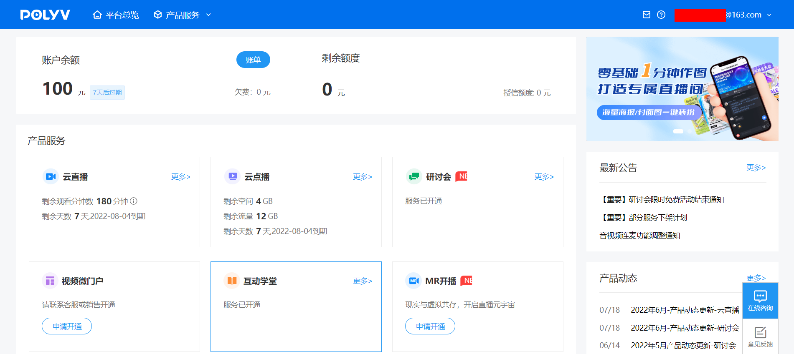
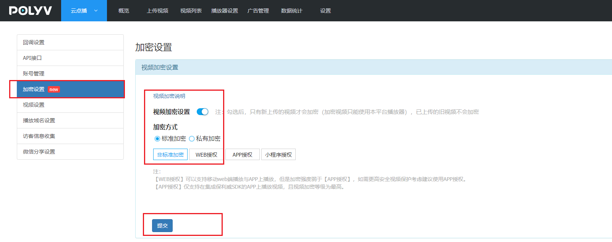
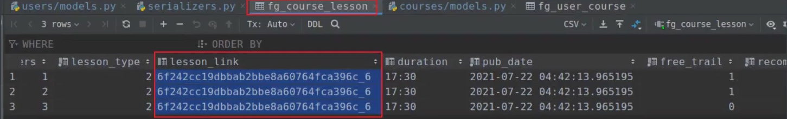

## 我的课程

### 个人中心里面展示我的课程界面效果

`src/components/user/Course.vue`，代码：

```vue
<template>
  <div class="right-container l">
    <div class="right-title">
      <h2>我的课程</h2>
      <ul>
        <li :class="{action: course.current_course_type===-1}"><a href="" @click.prevent="course.current_course_type=-1">全部<i v-if="course.current_course_type===-1">{{course.user_count}}</i></a></li>
        <li :class="{action: course.current_course_type===0}"><a href="" @click.prevent="course.current_course_type=0">免费课<i v-if="course.current_course_type===0">{{course.user_count}}</i></a></li>
        <li :class="{action: course.current_course_type===1}"><a href="" @click.prevent="course.current_course_type=1">项目课<i v-if="course.current_course_type===1">{{course.user_count}}</i></a></li>
        <li :class="{action: course.current_course_type===2}"><a href="" @click.prevent="course.current_course_type=2">学位课<i v-if="course.current_course_type===2">{{course.user_count}}</i></a></li>
      </ul>
    </div>
    <div class="all-course-main">
      <div class="allcourse-content">
        <div class="courseitem">
          <div class="img-box">
            <a href=""> </a>
          </div>
          <div class="info-box">
            <div class="title">
              <span>免费课</span>
              <a href="" class="hd">3天javascript入门到进阶</a>
            </div>
            <div class="study-info">
              <span class="i-left">已学0%</span>
              <span class="i-mid">用时13分</span>
              <span class="i-right">学习至7.01 课程回顾</span>
            </div>
            <div class="catog-points">
              <span> <a href="">笔记 <i>0</i></a> </span>
              <span class="i-mid"> <a href="">代码 <i>0</i></a> </span>
              <span class="i-right"> <a href="">问答 <i>0</i></a> </span>
              <a href="" class="continute-btn">继续学习</a>
            </div>
            <div class="share-box clearfix">
              <div class="show-btn">
                <i class="el-icon-arrow-down"></i>
              </div>
              <div class="share-box-con">
                <a href="javascript:;" title="删除" class="del"><i class="el-icon-delete"></i></a>
                <a href="javascript:;" title="置顶课程"><i class="el-icon-top"></i></a>
              </div>
            </div>
          </div>
        </div>
        <div class="courseitem">
          <div class="img-box">
            <a href=""> </a>
          </div>
          <div class="info-box">
            <div class="title">
              <span>免费课</span>
              <a href="" class="hd">3天javascript入门到进阶</a>
            </div>
            <div class="study-info">
              <span class="i-left">已学0%</span>
              <span class="i-mid">用时13分</span>
              <span class="i-right">学习至7.01 课程回顾</span>
            </div>
            <div class="catog-points">
              <span> <a href="">笔记 <i>0</i></a> </span>
              <span class="i-mid"> <a href="">代码 <i>0</i></a> </span>
              <span class="i-right"> <a href="">问答 <i>0</i></a> </span>
              <a href="" class="continute-btn">继续学习</a>
            </div>
            <div class="share-box clearfix">
              <div class="show-btn">
                <i class="el-icon-arrow-down"></i>
              </div>
              <div class="share-box-con">
                <a href="javascript:;" title="删除" class="del"><i class="el-icon-delete"></i></a>
                <a href="javascript:;" title="置顶课程"><i class="el-icon-top"></i></a>
              </div>
            </div>
          </div>
        </div>
      </div>
      <!-- 分页 -->
    </div>
  </div>
</template>

<script setup>
import course from "../../api/course";
</script>

<style scoped>

.l {
    float: left;
}
.r {
    float: right;
}

.clearfix:after {
    content: '\0020';
    display: block;
    height: 0;
    clear: both;
    visibility: hidden;
}

/*****/
.right-container {
	width: 1284px;
}

.right-container .right-title {
	margin-bottom: 24px
}

.right-container .right-title::after {
	content: '';
	clear: both;
	display: block
}

.right-container .right-title h2 {
	margin-right: 24px;
	float: left;
	font-size: 16px;
	color: #07111b;
	line-height: 32px;
	font-weight: 700
}

.right-container .right-title ul {
	float: left
}

.right-container .right-title ul:before {
	float: left;
	margin-top: 2px;
	margin-right: 20px;
	content: "|";
	color: #d9dde1
}

.right-container .right-title ul li {
	float: left;
	width: 95px;
	line-height: 32px;
	text-align: center;
	font-size: 14px
}

.right-container .right-title ul li.action {
	background: #4d555d;
	border-radius: 16px
}

.right-container .right-title ul li.action a {
	color: #fff
}

.right-container .right-title ul li i {
	padding-left: 5px;
	font-style: normal
}

.right-container .right-title span {
	position: relative;
	float: right;
	color: #93999f;
	font-size: 14px;
	cursor: pointer;
	width: 128px;
	line-height: 32px
}

.right-container .right-title span i {
	float: left;
	margin-top: 8px;
	margin-left: 28px;
	margin-right: 4px;
	font-size: 16px
}

.right-container .right-title span a {
	display: block
}

.right-container .right-title span.action {
	background: #4d555d;
	border-radius: 16px
}

.right-container .right-title span.action a {
	color: #fff
}

.all-course-main {
  margin-top: 28px
}
.allcourse-content {
  width: 100%;
  box-sizing: border-box
}

.courseitem {
	position: relative;
	display: flex;
	flex-direction: row;
	margin-top: 28px
}

.courseitem:first-child {
	margin-top: 0
}

.courseitem .img-box {
	width: 240px;
	margin-right: 30px
}

.courseitem .img-box img {
	vertical-align: top
}

.courseitem .info-box {
	display: flex;
	flex-direction: column;
	border-bottom: 1px solid #d9dde1;
	position: relative;
	padding-bottom: 28px;
	width: 1014px;
}

.courseitem .info-box .title {
	display: flex;
	flex-direction: row;
	align-items: center
}

.courseitem .info-box .title span:first-child {
	background: #f5f7fa;
	border-radius: 2px;
	width: 62px;
	height: 20px;
	text-align: center;
	line-height: 20px;
	font-size: 12px;
	color: #9199a1;
	font-weight: 400;
	margin-right: 12px
}

.courseitem .info-box .title .hd {
	font-size: 20px;
	color: #07111b;
	font-weight: 700;
	line-height: 36px;
	overflow: hidden;
	white-space: nowrap;
	text-overflow: ellipsis
}

.courseitem .info-box .study-info {
	display: flex;
	flex-direction: row;
	align-items: center;
	margin-bottom: 12px
}

.courseitem .info-box .study-info span {
	line-height: 24px;
	font-size: 14px;
	color: #4d555d;
	margin-right: 24px
}

.courseitem .info-box .study-info span.i-left {
	color: #f20d0d
}

.courseitem .info-box .follows-path i {
	font-style: normal;
	margin: 0 4px
}

.courseitem .info-box .catog-points {
	display: flex;
	flex-direction: row;
	align-items: center
}

.courseitem .info-box .catog-points span {
	font-size: 14px;
	line-height: 36px;
	color: #4d555d;
	margin-right: 36px
}

.courseitem .info-box .catog-points span a {
	color: #4d555d
}

.courseitem .info-box .catog-points span a:hover {
	color: #14191e
}

.courseitem .info-box .catog-points span i {
	color: #93999f;
	font-style: normal
}

.courseitem .info-box .catog-points .continute-btn {
	display: inline-block;
	position: absolute;
	right: 0;
	font-size: 14px;
	border: none;
	color: #fff;
	width: 104px;
	height: 36px;
	line-height: 36px;
	text-align: center;
	background: rgba(240,20,20,.6);
	border-radius: 18px
}

.courseitem .info-box .catog-points .continute-btn:hover {
	background-color: #f01414;
	color: #fff
}

.courseitem .info-box .path-course span {
	margin-right: 6px;
	display: inline-block
}

.courseitem .info-box .share-box .show-btn {
	top: -20px
}
.share-box .show-btn {
    position: absolute;
    top: 8px;
    right: 0;
    width: 30px;
    height: 20px;
    font-size: 18px;
    text-align: center;
    line-height: 20px;
    color: #bdc0c3;
    cursor: pointer;
}
.courseitem .info-box .share-box-con {
	width: auto;
	top: 0;
	height: auto
}
.share-box:hover .share-box-con {
  display: block;
}
.share-box .share-box-con {
  display: none;
  position: absolute;
  z-index: 99;
  top: 22px;
  right: 0;
  font-size: 20px;
  background-color: #fff;
  padding: 0 8px;
  box-shadow: 4px 4px 10px 2px #e1e1e1;
}
</style>
```

`router/index.js`，路由，代码：

```javascript
import {createRouter,createWebHistory} from 'vue-router';
import store from "../store";

// 路由列表
const routes = [
  {
    meta:{
      title:"luffy2.0-站点首页",
      keepalive:true
    },
    path:'/', //url访问地址
    name:"Home",
    component: ()=> import("../views/Home.vue")
  },
  {
    meta:{
      title:"luffy2.0-用户登录",
      keepalive: true
    },
    path:'/login',
    name:"Login",
    component:()=>import("../views/Login.vue")
  },
  {
    meta:{
      title: "luffy2.0-用户注册",
      keepAlive: true
    },
    path: '/register',
    name: "Register",            // 路由名称
    component: ()=> import("../views/Register.vue"),         // uri绑定的组件页面
  },
  {
    meta:{
        title: "luffy2.0-个人中心",
        keepAlive: true,
        authorization:true,
    },
    path: '/user',
    name: "User",
    component: ()=> import("../views/User.vue"),
    children: [
        {
          meta:{
            title: "luffy2.0-个人信息",
            keepAlive: true,
            authorization: true,
          },
          path: '',
          name: "UserInfo",
          component: ()=> import("../components/user/Info.vue"),
        },
        {
          meta:{
            title: "luffy2.0--我的订单",
            keepAlive: true,
            authorization: true,
          },
          path: 'order',
          name: "UserOrder",
          component: ()=> import("../components/user/Order.vue"),
        },
        {
          meta:{
            title: "luffy2.0-我的课程",   // 新增我的课程
            keepAlive: true
          },
          path: 'course',
          name: "UserCourse",
          component: ()=> import("../components/user/Course.vue"),
        },
      ]
  },
  {
    meta:{
        title: "luffy2.0-课程列表",
        keepAlive: true,
    },
    path: '/project',
    name: "Course",
    component: ()=> import("../views/Course.vue"),
  },
    {
    meta:{
        title: "luffy2.0-课程详情",
        keepAlive: true
    },
    path: '/project/:id',     // :id vue的路径参数，代表了课程的ID
    name: "Info",
    component: ()=> import("../views/Info.vue"),
  },
    {
      meta:{
        title: "luffy2.0-购物车",
        keepAlive: true
      },
      path: '/cart',
      name: "Cart",
      component: ()=> import("../views/Cart.vue"),
    },
    {
      meta:{
        title: "确认下单",
        keepAlive: true
      },
      path: '/order',
      name: "Order",
      component: ()=> import("../views/Order.vue"),
    },
    {
      meta:{
        title: "支付成功",
        keepAlive: true
      },
      path: '/alipay',
      name: "PaySuccess",
      component: ()=> import("../views/AliPaySuccess.vue"),
    },

]

// 路由对象实例化
const router = createRouter({
  // history, 指定路由的模式
  history: createWebHistory(),
  // 路由列表
  routes,
});


// 导航守卫
router.beforeEach((to, from, next)=>{
  document.title=to.meta.title
  // 登录状态验证
  if (to.meta.authorization && !store.getters.getUserInfo) {
    next({"name": "Login"})
  }else{
    next()
  }
})


// 暴露路由对象
export default router
```

`api/course.js`，代码：

```javascript
import http from "../utils/http";
import {reactive, ref} from "vue"


const course = reactive({
    // ... 代码省略。。。
    course_type: [],  // 我的课程-课程类型列表
    current_course_type: -1,  // 我的课程-当前显示的课程类型，默认为-1，表示全部
    user_course_count: 0,    // 我的课程-课程列表总数
    user_course_list:[], // 用户中心的课程列表
    // ... 代码省略。。。
})

export default course;
```


#### 提供我的课程类型接口

`courses/views.py`，代码：

```python
class CourseTypeListAPIView(APIView):
    """课程类型"""
    def get(self, request):
        return Response(Course.COURSE_TYPE)
```

courses/models.py，代码：

```python
class Course(BaseModel):
    COURSE_TYPE = (
        (0, '实战课程'),
        (1, '会员专享'),
        (2, '学位课程'),
    )
    # // ... 代码省略
    # // ... 代码省略
    # // ... 代码省略
    course_type = models.SmallIntegerField(choices=COURSE_TYPE, default=0, verbose_name="付费类型")
```

`courses/urls.py`，代码：

```python
path("type/", views.CourseTypeListAPIView.as_view()),
```


### 服务端提供我的课程列表信息api接口

因为前面我们把课程与用户的关系模型UserCourse声明在了users/models.py下， 所以现在代码跟着模型走，为方便代码管理，当前我的课程功能也一并写在当前子应用users下。

`users/views.py`，代码：

```python
### 代码省略
from rest_framework.generics import ListAPIView
from rest_framework.permissions import IsAuthenticated
from .serializers import UserCourseModelSerializer
from courses.paginations import CourseListPageNumberPagination
from .models import UserCourse
from courses.models import Course

class CourseListAPIView(ListAPIView):
    """当前用户的课程列表信息"""
    permission_classes = [IsAuthenticated]
    serializer_class = UserCourseModelSerializer
    pagination_class = CourseListPageNumberPagination

    def get_queryset(self):
        user = self.request.user
        query = UserCourse.objects.filter(user=user)
        course_type = int(self.request.query_params.get("type", -1))
        course_type_list = [item[0] for item in Course.COURSE_TYPE]
        if course_type in course_type_list:
            query = query.filter(course__course_type=course_type)
        return query.order_by("-id").all()
```

`users/serializers.py`，代码：

```python
from .models import UserCourse


class UserCourseModelSerializer(serializers.ModelSerializer):
    """用户课程信息序列化器"""
    course_cover = serializers.ImageField(source="course.course_cover")
    course_name = serializers.CharField(source="course.name")
    chapter_name = serializers.CharField(source="chapter.name", default="")
    chapter_id = serializers.IntegerField(source="chapter.id", default=0)
    chapter_orders = serializers.IntegerField(source="chapter.orders", default=0)
    lesson_id = serializers.IntegerField(source="lesson.id", default=0)
    lesson_name = serializers.CharField(source="lesson.name", default="")
    lesson_orders = serializers.IntegerField(source="lesson.orders", default=0)
    course_type = serializers.IntegerField(source="course.course_type", default=0)
    get_course_type_display = serializers.CharField(source="course.get_course_type_display",default="")

    class Meta:
        model = UserCourse
        fields = [
            "course_id", "course_cover",  "course_name", "study_time",
            "chapter_id", "chapter_orders", "chapter_name",
            "lesson_id", "lesson_orders", "lesson_name",
            "course_type", "get_course_type_display", "progress",
            "note", "qa", "code"
        ]

```

根据界面需要，我们可以看出来，当前页面还需要用户在学习过程中的笔记数量，代码数量和问答次数。这些功能，我们虽然没有做到，但是可以预设一个字段，留待将来。

users/models.py，代码：

```python

from courses.models import Course,CourseChapter,CourseLesson
class UserCourse(BaseModel):
    """用户的课程"""
    user   = models.ForeignKey(User, related_name='user_courses', on_delete=models.CASCADE,verbose_name="用户", db_constraint=False)
    course = models.ForeignKey(Course, related_name='course_users', on_delete=models.CASCADE, verbose_name="课程名称", db_constraint=False)
    chapter = models.ForeignKey(CourseChapter, related_name="user_chapter", on_delete=models.DO_NOTHING, null=True, blank=True, verbose_name="章节信息", db_constraint=False)
    lesson = models.ForeignKey(CourseLesson, related_name="user_lesson", on_delete=models.DO_NOTHING, null=True, blank=True, verbose_name="课时信息", db_constraint=False)
    study_time = models.IntegerField(default=0, verbose_name="学习时长")

    class Meta:
        db_table = 'fg_user_course'
        verbose_name = '用户课程购买记录'
        verbose_name_plural = verbose_name

    def progress(self):
        """学习进度值"""
        # 获取当前课程学习的最后一个章节
        if not self.chapter:
            return 0

        # 获取当前课程的总章数
        chapter_total = self.course.chapter_list.count()
        if chapter_total < 1:
            return 0

        # 获取当前已经完成学习的章节的序号
        chapter_order = self.chapter.orders - 1
        # 获取章节学习进度
        chapter_progress = float(f"{((chapter_order / chapter_total) * 100):.2f}")

        # 获取当前最后学习章节的总课时
        lesson_total = self.chapter.lesson_list.count()
        if lesson_total < 1:
            return 0

        # 获取当前已经完成学习的课时的序号
        lesson_order = self.lesson.orders - 1
        # 获取课时学习进度
        lesson_progress = float(f"{((lesson_order / lesson_total) * 100):.2f}")
        # 总学习进度 = 章节学习进度 + (100 / 总章数) * 课时学习进度
        # 总学习进度 = 章节学习进度 + 单章学习进度 * 课时学习进度
        course_progress = chapter_progress + (100 / chapter_total) * lesson_progress / 100

        return f"{course_progress:.2f}"

    def note(self):
        """笔记数量"""
        return 0

    def qa(self):
        """问答数量"""
        return 0

    def code(self):
        """代码数量"""
        return 0
```

`users.urls`，代码：

```python
path("course/", views.CourseListAPIView.as_view()),
```

关于上面学习过程中，用户的笔记、问答和代码，我们也是可以把这些数据进行永久保存在数据库中的。那么在实现过程中，我们可以这么理解用户与课程与笔记、问答、代码的关系。


```
一个课程：一共4章，20个课时
我们先知道，用户学习到了第3章，第4个课时
第三章 --->  3/4课程 ---> 当前课程进度：(100% / 总章节) * （当前章节序号-1） = 50%

假设我们先查询第三章有5个课时，我们看到第四个课时，4/5   ---> 
第三章的80%进度  (100% / 总章节) * (总章节-当前章节序号) * （当前课时序号/当前章节总课时） = 25% * 80% = 20%
```


### 客户端展示我的课程列表信息

`src/api/course.js`，代码：

```javascript
import http from "../utils/http";
import {reactive, ref} from "vue"


const course = reactive({
    // 中间代码省略。。。。。
    user_course_count: 0,    // 我的课程-课程列表总数
    user_course_list:[], // 用户中心的课程列表
    // 中间代码省略。。。。。
    get_course_type_list(token){
        // 获取课程类型
        return http.get("/courses/type/")
    },
    get_user_course_list(token){
        // 获取用户的课程列表
        return http.get("/users/course/", {
            params: {
                type: this.current_course_type,
                page: this.page,
                size: this.size,
            },
            headers:{
                Authorization: "jwt " + token,
            }
        })
    },
})

export default course;
```


`src/components/user/Course.vue`，代码：

```vue
<template>
  <div class="right-container l">
    <div class="right-title">
      <h2>我的课程</h2>
      <ul>
        <li :class="{action: course.current_course_type===-1}"><a href="" @click.prevent="course.current_course_type=-1">全部<i v-if="course.current_course_type===-1">{{course.user_course_count}}</i></a></li>
        <li :class="{action: course.current_course_type===type_item[0]}" v-for="type_item in course.course_type">
          <a href="" @click.prevent="course.current_course_type=type_item[0]">{{type_item[1]}}<i v-if="course.current_course_type===type_item[0]">{{course.user_course_count}}</i></a>
        </li>
      </ul>
    </div>
    <div class="all-course-main">
      <div class="allcourse-content">
        <div class="courseitem" v-for="course_info in course.user_course_list">
          <div class="img-box">
            <router-link :to="`/project/${course_info.course_id}`"> </router-link>
          </div>
          <div class="info-box">
            <div class="title">
              <span>{{course_info.get_course_type_display}}</span>
              <router-link :to="`/project/${course_info.course_id}`" class="hd">{{course_info.course_name}}</router-link>
            </div>
            <div class="study-info">
              <span class="i-left">已学{{course_info.progress}}%</span>
              <span class="i-mid">用时<b v-if="course_info.study_time>=3600">{{parseInt(course_info.study_time/3600)}}小时</b><b>{{parseInt(course_info.study_time/60) % 60}}分</b></span>
              <span class="i-right" v-if="course_info.chapter_orders">学习至{{course_info.chapter_orders}}.{{fill0(course_info.lesson_orders)}} {{course_info.lesson_name}}</span>
            </div>
            <div class="catog-points">
              <span> <a href="">笔记 <i>{{course_info.note}}</i></a> </span>
              <span class="i-mid"> <a href="">代码 <i>{{course_info.code}}</i></a> </span>
              <span class="i-right"> <a href="">问答 <i>{{course_info.qa}}</i></a> </span>
              <router-link to="/user/study" class="continute-btn">继续学习</router-link>
            </div>
            <div class="share-box clearfix">
              <div class="show-btn">
                <i class="el-icon-arrow-down"></i>
              </div>
              <div class="share-box-con">
                <a href="javascript:;" title="删除" class="del"><i class="el-icon-delete"></i></a>
                <a href="javascript:;" title="置顶课程"><i class="el-icon-top"></i></a>
              </div>
            </div>
          </div>
        </div>
      </div>
      <!-- 分页 -->
      <div class="page" style="text-align: center; margin-top: 25px;" v-if="course.user_course_count > course.size">
        <el-pagination
            background
            layout="sizes, prev, pager, next, jumper"
            :total="course.user_course_count"
            :page-sizes="[5, 10, 15, 20]"
            :page-size="course.size"
            @current-change="current_page"
            @size-change="current_size"
        ></el-pagination>
      </div>
    </div>
  </div>
</template>
```

```vue
<script setup>
import course from "../../api/course";
import {fill0} from "../../utils/func";
import {watch} from "vue";

// 获取课程类型列表
const get_course_type_list = ()=>{
    course.get_course_type_list().then(response=>{
        course.course_type = response.data
    })
}
get_course_type_list()


// 获取用户的课程列表
const get_course_list = ()=>{
  let token = sessionStorage.token || localStorage.token;
  course.get_user_course_list(token).then(response=>{
    course.user_course_list = response.data.results; // 我的课程列表
    course.user_course_count = response.data.count   // 我的课程总数
  })
}
get_course_list()


// 切换页码
let current_page = (page)=>{
  course.page = page;
}

// 切换分页数据量
let current_size = (size)=>{
  course.size = size;
}


// 监听页码
watch(
    ()=>course.page,
    ()=>{
      get_course_list()
    }
)

// 监听单页展示的课程数量
watch(
    ()=>course.size,
    ()=>{
      course.page = 1
      get_course_list()
    }
)

// 监听课程类型
watch(
    ()=>course.current_course_type,
    ()=>{
      course.page = 1;
      get_course_list()
    }
)

</script>
```

提交代码版本

```bash
cd ~/Desktop/luffycity/
git add .
git commit -m "feature: 个人中心-我的课程功能实现"
git push 
```


## 视频播放

当前项目中有两种视频：免费视频和收费视频[需要加密]。

线上实现视频加密可以采用公司内部搭建的视频点播服务器或第三方视频云服务，例如：阿里云、腾讯云、保利威、七牛云、又拍云。


### 使用保利威云视频服务来对视频进行加密

官方网址：http://www.polyv.net/vod/

注册地址：https://my.polyv.net/v3/register/

注意：

>  开发时通过`免费试用`注册**体验版**账号【测试账号的测试有效期是7天】
>



选择云点播，就可以上传视频到保利威，也可以下载保利威的界面软件上传视频。


要开发播放保利威的加密视频开发功能，需要在设置->API接口和加密设置。


 保利威点播SDK需要配置userid、writetoken、readtoken、secretkey才能解密播放视频。 

```bash
userid: fce2712a86
writetoken: 2f802363-1d15-4278-848d-29a9eda0d320
readtoken: 5dc202ca-0838-411e-b3ab-1659ae007dad
secretkey: uqlJtarKuJ
----------------------------------------------自己的
userid: 69cd548d43
writetoken: 0bd760ce-bb97-4f1e-a0c9-c3ed1bec91a5
readtoken: 04d2e4cd-5991-4aa5-9fb4-45c9cdf4a131
secretkey: QUyq8AcLJh
```

配置视频上传加密。



经过上面的设置，上传的视频就会自动加密，接着我们只需要记录视频的VID保存在项目的对应的课时记录表中即可。


手动把刚刚上面上传的视频的VID填写course_lesson课时记录表里面。




### 服务端获取保利威的视频播放授权token

获取播放加密视频的Token：https://help.polyv.net/index.html#/vod/api/playsafe/token/create_token

web客户端播放加密视频的前端代码：https://help.polyv.net/index.html#/vod/js/video_player/function/encryption

接口测试：https://help.polyv.net/req.html

根据官方文档的案例，针对polvy的token生成的python代码，在libs下创建polyv.py,编写token生成工具函数

```python
import time
import requests
import hashlib

class PolyvPlayer(object):
    def __init__(self, userId, secretkey, tokenUrl):
        """初始化，提供用户id和秘钥"""
        self.userId = userId
        self.secretKey = secretkey
        self.tokenUrl = tokenUrl

    def tomd5(self, value):
        """取md5值"""
        return hashlib.md5(value.encode()).hexdigest()

    # 获取播放加密视频数据的token
    def get_video_token(self, videoId, viewerIp, viewerId=None, viewerName='', extraParams='HTML5'):
        """
        :param videoId: 视频id
        :param viewerId: 看视频用户id
        :param viewerIp: 看视频用户ip
        :param viewerName: 看视频用户昵称
        :param extraParams: 扩展参数
        :param sign: 加密的sign
        :return: 返回点播的视频的token
        """
        ts = int(time.time() * 1000)  # 时间戳
        plain = {
            "userId": self.userId,
            'videoId': videoId,
            'ts': ts,
            'viewerId': viewerId,
            'viewerIp': viewerIp,
            'viewerName': viewerName,
            'extraParams': extraParams
        }

        # 按照ASCKII升序 key + value + key + value... + value 拼接
        plain_sorted = {}
        key_temp = sorted(plain)
        for key in key_temp:
            plain_sorted[key] = plain[key]
        print(plain_sorted)

        plain_string = ''
        for k, v in plain_sorted.items():
            plain_string += str(k) + str(v)
        print(plain_string)

        # 首尾拼接上秘钥
        sign_data = self.secretKey + plain_string + self.secretKey

        # 取sign_data的md5的大写
        sign = self.tomd5(sign_data).upper()

        # 新的带有sign的字典
        plain.update({'sign': sign})
        # python 提供的发送http请求的模块  requests.get
        result = requests.post(
            url=self.tokenUrl,
            headers={"Content-type": "application/x-www-form-urlencoded"},
            data=plain
        ).json()

        ret = {} if isinstance(result, str) else result.get("data", {})

        return ret["token"]
```

配置文件settings/dev.py，代码：

```python
# 保利威视频加密服务
POLYV = {
    "userId": "69cd548d43",
    "writeToken": "0bd760ce-bb97-4f1e-a0c9-c3ed1bec91a5",
    "readToken": "04d2e4cd-5991-4aa5-9fb4-45c9cdf4a131",
    "secretkey": "QUyq8AcLJh",
    "tokenUrl": "https://hls.videocc.net/service/v1/token",
}
```

courses/views.py，视图代码:

```python
from rest_framework.viewsets import ViewSet
from rest_framework.permissions import IsAuthenticated
from django.conf import settings
from luffycityapi.libs.polyv import PolyvPlayer

class PolyvViewSet(ViewSet):
    """保利威云视频服务相关的API接口"""
    permission_classes = [IsAuthenticated]

    def token(self, request, vid):
        """获取视频播放的授权令牌token"""
        userId = settings.POLYV["userId"]
        secretkey = settings.POLYV["secretkey"]
        tokenUrl = settings.POLYV["tokenUrl"]
        polyv = PolyvPlayer(userId, secretkey, tokenUrl)

        user_ip = request.META.get("REMOTE_ADDR")  # 客户端的IP地址
        user_id = request.user.id  # 用户ID
        user_name = request.user.username  # 用户名

        token = polyv.get_video_token(vid, user_ip, user_id, user_name)

        return Response({"token": token})
```

courses/urls.py，路由代码：

```python
    re_path("^polyv/token/(?P<vid>\w+)/$", views.PolyvViewSet.as_view({"get": "token"})),
```


### 客户端请求服务端获取token并播放视频

开发文档：https://help.polyv.net/index.html#/vod/js/video_player/function/encryption

从当前地址下载播放器js核心文件保存到客户端src/utils目录下：http://player.polyv.net/script/player.js

测试实例页面：https://help.polyv.net/web-sdk-demo/index.html#player-vod

创建播放加密视频的页面组件，views/Study.vue，代码：

```vue
<template>
  <div class="player">
    <div id="player"></div>
    <div class="chapter-list">
      <h2>3天django基础</h2>
      <el-tree
        class="filter-tree"
        :data="state.data"
        :props="state.defaultProps"
        default-expand-all
        :filter-node-method="filterNode"
        :ref="ref_tree">
      </el-tree>
    </div>
  </div>
</template>

<script setup>
import {onMounted, reactive, watch} from "vue"
import http from "../utils/http"
import "../utils/player"

const state = reactive({
  // 章节课时列表
  data: [{
    id: 1,
    label: '1. 概述',
    children: [
      {id: 4, label: '1.1 基础环境'},
    ]
  }, {
    id: 2,
    label: '2. 快速入门',
    children: [
      {id: 5, label: '2.1 基本使用步骤'},
      {id: 6, label: '2.2 常用写法'}
    ]
  }, {
    id: 3,
    label: '3. 路由基础',
    children: [
      {id: 7, label: '3.1 路由基本概念'},
      {id: 8, label: '3.2 普通路由'}
    ]
  }],
  defaultProps: {
    children: 'children',
    label: 'label'
  }
})

let polyv = ()=>{
  let token = sessionStorage.token || localStorage.token;
  // 1. 到数据库中查询用户购买的课程，是否有当前章节
  let vid = "705f4d7a89533388239620bc7cefe834_7";

  // 2. 到数据库中查询当前用户购买的课程是否在有效期内
  var player = polyvPlayer({
    wrap: '#player',
    width: document.documentElement.clientWidth - 300, // 页面宽度
    height: document.documentElement.clientHeight,        // 页面高度
    forceH5: true,
    vid: vid,
    code: "root", // 一般是用户昵称
    // 视频加密播放的配置
    playsafe(vid, next){ // 向后端发送请求获取加密的token
      http.get(`courses/polyv/token/${vid}/`, {
        headers: {
          "Authorization": "jwt " + token,
        }
      }).then(response=>{
        // 获取播放视频的token令牌
        next(response.data.token);
      })
    }
  });
}

onMounted(()=>{
  polyv();
  // 监听当前浏览器窗口的大小是否发生变化，让播放器随着窗口变化大小
  window.onresize = ()=>{
    document.querySelector(".pv-video-player").style.width = `${document.documentElement.clientWidth - 300}px`;
    document.querySelector(".pv-video-player").style.height = `${document.documentElement.clientHeight}px`;
  }

  let video = document.querySelector(".pv-video")
  // 监听是否是否播放中
  video.ontimeupdate = ()=>{
    console.log(video.currentTime)
    // 每隔几秒，发送一次ajax到服务端更新学习进度和课时进度
  }
})

</script>

<style scoped>
.chapter-list{
  position: absolute;
  top: 0;
  right: 0;
  width: 300px;
  background-color: #ccc;
}
.chapter-list h2 {
  height: 40px;
  line-height: 40px;
  text-indent: 1rem;
}
</style>
```

前端路由，`router/index.js`，代码：

```javascript
import {createRouter, createWebHistory, createWebHashHistory} from 'vue-router'
import store from "../store";

// 路由列表
const routes = [
  // 中间代码省略。。。
  {
    meta:{
      title: "luffy2.0-学习中心",
      keepAlive: true,
      authorization: true
    },
    path: '/user/study/:course',
    name: "Study",
    component: ()=> import("../views/Study.vue"),
  },
]
// 中间代码省略。。。
// 暴露路由对象
export default router
```

### 完善个人中心到课程学习的页面跳转

`components/user/Course.vue`，代码：

```vue
<router-link :to="`/user/study/${course_info.course_id}`" class="continute-btn">继续学习</router-link>
```


### 服务端提供用户在当前课程的学习进度

`users/views.py`，代码：

```python
from rest_framework.generics import GenericAPIView
from .models import UserCourse
class UserCourseAPIView(GenericAPIView):
    permission_classes = [IsAuthenticated]
    serializer_class = UserCourseModelSerializer

    def get(self,request,course_id):
        """获取用户在当前课程的学习进度"""
        user = request.user
        try:
            user_course = UserCourse.objects.get(user=user, course=course_id)
        except UserCourse.DoesNotExist:
            return Response({"error": "当前课程您尚未购买！"}, status=status.HTTP_400_BAD_REQUEST)

        chapter_id = user_course.chapter_id
        print(f"chapter_id={chapter_id}")
        if chapter_id:
            """曾经学习过本课程"""
            lesson = user_course.lesson
        else:
            """从未学习当前课程"""
            # 获取当前课程第1个章节
            chapter = user_course.course.chapter_list.order_by("orders").first()
            # 获取当前章节第1个课时
            lesson = chapter.lesson_list.order_by("orders").first()
            # 保存本次学习起始进度
            user_course.chapter = chapter
            user_course.lesson = lesson
            user_course.save()

        serializer = self.get_serializer(user_course)
        data = serializer.data
        # 获取当前课时的课时类型和课时链接
        data["lesson_type"] = lesson.lesson_type
        data["lesson_link"] = lesson.lesson_link

        return Response(data)

```

`users/urls.py`，代码：

```python
    re_path("^course/(?P<course_id>\d+)/$", views.UserCourseAPIView.as_view()),
```


### 客户端获取课程信息和课程学习进度

`src/api/course.js`，代码：

```javascript
import http from "../utils/http";
import {reactive, ref} from "vue"


const course = reactive({
    // 中间代码省略。。。
    lesson_list: [
    // {
    //     id: 1,
    //     label: '1. 概述',
    //     children: [
    //         {id: 4, label: '1.1 基础环境'},
    //     ]
    // }, {
    //     id: 2,
    //     label: '2. 快速入门',
    //     children: [
    //         {id: 5, label: '2.1 基本使用步骤'},
    //         {id: 6, label: '2.2 常用写法'}
    //     ]
    // }, {
    //     id: 3,
    //     label: '3. 路由基础',
    //     children: [
    //         {id: 7, label: '3.1 路由基本概念'},
    //         {id: 8, label: '3.2 普通路由'}
    //     ]
    // }
    ],
    lesson_tree_props: {
        children: 'children',
        label: 'label',
    },
    user_course: {},       // 用户在当前课程的学习进度记录
    current_chapter: null, // 正在学习的章节ID
    current_lesson: null,  // 正在学习的课时ID
    lesson_link: null,  // 正在学习的课时视频ID
    player: null,       // 当前页面的视频播放器对象
    current_time: 0,    // 播放器，当前播放时间
    // 中间代码省略。。。。
    get_user_course(token){
        // 获取用户的指定课程信息包含学习进度
        return http.get(`/users/course/${this.course_id}`,{
            headers:{
                Authorization: "jwt " + token,
            }
        })
    }
})

export default course;
```

`views/Study.vue`，代码：

```vue
<template>
  <div class="player">
    <div id="player"></div>
    <div class="chapter-list">
      <h2>{{course.course_info.name}}</h2>
      <el-tree
        highlight-current
        class="filter-tree"
        :data="course.lesson_list"
        :props="course.lesson_tree_props"
        default-expand-all
        node-key="id"
        @node-click="node_click"
        >
      </el-tree>
    </div>
  </div>
</template>
```

```vue
<script setup>
import {onMounted, reactive, watch} from "vue"
import http from "../utils/http"
import course from "../api/course";
import "../utils/player"
import {useRoute} from "vue-router";
const route = useRoute()

// 获取路由参数[课程ID]
course.course_id = route.params.course;

// 获取课程信息
course.get_course().then(response=>{
    course.course_info = response.data;
    console.log(course.course_info);
    let ret = []
    let chapter_item = {}
    for(let chapter of course.course_info.chapter_list){
    chapter_item = {id: 'chapter-'+chapter.id, label: `${chapter.orders}. ${chapter.name}`, children: []}
    // 判断当前章节下如果有课时列表
    if(chapter.lesson_list.length>0){
      for(let lesson of chapter.lesson_list){
        chapter_item.children.push({id: 'lesson-'+lesson.id, label: `${chapter.orders}.${lesson.orders} ${lesson.name}`, lesson: lesson})
      }
    }
    ret.push(chapter_item)
  }

  course.lesson_list = ret
})

// 当用户点击右侧课程的章节课时的回调函数
const node_click = (data)=>{
    // 先删除原来的播放器
    course.player?.destroy(); // 如果course.player为True，则调用course.player.destroy();// 新建一个播放器
    console.log(data.lesson.lesson_link)
    polyv(data.lesson.lesson_link);
}

let polyv = (vid)=>{
    let token = sessionStorage.token || localStorage.token;
    // 1. 到数据库中查询用户购买的课程，是否有当前章节
    // let vid = "705f4d7a89533388239620bc7cefe834_7";
    // 2. 到数据库中查询当前用户购买的课程是否在有效期内
    course.player = polyvPlayer({
        wrap: '#player',
        width: document.documentElement.clientWidth - 300, // 页面宽度
        height: document.documentElement.clientHeight,     // 页面高度
        forceH5: true,
        vid: vid,
        code: "root", // 一般是用户昵称
        // 视频加密播放的配置
        playsafe(vid, next){ // 向后端发送请求获取加密的token
            http.get(`courses/polyv/token/${vid}/`, {
                headers: {
                    "Authorization": "jwt " + token,
                }
            }).then(response=>{
                // 获取播放视频的token令牌
                next(response.data.token);
            })
        }
    });

    // 设置播放进度
    course.player.on('s2j_onPlayerInitOver',(e)=>{
        course.player.j2s_seekVideo(0);
    });

    // 设置自动播放，但是谷歌浏览器会拦截自动播放
    try {
        course.player.j2s_resumeVideo();
    } catch (error){

    }

    let video = document.querySelector(".pv-video")
    // 监听是否是否播放中
    video.ontimeupdate = ()=>{
        console.log(video.currentTime)
        // todo 每隔几秒，发送一次ajax到服务端更新学习进度和课时进度
    }

}

onMounted(()=>{
    // 页面加载完成以后，自动从服务端获取用户在当前课程课程的学习进度。【要直到当前学到第几章、第几节、什么时间？】
    let token = sessionStorage.token || localStorage.token

    course.get_user_course(token).then(response=>{
        // 获取到服务端返回的课程学习进度记录
        course.user_course = response.data   // 用户在当前课程的学习进度记录
        course.current_chapter = 'chapter-'+response.data.chapter_id // 正在学习的章节ID
        course.current_lesson  = 'lesson-'+response.data.lesson_id   // 正在学习的课时ID
        course.lesson_link = response.data.lesson_link               // 当前正在学习的课时视频ID

        // 从学习进度记录中提取正在学习的课时的视频ID
        polyv(course.lesson_link);
    })

    // 监听当前浏览器窗口的大小是否发生变化，让播放器随着窗口变化大小
    window.onresize = ()=>{
        document.querySelector(".pv-video-player").style.width = `${document.documentElement.clientWidth - 300}px`;
        document.querySelector(".pv-video-player").style.height = `${document.documentElement.clientHeight}px`;
    }

  // 开始自动播放
  try {
    course.player.j2s_resumeVideo();
  } catch (error){

  }
})

</script>
```

src/App.vue，调整课程学习页面中的课时列表外观颜色，代码：

```vue
<style>
.player{
  background-color: #333;
}
.player .el-tree-node__content:hover,
.player .el-tree-node__content:active,
.player .el-tree-node:focus>.el-tree-node__content,
.player .el-tree--highlight-current .el-tree-node.is-current>.el-tree-node__content{
  background-color: #FF9900;
  color: #fff;
}
.player .el-tree{
  background-color: #333;
  color: #fff;
}
</style>
```


## 学习进度

### 创建学习进度相关模型

`users/models.py`，代码：

```python
class StudyProgress(models.Model):
    user = models.ForeignKey(User, related_name='to_progress', on_delete=models.CASCADE, verbose_name="用户", db_constraint=False)
    lesson = models.ForeignKey(CourseLesson, related_name="to_progress", on_delete=models.DO_NOTHING, null=True, blank=True, verbose_name="课时信息", db_constraint=False)
    study_time = models.IntegerField(default=0, verbose_name="学习时长")
    class Meta:
        db_table = 'ly_study_progress'
        verbose_name = '课时进度记录'
        verbose_name_plural = verbose_name

from ckeditor_uploader.fields import RichTextUploadingField # 支持上传文件
class StudyCode(models.Model):
    user = models.ForeignKey(User, related_name='to_code', on_delete=models.CASCADE, verbose_name="用户", db_constraint=False)
    course = models.ForeignKey(Course, related_name='to_code', on_delete=models.CASCADE, verbose_name="课程名称", db_constraint=False)
    chapter = models.ForeignKey(CourseChapter, related_name="to_code", on_delete=models.DO_NOTHING, null=True, blank=True, verbose_name="章节信息", db_constraint=False)
    lesson = models.ForeignKey(CourseLesson, related_name="to_code", on_delete=models.DO_NOTHING, null=True, blank=True, verbose_name="课时信息", db_constraint=False)
    code = RichTextUploadingField(default="",blank="", verbose_name="练习代码")
    class Meta:
        db_table = 'ly_study_code'
        verbose_name = '代码记录'
        verbose_name_plural = verbose_name

class StudyQA(models.Model):
    user = models.ForeignKey(User, related_name='to_qa', on_delete=models.CASCADE, verbose_name="用户", db_constraint=False)
    course = models.ForeignKey(Course, related_name='to_qa', on_delete=models.CASCADE, verbose_name="课程名称", db_constraint=False)
    chapter = models.ForeignKey(CourseChapter, related_name="to_qa", on_delete=models.DO_NOTHING, null=True, blank=True, verbose_name="章节信息", db_constraint=False)
    lesson = models.ForeignKey(CourseLesson, related_name="to_qa", on_delete=models.DO_NOTHING, null=True, blank=True, verbose_name="课时信息", db_constraint=False)
    question = RichTextUploadingField(default="",blank="", verbose_name="问题")
    answer = RichTextUploadingField(default="",blank="", verbose_name="回答")
    class Meta:
        db_table = 'ly_study_qa'
        verbose_name = '问答记录'
        verbose_name_plural = verbose_name

class StudyNote(BaseModel):
    user = models.ForeignKey(User, related_name='to_note', on_delete=models.CASCADE, verbose_name="用户", db_constraint=False)
    course = models.ForeignKey(Course, related_name='to_note', on_delete=models.CASCADE, verbose_name="课程名称", db_constraint=False)
    chapter = models.ForeignKey(CourseChapter, related_name="to_note", on_delete=models.DO_NOTHING, null=True, blank=True, verbose_name="章节信息", db_constraint=False)
    lesson = models.ForeignKey(CourseLesson, related_name="to_note", on_delete=models.DO_NOTHING, null=True, blank=True, verbose_name="课时信息", db_constraint=False)
    content = RichTextUploadingField(default="",blank="", verbose_name="笔记内容")
    class Meta:
        db_table = 'ly_study_note'
        verbose_name = '学习笔记'
        verbose_name_plural = verbose_name
```

数据迁移，项目根目录下执行：

```python
python manage.py makemigrations
python manage.py migrate
```


### 服务端提供学习课时进度更新的API接口

users/views.py，代码：

```python

from courses.models import CourseLesson
from .models import StudyProgress

class StudyLessonAPIView(APIView):
    """用户在当前课时的学习时间进度"""
    permission_classes = [IsAuthenticated]

    def get(self, request):
        lesson_id = int(request.query_params.get("lesson"))
        user = request.user

        # 查找课时
        lesson = CourseLesson.objects.get(pk=lesson_id)

        progress = StudyProgress.objects.filter(user=user, lesson=lesson).first()

        # 如果查询没有进度，则默认进度为0
        if progress is None:
            progress = StudyProgress.objects.create(
                user=request.user,
                lesson=lesson,
                study_time=0
            )

        return Response(progress.study_time)


import constants
from django.db import transaction

import logging
logger = logging.getLogger("django")


class StudyProgressAPIView(APIView):
    permission_classes = [IsAuthenticated]

    def post(self, request):
        """添加课时学习进度"""
        try:
            # 1. 接收客户端提交的视频进度和课时ID
            study_time = int(request.data.get("time"))
            lesson_id = int(request.data.get("lesson"))
            user = request.user

            # 判断当前课时是否免费或者当前课时所属的课程是否被用户购买了

            # 判断本次更新学习时间是否超出阈值，当超过阈值，则表示用户已经违规快进了。
            if study_time > constants.MAV_SEEK_TIME:
                raise Exception

            # 查找课时
            lesson = CourseLesson.objects.get(pk=lesson_id)

        except:
            return Response({"error": "无效的参数或当前课程信息不存在！"})

        with transaction.atomic():
            save_id = transaction.savepoint()
            try:
                # 2. 记录课时学习进度
                progress = StudyProgress.objects.filter(user=user, lesson=lesson).first()

                if progress is None:
                    """新增一条用户与课时的学习记录"""
                    progress = StudyProgress(
                        user=user,
                        lesson=lesson,
                        study_time=study_time
                    )
                else:
                    """直接更新现有的学习时间"""
                    progress.study_time = int(progress.study_time) + int(study_time)

                progress.save()

                # 3. 记录课程学习的总进度
                user_course = UserCourse.objects.get(user=user, course=lesson.course)
                user_course.study_time = int(user_course.study_time) + int(study_time)

                # 用户如果往后观看章节，则记录下
                if lesson.chapter.orders > user_course.chapter.orders:
                    user_course.chapter = lesson.chapter

                # 用户如果往后观看课时，则记录下
                if lesson.orders > user_course.lesson.orders:
                    user_course.lesson = lesson

                user_course.save()

                return Response({"message": "课时学习进度更新完成！"})

            except Exception as e:
                print(f"error={e}")
                logger.error(f"更新课时进度失败！:{e}")
                transaction.savepoint_rollback(save_id)
                return Response({"error": "当前课时学习进度丢失！"})

```

`utils/constants.py`，代码：

```python
# 更新课时学习时间时的跳动最大阀值
MAV_SEEK_TIME = 300
```

`users/urls.py`，代码：

```python
from django.urls import path, re_path
from . import views

urlpatterns = [
    path("login/", views.LoginAPIView.as_view(), name="login"),
    re_path(r"^mobile/(?P<mobile>1[3-9]\d{9})/$", views.MobileAPIView.as_view()),
    path("register/", views.UserAPIView.as_view()),
    re_path(r"^sms/(?P<mobile>1[3-9]\d{9})/$", views.SMSAPIView.as_view()),
    path("course/", views.CourseListAPIView.as_view()),
    re_path("^course/(?P<course_id>\d+)/$", views.UserCourseAPIView.as_view()),
    path("lesson/", views.StudyLessonAPIView.as_view()),
    path("progress/", views.StudyProgressAPIView.as_view()),
]
```


### 客户端更新学习进度

`api/course.js`，代码：

```javascript
import http from "../utils/http";
import {reactive, ref} from "vue";

const course = reactive({
    // ... 省略代码
    // ... 省略代码
    get_lesson_study_time(lesson, token){
        // 获取课程课时学习进度时间
        return http.get("/users/lesson/", {
            params:{
                lesson,
            },
            headers:{
                Authorization: "jwt " + token,
            }
        })
    },
    update_user_study_progress(lesson, seed, token) {
        // 更新课时学习的进度
        return http.post('/users/progress/', {
            time: seed,
            lesson: lesson,
        },{
            headers: {
                Authorization: "jwt " + token,
            }
        })
    }
});

export default course;
```

`views/Study.vue`，代码：

```vue
<template>
  <div class="player">
    <div id="player"></div>
    <div class="chapter-list">
      <h2>{{course.course_info.name}}</h2>
      <el-tree
        v-if="course.current_lesson"
        highlight-current
        class="filter-tree"
        :data="course.lesson_list"
        default-expand-all
        node-key="id"
        @node-click="node_click"
        :current-node-key="`lesson-`+course.current_lesson"
        >
      </el-tree>
    </div>
  </div>
</template>
```

```vue
<script setup>
import {onMounted, reactive, watch} from "vue"
import http from "../utils/http"
import course from "../api/course";
import "../utils/player"
import {useRoute} from "vue-router";
import settings from "../settings";
const route = useRoute()

// 获取路由参数[课程ID]
course.course_id = route.params.course;

// 获取课程信息
course.get_course().then(response=>{
    course.course_info = response.data;
})

course.get_course_chapters().then(response=>{
    let ret = []
    let chapter_item = {}
    console.log(response.data);
    for(let chapter of response.data){
      chapter_item = {id: 'chapter-'+chapter.id, label: `${chapter.orders}. ${chapter.name}`, children: []}
      // 判断当前章节下如果有课时列表
      if(chapter.get_lesson_list.length>0){
        for(let lesson of chapter.get_lesson_list){
          chapter_item.children.push({id: 'lesson-'+lesson.id, label: `${chapter.orders}.${lesson.orders} ${lesson.name}`, lesson: lesson})
        }
      }
      ret.push(chapter_item)
    }

  course.lesson_list = ret
})

// 当用户点击右侧课程的章节课时的回调函数
const node_click = (data)=>{
    // 先删除原来的播放器
    // course.player?.destroy(); // 如果course.player为True，则调用course.player.destroy();// 新建一个播放器
    console.log(data.lesson.lesson_link)
    if(!data.lesson){
        return ;
    }

    let token = sessionStorage.token || localStorage.token;
    course.get_lesson_study_time(data.lesson.id, token,).then(response=>{
        // 先删除原来的播放器
        try {
            course.player.destroy();
        } catch (error){}
        // 重置视频播放时间
        course.current_time = response.data;
        // 重置当前播放的课时ID
        course.current_lesson = data.lesson.id
        console.log("71. course.current_lesson", course.current_lesson)
        // 新建一个播放器
        polyv(data.lesson.lesson_link);
    })
}

let polyv = (vid)=>{
    let token = sessionStorage.token || localStorage.token;
    // 1. 到数据库中查询用户购买的课程，是否有当前章节
    // let vid = "705f4d7a89533388239620bc7cefe834_7";
    // 2. 到数据库中查询当前用户购买的课程是否在有效期内
    course.player = polyvPlayer({
        wrap: '#player',
        width: document.documentElement.clientWidth - 300, // 页面宽度
        height: document.documentElement.clientHeight,     // 页面高度
        forceH5: true,
        vid: vid,
        code: "root", // 一般是用户昵称
        // 视频加密播放的配置
        playsafe(vid, next){ // 向后端发送请求获取加密的token
            http.get(`courses/polyv/token/${vid}/`, {
                headers: {
                    "Authorization": "jwt " + token,
                }
            }).then(response=>{
                // 获取播放视频的token令牌
                next(response.data.token);
            })
        }
    });

    // 设置播放进度
    course.player.on('s2j_onPlayerInitOver',(e)=>{
        course.player.j2s_seekVideo(course.current_time);
    });

    // 设置自动播放，但是谷歌浏览器会拦截自动播放
    try {
        course.player.j2s_resumeVideo();
    } catch (error){

    }

    let video = document.querySelector(".pv-video")
    // 监听是否是否播放中
    video.ontimeupdate = ()=>{
        let time = parseInt(video.currentTime)
        console.log(time)
        if( time % settings.seed_time === 0 ){
            if(course.current_time < time){
                // 监听当前课时的播放时间
                course.current_time = time;
            }
        }
    }

}

onMounted(()=>{
  // 页面加载完成以后，自动从服务端获取用户在当前课程课程的学习进度。【要直到当前学到第几章、第几节、什么时间？】
    let token = sessionStorage.token || localStorage.token

    course.get_user_course(token).then(response=>{
        // 获取到服务端返回的课程学习进度记录
        course.user_course = response.data   // 用户在当前课程的学习进度记录
        course.current_chapter = response.data.chapter_id            // 正在学习的章节ID
        course.current_lesson  = response.data.lesson_id             // 正在学习的课时ID
        course.lesson_link = response.data.lesson_link               // 当前正在学习的课时视频ID
        // 从学习进度记录中提取正在学习的课时的视频ID
        polyv(course.lesson_link);
    })

    // 监听当前浏览器窗口的大小是否发生变化，让播放器随着窗口变化大小
    window.onresize = ()=>{
        document.querySelector(".pv-video-player").style.width = `${document.documentElement.clientWidth - 300}px`;
        document.querySelector(".pv-video-player").style.height = `${document.documentElement.clientHeight}px`;
    }

  // 开始自动播放
  try {
    course.player.j2s_resumeVideo();
  } catch (error){

  }

})

watch(
    ()=>course.current_time,
    ()=>{
        console.log(course.current_time);
        let token = sessionStorage.token || localStorage.token
        let lesson = course.current_lesson
        course.update_user_study_progress(lesson, settings.seed_time, token).then(response=>{
        console.log(response.data)
      })
    }
)

</script>
```

`src/settings.js`，代码：

```javascript
    // 视频更新进度的时间阈值
    seed_time: 5
```


提交代码版本

```bash
cd ~/Desktop/luffycity/
git add .
git commit -m "feature: 个人中心-视频播放-学习进度结束"
git push 

git checkout master
git merge feature/payments
git push
```


## 