# Ubuntu

官方下载地址：https://cn.ubuntu.com/download

阿里下载地址：http://mirrors.aliyun.com/ubuntu-releases/

官方下载速度太慢，可以到阿里云镜像站下载Ubuntu20.04的镜像。

## 系统简易安装

在VMware中新建虚拟机

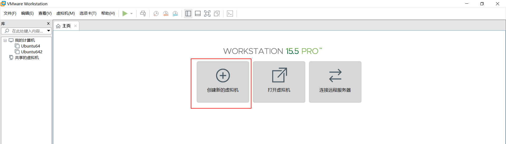

设置安装向导，使用自定义。


指定当前虚拟机使用的系统镜像


设置系统的主机全名，用户的登录用户名，登陆密码，确认密码，设置完成以后一定要记住。这里我设置了123


对虚拟机命名，将来在VM左侧虚拟机列表中显示对应的名字，不要使用奇葩的命名即可。


设置虚拟机的处理器配置，看自己电脑配置了，我的是8核，所以进行了2x2内核分配，尽量不要出现4x1这样的情况，4x1比2x2要卡。

当然，有条件的可以在这个基础上继续加，我这里的配置是舒适配置，将来用起来比较流畅。


这里是桌面版的Ubuntu，所以至少4G内存。


这里配置成NAT即可。


I/O控制器，选择默认推荐即可。


虚拟磁盘也一样，默认推荐的即可。


肯定是创建新虚拟磁盘。


考虑后面会在Ubuntu虚拟机里面直接进行开发。可以分配到50G内存。


确认上面的配置没有问题以后，点击完成即可。


接下来，等待系统初始化安装，直到出现登陆界面。


漫长的等待以后，终于出现了登陆页面，点击中间图标。

接着输入上面创建虚拟机时设置的登陆用户名和登陆密码（我的是123），点击Sign In


登陆成功了以后，进入的就是桌面。此时会询问我们是否要连接线上的账号。

这里有就登陆下，没有就点击窗口的右上角 `skip`跳过吧。


Livepatch是一个不需要我们重启ubuntu就可以直接给系统打安全补丁的黑科技，给公司服务器做安全维护时候需要。

这里，我们点击右上角绿色按钮，继续下一步吧。捂脸~

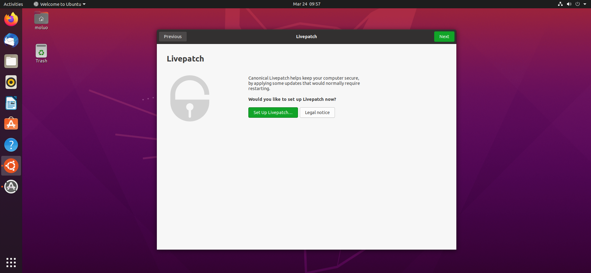

询问是否发送自己的电脑型号，地理位置等信息给官方？我选择No，大家随意。接着next。


询问是否启用定位服务，当然，当有软件需要使用定位服务，Ubuntu会有提示让我们确认的，的确有部分软件需要定位服务，所以这里勾选了，接着窗口右上角 next。


最后一步了，点击done吧。


桌面左边有个软件收藏夹，我们点击下中间的系统提示图标(A字母那个)，提示是否更新些系统软件，这里会自动更新python解析器之类的软件库相关软件，所以点击Install Now，下载最新版本。


继续等待吧。


更新完成了。


## 更改系统语言为中文

点击屏幕右上角 设置按钮


选择地区和语言设置 Region & Language。可以通过窗口左上角点击放大镜，进行搜索查找。


然后选择 语言安装管理 Manage Installed Languages


点击Install ，下载安装语言包，必须联网。


下载安装语言包需要管理员授权，所以还是输入登录密码。


接下来，等待下载完成。


点击 install/remove language，安装语言包


在弹出窗口中，找到chinese(simplified) 和English，勾选上再点击Apply


等待下载完成。

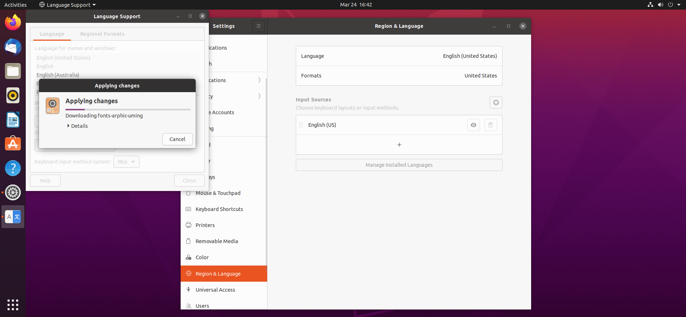

在已经下载完成的语言列表中找到汉语（中国），并鼠标左键点选按住把它拖到语言列表的最上方位置，并点选Apply System-Wide，接着最后点击Close关闭当前窗口。

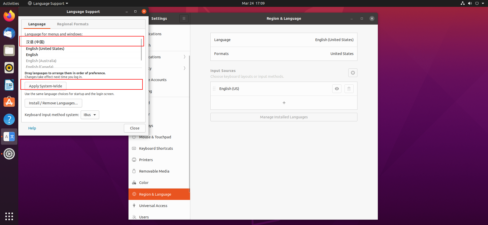

重启ubuntu。


重启后的ubuntu，会弹出提示将标准文件夹更新到当前语言吗？强烈建议选择保留旧的名称。勾选"不要再次询问我"，要不然每次开机都提示一遍。


## 更改系统时区为亚洲/上海

鼠标右键，点击桌面，选择"在终端打开"。并输入以下命令。

```bash
sudo tzselect
# 选项Asia  4
# 选项China 9
# 选项beijing 1
# 选项Yes     1
```


```bash
# 复制时区文件
sudo cp /usr/share/zoneinfo/Asia/Shanghai  /etc/localtime
# 安装ntp时间服务器
sudo apt install ntpdate
# 同步ntp时间服务器
sudo ntpdate time.windows.com
# 将系统时间与网络同步
sudo ntpdate cn.pool.ntp.org
# 将时间写入硬件
sudo hwclock --systohc
# 重启Ubuntu
reboot
```

重启ubuntu以后，就可以看到时间同步完成了。


## 软件源更新为阿里源

到目前为止，更新软件和下载安装包都是从国外Ubuntu官方源上下载的，很慢。所以，此处改为阿里源。

1. 在终端输入以下命令，备份原始源文件并编辑源文件。

```bash
sudo cp /etc/apt/sources.list /etc/apt/sources.list.backup
sudo vi /etc/apt/sources.list
```

`sources.list`清空原来内容，一直 `dd`即可，然后复制下面所有内容，使用快捷键 `shift+insert`替换，替换内容如下：

```bash
deb http://mirrors.aliyun.com/ubuntu/ focal main restricted universe multiverse
deb-src http://mirrors.aliyun.com/ubuntu/ focal main restricted universe multiverse

deb http://mirrors.aliyun.com/ubuntu/ focal-security main restricted universe multiverse
deb-src http://mirrors.aliyun.com/ubuntu/ focal-security main restricted universe multiverse

deb http://mirrors.aliyun.com/ubuntu/ focal-updates main restricted universe multiverse
deb-src http://mirrors.aliyun.com/ubuntu/ focal-updates main restricted universe multiverse

deb http://mirrors.aliyun.com/ubuntu/ focal-proposed main restricted universe multiverse
deb-src http://mirrors.aliyun.com/ubuntu/ focal-proposed main restricted universe multiverse

deb http://mirrors.aliyun.com/ubuntu/ focal-backports main restricted universe multiverse
deb-src http://mirrors.aliyun.com/ubuntu/ focal-backports main restricted universe multiverse
```

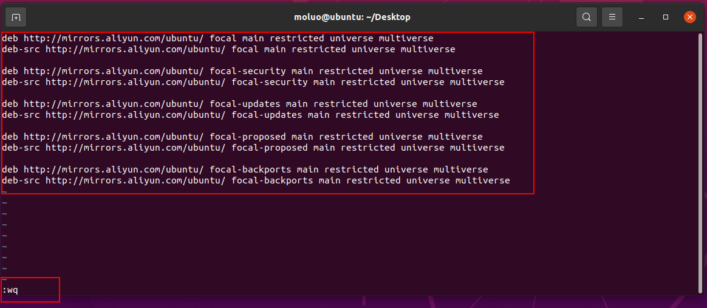

保存退出。先按 `Esc`，接着 `:wq`，回车即可。

更新缓存和升级

```bash
sudo apt-get update
sudo apt-get upgrade
```


## 安装常用软件

### Vim8.x

```bash
sudo apt install vim
```


### chrome

使用ubuntu内置的火狐浏览器打开谷歌浏览器的下载 地址：

http://www.google.cn/intl/zh-CN/chrome/browser/desktop/index.html


选择Ubuntu版本


点选 保存文件，默认会保存在用户家目录下的 Downloads目录下

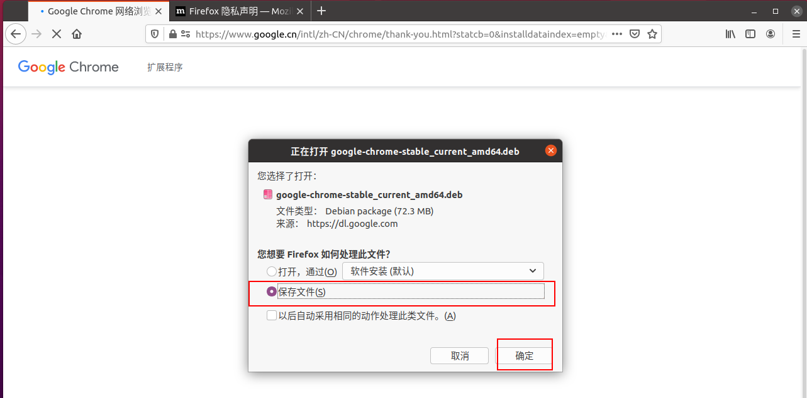

打开终端，执行如下命令：

```python
cd ~/Downloads
sudo dpkg -i google-chrome-stable_current_amd64.deb
# google-chrome-stable_current_amd64.deb 是刚才下载的安装包，自己比对下名字。
```


可以选择把谷歌浏览器拉动到左侧收藏栏中，方便快速打开。


接下来，在右边收藏夹点击打开谷歌浏览器，设置为默认浏览器即可。

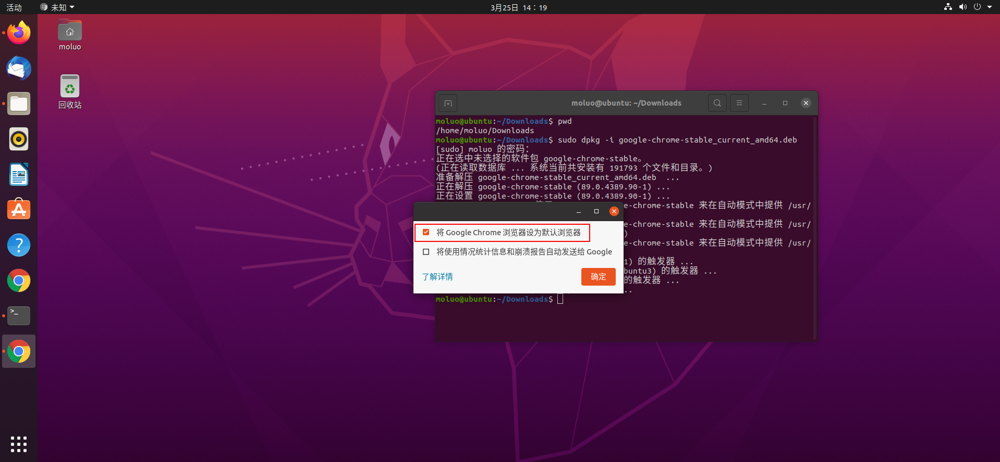

### 搜狗输入法

搜狗输入法Linux官网：https://pinyin.sogou.com/linux/?r=pinyin

在Ubuntu中使用上面刚安装的浏览器访问，然后下载安装包文件，浏览器会自动保存在 `Downloads`目录下。


接下来，配置安装搜狗输入法。打开刚才设置中文的窗口。


查看当前键盘输入法系统，如果没有 `fcitx`，则打开终端直接安装 `fcitx`输入法系统。

```bash
sudo apt-get install fcitx
```


安装完成以后，关闭前面打开的语言支持窗口，然后重新打开。


把输入法系统改为 `fcitx`，并设置 `应用到整个系统`。


关闭语言支持了以后，找到刚才保存搜狗输入法安装包的目录，鼠标右键，打开终端，在终端下执行安装命令。

```bash
cd ~/Downloads
sudo dpkg -i sogoupinyin_2.4.0.3469_amd64.deb # 软件包命令，自己比对下。
```


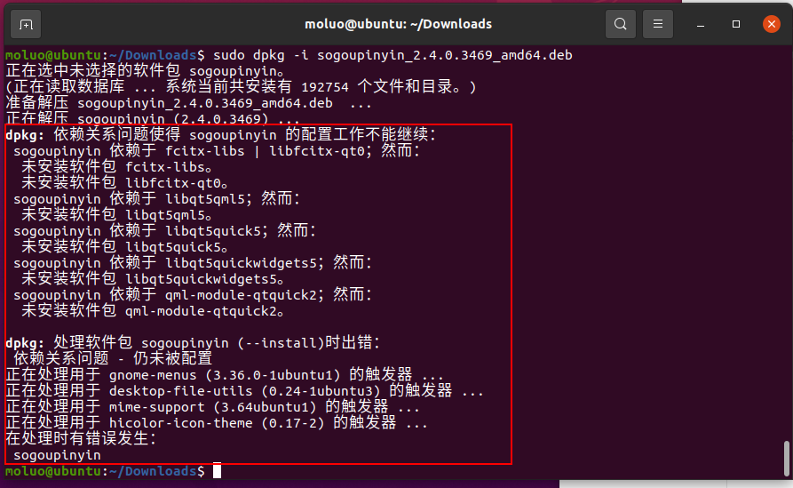

上面出现错误是因为安装包缺少依赖。在终端输入以下命令：

```bash
sudo apt -f install
# 再次安装
sudo dpkg -i sogoupinyin_2.4.0.3469_amd64.deb
```


上面没有报错了，接下来，关闭终端，再次重启ubuntu以后，搜狗输入法就可以使用了。


### ubuntu1804 安装搜狗拼音

参考地址 https://blog.csdn.net/u011754972/article/details/122896284

```
    sudo apt -y --purge remove fcitx
    sudo apt clean fcitx
    sudo apt -y install fcitx fcitx-bin fcitx-table fcitx-table-all
    sudo apt -y install fcitx-config-gtk
    sudo apt -y install fcitx-libs libfcitx-qt0 libopencc2 libopencc2-data libqt4-opengl libqtwebkit4
wget http://cdn2.ime.sogou.com/dl/index/1571302197/sogoupinyin_2.3.1.0112_amd64.deb
  sudo dpkg -i sogoupinyin_2.2.0.0108_amd64.deb
 sudo apt -f install


```


### Sublimetext 3.x.x

官方地址：http://www.sublimetext.com/docs/3/linux_repositories.html

可以在官网上查看Ubuntu安装步骤，也是上面的地址。


添加Docker官方GPG key，网络不好的话，会报错，多执行几次即可。

```bash
wget -qO - https://download.sublimetext.com/sublimehq-pub.gpg | sudo apt-key add -
```

确认允许apt使用HTTPS获取资源

```bash
sudo apt-get install apt-transport-https
```


设置sublimetext3稳定版仓库到软件源，并更新源，最后安装。

```bash
echo "deb https://download.sublimetext.com/ apt/stable/" | sudo tee /etc/apt/sources.list.d/sublime-text.list
sudo apt-get update
sudo apt-get install sublime-text
```

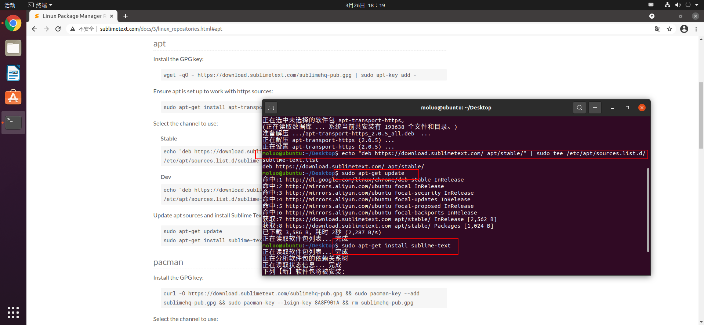

安装完成以后，在桌面右下角的软件列表里面就可以找到sublimetext了。

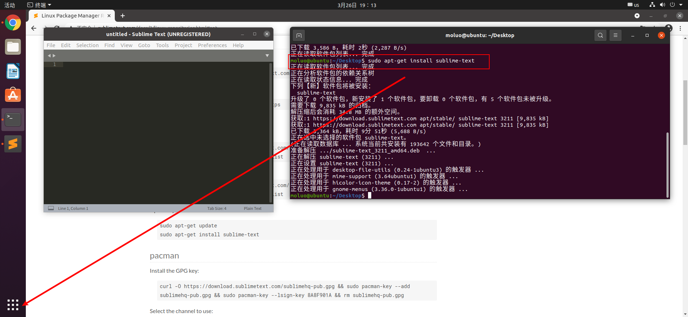

#### 设置中文模式

在sublimetext下快捷键Ctrl+Shift+P打开搜索栏，输入install，点选 `Package Control: Install Package`。

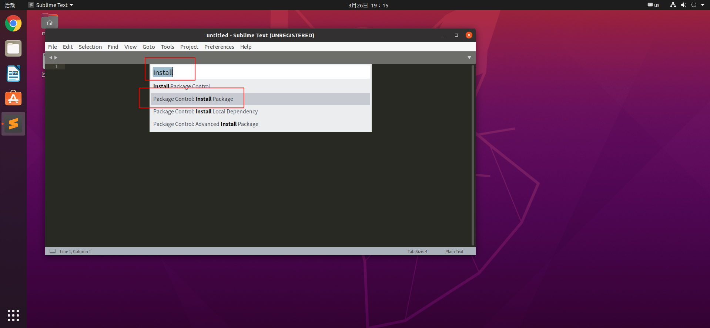


输入chinese，点选 `ChineseLocalizations`插件进行安装（安装插件时，编辑器左下方有个表示进度的=号在左右移动）即可。


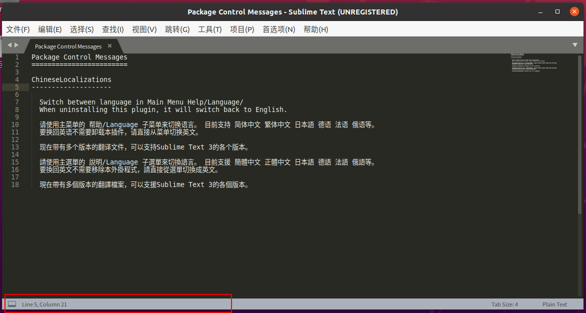

### mysql8.0.x

#### 基本安装

在ubuntu20.04版本源仓库中MySQL的默认版本已经到8.0了，所以直接安装。命令：

```bash
sudo apt-get install mysql-server
```


安装完成后，可以通过下面的命令来查看时候安装成功：

```bash
systemctl status mysql
```

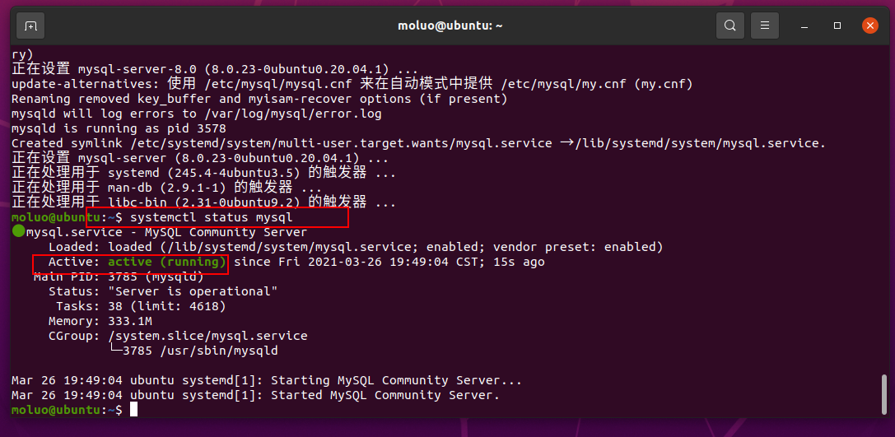

#### 设置密码

刚安装的MySQL是没有密码的，所以直接登陆进入.

```bash
sudo mysql
```


查找MySQL中现有所有管理用户，可以看到root用户是没有密码的。需要给root设置有一个密码。这里我设置为123.

```sql
select Host,User,authentication_string from mysql.user;
# 设置或者更换root用户的密码。
ALTER USER 'root'@'localhost' IDENTIFIED WITH mysql_native_password BY '123';
```


debian-sys-maint 是一个权限和root一样大的超级管理员，在 `/etc/mysql/debian.cnf`默认创建。用于将来如果忘了root用户，可以使用它登陆MySQL。密码就保存在 `/etc/mysql/debian.cnf`文件中。

#### 新建管理员

开发中，常见做法都是一个项目，一个数据库，一个管理员。

MySQL8.0与前面5.7版本中的设置有些许区别。

```mysql
# 基本步骤：
# create database 数据库; # MySQL8.0以后默认编码为utf8mb4
# create user '管理员账号'@'localhost' identified by '密码';
# GRANT ALL PRIVILEGES ON 数据库.* TO '管理员账号'@'localhost';  

# 数据库.*  表示指定库下所有表的操作权限
# *.* 则表示所有库和所有表

# 举例，创建一个oldboyedu数据库，为它创建一个moluo管理员账号，密码123
create database oldboyedu;
create user 'moluo'@'%' identified by '123';
GRANT ALL PRIVILEGES ON oldboyedu.* TO 'moluo'@'%';   # 数据库.* 表示指定库下所有表的操作权限
```

#### 常用操作

```python
# 关闭MySQL
sudo service mysql stop

# 启动MySQL
sudo service mysql start

# 重启MySQL
sudo service mysql restart

# 卸载MySQL
sudo rm /var/lib/mysql/ -R
sudo rm /etc/mysql/ -R
sudo apt-get autoremove mysql* --purge
```

### git2.25.x

打开终端并运行安装命令。

```bash
sudo apt-get install git
```


安装完成了，可以查看下版本。

```bash
git version
```


### redis5.0.x

打开终端并运行安装命令。

```bash
sudo apt-get install redis-server
```


```
配置文件：/etc/redis/redis.conf

卸载命令：sudo apt-get purge --auto-remove redis-server
关闭命令：sudo service redis-server stop
开启命令：sudo service redis-server start
重启命令：sudo service redis-server restart
```

### MongoDB4.4.x

ubuntu20.04默认安装的mongodb版本是3.6.8版本。所以需要安装到4.4最新稳定版本。文档编写时，mongodb最新版本是4.9版本。

```bash
# 安装依赖包
sudo apt-get install libcurl4 openssl
# 导入包管理系统使用的PGP公钥
wget -qO - https://www.mongodb.org/static/pgp/server-4.4.asc | sudo apt-key add -

# 注册mongodb源
echo "deb [ arch=amd64,arm64,s390x ] http://repo.mongodb.com/apt/ubuntu focal/mongodb-enterprise/4.4 multiverse" | sudo tee /etc/apt/sources.list.d/mongodb-enterprise.list

# 更新源
sudo apt-get update

# 安装mongodb4.4.4版本
sudo apt-get install -y mongodb-enterprise=4.4.4 mongodb-enterprise-server=4.4.4 mongodb-enterprise-shell=4.4.4 mongodb-enterprise-mongos=4.4.4 mongodb-enterprise-tools=4.4.4
```

mongodb安装过程

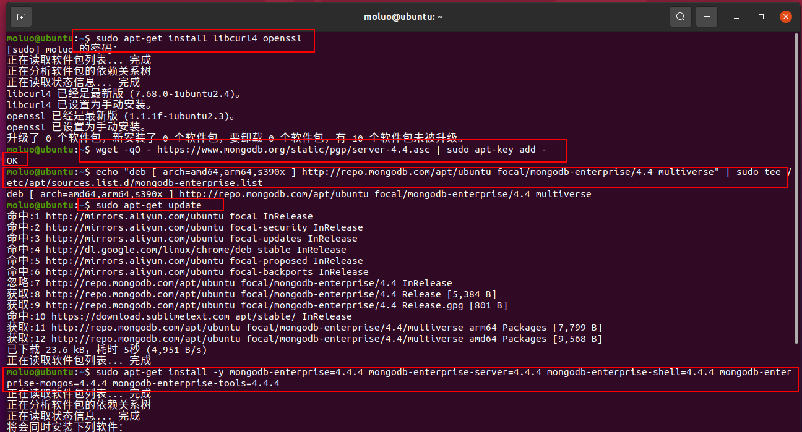

安装完成以后，mongodb是默认开机不启动的。但是此时刚安装完成，mongoDB是没有开启的。

```bash
# 查看mongodb运行状态
sudo systemctl status mongod

# 设置开机自启，并重新加载配置，最后启动mongodb
sudo systemctl enable mongod.service
sudo systemctl daemon-reload
sudo systemctl start mongod

# 进入mongoDB shell交互终端。
mongo
# 退出交互终端
exit   # 或者 quit()
```

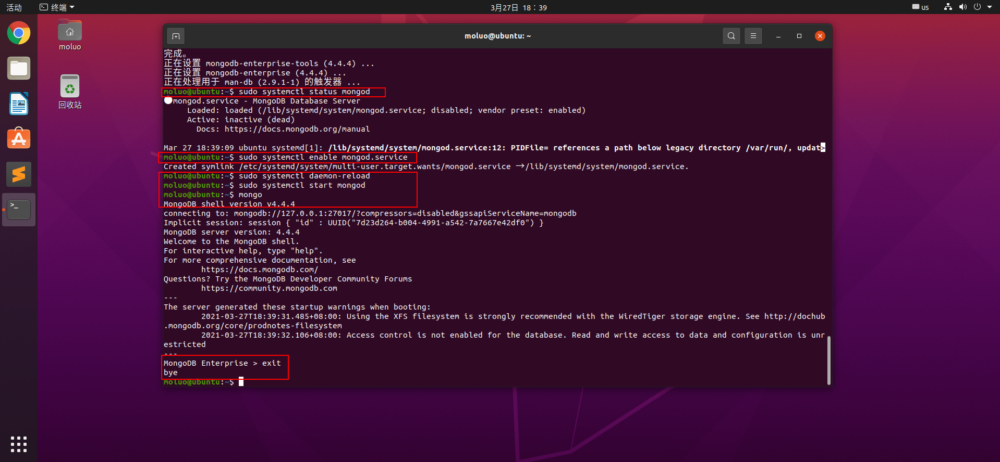

常用操作命令

```bash
# 开启mongodb
sudo systemctl start mongod
# 停止mongodb
sudo systemctl stop mongod
# 重启mongodb
sudo systemctl restart mongod

# 查看运行状态
sudo systemctl status mongod

# 查看配置
sudo vim /etc/mongod.conf
```

### Postman8.0.x

官网地址：https://www.getpostman.com/downloads/

打开浏览器，从官网下载Postman软件包。默认保存在 `~/Downloads`目录下。


先安装Postman运行的依赖包

```bash
sudo apt-get install libgconf-2-4
sudo apt-get install libcanberra-gtk-module
```


把下载回来的Postman从 `Downloads`目录中解压并剪切到 `/opt`目录下

```bash
cd ~/Downloads
sudo tar -zxf Postman-linux-x64-8.0.7.tar.gz
sudo mv Postman /opt
```


创建桌面快捷方式，创建快捷方式文件

```bash
sudo vim /usr/share/applications/postman.desktop
```

快捷方式文件代码如下，`:wq` 保存退出。

```bash
[Desktop Entry]
Encoding=UTF-8
Name=postman
Comment=用于接口测试的一个工具
Exec=/opt/Postman/Postman
Icon=/opt/Postman/app/resources/app/assets/icon.png
Categories=Application;Web;MySQL;postman
Version=1.0
Type=Application
Terminal=0
```


在应用程序中搜索 `postman`，并设置到收藏夹。


初始化字体大小


开始使用，点击红圈选择处。

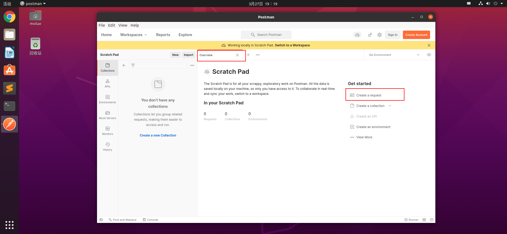

### nginx1.18.x

官网：http://nginx.org/en/download.html

ubuntu20.04中内置了最新稳定版本nginx1.18.0。所以直接执行安装命令

```bash
sudo apt-get install nginx
```


nginx安装完成以后，默认是开机自启，所以直接访问：`http://127.0.0.1`，即可。


常用操作

```bash
# 查看nginx运行状态
sudo systemctl status nginx

# 启动nginx
sudo systemctl start nginx   

# 关闭nginx
sudo systemctl stop nginx

# 重启nginx
sudo systemctl restart nginx

# 查看nginx运行的配置文件
sudo /usr/sbin/nginx -t
```

相关文件位置：

```cmd
/usr/sbin/nginx # nginx命令文件，nginx运行最终通过该命令操作完成的

/etc/nginx/nginx.conf # 存放配置文件目录

/var/log/nginx # 存放日志目录

/etc/nginx/sites-available/default # 默认站点配置文件

/var/www/html  # 默认站点根目录
```

### navicat  Premium 15.x

Navicat Premium 是一套多连接数据库开发工具，让你在单一应用程序中同时连接多达七种数据库：MySQL、MariaDB、MongoDB、SQL Server、SQLite、Oracle 和 PostgreSQL，可一次快速方便地访问所有数据库。

官网： https://www.navicat.com.cn/products/navicat-premium

相关依赖的网盘地址：`https://pan.baidu.com/s/1ZTIGqH94tzzWB0JeY0sjPw`，提取码：`wune`。

软件可以直接从官网下载，如果担心官方提供的新版本无法激活，也可以从上面网盘地址下载。

打开终端，安装系统编译相关模块。

```bash
sudo apt install -y libcapstone-dev cmake build-essential libssl-dev rapidjson-dev
```

 

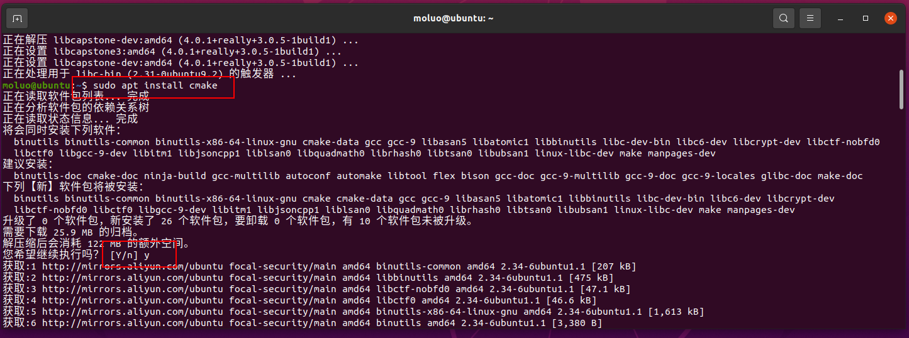

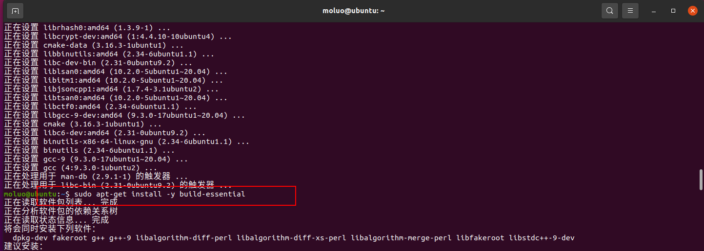

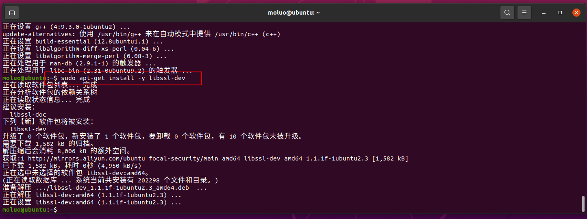


#### 编译安装keystone

keystone的github地址：https://github.com/keystone-engine/keystone

也可以从上面分享的网盘里面下载，解压放到对应目录下。

```bash
cd ~/Downloads
git clone https://hub.fastgit.org/keystone-engine/keystone.git
# 安装keystone
cd ~/Downloads/keystone	    # 进入keystone文件夹
```


编译 keystone

```bash
sudo mkdir ~/Downloads/keystone/build		# 创建build目录
cd ~/Downloads/keystone/build		        # 进入build目录
sudo ../make-share.sh		                # 执行上级目录的make-share.sh脚本
sudo make install 	 # 安装keystone动态库
sudo ldconfig		# 执行ldconfig动态链接库为系统所共享
```

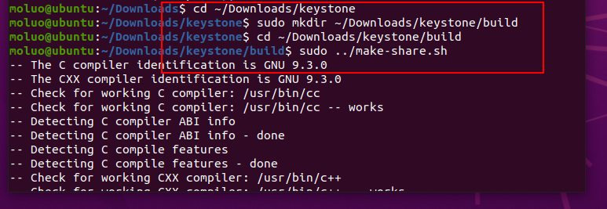

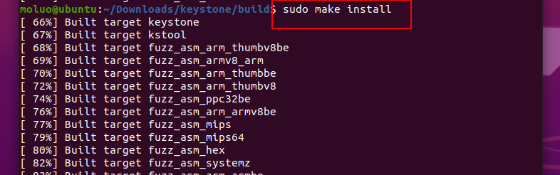

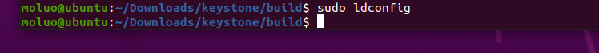

#### 编译安装navicat注册机patcher-keygen

拉取patcher-keygen的linux分支

github地址：https://hub.fastgit.org/HeQuanX/navicat-keygen-tools

也可以从上面分享的网盘中下载，并解压复制到对应目录下。

```bash
cd ~/Downloads
git clone -b linux --single-branch https://hub.fastgit.org/HeQuanX/navicat-keygen-tools.git
cd ~/Downloads/navicat-keygen-tools
make all
# 编译成功后，navicat-keygen-tools的bin目录下会出现2个文件navicat-keygen和navicat-patcher
```

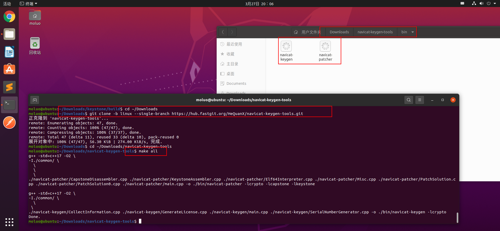

下载navicat镜像文件

官网下载地址：https://www.navicat.com.cn/download/direct-download?product=navicat15-premium-cs.AppImage&location=1

如果担心官网最新的无法激活使用，则从网盘下载。

```bash
# 创建软件保存目录
sudo mkdir /opt/navicat  # 将来所有navicat相关软件的安装保存目录 
cd /opt/navicat 	     # 进入Navicat目录
# 从官网下载AppImage镜像并保存到/opt/navicat目录下
sudo mv ~/Downloads/navicat15-premium-cs.AppImage /opt/navicat/
```


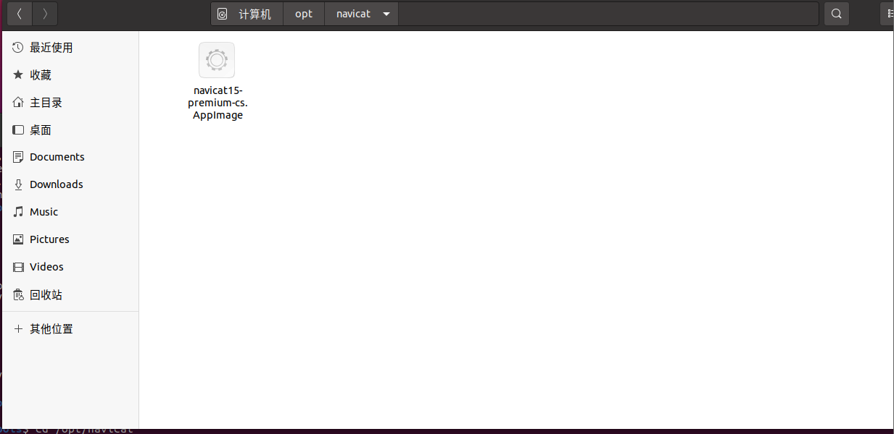

#### 提取navicat镜像AppImage的文件

```bash
# 创建一个临时目录作为AppImage的挂载目录
sudo mkdir /opt/navicat/temp
# 将AppImage文件挂在到temp目录下。注意：挂载成功后是read-only. 只读状态
sudo mount -o loop navicat15-premium-cs.AppImage /opt/navicat/temp
sudo mkdir premium15		            # 创建Premium15软件安装保存目录
sudo cp -r temp/* premium15		        # 将AppImage镜像挂载到temp内的文件复制到premium15里面
sudo umount temp		                # 复制完成之后，取消挂载
sudo rm -rf temp                         # 后面用不上了，可以直接删除
```


#### 开始patch

```bash
cd ~/Downloads/navicat-keygen-tools/bin
sudo ./navicat-patcher /opt/navicat/premium15
# 回车2趟，path成功之后，会在当前bin目录下生成一个PegPrivateKey.pem文件，后面会用到
```

#### 下载镜像打包工具

github下载说明：`https://github.com/AppImage/AppImageKit/tree/continuous#appimagetool-usage`

在浏览器打开下载地址，下载到本地并复制到 `/opt/navicat`目录下。

下载地址：`https://github.com/AppImage/AppImageKit/releases/download/continuous/appimagetool-x86_64.AppImage`

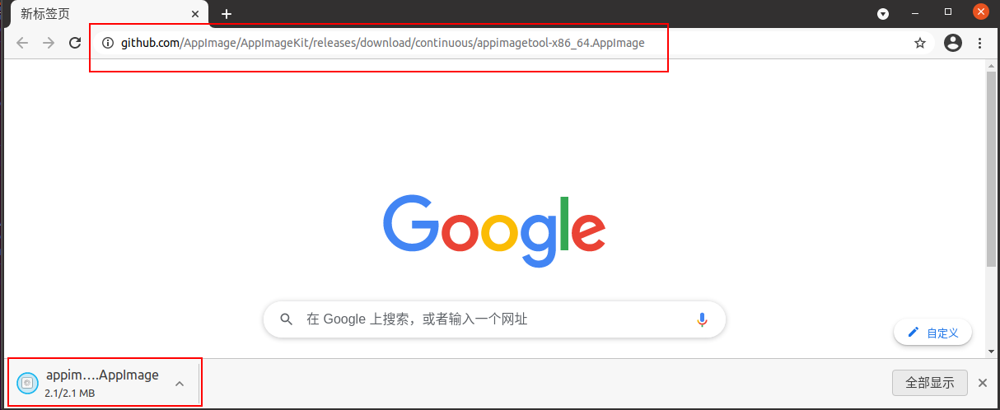

```bash
cd /opt/navicat/
sudo mv ~/Downloads/appimagetool-x86_64.AppImage /opt/navicat/
sudo chmod +x /opt/navicat/appimagetool-x86_64.AppImage
sudo ./appimagetool-x86_64.AppImage premium15 premium15.AppImage # 将/opt/navicat/premium15目录下面的文件打包成premium15.AppImage
```

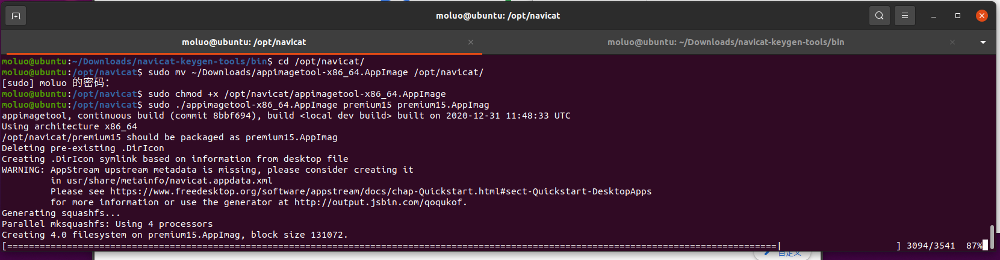

#### 激活navicat

这个步骤必须断网！断网！断网！


通过打包好的镜像premium15.AppImage，启动navicat。

```bash
cd /opt/navicat
sudo chmod +x premium15.AppImage		# 赋予执行权限
./premium15.AppImage		            # 打开软件后不要管这个窗口，不要关闭！不要操作这个终端了，否则软件会关闭。
```

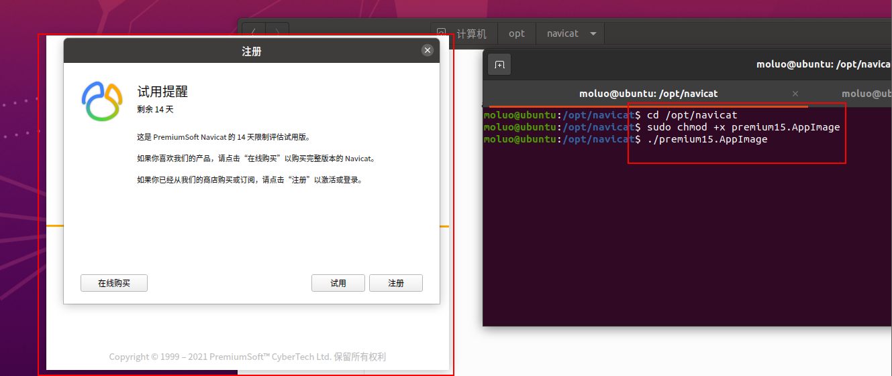

运行注册机

通过 `Ctrl+Shift+T`，打开新的终端窗口，切换目录到 `~/Downloads/navicat-keygen-tools/bin`下运行注册机


```bash
cd ~/Downloads/navicat-keygen-tools/bin
# 运行注册机
sudo ./navicat-keygen --text RegPrivateKey.pem
```


输入激活相关信息，根据提示输入，注意复制序列号（Serial number ）！！！

```bash
# 1.选择激活产品，这里输入1，选择Premium

# 2.选择软件语言，这里输入1, 选择简体中文

# 3.选择软件版本，这里输入15,

# 然后会看到生成的序列号，复制序列号 Serial number ，我的是NAVP-VKXI-7OIO-AXLB，每次激活都不一样的！

# 接着是输入用户名和公司名，随便填写即可。

# 填写完成以后，不要继续操作当前终端！不要继续操作当前终端！不要继续操作当前终端！
# 特别是不能按回车键！否则要重新运行注册机。激活信息重新填写。
```


回到刚才打开的navicat程序界面，点击注册，在注册窗口左边输入刚才的序列号，点击激活。


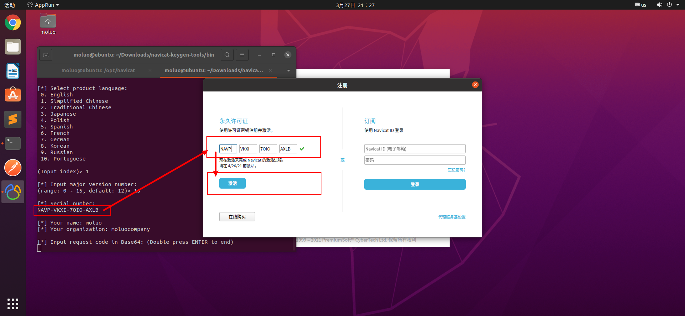

因为前面已经断网，所以点选手动激活。

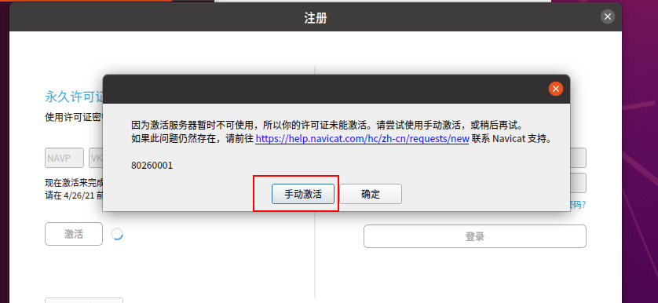

在激活对话框中，把请求码复制到注册机所在的终端位置。


复制到终端以后，可以在终端回车2次了。


回车2次以后，得到激活码，填写到激活对话框的下方激活码位置。


复制完成，点选“ok”。


激活成功了！点击确定，会关闭激活对话框的。在注册窗口点击确定。

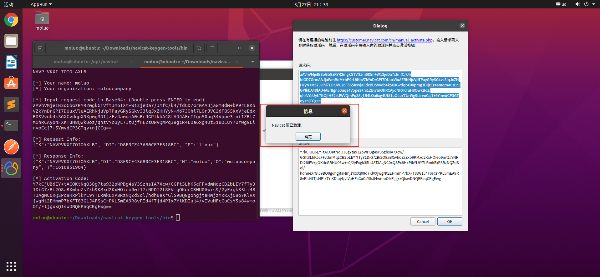


点击下一步即可，直到开始


OK，一切正常没有问题。此时可以恢复网络了。``


#### 快捷启动方式

创建navicat的启动快捷方式，执行以下代码：

```bash
sudo cp /opt/navicat/premium15/navicat.desktop /usr/share/applications/
sudo vim /usr/share/applications/navicat.desktop
```

navicat.desktop文件内容修改如下，`:wq`保存退出。

```bash
[Desktop Entry]
Encoding=UTF-8
Type=Application
Name=Navicat Premium 15
Comment=The Smarter Way to manage dadabase
GenericName=Database Development Tool
Icon=/opt/navicat/premium15/navicat-icon.png
Exec=/opt/navicat/premium15.AppImage
Categories=Application;Database;MySQL;Development;navicat;
Keywords=database;sql;
Version=15.0
Terminal=0
```

保存以后关闭终端，在软件列表中找到并添加到收藏夹。


### podman3.x.x

官网地址：https://podman.io/

github项目地址：https://github.com/containers/podman

#### 基本安装

跟着官网提供的安装命令直接执行，不同进行任何修改。

```bash
source /etc/os-release
sudo sh -c "echo 'deb http://download.opensuse.org/repositories/devel:/kubic:/libcontainers:/stable/xUbuntu_${VERSION_ID}/ /' > /etc/apt/sources.list.d/devel:kubic:libcontainers:stable.list"
wget -nv https://download.opensuse.org/repositories/devel:kubic:libcontainers:stable/xUbuntu_${VERSION_ID}/Release.key -O- | sudo apt-key add -
sudo apt-get update -qq
sudo apt-get -qq --yes install podman
# 因为从国外下载安装，所以需要等待很长时间，没办法。去喝杯茶吧。
```


OK，漫长的等待以后，安装完成了，执行 `podman version`，查看podman基本信息把。


#### 镜像加速

登陆阿里云，进入容器镜像服务。


选择镜像加速器。复制加速器地址。


更新镜像源文件内容

```bash
# 备份原来的配置文件
sudo mv /etc/containers/registries.conf  /etc/containers/registries.conf.bak
sudo vim /etc/containers/registries.conf
```

registries.conf，内容如下，并保存退出 `:wq`：

```bash
unqualified-search-registries = ["docker.io"]
[[registry]]
prefix = "docker.io"
location = "2xdmrl8d.mirror.aliyuncs.com"
```


常用操作

```bash
podman version  # 查看版本信息
podman info     # 查看podman的环境信息
podman search <镜像名>      # 根据指定镜像名搜索搜索信息
podman pull <镜像名:版本号> # 根据指定镜像名和版本号拉取镜像到本地，如果没有指定镜像名
podman images   # 列出当前系统的所有镜像文件
podman rmi <镜像名:版本号>  # 删除指定名称的镜像，如果有版本号，则根据名称和版本删除镜像。
podman ps                  # 列出当前系统中所有的容器，podman ps -a 表示列出当前正在运行中的所有容器。
podman rm <容器名/容器ID>   # 通过容器名或者容器ID来删除容器

podman tag <镜像ID:版本号/镜像名:版本号> <标记名>  # 给指定镜像，添加标记，方便将该镜像分类到某一个镜像仓库下
podman inspect <容器ID/容器名/镜像ID/镜像名>  # 获取容器/镜像的元数据

podman run -it --name=test <镜像名:版本号> bash   # 创建一个终端交互，名为test的容器，容器启动以后执行的第一个命令是bash
podman run -itd --name=test <镜像名:版本号>       # 创建一个
podman run -itd --name=<容器名称> -p <服务器端口>:<容器端口> -e <系统变量>=<变量值> <镜像名:版本号> <容器启动后运行的第一个命令>

podman top <容器名/容器ID>  # 查看容器中运行的进程信息
```

### typora0.9.x

官网地址：https://www.typora.io/

直接跟着官网教程安装即可。

```bash
sudo apt-key adv --keyserver keyserver.ubuntu.com --recv-keys BA300B7755AFCFAE

sudo add-apt-repository 'deb https://typora.io/linux ./'
sudo apt-get update

sudo apt-get install typora
```

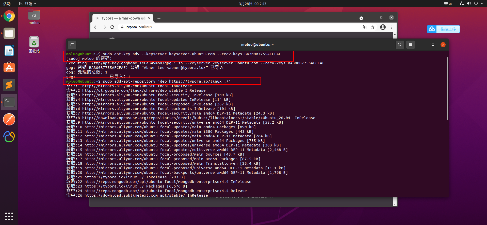


OK，安装完成。


### nvm0.37.x

由于node.js的版本一直处于频繁更新中，所以需要一个node版本管理工具来让我们开发中方便地使用和切换不同版本的node.js。

nvm是一个开源的node版本管理器，通过它，你可以下载任意版本的node.js，还可以在不同版本之间切换使用。

**注意：安装nvm之前，要确保当前机子中不存在任何版本的node，如果有则卸载掉。**

gitee地址：https://gitee.com/mirrors/nvm

安装命令

```bash
cd ~/Downloads
wget -qO- https://raw.githubusercontent.com/nvm-sh/nvm/v0.37.2/install.sh | bash
# 安装过程中，因为国外服务器的原因，所以如果失败就执行多几次吧。目前没有别的办法。
# 安装成功以后，关闭当前终端，重新打开就可以使用了。
```


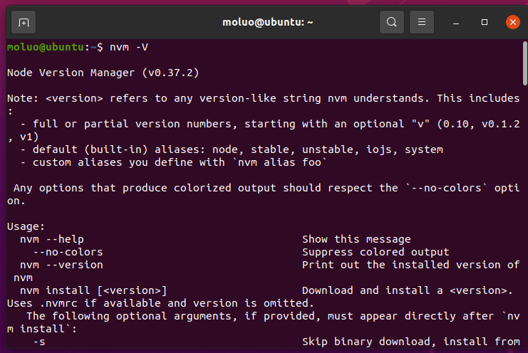

常用操作

```bash
# 查看官方提供的可安装node版本
nvm ls-remote

# 安装执行版本的node,例如：nvm install v14.16.0
nvm install <version>

# 卸载node版本，例如：nvm uninstall v14.16.0
nvm uninstall <version>

# 查看已安装的node列表
nvm ls

# 切换node版本，例如：nvm use v14.16.0
nvm use <version>

# 设置默认版本，如果没有设置，则开机时默认node是没有启动的。例如：nvm alias default v14.16.0
nvm alias default <version>

# 查看当前使用的版本
nvm current
```

### nodejs14.x.x

使用nvm的相关命令安装node。目前最新版本是v15.12.0。根据官网设置，基数版本是普通版本，偶数版本是LTS版本。所以安装最新LTS版本。

```python
# 查看官方提供的可安装node版本
nvm ls-remote

# 安装LTS版本的node
nvm install v14.16.0

# 切换node版本到v14.16.0
nvm use v14.16.0

# 设置v14.16.0为默认使用版本
nvm alias default v14.16.0
```


### npm6.14.x

npm（node package manager）是nodejs的包管理器，用于node插件管理（包括安装、卸载、管理依赖等）。安装了node以后，就自动安装了npm[不一定是最新版本]

官方地址：https://www.npmjs.com/

使用文档：https://www.npmjs.com.cn/

```
npm --version
```


### cnpm

默认情况下，npm安装插件是从国外服务器下载，受网络影响大，可能出现网络异常。

通过淘宝镜像加速npm：http://npm.taobao.org/

```bash
# 打印默认的 registry 地址
npm config -g get registry

# 设置淘宝镜像
npm config -g set registry https://registry.npm.taobao.org

# 再次打印默认 registry 地址
npm config -g get registry
```


### vue-cli3.x.x

使用前面已经安装好的node版本，进行安装。注意一旦安装以后，以后这个vue-li最好契合当前node版本。也就是说，运行接下来安装的vue-cli时，最好运行的就是本次跑的node版本。如果回头切换到其他版本node来运行vue-cli，有可能因为版本不兼容出现不必要的bug。

文档：https://cli.vuejs.org/zh/guide/installation.html

安装命令

```bash
# 默认安装的是vue3.x版本，vue-cli 4.x.x版本
npm install -g @vue/cli
# 安装完成可以查看版本
vue -V

# 目前还有部分企业使用vue2.x，如果要使用vue2.x版本需要安装桥接工具
npm install -g @vue/cli-init
```


项目搭建

```bash
# vue2.x，例如：vue init webpack mofangweb
cd ~/Desktop   # 自己选择一个保存项目的父级目录
vue init webpack <项目目录名>

# vue3.x，例如：vue create mofangui
cd ~/Desktop   # 自己选择一个保存项目的父级目录
vue create <项目目录名>
```

vue2.x版本效果：


```
cd mofangweb
npm run dev
```


访问效果：


目录结构：

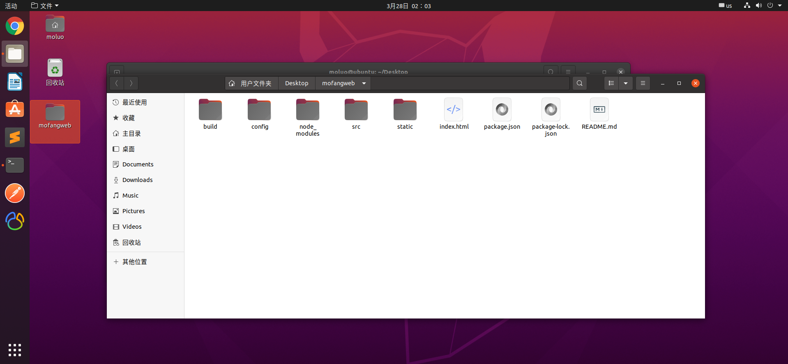

vue3.x版本效果：

3.x版本vue项目在构建时，默认提供了3种预设项目配置方案，方便开发者快速构建项目。

```bash
 Please pick a preset: (Use arrow keys)
# 项目采用的vue版本是2.x，内置babel和eslint插件
❯ Default ([Vue 2] babel, eslint)
# 项目采用的vue版本是3.x，内置babel和eslint插件
  Default (Vue 3 Preview) ([Vue 3] babel, eslint)
# 自定义选择自己的配置，创建新的预设方案
# 如果自定义配置完并保存的话，则下次再创建新项目时，就会出现更多种预设项目配置方案，供我们快速搭建项目了。
  Manually select features
  
 # 一般直接选择第二个选项就可以了。后面开发中有需要别的模块或插件再执行安装即可。
 # 此处，为了演示，选择第3个选项。
```

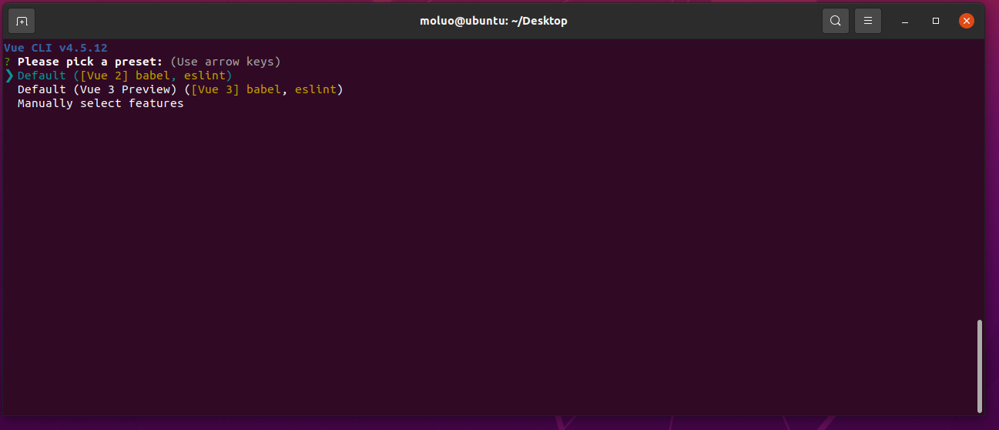

```bash
# 根据自己的开发需求，使用上下键移动光标，使用空格键来选择是否在项目中安装和使用当前扩展和模块。
# 选项说明
    choose Vue version： 选项项目中的vue版本，有2
    Babel：使用babel，便于将我们源代码进行语法版本转换（把es6=>es5）
    TypeScript：使用TypeScript进行源码编写，使用ts可以编写强类型js
    Progressive Web App(PWA)：使用渐进式网页应用（PWA）
    Router：使用vue-router
    Vuex：使用vuex状态管理器
    CSS Pre-processors：使用CSS预处理器，比如：less，sass等
    Linter / Formatter：使用代码风格检查和格式化
    Unit Testing：使用单元测试
    E2E Testing：使用E2E测试, end to end（端到端）是黑盒测试的一种
```


如上图所示，演示过程中，我选择了 `choose Vue version`，`Babel`和 `Linter / Formatter`。

这其实就是前面第1和第2种预设方案提供的模块和插件。

确定无误以后，回车。此时就会让我们选择子选项了。下面是让我们选择当前使用的vue版本。我选择3.x版本。回车确认。

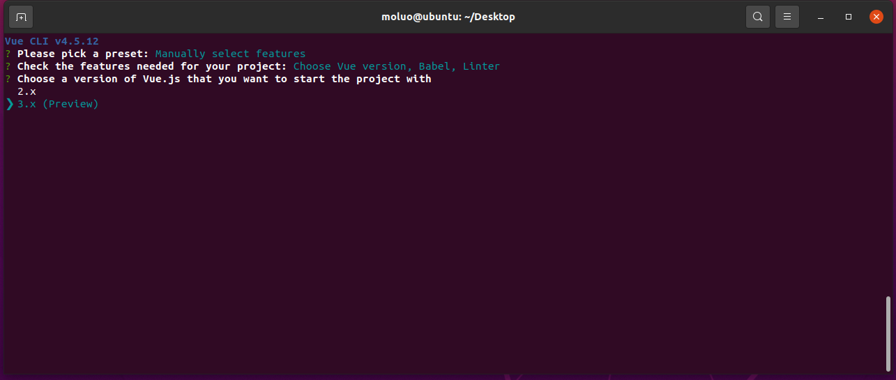

接下来设置编码规范的约束类型。这里选择 `ESLint+Prettier`，别问为什么，Vue作者尤雨溪选择就是它。``

ESLint（代码质量检测）+ Prettier（代码格式化工具）， 回车确认。

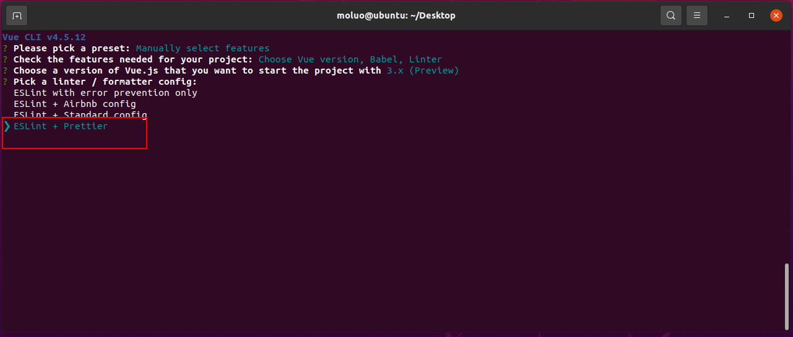

接下来，设置esLint的代码检查方式，选项1，保存时检查。选项2，提交时检查。

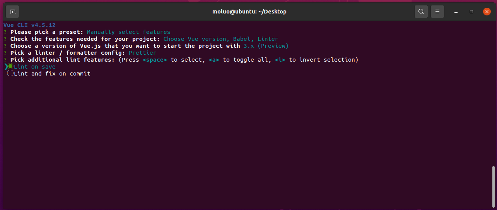

这里，我选择啥都不选。使用空格，把第一项的小圆点按掉。然后回车确认。


再下来，关于前面设置了Babel, ESLint等插件模块的配置文件要怎么存放, 是放到单独的配置文件中，还是package.json里？当然是 `In package.json`啦。回车确认。


最后一步，是否需要保存本次配置的预设方案，在以后新项目中可快速构建?

输入y，表示保存。以后创建项目时可以直接选择该配置, 不需单独配置。

输入n，表示不保存。以后创建项目时还是3种预设方案。

这里仅仅是为了演示，所以我输入了n。回车确认。


接下来，就等待项目构建完成，运行项目即可。

```
cd mofangui
npm run serve
```


访问效果：


目录结构：


### Anaconda3.x

官方地址：https://www.anaconda.com/products/individual
页面最下方找到Linux版本，选择第一个下载。下载完成以后打开终端，执行命令：

```bash
cd ~/Downloads/
bash Anaconda3-2020.11-Linux-x86_64.sh
```


接着回车，然后就是安装协议了，继续一路回车，直到出现以下内容，输入yes


这里是询问anaconda的安装保存位置，默认是当前用户家目录下。将来anaconda的所有虚拟环境都在这个目录下的envs目录下。

也可以填写一个其他的路径，但是你必须牢记这个路径。如果你忘了，你就倒霉了。。。。


上面是开玩笑的，忘了也没事。继续回车。接下来Anaconda进行解包操作，此时要做的就是等待。。。。

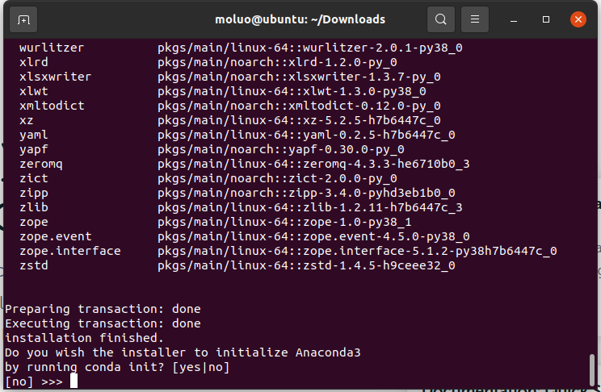

解包结束，我们可以看到Anaconda解压出来了100多个常用模块包，你要发了。。。

接下来，询问我们是否要初始化Anaconda3。肯定是yes啦。


OK，安装完成了。接下来，验证下是否安装成功了。关闭当前终端，打开一个新的终端，命名行左边出现 `(base)`，而且输入python3回车出现Anaconda则表示安装并可以正常使用了。base是Anaconda自带的全局环境。


镜像加速

通过 `conda info`命令可以看到，默认情况下，conda下载的包是通过Anaconda官网镜像站提供的。毕竟是国外网站，所以可以通过配置把conda下载包的镜像源设置为国内的清华源或者豆瓣源。

```bash
conda config --add channels https://mirrors.tuna.tsinghua.edu.cn/anaconda/pkgs/free/
conda config --set show_channel_urls yes
conda info
# 查看conda配置信息，可以看到国内镜像站地址已经被设置到配置中了，这个配置文件就在家目录下~/.condarc
# 如果有时候清华源网络不行，也可以通过修改配置文件改成豆瓣源，或者通过pip -i 临时换成豆瓣源。
```


常用操作

```bash
# 查看当前Anaconda的系统配置信息
conda info
# 列出当前系统中所有虚拟环境，环境列表左边*号表示当前所在环境
conda env list   # 也可以使用 conda info -e

# 新建虚拟环境
# -n <虚拟环境名称> 或者 --name <虚拟环境名称>
#     表示设置当前虚拟环境的名称
# python=<python版本号>
#     表示设置当前虚拟环境的python版本，如果本地没有会自动下载安装

# <包名>==<版本号>
#     表示创建虚拟环境时同时安装一个或多个指定第三方包
#     可指定版本号，如果不指定版本，则安装当前python环境能支持的最新版本的包
#     注意:
#         指定包的版本时，有可能会因为没有这个版本或当前python环境不支持当前版本而导致虚拟环境创建失败。
#         所以，建议指定包版本时，尽量使用*号表示小版本，例如：django==1.*

conda create -n <虚拟环境名称> python=<python版本号> <包名1>==<版本号> <包名2> ... <包名n>

# 例如：
conda create -n python27 python=2.7
conda create -n python36 python=3.6 pymongo
conda create -n mofang python=3.8  flask celery
conda create -n renran python=3.6  django==2.2.0 pymysql

# 克隆虚拟环境
conda create -n <新的虚拟环境名称> --clone <旧的虚拟环境名称>

# 进入/切换到指定名称的虚拟环境，如果不带任何参数，则默认回到全局环境base中。
conda activate <虚拟环境名称>

# 退出当前虚拟环境
conda deactivate

# 给指定虚拟环境安装/或者更新一个或多个指定包
# 当然也可以在进入虚拟环境以后，通过pip install <包名> 来完成安装工作
conda install -n <虚拟环境名称> <包名1>==<版本号> <包名2> ... <包名n>

# 给指定虚拟环境卸载一个或多个指定包
# 当然也可以在进入虚拟环境以后，通过pip uninstall <包名> 来完成卸载工作
conda remove -n <虚拟环境名称> <包名1>==<版本号> <包名2> ... <包名n>

# 删除指定虚拟环境
conda remove -n <虚拟环境名称> --all

# 导出当前虚拟环境的Anaconda包信息到环境配置文件environment.yaml中
conda env export > environment.yaml 

# 根据环境配置文件environment.yaml的包信息来创建新的虚拟环境
conda env create -f environment.yaml

# 查看conda版本
conda -V

# 更新Anaconda的版本，这里可以先执行conda update，系统会自动提示完整并正确的命令
conda update --prefix <anaconda安装目录> anaconda


### 以下命令，和Anaconda没半毛钱关系，和项目部署/迁移有关。
# 查看当前虚拟环境中已经安装的包
pip freeze  # 这里列出的是我们手动安装的包
pip list    # 这里列出的不仅有我们手动安装的包，还有虚拟环境运行的依赖包

# 导出当前虚拟环境中的所有包并记录到requirements.txt文件中
pip freeze > ./requirements.txt

# 往当前虚拟环境中导入requirements.txt文件中记录的所有包。
pip install -r requirements.txt 
```

### Pycharm2020.3.x

到官网下载最新安装包，官网下载地址：https://www.jetbrains.com/pycharm/download/other.html。


#### 基本安装

到 `~/Downloads`目录下解压下载回来的压缩包。

```bash
cd ~/Downloads
tar -zxvf pycharm-professional-2020.3.tar.gz
```


解压完成。


把解压出来的目录，`~/Downloads/pycharm-2020.3`剪切到 `/opt`目录下。

```bash
sudo mv pycharm-2020.3 /opt
```


现在，我们可以把工作目录切换到 `/opt`目录下，并进入 `pycharm-2020.3/bin`目录下。执行里面的 `pycharm.sh`文件来启动pycharm。

```
cd /opt/pycharm-2020.3/bin
./pycharm.sh
```


数据共享给官方这块自己随便点下。接着下一个页面就是激活pycharm了。选择免费使用30天。


接下来，我们就可以打开pycharm了。


上面的启动pycharm方式依赖终端窗口，窗口关了，pycharm就关闭了。所以我们设置为系统应用方式让ubuntu自动加载运行。

```bash
cd /usr/share/applications # 该目录下保存了ubuntu系统的所有desktop应用配置文件。
sudo vim pycharm.desktop
```


pycharm.desktop，内容如下：

```bash
[Desktop Entry]
Encoding=UTF-8
Name=pycharm
Comment=pycharm编辑器
Exec=/opt/pycharm-2020.3/bin/pycharm.sh
Icon=/opt/pycharm-2020.3/bin/pycharm.svg
Categories=Application;Web;MySQL;IDE;pycharm
Version=1.0
Type=Application
Terminal=0
```

保存，退出。:wq


保存退出以后，关闭终端。在桌面左下角，我们点击查看系统应用，就可以找到pycharm了。


#### 合理使用

```
JetBrains2020全家桶激活方式  链接：https://pan.baidu.com/s/1ZTIGqH94tzzWB0JeY0sjPw     提取码：wune 
```

从网盘上面下载插件包放到ubuntu桌面下。其他位置也可以，只要你能记住。


使用pycharm打开项目（没有项目，自己在桌面创建一个目录）。


打开pycharm的settngs配置进入插件中心plugins。


从硬盘中读取插件包。`install Plugin from Disk`。


完成了以后，接下来关闭pycharm。再重新打开。

```bash
# 如果不重启，配置不会生效，可以通过以下命令杀死pycharm 
kill -9 `ps aux | grep pycharm`
```

重启pycharm以后，在顶部菜单栏，点击 `Help`，点选Edit Custom VM Options...

查看最后一项配置。如果没有，则重复上面settngs->plugins->安装插件的步骤，并重启pycharm。

注意，路径地址，自己要检查是否正确。反正就是用户家目录下有个隐藏目录 `.BetterIntelliJ`，插件就在隐藏目录下。

```bash
-javaagent:/home/moluo/.BetterIntelliJ/BetterIntelliJ-1.15.jar
```


注册激活码。把网盘一并下载回来的文件 `激活补丁key.txt`中的激活码复制。注意，是打开文件，复制文件里面的激活码。


打开pycharm的 `Help`下面的 `Register`。


填写激活码，这里如果激活码无效，自己找个新的。

```bash
BISACXYELK-eyJsaWNlbnNlSWQiOiJCSVNBQ1hZRUxLIiwibGljZW5zZWVOYW1lIjoiQ2hpbmFOQiIsImFzc2lnbmVlTmFtZSI6IiIsImFzc2lnbmVlRW1haWwiOiIiLCJsaWNlbnNlUmVzdHJpY3Rpb24iOiIiLCJjaGVja0NvbmN1cnJlbnRVc2UiOmZhbHNlLCJwcm9kdWN0cyI6W3siY29kZSI6IklJIiwicGFpZFVwVG8iOiIyMDk5LTEyLTMxIiwiZXh0ZW5kZWQiOmZhbHNlfSx7ImNvZGUiOiJBQyIsInBhaWRVcFRvIjoiMjA5OS0xMi0zMSIsImV4dGVuZGVkIjpmYWxzZX0seyJjb2RlIjoiRFBOIiwicGFpZFVwVG8iOiIyMDk5LTEyLTMxIiwiZXh0ZW5kZWQiOnRydWV9LHsiY29kZSI6IlJTQyIsInBhaWRVcFRvIjoiMjA5OS0xMi0zMSIsImV4dGVuZGVkIjp0cnVlfSx7ImNvZGUiOiJQUyIsInBhaWRVcFRvIjoiMjA5OS0xMi0zMSIsImV4dGVuZGVkIjpmYWxzZX0seyJjb2RlIjoiUlNGIiwicGFpZFVwVG8iOiIyMDk5LTEyLTMxIiwiZXh0ZW5kZWQiOnRydWV9LHsiY29kZSI6IkdPIiwicGFpZFVwVG8iOiIyMDk5LTEyLTMxIiwiZXh0ZW5kZWQiOmZhbHNlfSx7ImNvZGUiOiJETSIsInBhaWRVcFRvIjoiMjA5OS0xMi0zMSIsImV4dGVuZGVkIjp0cnVlfSx7ImNvZGUiOiJDTCIsInBhaWRVcFRvIjoiMjA5OS0xMi0zMSIsImV4dGVuZGVkIjpmYWxzZX0seyJjb2RlIjoiUlMwIiwicGFpZFVwVG8iOiIyMDk5LTEyLTMxIiwiZXh0ZW5kZWQiOnRydWV9LHsiY29kZSI6IlJDIiwicGFpZFVwVG8iOiIyMDk5LTEyLTMxIiwiZXh0ZW5kZWQiOnRydWV9LHsiY29kZSI6IlJEIiwicGFpZFVwVG8iOiIyMDk5LTEyLTMxIiwiZXh0ZW5kZWQiOmZhbHNlfSx7ImNvZGUiOiJQQyIsInBhaWRVcFRvIjoiMjA5OS0xMi0zMSIsImV4dGVuZGVkIjpmYWxzZX0seyJjb2RlIjoiUlNWIiwicGFpZFVwVG8iOiIyMDk5LTEyLTMxIiwiZXh0ZW5kZWQiOnRydWV9LHsiY29kZSI6IlJTVSIsInBhaWRVcFRvIjoiMjA5OS0xMi0zMSIsImV4dGVuZGVkIjpmYWxzZX0seyJjb2RlIjoiUk0iLCJwYWlkVXBUbyI6IjIwOTktMTItMzEiLCJleHRlbmRlZCI6ZmFsc2V9LHsiY29kZSI6IldTIiwicGFpZFVwVG8iOiIyMDk5LTEyLTMxIiwiZXh0ZW5kZWQiOmZhbHNlfSx7ImNvZGUiOiJEQiIsInBhaWRVcFRvIjoiMjA5OS0xMi0zMSIsImV4dGVuZGVkIjpmYWxzZX0seyJjb2RlIjoiREMiLCJwYWlkVXBUbyI6IjIwOTktMTItMzEiLCJleHRlbmRlZCI6dHJ1ZX0seyJjb2RlIjoiUERCIiwicGFpZFVwVG8iOiIyMDk5LTEyLTMxIiwiZXh0ZW5kZWQiOnRydWV9LHsiY29kZSI6IlBXUyIsInBhaWRVcFRvIjoiMjA5OS0xMi0zMSIsImV4dGVuZGVkIjp0cnVlfSx7ImNvZGUiOiJQR08iLCJwYWlkVXBUbyI6IjIwOTktMTItMzEiLCJleHRlbmRlZCI6dHJ1ZX0seyJjb2RlIjoiUFBTIiwicGFpZFVwVG8iOiIyMDk5LTEyLTMxIiwiZXh0ZW5kZWQiOnRydWV9LHsiY29kZSI6IlBQQyIsInBhaWRVcFRvIjoiMjA5OS0xMi0zMSIsImV4dGVuZGVkIjp0cnVlfSx7ImNvZGUiOiJQUkIiLCJwYWlkVXBUbyI6IjIwOTktMTItMzEiLCJleHRlbmRlZCI6dHJ1ZX0seyJjb2RlIjoiUFNXIiwicGFpZFVwVG8iOiIyMDk5LTEyLTMxIiwiZXh0ZW5kZWQiOnRydWV9LHsiY29kZSI6IkRQIiwicGFpZFVwVG8iOiIyMDk5LTEyLTMxIiwiZXh0ZW5kZWQiOnRydWV9LHsiY29kZSI6IlJTIiwicGFpZFVwVG8iOiIyMDk5LTEyLTMxIiwiZXh0ZW5kZWQiOnRydWV9XSwibWV0YWRhdGEiOiIwMTIwMjAwNzI4RVBKQTAwODAwNiIsImhhc2giOiIxNTAyMTM1NC8wOi0xMjUxMTE0NzE3IiwiZ3JhY2VQZXJpb2REYXlzIjowLCJhdXRvUHJvbG9uZ2F0ZWQiOmZhbHNlLCJpc0F1dG9Qcm9sb25nYXRlZCI6ZmFsc2V9-H7NUmWcLyUNV1ctnlzc4P79j15qL56G0jeIYWPk/HViNdMg1MqPM7BR+aHR28yyuxK7Odb2bFDS8CeHNUtv7nT+4fUs85JJiqc3wc1psRpZq5R77apXLOmvmossWpbAw8T1hOGV9IPUm1f2O1+kLBxrOkdqPpv9+JanbdL7bvchAid2v4/dyQMBYJme/feZ0Dy2l7Jjpwno1TeblEAu0KZmarEo15or5RUNwtaGBL5+396TLhnw1qL904/uPnGftjxWYluLjabO/uRu/+5td8UA/39a1nvGU2nORNLk2IdRGIheiwIiuirAZrII9+OxB+p52i3TIv7ugtkw0E3Jpkw==-MIIDlzCCAn+gAwIBAgIBCTANBgkqhkiG9w0BAQsFADAYMRYwFAYDVQQDEw1KZXRQcm9maWxlIENBMCAXDTE4MTEwMTEyMjk0NloYDzIwOTkwODA5MDIyNjA3WjBoMQswCQYDVQQGEwJDWjEOMAwGA1UECBMFTnVzbGUxDzANBgNVBAcTBlByYWd1ZTEZMBcGA1UEChMQSmV0QnJhaW5zIHMuci5vLjEdMBsGA1UEAxMUcHJvZDN5LWZyb20tMjAxODExMDEwggEiMA0GCSqGSIb3DQEBAQUAA4IBDwAwggEKAoIBAQCdXyaNhhRySH1a8d7c8SlLLFdNcQP8M3gNnq7gudcpHC651qxRrN7Qks8gdXlIkA4u3/lp9ylp95GiIIDo4ydYje8vlTWDq02bkyWW/G7gZ3hkbBhRUK/WnNyr2vwWoOgwx5CfTRMjKkPkfD/+jffkfNfdGmGcg9yfnqPP9/AizKzWTsXSeS+0jZ8Nw5tiYFW+lpceqlzwzKdTHug7Vs0QomUPccRtZB/TBBEuiC7YzrvLg4Amu0I48ETAcch/ztt00nx/oj/fu1DTnz4Iz4ilrNY+WVIEfDz/n3mz+PKI9kM+ZeB0jAuyLsiC7skGpIVGX/2HqmZTtJKBZCoveAiVAgMBAAGjgZkwgZYwSAYDVR0jBEEwP4AUo562SGdCEjZBvW3gubSgUouX8bOhHKQaMBgxFjAUBgNVBAMMDUpldFByb2ZpbGUgQ0GCCQDSbLGDsoN54TAJBgNVHRMEAjAAMBMGA1UdJQQMMAoGCCsGAQUFBwMBMAsGA1UdDwQEAwIFoDAdBgNVHQ4EFgQUYSkb2hkZx8swY0GRjtKAeIwaBNwwDQYJKoZIhvcNAQELBQADggEBAJZOakWgjfY359glviVffBQFxFS6C+4WjYDYzvzjWHUQoGBFKTHG4xUmTVW7y5GnPSvIlkaj49SzbD9KuiTc77GHyFCTwYMz+qITgbDg3/ao/x/be4DD/k/byWqW4Rb8OSYCshX/fNI4Xu+hxazh179taHX4NaH92ReLVyXNYsooq7mE5YhR9Qsiy35ORviQLrgFrMCGCxT9DWlFBuiPWIOqN544sL9OzFMz+bjqjCoAE/xfIJjI7H7SqGFNrx/8/IuF0hvZbO3bLIz+BOR1L2O+qT728wK6womnp2LLANTPbwu7nf39rpP182WW+xw2z9MKYwwMDwGR1iTYnD4/Sjw=
```

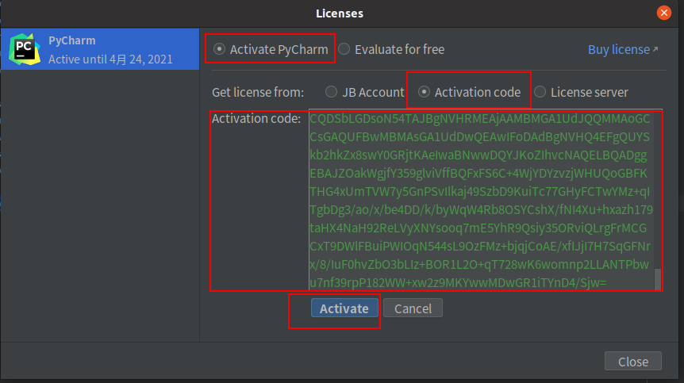

完成了。


给项目配置conda虚拟环境

首先，创建一个项目的虚拟环境，例如：mofang，那我虚拟环境名称也叫mofang。

```bash
conda create -n mofang python=3.8  flask celery
```


OK，接下来在pycharm中指定虚拟环境即可。你可以通过 `New Project`来创建一个新的项目，创建项目时，找到 `New environment using`后面选项，切换到Conda即可。也可以参考我的做法。

这里，我已经在桌面创建了一个空目录作为项目目录了。所以直接点选"open"。


接下来，在pycharm窗口左上方，选择 `File`，选择 `Settings`，当然，也可以直接通过快捷键 `Ctrl+Shift+S`，直接打开配置窗口.


打开 `Project: 项目名`，点选 `Python Interpreter`，再点选当前设置窗口右上角的小齿轮⚙。点击"Add"。


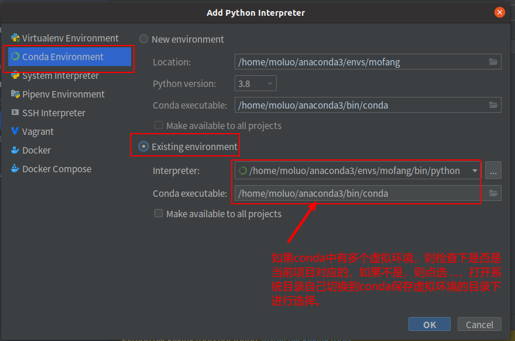

选择完成以后，一路OK，确定。再次回到编辑器界面，打开编辑器内置的终端，可以看到已经切换到我们设置的虚拟环境了。

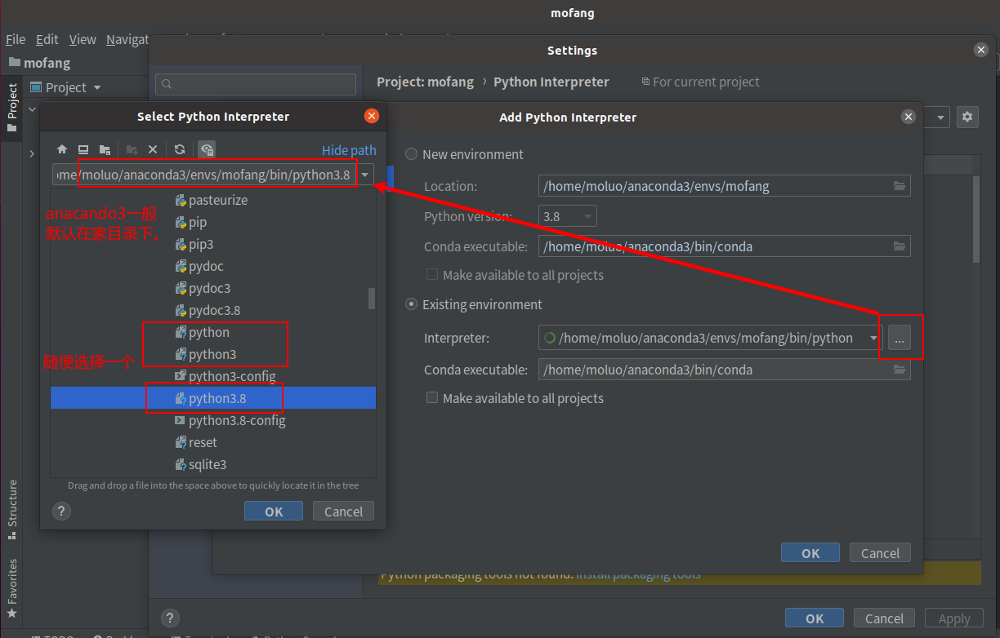


### draw.io13.x.x

桌面版本：https://github.com/jgraph/drawio-desktop

**Appimage**下载：https://github.com/jgraph/drawio-desktop/releases/download/v13.7.9/draw.io-x86_64-13.7.9.AppImage

如果下载速度太慢可以从网盘下载，链接：https://pan.baidu.com/s/1ZTIGqH94tzzWB0JeY0sjPw。提取码：wune

安装和快捷启动

```bash
sudo mkdir /opt/draw.io
sudo mv ~/Downloads/draw.io-x86_64-13.7.9.AppImage /opt/draw.io/
cd /opt/draw.io/
chmod a+x draw.io-x86_64-13.7.9.AppImage
# 从github或者官网上下载一个logo图标到桌面，然后剪切到/opt/draw.io/目录下
sudo mv ~/Desktop/icon.svg /opt/draw.io/
sudo vim /usr/share/applications/drawio.desktop
```

`drawio.desktop`，内容如下：

```bash
[Desktop Entry]
Encoding=UTF-8
Name=drawio
Comment=drawio
Exec=/opt/draw.io/draw.io-x86_64-13.7.9.AppImage
Icon=/opt/draw.io/icon.svg
Terminal=0
StartupNotify=true
Type=Application
Categories=Application;draw;
```


打开drawio查看效果。


### Golang

Github地址：https://github.com/golang/go

Golang官方网站：https://golang.org/

Golang中文官网：https://golang.google.cn/dl/

安装包下载地址：https://golang.google.cn/dl/go1.16.2.linux-amd64.tar.gz

#### 安装配置

从下载压缩包 `go1.12.1.linux-amd64.tar.gz`，解压到 `/usr/local/`目录下[这个目录是官方推荐的]。

```bash
cd ~/Downloads
wget https://golang.google.cn/dl/go1.16.2.linux-amd64.tar.gz
sudo tar -xzf go1.16.2.linux-amd64.tar.gz -C /usr/local
# 直接在终端运行Golang执行文件，检查版本，看是否能正常使用。
/usr/local/go/bin/go version
```

效果如下，证明安装成功。


接下来，在 `~/.bashrc`文件中配置Golang相关的环境变量。

```shell
vim  ~/.bashrc
```

在文件末尾追加如下内容，`:wq`保存退出

```shell
export GOROOT=/usr/local/go
export PATH=$PATH:$GOROOT/bin
```


刷新环境变量

```shell
source ~/.bashrc
# 再使用`go version`检测环境变量是否生效。
go version
```


开发时，很多工具代码不会全部都是由我们自己编写，这样的话实在太累了， 所以我们往往需要加载第三方类库代码到项目中调用，所以我们必须配置 `$GOPATH`，否则go命令不知道这些第三方代码要安装到什么位置。

`$GOPATH`目录约定有三个子目录，在我们配置了 `$GOPATH`以后，go命令会在使用的时候自动帮我们生成。

- `src`目录，存放源代码。
- `pkg`目录，编译时生成的中间文件。
- `bin`目录，编译后生成的可执行文件。

```bash
mkdir -p ~/go/{bin,pkg,src}
```

打开环境变量文件，，在文件末尾进行配置。

```shell
vim  ~/.bashrc
```

把Golang相关配置信息，修改为如下内容，并 `:wq`退出

```shell
export GOROOT=/usr/local/go
export GOPATH=$HOME/go
export PATH=$PATH:$GOROOT/bin:$GOPATH/bin
```

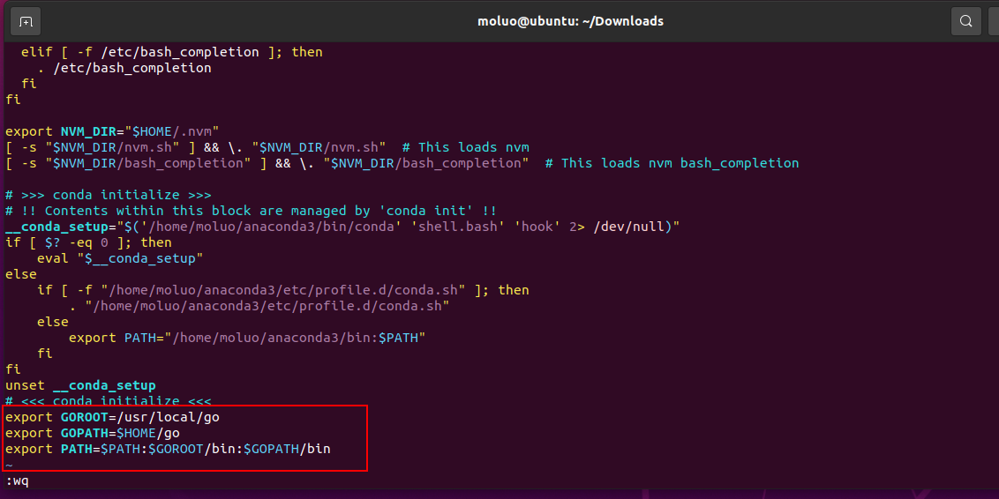

刷新环境变量

```shell
source ~/.bashrc
```


#### 镜像加速

因为go下载安装模块是基于git 从github.com中拉取的。所以有时候网速很慢甚至无法拉取的情况。所以需要配置代理。

官网：https://goproxy.io/zh/

打开环境变量文件

```shell
vim  ~/.bashrc
```

在文件末尾进行配置，并 `:wq`保存退出。

```bash
export GO111MODULE=on
export GOPROXY=https://goproxy.io,direct
```

刷新环境变量

```bash
source ~/.bashrc
```

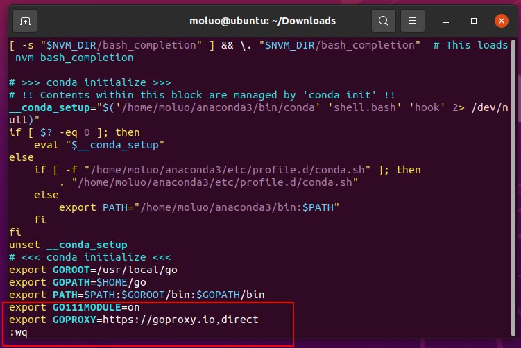


### Goland编辑器

#### 基本安装

官网下载地址：https://www.jetbrains.com/go/download/other.html

在浏览器中打开下载地址，把最新版本下载回来并解压出来剪切到 `/opt`目录下，接着切换工作目录到 `/opt`，启动goland。


```shell
cd ~/Downloads
tar -zxvf goland-2020.3.4.tar.gz
sudo mv ~/Downloads/goland-2020.3.4 /opt
cd /opt/GoLand-2020.3.4/bin/
sh goland.sh
```


先选择免费使用30天


上面的启动goland方式依赖终端窗口，窗口关了，goland就关闭了。所以我们设置为系统应用方式让ubuntu自动加载运行。

```bash
cd /usr/share/applications
sudo vim goland.desktop
```

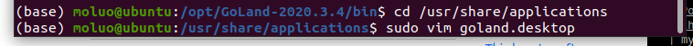

goland.desktop，内容如下：

```bash
[Desktop Entry]
Encoding=UTF-8
Name=goland
Comment=goland编辑器
Exec=/opt/GoLand-2020.3.4/bin/goland.sh
Icon=/opt/GoLand-2020.3.4/bin/goland.svg
Categories=Application;Web;MySQL;IDE;goland
Version=1.0
Type=Application
Terminal=0
```

保存，退出。:wq


#### 合理使用

```
JetBrains2020全家桶激活方式  链接：https://pan.baidu.com/s/1ZTIGqH94tzzWB0JeY0sjPw     提取码：wune 
```

从网盘上面下载插件包放到ubuntu桌面下。其他位置也可以，只要你能记住。


使用goland打开项目（没有项目，自己在桌面创建一个目录）。


打开goland的settngs配置进入插件中心plugins。


从硬盘中读取插件包。`install Plugin from Disk`。


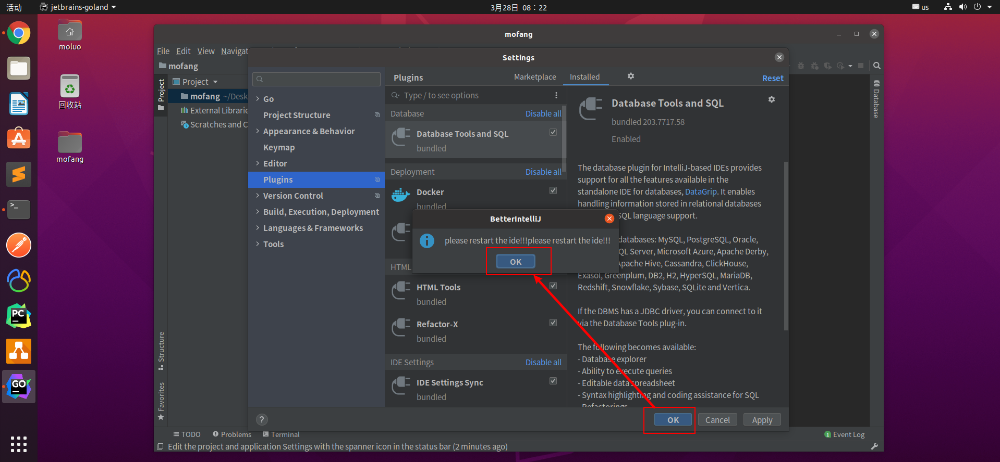

完成了以后，接下来关闭goland。再重新打开。

```bash
# 如果不重启，配置不会生效，可以通过以下命令杀死pycharm 
kill -9 `ps aux | grep goland`
```

重启goland以后，在顶部菜单栏，点击 `Help`，点选Edit Custom VM Options...

查看最后一项配置。如果没有，则重复上面settngs->plugins->安装插件的步骤，并重启pycharm。

注意，路径地址，自己要检查是否正确。反正就是用户家目录下有个隐藏目录 `.BetterIntelliJ`，插件就在隐藏目录下。

```bash
-javaagent:/home/moluo/.BetterIntelliJ/BetterIntelliJ-1.15.jar
```


注册激活码。把网盘一并下载回来的文件 `激活补丁key.txt`中的激活码复制。注意，是打开文件，复制文件里面的激活码。


打开pycharm的 `Help`下面的 `Register`。


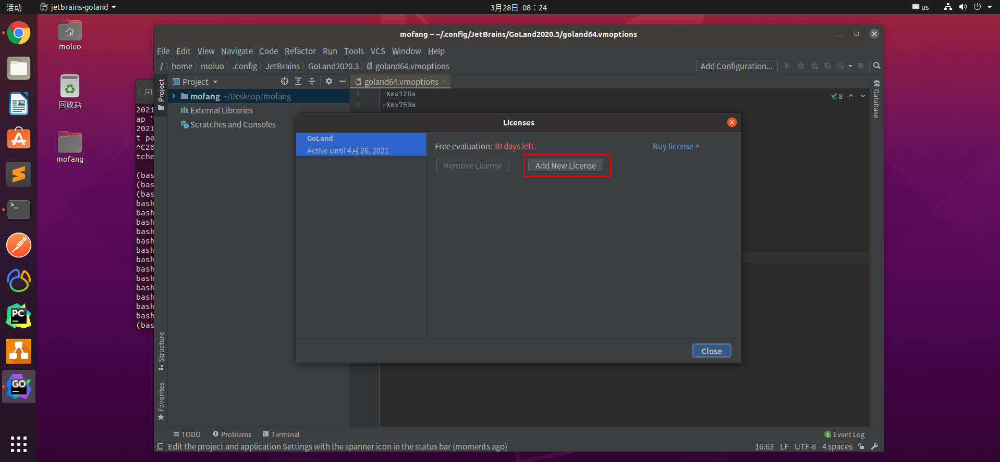

填写激活码，这里如果激活码无效，自己找个新的。

```bash
BISACXYELK-eyJsaWNlbnNlSWQiOiJCSVNBQ1hZRUxLIiwibGljZW5zZWVOYW1lIjoiQ2hpbmFOQiIsImFzc2lnbmVlTmFtZSI6IiIsImFzc2lnbmVlRW1haWwiOiIiLCJsaWNlbnNlUmVzdHJpY3Rpb24iOiIiLCJjaGVja0NvbmN1cnJlbnRVc2UiOmZhbHNlLCJwcm9kdWN0cyI6W3siY29kZSI6IklJIiwicGFpZFVwVG8iOiIyMDk5LTEyLTMxIiwiZXh0ZW5kZWQiOmZhbHNlfSx7ImNvZGUiOiJBQyIsInBhaWRVcFRvIjoiMjA5OS0xMi0zMSIsImV4dGVuZGVkIjpmYWxzZX0seyJjb2RlIjoiRFBOIiwicGFpZFVwVG8iOiIyMDk5LTEyLTMxIiwiZXh0ZW5kZWQiOnRydWV9LHsiY29kZSI6IlJTQyIsInBhaWRVcFRvIjoiMjA5OS0xMi0zMSIsImV4dGVuZGVkIjp0cnVlfSx7ImNvZGUiOiJQUyIsInBhaWRVcFRvIjoiMjA5OS0xMi0zMSIsImV4dGVuZGVkIjpmYWxzZX0seyJjb2RlIjoiUlNGIiwicGFpZFVwVG8iOiIyMDk5LTEyLTMxIiwiZXh0ZW5kZWQiOnRydWV9LHsiY29kZSI6IkdPIiwicGFpZFVwVG8iOiIyMDk5LTEyLTMxIiwiZXh0ZW5kZWQiOmZhbHNlfSx7ImNvZGUiOiJETSIsInBhaWRVcFRvIjoiMjA5OS0xMi0zMSIsImV4dGVuZGVkIjp0cnVlfSx7ImNvZGUiOiJDTCIsInBhaWRVcFRvIjoiMjA5OS0xMi0zMSIsImV4dGVuZGVkIjpmYWxzZX0seyJjb2RlIjoiUlMwIiwicGFpZFVwVG8iOiIyMDk5LTEyLTMxIiwiZXh0ZW5kZWQiOnRydWV9LHsiY29kZSI6IlJDIiwicGFpZFVwVG8iOiIyMDk5LTEyLTMxIiwiZXh0ZW5kZWQiOnRydWV9LHsiY29kZSI6IlJEIiwicGFpZFVwVG8iOiIyMDk5LTEyLTMxIiwiZXh0ZW5kZWQiOmZhbHNlfSx7ImNvZGUiOiJQQyIsInBhaWRVcFRvIjoiMjA5OS0xMi0zMSIsImV4dGVuZGVkIjpmYWxzZX0seyJjb2RlIjoiUlNWIiwicGFpZFVwVG8iOiIyMDk5LTEyLTMxIiwiZXh0ZW5kZWQiOnRydWV9LHsiY29kZSI6IlJTVSIsInBhaWRVcFRvIjoiMjA5OS0xMi0zMSIsImV4dGVuZGVkIjpmYWxzZX0seyJjb2RlIjoiUk0iLCJwYWlkVXBUbyI6IjIwOTktMTItMzEiLCJleHRlbmRlZCI6ZmFsc2V9LHsiY29kZSI6IldTIiwicGFpZFVwVG8iOiIyMDk5LTEyLTMxIiwiZXh0ZW5kZWQiOmZhbHNlfSx7ImNvZGUiOiJEQiIsInBhaWRVcFRvIjoiMjA5OS0xMi0zMSIsImV4dGVuZGVkIjpmYWxzZX0seyJjb2RlIjoiREMiLCJwYWlkVXBUbyI6IjIwOTktMTItMzEiLCJleHRlbmRlZCI6dHJ1ZX0seyJjb2RlIjoiUERCIiwicGFpZFVwVG8iOiIyMDk5LTEyLTMxIiwiZXh0ZW5kZWQiOnRydWV9LHsiY29kZSI6IlBXUyIsInBhaWRVcFRvIjoiMjA5OS0xMi0zMSIsImV4dGVuZGVkIjp0cnVlfSx7ImNvZGUiOiJQR08iLCJwYWlkVXBUbyI6IjIwOTktMTItMzEiLCJleHRlbmRlZCI6dHJ1ZX0seyJjb2RlIjoiUFBTIiwicGFpZFVwVG8iOiIyMDk5LTEyLTMxIiwiZXh0ZW5kZWQiOnRydWV9LHsiY29kZSI6IlBQQyIsInBhaWRVcFRvIjoiMjA5OS0xMi0zMSIsImV4dGVuZGVkIjp0cnVlfSx7ImNvZGUiOiJQUkIiLCJwYWlkVXBUbyI6IjIwOTktMTItMzEiLCJleHRlbmRlZCI6dHJ1ZX0seyJjb2RlIjoiUFNXIiwicGFpZFVwVG8iOiIyMDk5LTEyLTMxIiwiZXh0ZW5kZWQiOnRydWV9LHsiY29kZSI6IkRQIiwicGFpZFVwVG8iOiIyMDk5LTEyLTMxIiwiZXh0ZW5kZWQiOnRydWV9LHsiY29kZSI6IlJTIiwicGFpZFVwVG8iOiIyMDk5LTEyLTMxIiwiZXh0ZW5kZWQiOnRydWV9XSwibWV0YWRhdGEiOiIwMTIwMjAwNzI4RVBKQTAwODAwNiIsImhhc2giOiIxNTAyMTM1NC8wOi0xMjUxMTE0NzE3IiwiZ3JhY2VQZXJpb2REYXlzIjowLCJhdXRvUHJvbG9uZ2F0ZWQiOmZhbHNlLCJpc0F1dG9Qcm9sb25nYXRlZCI6ZmFsc2V9-H7NUmWcLyUNV1ctnlzc4P79j15qL56G0jeIYWPk/HViNdMg1MqPM7BR+aHR28yyuxK7Odb2bFDS8CeHNUtv7nT+4fUs85JJiqc3wc1psRpZq5R77apXLOmvmossWpbAw8T1hOGV9IPUm1f2O1+kLBxrOkdqPpv9+JanbdL7bvchAid2v4/dyQMBYJme/feZ0Dy2l7Jjpwno1TeblEAu0KZmarEo15or5RUNwtaGBL5+396TLhnw1qL904/uPnGftjxWYluLjabO/uRu/+5td8UA/39a1nvGU2nORNLk2IdRGIheiwIiuirAZrII9+OxB+p52i3TIv7ugtkw0E3Jpkw==-MIIDlzCCAn+gAwIBAgIBCTANBgkqhkiG9w0BAQsFADAYMRYwFAYDVQQDEw1KZXRQcm9maWxlIENBMCAXDTE4MTEwMTEyMjk0NloYDzIwOTkwODA5MDIyNjA3WjBoMQswCQYDVQQGEwJDWjEOMAwGA1UECBMFTnVzbGUxDzANBgNVBAcTBlByYWd1ZTEZMBcGA1UEChMQSmV0QnJhaW5zIHMuci5vLjEdMBsGA1UEAxMUcHJvZDN5LWZyb20tMjAxODExMDEwggEiMA0GCSqGSIb3DQEBAQUAA4IBDwAwggEKAoIBAQCdXyaNhhRySH1a8d7c8SlLLFdNcQP8M3gNnq7gudcpHC651qxRrN7Qks8gdXlIkA4u3/lp9ylp95GiIIDo4ydYje8vlTWDq02bkyWW/G7gZ3hkbBhRUK/WnNyr2vwWoOgwx5CfTRMjKkPkfD/+jffkfNfdGmGcg9yfnqPP9/AizKzWTsXSeS+0jZ8Nw5tiYFW+lpceqlzwzKdTHug7Vs0QomUPccRtZB/TBBEuiC7YzrvLg4Amu0I48ETAcch/ztt00nx/oj/fu1DTnz4Iz4ilrNY+WVIEfDz/n3mz+PKI9kM+ZeB0jAuyLsiC7skGpIVGX/2HqmZTtJKBZCoveAiVAgMBAAGjgZkwgZYwSAYDVR0jBEEwP4AUo562SGdCEjZBvW3gubSgUouX8bOhHKQaMBgxFjAUBgNVBAMMDUpldFByb2ZpbGUgQ0GCCQDSbLGDsoN54TAJBgNVHRMEAjAAMBMGA1UdJQQMMAoGCCsGAQUFBwMBMAsGA1UdDwQEAwIFoDAdBgNVHQ4EFgQUYSkb2hkZx8swY0GRjtKAeIwaBNwwDQYJKoZIhvcNAQELBQADggEBAJZOakWgjfY359glviVffBQFxFS6C+4WjYDYzvzjWHUQoGBFKTHG4xUmTVW7y5GnPSvIlkaj49SzbD9KuiTc77GHyFCTwYMz+qITgbDg3/ao/x/be4DD/k/byWqW4Rb8OSYCshX/fNI4Xu+hxazh179taHX4NaH92ReLVyXNYsooq7mE5YhR9Qsiy35ORviQLrgFrMCGCxT9DWlFBuiPWIOqN544sL9OzFMz+bjqjCoAE/xfIJjI7H7SqGFNrx/8/IuF0hvZbO3bLIz+BOR1L2O+qT728wK6womnp2LLANTPbwu7nf39rpP182WW+xw2z9MKYwwMDwGR1iTYnD4/Sjw=
```


完成了。


### GitLab13.x.x

GitLab是一个用于仓库管理系统的开源项目，使用Git作为代码管理工具，并在此基础上搭建起来的web服务。

GitLab 官方网站地址：https://gitlab.com/

GitLab 中文社区地址：https://gitlab.com/xhang/gitlab

注意：gitlab启动需要2CPU，4G内存以上，否则机器无法支撑它的运行。

安装软件依赖

```bash
cd ~/Downloads
sudo apt-get install curl openssh-server ca-certificates postfix
# Postfix Configuration 选择 No configuration 就好
sudo apt-get install wget
```


按下左右方向键，选中确定，回车。


按下上方向键，选择第一个选项，按下右方向键，然后选择确定。回车。


安装继续。


下载安装包并安装。

```bash
wget https://mirrors.tuna.tsinghua.edu.cn/gitlab-ce/ubuntu/pool/focal/main/g/gitlab-ce/gitlab-ce_13.9.4-ce.0_amd64.deb
sudo dpkg -i gitlab-ce_13.9.4-ce.0_amd64.deb
```


根据上面提示，接下来修改gitlab配置文件，配置gitlab的http访问地址和端口。

注意：gitlab也内置了一个nginx，它会和前面我们安装的nginx同时默认监听80端口，所以gitlab启动会出bug的。所以需要调整成其他端口。

```bash
sudo vim /etc/gitlab/gitlab.rb

# external_url表示外部访问gitlab的地址。可以是ip或者域名。
# 这里因为是本地，IP将来有可能会改动，所以在/etc/hosts下配置一个域名。
# 在配置文件开头32行位置找到external_url配置项，修改如下，:wq保存退出。
external_url 'http://gitlab.example.com:8008'
```


重新编译gitlab配置，因为是安装后首次编译，所以编译过程可能需要较长时间。

```bash
sudo gitlab-ctl reconfigure
```

开始编译。


编译完成。


配置本地IP地址，指向 `external_url`配置项的域名。

```bash
# 查看当前系统的网卡IP地址。
ip a

# 打开域名解析文件
sudo vim /etc/hosts

# 填入以下内容后，:wq保存退出，如果只是自己玩的话，IP改成127.0.0.1也可以的。
192.168.233.129  gitlab.example.com
```

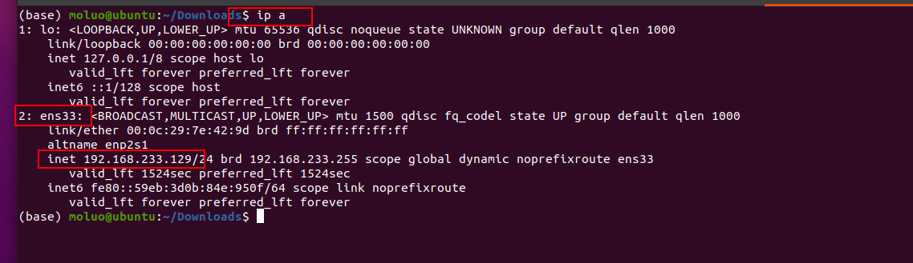


重启启动gitlab。

```bash
sudo gitlab-ctl restart
# 因为gitlab启动时需要大量系统资源，所以没事的话，我这里设置开机关闭了。
systemctl disable gitlab-runsvdir.service
```


完成上面的步骤以后，现在可以打开浏览器访问我们的gitlab管理系统了。地址就是上面配置的：http://gitlab.example.com:8008/


注意：首次访问gitlab会自动跳转到密码修改页面。这是root用户的密码。这里我直接设置为123123123了。设置完成以后，一定要牢记！！！


OK，更改密码完成以后，直接输入账户 `root`和密码 `123123123`登陆了。当然，看绿色登陆框下方的链接，gitlab还是可以注册新用户的。


登陆后界面。


这里，我们创建一个项目，例如：mofang。


创建项目仓库的基本表单。


这是我最终填写的信息。公有仓库，没有README文件。项目地址使用账号+项目名作为前缀。


创建项目仓库成功。


接下来，我们就可以在本地提交项目代码到mofang仓库了。支持2种方式：ssh和http


我们先到桌面创建一个项目进行版本库初始化，然后跟着空仓库说明，初始化本地git配置，然后通过http提交代码到版本库。

```bash
cd ~/Desktop
mkdir mofang
cd mofang
vim index.html
# 随便写点东西，:wq保存退出即可。
```


```bash
# 因为是首次使用git提交代码版本，所以必须设置用户基本信息。user.name和user.email
git config --global user.name "Administrator"       # 这里是用户昵称。
git config --global user.email "admin@example.com"  # 这里是用户邮箱。

# 因为本地创建了项目目录，所以我们直接在项目根目录下初始化代码版本，然后添加/提交版本记录，然后推送到gitlab服务端版本库即可。
git init
git remote add origin http://gitlab.example.com:8008/root/mofang.git
git add .
git commit -m "项目初始化"
git push -u origin master
```


接下来，我们刷新下浏览器下的仓库页面。可以发现内容已经发生了改变。这证明我们正常使用gitlab了。


上面提交的信息，因为我们是公有仓库，所以其他游客也是可以看到的。只是界面不一样。我们可以通过另一个浏览器，火狐浏览器打开当前项目地址进行查看。


当然，上面的提交，我们使用了http协议地址提交，所以每次提交都要输入一次账号密码。如果不希望那么麻烦的话，可以配置ssh登陆。

常用操作

```bash
# 查看gitlab运行状态
sudo gitlab-ctl status

# 重启gitlab
sudo gitlab-ctl restart

# 关闭gitlab
sudo gitlab-ctl stop

# 开启gitlab
sudo gitlab-ctl start
```

### PHP8.0

默认的 Ubuntu 20.04 软件源上包含了 PHP 7.4 版本。但是我们要安装php8.0。

````bash
sudo apt install -y lsb-release ca-certificates apt-transport-https
sudo add-apt-repository ppa:ondrej/php

sudo apt install -y php7.4-fpm php7.4-cli php7.4-mbstring php7.4-zip php7.4-mysql php7.4-xml php7.4-gd php7.4-bcmath php7.4-dev php7.4-curl

mkdir ~/Desktop/www/74.php.cn -p

echo -e "<?php\n\necho phpinfo();" > ~/Desktop/www/74.php.cn/index.php

sudo vim /etc/nginx/sites-available/74.php.cn.conf


server {
	listen 80;
	root /home/moluo/Desktop/www/74.php.cn;
	index index.php index.html index.htm index.nginx-debian.html;
	server_name 74.php.cn;
	location / {
		try_files $uri $uri/ =404;
	}
	location ~ \.php$ {
		include snippets/fastcgi-php.conf;
		fastcgi_pass unix:/var/run/php/php7.4-fpm.sock;
	}
}

sudo ln -sf /etc/nginx/sites-available/74.php.cn.conf /etc/nginx/sites-enabled/74.php.cn.conf

sudo service nginx restart

sudo service php7.4-fpm restart

sudo vim /etc/hosts

127.0.0.1 74.php.cn

浏览器访问： http://74.php.cn
````

phpredis

```bash
mkdir -p ~/Downloads/php && cd ~/Downloads/php
git clone https://hub.fastgit.org/phpredis/phpredis.git
cd phpredis/
phpize
./configure
make && sudo make install
sudo vim /etc/php/7.4/mods-available/redis.ini
# 在 ini 中加入以下一行内容，不要#号，来启用 phpredis 扩展，:wq保存退出，
# extension=redis.so

sudo ln -s /etc/php/7.4/mods-available/redis.ini /etc/php/7.4/cli/conf.d/20-redis.ini

sudo service php7.4-fpm restart
php --ri redis | grep -i version
```

#### swoole

```bash
sudo apt-get install libcurl4-openssl-dev
sudo apt install -y php7.4-curl
mkdir -p ~/Downloads/php && cd  ~/Downloads/php
wget https://codeload.github.com/swoole/swoole-src/tar.gz/v4.6.2
tar zxvf v4.6.2 && cd swoole-src-4.6.2/
phpize

./configure \
--enable-coroutine \
--enable-openssl  \
--enable-http2  \
--enable-swoole-curl \
--enable-async-redis \
--enable-sockets \
--enable-mysqlnd && \
make clean && make && sudo make install

sudo vim /etc/php/7.4/mods-available/swoole.ini
# 在 ini 中加入以下一行内容，不要#号，来启用 phpredis 扩展，:wq保存退出，
# extension=swoole.so
# swoole.use_shortname = off

sudo ln -sf /etc/php/7.4/mods-available/swoole.ini /etc/php/7.4/cli/conf.d/20-swoole.ini

sudo service php7.4-fpm restart
php --ri swoole | grep -i version
```

基于swoole构建的echo服务器

通过编辑器打开 `~/Desktop/www/74.php.cn/inde.php`，输入以下内容：

```php
<?php
//创建Server对象，监听 127.0.0.1:9501 端口
$server = new Swoole\Server('127.0.0.1', 9501);

//监听连接进入事件
$server->on('Connect', function ($server, $fd) {
    echo "Client: Connect.\n";
});

//监听数据接收事件
$server->on('Receive', function ($server, $fd, $reactor_id, $data) {
    $server->send($fd, "Server: {$data}");
});

//监听连接关闭事件
$server->on('Close', function ($server, $fd) {
    echo "Client: Close.\n";
});

//启动服务器
$server->start(); 
```

运行echo服务器

```bash
php ~/Desktop/www/74.php.cn/index.php
```

`Ctrl+Shift+T`新开一个终端，使用 `telnet/netcat` 工具连接服务器。

```bash
telnet 127.0.0.1 9501
# 在终端下输入hello
hello
# 打印内容如下，表示swoole可以正常使用。
# Server: hello
```

安装composer

```bash
sudo apt install -y wget php-cli php-zip unzip
mkdir -p ~/Downloads/php && cd  ~/Downloads/php
sudo curl -s https://getcomposer.org/installer | sudo php
sudo php composer-setup.php --install-dir=/usr/local/bin --filename=composer
# 踩坑。不要用phpcomposer官方镜像源，改成阿里云的镜像源。太坑了，没有hyperf。
php7.4 /usr/local/bin/composer.phar config -g repo.packagist composer https://mirrors.aliyun.com/composer/
```

安装hyperf框架

```bash
mkdir -p ~/Desktop/www/ && cd ~/Desktop/www/
php7.4 /usr/local/bin/composer.phar create-project hyperf/hyperf-skeleton

cd hyperf-skeleton
php7.4 /usr/local/bin/composer.phar install
php7.4 bin/hyperf.php start
```
