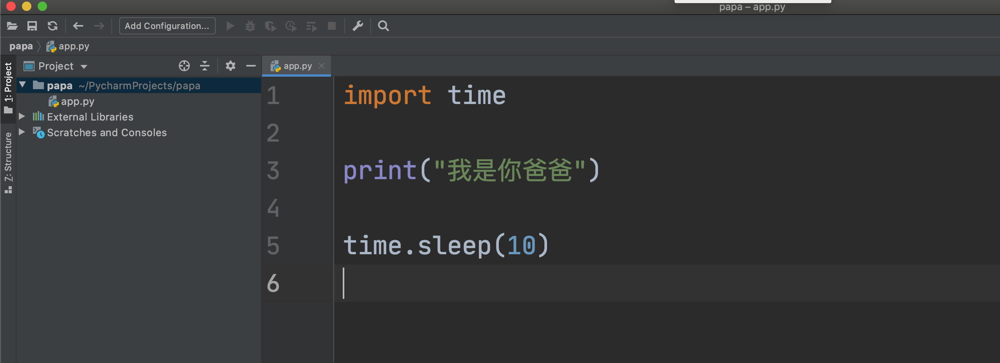
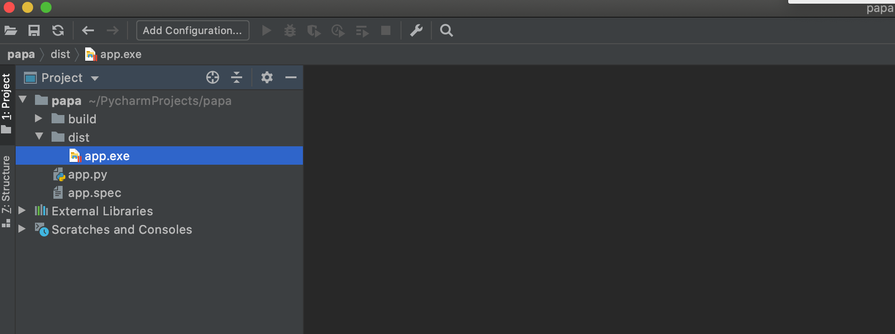
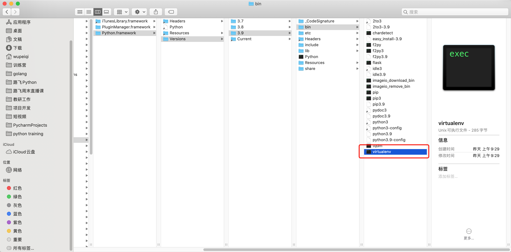
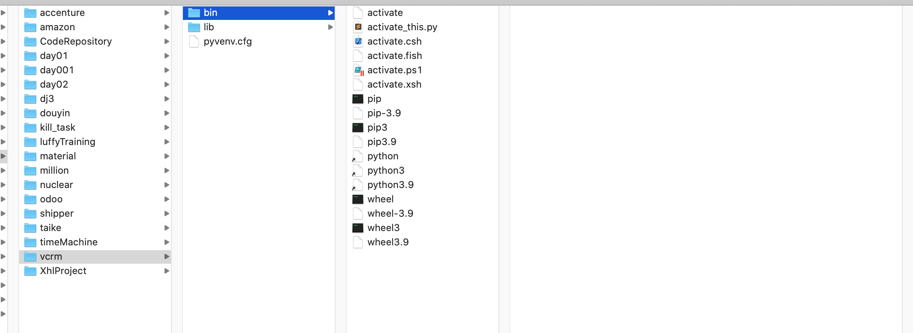
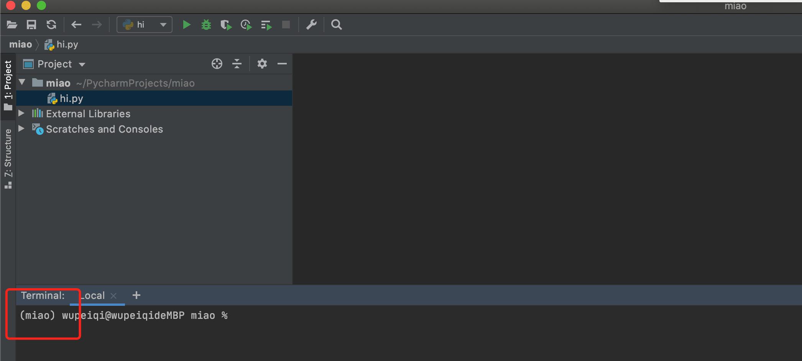
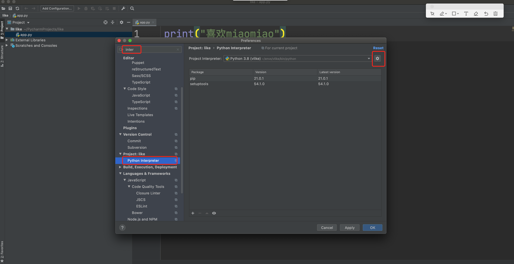
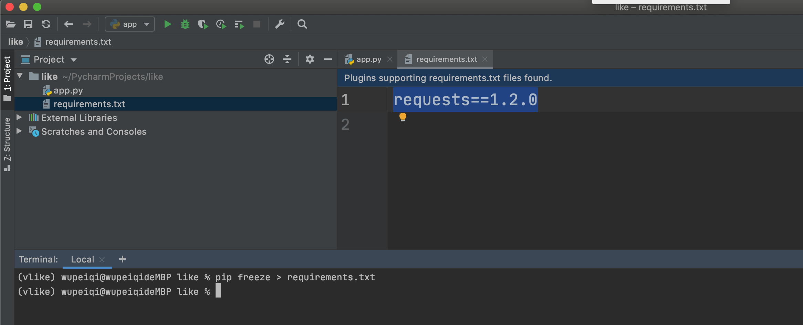
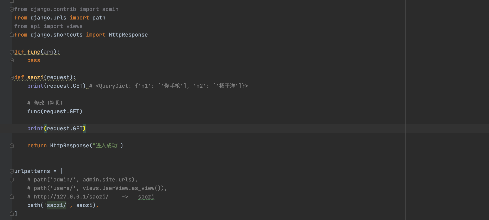
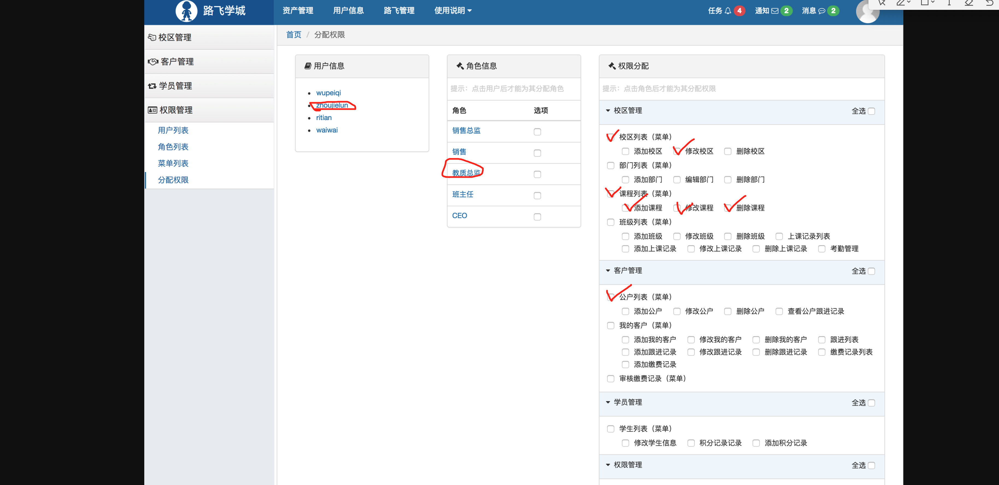

# day01 基础入门

本节设计内容范围：基础 ~ 数据类型

周末直播课的目标： 强化知识 + 实战案例 + 名企面试题（50）  + 收集学员问题 + 答疑


## 1.编程语言的区别？

Python和其他语言的区别？

解释型语言和编译型语言区别？

| 类型       | 原理                                                         | 优点                                                         | 缺点                         |
| ---------- | ------------------------------------------------------------ | ------------------------------------------------------------ | ---------------------------- |
| 编译型语言 | 通过专门的编译器，将所有源代码一次性转换成特定平台（Windows、Linux、macOS等）的机器码（以可执行文件的形式存在）。 | 编译一次后，脱离了编译器也能运行，并且运行效率高。           | 可移植性差，不够灵活。       |
| 解释型语言 | 通过专门的解释器，根据需要可以将部分或全部源代码转换成特定平台（Windos、Linux、macOS等）的机器码。 | 跨平台性好，通过不同的解释器，将相同的源代码解释成不同平台下的机器码。 | 一边执行一边转换，效率较低。 |

### 1.1 C语言

- 安装环境：gcc

- 写代码

  ```c
  #include <stdio.h>
   
  int main()
  {
      printf("Hello, World! \n");
      return 0;
  }
  ```

- 运行

  - 编译，代码 -> 字节码
  - 运行


### 1.2 Go语言

- 安装go环境（go编译器）

- 写代码

  ```python
  package main
  
  import "fmt"
  
  func main() {
  	fmt.Println("hello world")
  }
  ```

- 运行

  - 编译
  - 运行

  ```
  >>> go build hello.go
  >>> ls
  hello    hello.go
  >>> ./hello
  ```

  


### 1.3 Java语言

- java环境

- 写代码

  ```python
  public class Hello {
      public static void main(String[] args) {
          System.out.println("Hello World");
      }
  }
  ```

- 运行

  - 编译
  - 运行


## 2.代码打包

亚马逊价格监测（桌面应用）--->   打包 exe

亚马逊价格监测（桌面应用）--->   打包 exe    ->    安装包（D：xxx) -> 快捷方式放在桌面。


基于pyinstaller可以非常简单的 代码打包exe文件。

我的环境：

- mac系统，写代码（Python相关环境）---> 主要写代码
- 共享文件夹
- win虚拟机，Python相关环境+pyinstaller  ----> 打包出exe文件


### 2.1 mac系统开发




### 2.2 虚拟机

- 安装与mac相同的python环境

- 安装pyinstaller

  ```
  pip install pyinstaller
  ```

- 基于pyinstaller去打包

  ```
  >>> cd 项目目录
  >>> pyinstaller -F app.py
  ```

  ```
  8077 INFO: Warnings written to Y:\PycharmProjects\papa\build\app\warn-app.txt
  8109 INFO: Graph cross-reference written to Y:\PycharmProjects\papa\build\app\xref-app.html
  8125 INFO: checking PYZ
  8125 INFO: Building PYZ because PYZ-00.toc is non existent
  8125 INFO: Building PYZ (ZlibArchive) Y:\PycharmProjects\papa\build\app\PYZ-00.pyz
  8578 INFO: Building PYZ (ZlibArchive) Y:\PycharmProjects\papa\build\app\PYZ-00.pyz completed successfully.
  8578 INFO: checking PKG
  8578 INFO: Building PKG because PKG-00.toc is non existent
  8578 INFO: Building PKG (CArchive) PKG-00.pkg
  10140 INFO: Building PKG (CArchive) PKG-00.pkg completed successfully.
  10140 INFO: Bootloader c:\python39\lib\site-packages\PyInstaller\bootloader\Windows-64bit\run.exe
  10140 INFO: checking EXE
  10140 INFO: Building EXE because EXE-00.toc is non existent
  10140 INFO: Building EXE from EXE-00.toc
  10203 INFO: Copying icons from ['c:\\python39\\lib\\site-packages\\PyInstaller\\bootloader\\images\\icon-console.ico']
  10218 INFO: Writing RT_GROUP_ICON 0 resource with 104 bytes
  10218 INFO: Writing RT_ICON 1 resource with 3752 bytes
  10218 INFO: Writing RT_ICON 2 resource with 2216 bytes
  10218 INFO: Writing RT_ICON 3 resource with 1384 bytes
  10218 INFO: Writing RT_ICON 4 resource with 37019 bytes
  10218 INFO: Writing RT_ICON 5 resource with 9640 bytes
  10218 INFO: Writing RT_ICON 6 resource with 4264 bytes
  10218 INFO: Writing RT_ICON 7 resource with 1128 bytes
  10234 INFO: Updating manifest in Y:\PycharmProjects\papa\build\app\run.exe.ypp_l9xc
  10234 INFO: Updating resource type 24 name 1 language 0
  10249 INFO: Appending archive to EXE Y:\PycharmProjects\papa\dist\app.exe
  10265 INFO: Building EXE from EXE-00.toc completed successfully.
  ```





- 脚本，自己无法展示图片（调用系统的图片预览）。
- 好多代码，代码和依赖 exe文件。


## 3.虚拟环境

- 系统Python环境（录播中带你安装python解释器+配置环境变量）

  ```
  C:\python39\python.exe
         - requests
         - openpyxl
  ```

  ```
  pip install requests==3.2
  pip install openpyxl
  pip install redis
  ```

  开发项目

  ```python
  D:\projects
      day01
      day02
      day03
      ...
      crm项目，需要用requests的1.2版本
      	pip install requests==1.2
  运行：
  	python  day01/start.py
      python  day02/xx.py
      python  day03/oo.py
  ```

- 虚拟环境（拷贝一个环境）

  - 系统Python环境

    ```
    C:\python39
    	C:\python39\python.exe
    ```

  - 虚拟A，把系统中的Python解释器文件拷贝一份。

    ```
    C:\envs\e1
    	C:\envs\e1\python.exe
    	
    	pip install requests==1.2
    ```

  - 虚拟B

    ```
    C:\envs\e2
    	C:\envs\e2\python.exe
    	
    	pip install requests==2.3
    ```

  - 虚拟C

    ```
    C:\envs\e3
    	C:\envs\e3\python.exe
    ```

  潜规则，项目开发时会为每个项目创建一个虚拟环境。

  ```
  同学们
  	- 学习阶段用一个环境就行（系统python环境）
  		- day01
  		- day01
  		- day01
  		- day01
  	- 公司
  		为每个项目都维护一个虚拟环境。
  ```

  

接下来，基于virtualenv来进行虚拟环境的搭建。


### 3.1 安装virtualenv

在系统环境中安装virtualenv

```
pip3.9 install virtualenv
```




### 3.2 基于命令

- 选择一个文件夹当做放置所有虚拟环境的地方。

  ```
  E:\envs\
  ```

- 打开终端

  ```
  cd E:\envs
  virtualenv vcrm --python=python3.9
  ```

  
  


- 想要用虚拟环境去运行代码

  - 激活虚拟环境
    

    ```
    win
    	cd vcrm/bin
    	activate
    ```

  - 运行

    


有人认为，命令太复杂，不想学。

- 现阶段，可以。

- 项目部署，网站写完了。

  ```
  linux操作系统，全部都需要命令。
  ```

  

### 3.3 基于Pycharm

#### 1.创建项目&创建环境





#### 2.运行别人的项目

- 先打开项目

- 创建虚拟环境

- 项目和虚拟环境关联




### 3.4 依赖包问题




```
pip freeze > requirements.txt
```

将当前所在环境中的所有的依赖包全都写入到 requirements.txt。


压缩文件给你

你拿到文件之后

- 解压并打开文件

- 创建虚拟环境并去项目关联

- 安装依赖包

  ```
  pip install -r requirements.txt
  ```

  

### 3.5 项目部署

以后写项目，在Linux系统做项目部署时，一定要创建   虚拟环境+跑项目。


---------------------------------------------------------------------------------------------------------------------------------------------------------------------------------------------

- 毕业去公司，2周，熟悉系统。

  ```
  干入职，老板给你代码。
  ```

- 学生，在自己电脑上跑起来。

  ```
  python+django
  ```

  - 老板，应该给他  `requirements.txt`。

  - 学生，生看了2天。

    ```
    逐步，安装好了  --> 运行不起来。
    ```

  - 要来了  `requirements.txt`，所有安装上。

  - 依然跑不起来。

    ```
    - python3.5
    - python3.7
    ```

    

别人给你项目：

- python版本？（readme.md）
- 要 `requirements.txt`

你写项目：

- python版本？（readme.md）
- 要 `requirements.txt`


------------------------------------------------------------------------------------------------------------------------------------------------------------------------------------------------

北京分部；总部杭州。

- 问题：内部聊天问问题。

  - 邮件
  - 平台
  - git 的 issues

- git要求

  ```
  提交记录
  	xxxxx
  	1.
  	2.
  	3.
  	4.
  ```


## 4.Python源码

- 龟叔

  ```
  用C语言编写了一个软件 -> python解释器
  ```

- 我们

  ```
  用python解释器 + 龟叔定义语法
  
  - 用python语法写代码。
  ```


```
v1 = 123
v2 = 123
```

按理说这种应该在内存中创建两快内存，每个内存都保存123.

Python为了代码效率提升，搞了小数据池。[-5 ~ 257]

```
v1 = 123
v2 = 123
```


## 5.实战案例

### 5.1 微信支付功能（支付宝）

```
签名算法:https://pay.weixin.qq.com/wiki/doc/api/wxa/wxa_api.php?chapter=4_3

第一步，设所有发送或者接收到的数据为集合M，将集合M内非空参数值的参数按照参数名ASCII码从小到大排序（字典序），使用URL键值对的格式（即key1=value1&key2=value2…）拼接成字符串stringA。

特别注意以下重要规则：

◆ 参数名ASCII码从小到大排序（字典序）；
◆ 如果参数的值为空不参与签名；
◆ 参数名区分大小写；
◆ 验证调用返回或微信主动通知签名时，传送的sign参数不参与签名，将生成的签名与该sign值作校验。
◆ 微信接口可能增加字段，验证签名时必须支持增加的扩展字段
第二步，在stringA最后拼接上key得到stringSignTemp字符串，并对stringSignTemp进行MD5运算，再将得到的字符串所有字符转换为大写，得到sign值signValue。
```

```
假设传送的参数如下：
{
    appid： wxd930ea5d5a258f4f
    mch_id： 10000100
    device_info： 1000
    body： test
    nonce_str： ibuaiVcKdpRxkhJA
}

第一步：对参数按照key=value的格式，并按照参数名ASCII字典序排序如下：
stringA="appid=wxd930ea5d5a258f4f&body=test&device_info=1000&mch_id=10000100&nonce_str=ibuaiVcKdpRxkhJA";

第二步：拼接API密钥：

MD5签名方式：

stringSignTemp = stringA+"&key=192006250b4c09247ec02edce69f6a2d" //注：key为商户平台设置的密钥key

sign=MD5(stringSignTemp).toUpperCase()="9A0A8659F005D6984697E2CA0A9CF3B7" //注：MD5签名方式


最终得到最终发送的数据：
    <xml>
        <appid>wxd930ea5d5a258f4f</appid>
        <mch_id>10000100</mch_id>
        <device_info>1000</device_info>
        <body>test</body>
        <nonce_str>ibuaiVcKdpRxkhJA</nonce_str>
        <sign>9A0A8659F005D6984697E2CA0A9CF3B7</sign>
    </xml>
```

```python
key="192006250b4c09247ec02edce69f6a2d"
info = {
    "appid": "wxd930ea5d5a258f4f",
    "mch_id": "10000100",
    "device_info": "1000",
    "body": "test",
    "nonce_str": "ibuaiVcKdpRxkhJA",
}
# 最后的结果需要一个字符串就行
result = "<xml>...</xml>"
```


### 5.2 记录用户访问频率

django restful framework框架会用到（框架源码）。

- 用户配置

  ```
  1/s   2/s    8/s  (每秒最多访问次数)
  2/m   5/m  (每分钟最多访问次数)
  7/h   1/h  (每小时最多访问次数)
  9/d   12/d (每天最多访问次数)
  ```

- 代码可以接收用户访问，就按照以上规则来。

```python
import time

# 所有用户访问记录
record = {
    "alex": [1615102211, 1615102211]
}

# 第一步：提示用户去配置频率（1/s、5/m）
rate = input("请输入限制频率：")
num, period = rate.split('/')
num_requests = int(num)
duration = {'s': 1, 'm': 60, 'h': 3600, 'd': 86400}[period[0]]

# 第二步：用户可以开始访问
while True:
    name = input(">>>")  # alex  / eric
    history = record.get(name, [])  # None
    ctime = time.time()

    while history and history[-1] <= ctime - duration:
        history.pop()
    if len(history) >= num_requests:
        print("频率限制请稍等访问")
        continue
    if name in record:
        record[name].insert(0, ctime)
    else:
        record[name] = [ctime, ]
    print("访问成功", ctime)

```


alex            eric

系统，每个班1分钟访问5次。

15:03 18   alex

15:03 20   alex

15:03 24   alex

15:03 25   alex

15:03 26  alex

15:03 27   alex  提示，无法访问。

15:03 37   alex  提示，无法访问。

15:03 47   alex  提示，无法访问。

15:03 57   alex  提示，无法访问。

15:04 19    alex  

15:04 20   alex  提示，无法访问。


### 5.3 数据拷贝的问题

```python
data = [ 11,22,33,4,5 ]
def func(arg):
    arg.append(999)
func(data)
print(data)
```




### 5.4 权限系统

```
"""
# 1.列表检查是否存在慢
if "xx" in [11,22,33,44]:
    pass
# 2.字典速快（哈希）
if "x" in {"x":1,"y":1}:
    pass

# 3.列表/字典可变类型
info={}
data_list = [11,22,33]
info[666] = data_list

print(info) # {666: [11,22,33] }
print(data_list) # [11,22,33]

data_list.append(999)

print(info) # {666: [11,22,33,999] }
print(data_list) # [11,22,33,999]
"""
```


```python
all_menu_list = [
    {"id":1,"title":"校区管理"},#,'child':[]
    {"id":5,"title":"客户管理"},#,'child':[]
    {"id":10,"title":"学员管理"},#,'child':[]
    {"id":20,"title":"权限管理"},#,'child':[]
]

permission_list = [
    {"id":1,"title":"校区列表","url":"http://127.0.0.1:8000/school/list/","parent_id":None, "menu_id":1},
    {"id":2,"title":"修改","url":"http://127.0.0.1:8000/school/edit/","parent_id":1, "menu_id":None },
    {"id":9,"title":"课程列表","url":"http://127.0.0.1:8000/course/edit/","parent_id":None, "menu_id":1 },
    {"id":10,"title":"添加课程","url":"http://127.0.0.1:8000/course/add/","parent_id":9, "menu_id":None },
    {"id":11,"title":"公户列表","url":"http://127.0.0.1:8000/user/add/","parent_id":None, "menu_id":2 },
]

# 第一题
"""
menu_dict = {}
for item in all_menu_list:
    item['child'] = []
    key = item['id']
    menu_dict[key] = item
    
for ele in permission_list:
    menu_id = ele['menu_id']
    if not menu_id:
        continue
	menu_dict[menu_id]['child'].append(ele['title'])
"""
# 第二题
"""
root_dict=[
	{"id":1,"title":"校区列表","url":"http://127.0.0.1:8000/school/list/","parent_id":None, "menu_id":1,'child':[
		{"id":2,"title":"修改","url":"http://127.0.0.1:8000/school/edit/","parent_id":1, "menu_id":None },
	]},
	{"id":9,"title":"课程列表","url":"http://127.0.0.1:8000/course/edit/","parent_id":None, "menu_id":1,'child':[
		{"id":10,"title":"添加课程","url":"http://127.0.0.1:8000/course/add/","parent_id":9, "menu_id":None },
	] },
	{"id":11,"title":"公户列表","url":"http://127.0.0.1:8000/user/add/","parent_id":None, "menu_id":2,'child':[] },
]
permission_dict={
	1:{"id":1,"title":"校区列表","url":"http://127.0.0.1:8000/school/list/","parent_id":None, "menu_id":1,'child':[
		{"id":2,"title":"修改","url":"http://127.0.0.1:8000/school/edit/","parent_id":1, "menu_id":None },
	],
    2:{"id":2,"title":"修改","url":"http://127.0.0.1:8000/school/edit/","parent_id":1, "menu_id":None,'child':[] },
    9:{"id":9,"title":"课程列表","url":"http://127.0.0.1:8000/course/edit/","parent_id":None, "menu_id":1,'child':[
    	{"id":10,"title":"添加课程","url":"http://127.0.0.1:8000/course/add/","parent_id":9, "menu_id":None },
    ] },
    10:{"id":10,"title":"添加课程","url":"http://127.0.0.1:8000/course/add/","parent_id":9, "menu_id":None,'child':[] },
    11:{"id":11,"title":"公户列表","url":"http://127.0.0.1:8000/user/add/","parent_id":None, "menu_id":2,'child':[] },
}
"""
root_list = []
permission_dict = {}
for item in permission_list:
    item['child'] = []
    key = item['id']
    permission_dict[key] = item
    if not item['parent_id']:
        root_list.append(item)
        

for ele in permission_list:
    parent_id = ele['parent_id']
    if not parent_id:
        continue
	permission_dict[parent_id]['child'].append(ele)


    
# 第一题
menu_list = [
    {"id":1,"title":"校区管理","child":["校区列表","课程列表"]},
    {"id":2,"title":"客户管理","child":["公户列表",]},
    {"id":3,"title":"学员管理"..},
    {"id":4,"title":"权限管理"...},
]

# 第二题
permission_list = [
    {"id":1,"title":"校区列表","url":"http://127.0.0.1:8000/school/list/","parent_id":None, "menu_id":1,'child':[
        {"id":2,"title":"修改","url":"http://127.0.0.1:8000/school/edit/","parent_id":1, "menu_id":None },
    ]},
    {"id":9,"title":"课程列表","url":"http://127.0.0.1:8000/course/edit/","parent_id":None, "menu_id":1,'child':[
        {"id":10,"title":"添加课程","url":"http://127.0.0.1:8000/course/add/","parent_id":9, "menu_id":None },
    ] },
]
```





周杰伦登录系统时，

- 默认左边有几个菜单？

  ```python
  校区管理
  	- 校区列表
  	- 课程列表
  客户管理
  	- 公户列表
  ```

- 周杰伦有几个权限？

  ```
  校区列表
  修改校区
  课程列表
  添加课程
  修改课程
  删除课程
  公户列表
  ```

  


## 6.企业面试题（50道）

见面试题附件。


## 7.学员问题

- 基本的语法懂了，简单的循环，单个类的用法也会了，但是遇到一个小项目(比如学生管理系统)，就不知道该怎么下手，准确的讲不知道这里面的组织架构，就是什么时候用类什么时候用函数，还有视图与数据处理文件的关系，什么时候用，什么时候不用。

  ```
  - 优先用函数编程
  - 都有哪些功能
  	- 表结构
  	- 写功能
  ```

- 看案例能够明白，但是在实际项目的运用中就不好用了，总是不能够完全理解，所学的知识与实际脱节，看语法可以，但是做的时候就不会了。

  ```
  编码能力无法赶上的需求。
  
  分享：美乐乐网站（他是什么样子我就做成什么样子）=> 面试。
  ```

- 世界之大无奇不有，要相信很多小白是不会用百度的。不是不用，是不会用，不知道怎么搜

  ```
  1. google（翻墙）
  2. bing
  3. 百度
  	- 知乎
  	- 思否
  	- csdn
  	- 博客园（师兄）
  stackoverflow（英文）
  
  老师：excel文件的积分进行排序（身份信息去重）
  ```

- 一到做作业就懵逼，是不是因为练的太少

  ```
  看最新v2版本
  ```

- 新手很难通过debug断点来寻找错误代码

- 感觉还是一个人在战斗，一开始学习的哪个动力到后期越磨越没。。

  ```
  2周~4周
  ```

- 学了就忘，没有连贯性

- 我在线学习，每天寄出来的时间就是2-3小时，由于自己之前看过点前期还好，到数据类型开始每天的知识点比较多，如果按照课程进度来走就没有足够的时间去练代码巩固所学知识点，但不去练习心里总是不踏实，有点难受。

- 最后的十一点的问题能不能为什么选手可以一直抽牌，感觉应该设计成轮流抽牌一人一轮只有一次抽牌机会（更贴近生活）

- 想了解实际工作上会遇到怎样的项目，运用到哪些知识（即使现在还没学到）。一直学就有种闭着眼睛跑的感觉，还是希望能对自己的定位心里有数，终点在哪，最终要掌握到怎么样的程度。


## 小结、

```BASH
pip install pyinstaller
>>> cd 项目目录
>>> pyinstaller -F app.py   #app.exe 


pip install virtualenv 
bash> virtualenv env_name --python=python3.9

pip freeze > requirements.txt
pip install -r requirements.txt


```


