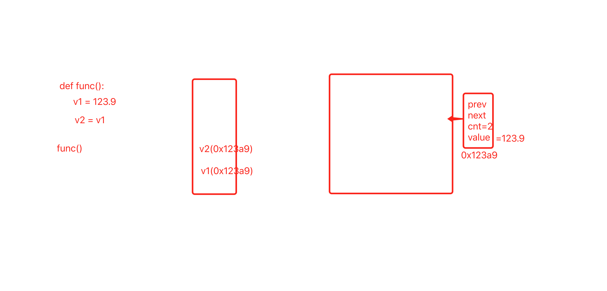
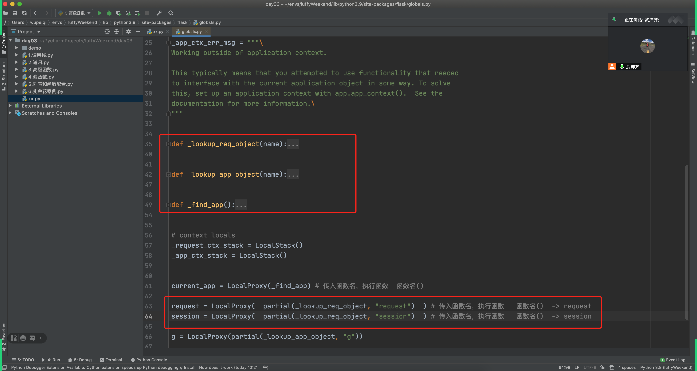
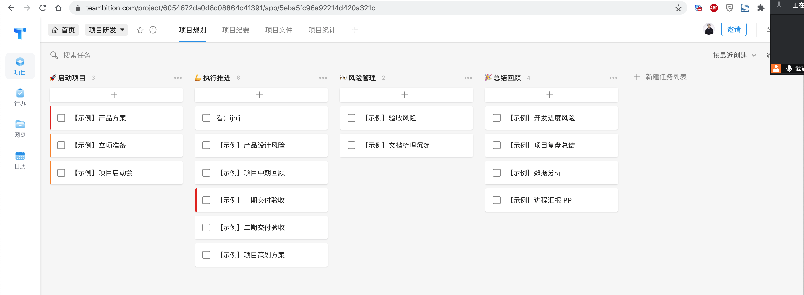
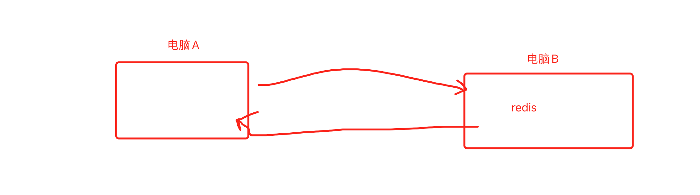
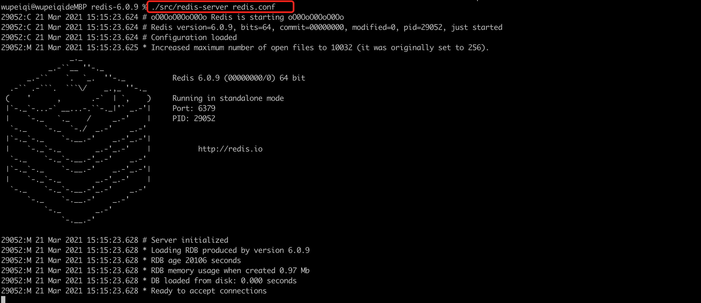
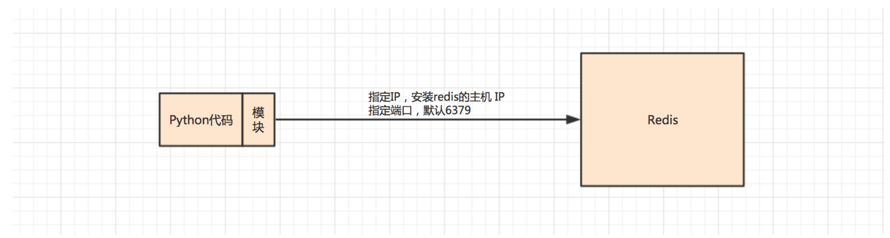
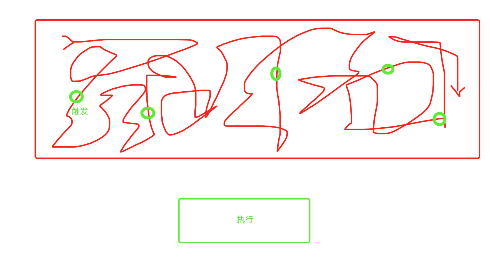

# day03 函数

今日概要：

- 值类型和应用类型
- 函数调用栈
- 递归（尽量不要出现递归）
- 小高级函数（map、filter、reduce）
- 偏函数
- 装饰器
  - 伪装饰器
  - 装饰器
  - 多个装饰器
  - 带参数的装饰器
- 任务管理工具
- 实战案例
  - redis，软件
    - 生成器案例
  - 发送短信
    - 腾讯云短信
    - 代码发送短信
    - 验证码过期（redis结合）
  - Flask框架
    - 了解课程设计思路（基础、网络编程、前端、数据库  --> 框架应用）
    - 装饰器应用场景
  - 信号
  - 发微信消息（无法实际操作 & 已认证的服务号）


## 1. 值类型和引用类型

在Java和C#等语言中可以把数据类型划分为：

- 值类型
- 引用类型

```java
public class PrimitiveTypeTest {  
    public static void main(String[] args) {  
        int v1 = 123;
        int v2 = 456;
        String[] myList = {"王宝强", "alex", "陈羽凡"};
    }  
}
```

在内存中会维护两个区域分别称为：堆栈、托管堆。

```
堆栈：（执行创建，执行完毕销毁）
	myList（内存地址）
 	v2 = 456;
	v1 = 123;
	
托管堆：（垃圾回收机制自动回收）
	{"王宝强", "alex", "陈羽凡"};
```

Python中没有 值类型 和 引用类型的概念。

## 2. 函数的调用栈

```python
def func():
    v1 = 123
    v2 = 456
    v3 = [11,22,33]
	v4 = v1 + v2
    
func()
```

- 当执行一个函数时，内部就会创建 堆栈（弹夹）。

  ```
  执行 v1 = 123 ，先开辟内存创建123，然后将数据存放 ref_chain ；然后会将内存地址  堆栈 。
  ...
  ```

- 当函数执行完毕之后，内部就会将 堆栈（弹夹）中的数据逐一剔除。

  ```
  先剔除v4，在 堆栈（弹夹）中剔除； 计算这个数据引用计数器，如果是0；没有用使用，当做垃圾清除（缓存机制）。
  ..
  ..
  ..
  ```

回忆：函数&闭包。


```python
def do():
    v5 = 999
    v8 = 666


def func():
    v1 = 123
    v2 = 456
    do()
    v3 = [11,22,33]
	v4 = v1 + v2
    
func()
```

```python
import traceback


def do():
    v5 = 999
    v8 = 666
    for item in traceback.format_stack():
        print(item)


def func():
    v1 = 123
    v2 = 456
    do()
    v3 = [11, 22, 33]
    v4 = v1 + v2


func()
```


注意：执行函数的嵌套如果特别多，同时在内存中保存的堆栈也会特别多（占用内存）


## 3. 递归


```python
def f3():
    print(3)
    
def f2():
    print(2)
    f3()
    print("f2 end")
    
def f1():
    print(1)
    f2()
    print("f1 end")
    
    
f1()
```

```
>>> 1
>>> 2
>>> 3
>>> f2 end
>>> f1 end
```


```python
#  自己调用自己，递归（1000次）。
def f1():
    print(1)
    f1()
    print("f1 end")
    
f1()
```

```
>>> 1
```

```
调用栈1：
	1
	
调用栈2：
	1
	
调用栈3：
	1
	
调用栈4：
	1
	
调用栈5：
	1
...
```


递归的返回值：

```python
def func(counter):
    print(counter)
    if(counter==3):
        return 666
    res = func(counter+1)
	return res
    
val = func(1)
print(val)
```

```
调用栈：
	counter=1
	>>> 1
	res = func(2) ——> 等下一个调用的return的结果
	[待执行]return res
调用栈：
	counter=2
	>>> 2
	res = func(3)  ——> 等下一个调用的return的结果  666
	return res
	
调用栈：
	counter=3
	>>> 3
	return 666
```

```
>>> 1
>>> 2
>>> 3
>>> 666
```


```python
def func(counter):
    print(counter)
    if(counter==3):
        return 666
    f1(counter+1)
    
val = func(1)
print(val)
```


Java

- 值类型，数据存储在栈的内存区域（不用就销毁，重复用就重复创建）
- 引用类型，数据存储在托管堆内存区域（用创建+引用，不用，而是由GC来进行回收）

Python

- 任何的数据，数据真正存储在 `托管堆=双向的环状链表&分代3个链表`，栈存储的是数据的内存地址（引用）
- 引用计数器为0，销毁。


源码，好的项目一般不用递归，那递归什么时候用，应用场景？

- 多级评论 or 左侧动态菜单
- 循环 or 数据类型特性 or 额外的字典/列表
- 案例，找到一个文件下的所有文件（文件中还嵌套文件）。
  - 递归
  - 删除COS文件


```python
v1 = [11,22,33]
v2 = v1
v1.append(44)
```

```python
v1 = [11,22,33]
v2 = v1

v1 = [1,2] # 重新赋值
```



- 堆栈、调用栈（底层使用的技术 - 存储值/获取值）
- 栈/队列，数据结构（用户访问频率 [] ）。


## 4. 三个小高级函数

- map
  

  ```python
  v1 = [1,2,3]
  
  def func(a1):
      return a1 + 100
  
  result = map(func,v1) 
  print(result)# [101,102,103 ]
  ```

  ```python
  v1 = [1,2,3]
  def func(a1):
      return a1 + 100
  result = map(func,v1)
  # for item in result:
  #     print(item)
  res = list(result)
  print(res)
  ```

  ```python
  v1 = [1,2,3]
  
  result = map(lambda a1:a1+100, v1) 
  print(list(result))
  ```

  ```python
  v1 = ["1","2","3"]
  
  result = list( map(lambda a1:a1+100, v1) )  # TypeError: must be str, not int
  print(result)
  ```

- filter 
  

  ```python
  v1 = ["alex",9, "eric",4,"xx"]
  
  def func(a1):
      if type(a1) == str:
          return True
      return False
  
  result = filter(func,v1) # ["alex","eric","xx"]
  ```

  ```python
  v1 = ["alex",9, "eric",4,"xx"]
  
  def func(a1):
      if type(a1) == str:
          return True
      return False
  
  result = filter(func,v1) # ["alex","eric","xx"]  #只留下字符串
  print(type(result)) #<class 'filter'>
  print(list(result))
  ```

- reduce
  

  ```python
  v1 = [1,2,3,4,5,6,7]
  
  def func(a1,a2):
      return a1 + a2
  result = reduce(func,v1)
  ```

  ```python
  from functools import reduce
  
  v1 = [1,2,3,4,5,6,7]
  
  def func(a1,a2):
      return a1 + a2
  result = reduce(func,v1)
  print(type(result))  # <class 'int'>
  print(result) #28
  ```


## 5 偏函数

用于再创建一个函数，并且手动进行传值。

```python
def func(a1,a2):
    return a1+a2

func(1,2)
```

```python
from functools import partial

# 创建1个函数
def func(a1, a2):
    return a1 + a2

# 又创建1个函数，在func函数基础上创建。
xxx = partial(func, a2=666)

func(1, 2)
xxx(1)
```


这个偏函数有什么用？

一般用于统一化函数的参数。




## 6. 装饰器

- 伪装饰器【Flask before_request & 信号 】

  ```python
  func_list = []
  
  def outer(func):
      func_list.append(func)
  
  @outer     # outer(b1)
  def b1():
      pass
  
  @outer    # outer(b2)
  def b2():
      pass
  
  @outer    # outer(b3)
  def b3():
      pass
  
  
  print( len(func_list) )
  ```
  
- 传统的装饰器

  ```python
  import functools
  
  def outer(func):
      @functools.wraps(func)
      def inner(*args,**kwargs):
          print("before")
          res = func(*args,**kwargs)
          print("after")
          return res
      return inner
  
  
  @outer
  def xx():
      pass
  ```
  
- 应用多个装饰器

  ```python
  import functools
  
  
  def yyy(func):
      print(3)
  
      @functools.wraps(func)
      def inner(*args, **kwargs):
          print("YYY")
          res = func(*args, **kwargs)
          return res
  
      return inner
  
  
  def uuu(func):
      print(2)
  
      @functools.wraps(func)
      def inner(*args, **kwargs):
          print("UUU")
          res = func(*args, **kwargs)
          return res
  
      return inner
  
  
  def xxx(func):
      print(1)
  
      @functools.wraps(func)
      def inner(*args, **kwargs):
          print("XXX")
          res = func(*args, **kwargs)
          return res
  
      return inner
  
  
  @yyy
  @uuu
  @xxx  # xxx(index)  # xxx.inner函数
  def index(a1, a2):
      return a1 + a2
  
  
  res = index("alex", "sb")
  print(res)
  ```

  注意：就近分析。


- 带参数的装饰器

  ```python
  def desc(count):
      def outer(func):
          def inner(*args,**kwargs):
              return func(*args,**kwargs)
          return inner
      return outer
  
  
  @desc(555)         # desc(555)   @outer=>outer(func)    func=inner
  def func(a1,a2):
      return a1 + a2
  
  
  func()
  ```

  案例：让被装饰的函数执行5次

  ```python
  def outer(func):
      def inner(*args,**kwargs):
          result_list = []
          for i in range(5):
  			res = func(*args,**kwargs)
              result_list.append(res)
  		return result_list
      return inner
  return outer
  
  @outer
  def index(a1,a2):
      return a1 + a2
  
  data = index(1,1)
  print(data)
  ```

  ```python
  def desc(count):
      def outer(func):
          def inner(*args, **kwargs):
              result_list = []
              for i in range(count):
                  res = func(*args, **kwargs)
                  result_list.append(res)
              return result_list
  
          return inner
  
      return outer
  
  
  @desc(2)
  def index(a1, a2):
      return a1 + a2
  
  
  data = index(1, 1)
  print(data)  
  ```

  


## 7. 任务管理工具（teambition)

老板会使用他给你安排任务，例如：新搞一个CRM的开发。




## 8.实战案例

### 8.1 redis

redis是一个软件，帮助我们去维护一段内存，让我们可以在内存中方便的存取数据。



- 安装redis

  - windows，https://pythonav.com/wiki/detail/10/82/    https://www.5xclass.cn/wiki/detail/10/82/#4.%20python%E8%BF%9E%E6%8E%A5redis

  - mac（可以下载最新的 - 任意版本）

    ```
    wget http://download.redis.io/releases/redis-6.0.6.tar.gz
    tar xzf redis-6.0.6.tar.gz
    ```

- 配置，修改配置文件

  - win：`redis.windows-service.conf`
  - Mac: `redis.conf`

- 启动redis

  - win：基于windows服务来做。

    见：https://pythonav.com/wiki/detail/10/82/

  - mac

    - 先编译

      ```
      >>> cd /Users/wupeiqi/service/redis-6.0.9
      >>> make
      ```

    - 启动

      ```
      >>> ./src/redis-server redis.conf
      ```

      

  

- Python代码操作redis

  
  - 安装python操作redis的相关模块

    ```
    pip install redis
    ```

  - 代码去操作redis

    ```python
    import redis
    
    
    # 直接连接redis
    conn = redis.Redis(host='127.0.0.1', port=6379, password='qwe123', encoding='utf-8')
    
    # k1=abc (存活10s)
    conn.set('k1', "abc", ex=10)
    
    # 获取数据
    value = conn.get('k1')
    print(value) # 字节类型
    ```

    

#### 应用场景：

- 短信验证码

- 购物 & 购物车

- 登录，2周免密码登录。

- 缓存（页面需要等待5s才能看到效果）

- 常用数据的获取和存储

- 生成器的应用

  ```python
  import redis
  
  # 直接连接redis
  conn = redis.Redis(host='127.0.0.1', port=6379, password='qwe123', encoding='utf-8')
  
  """
  for i in range(300):
      key = "k{}".format(i)
      conn.set(key, "alexsb", ex=60)
  """
  
  # 获取所有的数据并打印出来。
  #   - 1次性全取出来。
  #   - 逐一获取。
  #   - 连接一次取1000条（一点的一点的获取）
  
  """
  gen_object = conn.scan_iter(count=100)
  for item in gen_object:
      print(item)
  """
  ```

  ```python
  def scan_iter(self, match=None, count=None, _type=None):
      """
          Make an iterator using the SCAN command so that the client doesn't
          need to remember the cursor position.
  
          ``match`` allows for filtering the keys by pattern
  
          ``count`` provides a hint to Redis about the number of keys to
              return per batch.
  
          ``_type`` filters the returned values by a particular Redis type.
              Stock Redis instances allow for the following types:
              HASH, LIST, SET, STREAM, STRING, ZSET
              Additionally, Redis modules can expose other types as well.
          """
      cursor = '0'
      while cursor != 0:
          cursor, data = self.scan(cursor=cursor, match=match,
                                   count=count, _type=_type)
          for item in data:
              yield item
  ```


### 8.2 发送短信

- 发短信
- 发短信 + redis


#### 1. 发短信

- 申请腾讯云短信、

- 创建应用：appid、app key 

- 创建签名（企业营业执照、自己去申请个人公众号）

- 创建模板：548760

- 通过Python代码去发送短信

  ```python
  pip install qcloudsms_py
  ```

  ```python
  #!/usr/bin/env python
  # -*- coding:utf-8 -*-
  
  # import ssl
  # ssl._create_default_https_context = ssl._create_unverified_context
  
  from qcloudsms_py import SmsMultiSender, SmsSingleSender
  from qcloudsms_py.httpclient import HTTPError
  
  def send_sms_single(phone_num, template_id, template_param_list):
      """
      单条发送短信
      :param phone_num: 手机号
      :param template_id: 腾讯云短信模板ID
      :param template_param_list: 短信模板所需参数列表，例如:【验证码：{1}，描述：{2}】，则传递参数 [888,666]按顺序去格式化模板
      :return:
      """
      appid = 1400498873  # 自己应用ID
      appkey = "8c9c327fb51d447183e8015c66d54e15"  # 自己应用Key
      sms_sign = "Python之路"  # 自己腾讯云创建签名时填写的签名内容（使用公众号的话这个值一般是公众号全称或简称）
      sender = SmsSingleSender(appid, appkey)
      try:
          response = sender.send_with_param(86, phone_num, template_id, template_param_list, sign=sms_sign)
      except HTTPError as e:
          response = {'result': 1000, 'errmsg': "网络异常发送失败"}
      return response
  
  if __name__ == '__main__':
      result1 = send_sms_single("15131255089", 548760, [666, ])
      print(result1)
  ```

  

#### 2.短信&redis

```python
import random
import ssl
import redis

ssl._create_default_https_context = ssl._create_unverified_context
from qcloudsms_py import SmsMultiSender, SmsSingleSender
from qcloudsms_py.httpclient import HTTPError


def send_sms_single(phone_num, template_id, template_param_list):
    """
    单条发送短信
    :param phone_num: 手机号
    :param template_id: 腾讯云短信模板ID
    :param template_param_list: 短信模板所需参数列表，例如:【验证码：{1}，描述：{2}】，则传递参数 [888,666]按顺序去格式化模板
    :return:
    """
    appid = 1400498873  # 自己应用ID
    appkey = "8c9c327fb51d447183e8015c66d54e15"  # 自己应用Key
    sms_sign = "Python之路"  # 自己腾讯云创建签名时填写的签名内容（使用公众号的话这个值一般是公众号全称或简称）
    sender = SmsSingleSender(appid, appkey)
    try:
        response = sender.send_with_param(86, phone_num, template_id, template_param_list, sign=sms_sign)
    except HTTPError as e:
        response = {'result': 1000, 'errmsg': "网络异常发送失败"}
    return response


def run():
    print("欢迎使用xxx系统")
    mobile_phone = input("请输入手机号：")
    # 1.生成一个随机验证码
    random_int = random.randint(1000, 9999)
    # 2.发送短信
    send_sms_single(mobile_phone, 548760, [random_int, ])
    # 3.验证码保存到redis
    conn = redis.Redis(host='127.0.0.1', port=6379, password='qwe123', encoding='utf-8')
    conn.set(mobile_phone, random_int, ex=60)  # 15131255089=1889   60

    print("短信验证码已发送成功")
    code = input("请输入验证码：")

    # 校验验证码是否正确/是否已使用。。。
    # 4.去redis中根据手机号读取短信验证码
    sms_code = conn.get(mobile_phone)
    if not sms_code:
        print("验证码失效")
        return

    # 5.读取验证码，字节类型
    sms_code = sms_code.decode('utf-8')
    if code != sms_code:
        print("验证码输入错误")
        return

    conn.delete(mobile_phone)  # 在redis中将手机号对应的验证码删除（？）。
    print("登录成功")


if __name__ == '__main__':
    run()
```


### 8.3 Flask WEB框架

写网站；Flask写接口；

```
pip install flask
```

- 快速写网站

  ```python
  from flask import Flask
  
  app = Flask(__name__)
  
  
  @app.route("/index")
  def index():
      return "欢迎使用xxx系统"
  
  
  if __name__ == '__main__':
      app.run()
  
  ```

  ```python
  from flask import Flask
  
  app = Flask(__name__)
  
  
  #  对应关系：
  #       /index    ->     index函数
  #       /login    ->     login函数
  
  
  @app.route("/index")  # @decorator
  def index():
      # 处理所有的请求...
      return "欢迎使用xxx系统"
  
  
  @app.route("/login")  # @decorator
  def login():
      # 处理所有的请求...
      return "欢迎登陆"
  
  
  if __name__ == '__main__':
      app.run()
  
  ```

  

  

  

  

  Django或Flask 等 WEB框架，是一个综合应用。

  - Python基础：数据类型、函数、模块、面向对象。
  - 网络知识（不写，底层）
  - 数据库知识：MySQL
  - 前端技术：HTML、CSS、JavaScript
  - 框架（django & flask）
  - 知识点补充 & 扩展

  


在Flask中装饰器的应用场景：

- 路由关系

  ```python
  @app.route("/index")
  def index():
      return render_template("index.html")
  
  # 通过带参数的装饰器实现  url和函数的对应关系，以便于以后用户访问时根据URL不同后台的业务逻辑处理也不同。
  ```

- before和after

  ```python
  from flask import Flask, render_template
  
  app = Flask(__name__)
  
  """
  本质：在flask内部维护了一个字典
  before_request_funcs= {
      None:[b1,b2]
  }
  
  after_request_funcs = {
      None:[a1,a2]
  }
  在after_request_funcs执行时，会先拿到列表 [a1,a2]，将列表reverse，然后再执行。
  """
  
  
  @app.before_request
  def b1():
      print("b1")
  
  
  @app.before_request
  def b2():
      print("b2")
  
  
  @app.after_request
  def a1(res):
      print("A1")
      return res
  
  
  @app.after_request
  def a2(res):
      print("A2")
      return res
  
  
  @app.route("/index")
  def index():
      print("index函数")
      return render_template("index.html")
  
  
  @app.route("/login")
  def login():
      print("login函数")
      return "欢迎登录"
  
  
  if __name__ == '__main__':
      app.run()
  ```

  


### 8.4 信号




```
pip install blinker
```

```python
from blinker import signal

X1 = signal("XXOO")


# 在信号中注册一个功能
@X1.connect
def log(sender, *args, **kwargs):
    print(sender, args, kwargs)


@X1.connect
def show(sender, *args, **kwargs):
    print(sender, args, kwargs)


def f4():
    print(123)
    X1.send("F4", k1="123")
    print(666)


def f3():
    print(123)
    print(666)
    X1.send("F3", k1="666", k2="999")


def f2():
    print(123)
    f3()
    X1.send("F2", k1="666", k2="999")
    f4()
    print(666)


def f1():
    print(123)
    f2()
    print(666)


if __name__ == '__main__':
    f1()

```

想要做信号必须具备三点：

- 创建信号
- 信号绑定函数
- 在埋点的地方触发信号


业务应用场景：实现通知的功能。

```python
from blinker import signal

X1 = signal("XXOO")


# 在信号中注册一个功能
@X1.connect
def sms(sender, *args, **kwargs):
    print(sender, args, kwargs)


@X1.connect
def wechat(sender, *args, **kwargs):
    print(sender, args, kwargs)


@X1.connect
def dingding(sender, *args, **kwargs):
    print(sender, args, kwargs)


def f4():
    print(123)
    X1.send("F4", k1="123")
    print(666)


def f3():
    print(123)
    print(666)
    X1.send("F3", k1="666", k2="999")


def f2():
    print(123)
    f3()
    X1.send("F2", k1="666", k2="999")
    f4()
    print(666)


def f1():
    print(123)
    f2()
    print(666)


if __name__ == '__main__':
    f1()
```


### 8.5 发送微信

- 申请微信 订阅号 or 服务号（认证）
- 关注订阅号和  服务器号（模板消息）
- 公众号 or 服务号 然后才能给你推送消息。


配置：

- 设置IP白名单

发送消息：

- 获取app_id：

- 获取appsecret：

- 对方ID："oko631YbM3Mq-0tewUUVH1rOAAJY"

- 模板ID：2KANbVNo_5tKCF0jJsZ1_Z446XLr7iGfalNto3bPVIw

  ```
  {{first.DATA}}
  用户名：{{keyword1.DATA}}
  注册手机号：{{keyword2.DATA}}
  {{remark.DATA}}
  ```

代码去实现：

- 第一步获取token
- 在基于token去发送消息（携带模板）。


```python
import requests
import json

WECHAT_CONFIG = {
    'app_id': 'xxxxxx',
    'appsecret': 'xxxx',
}


def get_access_token():
    """
    获取微信全局接口的凭证(默认有效期俩个小时)
    如果不每天请求次数过多, 通过设置缓存即可
    """
    result = requests.get(
        url="https://api.weixin.qq.com/cgi-bin/token",
        params={
            "grant_type": "client_credential",
            "appid": WECHAT_CONFIG['app_id'],
            "secret": WECHAT_CONFIG['appsecret'],
        }
    ).json()
    return result.get('access_token')


def send_template_msg(token):
    """
    发送模版消息
    """
    res = requests.post(
        url="https://api.weixin.qq.com/cgi-bin/message/template/send",
        params={
            'access_token': access_token
        },
        json={
            # "touser": "oko631YbM3Mq-0tewUUVH1rOAAJY",  # 对方 IDoko631YbM3Mq-0tewUUVH1rOAAJY
            "touser": "oko631XUgXCcG_rfbx94mxeB7sjs",  # 对方 IDoko631YbM3Mq-0tewUUVH1rOAAJY
            "template_id": '2KANbVNo_5tKCF0jJsZ1_Z446XLr7iGfalNto3bPVIw',
            "data": {
                "first": {
                    "value": "python开发",
                    "color": "#173177"
                },
                "keyword1": {
                    "value": "沙雕alex",
                    "color": "#173177"
                },
                "keyword2": {
                    "value": "13838383838",
                    "color": "#173177"
                },
            }
        }
    )
    result = res.json()
    print(result)
    return result


if __name__ == '__main__':
    # 1.获取token（向微信发送请求，是否允许我给对方发消息）   ->  redis
    access_token = get_access_token()
    # 2.发送消息
    send_template_msg(access_token)

```


## 9. QA

1. 闭包

   ```python
   def desc(count):
   	def inner(*args,**kwargs):
           print(count)
       return inner
   
   f1 = desc(10)
   
   f2 = desc(5)
   ```

2. flask的route，底层原理实现。

3. 信号和函数的区别？

   ```
   不同：
   	函数的触发，  函数(再去调用其他的函数) 在代码中自己执行。
   	信号，触发信号 -> 再去执行与信号绑定的所有的函数。
   	反射
   ```

4. 第三模块 ->（并发编程）第四模块MySQL数据库（1天/2天/2天) 第五模块 前端（4月底）

5. 迭代器一定是生成器吗，生成器一定是迭代器吗？ 这个该怎么回答

   ```
   生成器肯定是迭代，他符合迭代器的规范；（yield =》生成器对象->迭代器规范 ）
   迭代器不一定是生成器。
   ```

6. 老师讲一下 绑定方法 和 类方法 应用场景？

   ```python
   tornado项目启动的时候，单例模式，通过静态方法来创建。
   ```

7. filter可以在说说嘛?

   ```python
   
   ```


问卷调查：

http://luffycityquestionnaire.mikecrm.com/VHiBfWX


