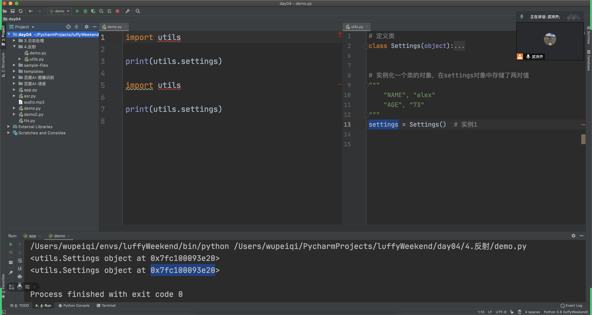

# day04 模块相关

今日概要：

- 老案例新用法（ Java ），直播课里嵌套的删除。
- 环境变量
- 开源模块（列表、元组底层原理）
- 优秀的模块哪里找？
- 五大案例
  - SDK，第三方服务（公司），例如：人脸识别、语音合成。
  - 日志，Logging。
  - 反射相关（工厂模式、配置文件）
  - 进程 & 线程 & 协程
  - 第三方组件，例如：软件、python代码、程序。
    - 缓存
    - 发布和订阅
    - 消息队列
    - Celery

- 面试题


## 1. 老案例新用法

- 应用场景，找到某个标签的所有后台标签。

  ```python
  def findAllDescendantNode(parent):
      container = []
      folderList = [parent,]
      
      for folder in folderList:
          for item in folder.children:
              if item是文件:
                  container.append(item)
              else:
                  container.append(item)
                  folderList.append(item)
  ```

  ```java
      /**
       * 找到所有后代节点
       *
       * @param parent 父节点
       * @return 节点列表
       */
      private List<AccessibilityNodeInfo> findAllDescendantNode(AccessibilityNodeInfo parent) {
          List<AccessibilityNodeInfo> container = new ArrayList<AccessibilityNodeInfo>();
  
          List<AccessibilityNodeInfo> folderList = new ArrayList<AccessibilityNodeInfo>();
          folderList.add(parent);
          
          int index = 0;
          do {
              AccessibilityNodeInfo node = folderList.get(index);
              for (int i = 0; i < node.getChildCount(); i++) {
                  AccessibilityNodeInfo child = node.getChild(i);
                  container.add(child);
                  if (child.getChildCount() != 0) {
                      folderList.add(child);
                  }
              }
              index += 1;
          } while (index != folderList.size());
          return container;
      }
  ```

  


注意：类似于day02的 ` 循环删除【s25】`


## 2. 环境变量

- 系统环境变量，自己在操作系统上写入（写到文件）。

- 程序级别的环境变量，当前程序中可以使用。（其他程序无法使用、当前程序终止时自动销毁）

  ```python
  import os
  
  os.environ.setdefault("N1","6666")
  
  
  data = os.environ.get("N1")
  print(data)
  ```


什么时候使用这个玩意？

- 研发，写程序。
- 测试，测试程序有没有BUG。
  - 最开始，连接自己电脑的数据源。
  - 然后，连接公司测试数据源。
  - 最后，连接公司的正式数据源。


```python
import os

def run():
    ...
    data = os.environ.get("ENV")
    if data == "local":
        pass
    elif data == "dev":
        pass
    ...


if __name__ == "__main__":
    os.environ.setdefault("ENV","local")
    run()
```


最后，什么时候用环境变量？ 在程序中想要根据某个值的不同进行做不同处理时。


赛续签

```
俺这边听开发说过，docker生成的时候设置一个环境变量，程序运行的时候读取这个变量，根据这个变量走不同的数据库连接的配置，就能区分出开发环境和生产环境了。加临时设置以后就能走自己个人的配置了？
```


```python
import os


def message():
    """ 发送消息 """

    msg = os.environ.get("MSG")
    if msg == "sms":
        print("发送短信")
    elif msg == "wechat":
        print("发送微信")


if __name__ == '__main__':
    # os.environ.setdefault("MSG", "wechat")

    # 第一步：os.environ，默认读取系统的环境变量
    # 第二步：在os.environ中在设置 "临时" 的环境变量

    # 对我们自己而言
    # 1.设置临时（程序员）
    #     os.environ.setdefault("MSG", "wechat")
    # 2.系统环境变量中设置
    #     去系统中修改
    message()

```

```python
import os


def message():
    """ 发送消息 """
    host = os.environ.get("HOST")
    # 连接数据host


if __name__ == '__main__':
    # 对我们自己而言
    # 1.设置临时（程序员）
    #     os.environ.setdefault("MSG", "192.168.1.1")
    #     os.environ["MSG"] = "192.168.1.1"
    # 2.系统环境变量中设置
    #     去系统中修改 "192.168.1.2"
    message()
```


### 谢均


- 面试，你在开发过程中遇到过哪些难题？

  - 程序在pycharm文件显示飘红，报错，执行的没问题。

- 问：如果开发程序D:/projecs目录，但F盘下面有一个 py 文件。

  ```
  把文件绝对路径导入进来。
  ```

  


- 为什么有时候pycharm中提示报错，但程序可以运行。

  ```
  ├── bin
  │   └── app.py
  └── utils
      └── page.py
  ```

  ```python
  # app.py
  from utils import page
  
  ret = page.func()
  print(ret)
  ```

  在python中运行没问题，但，如果进入bin目录，再执行app.py就不行了。

- 如果开发程序 D:/projecs 目录，但F盘下面有一个 x1.py 文件。

  - 把py文件所在路径加入到sys.path

    ```python
    import sys
    
    sys.path.append("F:/xxxxx文件夹")
    
    import x1
    ```

    

sys.path主要是帮助我们 导入模块时，告诉我们都去哪里找模块。


## 3. 开源一个模块

```python
pip install 模块名称

pip install requests
```

```python
import requests
requests.get("http://www.xxxx.com")
```


如果自己想要开源一个东西让别人用；

自己造点方便的"轮子"，便于以后老了自己用；

- 初级程序员，搬砖。
- 有经验程序员，很多组件，组件拿来之后拼接就可以了。
  - ORM框架
  - WEB框架（登录、权限....）
  - 组合就出来了。

传达给你们：

- 现在你们，写重复代码。（工作一年）
- 不要重复写（提升工作效率，组件）
- 架构 / AI  / 管理 / 创业


简单的流程：

- 创建项目，编写相关代码。

- 代码打包并上传到pypi（注册pypi）

- 广而告之，我开源了一个xxxx，快来使用吧

  ```python
  pip install 你的包
  ```

  

### 3.1 项目文件夹

根据要求创建如下文件，并填写内容

```
xiejun
├── LICENSE           # 声明，给模块使用者看，说白了就是使用者是否可以免费用于商业用途等。
├── README.md         # 模块介绍
├── demos             # 使用案例
├── xiejun            # 模块代码目录
│   └── __init__.py
		...
└── setup.py          # 给setuptools提供信息的脚本(名称、版本等)
```


#### 1. License

LICENSE文件就是咱们模块的许可证，给模块使用者看，说白了就是使用者是否可以免费用于商业用途等。一般开源的软件会选择相对宽泛许可证 MIT，即：作者保留版权，无其他任何限制。

```
Copyright (c) 2018 The Python Packaging Authority

Permission is hereby granted, free of charge, to any person obtaining a copy
of this software and associated documentation files (the "Software"), to deal
in the Software without restriction, including without limitation the rights
to use, copy, modify, merge, publish, distribute, sublicense, and/or sell
copies of the Software, and to permit persons to whom the Software is
furnished to do so, subject to the following conditions:

The above copyright notice and this permission notice shall be included in all
copies or substantial portions of the Software.

THE SOFTWARE IS PROVIDED "AS IS", WITHOUT WARRANTY OF ANY KIND, EXPRESS OR
IMPLIED, INCLUDING BUT NOT LIMITED TO THE WARRANTIES OF MERCHANTABILITY,
FITNESS FOR A PARTICULAR PURPOSE AND NONINFRINGEMENT. IN NO EVENT SHALL THE
AUTHORS OR COPYRIGHT HOLDERS BE LIABLE FOR ANY CLAIM, DAMAGES OR OTHER
LIABILITY, WHETHER IN AN ACTION OF CONTRACT, TORT OR OTHERWISE, ARISING FROM,
OUT OF OR IN CONNECTION WITH THE SOFTWARE OR THE USE OR OTHER DEALINGS IN THE
SOFTWARE.
```

更多其他许可证参见：<https://choosealicense.com/>

#### 2. readme

readme就是对于当前模块的描述信息，一般用于markdown格式编写，如：

```
fucker是一个吊炸天的工具...
```

此文件也可以写模块的简单使用手册，如果手册太复杂建议再创建一个doc文件夹存放使用手册。

#### 3. demos目录

demos一般会写一些该模块使用的示例，用于使用者快速可以将模块应用到生成中。

#### 4. setup.py

setup.py文件其实是一个配置文件，用于给setuptools提供一些模块相关的信息，如：模块名称、模块版本、适用的python版本、作者、github地址等。

```python
import setuptools

with open("README.md", "r") as fh:
    long_description = fh.read()

setuptools.setup(
    name="fucker",  # 模块名称
    version="1.0",  # 当前版本
    author="wupeiqi",  # 作者
    author_email="wupeiqi@live.com",  # 作者邮箱
    description="一个非常NB的包",  # 模块简介
    long_description=long_description,  # 模块详细介绍
    long_description_content_type="text/markdown",  # 模块详细介绍格式
    # url="https://github.com/wupeiqi/fucker",  # 模块github地址
    packages=setuptools.find_packages(),  # 自动找到项目中导入的模块
    # 模块相关的元数据
    classifiers=[
        "Programming Language :: Python :: 3",
        "License :: OSI Approved :: MIT License",
        "Operating System :: OS Independent",
    ],
    # 依赖模块
    install_requires=[
        'pillow',
    ],
    python_requires='>=3',
)
```

注意：setuptools是一个包管理工具，可用于打包和安装模块。

#### 5. fucker目录

插件内容，可以将相关代码在此处编写，如：wp.py

```python
#!/usr/bin/env python
# -*- coding:utf-8 -*-


def func():
    print("一个神奇的包")

```

最后的文件夹如下：

```
fucker
├── LICENSE
├── README.md
├── demos
├── fucker
│   ├── __init__.py
│   └── wp.py
└── setup.py
```

### 

### 3.2 代码打包&上传

上述步骤中将文件夹和代码编写好之后，就需要对代码进行打包处理。

#### 1. 安装打包工具（已有无需重复安装）

打包代码需先安装setuptools和wheel两个工具，可以单独安装，也可以安装pip，从而自动安装这两个工具。

- Securely Download [get-pip.py](https://bootstrap.pypa.io/get-pip.py) [[1\]](https://packaging.python.org/tutorials/installing-packages/#id7)
- Run `python get-pip.py`. [[2\]](https://packaging.python.org/tutorials/installing-packages/#id8) This will install or upgrade pip. Additionally, it will install [setuptools](https://packaging.python.org/key_projects/#setuptools) and [wheel](https://packaging.python.org/key_projects/#wheel) if they’re not installed already.
  详见：<https://packaging.python.org/tutorials/installing-packages/>

注意：已安装用户，如要更新setuptools和wheel两个工具，可通过如下命令：

```
python3.9 -m pip install --upgrade setuptools wheel
```

#### 2. 打包代码

```
python3.9 setup.py sdist bdist_wheel
```

```
fucker
├── LICENSE
├── README.md
├── fucker
│   ├── __init__.py
│   └── wp.py
├── fucker.egg-info
│   ├── PKG-INFO
│   ├── SOURCES.txt
│   ├── dependency_links.txt
│   └── top_level.txt
├── build
│   ├── bdist.macosx-10.6-intel
│   └── lib
│       └── fucker
│           ├── __init__.py
│           └── wp.py
├── demos
├── dist
│   ├── fucker-0.0.1-py3-none-any.whl
│   └── fucker-0.0.1.tar.gz
└── setup.py
```

#### 3. 发布模块（上传）

文件打包完毕后，需要将打包之后的文件上传到PyPI，如果想要上传是需要先去 <https://pypi.org/> 注册一个账号。


- 安装用于发布模块的工具：twine 【已安装无需重复安装】

  ```
  python -m pip install --upgrade twine
  或
  pip install --upgrade twine
  
  # 提示：python -m 的作用是 run library module as a script (terminates option list)
  ```

- 发布（上传）

  ```
  python -m twine upload --repository-url https://upload.pypi.org/legacy/  dist/*
  或
  twine upload --repository-url https://upload.pypi.org/legacy/  dist/*
  ```

  提示需要输入PyPI的用户名和密码，如：

  


https://www.bilibili.com/video/BV17541187de


## 4. 好的模块去哪里找？

- 先去找现成，学习和应用态度。功能先实现，优化。

  - 不要用百度，而是用 google 或 bing.com

    - 3块钱1个月（倒闭）

      

- github，找案例。

- stack overflow，查问题。

- 研究源码

  - 项目阶段，flask、drf框架源码。
  - 直播课，C语言分析 + 视频（底层实现机制 & 面试）


之前：

- 网络编程，socketserver（简单看看源码）
- web框架，从源码引入。
- django框架，中间件、分页
- crm项目，stack（django admin）、rbac
- drf
- flask


现在：

- django之前，不再涉及源码剖析。
- 分页 VS django内置分页   -> 初步感受
- crm项目：stack组件（面向对象关系嵌套）
- drf源码
- flask


## 5.模块相关面试题

1. 列举常用的内置模块。

2. 如何安装第三方模块？

3. re的match和search区别？

4. 什么是正则的贪婪匹配？或 正则匹配中的贪婪模式与非贪婪模式的区别？

5. 用Python匹配HTML tag的时候,<.*>和<.*?>有什么区别?

6. 如何生成一个随机数？

7. 如何使用python删除一个文件？

8. logging模块的作用？以及应用场景？

9. json序列化时，可以处理的数据类型有哪些？如何定制支持 datetime 类型？

10. json序列化时，默认遇到中文会转换成unicode，如果想要保留中文怎么办？

11. 写代码实现查看一个目录下的所有文件。

12. 如何判断一个邮箱合法

13. 请写出以字母或下划线开始, 以数字结束的正则表达式

14. 下面那些是Python开发网络应用的框架

    ```
    1.  Django
    2.  Yii
    3.  Struts
    4.  Rails
    5.  Uliweb
    6.  CodeIgniter
    7.  gevent
    8.  Flask
    9.  web2py
    10.  Pylons
    11.  Tornado
    12.  Twisted
    13.  TurboGears
    ```

15. 写Python爬虫都用到了那些模块, 分别是做什么用的?

16. sys.path.append("/root/mods")的作用？

17. 列举出Python中比较熟知的爬虫框架

18. 输入某年某日, 判断这是这一年的第几天? (可以用Python的内置模块)

    ```python
    import datetime
    
    date = datetime.date(2021, 1, 21)
    ret = date.strftime('%j')  # %j十进制表示的每年的第几天
    print(ret)
    ```

    ```python
    """
    闰年和平年
    	能被400整除的为世纪闰年。（如2000年是世纪闰年，1900年不是世纪闰年）。
    	能被4整除但不能被100整除的年份为普通闰年。（如2004年就是闰年，1999年不是闰年）。
    
    闰年的2月份有29天，全年共有366天。平年2月份有28天，全年365天。
    """
    ```

19. 使用过Python那些第三方组件？


## 6. 五大案例


### 6.1 SDK

别人给我们写好的代码，让我拿来之后直接使用（别人给咱们写好的模块）。

微信（大厂）

- API，URL

  ```python
  """
  URL:   https://www.wx.com/pay/        
  发送POST，并且携带我要求的数据。
  """
  
  import requests
  
  requests.post(
  	url= "https://www.wx.com/pay/",
      json={
          "x":1,
  		"y":12,
          ...
      }
  )
  ```

- SDK，python代码

  - 官方网站提示：`pip install xxxx`

  - 使用

    ```python
    import xxx
    
    xxx.send("xxxx")
    ```

例如：支付、微信消息、新浪微博大部分都是Python-SDK，如果没有SDK自己写API。

提醒：很多大厂写的SDK也是有问题；裂变项目，微信授权（py2、没有Python3）（腾讯的SDK、阿里 不符合Python规范，Java程序员）


以后我们会进程配合第三方的服务开发：

- 路飞学城，视频播放。【保利威视、阿里、腾讯、七牛】
  
- 客服，买别人的服务，镶嵌到自己系统中。
- 直播服务，金山做直播服务（剑皇...）50%功能都会继承其他的平台（百度、科大讯飞）。
- 智慧社区、智能机器人。
  - 皮包公司，自己做业务，底层全都用 百度AI。
  - 拼凑公司，github上找代码+跑起来，打包卖掉。
  - 研发，培养算法工程师。


#### 案例1：人脸识别（API）

基于百度AI的接口来实现。

- 注册百度AI账号
- 花钱开通服务
- 根据他们文档来进行编写
  - 录入图像库，先把你公司200人录入到系统。
  - 识别，人脸（百分比80分以上）


之前开发：

- 微信小程序，手机上安装软件（APP)。
- Python编写的平台，用于接收微信小程序发来图片。
- 把图片或语音发送给百度AI，返回。


```python
import requests
import base64


def register_image(user_id, user_info, file_object, group_id="test"):
    # 1. 去百度AI获取 access token
    # client_id 为官网获取的AK，        client_secret 为官网获取的SK
    #  INgt7t4eNaXZ4AoeN2cQICzi    QgApMABK25gVxs8p1ck9Sh9MrSL8Y12R
    host = 'https://aip.baidubce.com/oauth/2.0/token?grant_type=client_credentials&client_id=INgt7t4eNaXZ4AoeN2cQICzi&client_secret=QgApMABK25gVxs8p1ck9Sh9MrSL8Y12R'
    response = requests.get(host)
    access_token = response.json().get("access_token")

    # 2. 图片进行base64编码
    data = base64.b64encode(file_object.read())

    # 3. 上传图片
    res = requests.post(
        url="https://aip.baidubce.com/rest/2.0/face/v3/faceset/user/add",
        headers={
            "Content-Type": "application/json"
        },
        params={
            "access_token": access_token
        },
        data={
            "image": data,
            "image_type": "BASE64",
            "group_id": group_id,
            "user_id": user_id,
            "user_info": user_info,
        }
    )
    result = res.json()
    print(result)
    # return result["result"]['face_token']


def search(file_object):
    # 1. 获取 access token
    # client_id 为官网获取的AK， client_secret 为官网获取的SK
    host = 'https://aip.baidubce.com/oauth/2.0/token?grant_type=client_credentials&client_id=INgt7t4eNaXZ4AoeN2cQICzi&client_secret=QgApMABK25gVxs8p1ck9Sh9MrSL8Y12R'
    response = requests.get(host)
    access_token = response.json().get("access_token")

    # 2. 图片进行base64编码
    data = base64.b64encode(file_object.read())

    # 3. 检验图片
    res = requests.post(
        url="https://aip.baidubce.com/rest/2.0/face/v3/search",
        headers={
            "Content-Type": "application/json"
        },
        params={
            "access_token": access_token
        },
        data={
            "image": data,
            "image_type": "BASE64",
            "group_id_list": "test",
            "match_threshold": 80,
            "liveness_control": "NONE",
        }
    )
    # {'error_code': 223120, 'error_msg': 'liveness check fail', 'log_id': 8484101891584, 'timestamp': 1618122995, 'cached': 0, 'result': None}
    # {'error_code': 0, 'error_msg': 'SUCCESS', 'log_id': 9425255594947, 'timestamp': 1618123184, 'cached': 0, 'result': {'face_token': 'dce2981ea3ae849a4402dd422de25d98', 'user_list': [{'group_id': 'test', 'user_id': 'alex', 'user_info': '', 'score': 100}]}}
    # {"error_code":0,"error_msg":"SUCCESS","log_id":8975998965357,"timestamp":1593273355,"cached":0,"result":{"face_token":"daf9ead990ef00738ab842801e7d212c","user_list":[{"group_id":"test","user_id":"wupeiqi","user_info":"","score":97.43611907959}]}}
    ret = res.json()
    print(ret)
    return ret


if __name__ == '__main__':
    file_object = open('alex.png', mode='rb')
    # register_image("alex", "", file_object)
    search(file_object)

```


#### 案例2：语音相关（SDK）

- 语音识别，语音转换文字。

- 语音合成，文字转换语音。

  ```python
  pip install baidu-aip
  ```

  ```python
  from aip import AipSpeech
  
  APP_ID = '21212118'
  API_KEY = '5RYoUwOCHcexcWfa2iRC0ftq'
  SECRET_KEY = 'GQQkpl5sOZPdA90kmLPIO4oRenwmhBFG'
  
  
  # 1. 创建AipSpeech对象
  client = AipSpeech(APP_ID, API_KEY, SECRET_KEY)
  
  # 2. 调动synthesis函数
  result = client.synthesis('你好百度', 'zh', 1, {'vol': 5})
  
  
  # 识别正确返回语音二进制 错误则返回dict 参照下面错误码
  if not isinstance(result, dict):
      with open('audio.mp3', 'wb') as f:
          f.write(result)
  else:
      print(result)
  ```

  


### 6.2 日志相关

之前：subprocess、logging（重要）

v2.0版本：

- django logging，理由：单独logging&现在编写的代码，没到日志级别。初级：logging记录文件；高级：sentry。
- subprocess，自动化测试&自动化运维。


```python
from aip import AipSpeech

def func():
    APP_ID = '21212118'
    API_KEY = '5RYoUwOCHcexcWfa2iRC0ftq'
    SECRET_KEY = 'GQQkpl5sOZPdA90kmLPIO4oRenwmhBFG'

    # 1. 创建AipSpeech对象
    client = AipSpeech(APP_ID, API_KEY, SECRET_KEY)

    # 2. 调动synthesis函数
    result = client.synthesis('你好百度', 'zh', 1, {'vol': 5})

    # 识别正确返回语音二进制 错误则返回dict 参照下面错误码
    if not isinstance(result, dict):
        with open('audio.mp3', 'wb') as f:
            f.write(result)
    else:
        print(result)

if __name__ == '__main__':
	func()
```


- 用户访问，蹦了。
- 用户访问，图像处理失败，请稍后重试。


所以，在开发过程中如果可能因为不可预知的错误导致项目运行失败。

```python
try:
    pass
except Excpetion as e:
	通过日志记录把错误记录下来，写到文件中。
```


关于日志：

- `traceback`
- 异常
- logging（线程安全）


#### 案例：低配版（简单的程序）

```
CRITICAL = 50
FATAL = CRITICAL
ERROR = 40
WARNING = 30
WARN = WARNING
INFO = 20
DEBUG = 10
NOTSET = 0
```


```python
import logging

# 1. 对日志进行配置
logging.basicConfig(
    filename='v1.log', # 日志文件
    format='%(asctime)s :  %(message)s',  # 写日志时，文件的格式。
    datefmt='%Y-%m-%d %H:%M:%S %p',
    level=20 # 级别，以后只有大于20的级别时，才能真正日志内容写入到文件中。
)

# 2.写日志
logging.debug("你好呀")  # 10,你好呀
logging.error("你傻呀")  # 40,你傻呀
```

```python
import logging
import traceback

# 1. 对日志进行配置
logging.basicConfig(
    filename='v1.log',  # 日志文件
    format='%(asctime)s :  %(message)s',  # 写日志时，文件的格式。
    datefmt='%Y-%m-%d %H:%M:%S %p',
    level=20  # 级别，以后只有大于20的级别时，才能真正日志内容写入到文件中。
)


def run():
    try:
        int("sfd")
    except Exception as e:
        logging.error(traceback.format_exc())  # 40,你傻呀


if __name__ == '__main__':
    run()
```


#### 案例：升级版（面向对象/函数）

- Formatter，格式化。

- FileHandler，维护文件，专门用于往文件中写内容。

- Logger，定义级别，大于这个级别才调用 FileHandler 去写内容。

- 写日志

  ```python
  logger = Logger()
  logger.error("内容")
  ```


```python
import logging

# 定义 Formatter
fmt = logging.Formatter(fmt="%(asctime)s - %(name)s - %(levelname)s -%(module)s:  %(message)s")

# 定义 FileHandler
handler_object = logging.FileHandler('v2.log', 'a', encoding='utf-8')
handler_object.setFormatter(fmt)

# 定义 Logger
logger_object = logging.Logger('s1', level=logging.INFO)  # 20
logger_object.addHandler(handler_object)

# 写日志
logger_object.error("alex是个大sb")
```


```python
import logging

# 定义 Formatter
fmt = logging.Formatter(fmt="%(asctime)s - %(name)s - %(levelname)s -%(module)s:  %(message)s")

# 定义 FileHandler
handler_object = logging.FileHandler('v2.log', 'a', encoding='utf-8')
handler_object.setFormatter(fmt)

handler_object2 = logging.FileHandler('v22.log', 'a', encoding='utf-8')
handler_object2.setFormatter(fmt)

# 定义 Logger
logger_object = logging.Logger('s1', level=logging.INFO)  # 20
logger_object.addHandler(handler_object)
logger_object.addHandler(handler_object2)

# 写日志
logger_object.error("alex是个大sb")
```


注意事项：使用低配版时，如果你配置了2次，会出现什么效果？

```python
import logging
import traceback

# 1. 对日志进行配置
logging.basicConfig(
    filename='v10.log',  # 日志文件
    format='%(asctime)s :  %(message)s',  # 写日志时，文件的格式。
    datefmt='%Y-%m-%d %H:%M:%S %p',
    level=20  # 级别，以后只有大于20的级别时，才能真正日志内容写入到文件中。
)

# 2. 对日志进行配置
logging.basicConfig(
    filename='v100.log',  # 日志文件
    format='%(asctime)s :  %(message)s',  # 写日志时，文件的格式。
    datefmt='%Y-%m-%d %H:%M:%S %p',
    level=20  # 级别，以后只有大于20的级别时，才能真正日志内容写入到文件中。
)


logging.error("沙雕alex")
```


#### 案例：高配版（框架内部）

- 配置（很长、很多）
  - Formatter，格式化。（3个formatter）
  - FileHandler，写文件。
  - Logger，过滤。
- 使用


```python
import os
import logging.config

# 1. 定义字典
LOGGING_CONFIG = {
    "version": 1,
    "disable_existing_loggers": True,  # 删除已存在其他日志的Handler
    'formatters': {
        'standard': {
            'format': '{levelname} {asctime} {module} {process:d} {thread:d} {message}',
            'style': '{',
        },
        'simple': {
            'format': '%(levelname)s %(message)s',
            'style': '%',
        },
        'test': {
            'format': '$levelname $message',
            'style': '$',
        },
    },
    'handlers': {
        'console': {
            'class': 'logging.StreamHandler',
            'formatter': 'simple',
        },
        'sms_file': {
            "class": 'logging.handlers.RotatingFileHandler',
            'formatter': 'standard',
            'filename': os.path.join('logs', 'sms.log'),
            'maxBytes': 10240,  # 根据文件大小拆分日志
            'backupCount': 30,  # 备份个数
            "encoding": "utf-8"
        },
        'error_file': {
            "class": 'logging.handlers.TimedRotatingFileHandler',
            'formatter': 'standard',
            'filename': os.path.join('logs', "error.log"),
            'when': 'D',  # 根据天拆分日志
            'interval': 1,  # 1天
            'backupCount': 3,  # 保留备份
            "encoding": "utf-8"
        }
    },
    'loggers': {
        'sms': {
            'handlers': ['sms_file', ],  # 意味着通过sms的loggers，写日志时，级别》info 且 会写入到sms_file文件中。
            'level': "INFO",
            'propagate': False  # 通过sms写日志时，同时也会找到他的父亲。
        },
        'error': {
            'handlers': ['error_file'],
            'level': 'ERROR',
            'propagate': True
        }
    },
    'root': {
        'handlers': ['console', ],
        'level': 'ERROR',
        'propagate': True
    },
}

# 2. 根据自定对logging进行配置
logging.config.dictConfig(LOGGING_CONFIG)

# 3. 写日志
"""
logger_object = logging.getLogger()
logger_object.error("日志好复杂")
"""
"""
logger_object = logging.getLogger("error")
logger_object.info('6666666666')
"""
```


扩展：Django框架，也可以写日志。


Django示例，见源码：【dj_logger.zip】


### 6.3 反射相关

- setattr
- getattr
- hasattr
- delattr


- 通过字符形式去导入模块（import_module）


关于反射两个经典案例：

- 发邮箱、发短信等。

- 配置文件相关。

  - 配置文件，框架内部都有默认配置；用户配置。

    ```python
    USER = "alex"
    
    
    # 用户配置中
    USER = "123"
    ```

  - 配置文件，一般都是大写的。

  - 单例模式（精简） + 导入模块机制

    ```python
    # 定义类
    class Settings(object):
        def __init__(self):
            setattr(self, "NAME", "alex")  # self.NAME = "alex"
            setattr(self, "AGE", "73")
    
    
    # 实例化一个类的对象，在settings对象中存储了两对值
    """
        "NAME", "alex"
        "AGE", "73"
    """
    settings = Settings()  # 实例1
    
    ```

    


在很多源码内部：

- 默认配置
- 用户配置

在框架加载时，先去读取默认的所有配置 + 再去读取用户配置。

```python
# conf
class Settings(object):
    def __init__(self):
        # 读取默认配置
        setattr(self,"NAME","alex")
        
        # 读取用户配置
        setattr(self,"NAME","miaomiao")
        
        
settings = Settings()
```

```python
from conf import settings

settings.NAME
```


总结：

- 反射的应用场景
- 单例模式的应用场景
- 用户配置覆盖全局配置


### 6.4 代码级别（提升性能）

```python
import requests

url_list = [ "http://www.xx.com/1.png","http://www.xx.com/2.png","http://www.xx.com/3.png","http://www.xx.com/4.png"]

for url in url_list:
	res = requests.get(url)
    # 把内容  res.content 写入到文件中。
    
    
# 串行，需8分钟。
```

多进程 & 多线程 & 协程

- 多进程，为每个任务创建一个进程去执行。 创建了4两火车（成本），同时4个任务都在执行。 需要：2分钟。【计算型】
- 多线程，为每个任务创建一个线程去执行。创建4个汽车（成本低），同时4个任务都在执行。  需要：2分钟。【IO操作】
- 协程，活活累死一个人。利用IO等待的时，再去干点其他的事（别闲着）2.5分钟。


以后你毕业了，写脚本：

- 小 脚本，读取数据数据，把推送给xxxx。    自己通过 进程、 线程、协程来实现。（好好学）

- 小 爬虫 & 网站 & Web开发（框架），自己很少写 进程、 线程、协程，以为框架的内部已帮助我们实现了 进程、 线程 。 在配置文件中编写

  ```
  process = 10
  thread = 8
  ```

  


基于多线程、多进程可以完成 比较小的应用程序的开发（自己写+配置）。


### 6.5 第三方组件（第三方组件+模块）

#### 案例1：缓存（redis）

用户量比较大，且访问页面时都是相同的内容（缓存），而不是用户多了，我多开几个进程、多开几个线程。

写：6w/s；读：12w/s


#### 案例2：发朋友圈 or 发微博 or 群消息

一个人发，好多人都可以接收到。

- 现在，维护一个用户列表 `[ 用户A,用户B,用户C.... ]`，for循环用户列表，直接把数据发给他们。
- 发布和订阅的功能（rabbitMQ/zeroMQ/kafka/redis）


#### 案例3：消息队列（生产者&消费者）

以爬虫为例，在爬虫中（scrapy框架内部，中间件 redis 分布式爬虫）


#### 案例4：异步任务celery

处理任务（Flask+celery），让你去做一个12306的火车票平台。

- 人多
- 买票任务耗时，现在还有多少票 & 减去1张 & 好多站 & 后续的站如何去卖。


之前在用12306买票时，一都节假日就崩盘。


基于celery和消息队列来实现：


## 总结

- 找到某个节点（文件夹）下的所有孩子...
- 环境变量，IT和非IT（测试）。
- 开源一个模块
- Github、stack overflow 、google
- 面试题
  - search和match
  - 贪婪匹配
  - 文件夹下的所有文件
- 案例
  - SDK
    - API
    - SDK
  - 日志（项目高配版）
  - 反射
    - 录播视频中的工厂模式
    - 配置文件的底层实现（单例、环境变量）
  - 进程线程协程，代码级别
  - 架构 & 第三方组件


注意：windows在开发&学习，学习Linux操作系统（项目部署）【安装linux，linux系统中开发】。


# 历史

- 憋
- 前期不必做太难掌握  > Django + 独立小项目  + 学另外一个项目（再自己写一个项目）


django2和3 区别大吗

- 实现功能变化不大。
- django3加入更加贴合asyncio（asgi）--> 不太完善。 + websocket


提醒：

- https://www.bilibili.com/video/BV1wh411D7Nx/
- https://www.bilibili.com/video/BV1sV411n7nr/


