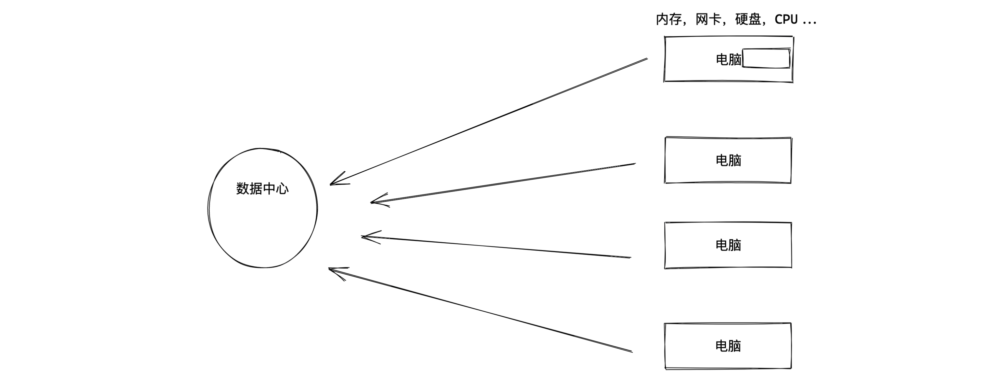
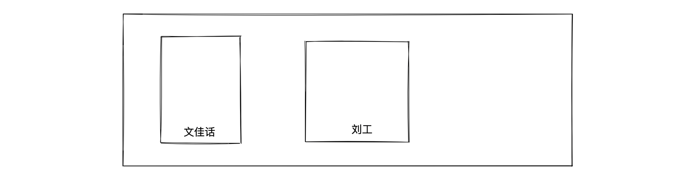
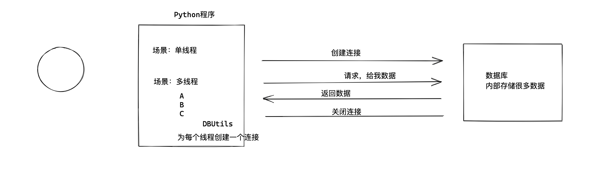
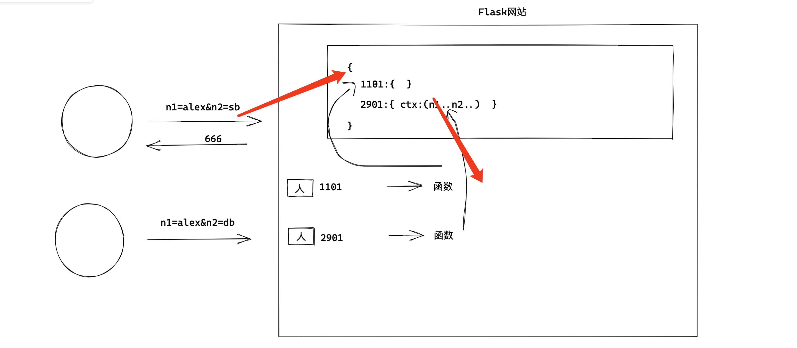
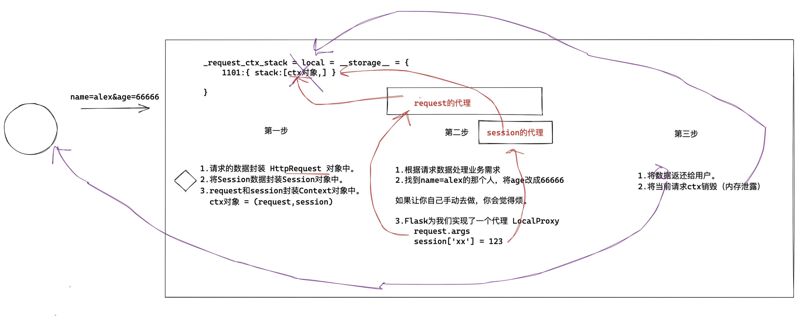
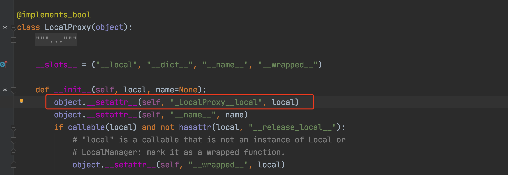
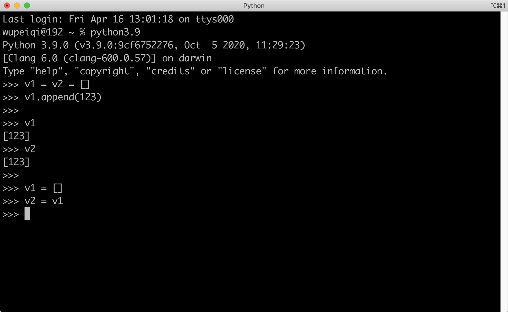
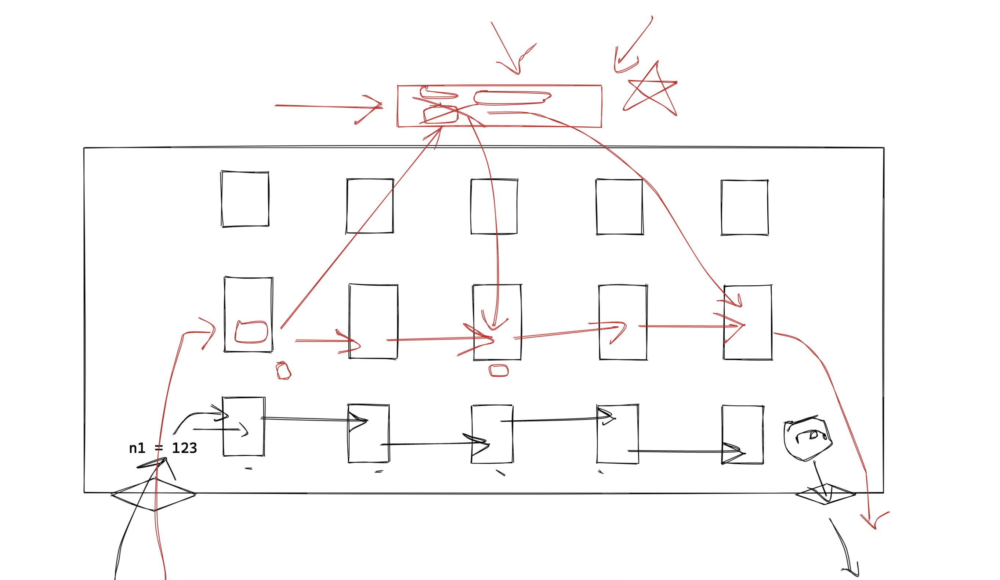
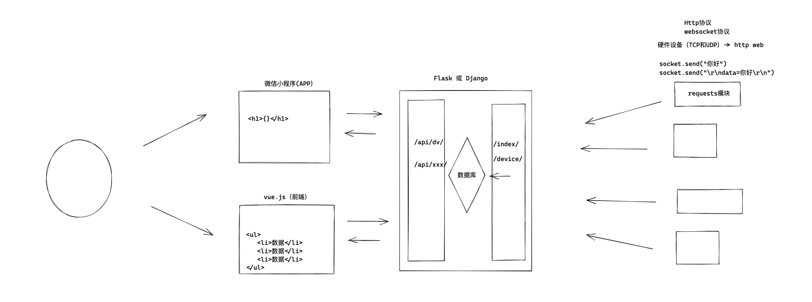

# day05 面向对象

**加强班**，实战 & 源码。

今日概要：知识点 & 源码

- 接口 & 抽象 & 异常
- 数据封装，打包。
- 数据 `线程隔离`
- 栈 & `线程隔离`
- 偏函数 和 代理（面向对象）
- Web框架Flask（上下文管理机制）
- 元类（wtform & django admin）
  - 简单用面向对象去实现一些业务。【录播课目标】
  - 用框架去实现。【别致的用户】
  - 探究源码。【元类】


## 1. 接口 & 抽象 & 异常

### 1.1 接口（Python不支持）

接口，给我一个URL，让我通过URL可以访问你的平台（第三方的API）。

接口，面向对象中的数据类型（Python中没有 ，Java & C# ）。


其他语言中接口的作用。

```python
# 定义了一个接口，接口名字 IMessage；接口中定义了 f1 和 f2方法。
# 注意：接口中定义的方法不能用具体的代码实现。
interface IMessage(object):
    def f1(self):
        pass
    
    def f2(self):
        pass
```

意义何在？

- 约束，如果某个类继承(实现)了接口，那么再找个类中必须去定义接口中的f1和f2方法。

  ```python
  class Msg(IMessage):
      def f1(self):
          # 具体代码实现
          
      def f2(self):
          # 具体代码实现
  ```
  
- 泛型，泛指多个类型（“继承”了他的类型）。实现

  ```python
  def func(类型 参数):
      pass
  ```

  ```python
  def func(str name,int age):
      pass
  
  func("武沛齐",19)
  func(18,19) # 报错
  ```

  ```python
  interface IMessage(object):
      def f1(self):
          pass
      
      def f2(self):
          pass
      
  class Wechat(IMessage):
      def f1(self):
          print('666')
          
      def f2(self):
          print('999')
          
  class Email(IMessage):
      def f1(self):
          print('111')
          
      def f2(self):
          print('222')
          
          
  def func(IMessage a1):
      pass
  
  
  obj1 = Wechat()
  func(obj1)
  
  
  obj2 = Email()
  func(obj2)
  ```

  


### 1.2 抽象类和抽象方法

#### 1.  Java中的逻辑

```python
# 定义了一个接口，接口名字 IMessage；接口中定义了 f1 和 f2方法。
# 注意：接口中定义的方法不能用具体的代码实现。
interface IMessage(object):
    
    def f1(self):
        pass
    
    def f2(self):
        pass
    
    
class Foo1(IMessage):
    pass

class Foo2(IMessage):
    pass
```


```python
# 定了一个抽象类 abstract【接口 + 继承】
class abstract Message(object):
    
    # 在抽象类中定义抽象方法
    def abstract f1(self):
        pass
    
    # 在抽象类中定义抽象方法
    def abstract f2(self):
        pass
    
    def f3(self):
        print("公共功能")
    
    
class Foo1(Message):
    
    def f1(self):
        print("具体的功能 ")

	def f2(self):
        print("具体的功能 ")
        
obj = Foo1()
obj.f1()
obj.f2()
obj.f3()
```


#### 2. Python实现

```python
import abc


# 定义了一个抽象类
class Base(object, metaclass=abc.ABCMeta):

    @abc.abstractmethod
    def do(self):
        """ 抽象方法 """
        pass

    def func(self):
        """ 绑定方法 """
        print(123)


# 不合法，在python中运行不报错 （Java中定义时就报错）。
class Foo(Base):

    def do(self):
        print(123)


# TypeError: Can't instantiate abstract class Foo with abstract method do
obj = Foo()
obj.do()
obj.func()
```


在Python中2中也支持。

```python
import abc


# 定义了一个抽象类
class Base(object):
    __metaclass__ = abc.ABCMeta
    
    @abc.abstractmethod
    def do(self):
        """ 抽象方法 """
        pass

    def func(self):
        print(123)
```


想象，让大家去实现发送短信/微信/邮件的功能。

```python
import abc

class Message(object, metaclass=abc.ABCMeta):
    """ 以后让所有发送消息的类，都继承Message """

    @abc.abstractmethod
    def send(self):
        """ 发送消息 """
        pass


class WechatMessage(Message):
    def send(self):
        print("发送微信")


class DingDingMessage(Message):
    def send(self):
        print("发送钉钉")


class EmailMessage(Message):
    def send(self):
        print("发送邮件")
```

优点：统一规范。


Python开发过程中很少用 抽象类+抽象方法 的方式做上述统一规范的事。


### 1.3 异常处理

```python
class Message(object):
    """ 以后让所有发送消息的类，都继承Message """

    def send(self):
        """ 发送消息 """
        # 抛出异常
        raise NotImplementedError()


class WechatMessage(Message):
    def send(self):
        print("发送微信")


class DingDingMessage(Message):
    def send(self):
        print("发送钉钉")


obj = DingDingMessage()
obj.send()

```


### 实战案例

1. 手写案例

   - 反射实现工厂模式
   - 异常做了约束 

2. 实战案例（CMDB资产管理）

   

   

3. 源码内部

   ```
   pip3 install djangorestframework
   ```

   ```python
   class BaseThrottle:
       """
       Rate throttling of requests.
       """
   
       def allow_request(self, request, view):
           """
           Return `True` if the request should be allowed, `False` otherwise.
           """
           raise NotImplementedError('.allow_request() must be overridden')
   
       def get_ident(self, request):
           """
           Identify the machine making the request by parsing HTTP_X_FORWARDED_FOR
           if present and number of proxies is > 0. If not use all of
           HTTP_X_FORWARDED_FOR if it is available, if not use REMOTE_ADDR.
           """
           xff = request.META.get('HTTP_X_FORWARDED_FOR')
           remote_addr = request.META.get('REMOTE_ADDR')
           num_proxies = api_settings.NUM_PROXIES
   
           if num_proxies is not None:
               if num_proxies == 0 or xff is None:
                   return remote_addr
               addrs = xff.split(',')
               client_addr = addrs[-min(num_proxies, len(addrs))]
               return client_addr.strip()
   
           return ''.join(xff.split()) if xff else remote_addr
   
       def wait(self):
           """
           Optionally, return a recommended number of seconds to wait before
           the next request.
           """
           return None
   ```

   用户访问频率限制。

   ```python
   class MyThrottle(BaseThrottle):
       
       def allow_request(self, request, view):
           # 用户IP进行评率限制， 89.98
           # 注册用户，          用户名
           
           ip = self.get_ident() # 获取用户IP
   ```

   


## 2. 数据封装

```python
def do():
    """ 下载图片，可能失败，也可能成功。如果失败，返回错误信息；如果成功，则返回保存到本地的路径"""
	info = {"status":None, "message":"", "data":None}
    pass # 代码具体的实现逻辑
	return info


def run():
    ret = do()
    # {"status":None, "message":"", "data":None}
    if ret['status']:
        pass
    else:
        pass

if __name__ == '__main__':
    run()
```

```python
class Response(object):
    def __init__(self, status=False, error=None, data=None):
        """
        封装响应数据
        :param status: 状态
        :param error: 错误信息
        :param data: 数据
        """
        self.status = status
        self.error = error
        self.data = data

    @property
    def dict(self):
        return self.__dict__


def do():
    """ 下载图片，可能失败，也可能成功。如果失败，返回错误信息；如果成功，则返回保存到本地的路径"""
    info = Response()
    try:
        info.status = True
        info.data = [11, 22, 33]
    except Exception as e:
        info.error = str(e)
    return info


def run():
    ret = do()  # 对象类型
    print(ret.status)
    print(ret.data)

    print(ret.dict)  # 字典


if __name__ == '__main__':
    run()

```


## 3. 数据隔离



```python
import time
import threading


class Foo(object):
    pass

obj = Foo()  # 内存 {num:10}


# 函数=任务
def task(index):
    obj.num = index
    time.sleep(2)  # 线程1停住；线程2停住；.... 线程10

    message = "当前线程是{}，内部读取num等于{}".format(index, obj.num)  # 10
    print(message)


# 创建了10个线程（类似于创建了10个人，每个人都执行一次task任务）
for i in range(1, 11):  # 1、2、3、4、5..10
    t = threading.Thread(target=task, args=(i,))
    t.start()
```


threding.local对象，让线程之间进行数据隔离。

```python
import time
import threading

"""
{
    1190:{num:1},
    1888:{num:2}
    ...
    9000:{num:10}
}
"""
obj = threading.local()  # 为线程进行隔离。


# 函数=任务
def task(index):
    obj.num = index  # 在内部读取线程ID
    time.sleep(2)  # 线程1停住；线程2停住；.... 线程10

    message = "当前线程是{}，内部读取num等于{}".format(index, obj.num)  # 1
    print(message)


# 创建了10个线程（类似于创建了10个人，每个人都执行一次task任务）
for i in range(1, 11):  # 1、2、3、4、5..10
    t = threading.Thread(target=task, args=(i,))
    t.start()
```


在Python中 threading.local 对象可以自动帮助我们实现为每个线程独立维护空间，让自己当前线程对空间进行存取数据。


threading.local 的内部实现机制：

```python
import threading
import time

storage = {}


class Local(object):

    def __setattr__(self, key, value):
        ident = threading.get_ident()  # 获取当前线程ID
        if ident in storage:
            storage[ident][key] = value
        else:
            storage[ident] = {key: value}

    def __getattr__(self, item):
        ident = threading.get_ident()  # 获取当前线程ID
        return storage[ident][item]


local = Local()


# 函数=任务
def task(index):
    local.num = index  # 调用 Local.__setattr__
    print(storage)
    time.sleep(2)
    print(local.num)  # 调用 Local.__getattr__


# 创建了10个线程（类似于创建了10个人，每个人都执行一次task任务）
for i in range(1, 11):  # 1、2、3、4、5..10
    t = threading.Thread(target=task, args=(i,))
    t.start()

```

意义：

- 熟悉语法， `__setattr__`    `__getattr__`

- 升级版

  - threading.local，线程进行隔离。

  - 自定义模式，更多细粒度级别的隔离。

    ```python
    import threading
    import time
    
    try:
        from greenlet import getcurrent as get_ident   # 协程ID
    except ImportError:
        from threading import get_ident                # 线程ID
    
    
    storage = {}
    
    
    class Local(object):
    
        def __setattr__(self, key, value):
            ident = get_ident()  # 获取当前线程ID
            if ident in storage:
                storage[ident][key] = value
            else:
                storage[ident] = {key: value}
    
        def __getattr__(self, item):
            ident = get_ident()  # 获取当前线程ID
            return storage[ident][item]
    
    
    local = Local()
    
    
    # 函数=任务
    def task(index):
        local.num = index  # 调用 Local.__setattr__
        print(storage)
        time.sleep(2)
        print(local.num)  # 调用 Local.__getattr__
    
    
    # 创建了10个线程（类似于创建了10个人，每个人都执行一次task任务）
    for i in range(1, 11):  # 1、2、3、4、5..10
        t = threading.Thread(target=task, args=(i,))
        t.start()
    
    ```


提前注意：在Flask源码中存储 `上下文对象时` 用的就是自定义 threading.local（Flask支持协程级别的数据隔离）。


### 应用场景

- 数据库连接 DBUtils
  

  ```python
  import threading
  
  POOL = PersistentDB(
      threadlocal=None,  # 本线程独享值得对象，用于保存链接对象，如果链接对象被重置
      host='127.0.0.1',
      port=3306,
      user='root',
      password='123',
      database='pooldb',
      charset='utf8'
  )
  
  def task():
      # 去DBUtils中获取一个连接，读取线程ID，为你创建连接并保存。
      conn = POOL.conn()
      conn.send('xxxxx')
      conn.get()
  
  
  def run():
      for i in range(3):
          t = threading.Thread(target=task)
          t.start()
  
  
  if __name__ == '__main__':
      pass
  
  ```

- Flask上下文管理机制（flask、sanic;    django另外一种机制）
  

  ```python
  from flask import Flask, request
  
  app = Flask(__name__)
  
  
  @app.route("/")
  def index():
      # 用来获取 URL中传递的参数值，例如：http://127.0.0.1:5000/?name=123&age=123
      print(request.args)
      return "首页"
  
  
  if __name__ == '__main__':
      app.run()
  
  ```

  

## 4.Flask源码 “数据隔离”

```
__setattr__     对象.成员 = 123
__getattr__     对象.成员
__delattr__     del 对象.成员
```

```python
import threading


class Local(object):

    def __init__(self):
        object.__setattr__(self, 'storage', {})  # self对象中存储 storage={}

    def __setattr__(self, key, value):
        ident = threading.get_ident()  # 获取当前线程ID
        # self.storage 是否 Local.__getattr__ or object.__getattr__ ?
        # self.storage   --> 执行 object.__getattr__ 直接去取值了。
        if ident in self.storage:
            self.storage[ident][key] = value
        else:
            self.storage[ident] = {key: value}

    def __getattr__(self, item):
        ident = threading.get_ident()  # 获取当前线程ID
        return self.storage[ident][item]


local = Local()
local.x1 = 123  # Local.__setattr__
print(local.x1)
```


```python
class Foo(object):
    # 当前类的对象，只能初始化 x1、x2 变量（object的__setattr__设置值的约束）
    __slots__ = ("x1", "x2",)

obj = Foo()
obj.x1 = 123
obj.x10 = 890
```

```python
class Foo(object):
    # 当前类的对象，只能初始化 x1、x2 变量（object的__setattr__设置值的约束）
    __slots__ = ("x1", "x2",)

    def __init__(self):
        # self.x1 = 123
        # self.x2 = 456
        object.__setattr__(self, 'x1', 123)
        object.__setattr__(self, 'x2', 456)

    def __setattr__(self, key, value):
        print(key, value)

obj = Foo()
obj.xxxxx = 123

```


在Flask源码中实现的数据隔离：

```python
pip intall flask
```

```python
try:
    from greenlet import getcurrent as get_ident
except ImportError:
    try:
        from thread import get_ident
    except ImportError:
        from _thread import get_ident
        
        
class Local(object):
    __slots__ = ("__storage__", "__ident_func__") # object去创建变量时，约束。

    def __init__(self):
        object.__setattr__(self, "__storage__", {})              # self.__storage__ = {} 
        object.__setattr__(self, "__ident_func__", get_ident)    # self.__ident_func__ = get_ident

    def __iter__(self):
        """
        __storage__= {
        	1111:{"x1":123},
        	222:{"x1":123}
        }
        """
        return iter(self.__storage__.items())

    def __getattr__(self, name):
        # name = "x1"
        try:
            # 
            return self.__storage__[self.__ident_func__()][name]
        except KeyError:
            raise AttributeError(name)

    def __setattr__(self, name, value):
        # name="x1" 
        # value = 123
        ident = self.__ident_func__() # 线程/协程ID
        storage = self.__storage__    # { 111:{x1:123} } 
        try:
            storage[ident][name] = value
        except KeyError:
            storage[ident] = {name: value}

    def __delattr__(self, name):
        try:
            del self.__storage__[self.__ident_func__()][name]
        except KeyError:
            raise AttributeError(name)
            
            
obj = Local()
obj.x1 = 123
obj.x1
del obj.x1

"""
__storage__= {
 	1111:{"x1":123},
	222:{"x1":123}
}
"""
for ident,dic in obj:
    pass
```


## 5.栈 & 数据隔离


### 5.1 栈

栈，后进先出的结构。

```python
"""
弹夹
"""

class Stack(object):

    def __init__(self):
        self.data = []

    def push(self, item):
        """ 在栈中压入一个数据 """
        self.data.append(item)

    def pop(self):
        """ 从栈中弹出一个数据 """
        return self.data.pop(-1)

    def top(self):
        """ 取栈顶的数据 """
        return self.data[-1]


obj = Stack()


obj.push(11)
obj.push(22)
obj.push(33)

v1 = obj.pop()  # 33
v2 = obj.pop()  # 22
v3 = obj.pop()  # 11
```


### 5.1 栈+数据隔离

请实现一个更NB的栈，即：每个线程有自己的栈。

```python
try:
    from greenlet import getcurrent as get_ident
except ImportError:
    try:
        from thread import get_ident
    except ImportError:
        from _thread import get_ident


class Local(object):
    __slots__ = ("__storage__", "__ident_func__")  # object去创建变量时，约束。

    def __init__(self):
        object.__setattr__(self, "__storage__", {})  # self.__storage__ = {}
        object.__setattr__(self, "__ident_func__", get_ident)  # self.__ident_func__ = get_ident

    def __iter__(self):
        return iter(self.__storage__.items())

    def __getattr__(self, name):
        try:
            return self.__storage__[self.__ident_func__()][name]
        except KeyError:
            raise AttributeError(name)

    def __setattr__(self, name, value):
        # key=stack,value=[]
        ident = self.__ident_func__()  # 线程/协程ID
        storage = self.__storage__
        try:
            storage[ident][name] = value
        except KeyError:
            storage[ident] = {name: value}

    def __delattr__(self, name):
        try:
            del self.__storage__[self.__ident_func__()][name]
        except KeyError:
            raise AttributeError(name)

"""
# 目的：栈（后进先出）


__storage__ = {
	1111:{ 0:123,1:456,2:999,3:666 },
	1111:{ stack:[11,22,33,44,55] }
}
"""

class Stack(object):

    def __init__(self):
        self.local = Local()

    def push(self, item):
        """ 在栈中压入一个数据 """
        # self.local.stack ，如果有对应值返回，如果没有就返回None
        rv = getattr(self.local, "stack", None)
        if rv is None:
            # 调用Local对象的stack字段，会执行  Local.__setattr__ 方法（key=stack,value=[])
            self.local.stack = rv = []
            # self.local.stack = []
            # self.local.stack.append(item)
           
        rv.append(item)

    def pop(self):
        """ 从栈中弹出一个数据 """

        # self.local.stack ，如果有对应值返回，如果没有就返回None
        # [11,22,33]
        rv = getattr(self.local, "stack", None)
        return rv.pop(-1)


obj = Stack()

obj.push(11)
obj.push(22)
obj.push(33)

v1 = obj.pop()  # 33
print(v1)
v2 = obj.pop()  # 22
print(v2)
v3 = obj.pop()  # 11
print(v3)
```


分析：面向对象 & 列表 & 字典 & threading.local 。

三个步骤：

- 怎么用。
- 读源码，知识点。
- 源码知识点应用。


## 6.代理

```python
class LocalProxy(object):

    def __init__(self, func):
        object.__setattr__(self, 'func', func)  # self.func = get_top

    def get_current_object(self):
        return self.func()  # get_top()


def get_top():
    return "Alex"


req = LocalProxy(get_top)

data = req.upper()
print(data) # ALEX

data = req.lower()
print(data) # alex
```


```python
class LocalProxy(object):

    def __init__(self, func):
        object.__setattr__(self, 'func', func)  # self.func = get_top

    def get_current_object(self):
        return self.func()  # get_top()
	
    def upper(self):
        old = get_current_object()
        return old.upper()

	def lower(self):
        old = get_current_object()
        return old.lower()
    
    ...
    ...
    
def get_top():
    return "Alex"


req = LocalProxy(get_top)

data = req.upper()
print(data) # ALEX

data = req.lower()
print(data) # alex
```


```python
class LocalProxy(object):

    def __init__(self, func):
        object.__setattr__(self, 'func', func)  # self.func = get_top

    def get_current_object(self):
        return self.func()  # get_top()
	
    def upper(self):
        old = get_current_object()
        return old.upper()

	def lower(self):
        old = get_current_object()
        return old.lower()
    
    ...
    ...
    
    def append(self...):
        pass
    
    def insert(self,...)
    	pass
    
def get_top():
    return []


req = LocalProxy(get_top)

req.append(123)
req.insert(1,123)
```


```python
class LocalProxy(object):

    def __init__(self, func):
        object.__setattr__(self, 'func', func)  # self.func = get_top

    def get_current_object(self):
        return self.func()  # get_top()
    
    def __getattr__(self,name):
        # name = append
        # self.get_current_object()得到列表对象，空列表。
        # 通过反射去对象中找append
        return getattr(self.get_current_object(),name)
    
    
def get_top():
    return []

req = LocalProxy(get_top)

req.append(123)

```


```python
class LocalProxy(object):

    def __init__(self, func):
        object.__setattr__(self, 'func', func)  # self.func = get_top

    def get_current_object(self):
        return self.func()  # get_top()
    
    def __getattr__(self,name):
        # name = upper
        # self.get_current_object()得到列表对象，空列表。 / 字符串对象 
        # 通过反射去对象中找append / upper
        return getattr(self.get_current_object(),name)
    
def get_top():
    return "Alex"

req = LocalProxy(get_top)
v1 = req.upper() #  req.upper
```


疑问，哪里用到这个东西？用他做什么了呢？

```python
import functools


class HttpRequest(object):
    def method(self):
        print("method")

    def body(self):
        print("body")


class Session(object):

    def get(self):
        print("get")

    def xxxxx(self):
        print("xxxxx")


class Context(object):
    def __init__(self):
        self.request = HttpRequest()
        self.session = Session()


ctx = Context()  # 在内部 { request:HttpRequest对象， session:Session对象 }
data_list = [ctx, ]  # 栈，在栈中只有一个ctx对象。


def get_top(name):
    top = data_list[-1]  # 去栈顶取ctx对象。
    return getattr(top, name)


class LocalProxy(object):

    def __init__(self, func):
        object.__setattr__(self, 'func', func)  # self.func = get_top

    def get_current_object(self):
        return self.func()  # get_top()

    def __getattr__(self, name):
        # name="method"
        # self.get_current_object() 执行传入的函数（偏函数）， request对象对象。
        # 去request对象找到method
        return getattr(self.get_current_object(), name)


# self.func = 偏函数 ，以后偏函数执行，自动携带request参数，执行返回值： ctx中的request对象
request = LocalProxy(functools.partial(get_top, "request"))
request.method()  # __getattr__    name = "method"
request.body()  # __getattr__    name = "method"

# self.func = 偏函数 ，以后偏函数执行，自动携带session参数，执行返回值： ctx中的session对象
session = LocalProxy(functools.partial(get_top, "session"))
session.get()  # __getattr__    name = "method"
session.xxxxx()  # __getattr__    name = "method"

```


关于偏函数：

```python
def func(a1,a2):
    return a1 + a2

v1 = func(1,2)
print(v1) # 3

new_func = functools.partial(func,a2=10)
v2 = new_func(1)
print(v2) # 11
```


## 小结



- threading.local & 应用场景 & 升级版（自定义支持协程ID）

- `__setattr__` 和  `__getattr__` ，涉及到了object直接赋值（避免递归错误）。

- `__slots__`，约束通过object设置值的变量。

- 栈的定义（写基础版本 & 数据隔离版本）

- 私有成员

  ```python
  class Foo(object):
      def __init__(self,name):
          self.__name__ = name
  
  obj = Foo("alex")
  print(obj.__name__) # 报错
  print(obj._Foo__name__) # 对象._类名__name__
  ```

  

- 代理

  - 自己玩，直接设置和直接获取。
  - 平台&框架，关注点放大。
    - 框架，为程序员服务。（公司源码 & 优秀底层源码）
    - 程序员，业务逻辑实现。

- 反射

  


## 7.元类

- 用模块、框架实现业务功能，没必要学元类。
- 元类 + 案例


在Python中基于类可以创建。

```python
# 定义类
class Foo(object):
    
    def __init__(self,name):
        self.name = name
	
    def __new__(cls,*args,**kwargs):
        data = object.__new__(cls)
        return data
        
        
# 根据类创建对象
#   1. 执行类的new方法，创建对象（空对象）。【构造方法】  {}
#   2. 执行类的init方法，初始化对象。      【初始化方法】{name:"武沛齐"}
obj = Foo("武沛齐")    
```

对象，是基于类来创建出来。


问题：类是由谁创建的？ 

```
类默认是由type创建。
```

```python
# 传统方式创建类（直观）
class Foo(object):
    v1 = 123
    
    def func(self):
        return 666

# 非传统方式（一行）
Foo = type("Foo",(object,),{ "v1":123, "func":lambda self:666 })
```

```python
# 传统方式创建类（直观）
"""
class Foo(object):
    v1 = 123

    def func(self):
        return 666
print(Foo)  # <class '__main__.Foo'>
"""


# 非传统方式（一行）
# 1.创建类型
#   - 类名
#   - 继承类
#   - 成员
def do(self):
    pass


Fa = type("Foo", (object,), {"v1": 123, "func": lambda self: 666, 'do': do})

# 2.根据类创建对象
obj = Fa()

# 3.调用对象中v1变量（类变量）
print(obj.v1)

# 4.执行对象的func方法
result = obj.func()
print(result)

```


类 `默认` 由type创建，怎么让一个类的创建改成其他的东西呢？ 元类。

元类，指定类由谁来创建。

```python
# type创建Foo类型
class Foo(object):
    pass
```

```python
# `东西` 创建Foo类型
class Foo(object,metaclass=东西):
    pass
```


```python
class MyType(type):
    pass

class Foo(object,metaclass=MyType):
    pass

# Foo类由MyType创建。
```


```python
class MyType(type):
    def __init__(self, *args, **kwargs):
        super().__init__(*args, **kwargs)

    def __new__(cls, *args, **kwargs):
        # 创建类
        new_cls = super().__new__(cls, *args, **kwargs)
        return new_cls

    def __call__(self, *args, **kwargs):
        # 1.调用自己那个类的 __new__ 方法去创建对象
        empty_object = self.__new__(self)

        # 2.调用你自己那个类 __init__放发去初始化
        self.__init__(empty_object, *args, **kwargs)

        return empty_object


# 假设Foo是一个对象，由MyType创建。
# Foo类其实是MyType的一个对象。
# Foo()    -> MyType对象()
class Foo(object, metaclass=MyType):
    def __init__(self, name):
        self.name = name

    def __call__(self, *args, **kwargs):
        print("自己")


v1 = Foo()  # type.__call__
v1()
```


### 7.1 wtforms源码

```python
from wtforms import Form
from wtforms.fields import simple


class LoginForm(Form):
    name = simple.StringField(label='用户名', render_kw={'class': 'form-control'})
    pwd = simple.PasswordField(label='密码', render_kw={'class': 'form-control'})


form = LoginForm()
print(form.name)  # 类变量
print(form.pwd)  # 类变量
```


```python
from wtforms import Form
from wtforms.fields import simple


class FormMeta(type):
    def __init__(cls, name, bases, attrs):
        type.__init__(cls, name, bases, attrs)
        cls._unbound_fields = None
        cls._wtforms_meta = None

    def __call__(cls, *args, **kwargs):
        """
        Construct a new `Form` instance.

        Creates the `_unbound_fields` list and the internal `_wtforms_meta`
        subclass of the class Meta in order to allow a proper inheritance
        hierarchy.
        """
        if cls._unbound_fields is None:
            fields = []
            for name in dir(cls):
                if not name.startswith('_'):
                    unbound_field = getattr(cls, name)
                    if hasattr(unbound_field, '_formfield'):
                        fields.append((name, unbound_field))
            # We keep the name as the second element of the sort
            # to ensure a stable sort.
            fields.sort(key=lambda x: (x[1].creation_counter, x[0]))
            cls._unbound_fields = fields

        # Create a subclass of the 'class Meta' using all the ancestors.
        if cls._wtforms_meta is None:
            bases = []
            for mro_class in cls.__mro__:
                if 'Meta' in mro_class.__dict__:
                    bases.append(mro_class.Meta)
            cls._wtforms_meta = type('Meta', tuple(bases), {})
        return type.__call__(cls, *args, **kwargs)


def with_metaclass(meta, base=object):
    #     FormMeta("NewBase", (BaseForm,), {} )
    #         type("NewBase", (BaseForm,), {} )
    return meta("NewBase", (base,), {})

"""
class NewBase(BaseForm,metaclass=FormMeta):
    pass


class Form(  NewBase):
"""
class Form(  with_metaclass(FormMeta, BaseForm)  ):
    pass


# LoginForm其实是由 FormMeta 创建的。
#   1. 创建类时，会执行  FormMeta 的 __new__ 和 __init__，内部在类中添加了两个类变量 _unbound_fields 和 _wtforms_meta
class LoginForm(Form):
    name = simple.StringField(label='用户名', render_kw={'class': 'form-control'})
    pwd = simple.PasswordField(label='密码', render_kw={'class': 'form-control'})


#   2.根据LoginForm类去创建对象。   FormMeta.__call__ 方法   -> LoginForm中的new去创建对象,init去初始化对象。

form = LoginForm()
print(form.name)  # 类变量
print(form.pwd)  # 类变量

# 问题1：此时LoginForm是由 type or FormMeta创建？
"""
类中metaclass，自己类由于metaclass定义的类来创建。
类继承某个类，父类metaclass，自己类由于metaclass定义的类来创建。
"""


```


学了元类之后，在：

- 类创建，自定义功能。
- 对象的创建前后，自定义功能。


```python
class MyType(type):
    def __init__(self, *args, **kwargs):
        # 创建类，时进行扩展。
        super().__init__(*args, **kwargs)

    def __new__(cls, *args, **kwargs):
        # 创建类，时进行扩展。
        new_cls = super().__new__(cls, *args, **kwargs)
        return new_cls

    def __call__(self, *args, **kwargs):
		# 创建对象，进行扩展。
        
        # 1.调用自己那个类的 __new__ 方法去创建对象
        empty_object = self.__new__(self)

        # 2.调用你自己那个类 __init__放发去初始化
        self.__init__(empty_object, *args, **kwargs)

        return empty_object


# 假设Foo是一个对象，由MyType创建。
# Foo类其实是MyType的一个对象。
# Foo()    -> MyType对象()
class Foo(object, metaclass=MyType):
    def __init__(self, name):
        self.name = name

    def __call__(self, *args, **kwargs):
        print("自己")


v1 = Foo()  # type.__call__
v1()
```


### 7.2 单例模式

- 方式1：模块导入【上一节直播课】。
- 方式2：并发编程。
- 方式3：单例模式。


```python
class MyType(type):
    def __init__(self, name, bases, attrs):
        super().__init__(name, bases, attrs)
        self.instance = None

    def __call__(self, *args, **kwargs):
        # 1.判断是否已对象，有，则不创建；没有，则创建。
        if not self.instance:
            self.instance = self.__new__(self)

        # 2.调用你自己那个类 __init__放发去初始化
        self.__init__(self.instance, *args, **kwargs)

        return self.instance


class Singleton(object, metaclass=MyType):
    pass


class Foo1(Singleton, metaclass=MyType):
    pass


class Foo2(Singleton):
    pass


v1 = Foo1()
v2 = Foo1()

print(v1)
print(v2)

```


## 总结

1. 接口概念

2. 抽象类 & 抽象方法（不常用）

3. 异常来做约束。（扩展：工厂模式 + 异常约束）

4. 数据封装

   ```python
   class Reponse(object):
       pass
   ```

5. Flask源码相关：见上述小结。

6. 元类

   - type是什么？

   - 元类是什么？

   - MyType中  `__new__   __int__   __call__`

   - wtforms源码

     - 一个类自己没指定metaclass，父类指定。

     - 基于函数和metaclass两种方式

       ```python
       class Foo(metaclass=xxxx):
           pass
       ```

       ```python
       def with_metaclass(meta, base=object):
           return meta("NewBase", (base,), {})
       
       class Form(  with_metaclass(FormMeta, BaseForm)  ):
           pass
       ```

   - 单例模式，基于type+元类。


- 项目：CRM项目 。


## 疑问

- 队列和栈

  - 数据结构角度

    ```
     栈，后进先出。
    队列，先进先出。
    ```

  - 业务代码

- 小小赵

  ```
  object.__setattr__(self, 'storage', {})  # self对象中存储 storage={} 
  
  老师这块是把storage存储在了self 对象里了，还是存储在 object父类 里了？
  ```

  ```python
  class objectC(object):
      
      def ft(self,f1,f2):
          self.name = f1 # obj.name = alex
          self.age = f2 # obj.age =  SB
  
  class Foo(object):
      pass
  
  obj = Foo()
  objectC.ft(obj,"alex",'SB') # 调用 objectC 中 ft 方法
  ```

- 文佳话

  ```
  rv = [] # 妙在哪  我没看太懂?
  ```

  


- 谢军

  ```
  getattr(self.local, "stack",None)  有点不太明白
  
     对象    . stack    => 类的 __getattr__ 方法
  self.local.stack
  ```

- 上下文
  

注意：Flask的多app + with上下文（离线脚本）。


- 长利

  ```python
  Flask框架做后台程序。
  硬件设备汇报数据给后台。
  - web，很多用户注册，查看硬件设备运行状态和情况。
  - 移动端，app或小程序。
  
  需求：Django 或 Flask...
  ```

  


