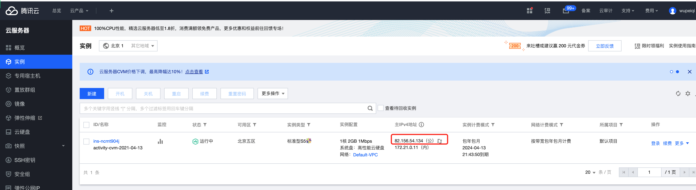

# day06 网络和并发

## 今日概要

- 网络编程，写得好 & 用的多（底层用到了）。【实战应用】
- 并发编程
  - 线程开发
  - 线程安全
  - 线程池
  - 单例模式（2种单例模式：模块导入、元类、`__new__`）


## 1. 网络编程

内网和外网的概念。

一个员工第一天日志：

- 很多的账号：邮箱、内部系统、任务管理（内网访问，外网无法访问）。


如果我在家加班？需要用到内网的系统。

- 个人级别，远程连接。  teamviewer
- 公司级别，VPN，通道（用户名&秘钥）。 类似于翻墙。【内网系统，VPN】


与你们可能最相关：gitlab


## 2.开发一个”网站“


### 2.1 网站的祖宗

socket服务端：

```python
import socket

sock = socket.socket(socket.AF_INET, socket.SOCK_STREAM)
sock.bind(('IP', 8001)) # 监听IP和端口
sock.listen(5) # 排队等5个人

while True:
    conn, addr = sock.accept() 		# 阻塞，等待用户来连接
    client_data = conn.recv(1024)   # 阻塞，等待用户发来消息
    print(client_data.decode('utf-8'))

    conn.sendall("hello world".encode('utf-8'))  # 给用户回消息
    conn.close() # 关闭连接

sock.close()
```

自己再写一个socket客户端。

然后：

- 启动服务端
- 让客户度去向服务端发送请求。


让你开发一个网站：

- 写一个socket服务端

  ```python
  import socket
  
  sock = socket.socket(socket.AF_INET, socket.SOCK_STREAM)
  sock.bind(('IP', 8001)) # 监听IP和端口
  sock.listen(5) # 排队等5个人
  
  while True:
      conn, addr = sock.accept() 		# 阻塞，等待用户来连接
      client_data = conn.recv(1024)   # 阻塞，等待用户发来消息
      print(client_data.decode('utf-8'))
  	
      conn.sendall(b"HTTP/1.1 200 OK\r\n\r\n") # 固定要返回给浏览器
      conn.sendall(b"hello <h1>alex</h1>")      # 返回的内容
      conn.close() # 关闭连接
  
  sock.close()
  ```

  ```python
  import socket
    
  def handle_request(client):
      buf = client.recv(1024) # 接收发来的请求（不做任何处理，登录、注册、....）
      # ....
      
      client.send(b"HTTP/1.1 200 OK\r\n\r\n")
      client.send(b"Hello, Alex")
    
  def main():
      sock = socket.socket(socket.AF_INET, socket.SOCK_STREAM)
      sock.bind(('0.0.0.0',80)) # 本机的80端口
      sock.listen(5)
    
      while True:
          connection, address = sock.accept()
          handle_request(connection) # 一旦有人来连接
          connection.close()
    
  if __name__ == '__main__':
      main()
  ```

  

- socket客户端（浏览器）

  ```
  hello，正常显示
  <h1>alex</h1>，加大加粗显示。
  <h1 style='color:red;'>alex</h1>，加大加粗 且 红色字体。
  ```

  

### 2.2. 租服务器（外网IP）【腾讯云】


注意：Linux（centos7）。


登录平台：




### 2.3 安全组配置

哪些指定端口是开放。


访问我的这个电脑时：

```
82.156.54.134:80    ,程序A
82.156.54.134:9000  ,程序B
82.156.54.134:22    ,程序C
```


### 2.4 本地开发代码

```python
import socket


def handle_request(client):
    buf = client.recv(1024)  # 接收发来的请求（不做任何处理，登录、注册、....）
    # ....

    client.send(b"HTTP/1.1 200 OK\r\n\r\n")
    client.send(b"Hello, Alex")


def main():
    sock = socket.socket(socket.AF_INET, socket.SOCK_STREAM)
    sock.bind(('192.168.111.11', 80))  # 本机的80端口
    sock.listen(5)

    while True:
        connection, address = sock.accept()
        handle_request(connection)  # 一旦有人来连接
        connection.close()


if __name__ == '__main__':
    main()
```


### 2.5 上传到服务器运行

上传文件的形式：

- FTP（filezilla）
  
- Lz & scp


上述工具都可以实现上传代码。


程序员，不会用上述的工具去上传代码，而是用git来进行上传。


- 代码托管平台：创建一个仓库（文件夹）。
  

  


  文件夹地址：https://gitee.com/wupeiqi/website.git  （具体地址根据自己的情况来定）

- 在本机，将写好的代码上传。

  - 第一次上传代码：

    ```
    git init
    git add .
    git commit -m '初始化'
    git remote add origin https://gitee.com/wupeiqi/website.git 
    git push origin master
    ```

  - 以后再上传代码：

    ```
    git add .
    git commit -m '....'
    git push origin master 
    ```

  

- 在服务器上，将代码拉下来。

  - 登录服务器
    

    

    

    

    以后所有的操作都在黑框中

    ```
    删除文件夹
    进入文件
    查看目录
    查看文件
    ...
    都需要命令来操作。
    ```


    通过命令，将代码从代码仓库下载下来。

- 想要下载，必须要借助git软件。安装上git

```
yum install git
```

- 第一次下载代码


​    

- 更新代码
  


​      

​     


​      


​    

    假设，现在你们FTP的作业 & 服务器 & 代码放上去 & 运行起来（开放服务）。


​    

​    

​    

### 2.6 域名

```
http://82.156.54.134:9000/
http://www.xxx.com:9000/
```


#### 1. 花钱，租域名。【阿里云】


#### 2.域名解析

域名 -> 服务器IP绑定。


```
xxx.pythonav.com       ->     82.156.54.134
```


#### 3.访问服务

```
         IP         : 端口
http://82.156.54.134:9000/

http://xxx.pythonav.com:9000/
```

由于：

```
pythonav.com 域名。
	www.pythonav.com     47.104.0.201
	task.pythonav.com    81.70.236.53
	xxx.pythonav.com     82.156.54.134 
	...
```


疑问：网站开发时，用浏览器访问网站时，自动会携带80端口

```
http://xxx.pythonav.com        ->    http://xxx.pythonav.com:80
https://xxx.pythonav.com       ->    http://xxx.pythonav.com:443

浏览器不给咱们自动携带9000，只能自己写： http://xxx.pythonav.com:9000/
```


如果让自己的程序监听的80短口，哪么以后就不用输入其他的端口了：


```python
import socket


def handle_request(client):
    buf = client.recv(1024)  # 接收发来的请求（不做任何处理，登录、注册、....）
    # ....if xx..xxxx....
	# 
    client.send(b"HTTP/1.1 200 OK\r\n\r\n")
    client.send(b"Hello,DSB  DDB  Alex")


def main():
    sock = socket.socket(socket.AF_INET, socket.SOCK_STREAM)
    # sock.bind(('127.0.0.1', 80))  # 本机的80端口
    sock.bind(('0.0.0.0', 80))      # 如果想要让外网访问（别的网络访问我们的程序）
    sock.listen(5)

    while True:
        connection, address = sock.accept()
        handle_request(connection)  # 一旦有人来连接
        connection.close()


if __name__ == '__main__':
    main()
```


总结：整体的意思：

- 学开发，写代码（网络相关的代码） - socket 。
- Linux & 项目项目部署时， 基于网络知识 + 代码。


## 答疑环节

- 买域名之后，自然就有解析的功能。

- 为什么不写成其他

  ```
  www.autohome.com
  task.autohome.com
  buy.autohome.com
  ...
  ```

- 上传到服务器有一个IP地址。

  - 开发机（内网IP）：192.168.11.11

    ```python
    # web.py
    ...
    sock.bind(('192.168.11.11', 80))         # 本机的80端口
    ...
    ```

    ```
    python3.9 web.py
    ```

    在我本地运行，只能让局域网用户访问。

  - 服务器（内网IP、外网IP 82.156.54.134 ）：

    ```python
    # web.py...sock.bind(('82.156.54.134', 80))  # 本机的80端口...
    ```

    ```python
    python3.9 web.py
    ```

    所有有网络的人都可以访问。
    缺点在于，每次上线到服务器时IP都要改下。

    ```python
    sock.bind(('0.0.0.0', 80))
    ```

- 并发，将大量的请求分发到给多个人去处理（分布式）。

- 多个服务

  - 穷公司，租一台服务器（2k/年）。
    - 官网：80
    - 文件共享服务器：9000
    - 员工打卡系统：8080
    - 案例：电影网站。
  - 大公司，一台服务器做一个事（官网：80）。

  


上述网站缺点：

- 并发能力差

  - 了解底层，开进程 or 线程 or IO复用等。
  - 企业开发，开进程 or 线程 or IO复用等不需要写，而是需要懂并且进行配置。

- 业务开发繁杂，有了web框架让你来做这些事。

  ```python
  from flask import Flask
  app = Flask(__name__)
  
  
  @app.route("/index")
  def index():
      return "xxxx"
  
  app.run()
  ```

  ```python
  import socket
  
  
  def handle_request(client):
      buf = client.recv(1024)  # 接收发来的请求（不做任何处理，登录、注册、....）
      # ....if xx..xxxx....
  	# 
      client.send(b"HTTP/1.1 200 OK\r\n\r\n")
      client.send(b"Hello,DSB  DDB  Alex")
  
  
  def main():
      sock = socket.socket(socket.AF_INET, socket.SOCK_STREAM)
      # sock.bind(('127.0.0.1', 80))  # 本机的80端口
      sock.bind(('0.0.0.0', 80))      # 如果想要让外网访问（别的网络访问我们的程序）
      sock.listen(5)
  
      while True:
          connection, address = sock.accept()
          handle_request(connection)  # 一旦有人来连接
          connection.close()
  
  
  if __name__ == '__main__':
      main()
  ```

  


## 3.并发编程


### 3.1 线程提升并发

```python
import socket
import threading


def handle_request(client):
    buf = client.recv(1024)  # 接收发来的请求（不做任何处理，登录、注册、....）
    # ....if xx..xxxx....
	# 
    client.send(b"HTTP/1.1 200 OK\r\n\r\n")
    client.send(b"Hello,DSB  DDB  Alex")
    
    connection.close()


def main():
    sock = socket.socket(socket.AF_INET, socket.SOCK_STREAM)
    sock.bind(('0.0.0.0', 80))      # 如果想要让外网访问（别的网络访问我们的程序）
    sock.listen(5)

    while True:
        connection, address = sock.accept() # 等待客户端来连接
        
        # 创建了一个线程
        t = threading.Thread(target=handle_request,args=(connection,))
        # 线程去运行
        t.start()
        
if __name__ == '__main__':
    main()
```


线程可以提升并发能力，在python内部为你提供了 socketserver 的模块（多线程和多进程机制）。

```python
import socketserver

class MyServer(socketserver.BaseRequestHandler):

    def handle(self):
        client = self.request
        buf = client.recv(1024)  # 接收发来的请求（不做任何处理，登录、注册、....）
        client.send(b"HTTP/1.1 200 OK\r\n\r\n")
        client.send(b"Hello,DSB  DDB  Alex")
        connection.close()


if __name__ == '__main__':
    server = socketserver.ThreadingTCPServer(('0.0.0.0',80),MyServer)
    server.serve_forever()
```


### 3.2 socketserver的源码分析


上述过程，手动自己创建线程提升我们项目的并发能力。


### 3.3 web实战

实战中提升并发能力，不需自己写进程和线程。

例如：uwsgi，配置：进程和线程。


我在开发网站时，自己没有写过任何进程和线程相关代码。


### 3.4 学并发的意义

- 网站和平台， 配置好，懂。
- 写脚本 + 并发（自己写）


## 4.线程知识点


### 4.1 线程安全

```python
import threading

loop = 10000000
number = 0

# 加
def _add(count):
    global number
    for i in range(count):
        number += 1

# 减
def _sub(count):
    global number
    for i in range(count):
        number -= 1

# 创建了1个线程
t1 = threading.Thread(target=_add, args=(loop,)) # 线程A，10000000 循环
t1.start()
t1.join()   # 等待当前线程执行完毕后，在继续向下执行。

# 创建了1个线程
t2 = threading.Thread(target=_sub, args=(loop,)) # 线程B，10000000 循环
t2.start()
t2.join()  

print(number) # 0
```


```python
import threading

loop = 10000000
number = 0

# 加
def _add(count):
    global number
    for i in range(count):
        number += 1

# 减
def _sub(count):
    global number
    for i in range(count):
        number -= 1

# 创建了2个线程（同时2个线程都在执行）
t1 = threading.Thread(target=_add, args=(loop,)) # 线程A，10000000 循环
t2 = threading.Thread(target=_sub, args=(loop,)) # 线程B，10000000 循环
t1.start()
t2.start()

t1.join()  # t1线程执行完毕,才继续往后走
t2.join()  # t2线程执行完毕,才继续往后走

print(number) # 不一定
```


数据安全，多个线程去同时抢占式的操作同同一个值时，不要让他出现数据混乱。


- Python内部有些东西，本身就是数据安全。

  ```python
  v1 = []  # 1/2/3 顺序 1、3、2
  
  v1.append(1)
  v1.append(2)
  v1.append(3)
  
  v1.extend([11,22,33,44])
  
  v1.pop()
  v1[1]
  ```

- 需人为让他数据安全

  ```
  v1 = 123
  v1 = 456
  
  
  v2 = [11,22]
  v2 = [77,88]
  ```

  

简单记忆法：

```
列表中的元素、字典，获取都是数据安全。 append、extend

重新赋值，非数据安全。
v1 = v1 + 1
```


RLock和Lock

```python
import threading

num = 0
lock_object = threading.RLock()


def task():
    print("开始")
    lock_object.acquire()  # 第1个抵达的线程进入并上锁，其他线程就需要再此等待。
    global num
    for i in range(1000000):
        num += 1
    lock_object.release()  # 线程出去，并解开锁，其他线程就可以进入并执行了
    print(num)


for i in range(2):
    t = threading.Thread(target=task)
    t.start()
```


### 4.2 线程池

多线程提高并发能力时，不是说 多开线程 性能就好。

```python
import threading

def task(video_url):
    pass

url_list = [ "www.xxxx-{}.com".format(i) for i in range(30000) ]

for url in url_list:
    t = threading.Thread(target=task, args=(url,))
    t.start()

# 这种每次都创建一个线程去操作，创建任务的太多，线程就会特别多，可能效率反倒降低了。
```

```python
import time
from concurrent.futures import ThreadPoolExecutor

def task(video_url,num):
    print("开始执行任务", video_url)
    time.sleep(5)

# 创建线程池，最多维护10个线程。
pool = ThreadPoolExecutor(10)

# 将30000个任务都交给线程池，10个线程。 他会：10个为一组去运行。
url_list = ["www.xxxx-{}.com".format(i) for i in range(30000)]
for url in url_list:
    pool.submit(task, url,2)
    
print("END")
```


注意：尽量用线程池。


### 4.3 单例模式（面试题）

```python
class Foo(object):
    pass


obj1 = Foo()  # 根据Foo类创建了一个实例
obj2 = Foo()  # 根据Foo类创建了一个实例

print(obj1)
print(obj2)
```


```python
import time
import threading


class Foo(object):
    instance = None

    def __new__(cls, *args, **kwargs):
        if cls.instance:
            return cls.instance
        cls.instance = super().__new__(cls)
        return cls.instance

# 多线程情况下，有问题了。
def task():
    obj1 = Foo()  # 创建了对象
    print(obj1)


for i in range(5):
    t = threading.Thread(target=task)
    t.start()
    
# 在非多线程情况下，没问题。
"""
obj1 = Foo()
obj2 = Foo()
print(obj1)
print(obj2)
"""


```


```python
import time
import threading


class Foo(object):
    instance = None
    lock = threading.RLock()

    def __new__(cls, *args, **kwargs):
        with cls.lock:
            if cls.instance:
                return cls.instance
            time.sleep(1)
            cls.instance = super().__new__(cls)
            return cls.instance
        

# obj1 = Foo()
# obj2 = Foo()
# print(obj1)
# print(obj2)


def task():
    obj1 = Foo()  # 创建了对象
    print(obj1)


for i in range(5):
    t = threading.Thread(target=task)
    t.start()

```


```python
import time
import threading


class Foo(object):
    instance = None
    lock = threading.RLock()

    def __new__(cls, *args, **kwargs):   
        if cls.instance:
            return cls.instance
            
        with cls.lock:
            if cls.instance:
                return cls.instance
            cls.instance = super().__new__(cls)
            return cls.instance


def task():
    obj1 = Foo()  # 创建了对象
    print(obj1)  # 用的都是第一次创建的对象

for i in range(50):
    t = threading.Thread(target=task)
    t.start()

# ......


obj1 = Foo() # 申请  获取  释放
obj1 = Foo() # 申请  获取  释放
```


## 总结

1. 开发一个网站（流程）
   - 网络编程去写代码
   - 网络知识去部署

2. Git配合部署
3. 服务器、域名、端口
4. 并发编程
   - 数据分析，脚本（到底怎么写）。
   - 全栈开发，部署+配置。
     - 平台部署
     - 脚本
5. 线程
   - 线程安全
   - 线程池
   - 单例模式（面试题 & 源码）【元类、模块导入、new】
     - 元类 + new ，  自己加锁
     - 模块导入，内部实现了多线程处理机制。


## 答疑

- 到现在我都不明白git的优势

  - git上线的流程

  - 优势

    - 版本控制
    - 协同开发

  - 举例：

    - 我们电脑丢了

      ```
      A
      				协同开发
      B
      ```

    - gitee被黑了

      ```
      A(v1/v2/v3...)
      					协同开发
      A(v1/v2/v3...)
      ```

    - 协同开发遍历

      ```
      A(v1/v2/v3...)
      	[马岩]
      					     协同开发（master）
      A(v1/v2/v3...)
      	[武沛齐]
      ```

    - 突然有bug

      ```
      A(v1/v2/v3...)
      	* [马岩]1/2
      	[master]-修复bug
      					     协同开发（master）   修复bug
      A(v1/v2/v3...)
      	[武沛齐]1/2
      ```

    - 回滚

      ```
      A(v1/v2/v3...)
      	* [马岩]1/2
      					     协同开发（master）  v3
      A(v1/v2/v3...)
      	[武沛齐]1/2
      ```

- git托管

- 自动部署

  

## 下午答疑

### 孔维平

#### saas，服务。

- 软件开发公司

  ```
  需求告诉我，为你定制开发  -> 50w
  ```

  ```python
  需求告诉我，为你定制开发  -> 100w
  ```

  ```
  需求告诉我，为你定制开发  -> 100w
  ```

  ```
  2w* 10 = 20w * 13 = 260w  -> 300w
  ```

- 通用的平台

  - 开发100各组件。【10 - 5：5】
  - 服务：
    - A，5w    【20】
    - B，10w  【50】
    - C，20w  【100】  混淆->反编译
  - 平台 `www.pythonav.com`
    - 100组件，跳出20个 -> 配置（ luffy.pythonav.com）
    - 100组件，跳出20个 -> 配置（ luffy.pythonav.com）
    - 100组件，跳出20个 -> 配置（ luffy.pythonav.com）
    - 100组件，跳出20个 -> 配置（ luffy.pythonav.com）

- 数据隔离
  - 每个公司一个数据库
  - 每个公司一个数据库
  - 每个公司一个数据库


#### 反向代理

```
buy.pythonav.com
car.pythonav.com                      服务器（做）           
xo.pythonav.com
```

```
www.pythonav.com                      服务器（做）             
```


## 宋永杰

Nginx 和 uwgsi 怎么做开机启动（一条命令）


## 于科峰

分布式爬虫

```
linux   redis

A和B去爬虫。
```


## 秀奎


## 正泰永

运维开发方向。

- 基础
- 网络并发
- 【节点】自己的公司：用python写脚本（ paramiko ） + 脚本
- 前端 & django
  - 前后端不分离，django+html+CSS+JS 。
  - 【节点】代码发布。
- 前后端分离，django + drf + vue.js 
  - 【运维平台】CMDB+配置管理+终端命令


popen 和 paramiko只会一种就行吗？

```python
popen,本地命令。
paramiko远程执行命令。
```


## 刘长利

前端应该写什么。

https://pythonav.com/wiki/detail/5/61/

```
第一章 HTML
第二章 CSS（一）
第三章 CSS（二）
第四章 JavaScript
第五章 jQuery
```


注意：前端的时候不用多看 ajax + django。（前后端分离讲axios）


## 谢君

线程任务执行完成，拿到结果。

```
想要获取设备上的日志； 先杀掉进程； 获取日志的结果。

subprocess，在ps端执行shell，通过adb获取设备信息。
```

问题：

- 获取设备信息

  ```python
  result = subprocess.getout("adb 服务A.....")
  print(result)
  ```

- 期望

  ```
  # 第一步：先去把进程杀掉。
  subprocess.getout("adb 服务A.....")
  
  # 第二步：再去读取日志
  result = subprocess.getout("adb 服务A.....")
  print(result)
  ```


## 刘工

pyqt - 代码。

- 界面去监控硬件设备的数据（画图 和 实时数据展示 ）


## 君刚

有两台设备主机，如何同时展现在一台显示器上，实现实时监控。

- 设备：分屏。
- 程序：直播 + 推流。


OBS，屏幕。URL

nginx + ffmpeg （URL）   切成M3U8

页面


lock（）和join（）有什么区别

```python
join，针对线程，等待这个线程执行完毕（等待多久）

t = threading.Thread(target=函数)
t.start()
t.join() # 主线程等待子线程中的函数执行完毕之后，再继续向下。

print(123)
```


```python
count = 10
def task():
    print("开始")
    with lock: # 同一时刻只允许一个线程执行这个代码。
		count +=1
    
for i in range(10):
    t = threading.Thread(target=task)
    t.start()
```


```python
count = 10
def task():
    print("开始")
	count +=1
    print(count)
    
for i in range(10):
    t = threading.Thread(target=task)
    t.start()
    t.join() # 第一个子线程执行完毕后，再继续执行
    
for i in range(10):
    task()
```


进程：为什么Process类要放到 if __name__=='__main__' 下面？

- fork ；linux + Mac

  ```python
  def run():
      Process
  run()
  ```

- spawn； win + mac

  ```python
  def run():
      Process
  
  if name=="__main__":
      run()
  ```

- forkserver；unix


扩展：

```python
import multiprocessing
import time

def task():
    print(name)
    name.append(123)


if __name__ == '__main__':
    # 修改创建进程的模式：fork、spawn、forkserver
    multiprocessing.set_start_method("fork")  # fork、spawn、forkserver
    name = []

    p1 = multiprocessing.Process(target=task)
    p1.start()

    time.sleep(2)
    print(name)  # []
```


## 文佳话（CDN）

nginx+lua（测试不同区域用户打开网速度）

A机房：系统

B机房：系统


自动化运维部署，想实现部署 `应用`。

- Paramiko

  ```python
  import paramiko
   
  private_key = paramiko.RSAKey.from_private_key_file('/home/auto/.ssh/id_rsa')
   
  ssh = paramiko.SSHClient()
  ssh.set_missing_host_key_policy(paramiko.AutoAddPolicy())
  # 连接服务器
  ssh.connect(hostname='c1.salt.com', port=22, username='wupeiqi', key=private_key)
   
  # 执行命令
  stdin, stdout, stderr = ssh.exec_command('yum install mysql -y')
  # 获取命令结果
  result = stdout.read()
  
  # 关闭连接
  ssh.close()
  ```

- 网站

  - 按钮，点击

    ```python
    import paramiko
     
    private_key = paramiko.RSAKey.from_private_key_file('/home/auto/.ssh/id_rsa')
     
    ssh = paramiko.SSHClient()
    ssh.set_missing_host_key_policy(paramiko.AutoAddPolicy())
    # 连接服务器
    ssh.connect(hostname='c1.salt.com', port=22, username='wupeiqi', key=private_key)
     
    # 执行命令
    stdin, stdout, stderr = ssh.exec_command('yum install mysql -y')
    # 获取命令结果
    result = stdout.read()
    
    # 关闭连接
    ssh.close()
    ```


- django中查询不同的数据库

  ```python
  DATABASES = {
      'default': {
          'ENGINE': 'django.db.backends.postgresql',
          'NAME': 'mydatabase',
          'USER': 'mydatabaseuser',
          'PASSWORD': 'mypassword',
          'HOST': '127.0.0.1',
          'PORT': '5432',
      },
      'v1': {
          'ENGINE': 'django.db.backends.postgresql',
          'NAME': 'mydatabase',
          'USER': 'mydatabaseuser',
          'PASSWORD': 'mypassword',
          'HOST': '127.0.0.1',
          'PORT': '5432',
      }
  }
  ```

  ```python
  models.User.objects.filter(xxx).using("v1")
  
  models.User.objects.filter(xxx).using("default")
  ```


  ```python
  class AuthRouter:
      def db_for_read(self, model, **hints):
          model._meta.app_label
          if model._meta.name in ["user","order"]
              return 'default'
          return "v1"
  
      def db_for_write(self, model, **hints):
          if model._meta.app_label in self.route_app_labels:
              return 'default'
          return "v1"
  ```

  ```
  models.user.objects.xxx()
  models.xxxx.objects.xxx()
  ```

  


## zack

大三，准备考研，到模块3了。

- 软件开发，不建议考研。
- AI相关，建议考研。【考研】+ 【听看 数据库 + 前端 看】。


## 自学新模块

- 百度，google，博客文章。
- 官方文档（很多官方文档垃圾）。
- demo


## 马岩

pdfmainer 读取pdf，文字顺序提取的是乱。位置有问题。

ocr。


