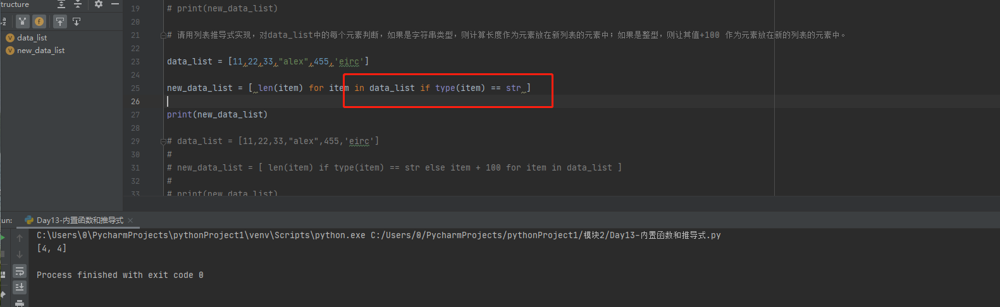
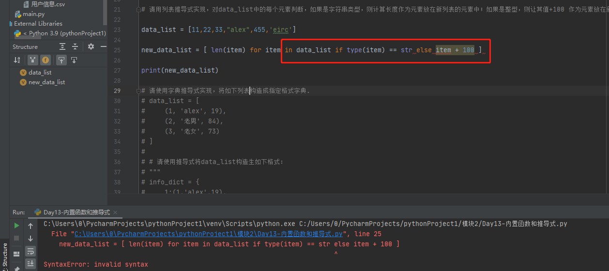
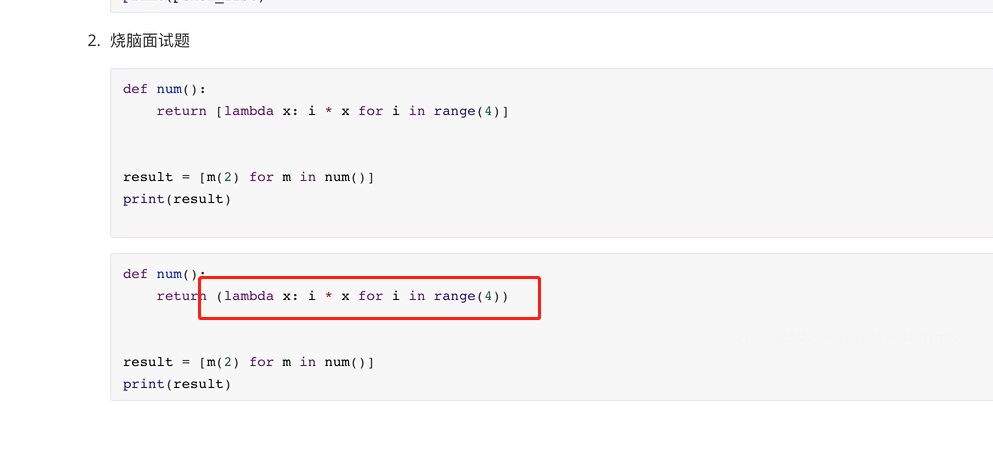
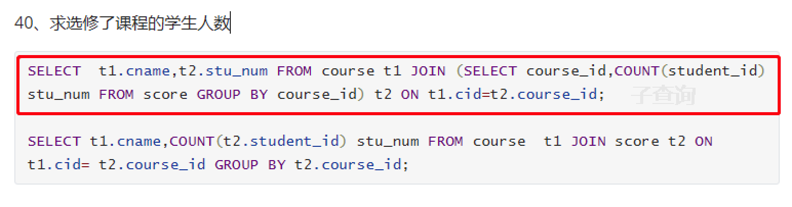
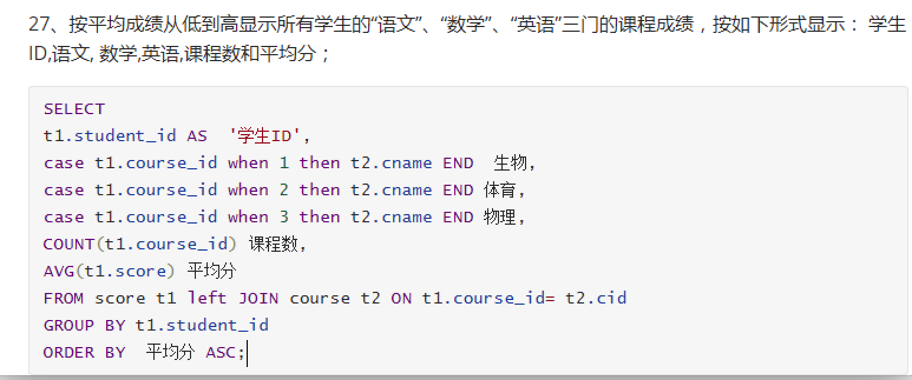
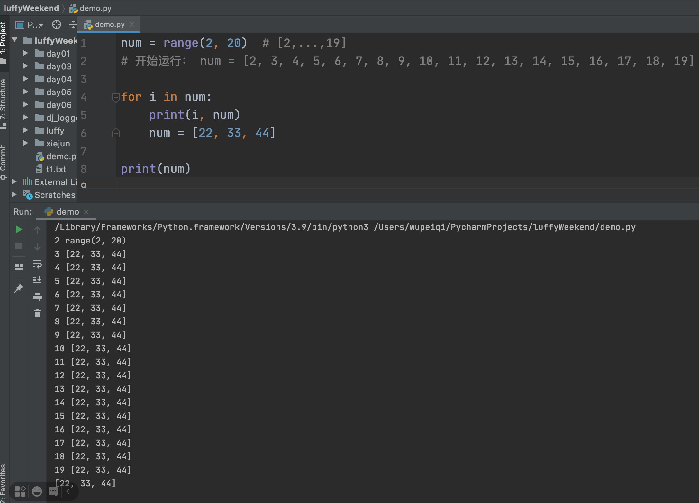

## 谢君

- jQuery和BootStrap感觉不理解。

  ```
  前端开发必备（30%）
  	HTML，标签熟悉。
  	CSS，样式让标签更好看。
  	JavaScript，让页面动的效果（点击、滑动...）
  
  开发项目，建议：结合框架 + 自己掌握知识。（30%，基于BootStrap搭建系统）
  	jQuery框架：常见的动态效果、寻找标签，集成到框架。
  		例如：
  			JavaScript： document.getelementbyid("i1")
  			jQuery:      $("i1")
  			
  	BootStrap框架
  		- 静态效果，直接拷贝。
  		- 动态效果，依赖jQuery
  		
  	基于BootStrap开发项目场景：
  		1. 小公司&小项目。
  		2. 个人项目
  		3. 让你一个人（django+BootStrap）
  		
  后来13年之后：（40%）
  	稍微大的电公司或面向用户的项目，招聘：
  		后端，API（django+django restframework)
  		前端，HTML、CSS、JavaScript（vue.js / react.js / angular.js - 前端框架）
  	优点：
  		- 职责分明
  		- 开发效率高（框架内容主要实现双向绑定...）
  		- 性能高
  		- 衍生多方面的情景：
  			- 微信小程序
  			- APP（ uni-app框架、react-native框架）
  		
  大公司的前端开发：自己开发自己的组件库。
  	手动自己写多有的组件。
  ```


## 南川






```python
[ for x in xx ]

[ for x in xx if 条件 ]
```

```python
data = 1 if 条件 else 2
```


语法：

```python
def func():
    yield 123
```

```python
data = ( for i in range(10) )
```


```
data = [ for i in range(10) ]
data = { i:123 for i in range(10) }
```




调用文件路径的问题

- win & linux

  ```
  xxx\\xxx\\test
  xxx/xxx/xxx
  
  # 建议：
  open(r"xxx\xxx\test")
  
  # 更建议
  path = os.path.join('xxx','xxx','test')
  open(path)
  ```

- 相对路径问题

  ```
  建议使用绝对路径
  ```


## lx670

- 获取前3名

  ```sql
  select * from table order by id desc limit 3
  ```

  ```sql
      select score.sid,score.course_id,score.num,T.first_num,T.second_num from score left join
      (
          select
          sid,
          (select num from score as s2 where s2.course_id = s1.course_id order by num desc limit 0,1) as first_num,
          (select num from score as s2 where s2.course_id = s1.course_id order by num desc limit 3,1) as second_num
          from
          score as s1
      ) as T
      on score.sid =T.sid
      where score.num <= T.first_num and score.num >= T.second_num
  ```

  

## 秀奎

以前的习惯，先去join表。






## 朱健康

```

子查询：
	select id,name, 1, (select id from xb where name='xxx')    xx    注意：不能获取多条数据。
	select id,name, xx from tb1 left join (select * from oo where id>10) as T
	select id from xxx where nid in (select id from uuu)
```


## 记得隆冬强

关于debug：

- 两个窗口。

建议：

- 注释
- 不要同时运行去调试，写脚本。


## 马岩

- 类的关系


## 文佳话

```
urlpatterns = [
    url(r'^index/', name="xxx"),
    url(r'^admin/', admin.site.urls),
    url(r'^rbac/', include(('rbac.urls','rbac'))),  # 权限相关路由分发在rbac上
    url(r'^', include('web.urls')),
]
```

```
recursion_urls(None,'/',md.urlpatterns, url_ordered_dict)  # 递归获取所有的路由
```


```python
urlpatterns = [
    url(r'^admin/', [
        url(r'^index/', name="xxx"),
        url(r'^b1/', [
            url(r'^inxxxdex/', name="vv"),
        ], namespace='n2'),
    ], namespace='n1'),
]


n1:xxx
n1:n2:vv
```


## 陈俊华

```
num = range(2,20)
for i in num:
    num = list( filter(lambda x: x == i or x % i, num) )
print(num)
```




```
lambda x: x == i or x % i
```

```python
def func(x):
    return x == i or x % i
```

```python
1 or 2
```


初级：if else

中级：rbac（URL级别、按钮）

高级：rbac粒度控制行。


