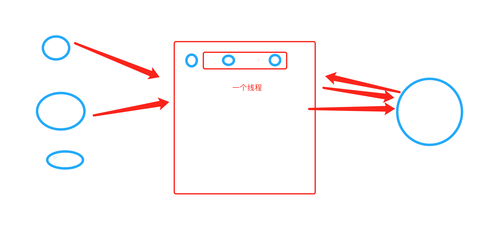
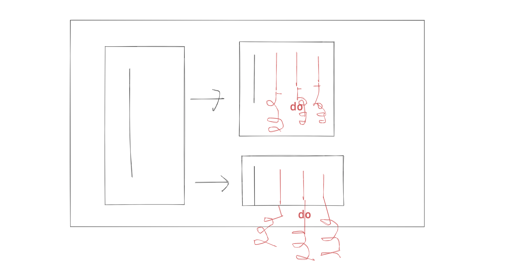
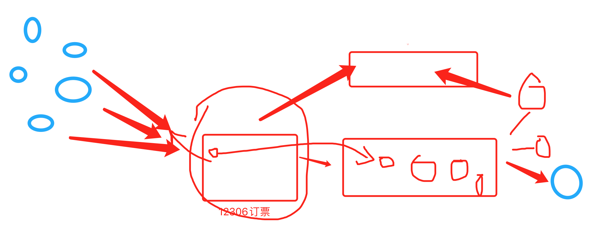
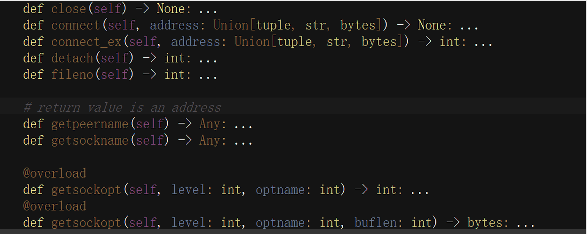

# day08 并发编程

今日概要：

- 进程知识点
- 日志处理的案例
- 协程


## 1. 进程相关


### 1.1 进程的模式

创建协程时候，要求你写到 `__main__`。（window系统）

```python
def func():
    pass

if __name__ == "__main__":
    p = Process(target=func)
    p.start()
```

```python
def func():
    pass

def xx():
    p = Process(target=func)
    p.start()
    
if __name__ == "__main__":
    xx()
```


关于在Python中基于multiprocessiong模块操作的进程：

Depending on the platform, [`multiprocessing`](https://docs.python.org/3/library/multiprocessing.html#module-multiprocessing) supports three ways to start a process. These *start methods* are

> - *fork*，【“拷贝”几乎所有资源】【支持文件对象/线程锁等传参】【unix】【任意位置开始】【快】
>
>   The parent process uses [`os.fork()`](https://docs.python.org/3/library/os.html#os.fork) to fork the Python interpreter. The child process, when it begins, is effectively identical to the parent process. All resources of the parent are inherited by the child process. Note that safely forking a multithreaded process is problematic.Available on Unix only. The default on Unix.
>
> - *spawn*，【run参数传必备资源】【不支持文件对象/线程锁等传参】【unix、win】【main代码块开始】【慢】
>
>   The parent process starts a fresh python interpreter process. The child process will only inherit those resources necessary to run the process object’s [`run()`](https://docs.python.org/3/library/multiprocessing.html#multiprocessing.Process.run) method. In particular, unnecessary file descriptors and handles from the parent process will not be inherited. Starting a process using this method is rather slow compared to using *fork* or *forkserver*.Available on Unix and Windows. The default on Windows and macOS.
>
> - *forkserver*，【run参数传必备资源】【不支持文件对象/线程锁等传参】【部分unix】【main代码块开始】
>
>   When the program starts and selects the *forkserver* start method, a server process is started. From then on, whenever a new process is needed, the parent process connects to the server and requests that it fork a new process. The fork server process is single threaded so it is safe for it to use [`os.fork()`](https://docs.python.org/3/library/os.html#os.fork). No unnecessary resources are inherited.Available on Unix platforms which support passing file descriptors over Unix pipes.

```python
import multiprocessing
multiprocessing.set_start_method("spawn")
```

*Changed in version 3.8:* On macOS, the *spawn* start method is now the default. The *fork* start method should be considered unsafe as it can lead to crashes of the subprocess. See [bpo-33725](https://bugs.python.org/issue33725).

*Changed in version 3.4:* *spawn* added on all unix platforms, and *forkserver* added for some unix platforms. Child processes no longer inherit all of the parents inheritable handles on Windows.

On Unix using the *spawn* or *forkserver* start methods will also start a *resource tracker* process which tracks the unlinked named system resources (such as named semaphores or [`SharedMemory`](https://docs.python.org/3/library/multiprocessing.shared_memory.html#multiprocessing.shared_memory.SharedMemory) objects) created by processes of the program. When all processes have exited the resource tracker unlinks any remaining tracked object. Usually there should be none, but if a process was killed by a signal there may be some “leaked” resources. (Neither leaked semaphores nor shared memory segments will be automatically unlinked until the next reboot. This is problematic for both objects because the system allows only a limited number of named semaphores, and shared memory segments occupy some space in the main memory.)

官方文档：https://docs.python.org/3/library/multiprocessing.html

```python
import time
import multiprocessing


def task():
    print(name)
    name.append(123)


if __name__ == '__main__':
    # multiprocessing.set_start_method("fork")  # 拷贝
    multiprocessing.set_start_method("spawn") # 报错
    # multiprocessing.set_start_method("forkserver")  # 报错
    name = []

    p1 = multiprocessing.Process(target=task)
    p1.start()

    time.sleep(2)
    print(name)  # []
```


总结：以后只要是 `if __name__ == '__main__'` 代码就不会报错； fork和spawn模式拷贝数据（子进程中想要拷贝主进程中的数据，用参数传递）。


### 1.2 日志实战案例

基于 logging 实现日志，每天的日志都记录到一个文件中。

例如：开发一个网站，4CPU=4个进程。


假设：

- 启动网站，创建4个进程，每个进程中都打开文件 `a1.log`，每个进程中都有

  ```
  # 每个进程都有各自文件对象
  file_object = open('a1.log','a',encoding='utf-8')
  ```

- 用户来访问

  ```
  其中1个进程接收并却处理，执行自己的write
  file_object.write("日志...")
  ```

- 同时来4个

  ```
  其中4个进程接收并却处理，执行自己的write
  file_object.write("日志...")
  ```


logging模块实现机制（自动切割日志的功能）

- 启动网站，创建4个进程，每个进程中都打开文件 `a1.log`，每个进程中都有

  ```
  # 每个进程都有各自文件对象
  file_object = open('a1.log','a',encoding='utf-8')
  ```

- 用户来访问

  ```
  其中1个进程接收并却处理，执行自己的write
  file_object.write("日志...")
  ```

- 同时来4个

  ```
  其中4个进程接收并却处理，执行自己的write
  file_object.write("日志...")
  ```

- 例如 5-9 日

  ```
  默认都会 a1.log 文件中
  
  # 到了5.10日
  # 判断a1-5-9.log文件是否存在，如果存在，就删除。
  # 文件不存在，可以重命名；文件存在，依然在a1.log中写入。
  a1.log   ->    a1-5-9.log
  
  # 
  再次写入a1.log
  ```

  

```python
import os
import time
from logging.handlers import TimedRotatingFileHandler


class LuffyTimedRotatingFileHandler(TimedRotatingFileHandler):

    def doRollover(self):
        """
        do a rollover; in this case, a date/time stamp is appended to the filename
        when the rollover happens.  However, you want the file to be named for the
        start of the interval, not the current time.  If there is a backup count,
        then we have to get a list of matching filenames, sort them and remove
        the one with the oldest suffix.
        """
        if self.stream:
            self.stream.close()
            self.stream = None
        # get the time that this sequence started at and make it a TimeTuple
        currentTime = int(time.time())
        dstNow = time.localtime(currentTime)[-1]
        t = self.rolloverAt - self.interval
        if self.utc:
            timeTuple = time.gmtime(t)
        else:
            timeTuple = time.localtime(t)
            dstThen = timeTuple[-1]
            if dstNow != dstThen:
                if dstNow:
                    addend = 3600
                else:
                    addend = -3600
                timeTuple = time.localtime(t + addend)

        """
        # 文件名：a1-5-9.log
        dfn = self.rotation_filename(self.baseFilename + "." +time.strftime(self.suffix, timeTuple))
        # 判断是否存在
        if os.path.exists(dfn):
            os.remove(dfn)
        # 重命名
        self.rotate(self.baseFilename, dfn)
        """
        dfn = self.rotation_filename(self.baseFilename + "." + time.strftime(self.suffix, timeTuple))
        if not os.path.exists(dfn):
            self.rotate(self.baseFilename, dfn)


        if self.backupCount > 0:
            for s in self.getFilesToDelete():
                os.remove(s)
        if not self.delay:
            self.stream = self._open()
        newRolloverAt = self.computeRollover(currentTime)
        while newRolloverAt <= currentTime:
            newRolloverAt = newRolloverAt + self.interval
        # If DST changes and midnight or weekly rollover, adjust for this.
        if (self.when == 'MIDNIGHT' or self.when.startswith('W')) and not self.utc:
            dstAtRollover = time.localtime(newRolloverAt)[-1]
            if dstNow != dstAtRollover:
                if not dstNow:  # DST kicks in before next rollover, so we need to deduct an hour
                    addend = -3600
                else:  # DST bows out before next rollover, so we need to add an hour
                    addend = 3600
                newRolloverAt += addend
        self.rolloverAt = newRolloverAt
```


日志文件不能碰，删除 or 修改，日志不再记录了。

对于文件操作而言：

- 创建文件对象

  ```
  f1 = open('v1.log', 'a', encoding='utf-8')
  ```

- 删除文件  or   重命名  or 修改文件

- 再使用原来的文件对象，写不进去。【解决，重新打开并获取最新的文件对象】

  ```
  f1.write('xxx')
  ```

  

```python
import time
import os
from stat import ST_DEV, ST_INO, ST_MTIME

f = open('xxx.log', mode='a', encoding='utf-8')

sres = os.fstat(f.fileno())
dev, ino = sres[ST_DEV], sres[ST_INO]

while True:
    # 删除文件之后，报错
    try:
        new_sres = os.stat("xxx.log")
    except FileNotFoundError:
        new_sres = None

    if not new_sres or new_sres[ST_DEV] != dev or new_sres[ST_INO] != ino:
        print("文件被修改了 或 删除了 ")
        f = open('xxx.log', mode='a', encoding='utf-8')
        sres = os.fstat(f.fileno())
        dev, ino = sres[ST_DEV], sres[ST_INO]

    f.write("123123\n")
    f.flush()
    time.sleep(1)
```


进程 & 文件修改后重新打开 结合。

```python
import os
import time
import logging.config
from logging.handlers import TimedRotatingFileHandler

# 1. 定义字典
LOGGING_CONFIG = {
    "version": 1,
    "disable_existing_loggers": True,  # 删除已存在其他日志的Handler
    'formatters': {
        'standard': {
            'format': '{levelname} {asctime} {module} {process:d} {thread:d} {message}',
            'style': '{',
        },
    },
    'handlers': {
        'error_file': {
            # "class": 'logging.handlers.TimedRotatingFileHandler',
            "class": 'utils.luffy.LuffyTimedRotatingFileHandler',
            'formatter': 'standard',
            'filename': 'a1.log',
            'when': 'D',  # 根据天拆分日志
            'interval': 1,  # 1天
            'backupCount': 3,  # 保留备份
            "encoding": "utf-8"
        }
    },
    'loggers': {
        'error': {
            'handlers': ['error_file'],
            'level': 'ERROR',
            'propagate': True
        }
    },
}

# 2. 根据自定对logging进行配置
logging.config.dictConfig(LOGGING_CONFIG)

while True:
    logger_object = logging.getLogger("error")
    logger_object.error('6666666666')
    time.sleep(1)
```

```python
import os
import time
import logging
from logging.handlers import TimedRotatingFileHandler
from logging.handlers import WatchedFileHandler
from stat import ST_DEV, ST_INO, ST_MTIME

"""
在内容Logging模块：
    - 实例化 LuffyTimedRotatingFileHandler 对象
        Filterer
        Handler
        StreamHandler
        logging.FileHandler
        BaseRotatingHandler.__init__
        TimedRotatingFileHandler.__init__
        LuffyTimedRotatingFileHandler.__init__
        此过程：
            self.baseFilename     # 日志文件的绝对路径
            self.stream = stream  # 打开的文件对象
            
    - 写日志
        对象.emit("日志内容")
            def emit(self, record):
                try:
                    # 判断是否已经到了第2天，如果到了第2天，就重命名。
                    if self.shouldRollover(record):
                        self.doRollover()
                    
                    # 写日志
                    # 判断日志文件是否存在，如果不存在。【方案1：自己写；直接把logging中的功能拿过来】
                        self.stream = None
                        
                    logging.FileHandler.emit(self, record)
                except Exception:
                    self.handleError(record)
            
            
            def emit(self, record):
                try:
                    # 判断是否已经到了第2天，如果到了第2天，就重命名。
                    if self.shouldRollover(record):
                        self.doRollover()
                    
                    # 写日志
                    # 判断日志文件是否存在，如果不存在。【方案1：自己写；直接把logging中的功能拿过来】
                        self.stream = None
                        
                    logging.FileHandler.emit(self, record)
                except Exception:
                    self.handleError(record)
                    
            def emit(self, record):
                # 如果stream为空，重新打开文件
                if self.stream is None:
                    self.stream = self._open()
                StreamHandler.emit(self, record)
                
            def emit(self, record):    
                try:
                    msg = self.format(record)
                    stream = self.stream
                    stream.write(msg + self.terminator)
                    self.flush()
                except RecursionError:  # See issue 36272
                    raise
                except Exception:
                    self.handleError(record)
                
"""


class LuffyTimedRotatingFileHandler(TimedRotatingFileHandler):

    def __init__(self, *args, **kwargs):
        super().__init__(*args, **kwargs)

        self.dev, self.ino = -1, -1
        self._statstream()

    def _statstream(self):
        if self.stream:
            sres = os.fstat(self.stream.fileno())
            self.dev, self.ino = sres[ST_DEV], sres[ST_INO]

    def reopenIfNeeded(self):
        """
        Reopen log file if needed.

        Checks if the underlying file has changed, and if it
        has, close the old stream and reopen the file to get the
        current stream.
        """
        # Reduce the chance of race conditions by stat'ing by path only
        # once and then fstat'ing our new fd if we opened a new log stream.
        # See issue #14632: Thanks to John Mulligan for the problem report
        # and patch.
        try:
            # stat the file by path, checking for existence
            sres = os.stat(self.baseFilename)
        except FileNotFoundError:
            sres = None
        # compare file system stat with that of our stream file handle
        if not sres or sres[ST_DEV] != self.dev or sres[ST_INO] != self.ino:
            if self.stream is not None:
                # we have an open file handle, clean it up
                self.stream.flush()
                self.stream.close()
                self.stream = None  # See Issue #21742: _open () might fail.
                # open a new file handle and get new stat info from that fd
                self.stream = self._open()
                self._statstream()
            else:
                self.stream = None

    def doRollover(self):
        if self.stream:
            self.stream.close()
            self.stream = None
        # get the time that this sequence started at and make it a TimeTuple
        currentTime = int(time.time())
        dstNow = time.localtime(currentTime)[-1]
        t = self.rolloverAt - self.interval
        if self.utc:
            timeTuple = time.gmtime(t)
        else:
            timeTuple = time.localtime(t)
            dstThen = timeTuple[-1]
            if dstNow != dstThen:
                if dstNow:
                    addend = 3600
                else:
                    addend = -3600
                timeTuple = time.localtime(t + addend)

        """
        # 文件名：a1-5-9.log
        dfn = self.rotation_filename(self.baseFilename + "." +time.strftime(self.suffix, timeTuple))
        # 判断是否存在
        if os.path.exists(dfn):
            os.remove(dfn)
        # 重命名
        self.rotate(self.baseFilename, dfn)
        """
        dfn = self.rotation_filename(self.baseFilename + "." + time.strftime(self.suffix, timeTuple))
        if not os.path.exists(dfn):
            self.rotate(self.baseFilename, dfn)

        if self.backupCount > 0:
            for s in self.getFilesToDelete():
                os.remove(s)
        if not self.delay:
            self.stream = self._open()
        newRolloverAt = self.computeRollover(currentTime)
        while newRolloverAt <= currentTime:
            newRolloverAt = newRolloverAt + self.interval
        # If DST changes and midnight or weekly rollover, adjust for this.
        if (self.when == 'MIDNIGHT' or self.when.startswith('W')) and not self.utc:
            dstAtRollover = time.localtime(newRolloverAt)[-1]
            if dstNow != dstAtRollover:
                if not dstNow:  # DST kicks in before next rollover, so we need to deduct an hour
                    addend = -3600
                else:  # DST bows out before next rollover, so we need to add an hour
                    addend = 3600
                newRolloverAt += addend
        self.rolloverAt = newRolloverAt

    def emit(self, record):
        try:
            # 判断是否已经到了第2天，如果到了第2天，就重命名。
            if self.shouldRollover(record):
                self.doRollover()

            # 写日志
            # 判断日志文件是否存在，如果不存在。【方案1：自己写；直接把logging中的功能拿过来】
            self.reopenIfNeeded()  # self.stream = None

            logging.FileHandler.emit(self, record)
        except Exception:
            self.handleError(record)
```


上述处理是否复杂？但依然有问题。

另外的思路 + 删除文件。

```
5月9日
	5-9.log 模式：a
	
5月10日
	5-10.log 模式：a
```

```python
import os
import datetime
from logging.handlers import WatchedFileHandler


class DailyFileHandler(WatchedFileHandler):
    """ 支持每天创建一个日志 """

    def __init__(self, file_path, mode='a', encoding=None, delay=False, errors=None):
        if not os.path.exists(file_path):
            os.makedirs(file_path)
        self.file_path = file_path
        self.file_name = "{}.log".format(datetime.datetime.now().strftime("%Y-%m-%d"))
        file_name = os.path.join(file_path, self.file_name)

        super().__init__(file_name, mode=mode, encoding=encoding, delay=delay, errors=errors)

    def emit(self, record):
        current_file_name = "{}.log".format(datetime.datetime.now().strftime("%Y-%m-%d"))

        # 文件名不相等：新建文件 + 重新打开 + 重新读取os.state
        if current_file_name != self.file_name:
            self.file_name = current_file_name
            self.baseFilename = os.path.abspath(os.path.join(self.file_path, current_file_name))
            if self.stream:
                self.stream.flush()
                self.stream.close()
            self.stream = self._open()
            self._statstream()

        # 文件名相等，当文件被删除 or 文件内容被修改，则重新打开文件。（可以注释，父类中已有）
        self.reopenIfNeeded()

        super().emit(record)
```


## 2.协程

你理解的协程？以及他的优势？

```
单线程中多个任务的切换。 (没问题)
由程序本身来切换，线程进程基于系统调用来实现。（没问题）

应用场景：IO多路复用感觉是协程的重要应用。
```


单纯的协程：单线程中多个任务的切换。

- 计算型的代码，毫无意义，甚至效率都会很低。
- IO型的代码，把IO等待的时间充分利用上（前提：遇到IO自动切换、结果有了如何通知）。

```python
from greenlet import greenlet

def func1():
    print(1)        # 第1步：输出 1
    gr2.switch()    # 第3步：切换到 func2 函数
    print(2)        # 第6步：输出 2
    gr2.switch()    # 第7步：切换到 func2 函数，从上一次执行的位置继续向后执行
    
def func2():
    print(3)        # 第4步：输出 3
    # 假设向百度发送网络请求，如果 在IO等待的时刻自动切换到其他任务。【如果任务返回了，还要通知线程，可以向下执行了】
    gr1.switch()    # 第5步：切换到 func1 函数，从上一次执行的位置继续向后执行
    print(4)        # 第8步：输出 4
    
gr1 = greenlet(func1)
gr2 = greenlet(func2)

gr1.switch() # 第1步：去执行 func1 函数
```


协程 +   IO自动切换 + 结果通知 =》 NB（单线程可以伪造出并发的效果）

​                       IO多路复用


实现协程相关的模块。

- 客户端，爬虫支持协程。

  ```
  python内置的asyncio模块 + pip install aiohttp 模块
  ```

  ```python
  import aiohttp
  import asyncio
  
  
  async def fetch(session, url):
      print("发送请求：", url) # 第一个任务 / 第一个任务  / 第一个任务
      async with session.get(url, verify_ssl=False) as response:
          text = await response.text()
          print("得到结果：", url, len(text))
          
  async def main():
      async with aiohttp.ClientSession() as session:
          url_list = [
              'https://python.org',
              'https://www.baidu.com',
              'https://www.pythonav.com'
          ]
          tasks = [asyncio.create_task(fetch(session, url)) for url in url_list]
          await asyncio.wait(tasks)
          
  if __name__ == '__main__':
      asyncio.run( main() )
  ```

- 服务端，一个网站支持协程。
  

  ```
  A客户，
  	发来语音。  ->    服务端交给百度      ->      百度处理...
  	发来语音。  <-    服务端交给百度      <-      百度处理...
  ```

  注意：Flask、Django，线程等待。 tornado、sanic、fastapi

  

  ```python
  pip3 install fastapi
  pip3 install uvicorn
  pip3 install aioredis
  ```

  ```python
  #!/usr/bin/env python
  # -*- coding:utf-8 -*-
  import asyncio
  import uvicorn
  import aioredis
  from aioredis import Redis
  from fastapi import FastAPI
  
  app = FastAPI()
  
  # 连接redis数据库
  REDIS_POOL = aioredis.ConnectionsPool('redis://47.193.14.198:6379', password="root123", minsize=1, maxsize=10)
  
  
  # 普通的函数（非协程）
  
  @app.get("/")
  def index():
      """ 普通操作接口 """
      return {"message": "Hello World"}
  
  # 普通的函数（协程）
  @app.get("/red")
  async def red():
      """ 异步操作接口 """
      
      print("请求来了")
      await asyncio.sleep(3)  # IO阻塞
      
      # 连接池获取一个连接
      conn = await REDIS_POOL.acquire()
      redis = Redis(conn)
      
      # 设置值（当前的协程需要执行完整个操作才能往下走、IO等待，内部处理的线程）
      await redis.hmset_dict('car', key1=1, key2=2, key3=3)
      
      # 读取值
      result = await redis.hgetall('car', encoding='utf-8')
      
      print(result)
      # 连接归还连接池
      REDIS_POOL.release(conn)
      return result
  
  
  if __name__ == '__main__':
      uvicorn.run("luffy:app", host="127.0.0.1", port=5000, log_level="info")
  ```

  


基于IO多路复用+socket自己写的支持异步非阻塞框架（协程）

https://www.cnblogs.com/wupeiqi/p/6536518.html


# 思路

- python操作excel，结果（规则）  -> 在黑框和终端操作。
- 用户交互
  - web：web框架
  - 应用：pyqt5框架（直播课）


2个步骤：

- py代码 + 直播1or2    pyinstaller   ->  打包exe文件 ，点击出现黑框（交互）。

-  +pyqt5框架  交互界面。
- 扩展：简单的数据库（SQLite，MySQL）


请问老师，多进程、多线程、协程能同时在一个程序里使用吗？  

如果能，那么他们三者之间的关系和嵌套是怎样的？能画个简单的图说明一下吗？

```python
import multiprocessing
import threading


def do():
    pass


def task():
    for i in range(3):
        t = threading.Thread(target=do)
        t.start()


def run():
    for i in range(2):
        # 创建多个进程
        p = multiprocessing.Process(target=task)
        p.start()


if __name__ == '__main__':
    run()

```




# 答疑

## 贾智博

1. GIL

   ```
   CPython特有，IO密集型和计算密集型（线程&协程、进程）
   ```

2. 事务 innodb模式 ->  支持事务

   ```
   select * from xxx where xxx
   ```

   ```
   begin;
   	1. 去某一张表中获取一些数据。
   		select
   	
   	2. 再插入到另外一个张彪
   		insert ....
   		
   	3. xxxx
   		update ... -> 报错
   commit;
   ```

   - Django写代码

     ```python
     with automic():
         models.User.objectes.all()
         models.User.objectes.create()
         models.User.objectes.update()
     ```

     ```python
     # 1000
     with automic():
         # 1. 账户表，余额   -1000
         
         # 2. 交易记录表    
         
         # 3. 对方账户，余额 + 1000
     ```

   - 存储过程，SQL语句（MySQL）

     ```
     create produ x1:
     begin:
         # 1. 账户表，余额   -1000
         
         # 2. 交易记录表    
         
         # 3. 对方账户，余额 + 1000
         
         # 异常捕获，rollback
     commit;
     ```

3. 锁

   ```python
   select * from tb;
   ```

   ```sql
   begin:
   	select * from tb for update;
   	update ....
   commit;
   ```

   ```python
   # 1000
   with automic():
       # 1. 账户表，余额   -1000
       model.object.users.all().select_for_update()
       
       # 2. 交易记录表    
       
       # 3. 对方账户，余额 + 1000
   ```

4. 单例模式

   - `__new__ + 锁`，torando、drf【面试题】
   - 模块导入 【 写代码 + 源码 】

5. 生产者&消费者模型（celery）

   

## 马岩

老师麻烦给讲讲mysql的版本控制，同一个文件的多个历史版本如何访问，存储。

版本控制（备份）

- 不是基于文件

- 导入和导出sql文件

  ```
  mysqldump -u用户名 -p密码 数据库名称 > 导出文件路径
  
  mysqldump -u root -p 123 db1 > n1.sql
  ```


例如：你有网站500个注册用户，存储在数据库表； 

定时备份，每天凌晨2点【定时任务 crontab】

```
mysqldump -u root -p 123 db1 > 日期.sql （增量）
```


那麻烦您给说下mysql 的 log

- 慢日志

  ```
  DBA职位：
  	配置，SQL执行>5s 或 有索引未命中，SQL语句记录。
  	分析SQL到底为什么，优化。
  开发职位：SQL语句（性能特别差）
  ```

- binlog

  ```
  执行的所有SQL操作，记录下来。
  ```

  

查看SQL性能：执行计划

```
select * from xxx;

explain select * from xxx;    展示
```


## 周文祖

老师，我想问一下如何去运用面向对象这种方式，就比如接到一个任务，如何去分析？ 

任务，函数去实现；如何通过面向对象实现呢？


无论是什么功能，两种编程方式都可以实现。

- 函数编程，擅长。

- 面向对象

  - 封装

    ```python
    def func():
        ....
        return {"a1":123,"a2":456}
    
    result = func()
    print(result) # {"a1":123,"a2":456}
    
    # 接下来做什么？
    request.post(json=result)
    
    result['a1']
    result['a2']
    ```

    ```python
    class Foo(object):
        def __init__(self,a1,a2):
            self.a1 = a1
            self.a2 = a2
    
    def func():
        ....
        return Foo(123,456)
    
    result = func()
    print(result) # Foo对象
    
    
    # 接下来做什么？
    request.post(json= result.__dict__)
    
    result.a1
    result.a2
    ```

  - 继承

  - 多态

如果你搞不清楚应该从哪里入手。

- 用函数去实现

- 类（作业讲解）

  ```python
  class Foo(object):
  	def __init__(self,name):
          self.name = name
          
      def run(self):
          print(123)
          print(456,self.name)
          
      def do(self):
          print(123)
          print(456,self.name)
          
  if __name__ == "__main__":
      obj = Foo("alex")
      obj.run()
  ```

  ```
  - 方法中是否调用了self
  - 功能重复就继承
  - 对象不需要重复创建（单例模式）
  ```


大部分的作业体现面向对象优势：封装  & 多例。


一个函数，最多写一屏。


## 吴福良

1. 数据库SQL语句

   ```
   看讲解视频。
   ```

2. 索引

   - 加速查找

   - 约束（主键、唯一、联合唯一）

   - 缺点：更新慢、删除、插入。

   - 如何理解呢？

     ```python
     创建一张表：        表文件
     
     创建一张表+索引：    表文件  + 索引文件
     ```

     ```
     表迁移：
     	表         >            数据库
     ```

   - 查找快

     ```
     创建了索引，命中索引。
     
     参考文件：https://www.cnblogs.com/wupeiqi/articles/5716963.html
     ```

     


## 潇湘

老师我在看socket的源码的时候有这种语法 可以讲一下吗？ 




源码，没太大用。

```python
def func(a1,a2):
    return a1 + a2
```

```python
v1 = func(1,2)

v2 = func([11,22,33], [44,55,66])
```


注解

```python
def func(a1: int, a2: int) -> int:
    return a1 + a2


v1 = func(11, 22)
print(v1)

v2 = func([11, 22], [33, 44])
print(v1)
```


## 王越

`I/O多路复用`，是  操作系统 通过进程管理实现的，还是python内置模块select通过多线程实现的？

- 操作系统


## JoinableQueue【失败】


## table_cache报错

Windows
C:\WINDOWS\my.ini -> C:\WINDOWS\my.cnf -> C:\my.ini -> %MySQL安装目录%\my.ini -> %MySQL安装目录%\my.cnf


## 数据库版本

企业：

- 5.6
- 5.7
- 8.x


