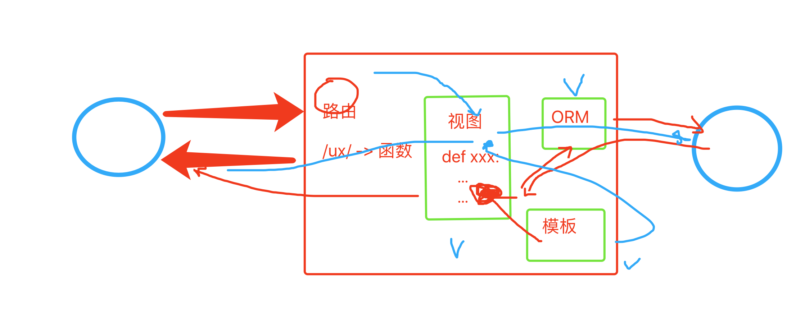
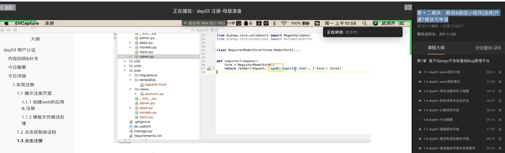

## day11 前端基础

- day11，前端基础 & 认识
- day12，前端进阶


课程目标：前端基础 & 认识

- 前端行业的认知 & 课程设计的相关内容
- 实战案例 & 面试（3个）
- HTML、CSS、JS相关内容，案例：加载、模态框、菜单、TAB切换、返回顶部。


## 1. 行业认知

专业的前端开发：

- 基础入门：HTML、CSS、JavaScript、jQuery、BootStrap【类比python函数、数据类型、模块等】
- 前端分离框架：
  - vue.js
  - react.js
  - angular.js
- 学习app开发：
  - react-native，开发ios和安卓app
  - uni-app，开发ios和安卓app
- 微信小程序开发
  - 微信自己的框架，与vue.js极其相似
- 学习一门后端语言
  - node.js，最简单的。
  - Python
  - Go
  - Java

想往全栈方向发展，侧重点：前端。


对于咱们《Python全栈开发》，侧重点：后端。

- 基础入门：HTML、CSS、JavaScript、jQuery、BootStrap。【第5模块 Web前端开发】 + Django框架 =》 ”简单“的项目。
- vue.js 框架：路飞学城项目。【第9模块 路飞项目】   =》 ”复杂“的项目。
  - vue.js 框架-前端
  - django + drf框架-python
  - 路飞业务（项目）
- 微信小程序开发  【第12模块】

自己就具备自学能力，去搞定 uni-app（建议） 和 react-native。


我给大家的定位：

- 去公司做Python开发

  - 稍微有规模公司，不会让你写前端代码。 

    ```
    前端开发，vue.js
    后端开发，python
    ```

  - 初创型公司

    ```
    vue.js代码
    python后端
    
    - 最开始：前端 + 后端
    -   后来：全能（维护&bug修改）   目前：前端 + 后端 => 3年工作经验
    -   后期：前端 + 后端
    ```

- 接私活赚钱

  - 前端 + 后端：5k、2w、10w
  - app + 前端 + 后端
  - 微信小程序 + 后端


关于直播课：

- day11，前端基础，HTML、CSS、JavaScript、jQuery、BootStrap。
- day12，前端进阶，vue.js、微信小程序


## 2. 快速来一遍

https://pythonav.com/wiki/

- [学前必备](https://pythonav.com/wiki/detail/5/61/) 
- [第一章 HTML](https://pythonav.com/wiki/detail/5/60/) 
- [第二章 CSS（一）](https://pythonav.com/wiki/detail/5/62/) 
- [第三章 CSS（二）](https://pythonav.com/wiki/detail/5/65/) 
- [第四章 JavaScript](https://pythonav.com/wiki/detail/5/63/) 
- [第五章 jQuery](https://pythonav.com/wiki/detail/5/64/) （js的类库，模块：动态功能100行，jQuery=10行 -》 动态效果）
- [第六章 BootStrap](https://pythonav.com/wiki/detail/5/66/) （类库：好看样式 + 现成的功能）


我的学习经历：

- 最开始：HTML、CSS、jQuery（多、杂）
- 独立开发平台：找了一个网站模仿（实现功能为主）  -->  美乐乐 


标准：看到任何网站，利用前端知识就可以开发出一个跟他长得一样的东西。


## 3. 知识点 & 案例


### 3.1 函数

```javascript
// 定义函数
function f1(){
	
}

// 执行函数
f1()
```

```javascript
// 定义函数
var f1 = function(){
    
}

// 执行函数
f1()
```

需求，定义一个函数并且立即去执行这个函数。

```javascript
(function(arg){
    // 函数体
    console.log(arg);
})(123)
```


另外的作用，作用域的划分：

```html
<!DOCTYPE html>
<html lang="en">
<head>
    <meta charset="UTF-8">
    <title>Title</title>
</head>
<body>
<script type="text/javascript">
    (function () {
        var v1 = 123;
        var v2 = 456;

        function f1() {
            console.log(v1);
        }
    })()

    (function () {
        var v1 = 666;
        var v2 = 999;

        function f1() {
            console.log(v1);
        }
    })()

</script>
</body>
</html>
```


### 3.2 js中的作用域

注意：我给你讲的以下知识点不涵盖es6的语法。

1. “JavaScript中无块级作用域”

   ```javascript
   function Main(){
       if(1==1){
           var name = 'seven';
       }
       console.log(name);
   }
   
   Main();
   
   // 输出： seven （Python）
   ```

2. ”JavaScript采用函数作用域“

   ```javascript
   function Main(){
       var innerValue = 'seven';
   }
    
   Main();
    
   console.log(innerValue); // 报错
   ```

3. 关于作用域链

   ```html
   <!DOCTYPE html>
   <html lang="en">
   <head>
       <meta charset="UTF-8">
       <title>Title</title>
   </head>
   <body>
   <script type="text/javascript">
       xo = 'alex';
   
       function Func() {
           // var xo = "seven";
   
           function inner() {
               // var xo = 'alvin';
               console.log(xo);
           }
   
           inner();
       }
   
   	
       Func();
   
   </script>
   </body>
   </html>
   ```

   ```javascript
   xo = 'alex';
    
   function Func(){
       var xo = "seven";
       function inner(){
           console.log(xo);
       }
       return inner;
   }
   var ret = Func();
   ret();
   ```

4. JavaScript的作用域链执行前已创建

   ```javascript
   xo = 'alex';
    
   function Func(){
       var xo = "seven";
       function inner(){
           console.log(xo);
       }
       return inner;
   }
   
   var ret = Func();
   ret();
   ```

   ```javascript
   xo = 'alex';
    
   function Func(){
       var xo = "eirc";
       function inner(){
           console.log(xo);
       }
       xo = 'seven';
       return inner;
   }
    
   var ret = Func();
   ret();
   ```

   ```javascript
   xo = 'alex';
   function Bar(){
       console.log(xo);
   }
    
   function Func(){
       var xo = "seven";
        
       return Bar;
   }
    
   var ret = Func();
   ret();
   ```

5. 声明提前

   ```
   var v1 = 123;
   console.log(v1);
   ```

   ```javascript
   console.log(v1);
   var v1 = 123;
   ```

   ```javascript
   function func(){
       // var v1;
       console.log(v1); // undefined
   	var v1 = 123;
   }
   
   func();
   ```

   

### 3.3 this到底是个啥？

```
function f1(){
	console.log(this); // window
}

f1();
window.f1();
```

```html
<!DOCTYPE html>
<html lang="en">
<head>
    <meta charset="UTF-8">
    <title>Title</title>
</head>
<body>
<script type="text/javascript">
    v1 = "alex"
    function f1() {
        var v1 = "eric";
        console.log(this.v1); // alex
        console.log(v1); // eric
    }
    // window.v1    window.f1
    window.f1();

</script>
</body>
</html>
```

```javascript
(function(){
    console.log(this);
})()
```


```javascript
name = "alex";

info = {
    name:"eric",
    age:123,
    func:function(){
        console.log(this);      // info
        console.log(this.name); // info.name => eric
    }
}

info.func()
```


```javascript
name = "alex";

info = {
    name:"eric",
    age:123,
    func:function(){
        // 作用域，this=info
        console.log(this.name); // info.name => eric
        function f1(){
            // 作用域 this=window
            console.log(this.name); // window.name => alex
        }
        f1(); // window.f1()
    }
}

info.func()

// 函数在执行 window
```

```javascript
name = "alex";

info = {
    name:"eric",
    age:123,
    func:function(){
        // 作用域，this=info
        console.log(this.name); // info.name => eric
        (function(){
	        // 作用域，this=window
            console.log(this.name);  // alex
        })();
    }
}

info.func()

// 函数在执行 window
```

```javascript
name = "alex";

info = {
    name:"eric",
    age:123,
    func:function(){
        // 作用域，this=info;  that = info;
        var that = this;
        (function(){
            // this=window
            console.log(that.name);  // info.name => eric
        })();
    }
}

info.func()

// 函数在执行 window
```

注意：es6语法， let & 箭头函数


### 3.4 闭包

需求来了，假设我给你一个数组。

```
imageList = [
    "https://hcdn2.luffycity.com/media/frontend/public_class/web1@2x(1)_1566529822.6339395.png",
    "https://hcdn2.luffycity.com/media/frontend/public_class/PY1@2x_1566529821.1110113.png",
    "https://hcdn2.luffycity.com/media/frontend/course/小程序列表图.png",
];
```

请读取三个URL并创建3个img标签，将img图片添加到页面中。

```html
<div id='container'>
    
    ...
</div>
```

并且为 img标签绑定点击事件， 点击显示这个URL在列表中的索引位置。


#### 示例1

```
<!DOCTYPE html>
<html lang="en">
<head>
    <meta charset="UTF-8">
    <title>Title</title>
    <style>
        #container img{
            width: 400px;
            margin-left: 20px;
        }
    </style>
</head>
<body>
<div id="container">

</div>

<script type="text/javascript">
    imageList = [
        "https://hcdn2.luffycity.com/media/frontend/public_class/web1@2x(1)_1566529822.6339395.png",
        "https://hcdn2.luffycity.com/media/frontend/public_class/PY1@2x_1566529821.1110113.png",
        "https://hcdn2.luffycity.com/media/frontend/course/小程序列表图.png",
    ];

    function init() {
        for (var i = 0; i < imageList.length; i++) {
            console.log(i); // 0  1   2
            var tag = document.createElement("img"); // 
            tag.src = imageList[i];   // 

            tag.onclick = function(){  // 
                alert(i);
            }

            document.getElementById("container").appendChild(tag);
        }
    }

    init();

</script>
</body>
</html>
```


问题就是：如果定义了函数，函数不执行，函数内容内部代码。


#### 示例2

```html
<!DOCTYPE html>
<html lang="en">
<head>
    <meta charset="UTF-8">
    <title>Title</title>
    <style>
        #container img{
            width: 400px;
            margin-left: 20px;
        }
    </style>
</head>
<body>
<div id="container">

</div>

<script type="text/javascript">
    imageList = [
        "https://hcdn2.luffycity.com/media/frontend/public_class/web1@2x(1)_1566529822.6339395.png",
        "https://hcdn2.luffycity.com/media/frontend/public_class/PY1@2x_1566529821.1110113.png",
        "https://hcdn2.luffycity.com/media/frontend/course/小程序列表图.png",
    ];

    function init() {
        for (var i = 0; i < imageList.length; i++) {
            console.log(i); // 0  1   2
            var tag = document.createElement("img"); // 
            tag.src = imageList[i];   // 

            // 
            tag.onclick = (function (arg) {
                return function () {
                    alert(arg);
                }
            })(i);
            document.getElementById("container").appendChild(tag);
        }
    }

    init();

</script>
</body>
</html>
```


#### 示例3

```html
<!DOCTYPE html>
<html lang="en">
<head>
    <meta charset="UTF-8">
    <title>Title</title>
    <style>
        #container img {
            width: 400px;
            margin-left: 20px;
        }
    </style>
</head>
<body>
<div id="container">

</div>

<script type="text/javascript">
    imageList = [
        "https://hcdn2.luffycity.com/media/frontend/public_class/web1@2x(1)_1566529822.6339395.png",
        "https://hcdn2.luffycity.com/media/frontend/public_class/PY1@2x_1566529821.1110113.png",
        "https://hcdn2.luffycity.com/media/frontend/course/小程序列表图.png",
    ];

    function init() {
        for (var i = 0; i < imageList.length; i++) {
            console.log(i); // 0  1   2
            var tag = document.createElement("img"); // 
            tag.src = imageList[i];   // 
            tag.setAttribute('xx', i);
            tag.onclick = function () {
                // 找到当前点击的标签，获取xx属性。
            }

            document.getElementById("container").appendChild(tag);
        }
    }

    init();

</script>
</body>
</html>
```


## 4.前端案例


### 4.1 返回顶部

- 如何一个固定在屏幕右下角。
- 点击，滚动条到最上面。

```html
<!DOCTYPE html>
<html lang="en">
<head>
    <meta charset="UTF-8">
    <title>Title</title>
</head>
<body>
<div style="height: 2000px;background-color: #ddd"></div>
<div style="height: 2000px;background-color: dodgerblue"></div>

<div onclick="goTop();"
     style="height: 100px;width: 100px;border: 1px solid red; position: fixed;right: 100px;bottom: 200px;">
    返回顶部
</div>

<script src="jquery-1.8.2.min.js"></script>
<script type="text/javascript">
    function goTop() {
        console.log("返回顶部");
        $(window).scrollTop(0);
    }
</script>
</body>
</html>
```


### 4.2 模态框

- 页面的分层：z-index
- 透明度
- 添加 ` display:none`

```html
<!DOCTYPE html>
<html lang="en">
<head>
    <meta charset="UTF-8">
    <title>Title</title>
    <style>
        .hide {
            display: none;
        }
    </style>
</head>
<body>
<div>第一层第一层第一层第一层第一层第一层第一层
    <button onclick="show();">点击</button>
</div>

<div id="v1" class="hide"
     style="position: fixed;left: 0;right: 0;top: 0;bottom: 0;background-color: black;z-index: 1000; opacity: 0.6"></div>

<div id="v2" class="hide"
     style="position: fixed;width:500px;height:300px;background-color: white;z-index: 1001;left: 50%;margin-left: -250px;top:100px;">

    <button onclick="goHide();">点击</button>

</div>
<script src="jquery-1.8.2.min.js"></script>
<script type="text/javascript">

    function show() {
        $("#v1").removeClass("hide");
        $("#v2").removeClass("hide");
    }

    function goHide() {
        $("#v1").addClass("hide");
        $("#v2").addClass("hide");
    }
</script>
</body>
</html>
```


### 4.3 加载框

- 页面的分层：z-index
- 透明度
- 添加 ` display:none`


```html
<!DOCTYPE html>
<html lang="en">
<head>
    <meta charset="UTF-8">
    <title>Title</title>
    <style>
        .hide {
            display: none;
        }
    </style>
</head>
<body>
<div>
    阿斯顿福建；阿可接受的；副科级阿斯蒂芬
    阿斯顿发士大夫IU怕会计法is寄刀片；佛教的说法
    <input type="button" value="发送请求" onclick="sendMessage();"/>
</div>

<div id="v1" class="hide"
     style="position: fixed;left: 0;right: 0;top: 0;bottom: 0;background-color: white;z-index: 1000; opacity: 0.6"></div>

<div id="v2" class="hide"
     style="position: fixed;width:32px;height:32px;background-color: white;z-index: 1001;left: 50%;margin-left: -16px;top:300px;">

    

</div>
<script src="jquery-1.8.2.min.js"></script>
<script type="text/javascript">
    function sendMessage() {

        $("#v1,#v2").removeClass('hide');
        setTimeout(function () {
            $("#v1,#v2").addClass('hide');
        }, 2000)

    }
</script>
</body>
</html>
```


### 4.4 左侧菜单

```html
<!DOCTYPE html>
<html lang="en">
<head>
    <meta charset="UTF-8">
    <title>Title</title>
    <style>
        .head {
            padding: 10px;
            background-color: gold;
            cursor: pointer;
        }

        .content a {
            display: block;
            padding: 5px;
        }

        .hide {
            display: none;
        }
    </style>
</head>
<body>
<div style="width: 20%;height:800px;float: left;background-color:#ddd;">
    <div class="item">
        <div class="head">菜单1</div>
        <div class="content hide">
            <a href="#">功能1</a>
            <a href="#">功能2</a>
            <a href="#">功能3</a>
        </div>
    </div>

    <div class="item">
        <div class="head">菜单2</div>
        <div class="content hide">
            <a href="#">功能1</a>
            <a href="#">功能2</a>
            <a href="#">功能3</a>
        </div>
    </div>

    <div class="item">
        <div class="head">菜单3</div>
        <div class="content hide">
            <a href="#">功能1</a>
            <a href="#">功能2</a>
            <a href="#">功能3</a>
        </div>
    </div>

</div>
<div style="width: 80%;height:800px;float: left;background-color: burlywood;"></div>

<script src="jquery-1.8.2.min.js"></script>
<script type="text/javascript">
    $(function () {
        $(".head").click(function () {
            // $(this).next().removeClass('hide');
            $(this).next().toggleClass('hide');
        });
    })
</script>
</body>
</html>
```


### 4.5 菜单栏切换

```html
<!DOCTYPE html>
<html lang="en">
<head>
    <meta charset="UTF-8">
    <title>Title</title>
    <style>
        body {
            margin: 0 auto;
            font-family: Arial;
            _font-family: 宋体, Arial;
            font-size: 12px;
        }

        body, dl, dt, dd, ul, ol, li, h1, h2, h3, h4, h5, h6, pre, code, form, fieldset, legend, input, button, textarea, p, blockquote, th, td, figure, div {
            margin: 0;
            padding: 0;
        }

        ol, ul, li {
            list-style: none;
        }

        a {
            cursor: pointer;
            text-decoration: none;
        }

        /*a:hover{
            color: #F60 !important;
            text-decoration: underline;
        }*/
        img {
            border: none;
            border-width: 0px;
        }

        table {
            border-collapse: collapse;
            border-spacing: 0;
        }

        .red {
            color: #c00 !important;
        }

        .m8 {
            margin: 8px;
        }

        .mt10 {
            margin-top: 10px;
        }

        .mt20 {
            margin-top: 20px;
        }

        .mr5 {
            margin-right: 5px;
        }

        .ml5 {
            margin-left: 5px;
        }

        .ml10 {
            margin-left: 10px;
        }

        .mb10 {
            margin-bottom: 10px;
        }

        .pt18 {
            padding-top: 18px;
        }

        .pt20 {
            padding-top: 20px;
        }

        .pb20 {
            padding-bottom: 20px;
        }

        .nbr {
            border-right: 0px;
        }

        .font12 {
            font-size: 12px;
        }

        .font14 {
            font-size: 14px;
        }

        .font16 {
            font-size: 16px;
        }

        .bold {
            font-weight: bold;
        }

        .left {
            float: left;
        }

        .right {
            float: right;
        }

        .hide {
            display: none;
        }

        .show {
            display: table;
        }

        .clearfix {
            clear: both;
        }

        .clearfix:after {
            content: ".";
            display: block;
            height: 0;
            clear: both;
            visibility: hidden;
        }

        * html .clearfix {
            zoom: 1;
        }

        .container {
            width: 1190px;
            margin-left: auto;
            margin-right: auto;

        }

        .group-box-1 .title {
            height: 33px;
            line-height: 33px;
            border: 1px solid #DDD;
            background: #f5f5f5;
            padding-top: 0;
            padding-left: 0;

        }

        .group-box-1 .title .title-font {
            display: inline-block;
            font-size: 14px;
            font-family: 'Microsoft Yahei', 'SimHei';
            font-weight: bold;
            color: #333;
            padding-left: 10px;
        }

        .group-box-1 .body {
            border: 1px solid #e4e4e4;
            border-top: none;
        }

        .tab-menu-box1 {
            border: 1px solid #ddd;
            margin-bottom: 20px;
        }

        .tab-menu-box1 .menu {
            line-height: 33px;
            height: 33px;
            background-color: #f5f5f5;
        }

        .tab-menu-box1 .content {
            min-height: 100px;
            border-top: 1px solid #ddd;
            background-color: white;
        }

        .tab-menu-box1 .menu ul {
            padding: 0;
            margin: 0;
            list-style: none;
            /*position: absolute;*/
        }

        .tab-menu-box1 .menu ul li {
            position: relative;
            float: left;
            font-size: 14px;
            font-family: 'Microsoft Yahei', 'SimHei';
            text-align: center;
            font-size: 14px;
            font-weight: bold;
            border-right: 1px solid #ddd;
            padding: 0 18px;
            cursor: pointer;
        }

        .tab-menu-box1 .menu ul li:hover {
            color: #c9033b;
        }

        .tab-menu-box1 .menu .more {
            float: right;
            font-size: 12px;
            padding-right: 10px;
            font-family: "宋体";
            color: #666;
            text-decoration: none;
        }

        .tab-menu-box1 .menu a:hover {
            color: #f60 !important;
            text-decoration: underline;
        }

        .tab-menu-box1 .menu .current {
            margin-top: -1px;
            color: #c9033b;
            background: #fff;
            height: 33px;
            border-top: 2px solid #c9033b;
            z-index: 10;
        }

        .tab-menu-box-2 .float-title {
            display: none;
            top: 0px;
            position: fixed;
            z-index: 50;
        }

        .tab-menu-box-2 .title {
            width: 890px;
            border-bottom: 2px solid #b20101;
            border-left: 1px solid #e1e1e1;
            clear: both;
            height: 32px;
        }

        .tab-menu-box-2 .title a {
            float: left;
            width: 107px;
            height: 31px;
            line-height: 31px;
            font-size: 14px;
            font-weight: bold;
            text-align: center;
            border-top: 1px solid #e1e1e1;
            border-right: 1px solid #e1e1e1;
            /*background: url(/Content/images/bg4.png?3) 0 -308px repeat-x;*/
            text-decoration: none;
            color: #333;
            cursor: pointer;
        }

        .tab-menu-box-2 .title a:hover {
            background-position: -26px -271px;
            text-decoration: none;
            color: #fff;
        }

        .tab-menu-box-2 .content {
            min-height: 100px;
            background-color: white;
        }


        .tab-menu-box3 {
            border: 1px solid #ddd;
        }

        .tab-menu-box3 .menu {
            line-height: 33px;
            height: 33px;
            background-color: #f5f5f5;
        }

        .tab-menu-box3 .content {
            height: 214px;
            border-top: 1px solid #ddd;
            background-color: white;
        }

        .tab-menu-box3 .menu ul {
            padding: 0;
            margin: 0;
            list-style: none;
            /*position: absolute;*/
        }

        .tab-menu-box3 .menu ul li {
            position: relative;
            float: left;
            font-size: 14px;
            font-family: 'Microsoft Yahei', 'SimHei';
            text-align: center;
            font-size: 14px;
            width: 50%;
            cursor: pointer;
        }

        .tab-menu-box3 .menu ul li:hover {
            color: #c9033b;
        }

        .tab-menu-box3 .menu .more {
            float: right;
            font-size: 12px;
            padding-right: 10px;
            font-family: "宋体";
            color: #666;
            text-decoration: none;
        }

        .tab-menu-box3 .menu a:hover {
            color: #f60 !important;
            text-decoration: underline;
            font-weight: bold;
        }

        .tab-menu-box3 .menu .current {

            margin-top: -1px;
            color: #c9033b;
            background: #fff;
            height: 33px;
            border-top: 2px solid #c9033b;
            z-index: 10;
            font-weight: bold;

        }
    </style>
</head>
<body>
<div class='container'>
    <div class='tab-menu-box1'>
        <div class='menu'>
            <ul id='tab-menu-title'>
                <li class='current' content-to='1'>价格趋势</li>
                <li content-to='2'>市场分布</li>
                <li content-to='3'>其他</li>
            </ul>
        </div>

        <div id='tab-menu-body' class='content'>
            <div content='1'>content1</div>
            <div content='2' class='hide'>content2</div>
            <div content='3' class='hide'>content3</div>
        </div>
    </div>
</div>

<script src="jquery-1.8.2.min.js"></script>
<script type='text/javascript'>
    $(function () {
        ChangeTab('#tab-menu-title', '#tab-menu-body');
    })

    function ChangeTab(title, body) {
        $(title).children().bind("click", function () {
            $menu = $(this);
            $content = $(body).find('div[content="' + $(this).attr("content-to") + '"]');
            $menu.addClass('current').siblings().removeClass('current');
            $content.removeClass('hide').siblings().addClass('hide');
        });
    }
</script>
</body>
</html>
```


上述案例都是自己手动写的，你在开发中用到类似于这种功能：

- 自己写？            【其他基础上+加工】 
- 用其他现成的？【优先】


## 5.现成的UI框架

非前后端分离，你们学完django之后，开发非前后端分离项目时候都可以用这些UI来开发。

- bootstrap
- layui
- fineui
- easyui


当你学完vue.js，前后端分离的框架之后：

- elementui
- ant


当你在开发的过程中，发现UI组件能完成80%，其他 10%，需要借助其他组件。 另外的10%自己可以在原有的基础上进行加工和改造。

- 图标
  - http://www.fontawesome.com.cn/faicons/
  - https://www.iconfont.cn/
- 图标
  - https://www.highcharts.com.cn/
  - https://echarts.apache.org/examples/zh/index.html
- 时间选择
  - https://github.com/skedgo/DateTimeRangePicker


对于学习前端的态度：

- 我可以不自己动手写，我的懂。
- 现在开发时，优先选择第三方。


## 6. 忠告

不要在一些无关紧要的事大下功夫。

- 实现功能为主，辅助
- 后端功能 + 后端代码专业度。


正式在公司开发：

- UI，设计页面。
- 前端，HTML、CSS、JS。
- 后端，后端代码。（主）


## 问题

1. 路飞的登录验证码。

   ```
   极验验证，第三方平台。
   ```

2. django 2 还是 3？

   ```
   建议主学：django2，毕业了到公司开发项目django2。
   
   研究下django3，异步的概念（不完整）。
   ```

3. django有些迷糊？
   

4. 上传和下载？

   - 上传。
     - 页面上传的区域，组件。
     - 背后的具体上传动作实现，自己代码写。
   - 下载，文件。（bug管理项目）
     


