# day13 Django（一）

今日概要：

- django与其他框架的对比

- django性能相关

  - 内置
  - 第三方
  - 架构相关

- 实战案例

  - 生产者和消费者

    ```
    用户               网站
    
    用户               网站（生产者）     【任务1,任务2】           脚本（消费者）
    
    案例：实现刷某个视频网站的播放量。
    ```

  - 基于gojs + websocket实现的动态数据展示（代码发布系统）

    - 轮训

    - 长轮训

    - websocket协议（用）

    - 第三方的常见 channels，实现websocket。

      ```
      HTTP协议（无状态的短连接）
      	浏览器客户端							知乎服务端
      					 新连接
      	向知乎发送请求       ->                接收并处理
      	  接收结果          <-                结果返回
      
                            新连接
      	向知乎发送请求       ->                接收并处理
      	  接收结果          <-                结果返回
      	  
      HTTPS协议（无状态的短连接），中间传输的数据都是加密。
      	浏览器客户端							知乎服务端
      					 新连接
      	向知乎发送请求       ->                接收并处理
      	  接收结果          <-                结果返回
      
                            新连接
      	向知乎发送请求       ->                接收并处理
      	  接收结果          <-                结果返回
      	  
      WEBSOCKET协议，建立连接，相互通信（类似于python中socket）。
      	浏览器客户端							知乎服务端
      	 发起连接             ->              接收连接
      	                    之后
      	                    
      例如：聊天室。
      ```

      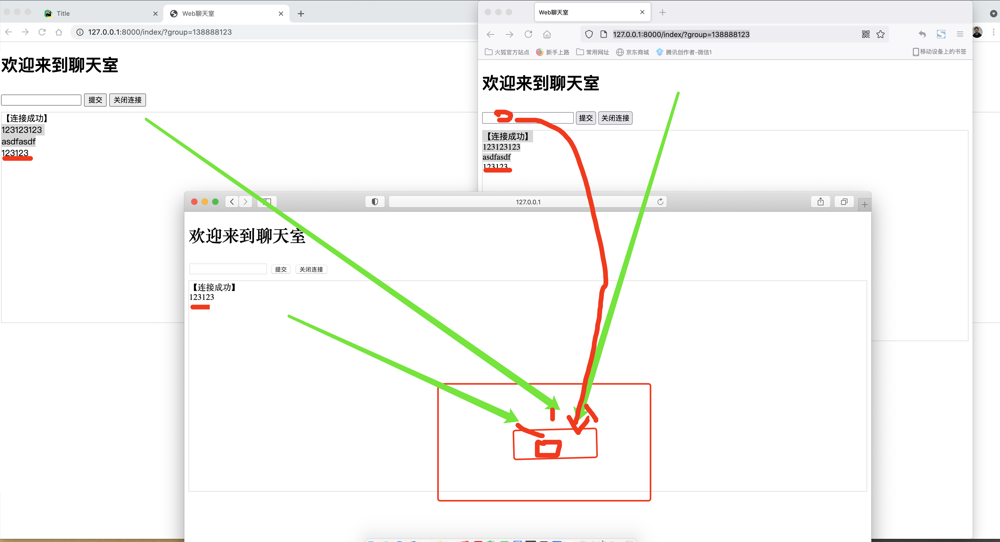

    


## 1.框架对比

- django  vs  flask

  - 底层处理原理：

    - django，传统的传参梳理模式。
    - flask，上下文管理模式。

    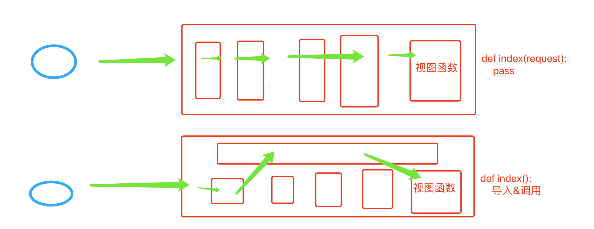

  - 组件

    - django，内部提供了大量的组件。例如：ORM、Form&ModelForm、中间件、分页、缓存、Session、认证模块、amdin管理、contenttypes等...
      - 简单的小网站，很多内置组件就浪费了。
      - 大型点的网站，django + 第三方组件。（自己3个组件）
    - flask，内部提供非常少基础组件。例如：路由、视图、模板处理、session。
      - 简单的小网站，用他的内置组件就可以完成。
      - 大型点的网站，Flask + 第三方组件。 （自己配置13个组件）

    建议：小网站用flask、稍微大型应用django更快（数据库操作 & 用户认证）。


- django vs 异步框架（tornado、sanic、fastapi）

  ```
  不用等待 就可以发第二个请求
  可以支持多用户同时访问
  引用了消息队列吧
  非阻塞
  一般游戏不是用这个异步吗
  ```

  如果你的网站中需要有大量的IO操作，引入异步框架才有意义。

  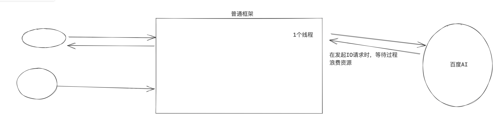

  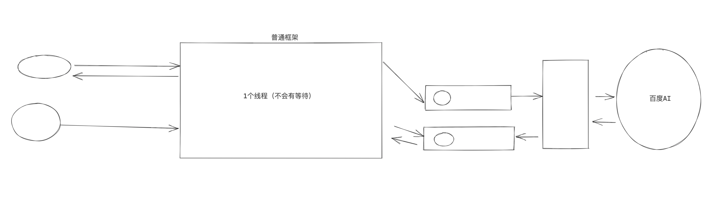

  异步：

  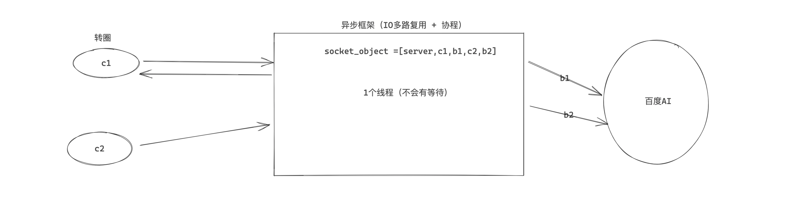
  问题：每个客户端的请求必须是相同的吗？

  注意：django3也在开始支持异步。

  

  为什么有些公司没有IO请求，为什么也用异步框架呢？

  - 数据连接 & 数据库操作
  - redis & 操作redis
  - 但凡设计网络相关，都存在IO请求。

  业内，大家对于异步的开发不是特别熟悉。

  现在：

  - django + celery
    - django处理绝大部分的同步请求。
    - celery 处理局部的IO、计算、其他等占用时间比较久的请求。
  - 异步框架
    - 新公司&大量的IO请求。
    - 异步框架 + celery去解决。

问题：异步框架跟上面普通框架+队列的优势在哪里？感觉client都不会堵塞


## 2.django性能相关

- 增加数据

  ```
  models.Customer.objects.create(参数)
  
  obj= models.Customer(参数)
  obj.save()
  ```

  需求来了，读取文件中10行数据，添加到数据库。

  ```python
  # 用的同一个数据库连接，事务提交了10次
  for i in range(10):
      models.Customer.objects.create(参数)
  ```

  ```python
  # 开始事务  executemany
  models.Customer.objects.bulk_create([
      models.Customer(参数1),
      models.Customer(参数1),
      models.Customer(参数1),
  ],batch_size=10)
  # 提交事务
  ```

  问题：是否看了新录制的mysql第一天的作业。

- 内存代替表关联

  ```python
  class Order(models.Model):
      status_choices = (
          (1, "待执行"),
          (2, "正在执行"),
          (3, "已完成"),
          (4, "失败"),
      )
      status = models.SmallIntegerField(verbose_name="状态", choices=status_choices, default=1)
      site = models.SmallIntegerField(verbose_name="站点", choices=SITE_CHOICES, default=1)
      
  # 缺点：数据无法动态
  # 优点：性能高、速度快。
  ```

  ```python
  class Status(models.Model):
      title = models.CharField(verbose_name="标题",max_length=32)
  
      
  class Order(models.Model):
      status= models.ForeignKey(verbose_name="状态",to="Status",on_delete=models.CASCADE)
      site = models.SmallIntegerField(verbose_name="站点", choices=SITE_CHOICES, default=1)
      
  # 缺点：每次都需要连表，效率低。
  # 优点：status状态是动态
  ```

- 去除约束（外键）

  ```python
  class Status(models.Model):
      title = models.CharField(verbose_name="标题",max_length=32)
  
      
  class Order(models.Model):
      status= models.ForeignKey(verbose_name="状态",to="Status",on_delete=models.CASCADE)
  	oid = models.CharField(verbose_name="订单号", max_length=64, help_text="用户ID+时间戳")
      
  # 内部插入数据时，存在外键约束。
  ```

  ```python
  class Status(models.Model):
      title = models.CharField(verbose_name="标题",max_length=32)
  
      
  class Order(models.Model):
      status= models.ForeignKey(verbose_name="状态",to="Status",on_delete=models.CASCADE,  db_constraint=False )
  	oid = models.CharField(verbose_name="订单号", max_length=64, help_text="用户ID+时间戳")
      
  # status不会在数据库中创建外键约束，但依然可以在django使用status字段进行连表操作。
  ```

- select_related主动连表（FK）

  ```python
  class Status(models.Model):
      title = models.CharField(verbose_name="标题",max_length=32)
  
      
  class Order(models.Model):
      status= models.ForeignKey(verbose_name="状态",to="Status",on_delete=models.CASCADE)
      xxx = 
  	oid = models.CharField(verbose_name="订单号", max_length=64, help_text="用户ID+时间戳")
  ```

  ```python
  # select * from order  5条数据
  result = models.Order.objects.all()
  for row in result:
      print(row.oid)
      print(row.status.title)  # select title from status where id=1
  # 所以，上述过程执行 6次 数据库查询。
  ```

  ```python
  # select * from order left join status ....
  result = models.Order.objects.select_related("status",) # 主动连表
  for row in result:
      print(row.oid)
      print(row.status.title)
  # 所以，上述过程执行 1次 数据库查询。
  ```

- prefetch_related多次请求（只获取必备关联数据）（m2m）

  ```python
  class Status(models.Model):
      title = models.CharField(verbose_name="标题",max_length=32)
  
      
  class Order(models.Model):
      status= models.ForeignKey(verbose_name="状态",to="Status",on_delete=models.CASCADE)
  	oid = models.CharField(verbose_name="订单号", max_length=64, help_text="用户ID+时间戳")
  ```

  ```python
  # 第一次：select * from order where id>5，
  # 第二次：内部将上一步查询的数据 status_id 汇总起来。 [1,2,3]
  #        select * from status where id in [1,2,3]
  result = models.Order.objects.filter(id__gt=5).prefetch_related("status")
  for row in result:
      print(row.oid)
      print(row.status.title)
  ```

- 数据库连接池

  - 默认不支持数据库连接池。

    ```
    为一个请求（一个线程）创建一个数据库的连接。
    django内部处理业务的线程，会重用数据库连接。
    ```

    ```python
     DATABASES = {
         "default": {
             "ENGINE": "...",
             "NAME": "...",
             "CONN_MAX_AGE": 60, # 默认值0，60秒 每个线程持有连接的时间，过期后重建简历连接。
         }
     }
    ```

    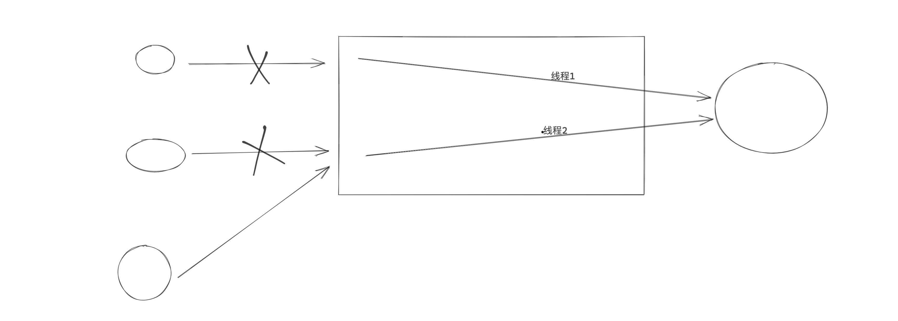
    注意：DBUtils数据库连接池。

  - 第三方支持数据库连接池

    ```python
    pip install django-db-connection-pool
    
    注意：依赖SQLAlchemy里面连接池，少量代码的衔接。
    ```

    ```python
    DATABASES = {
        "default": {
            'ENGINE': 'dj_db_conn_pool.backends.mysql',   # 1. 数据库连接池需修改
            'NAME': 'video_killer',
            'HOST': '127.0.0.1',
            'PORT': 3306,
            'USER': 'root',
            'PASSWORD': 'root123',
            'POOL_OPTIONS': {            # 2.连接池的参数
                'POOL_SIZE': 10,  # 最小连接数
                'MAX_OVERFLOW': 10  # 在最小的基础上，还可以增加10个，即：最大20个
            }
        }
    }
    ```

    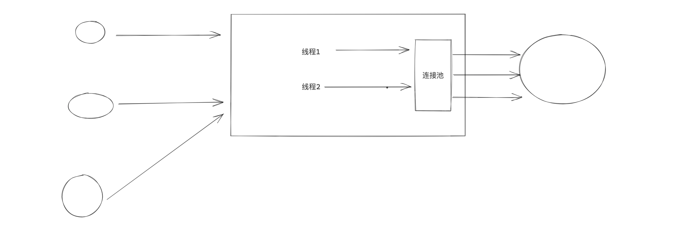

    问题：django线程连接数最大怎么配置？

    ```
    以UWSGI为例：
    ```

    ```ini
    [uwsgi]
    socket = 127.0.0.1:8080
    chdir = /data/pythonav-web/pythonav/
    wsgi-file = pythonav/wsgi.py
    processes = 4
    threads = 10
    virtualenv = /envs/pythonav/
    ```

  - django的缓存
    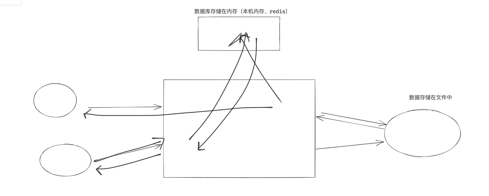

    ```
    pip install django_redis
    ```

    ```python
    # settings.py 
    CACHES = {
        "default": {
            "BACKEND": "django_redis.cache.RedisCache",  # redis
            "LOCATION": "redis://127.0.0.1:6379",
            "OPTIONS": {
                "CLIENT_CLASS": "django_redis.client.DefaultClient",
                "CONNECTION_POOL_KWARGS": {"max_connections": 100}
                # "PASSWORD": "密码",
            }
        }
    }
    ```

    ```python
    # views.py
    from django.shortcuts import HttpResponse
    from django.views.decorators.cache import cache_page
    
    @cache_page(60 * 15)
    def index(request):
        # 连接数据库
        return HttpResponse("....")
    
    # 第一次，在浏览器上访问 /index/  
    # 第二次：在浏览器上访问 /index/，直接从缓存中获取数据。
    ```

    所以，接下来为了简化，不再使用redis来演示。以文件为例：

    ```python
    CACHES = {
        'default': {
            'BACKEND': 'django.core.cache.backends.filebased.FileBasedCache',
            'LOCATION': '/var/tmp/django_cache', # 文件路径
        }
    }
    ```

    - 视图级别

      ```python
      # urls.py
      
      from django.contrib import admin
      from django.urls import path, re_path
      from web import views
      
      urlpatterns = [
          path('admin/', admin.site.urls),
          re_path(r'index/', views.index),
          re_path(r'old/', views.old),
      ]
      ```

      ```python
      # views.py
      from django.shortcuts import render, HttpResponse
      from django.views.decorators.cache import cache_page
      from web import models
      import datetime
      
      
      def index(request):
          ctime = datetime.datetime.now().strftime("%Y-%m-%d %H:%M:%S")
          return HttpResponse(ctime)
      
      
      @cache_page(10)
      def old(request):
          ctime = datetime.datetime.now().strftime("%Y-%m-%d %H:%M:%S")
          return HttpResponse(ctime)
      
      ```

    - 局部模板级别

      ```python
      # url.py
      from django.contrib import admin
      from django.urls import path, re_path
      from web import views
      
      urlpatterns = [
          re_path(r'part/', views.part),
      ]
      ```

      ```python
      # views.py
      from django.shortcuts import render, HttpResponse
      from django.views.decorators.cache import cache_page
      from web import models
      import datetime
      
      def part(request):
          ctime = datetime.datetime.now().strftime("%Y-%m-%d %H:%M:%S")
      
          return render(request, 'part.html', {'ctime': ctime})
      
      ```

      ```html
      
      <!DOCTYPE html>
      <html lang="en">
      <head>
          <meta charset="UTF-8">
          <title>Title</title>
      </head>
      <body>
      <h1>原数据</h1>
      {{ ctime }}
      
      <h1>缓存数据</h1>
      
          {{ ctime }}
      
      
      </body>
      </html>
      ```


## 3.架构的设计

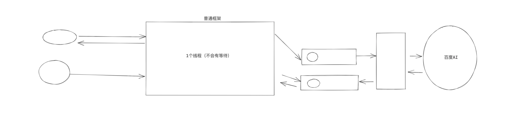

需要根据公司业务场景 & 情况，综合决定选择哪种架构。

- 案例1：播放量
- 案例2：websocket


### 3.1 刷某网站播放量

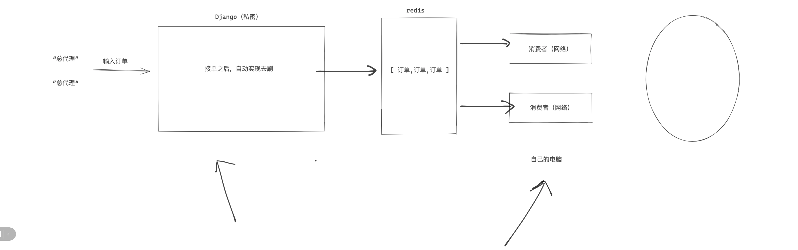

#### 3.1.1 平台


##### 1.表结构设计

```python
from django.db import models


class Administrator(models.Model):
    """ 管理员表 """
    type_choices = (
        (1, "管理员"),
        (2, "超级管理员"),
    )
    user_type = models.SmallIntegerField(verbose_name="用户类型", choices=type_choices, default=1)

    username = models.CharField(verbose_name="用户名", max_length=32, db_index=True)
    password = models.CharField(verbose_name="密码", max_length=64)
    mobile = models.CharField(verbose_name="手机号", max_length=11, null=True, blank=True, db_index=True)

    # true,激活
    # false，已删除
    active = models.BooleanField(verbose_name="是否激活", default=True, help_text="False表示删除")


class Customer(models.Model):
    """ 客户 """
    username = models.CharField(verbose_name="用户名", max_length=32, db_index=True)
    password = models.CharField(verbose_name="密码", max_length=64)
    balance = models.DecimalField(verbose_name="账户余额", default=0, max_digits=10, decimal_places=2)

    creator = models.ForeignKey(verbose_name="创建者", to="Administrator", on_delete=models.CASCADE)
    create_date = models.DateTimeField(verbose_name="创建日期", auto_now_add=True)
    active = models.BooleanField(verbose_name="是否激活", default=True, help_text="False表示删除")


class ChargeRecord(models.Model):
    """ 充值记录 """
    amount = models.DecimalField(verbose_name="充值金额", default=0, max_digits=10, decimal_places=2)
    customer = models.ForeignKey(verbose_name="客户", to="Customer", on_delete=models.CASCADE)
    creator = models.ForeignKey(verbose_name="管理员", to="Administrator", on_delete=models.CASCADE)
    create_date = models.DateTimeField(verbose_name="充值时间", auto_now_add=True)


class PricePolicy(models.Model):
    """ 价格策略
    10000    5
    20000    9
    30000    13
    """
    count = models.IntegerField(verbose_name="数量")
    price = models.DecimalField(verbose_name="价格", default=0, max_digits=10, decimal_places=2)


class Order(models.Model):
    """ 订单，创建好之后放在redis的队列中（生产者 & 消费者） """
    status_choices = (
        (1, "待执行"),
        (2, "正在执行"),
        (3, "已完成"),
        (4, "失败"),
    )
    status = models.SmallIntegerField(verbose_name="状态", choices=status_choices, default=1)

    oid = models.CharField(verbose_name="订单号", max_length=64, help_text="用户ID+时间戳")
    url = models.URLField(verbose_name="视频地址")

    # 疑问，FK和PricePolicy关联是不是会更好？
    count = models.IntegerField(verbose_name="数量")
    price = models.DecimalField(verbose_name="价格", default=0, max_digits=10, decimal_places=2)

    old_view_count = models.IntegerField(verbose_name="原播放量", default=0)

    customer = models.ForeignKey(verbose_name="客户", to="Customer", on_delete=models.CASCADE)
    memo = models.TextField(verbose_name="备注", null=True, blank=True)
```


##### 2.离线脚本初始化

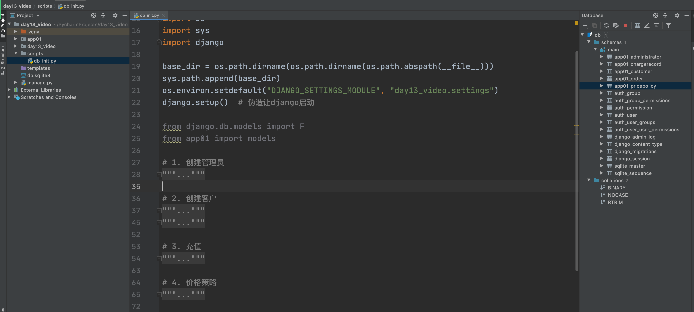


例如：以后你们在做项目交付时，如果涉及到初始用户，就可以用脚本来实现。


##### 3.订单的功能

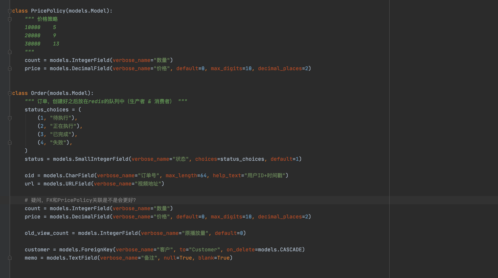

功能明细：

- 订单列表，读取当前登录用创建的所有的订单。

  ```
  登录用户的id，即：customer_id=1 （alex）
  
  data_list = models.Order.objects.filter(customer_id=1).order_by("-id"); 
  
  在页面上展示订单信息。
  ```

- 创建订单，让用户输入一些基本信息。

  ```
  提交数据之后：
  	- 将数据写到数据库中 订单表中
  	- 订单信息放在redis中（队列）
  ```

  

问题：

1. 假如redis没有集群单台服务器挂了，内存上数据没了，是需要重新把数据全部加载到redis上吗，然后消费者那边是重新需要拿数据吗。
2. 那消费者服务挂了，那消费者那边需要做些什么。
   - redis的列表充当消息队列，没有这种机制。
   - rabbitMQ

#### 3.1.2 刷播放

- 死循环，队列中获取订单。

  ```
  import redis
  
  conn = redis.Redis(host='127.0.0.1', port=6379, password="qwe123")
  
  while True:
      # 消费者，去队列中获取数据，如果没有任务默认是返回 None
      item = conn.brpop("video_order_list")
      print(item) # 获取到订单ID
  ```

- 根据ID将订单的状态更新：status=2，正在执行中 & 获取现有播放量更新。

- 根据ID去数据库中查询得到：url、count，根据此信息让爬虫取爬取数据。

  ```python
  url = "https://w.yangshipin.cn/video?type=0&vid=s000034o5z2"
  run(url)
  ```

- ...

- 执行完成之后，需要根据ID进行相应的更新，status=3，已完成。


注意：关于连接数据库 or Redis，可以直接通过账户去连接。


#### 刷播放优化：

- 线程池，来做的爬虫（线程在IO等待时没有被充分利用）

- 协程，线程 + 协程。

  ```
  50个线程
  	10个协程
  	
  --> 50*10=500
  ```

  ```python
  async def handler(video_url):
      # 协程去爬取数据
          
  async def engine(video_url):
      # 创建的10个协程
      tasks = [
          asyncio.create_task(handler(video_url)) for _ in range(10)
      ]
      await asyncio.wait(tasks)
  
  def task(video_url):
      # 一个线程
      asyncio.run(   engine(video_url)   )
  
  def run():
      video_url = "https://m.yangshipin.cn/video?type=0&vid=y000088hru8"
  	
      # 将10000个任务交给线程池，让线程池取处理。
      # 线程池中最多创建50个线程。
      pool = ThreadPoolExecutor(50) # 线程池中线程最多50个
      for i in range(10000/10):
          pool.submit(task, video_url)
      pool.shutdown()
  
  if __name__ == '__main__':
      run()
  ```

  

答疑：协程不是特殊的线程（非阻塞）吗？线程还能创建协程？

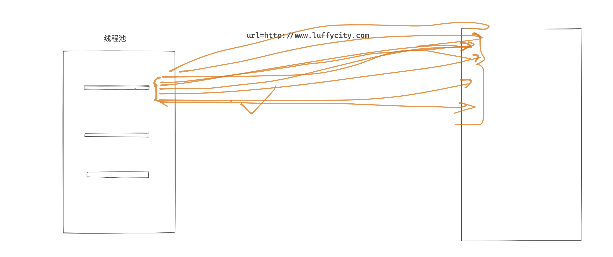


### 3.2 Websocket

- 轮训
- 长轮训
- Websocket
- django channels
- 案例：聊天室案例
- 案例：gojs + websocket 审批流

参考文档：

websocket：https://www.cnblogs.com/wupeiqi/p/6558766.html

go.js： https://www.cnblogs.com/wupeiqi/articles/11978547.html

channels：https://www.cnblogs.com/wupeiqi/articles/9593858.html


## 问题：

1. 老师请教一个问题，网络请求在django中是一个个的处理吗？从路由到中间件到视图。
   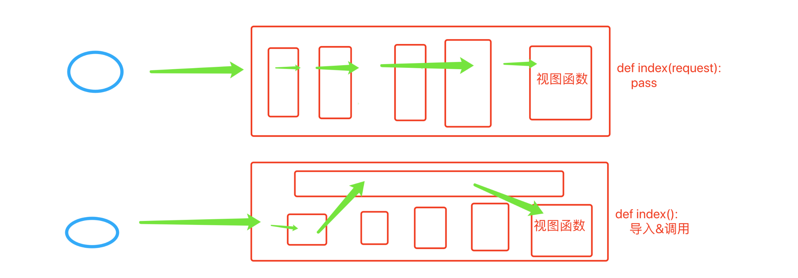
2. 还有一个问题，用models创建表的时候生成很多其它的表，那些表的含义从哪可以学习以下它的应用。
   思考：我们创建app，app中model里面编写了表。（app不注册）
   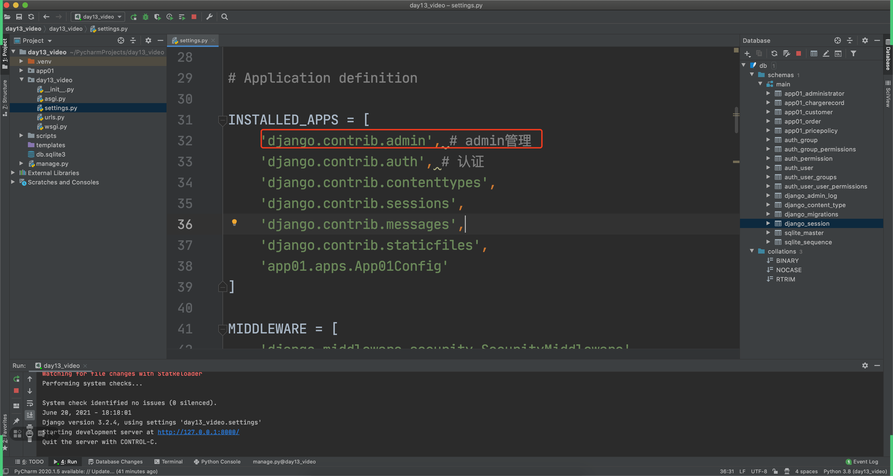
3. 有个问题，现在用django API 是用JsonResponse返回? 还是要用drf？
   - django框架，可以实现写rest api。【自己玩】
   - drf组件，写rest api: django+ drf 。【工作推荐】


