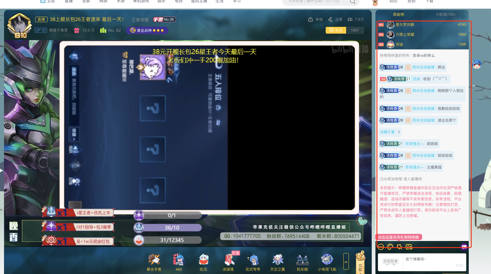
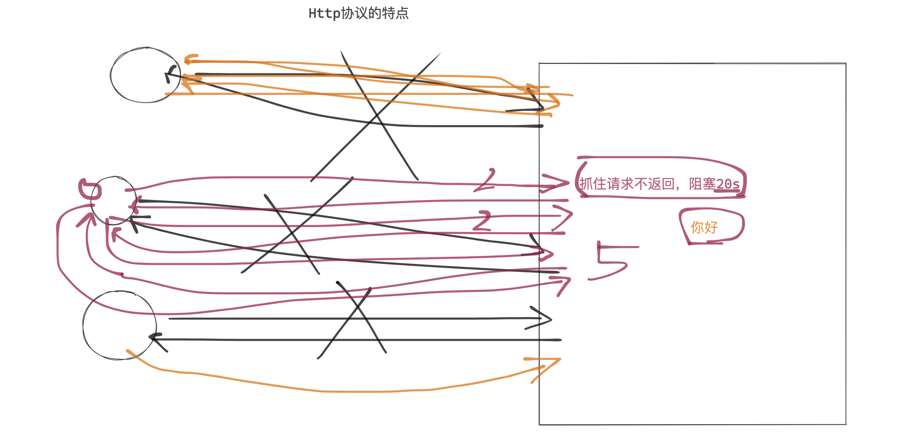
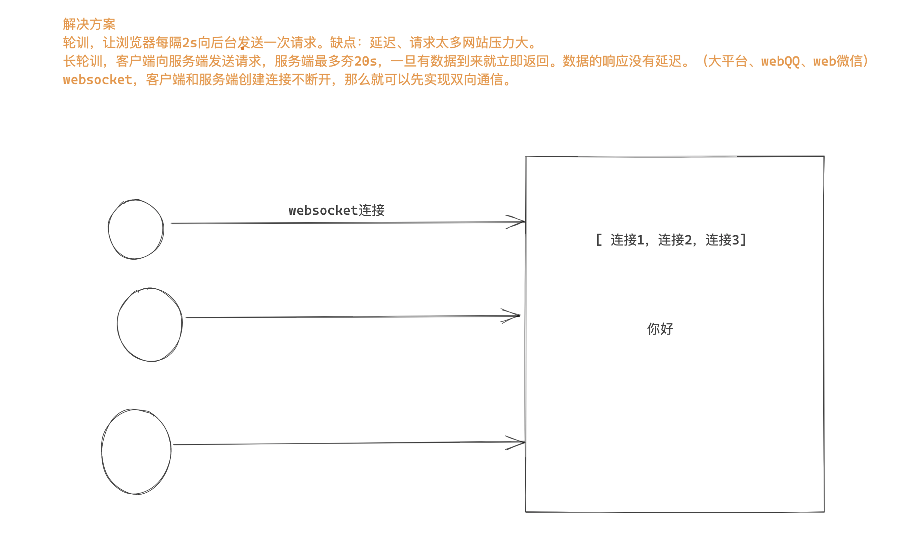
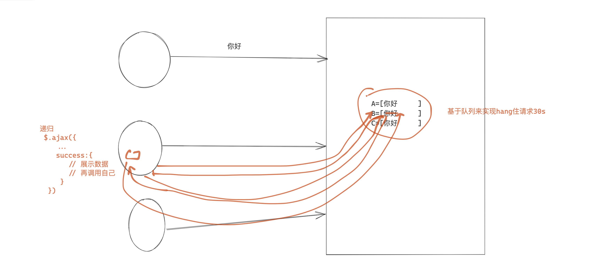
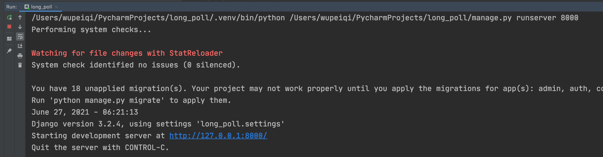
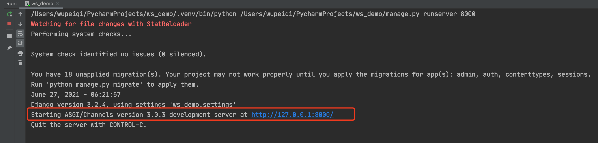

# day14 django（二)

今日概要：

- websocket & 聊天室的案例。
- websocket & gojs & 审批流的案例
- django核心的组件


## 1.websocket相关

请帮助我实现一个系统：20个用户同时打开网站，呈现出来的就是群聊。

- 我，你好
- 张坤
- 付乐乐
- 贾文龙
- ...










### 1.1 轮询

- 访问 /home/ 显示的聊天室界面。
- 点击发送内容，数据也可以发送到后台。
- 定时获取消息，然后再界面上展示。


### 1.2 长轮询



- 访问 /home/ 显示的聊天室界面。 + 每个用户创建一个队列。
- 点击发送内容，数据也可以发送到后台。+ 扔到每个人的队列中
- 递归获取消息，去自己的队列中获取数据， 然后再界面上展示。


问题：

- 服务端持有这个连接，压力是否会很大？

  ```
  如果即基于IO多复用 + 异步。
  ```

- 100线程，同时100个用户的请求。（15分钟）

- 为什么一个用户一个队列。

  - 示例：每个用户一个队列。

    ```
    队列   A
    队列	 B
    队列	 C
    ```

  - redis发布和订阅

    ```
                  					A,1
    发消息           [1]  			  B,1       
                  				    C,1
    ```


### 1.3 websocket

websocket，web版的 socket。

原来Web中：

- http协议，无状态&短连接。
  - 客户端主动连接服务端。
  - 客户端向服务端发送消息，服务端接收到返回数据。
  - 客户端接收到数据。
  - 断开连接。	
- https一些 + 对数据进行加密。

我们在开发过程中想要保留一些状态信息，基于Cookie来做。


现在支持：

- http协议，一次请求一次响应。
- websocket协议，创建连持久的连接不断开，基于这个连接可以进行收发数据。【服务端向客户端主动推送消息】
  - web聊天室
  - 实时图表，柱状图、饼图（Highcharts）


#### 1.3.1 WebSocket原理

- http协议

  - 连接
  - 数据传输
  - 断开连接

- websocket协议，是建立在http协议之上的。

  - 连接，客户端发起。

  - 握手（验证），客户端发送一个消息，后端接收到消息再做一些特殊处理并返回。 服务端支持websocket协议。

    - 客户端向服务端发送

      ```
      GET /chatsocket HTTP/1.1
      Host: 127.0.0.1:8002
      Connection: Upgrade
      Pragma: no-cache
      Cache-Control: no-cache
      Upgrade: websocket
      Origin: http://localhost:63342
      Sec-WebSocket-Version: 13
      Sec-WebSocket-Key: mnwFxiOlctXFN/DeMt1Amg==
      Sec-WebSocket-Extensions: permessage-deflate; client_max_window_bits
      ...
      ...
      \r\n\r\n
      ```

    - 服务端接收

      ```
      mnwFxiOlctXFN/DeMt1Amg== 与 magic string 进行拼接。
      magic string = "258EAFA5-E914-47DA-95CA-C5AB0DC85B11"
      
      v1 = "mnwFxiOlctXFN/DeMt1Amg==" + "258EAFA5-E914-47DA-95CA-C5AB0DC85B11"
      v2 = hmac1(v1)
      v3 = base64(v2)
      ```

      ```
      HTTP/1.1 101 Switching Protocols
      Upgrade:websocket
      Connection: Upgrade
      Sec-WebSocket-Accept: 密文
      ```

  - 收发数据（加密）

    ```
    b"adasdjf;akjdfp;iujas;ldkjfpaisudflkasjd;fkjas;dkjf;aksjdf;ajksd;fjka;sdijkf"
    ```

    - 先获取第2个字节，8位。 		10001010

    - 再获取第二个字节的后7位。      0001010  ->  payload len

      -   =127，2字节，8个字节，       其他字节（4字节 masking key + 数据）。
      -   =126，2字节，2个字节，       其他字节（4字节 masking key + 数据）。
      - <=125，2字节，                        其他字节（4字节 masking key + 数据）。

    - 获取masking key，然后对数据进行解密

      ```
      var DECODED = "";
      for (var i = 0; i < ENCODED.length; i++) {
          DECODED[i] = ENCODED[i] ^ MASK[i % 4];
      }
      ```

  - 断开连接。


#### 1.3.2 django框架

django默认不支持websocket，需要安装组件：

```
pip install channels
```


配置：

- 注册channels 

  ```python
  INSTALLED_APPS = [
      'django.contrib.admin',
      'django.contrib.auth',
      'django.contrib.contenttypes',
      'django.contrib.sessions',
      'django.contrib.messages',
      'django.contrib.staticfiles',
      'channels',
  ]
  ```

- 在settings.py中添加 asgi_application

  ```python
  ASGI_APPLICATION = "ws_demo.asgi.application"
  ```

- 修改asgi.py文件

  ```python
  import os
  from django.core.asgi import get_asgi_application
  from channels.routing import ProtocolTypeRouter, URLRouter
  
  from . import routing
  
  os.environ.setdefault('DJANGO_SETTINGS_MODULE', 'ws_demo.settings')
  
  # application = get_asgi_application()
  
  application = ProtocolTypeRouter({
      "http": get_asgi_application(),
      "websocket": URLRouter(routing.websocket_urlpatterns),
  })
  
  ```

- 在settings.py的同级目录创建 routing.py 

  ```python
  from django.urls import re_path
  
  from app01 import consumers
  
  websocket_urlpatterns = [
      re_path(r'ws/(?P<group>\w+)/$', consumers.ChatConsumer.as_asgi()),
  ]
  ```

- 在app01目录下创建 consumers.py，编写处理处理websocket的业务逻辑。

  ```python
  from channels.generic.websocket import WebsocketConsumer
  from channels.exceptions import StopConsumer
  
  
  class ChatConsumer(WebsocketConsumer):
      def websocket_connect(self, message):
          # 有客户端来向后端发送websocket连接的请求时，自动触发。
          # 服务端允许和客户端创建连接。
          self.accept()
  
      def websocket_receive(self, message):
          # 浏览器基于websocket向后端发送数据，自动触发接收消息。
          print(message)
          self.send("不要回复不要回复")
          # self.close()
  
      def websocket_disconnect(self, message):
          # 客户端与服务端断开连接时，自动触发。
          print("断开连接")
          raise StopConsumer()
  ```

  

在django中你要了解的：

- wsgi，在以前你们学习django时，都是用的wsgi。
  

- asgi，wsgi+异步+websocket。
  

  - http

    ```
    urls.py
    views.py
    ```

  - websocket

    ```
    routings.py
    consumers.py
    ```


#### 1.3.3 聊天室

- 访问地址看到聊天室的页面，http请求。

- 让客户端主动向服务端发起websocket连接，服务端接收到连接后通过（握手）。

  - 客户端，websocket。

    ```
    socket = new WebSocket("ws://127.0.0.1:8000/room/123/");
    ```

  - 服务端

    ```python
    from channels.generic.websocket import WebsocketConsumer
    from channels.exceptions import StopConsumer
    
    
    class ChatConsumer(WebsocketConsumer):
        def websocket_connect(self, message):
            print("有人来连接了...")
            # 有客户端来向后端发送websocket连接的请求时，自动触发。
            # 服务端允许和客户端创建连接（握手）。
            self.accept()
    ```

- 收发消息（客户端向服务端发消息）

  - 客户端

    ```html
    <div>
        <input type="text" placeholder="请输入" id="txt">
        <input type="button" value="发送" onclick="sendMessage()">
    </div>
    
    <script>
        socket = new WebSocket("ws://127.0.0.1:8000/room/123/");
        
        function sendMessage() {
            let tag = document.getElementById("txt");
            socket.send(tag.value);
        }
    
    </script>
    ```

  - 服务端

    ```python
    from channels.generic.websocket import WebsocketConsumer
    from channels.exceptions import StopConsumer
    
    
    class ChatConsumer(WebsocketConsumer):
        def websocket_connect(self, message):
            print("有人来连接了...")
            # 有客户端来向后端发送websocket连接的请求时，自动触发。
            # 服务端允许和客户端创建连接（握手）。
            self.accept()
    
        def websocket_receive(self, message):
            # 浏览器基于websocket向后端发送数据，自动触发接收消息。
            text = message['text'] # {'type': 'websocket.receive', 'text': '阿斯蒂芬'}
            print("接收到消息-->", text)
    ```

- 收发消息（服务端主动发给客户端）

  - 服务端

    ```python
    from channels.generic.websocket import WebsocketConsumer
    from channels.exceptions import StopConsumer
    
    
    class ChatConsumer(WebsocketConsumer):
        def websocket_connect(self, message):
            print("有人来连接了...")
            # 有客户端来向后端发送websocket连接的请求时，自动触发。
            # 服务端允许和客户端创建连接（握手）。
            self.accept()
    
            # 服务端给客户端发送消息
            self.send("来了呀客官")
    ```

  - 客户端

    ```html
    <!DOCTYPE html>
    <html lang="en">
    <head>
        <meta charset="UTF-8">
        <title>Title</title>
        <style>
            .message {
                height: 300px;
                border: 1px solid #dddddd;
                width: 100%;
            }
        </style>
    </head>
    <body>
    <div class="message" id="message"></div>
    <div>
        <input type="text" placeholder="请输入" id="txt">
        <input type="button" value="发送" onclick="sendMessage()">
    </div>
    
    <script>
        // http://www.baidu.com
        // ws://www.baidu.com
        socket = new WebSocket("ws://127.0.0.1:8000/room/123/");
    
        // 当websocket接收到服务端发来的消息时，自动会触发这个函数。
        socket.onmessage = function (event) {
            console.log(event.data);
        }
    
        function sendMessage() {
            let tag = document.getElementById("txt");
            socket.send(tag.value);
        }
    
    </script>
    
    </body>
    </html>
    
    ```

    


整合在一起：

前端：

```html
<!DOCTYPE html>
<html lang="en">
<head>
    <meta charset="UTF-8">
    <title>Title</title>
    <style>
        .message {
            height: 300px;
            border: 1px solid #dddddd;
            width: 100%;
        }
    </style>
</head>
<body>
<div class="message" id="message"></div>
<div>
    <input type="text" placeholder="请输入" id="txt">
    <input type="button" value="发送" onclick="sendMessage()">
    <input type="button" value="关闭连接" onclick="closeConn()">
</div>

<script>

    socket = new WebSocket("ws://127.0.0.1:8000/room/123/");

    // 创建好连接之后自动触发（ 服务端执行self.accept() )
    socket.onopen = function (event) {
        let tag = document.createElement("div");
        tag.innerText = "[连接成功]";
        document.getElementById("message").appendChild(tag);
    }

    // 当websocket接收到服务端发来的消息时，自动会触发这个函数。
    socket.onmessage = function (event) {
        let tag = document.createElement("div");
        tag.innerText = event.data;
        document.getElementById("message").appendChild(tag);
    }

    // 服务端主动断开连接时，这个方法也被触发。
    socket.onclose = function (event) {
        let tag = document.createElement("div");
        tag.innerText = "[断开连接]";
        document.getElementById("message").appendChild(tag);
    }

    function sendMessage() {
        let tag = document.getElementById("txt");
        socket.send(tag.value);
    }

    function closeConn() {
        socket.close(); // 向服务端发送断开连接的请求
    }

</script>

</body>
</html>

```


```python
from channels.generic.websocket import WebsocketConsumer
from channels.exceptions import StopConsumer


class ChatConsumer(WebsocketConsumer):
    def websocket_connect(self, message):
        print("有人来连接了...")
        # 有客户端来向后端发送websocket连接的请求时，自动触发。
        # 服务端允许和客户端创建连接（握手）。
        self.accept()

        # 服务端给客户端发送消息
        # self.send("来了呀客官")

    def websocket_receive(self, message):
        # 浏览器基于websocket向后端发送数据，自动触发接收消息。
        text = message['text']  # {'type': 'websocket.receive', 'text': '阿斯蒂芬'}
        print("接收到消息-->", text)

        if text == "关闭":
            # 服务端主动关闭连接，给客户端发送一条断开连接的消息。
            self.close()
            # raise StopConsumer() # 如果服务端断开连接时，执行 StopConsumer异常，那么websocket_disconnect方法不再执行。
            return

        res = "{}SB".format(text)
        self.send(res)

    def websocket_disconnect(self, message):
        print("断开连接了")
        raise StopConsumer()

```


#### 小结

基于django实现websocket请求，但只能对某个人进行处理。


#### 1.3.4 群聊（一）

- 前端代码

  ```html
  <!DOCTYPE html>
  <html lang="en">
  <head>
      <meta charset="UTF-8">
      <title>Title</title>
      <style>
          .message {
              height: 300px;
              border: 1px solid #dddddd;
              width: 100%;
          }
      </style>
  </head>
  <body>
  <div class="message" id="message"></div>
  <div>
      <input type="text" placeholder="请输入" id="txt">
      <input type="button" value="发送" onclick="sendMessage()">
      <input type="button" value="关闭连接" onclick="closeConn()">
  </div>
  
  <script>
  
      socket = new WebSocket("ws://127.0.0.1:8000/room/123/");
  
      // 创建好连接之后自动触发（ 服务端执行self.accept() )
      socket.onopen = function (event) {
          let tag = document.createElement("div");
          tag.innerText = "[连接成功]";
          document.getElementById("message").appendChild(tag);
      }
  
      // 当websocket接收到服务端发来的消息时，自动会触发这个函数。
      socket.onmessage = function (event) {
          let tag = document.createElement("div");
          tag.innerText = event.data;
          document.getElementById("message").appendChild(tag);
      }
  
      // 服务端主动断开连接时，这个方法也被触发。
      socket.onclose = function (event) {
          let tag = document.createElement("div");
          tag.innerText = "[断开连接]";
          document.getElementById("message").appendChild(tag);
      }
  
      function sendMessage() {
          let tag = document.getElementById("txt");
          socket.send(tag.value);
      }
  
      function closeConn() {
          socket.close(); // 向服务端发送断开连接的请求
      }
  
  </script>
  
  </body>
  </html>
  
  ```

- 后端

  ```python
  from channels.generic.websocket import WebsocketConsumer
  from channels.exceptions import StopConsumer
  
  CONN_LIST = []
  
  
  class ChatConsumer(WebsocketConsumer):
      def websocket_connect(self, message):
          print("有人来连接了...")
          # 有客户端来向后端发送websocket连接的请求时，自动触发。
          # 服务端允许和客户端创建连接（握手）。
          self.accept()
  
          CONN_LIST.append(self)
  
      def websocket_receive(self, message):
          # 浏览器基于websocket向后端发送数据，自动触发接收消息。
          text = message['text']  # {'type': 'websocket.receive', 'text': '阿斯蒂芬'}
          print("接收到消息-->", text)
          res = "{}SB".format(text)
          for conn in CONN_LIST:
              conn.send(res)
  
      def websocket_disconnect(self, message):
          CONN_LIST.remove(self)
          raise StopConsumer()
  ```

  

#### 1.3.5 群聊（二）

基于channels中提供channel layers来实现。

- setting中配置。

  ```python
  CHANNEL_LAYERS = {
      "default": {
          "BACKEND": "channels.layers.InMemoryChannelLayer",
      }
  }
  ```

  ```
  pip3 install channels-redis
  ```

  ```python
  CHANNEL_LAYERS = {
      "default": {
          "BACKEND": "channels_redis.core.RedisChannelLayer",
          "CONFIG": {
              "hosts": [('10.211.55.25', 6379)]
          },
      },
  }
  ```

- consumers中特殊的代码。

  ```python
  from channels.generic.websocket import WebsocketConsumer
  from channels.exceptions import StopConsumer
  from asgiref.sync import async_to_sync
  
  
  class ChatConsumer(WebsocketConsumer):
      def websocket_connect(self, message):
          # 接收这个客户端的连接
          self.accept()
  
          # 获取群号，获取路由匹配中的
          group = self.scope['url_route']['kwargs'].get("group")
  
          # 将这个客户端的连接对象加入到某个地方（内存 or redis）
          async_to_sync(self.channel_layer.group_add)(group, self.channel_name)
  
      def websocket_receive(self, message):
          group = self.scope['url_route']['kwargs'].get("group")
  
          # 通知组内的所有客户端，执行 xx_oo 方法，在此方法中自己可以去定义任意的功能。
          async_to_sync(self.channel_layer.group_send)(group, {"type": "xx.oo", 'message': message})
  
      def xx_oo(self, event):
          text = event['message']['text']
          self.send(text)
  
      def websocket_disconnect(self, message):
          group = self.scope['url_route']['kwargs'].get("group")
  
          async_to_sync(self.channel_layer.group_discard)(group, self.channel_name)
          raise StopConsumer()
  
  ```

  


### 总结

- websocket是什么？协议。
- django中实现websocket，channels组件。
  - 单独连接和收发数据。
  - 手动创建列表 & channel layers。


提醒：

- 运维&运维开发的同学，代码发布系统项目。（django 1.11.7讲）
- 工单系统


## 2.工单系统


### 2.1 前端gojs

```html
<!DOCTYPE html>
<html lang="en">
<head>
    <meta charset="UTF-8">
    <title>Title</title>
</head>
<body>
<div id="myDiagramDiv" style="width:500px; height:350px; background-color: #DAE4E4;"></div>


<script src="gojs/go.js"></script>

<script>
    var $ = go.GraphObject.make;

    // 第一步：创建图表
    var myDiagram = $(go.Diagram, "myDiagramDiv"); // 创建图表，用于在页面上画图

    // 第二步：创建一个节点，内容为武沛齐
    // $(go.TextBlock, {text: "武沛齐"}) 创建文本
    var node = $(go.Node, $(go.TextBlock, {text: "武沛齐"}));

    // 第三步：将节点添加到图表中
    myDiagram.add(node);
</script>
</body>
</html>

```


```html
<!DOCTYPE html>
<html lang="en">
<head>
    <meta charset="UTF-8">
    <title>Title</title>
</head>
<body>
<div id="myDiagramDiv" style="width:500px; height:350px; background-color: #DAE4E4;"></div>


<script src="gojs/go.js"></script>

<script>
    var $ = go.GraphObject.make;
    // 第一步：创建图表
    var myDiagram = $(go.Diagram, "myDiagramDiv"); // 创建图表，用于在页面上画图


    var node1 = $(go.Node, $(go.TextBlock, {text: "武沛齐"}));
    myDiagram.add(node1);

    var node2 = $(go.Node, $(go.TextBlock, {text: "武沛齐", stroke: 'red'}));
    myDiagram.add(node2);

    var node3 = $(go.Node, $(go.TextBlock, {text: "武沛齐", background: 'lightblue'}));
    myDiagram.add(node3);


</script>
</body>
</html>
```


```html
<!DOCTYPE html>
<html lang="en">
<head>
    <meta charset="UTF-8">
    <title>Title</title>
</head>
<body>
<div id="myDiagramDiv" style="width:500px; height:350px; background-color: #DAE4E4;"></div>


<script src="gojs/go.js"></script>
<script src="gojs/Figures.js"></script>

<script>
    var $ = go.GraphObject.make;

    var myDiagram = $(go.Diagram, "myDiagramDiv"); // 创建图表，用于在页面上画图

    var node1 = $(go.Node,
        $(go.Shape, {figure: "Ellipse", width: 40, height: 40})
    );
    myDiagram.add(node1);

    var node2 = $(go.Node,
        $(go.Shape, {figure: "RoundedRectangle", width: 40, height: 40, fill: 'green',stroke:'red'})
    );
    myDiagram.add(node2);

    var node3 = $(go.Node,
        $(go.Shape, {figure: "Rectangle", width: 40, height: 40, fill: null})
    );
    myDiagram.add(node3);


    var node4 = $(go.Node,
        $(go.Shape, {figure: "Diamond", width: 40, height: 40, fill: '#ddd'})
    );
    myDiagram.add(node4);

    // 需要引入Figures.js
    var node5 = $(go.Node,
        $(go.Shape, {figure: "Club", width: 40, height: 40, fill: 'red'})
    );
    myDiagram.add(node5);

</script>
</body>
</html>

```


```html
<!DOCTYPE html>
<html lang="en">
<head>
    <meta charset="UTF-8">
    <title>Title</title>
</head>
<body>
<div id="myDiagramDiv" style="width:500px; height:350px; background-color: #DAE4E4;"></div>


<script src="gojs/go.js"></script>
<script src="gojs/Figures.js"></script>

<script>
    var $ = go.GraphObject.make;
    var myDiagram = $(go.Diagram, "myDiagramDiv"); // 创建图表，用于在页面上画图


    var node1 = $(go.Node,
        "Vertical",
        {
            background: 'yellow',
            padding: 8
        },
        $(go.Shape, {figure: "Ellipse", width: 40, height: 40}),
        $(go.TextBlock, {text: "武沛齐"})
    );
    myDiagram.add(node1);


    var node2 = $(go.Node,
        "Horizontal",
        {
            background: 'white',
            padding: 5
        },
        $(go.Shape, {figure: "RoundedRectangle", width: 40, height: 40}),
        $(go.TextBlock, {text: "武沛齐"})
    );
    myDiagram.add(node2);

    var node3 = $(go.Node,
        "Auto",
        $(go.Shape, {figure: "Ellipse", width: 80, height: 80, background: 'green', fill: 'red'}),
        $(go.TextBlock, {text: "武沛齐"})
    );
    myDiagram.add(node3);


</script>
</body>
</html>

```


```html
<!DOCTYPE html>
<html lang="en">
<head>
    <meta charset="UTF-8">
    <title>Title</title>
</head>
<body>
<div id="myDiagramDiv" style="width:800px; min-height:450px; background-color: #DAE4E4;"></div>


<script src="gojs/go-debug.js"></script>

<script>
    var $ = go.GraphObject.make;

    var myDiagram = $(go.Diagram, "myDiagramDiv",
        {layout: $(go.TreeLayout, {angle: 0})}
    ); // 创建图表，用于在页面上画图


    var startNode = $(go.Node, "Auto",
        $(go.Shape, {figure: "Ellipse", width: 40, height: 40, fill: '#79C900', stroke: '#79C900'}),
        $(go.TextBlock, {text: '开始', stroke: 'white'})
    );
    myDiagram.add(startNode);


    var downloadNode = $(go.Node, "Auto",
        $(go.Shape, {figure: "RoundedRectangle", height: 40, fill: '#79C900', stroke: '#79C900'}),
        $(go.TextBlock, {text: '下载代码', stroke: 'white'})
    );
    myDiagram.add(downloadNode);


    var startToDownloadLink = $(go.Link,
        {fromNode: startNode, toNode: downloadNode},
        $(go.Shape, {strokeWidth: 1}),
        $(go.Shape, {toArrow: "OpenTriangle", fill: null, strokeWidth: 1})
    );
    myDiagram.add(startToDownloadLink);


    var zipNode = $(go.Node, "Auto",
        $(go.Shape, {figure: "RoundedRectangle", height: 40, fill: '#79C900', stroke: '#79C900'}),
        $(go.TextBlock, {text: '本地打包', stroke: 'white'})
    );
    myDiagram.add(zipNode);

    var downloadToZipLink = $(go.Link,
        {fromNode: downloadNode, toNode: zipNode},
        $(go.Shape, {strokeWidth: 1}),
        $(go.Shape, {toArrow: "OpenTriangle", fill: null, strokeWidth: 1})
    );
    myDiagram.add(downloadToZipLink);


    for (var i = 1; i < 6; i++) {

        var node = $(go.Node, "Auto",
            $(go.Shape, {figure: "RoundedRectangle", height: 40, fill: 'lightgray', stroke: 'lightgray'}),
            $(go.TextBlock, {text: '服务器' + i, stroke: 'white', margin: 5})
        );
        myDiagram.add(node);

        var nodeToZipLink = $(go.Link,
            {fromNode: zipNode, toNode: node, routing: go.Link.Orthogonal},
            $(go.Shape, {strokeWidth: 1, stroke: 'lightgray'}),
            $(go.Shape, {toArrow: "OpenTriangle", fill: null, strokeWidth: 1, stroke: 'lightgray'})
        );
        myDiagram.add(nodeToZipLink);
    }

</script>
</body>
</html>

```


```html
<!DOCTYPE html>
<html lang="en">
<head>
    <meta charset="UTF-8">
    <title>Title</title>

</head>
<body>
<div id="diagramDiv" style="width:100%; min-height:450px; background-color: #DAE4E4;"></div>


<script src="gojs/go-no-logo.js"></script>
<script>
    var $ = go.GraphObject.make;

    var diagram = $(go.Diagram, "diagramDiv", {
        layout: $(go.TreeLayout, {
            angle: 0,
            nodeSpacing: 20,
            layerSpacing: 70
        })
    });

    // 节点的模板
    diagram.nodeTemplate = $(go.Node, "Auto",
        $(go.Shape, {
            figure: "RoundedRectangle",
            fill: 'lightgray',
            stroke: 'lightgray'
        }, new go.Binding("figure", "figure"), new go.Binding("fill", "color"), new go.Binding("stroke", "color")),
        $(go.TextBlock, {margin: 8}, new go.Binding("text", "text"))
    );

    // 连接的模板
    diagram.linkTemplate = $(go.Link,
        {routing: go.Link.Orthogonal},
        $(go.Shape, {stroke: 'lightgray'}, new go.Binding('stroke', 'link_color')),
        $(go.Shape, {toArrow: "OpenTriangle", stroke: 'lightgray'}, new go.Binding('stroke', 'link_color')),
        $(go.TextBlock, {font: '8pt serif', segmentOffset: new go.Point(0, -10)}, new go.Binding("text", "link_text"))
    );

    var nodeDataArray = [
        {key: "start", text: '开始', figure: 'Ellipse', color: "lightgreen"},
        {key: "download", parent: 'start', text: '下载代码', color: "lightgreen", link_text: '执行中...'},
        {key: "compile", parent: 'download', text: '本地编译', color: "lightgreen"},
        {key: "zip", parent: 'compile', text: '打包', color: "red", link_color: 'red'},
        {key: "c1", text: '服务器1', parent: "zip"},
        {key: "c11", text: '服务重启', parent: "c1",color: "lightgrey"},
        {key: "c2", text: '服务器2', parent: "zip"},
        {key: "c21", text: '服务重启', parent: "c2"},
        {key: "c3", text: '服务器3', parent: "zip"},
        {key: "c31", text: '服务重启', parent: "c3"},
    ];

    diagram.model = new go.TreeModel(nodeDataArray);

    /*
    diagram.model.addNodeData({key: "c4", text: '服务器3', parent: "c3", color: "lightgreen"})
    var c1 = diagram.model.findNodeDataForKey("c1");
    diagram.model.setDataProperty(c1, "color", "red");
    diagram.model.setDataProperty(c1, "link_text", "执行中...");
    diagram.model.setDataProperty(c1, "link_color", "red");
    */

</script>
</body>
</html>

```


```html
<!DOCTYPE html>
<html lang="en">
<head>
    <meta charset="UTF-8">
    <title>Title</title>

</head>
<body>
<div id="diagramDiv" style="width:100%; min-height:450px; background-color: #DAE4E4;"></div>


<script src="gojs/go-no-logo.js"></script>
<script>
    var $ = go.GraphObject.make;
    var diagram = $(go.Diagram, "diagramDiv", {
        layout: $(go.TreeLayout, {
            angle: 0,
            nodeSpacing: 20,
            layerSpacing: 70
        })
    });

    // 节点
    var nodeDataArray = [
        {key: "Alpha"},
        {key: "Beta"},
        {key: "papa"},
        {key: "bilibili"}
    ];

    // 关系
    var linkDataArray = [
        {from: "Alpha", to: "Beta"},
        {from: "Alpha", to: "papa"},
        {from: "Beta", to: "bilibili"},
        {from: "papa", to: "bilibili"},
    ];

    diagram.model = new go.GraphLinksModel(nodeDataArray, linkDataArray);


    diagram.model.addNodeData({key: "c4", text: '服务器3', color: "lightgreen"})
    diagram.model.addLinkData({from: "bilibili", to: 'c4'})


</script>
</body>
</html>
```


### 2.2 后端django + websocket

- 表结构
- websocket+gojs
  - 流程图标 + go.js 
  - 同意 or 不同意


## 总结

- websocket原理

- websocket实现的功能（django中channels的应用）

- gojs

  


```python
class A(models.Model):
    title = ...


class B(models.Model):
    name = ...
    a1 = models.ForeignKey(to=A,related_name='x')
    
    
obj = modes.B.objects.filter(id=1).first()
obj.a1.title


abj = models.A.objects.filter(id=2).first()
abj.x.all()

```


