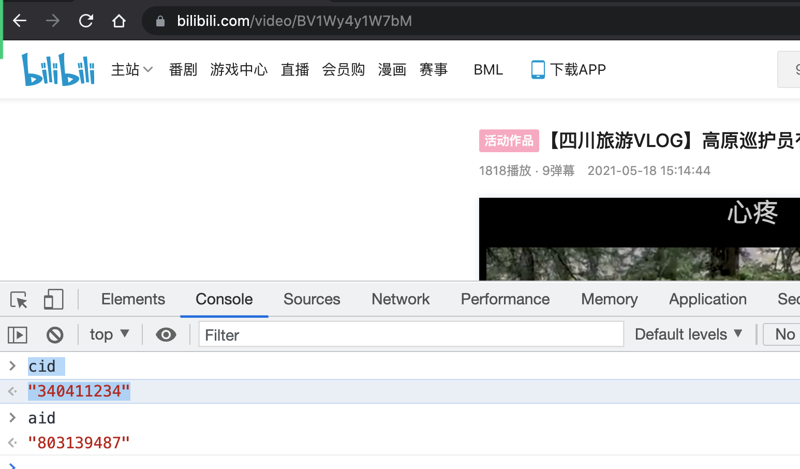
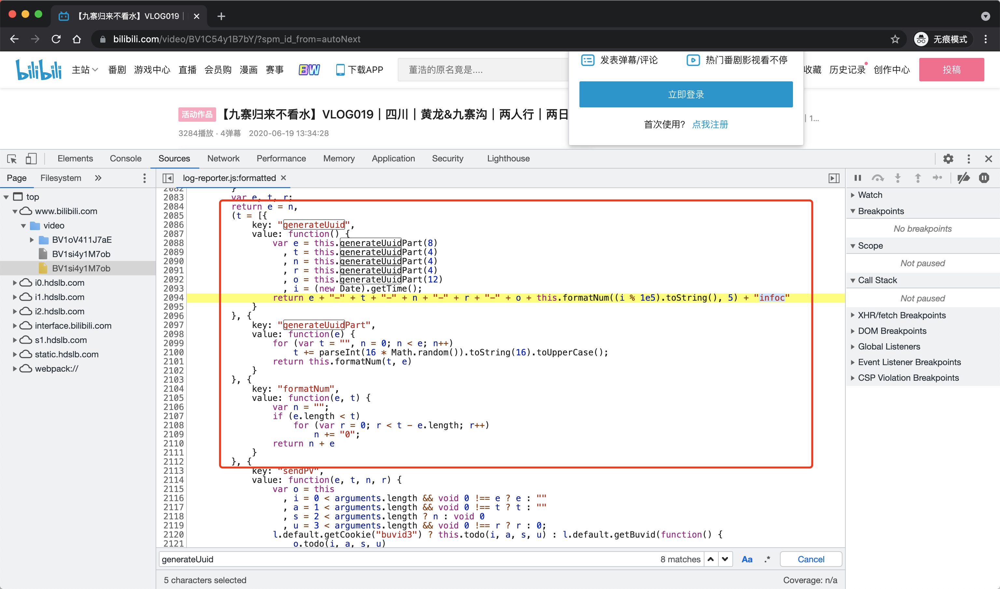
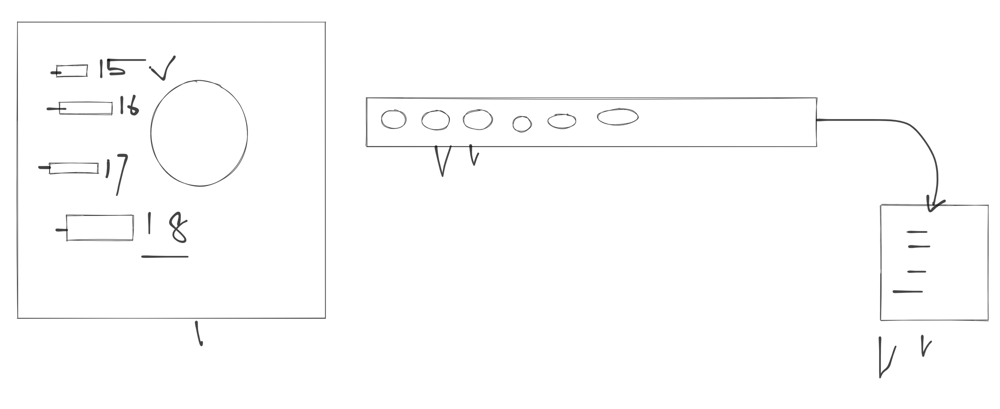
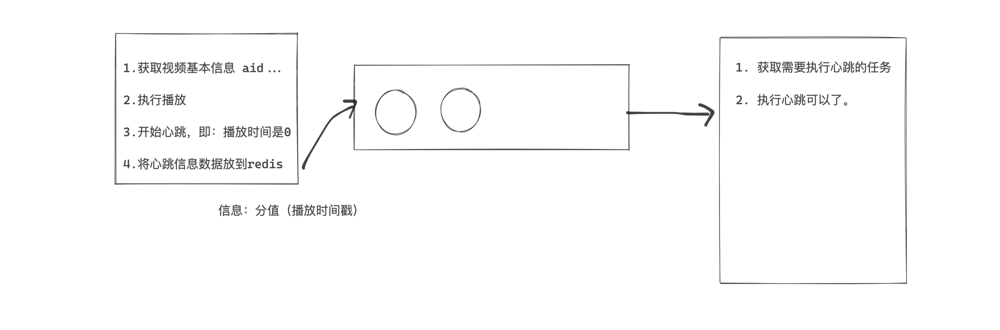
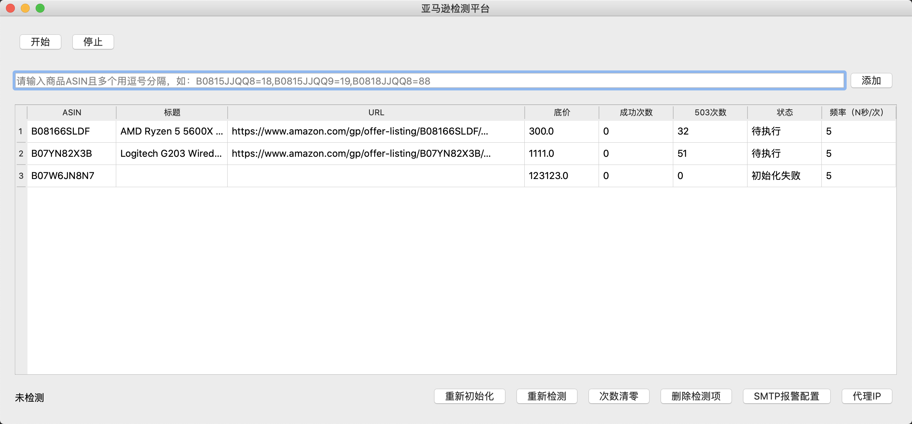

# day16 

今日概要：

- 刷B站播放量（完播率）
  - 播放量
  - 完播率
- 亚马逊商品价格监测（pyqt）


## 1.刷B站


### 1.1 播放量（PC）

人操作：

- 打开网址
- 点击播放，向后台发送请求，点击开始。
  - 后台，视频给你。
  - 数量统计   +1

让程序代替人去实现上述的过程。

- 全过程，10个请求（效率太低）
- 如果能能找到某一个请求。


对于B站播放量的

- URL：https://api.bilibili.com/x/click-interface/click/web/h5

- Method: POST

- 请求体：

  ```
  aid: 291511503
  cid: 365290495
  bvid: BV1sf4y1L7cQ
  part: 1
  mid: 0
  lv: 0
  ftime: 1625967900
  stime: 1625967900
  jsonp: jsonp
  type: 3
  sub_type: 0
  ```

  ```
  Form Data:
      - 数据：aid=291511503&cid=365290495&bvid=BV1sf4y1L7cQ
      - 请求头：content-type: application/x-www-form-urlencoded
      
      requests.post(
      	url="xxx",
      	data={
      		"aid":291511503,
      		"cid":291511503,
      	}
      )
      
      
  xxx JSONL:
  	- 数据：{"aid":291511503,"cid":"365290495" }
  	- 请求头：content-type: application/json
  	
  	    requests.post(
      	url="xxx",
      	json={
      		"aid":291511503,
      		"cid":291511503,
      	}
      )
  ```

- 请求头：

  - cookie

    ```
    CURRENT_FNVAL=80;  # 固定
    
    _uuid=4A2DA987-6E60-EA56-D873-8AB1BB98551899065infoc; 
    blackside_state=1;
    
    buvid3=62D955AE-408B-8FC8-96A8-EB5AB9627BE298348infoc; 
    bfe_id=5112800f2e3d3cf17a473918472e345c; 
    sid=l954ujnz
    ```

    针对请求中的cookie一般分为两种请求：

    - cookie是通过请求后台相应回来的。
    - cookie或请求头都是通过js生成（JS逆向）。

  - user-agent

    ```
    Mozilla/5.0 (Macintosh; Intel Mac OS X 10_15_7) AppleWebKit/537.36 (KHTML, like Gecko) Chrome/91.0.4472.106 Safari/537.36
    ```

    

#### 1.1.1 请求体

```
aid: 291511503
cid: 365290495
bvid: BV1sf4y1L7cQ # BV1D5411u7Xw
part: 1
mid: 0
lv: 0
ftime: 1625967900 # 首次打开B站时间
stime: 1625967900 # 当前时间
jsonp: jsonp
type: 3
sub_type: 0
```

```
aid: 68623396
cid: 118932247
bvid: BV1aJ411g7Gy
part: 1
mid: 0
lv: 0
ftime: 1625967900
stime: 1625968578
jsonp: jsonp
type: 3
sub_type: 0
```


现在看来，aid和cid需要我们手动打开浏览器去控制台获取。




通过代码想B站的其他URL发送请求，自动获取某个视频的aid和cid。

```python
import requests
import time
import random


def get_video_info(video_url):
    bvid = video_url.rsplit('/')[-1]

    res = requests.get(
        url="https://api.bilibili.com/x/player/pagelist?bvid={}&jsonp=jsonp".format(bvid)
    )

    duration = res.json()['data'][0]['duration']
    cid = res.json()['data'][0]['cid']

    res = requests.get(
        url="https://api.bilibili.com/x/web-interface/view?cid={}&bvid={}".format(cid, bvid),
    )

    res_json = res.json()
    aid = res_json['data']['aid']
    view_count = res_json['data']['stat']['view']

    return aid, bvid, cid, duration, view_count


def get_body(url):
    aid, bvid, cid, duration, view_count = get_video_info(url)

    current_time = int(time.time())
    info = {
        "aid": aid,
        "cid": cid,
        "bvid": bvid,
        "part": "1",
        "mid": "0",
        "lv": "0",
        "ftime": current_time - random.randint(100, 1000),
        "stime": current_time,
        "jsonp": "jsonp",
        "type": "3",
        "sub_type": "0"
    }
    return info


if __name__ == '__main__':
    url = "https://www.bilibili.com/video/BV18y4y137sW"
    info = get_body(url)
    print(info)

```


#### 1.1.2 请求头（cookie）




```python
import time
import uuid


def gen_uuid():
    uid = str(uuid.uuid4())

    div = str(int(int(time.time() * 1000) % 1e5))
    div = div.ljust(5, "0")

    return "{}{}{}".format(uid, div, "infoc")


if __name__ == '__main__':
    _uuid = gen_uuid()
    print(_uuid)
```


### 小结

- requests模块 & session
- 分析请求
- js逆向的方法
- 追踪他的cookie到底是谁生成？
- 学 前端知识点 看到代码，python代码去执行逻辑。


### 1.2 完播率

点击播放之后，模拟浏览器发送的心跳机制：

URL：https://api.bilibili.com/x/click-interface/web/heartbeat

方法：POST

请求体:

```
aid: 584668379
cid: 239630398
bvid: BV1Lz4y1Z7bG
mid: 0
csrf: 

played_time: 0			# 现在播放到视频的多少秒
real_played_time: 0	    # 播放时间
realtime: 0				# 播放时间
start_ts: 1625974582	# 开始播放的时间

type: 3
dt: 2
play_type: 1			# 刚开始播放1；中间：0 ；最后 4；
```


```
aid: 584668379
cid: 239630398
bvid: BV1Lz4y1Z7bG
mid: 0
csrf: 
played_time: -1
real_played_time: 240
realtime: 241
start_ts: 1625974582
type: 3
dt: 2
play_type: 4
```




- 消息队列是否可以？

  - 工作者，

    - BV1Np4y147Do，刷播放 & 开始心跳； 生成5条记录写入到队列（不是立即执行、而是过一段时间再执行）。

      ```
      1625982720,1625982705,1625982690,1625982675,1625982660
      
      当前时间：1625982658
      ```

    - BV1Np4y147Do，刷播放 & 开始心跳； 生成5条记录写入到队列（不是立即执行、而是过一段时间再执行）。

      ```
      1625982725,1625982710,1625982695,1625982680,1625982665
      ```

      ```
      1625982725,1625982710,1625982695,1625982680,1625982665,1625982720,1625982705,1625982690,1625982675,1625982660。
      如果队列可以进行根据某个值进行排序，按照时间从小到达去处理。
      ```

  - 想要实现：

    - 搜索，可以排序的队列，并且根据排序将某个值获取到（MySQL是否可以？效率太低）。

    - redis的有序集合。

      ```
      redis={
      	'xxxxxxx':{ ("alex",5),("eric",10),("wupeiqi",8) }
      }
      
      对有序集合对分值进行排序，取最小的 或 去 0-8
      ```

      ```
      redis={
      	'xxxxxxx':{ 
      		("心跳必备数据",1625982660),
      		("心跳必备数据",1625982675),
      		("心跳必备数据",1625982690),
      		("心跳必备数据",1625982665),
      		("心跳必备数据",1625982680),
      		("心跳必备数据",1625982695),
      	}
      }
      
      在获取时，获取 0 ~ 当前时间。
      	("心跳必备数据",1625982660),
          ("心跳必备数据",1625982675),
          
      获取之后再次执行心跳。
      ```

      ```python
      import redis
      import time
      
      conn = redis.Redis(host='127.0.0.1', port=6379, password='qwe123', encoding='utf-8')
      
      # 1. 在有序集合中放入数据
      # add_time = int(time.time())
      # conn.zadd("xxxxxxx", {"alex": add_time}),
      # conn.zadd("xxxxxxx", {"wupeiqi": add_time + 15}),
      # conn.zadd("xxxxxxx", {"ritian": add_time + 30}),
      
      # 2. 根据分值排序并获取数据
      current_time = int(time.time())
      
      # 2.1 获取 0 ~ current_time 分数之间的所有数据
      data_list = conn.zrangebyscore("xxxxxxx", 0, current_time, withscores=True, score_cast_func=int)
      print(data_list)
      
      # # 2.2 删除 0 ~ current_time 分数之间的所有数据
      conn.zremrangebyscore("xxxxxxx", 0, current_time)
      
      # print(data_list)
      ```

      




### 小结

- PC版本，浏览器端进行网络和代码的分析。

- 其他的组件和架构等配合（架构层面）。

- 我的代码你直接拿走跑，是没办法生效。

  ```
  因为B站对IP有限制。
  只要你用上代理IP就可以。
  ```

  


## 2.亚马逊商品价格监测（pyqt5）

```
pip install pyqt5
```




### 小结

- 布局，水平 & 垂直 & ”弹簧“。

- 按钮事件的绑定。

- Qt线程  VS   之前线程。（QT的线程 & 信号 ）

- 文件操作：

  - 日志
  - 历史记录
  - 报警信息
  - 代理IP

- 封装了requests请求。

  ```
  - 重试次数
  - 随机的UA
  ```

  


