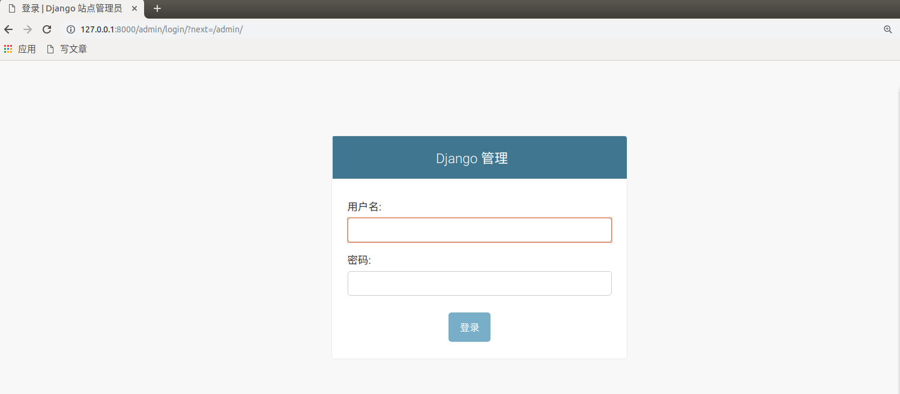

[TOC]

# Admin

django内置了一个强大的组件叫Admin，提供给网站管理员快速开发运营后台的管理站点。

站点文档： https://docs.djangoproject.com/zh-hans/2.2/ref/contrib/admin/

辅助文档：https://www.runoob.com/django/django-admin-manage-tool.html

```
注意：要使用Admin，必须先创建超级管理员.   python manage.py createsuperuser
```

访问地址：http://127.0.0.1:8000/admin，访问效果如下：



admin站点默认并没有提供其他的操作给我们，所以一切功能都需要我们进行配置，在项目中，我们每次创建子应用的时候都会存在一个admin.py文件，这个文件就是用于配置admin站点功能的文件。

admin.py里面允许我们编写的代码一共可以分成2部分：

## 列表页配置

主要用于针对项目中各个子应用里面的models.py里面的模型，根据这些模型自动生成后台运营站点的管理功能。

```python
from django.contrib import admin
from .models import Student
class StudentModelAdmin(admin.ModelAdmin):
    """学生模型管理类"""
    pass

# admin.site.register(模型类, 模型管理类)
admin.site.register(Student, StudentModelAdmin)
```

关于列表页的配置，代码：

```python
from django.contrib import admin
from .models import Student
class StudentModelAdmin(admin.ModelAdmin):
    """学生模型管理类"""
    date_hierarchy = 'born' # 按指定时间字段的不同值来进行选项排列
    list_display = ['id', "name", "sex", "age", "class_num","born","my_born"] # 设置列表页的展示字段
    ordering = ['-id']  # 设置默认排序字段,字段前面加上-号表示倒叙排列
    actions_on_bottom = True  # 下方控制栏是否显示,默认False表示隐藏
    actions_on_top = True  # 上方控制栏是否显示,默认False表示隐藏
    list_filter = ["class_num"]  # 过滤器,按指定字段的不同值来进行展示
    search_fields = ["name"]  # 搜索内容

    def my_born(self,obj):
        return str(obj.born).split(" ")[0]

    my_born.short_description = "出生日期"  # 自定义字段的描述信息
    my_born.admin_order_field = "born"     # 自定义字段点击时使用哪个字段作为排序条件

# admin.site.register(模型类, 模型管理类)
admin.site.register(Student, StudentModelAdmin)
```


## 详情页配置

```python
from django.contrib import admin
from .models import Student
class StudentModelAdmin(admin.ModelAdmin):
    """学生模型管理类"""
    date_hierarchy = 'born' # 按指定时间字段的不同值来进行选项排列
    list_display = ['id', "name", "sex", "age", "class_null","born","my_born"] # 设置列表页的展示字段
    ordering = ['-id']  # 设置默认排序字段,字段前面加上-号表示倒叙排列
    actions_on_bottom = True  # 下方控制栏是否显示,默认False表示隐藏
    actions_on_top = True  # 上方控制栏是否显示,默认False表示隐藏
    list_filter = ["class_null"]  # 过滤器,按指定字段的不同值来进行展示
    search_fields = ["name"]  # 搜索内容

    def my_born(self,obj):
        return str(obj.born).split(" ")[0]

    my_born.short_description = "出生日期"  # 自定义字段的描述信息
    my_born.admin_order_field = "born"     # 自定义字段点击时使用哪个字段作为排序条件

    def delete_model(self, request, obj):
        """当站点删除当前模型时执行的钩子方法"""
        print("有人删除了模型信息[添加/修改]")

        # raise Exception("无法删除") # 阻止删除
        return super().delete_model(request, obj) # 继续删除

    def save_model(self, request, obj, form, change):
        """
        当站点保存当前模型时
        """
        print("有人修改了模型信息[添加/修改]")
        # 区分添加和修改? obj是否有id
        print(obj.id)
        return super().save_model(request, obj, form, change)

    # fields = ('name', 'age', 'class_null', "description")  # exclude 作用与fields相反
    # readonly_fields = ["name"]  # 设置只读字段

    # 字段集,fieldsets和fields只能使用其中之一
    fieldsets = (
        ("必填项", {
            'fields': ('name', 'age', 'sex')
        }),
        ('可选项', {
            'classes': ('collapse',),  # 折叠样式
            'fields': ('class_null', 'description'),
        }),
    )


# admin.site.register(模型类, 模型管理类)
admin.site.register(Student, StudentModelAdmin)
```


# Xadmin

xadmin是Django的第三方扩展，是一个比Django的admin站点使用更方便的后台站点。构建于admin站点之上。

文档：http://sshwsfc.github.io/xadmin/

​           https://xadmin.readthedocs.io/en/latest/index.html

## 1.1. 安装

通过如下命令安装xadmin的最新版

```shell
pip install https://codeload.github.com/sshwsfc/xadmin/zip/django2
```

在配置文件settings.py中注册如下应用

```python
INSTALLED_APPS = [
    ...
    'xadmin',
    'crispy_forms',
    'reversion',
    ...
]

# 修改使用中文界面
LANGUAGE_CODE = 'zh-Hans'

# 修改时区
TIME_ZONE = 'Asia/Shanghai'
```


xadmin有建立自己的数据库模型类，需要进行数据库迁移

```shell
python manage.py makemigrations
python manage.py migrate
```


在总路由中添加xadmin的路由信息

```python
import xadmin
xadmin.autodiscover()

# version模块自动注册需要版本控制的 Model
from xadmin.plugins import xversion
xversion.register_models()

urlpatterns = [
    path('xadmin/', xadmin.site.urls),
]
```


创建超级用户

```python
python manage.py createsuperuser
```


## 1.2. 使用

- xadmin不再使用Django的admin.py进行功能配置了，而是需要编写代码在adminx.py文件中。

    xadmin的配置文件需要我们在每个子应用中使用时先创建adminx.py

- xadmin的站点管理类不用继承`admin.ModelAdmin`，而是直接继承`object`即可。

例如：在子应用students中创建adminx.py文件。

#### 1.2.1 站点的全局配置

```python
import xadmin
from xadmin import views

class BaseSetting(object):
    """xadmin的基本配置"""
    enable_themes = True  # 开启主题切换功能
    use_bootswatch = True

xadmin.site.register(views.BaseAdminView, BaseSetting)

class GlobalSettings(object):
    """xadmin的全局配置"""
    site_title = "路飞学城"  # 设置站点标题
    site_footer = "路飞学城有限公司"  # 设置站点的页脚
    menu_style = "accordion"  # 设置菜单折叠

xadmin.site.register(views.CommAdminView, GlobalSettings)
```


#### 1.2.2 站点Model管理

xadmin可以使用的页面样式控制基本与Django原生的admin一致。

- **list_display** 控制列表展示的字段

  ```
  list_display = ['id', 'name', 'sex', 'age']
  ```

- **search_fields** 控制可以通过搜索框搜索的字段名称，xadmin使用的是模糊查询

  ```
  search_fields = ['id','name']
  ```

- **list_filter** 可以进行过滤操作的列，对于分类、性别、状态

  ```
  list_filter = ['is_delete']
  ```

- **ordering** 默认排序的字段

- **readonly_fields** 在编辑页面的只读字段

- **exclude** 在编辑页面隐藏的字段

- **list_editable** 在列表页可以快速直接编辑的字段

- **show_detail_fields** 在列表页提供快速显示详情信息

- **refresh_times** 指定列表页的定时刷新

  ```
  refresh_times = [5, 10,30,60]  # 设置允许后端管理人员按多长时间(秒)刷新页面
  ```

- **list_export** 控制列表页导出数据的可选格式

  ```
  list_export = ('xls', 'xml', 'json')   list_export设置为None来禁用数据导出功能
  list_export_fields = ('id', 'title', 'pub_date') # 允许导出的字段
  ```

- **show_bookmarks** 控制是否显示书签功能

  ```
  show_bookmarks = True
  ```

- **data_charts** 控制显示图表的样式

  ```python
  data_charts = {
          "order_amount": {
            'title': '图书发布日期表', 
            "x-field": "pub_date", 
            "y-field": ('title',),
            "order": ('id',)
          },
      #    支持生成多个不同的图表
      #    "order_amount": {
      #      'title': '图书发布日期表', 
      #      "x-field": "pub_date", 
      #      "y-field": ('title',),
      #      "order": ('id',)
      #    },
      }
  ```

  - title 控制图标名称
  - x-field 控制x轴字段
  - y-field 控制y轴字段，可以是多个值
  - order 控制默认排序


- **model_icon** 控制菜单的图标

  这里使用的图标是来自bootstrap3的图标。https://v3.bootcss.com/components/

  ```
  class BookInfoAdmin(object):
      model_icon = 'fa fa-gift'
  
  xadmin.site.register(models.BookInfo, BookInfodmin)
  ```


修改admin或者xadmin站点下的子应用成中文内容。

```python
# 在子应用的apps.py下面的配置中，新增一个属性verbose_name
from django.apps import AppConfig

class StudentsConfig(AppConfig):
    name = 'students'
    verbose_name = "学生管理"


# 然后在当前子应用的__init__.py里面新增一下代码：
default_app_config = "students.apps.StudentsConfig"
```

