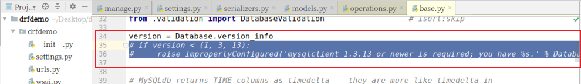

程序的客户端有很多：硬件设备，游戏，APP，软件，其他的外部服务端。

#  1. Web应用模式

在开发Web应用中，有两种应用模式：

1. 前后端不分离[客户端看到的内容和所有界面效果都是由服务端提供出来的。]

    这种情况下，前端页面中会出现很多涉及到服务端的模板语法。


2. 前后端分离【把前端的界面效果(html，css，js分离到另一个项目中，python服务端只需要返回数据即可)】

    前端形成一个独立的网站，服务端构成一个独立的网站


django，一般都是做web网站，如果可以利用django实现前后端分离，则django就可以完成地铁站的运营调度系统，路由的终端系统，pos机的服务端系统，游戏的服务端后台，软件的服务端后台。


# 2. api接口

为了在团队内部形成共识、防止个人习惯差异引起的混乱，我们需要找到一种大家都觉得很好的接口实现规范，而且这种规范能够让后端写的接口，用途一目了然，减少双方之间的合作成本。

目前市面上大部分公司开发人员使用的接口服务架构主要有：restful、rpc，soap。


rpc: 翻译成中文:远程过程调用[远程服务调用].

服务端提供单一的请求数据的api地址：http://api.renran.cn/

post请求

，enthod=get_all_student&class=301&sex=1

优势：

1.  不需要管当前操作是什么http请求，也不需要操作url地址的编写，对接简单

缺点：

1.  接口多了,对应函数名和参数就多了,前端在请求api接口时,就会比较难找.容易出现重复的接口


restful: 翻译成中文: 资源状态转换.

把后端所有的数据/文件都看成资源. 

那么接口请求数据,本质上来说就是对资源的操作了.

web项目中操作资源,无非就是增删查改.所以要求在地址栏中声明要操作的资源是什么,然后通过http请求动词来说明对资源进行哪一种操作.

POST http://www.renran.cn/api/students/   添加学生数据

GET    http://www.renran.cn/api/students/   获取所有学生

DELETE http://www.renran.cn/api/students/<pk>/   删除id=pk的一个学生

PUT   http://www.renran.cn/api/students/<pk>/       修改一个学生的全部信息 [id,name,sex,age,]

PATCH  http://www.renran.cn/api/students/<pk>/    修改一个学生的部分信息[age]

优点：

 	1. 维护开发简单，可以保证后期的开发不会出现太多重复接口

缺点：

1.  有部分接口不会有明确的增删查改这种区分的，所以会出现一些不伦不类的接口。会因为这些语义不明，不伦不类的接口导致后期的维护成本上升。
2.  因为restful把对于资源的操作都理解成了增删查改，建议使用http，所以restful接口天生局限于web开发。


# 3. RESTful API规范


REST全称是Representational State Transfer，中文意思是表述（编者注：通常译为表征）性状态转移。 它首次出现在2000年Roy Fielding的博士论文中。  

RESTful是一种定义Web API接口的设计风格，尤其适用于前后端分离的应用模式中。

这种风格的理念认为后端开发任务就是提供数据的，对外提供的是数据资源的访问接口，所以在定义接口时，客户端访问的URL路径就表示这种要操作的数据资源。

而对于数据资源分别使用POST、DELETE、GET、UPDATE等请求动作来表达对数据的增删查改。

| 请求方法  | 请求地址       | 后端操作           |
| --------- | -------------- | ------------------ |
| GET       | /students      | 获取所有学生       |
| POST      | /students      | 增加学生           |
| GET       | /students/<pk> | 获取主键为pk的学生 |
| PUT/PATCH | /students/<pk> | 修改主键为pk的学生 |
| DELETE    | /students/<pk> | 删除主键为pk的学生 |


事实上，我们可以使用任何一个框架都可以实现符合restful规范的API接口。

参考文档：http://www.runoob.com/w3cnote/restful-architecture.html

接口实施过程中，会存在幂等性。所谓幂等性是指代客户端发起多次请求是否对于服务端里面的资源产生不同结果。如果多次请求，服务端结果还是一样，则属于幂等接口，如果多次请求，服务端产生结果是不一样的，则属于非幂等接口。在http请求，get/put/patch/delete都属于幂等性接口，post属于非幂等接口。

为什么要考虑幂等性？主要就是接口操作的安全性问题。

delete /api/students/1

get /api/students/   

post  /api/students/


# 4. 序列化

api接口开发，最核心最常见的一个过程就是序列化，所谓序列化就是把**数据转换格式**，序列化可以分两个阶段：

**序列化**： 把我们识别的数据转换成指定的格式提供给别人。

例如：我们在django中获取到的数据默认是模型对象，但是模型对象数据无法直接提供给前端或别的平台使用，所以我们需要把数据进行序列化，变成字符串或者json数据，提供给前端或者其他平台。


**反序列化**：把别人提供的数据转换/还原成我们需要的格式。

例如：前端js提供过来的json数据，对于python而言就是字符串，我们需要进行反序列化换成模型类对象，这样我们才能把数据保存到数据库中。


# 5. Django Rest_Framework

核心思想: 缩减编写api接口的代码

Django REST framework是一个建立在Django基础之上的Web 应用开发框架,本质上就是一个内置在django里面的子应用，可以快速的开发REST API接口应用。

在REST framework中，提供了序列化器对象Serialzier的定义，可以帮助我们简化序列化与反序列化的过程，不仅如此，还提供丰富的类视图、扩展类、视图集来简化视图的编写工作。REST framework还提供了认证、权限、限流、过滤、分页、接口文档等功能支持。REST framework提供了一个用于测试API接口 的可视化Web界面【可以浏览器直接访问接口，drf的api接口测试页面非常美观】。


中文文档：https://q1mi.github.io/Django-REST-framework-documentation/#django-rest-framework

github: https://github.com/encode/django-rest-framework/tree/master

### 特点

- 提供了定义序列化器Serializer的方法，可以快速根据 Django ORM 或者其它库自动序列化/反序列化；
- 提供了丰富的类视图、Mixin扩展类，简化视图的编写；
- 丰富的定制层级：函数视图、类视图、视图集合到自动生成 API，满足各种需要；
- 多种身份认证和权限认证方式的支持；[jwt   Json web token]
- 内置了限流系统；
- 直观的 API web 界面；【方便我们调试开发api接口】
- 可扩展性，插件丰富


# 6. 环境安装与配置

DRF需要以下依赖：

- Python (2.7, 3.2以上)
- Django (1.10, 1.11, 2.0以上)

**DRF是以Django扩展应用的方式提供的，所以我们可以直接利用已有的Django环境而无需从新创建。（若没有Django环境，需要先创建环境安装Django）**


## 6.1 安装DRF

前提是已经安装了django，建议安装在虚拟环境

windows的复制粘贴在linux终端是无效的，在ubuntu终端下粘贴的快捷键是 shift+insert

```python
# mkvirtualenv drfdemo -p python3
# pip install django==2.2.0  -i https://pypi.douban.com/simple

pip install djangorestframework -i https://pypi.douban.com/simple

# 因为我们需要接下来，需要开发api接口肯定要操作数据，所以安装pymysql
pip install pymysql -i https://pypi.douban.com/simple
```


linux的终端下 粘贴内容 快捷键： shift+insert

### 6.1.1 创建django项目

```
cd ~/Desktop
django-admin startproject drfdemo
```


使用pycharm打开项目，设置虚拟环境的解析器，并修改manage.py中的后缀参数。


## 6.2 添加rest_framework应用

在**settings.py**的**INSTALLED_APPS**中添加'rest_framework'。

```python
INSTALLED_APPS = [
    ...
    'rest_framework',
]
```

接下来就可以使用DRF提供的功能进行api接口开发了。在项目中如果使用rest_framework框架实现API接口，主要有以下三个步骤：

- 将请求的数据（如JSON格式）转换为模型类对象
- 通过模型类对象进行数据库操作，完成客户端请求的增删查改
- 将模型类对象转换为响应的数据（如JSON格式）


接下来，我们快速体验下四天后我们学习完成drf以后的开发代码。接下来代码不需要理解，看步骤。

## 6.3 体验drf完全简写代码的过程

### 6.3.0 创建子应用

```pythpn 
# 项目根目录下创建子应用，用于展示当前例子。

python manage.py startapp students
```


### 6.3.1. 创建模型操作类

子应用的models.py文件中创建模型对象。

```python
from django.db import models

# Create your models here.
class Student(models.Model):
    # 表字段声明
    # 字段名=models.数据类型(字段约束)
    name = models.CharField(null=False, max_length=32, verbose_name="姓名")
    sex  = models.BooleanField(default=True, verbose_name="性别")
    age  = models.IntegerField(verbose_name="年龄")
    class_num = models.CharField(max_length=5, verbose_name="班级编号")
    description = models.TextField(max_length=1000, verbose_name="个性签名")

    # 表信息
    class Meta:
        # 设置表名
        db_table="tb_students"
        verbose_name="学生"
        verbose_name_plural=verbose_name

    # 模型的操作方法
    def __str__(self):
        return self.name
```

为了方便测试，所以我们可以先创建一个数据库。

```
create database students charset=utf8;
```


#### 6.3.1.1 执行数据迁移

把students子应用添加到INSTALL_APPS中


初始化数据库连接

```
安装pymysql
pip install pymysql
```

主引用中`__init__.py`设置使用pymysql作为数据库驱动

```python
import pymysql

pymysql.install_as_MySQLdb()
```


settings.py配置文件中设置mysql的账号密码

```python
DATABASES = {
    # 'default': {
    #     'ENGINE': 'django.db.backends.sqlite3',
    #     'NAME': os.path.join(BASE_DIR, 'db.sqlite3'),
    # },
    'default': {
        'ENGINE': 'django.db.backends.mysql',
        'NAME': "students",
        "HOST": "127.0.0.1",
        "PORT": 3306,
        "USER": "root",
        "PASSWORD":"123",
    },
}
```


终端下，执行数据迁移。

```
python manage.py makemigrations
python manage.py migrate
```

 

错误列表

```python
# 执行数据迁移 python manage.py makemigrations 报错如下：
```


解决方案：

```python
注释掉 backends/mysql/base.py中的35和36行代码。
```




```python
# 执行数据迁移发生以下错误：
```


解决方法：

backends/mysql/operations.py146行里面把decode换成encode：


### 6.3.2. 创建序列化器

在students应用目录中新建serializers.py用于保存该应用的序列化器。

创建一个StudentModelSerializer用于序列化与反序列化。

```python
# 创建序列化器类，回头会在试图中被调用
from rest_framework import serializers
from .models import Student
class StudentModelSerializer(serializers.ModelSerializer):
    class Meta:
        model = Student
        fields = "__all__"
```

- **model** 指明该序列化器处理的数据字段从模型类BookInfo参考生成
- **fields** 指明该序列化器包含模型类中的哪些字段，'__all__'指明包含所有字段


### 6.3.3. 编写视图

在students应用的views.py中创建视图StudentViewSet，这是一个视图集合。

```python
from rest_framework.viewsets import ModelViewSet
from .models import Student
from .serializers import StudentModelSerializer
# Create your views here.
class StudentViewSet(ModelViewSet):
    queryset = Student.objects.all()
    serializer_class = StudentModelSerializer
```

- **queryset** 指明该视图集在查询数据时使用的查询集
- **serializer_class** 指明该视图在进行序列化或反序列化时使用的序列化器

### 6.3.4. 定义路由

在students应用的urls.py中定义路由信息。

```python
from . import views
from rest_framework.routers import DefaultRouter

# 路由列表
urlpatterns = []

router = DefaultRouter()  # 可以处理视图的路由器
router.register('students', views.StudentViewSet)  # 向路由器中注册视图集

urlpatterns += router.urls  # 将路由器中的所以路由信息追到到django的路由列表中
```

最后把students子应用中的路由文件加载到总路由文件中.

```python
from django.contrib import admin
from django.urls import path,include

urlpatterns = [
    path('admin/', admin.site.urls),
    path("student/",include("students.urls")),
]

```


### 6.3.5. 运行测试

运行当前程序（与运行Django一样）

```shell
python manage.py runserver
```

在浏览器中输入网址127.0.0.1:8000，可以看到DRF提供的API Web浏览页面：


1）点击链接127.0.0.1:8000/stu/students 可以访问**获取所有数据的接口**，呈现如下页面：


2）在页面底下表单部分填写学生信息，可以访问**添加新学生的接口**，保存学生信息：


点击POST后，返回如下页面信息：


3）在浏览器中输入网址127.0.0.1:8000/stu/students/5/，可以访问**获取单一学生信息的接口**（id为5的学生），呈现如下页面：


4）在页面底部表单中填写学生信息，可以访问**修改学生的接口**：


点击PUT，返回如下页面信息：


5）点击DELETE按钮，可以访问**删除学生的接口**：


返回，如下页面：


作业：

```
1. 在自己电脑上安装搭建项目，并完成上面的快速体验开发接口的代码测试。
2. 使用django提供5个接口给用户使用postman访问操作。
   这里是使用django来编写不需要drf，当然如果有同学自学了后面的内容，这个也可以使用drf实现。
   分别是：
      添加一个学生信息，
      修改一个学生信息，
      删除一个学生信息，
      查询一个学生信息，
      查询所有学生信息。
```


# 7. 序列化器-Serializer

作用：

    1. 序列化,序列化器会把模型对象转换成字典,经过response以后变成json字符串
    2. 反序列化,把客户端发送过来的数据,经过request以后变成字典,序列化器可以把字典转成模型
    3. 反序列化,完成数据校验功能


## 7.1 定义序列化器

Django REST framework中的Serializer使用类来定义，须继承自rest_framework.serializers.Serializer。

接下来，为了方便演示序列化器的使用，我们先创建一个新的子应用sers

```
python manage.py startapp sers
```


我们已有了一个数据库模型类students/Student

```python
from django.db import models

# Create your models here.
class Student(models.Model):
    # 模型字段
    name = models.CharField(max_length=100,verbose_name="姓名",help_text="提示文本:账号不能为空！")
    sex = models.BooleanField(default=True,verbose_name="性别")
    age = models.IntegerField(verbose_name="年龄")
    class_null = models.CharField(max_length=5,verbose_name="班级编号")
    description = models.TextField(verbose_name="个性签名")

    class Meta:
        db_table="tb_student"
        verbose_name = "学生"
        verbose_name_plural = verbose_name
```

我们想为这个模型类提供一个序列化器，可以定义如下：

```python
from rest_framework import serializers

# 声明序列化器，所有的序列化器都要直接或者间接继承于 Serializer
# 其中，ModelSerializer是Serializer的子类，ModelSerializer在Serializer的基础上进行了代码简化
class StudentSerializer(serializers.Serializer):
    """学生信息序列化器"""
    # 1. 需要进行数据转换的字段
    id = serializers.IntegerField()
    name = serializers.CharField()
    age = serializers.IntegerField()
    sex = serializers.BooleanField()
    description = serializers.CharField()

    # 2. 如果序列化器集成的是ModelSerializer，则需要声明调用的模型信息

    # 3. 验证代码

    # 4. 编写添加和更新模型的代码
```

**注意：serializer不是只能为数据库模型类定义，也可以为非数据库模型类的数据定义。**serializer是独立于数据库之外的存在。


**常用字段类型**：

| 字段                    | 字段构造方式                                                 |
| ----------------------- | ------------------------------------------------------------ |
| **BooleanField**        | BooleanField()                                               |
| **NullBooleanField**    | NullBooleanField()                                           |
| **CharField**           | CharField(max_length=None, min_length=None, allow_blank=False, trim_whitespace=True) |
| **EmailField**          | EmailField(max_length=None, min_length=None, allow_blank=False) |
| **RegexField**          | RegexField(regex, max_length=None, min_length=None, allow_blank=False) |
| **SlugField**           | SlugField(max*length=50, min_length=None, allow_blank=False) 正则字段，验证正则模式 [a-zA-Z0-9*-]+ |
| **URLField**            | URLField(max_length=200, min_length=None, allow_blank=False) |
| **UUIDField**           | UUIDField(format='hex_verbose')  format:  1) `'hex_verbose'` 如`"5ce0e9a5-5ffa-654b-cee0-1238041fb31a"`  2） `'hex'` 如 `"5ce0e9a55ffa654bcee01238041fb31a"`  3）`'int'` - 如: `"123456789012312313134124512351145145114"`  4）`'urn'` 如: `"urn:uuid:5ce0e9a5-5ffa-654b-cee0-1238041fb31a"` |
| **IPAddressField**      | IPAddressField(protocol='both', unpack_ipv4=False, **options) |
| **IntegerField**        | IntegerField(max_value=None, min_value=None)                 |
| **FloatField**          | FloatField(max_value=None, min_value=None)                   |
| **DecimalField**        | DecimalField(max_digits, decimal_places, coerce_to_string=None, max_value=None, min_value=None) max_digits: 最多位数 decimal_palces: 小数点位置 |
| **DateTimeField**       | DateTimeField(format=api_settings.DATETIME_FORMAT, input_formats=None) |
| **DateField**           | DateField(format=api_settings.DATE_FORMAT, input_formats=None) |
| **TimeField**           | TimeField(format=api_settings.TIME_FORMAT, input_formats=None) |
| **DurationField**       | DurationField()                                              |
| **ChoiceField**         | ChoiceField(choices) choices与Django的用法相同               |
| **MultipleChoiceField** | MultipleChoiceField(choices)                                 |
| **FileField**           | FileField(max_length=None, allow_empty_file=False, use_url=UPLOADED_FILES_USE_URL) |
| **ImageField**          | ImageField(max_length=None, allow_empty_file=False, use_url=UPLOADED_FILES_USE_URL) |
| **ListField**           | ListField(child=, min_length=None, max_length=None)          |
| **DictField**           | DictField(child=)                                            |

**选项参数：**

| 参数名称            | 作用             |
| ------------------- | ---------------- |
| **max_length**      | 最大长度         |
| **min_lenght**      | 最小长度         |
| **allow_blank**     | 是否允许为空     |
| **trim_whitespace** | 是否截断空白字符 |
| **max_value**       | 最小值           |
| **min_value**       | 最大值           |

通用参数：

| 参数名称           | 说明                                          |
| ------------------ | --------------------------------------------- |
| **read_only**      | 表明该字段仅用于序列化输出，默认False         |
| **write_only**     | 表明该字段仅用于反序列化输入，默认False       |
| **required**       | 表明该字段在反序列化时必须输入，默认True      |
| **default**        | 反序列化时使用的默认值                        |
| **allow_null**     | 表明该字段是否允许传入None，默认False         |
| **validators**     | 该字段使用的验证器                            |
| **error_messages** | 包含错误编号与错误信息的字典                  |
| **label**          | 用于HTML展示API页面时，显示的字段名称         |
| **help_text**      | 用于HTML展示API页面时，显示的字段帮助提示信息 |


## 7.2 创建Serializer对象

定义好Serializer类后，就可以创建Serializer对象了。

Serializer的构造方法为：

```python
Serializer(instance=None, data=empty, **kwarg)
```

说明：

1）用于序列化时，将模型类对象传入**instance**参数

2）用于反序列化时，将要被反序列化的数据传入**data**参数

3）除了instance和data参数外，在构造Serializer对象时，还可通过**context**参数额外添加数据，如

```python
serializer = AccountSerializer(account, context={'request': request})
```

**通过context参数附加的数据，可以通过Serializer对象的context属性获取。**


1. 使用序列化器的时候一定要注意，序列化器声明了以后，不会自动执行，需要我们在视图中进行调用才可以。
2. 序列化器无法直接接收数据，需要我们在视图中创建序列化器对象时把使用的数据传递过来。
3. 序列化器的字段声明类似于我们前面使用过的表单系统。
4. 开发restful api时，序列化器会帮我们把模型数据转换成字典.
5. drf提供的视图会帮我们把字典转换成json,或者把客户端发送过来的数据转换字典.


## 7.3 序列化器的使用

序列化器的使用分两个阶段：

1. 在客户端请求时，使用序列化器可以完成对数据的反序列化。
2. 在服务器响应时，使用序列化器可以完成对数据的序列化。


### 7.3.1 序列化

#### 7.3.1.1 基本使用

1） 先查询出一个学生对象

```python
from students.models import Student

student = Student.objects.get(id=3)
```

2） 构造序列化器对象

```python
from .serializers import StudentSerializer

serializer = StudentSerializer(instance=student)
```

3）获取序列化数据

通过data属性可以获取序列化后的数据

```python
serializer.data
# {'id': 4, 'name': '小张', 'age': 18, 'sex': True, 'description': '猴赛雷'}
```

完整视图代码：

```python
from django.views import View
from students.models import Student
from .serializers import StudentSerializer
from django.http.response import JsonResponse
class StudentView(View):
    """使用序列化器序列化转换单个模型数据"""
    def get(self,request,pk):
        # 获取数据
        student = Student.objects.get(pk=pk)
        # 数据转换[序列化过程]
        serializer = StudentSerializer(instance=student)
        print(serializer.data)
        # 响应数据
        return JsonResponse(serializer.data)
```


4）如果要被序列化的是包含多条数据的查询集QuerySet，可以通过添加**many=True**参数补充说明

```python
    """使用序列化器序列化转换多个模型数据"""
    def get(self,request):
        # 获取数据
        student_list = Student.objects.all()

        # 转换数据[序列化过程]
        # 如果转换多个模型对象数据，则需要加上many=True
        serializer = StudentSerializer(instance=student_list,many=True)
        print( serializer.data ) # 序列化器转换后的数据

        # 响应数据给客户端
        # 返回的json数据，如果是列表，则需要声明safe=False
        return JsonResponse(serializer.data,safe=False)
    
    
    # 访问结果：
    # [OrderedDict([('id', 1), ('name', 'xiaoming'), ('age', 20), ('sex', True), ('description', '测试')]), OrderedDict([('id', 2), ('name', 'xiaohui'), ('age', 22), ('sex', True), ('description', '后面来的测试')]), OrderedDict([('id', 4), ('name', '小张'), ('age', 18), ('sex', True), ('description', '猴赛雷')])]

```


### 7.3.2  反序列化

#### 7.3.2.1 数据验证

使用序列化器进行反序列化时，需要对数据进行验证后，才能获取验证成功的数据或保存成模型类对象。

在获取反序列化的数据前，必须调用**is_valid()**方法进行验证，验证成功返回True，否则返回False。

验证失败，可以通过序列化器对象的**errors**属性获取错误信息，返回字典，包含了字段和字段的错误。如果是非字段错误，可以通过修改REST framework配置中的**NON_FIELD_ERRORS_KEY**来控制错误字典中的键名。

验证成功，可以通过序列化器对象的**validated_data**属性获取数据。

在定义序列化器时，指明每个字段的序列化类型和选项参数，本身就是一种验证行为。

如我们前面定义过的BookInfoSerializer

```python
class BookInfoSerializer(serializers.Serializer):
    """图书数据序列化器"""
    id = serializers.IntegerField(label='ID', read_only=True)
    btitle = serializers.CharField(label='名称', max_length=20)
    bpub_date = serializers.DateField(label='发布日期', required=False)
    bread = serializers.IntegerField(label='阅读量', required=False)
    bcomment = serializers.IntegerField(label='评论量', required=False)
    image = serializers.ImageField(label='图片', required=False)
```

通过构造序列化器对象，并将要反序列化的数据传递给data构造参数，进而进行验证

```python
from booktest.serializers import BookInfoSerializer
data = {'bpub_date': 123}
serializer = BookInfoSerializer(data=data)
serializer.is_valid()  # 返回False
serializer.errors
# {'btitle': [ErrorDetail(string='This field is required.', code='required')], 'bpub_date': [ErrorDetail(string='Date has wrong format. Use one of these formats instead: YYYY[-MM[-DD]].', code='invalid')]}
serializer.validated_data  # {}

data = {'btitle': 'python'}
serializer = BookInfoSerializer(data=data)
serializer.is_valid()  # True
serializer.errors  # {}
serializer.validated_data  #  OrderedDict([('btitle', 'python')])
```

is_valid()方法还可以在验证失败时抛出异常serializers.ValidationError，可以通过传递**raise_exception=True**参数开启，REST framework接收到此异常，会向前端返回HTTP 400 Bad Request响应。

```python
# Return a 400 response if the data was invalid.
serializer.is_valid(raise_exception=True)
```

如果觉得这些还不够，需要再补充定义验证行为，可以使用以下三种方法：

##### 1) validate_字段名

对`<field_name>`字段进行验证，如

```python
class BookInfoSerializer(serializers.Serializer):
    """图书数据序列化器"""
    ...

    def validate_btitle(self, value):
        if 'django' not in value.lower():
            raise serializers.ValidationError("图书不是关于Django的")
        return value
```

测试

```python
from booktest.serializers import BookInfoSerializer
data = {'btitle': 'python'}
serializer = BookInfoSerializer(data=data)
serializer.is_valid()  # False   
serializer.errors
#  {'btitle': [ErrorDetail(string='图书不是关于Django的', code='invalid')]}
```

##### 2) validate

在序列化器中需要同时对多个字段进行比较验证时，可以定义validate方法来验证，如

```python
class BookInfoSerializer(serializers.Serializer):
    """图书数据序列化器"""
    ...

    def validate(self, attrs):
        bread = attrs['bread']
        bcomment = attrs['bcomment']
        if bread < bcomment:
            raise serializers.ValidationError('阅读量小于评论量')
        return attrs
```

测试

```python
from booktest.serializers import BookInfoSerializer
data = {'btitle': 'about django', 'bread': 10, 'bcomment': 20}
s = BookInfoSerializer(data=data)
s.is_valid()  # False
s.errors
#  {'non_field_errors': [ErrorDetail(string='阅读量小于评论量', code='invalid')]}
```

##### 3) validators

在字段中添加validators选项参数，也可以补充验证行为，如

```python
def about_django(value):
    if 'django' not in value.lower():
        raise serializers.ValidationError("图书不是关于Django的")

class BookInfoSerializer(serializers.Serializer):
    """图书数据序列化器"""
    id = serializers.IntegerField(label='ID', read_only=True)
    btitle = serializers.CharField(label='名称', max_length=20, validators=[about_django])
    bpub_date = serializers.DateField(label='发布日期', required=False)
    bread = serializers.IntegerField(label='阅读量', required=False)
    bcomment = serializers.IntegerField(label='评论量', required=False)
    image = serializers.ImageField(label='图片', required=False)
```

测试：

```python
from booktest.serializers import BookInfoSerializer
data = {'btitle': 'python'}
serializer = BookInfoSerializer(data=data)
serializer.is_valid()  # False   
serializer.errors
#  {'btitle': [ErrorDetail(string='图书不是关于Django的', code='invalid')]}
```


#### 7.3.2.2  反序列化-保存数据

前面的验证数据成功后,我们可以使用序列化器来完成数据反序列化的过程.这个过程可以把数据转成模型类对象.

可以通过实现create()和update()两个方法来实现。

```python
class BookInfoSerializer(serializers.Serializer):
    """图书数据序列化器"""
    ...

    def create(self, validated_data):
        """新建"""
        return BookInfo(**validated_data)

    def update(self, instance, validated_data):
        """更新，instance为要更新的对象实例"""
        instance.btitle = validated_data.get('btitle', instance.btitle)
        instance.bpub_date = validated_data.get('bpub_date', instance.bpub_date)
        instance.bread = validated_data.get('bread', instance.bread)
        instance.bcomment = validated_data.get('bcomment', instance.bcomment)
        return instance
```

如果需要在返回数据对象的时候，也将数据保存到数据库中，则可以进行如下修改

```python
class BookInfoSerializer(serializers.Serializer):
    """图书数据序列化器"""
    ...

    def create(self, validated_data):
        """新建"""
        return BookInfo.objects.create(**validated_data)

    def update(self, instance, validated_data):
        """更新，instance为要更新的对象实例"""
        instance.btitle = validated_data.get('btitle', instance.btitle)
        instance.bpub_date = validated_data.get('bpub_date', instance.bpub_date)
        instance.bread = validated_data.get('bread', instance.bread)
        instance.bcomment = validated_data.get('bcomment', instance.bcomment)
        instance.save()
        return instance
```

实现了上述两个方法后，在反序列化数据的时候，就可以通过save()方法返回一个数据对象实例了

```python
book = serializer.save()
```

如果创建序列化器对象的时候，没有传递instance实例，则调用save()方法的时候，create()被调用，相反，如果传递了instance实例，则调用save()方法的时候，update()被调用。

```python
from db.serializers import BookInfoSerializer
data = {'btitle': '封神演义'}
serializer = BookInfoSerializer(data=data)
serializer.is_valid()  # True
serializer.save()  # <BookInfo: 封神演义>

from db.models import BookInfo
book = BookInfo.objects.get(id=2)
data = {'btitle': '倚天剑'}
serializer = BookInfoSerializer(book, data=data)
serializer.is_valid()  # True
serializer.save()  # <BookInfo: 倚天剑>
book.btitle  # '倚天剑'
```


#### 7.3.2.3 附加说明

1） 在对序列化器进行save()保存时，可以额外传递数据，这些数据可以在create()和update()中的validated_data参数获取到

```python
# request.user 是django中记录当前登录用户的模型对象
serializer.save(owner=request.user)
```

2）默认序列化器必须传递所有required的字段，否则会抛出验证异常。但是我们可以使用partial参数来允许部分字段更新

```python
# Update `comment` with partial data
serializer = CommentSerializer(comment, data={'content': u'foo bar'}, partial=True)
```


### 7.3.3 模型类序列化器

如果我们想要使用序列化器对应的是Django的模型类，DRF为我们提供了ModelSerializer模型类序列化器来帮助我们快速创建一个Serializer类。

ModelSerializer与常规的Serializer相同，但提供了：

- 基于模型类自动生成一系列字段
- 基于模型类自动为Serializer生成validators，比如unique_together
- 包含默认的create()和update()的实现

#### 7.3.3.1 定义

比如我们创建一个BookInfoSerializer

```python
class BookInfoSerializer(serializers.ModelSerializer):
    """图书数据序列化器"""
    class Meta:
        model = BookInfo
        fields = '__all__'
```

- model 指明参照哪个模型类
- fields 指明为模型类的哪些字段生成

我们可以在python manage.py shell中查看自动生成的BookInfoSerializer的具体实现

```python
>>> from booktest.serializers import BookInfoSerializer
>>> serializer = BookInfoSerializer()
>>> serializer
BookInfoSerializer():
    id = IntegerField(label='ID', read_only=True)
    btitle = CharField(label='名称', max_length=20)
    bpub_date = DateField(allow_null=True, label='发布日期', required=False)
    bread = IntegerField(label='阅读量', max_value=2147483647, min_value=-2147483648, required=False)
    bcomment = IntegerField(label='评论量', max_value=2147483647, min_value=-2147483648, required=False)
    image = ImageField(allow_null=True, label='图片', max_length=100, required=False)
```

#### 7.3.3.2 指定字段

1) 使用**fields**来明确字段，`__all__`表名包含所有字段，也可以写明具体哪些字段，如

```python
class BookInfoSerializer(serializers.ModelSerializer):
    """图书数据序列化器"""
    class Meta:
        model = BookInfo
        fields = ('id', 'btitle', 'bpub_date')
```

2) 使用**exclude**可以明确排除掉哪些字段

```python
class BookInfoSerializer(serializers.ModelSerializer):
    """图书数据序列化器"""
    class Meta:
        model = BookInfo
        exclude = ('image',)
```

3) 显示指明字段，如：

```python
class HeroInfoSerializer(serializers.ModelSerializer):
    hbook = BookInfoSerializer()

    class Meta:
        model = HeroInfo
        fields = ('id', 'hname', 'hgender', 'hcomment', 'hbook')
```

4) 指明只读字段

可以通过**read_only_fields**指明只读字段，即仅用于序列化输出的字段

```python
class BookInfoSerializer(serializers.ModelSerializer):
    """图书数据序列化器"""
    class Meta:
        model = BookInfo
        fields = ('id', 'btitle', 'bpub_date'， 'bread', 'bcomment')
        read_only_fields = ('id', 'bread', 'bcomment')
```


#### 7.3.3.3 添加额外参数

我们可以使用**extra_kwargs**参数为ModelSerializer添加或修改原有的选项参数

```python
class BookInfoSerializer(serializers.ModelSerializer):
    """图书数据序列化器"""
    class Meta:
        model = BookInfo
        fields = ('id', 'btitle', 'bpub_date', 'bread', 'bcomment')
        extra_kwargs = {
            'bread': {'min_value': 0, 'required': True},
            'bcomment': {'min_value': 0, 'required': True},
        }

# BookInfoSerializer():
#    id = IntegerField(label='ID', read_only=True)
#    btitle = CharField(label='名称', max_length=20)
#    bpub_date = DateField(allow_null=True, label='发布日期', required=False)
#    bread = IntegerField(label='阅读量', max_value=2147483647, min_value=0, required=True)
#    bcomment = IntegerField(label='评论量', max_value=2147483647, min_value=0, required=True)
```
