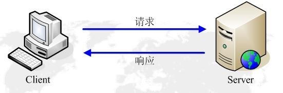
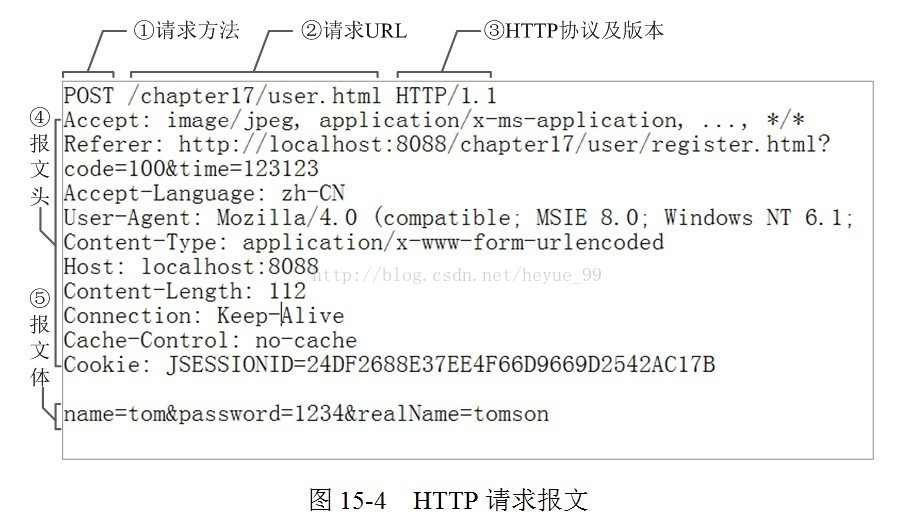
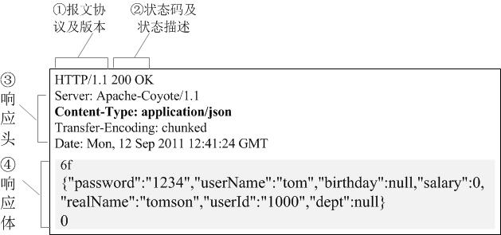
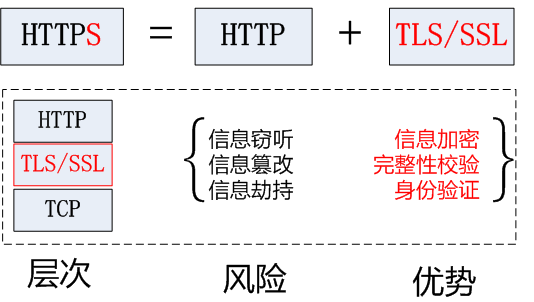

# 第一章 爬虫基础简介

今日概要

-   爬虫简介
-   爬虫分类
-   robots协议
-   反爬机制
-   反反爬机制

今日详情

-   ### 什么是爬虫

      爬虫就是通过编写程序模拟浏览器上网，然后让其去互联网上抓取数据的过程。

-   ### 哪些语言可以实现爬虫

      **1.php**：可以实现爬虫。php被号称是全世界最优美的语言（当然是其自己号称的，就是王婆卖瓜的意思），但是php在实现爬虫中支持多线程和多进程方面做的不好。

      **2.java**：可以实现爬虫。java可以非常好的处理和实现爬虫，是唯一可以与python并驾齐驱且是python的头号劲敌。但是java实现爬虫代码较为臃肿，重构成本较大。

      **3.c、c++**：可以实现爬虫。但是使用这种方式实现爬虫纯粹是是某些人（大佬们）能力的体现，却不是明智和合理的选择。

      **4.python**：可以实现爬虫。python实现和处理爬虫语法简单，代码优美，支持的模块繁多，学习成本低，具有非常强大的框架（scrapy等）且一句难以言表的好！没有但是！

-   ### 爬虫的分类

     1.通用爬虫：

    通用爬虫是搜索引擎（Baidu、Google、Yahoo等）“抓取系统”的重要组成部分。主要目的是将互联网上的网页下载到本地，形成一个互联网内容的镜像备份。 简单来讲就是尽可能的；把互联网上的所有的网页下载下来，放到本地服务器里形成备分，在对这些网页做相关处理(提取关键字、去掉广告)，最后提供一个用户检索接口。 

    -   搜索引擎如何抓取互联网上的网站数据？
        -   门户网站主动向搜索引擎公司提供其网站的url
        -   搜索引擎公司与DNS服务商合作，获取网站的url
        -   门户网站主动挂靠在一些知名网站的友情链接中

  **2.聚焦爬虫：**聚焦爬虫是根据指定的需求抓取网络上指定的数据。例如：获取豆瓣上电影的名称和影评，而不是获取整张页面中所有的数据值。

-   ###  **robots.txt协议**

      \- 如果自己的门户网站中的指定页面中的数据不想让爬虫程序爬取到的话，那么则可以通过编写一个robots.txt的协议文件来约束爬虫程序的数据爬取。robots协议的编写格式可以观察淘宝网的robots（访问www.taobao.com/robots.txt即可）。但是需要注意的是，该协议只是相当于口头的协议，并没有使用相关技术进行强制管制，所以该协议是防君子不防小人。但是我们在学习爬虫阶段编写的爬虫程序可以先忽略robots协议。

-   ### 反爬虫

      \- 门户网站通过相应的策略和技术手段，防止爬虫程序进行网站数据的爬取。

-   ### 反反爬虫

      \- 爬虫程序通过相应的策略和技术手段，破解门户网站的反爬虫手段，从而爬取到相应的数据。


# http 与 https协议

一.HTTP协议

　　1.官方概念：

　　　　HTTP协议是Hyper Text Transfer Protocol（超文本传输协议）的缩写,是用于从万维网（WWW:World Wide Web ）服务器传输超文本到本地浏览器的传送协议。（虽然童鞋们将这条概念都看烂了，但是也没办法，毕竟这就是HTTP的权威官方的概念解释，要想彻底理解，请客观目移下侧......）

　　2.白话概念：

　　　　HTTP协议就是服务器（Server）和客户端（Client）之间进行数据交互（相互传输数据）的一种形式。我们可以将Server和Client进行拟人化，那么该协议就是Server和Client这两兄弟间指定的一种交互沟通方式。大家都看过智取威虎山中杨子荣和土匪们之间说的黑话吧：

　　　　　　- 土匪：蘑菇，你哪路？什么价？（什么人？到哪里去？）

　　　　　　- 杨子荣：哈！想啥来啥，想吃奶来了妈妈，想娘家的人，孩子他舅舅来了。（找同行）

　　　　　　- 杨子荣：拜见三爷！

　　　　　　**- 土匪：天王盖地虎！（你好大的胆！敢来气你的祖宗？）**

　　　　　　***- 杨子荣：宝塔镇河妖！（要是那样，叫我从山上摔死，掉河里淹死。）
　　　　　　- 土匪：野鸡闷头钻，哪能上天王山！（你不是正牌的。）
　　　　　　- 杨子荣：地上有的是米，喂呀，有根底！（老子是正牌的，老牌的。）
　　　　　　- 土匪：拜见过阿妈啦？（你从小拜谁为师？）
　　　　　　- 杨子荣：他房上没瓦，非否非，否非否！（不到正堂不能说。）
　　　　　　- 土匪：嘛哈嘛哈？（以前独干吗？）
　　　　　　- 杨子荣：正晌午说话，谁还没有家？（许大马棒山上。）
　　　　　　- 土匪：好叭哒！（内行，是把老手）
　　　　　　- 杨子荣：天下大耷拉！（不吹牛，闯过大队头。）
　　　　　　- 座山雕：脸红什么？
　　　　　　- 杨子荣：精神焕发！
　　　　　　- 座山雕：怎么又黄了？
　　　　　　- 杨子荣：防冷，涂的蜡！
　　　　　　- 座山雕：晒哒晒哒。（谁指点你来的？）
　　　　　　- 杨子荣：一座玲珑塔，面向青寨背靠沙！（是个道人。）***

　　　　***是不是看到这里，有得童鞋终于知道了传说中的‘天王盖地虎’是真正含义了吧。此黑话其实就是杨子荣和土匪之间进行交互沟通的方式（协议）。***

 

　　***3.HTTP工作原理：***

　　　　***HTTP协议工作于客户端-服务端架构为上。浏览器作为HTTP客户端通过URL向HTTP服务端即WEB服务器发送所有请求。Web服务器根据接收到的请求后，向客户端发送响应信息。***

　　　　　　　　　　　　　　　　　　　　************

 

　　4.HTTP四点注意事项：

　　　　- HTTP允许传输任意类型的数据对象。正在传输的类型由Content-Type加以标记。

　　　　*- HTTP是无连接：无连接的含义是限制每次连接只处理一个请求。服务器处理完客户的请求，并收到客户的应答后，即断开连接。采用这种方式可以节省传输时间。*

　　　　- HTTP是媒体独立的：这意味着，只要客户端和服务器知道如何处理的数据内容，任何类型的数据都可以通过HTTP发送。客户端以及服务器指定使用适合的MIME-type内容类型。

　　　　- HTTP是无状态：HTTP协议是无状态协议。无状态是指协议对于事务处理没有记忆能力。缺少状态意味着如果后续处理需要前面的信息，则它必须重传，这样可能导致每次连接传送的数据量增大。另一方面，在服务器不需要先前信息时它的应答就较快。

　　5.HTTP之URL：

　　　　*HTTP使用统一资源标识符（Uniform Resource Locator, URI）来传输数据和建立连接。URL是一种特殊类型的URI，包含了用于查找某个资源的足够的信息*

URL,全称是Uniform Resource Locator, 中文叫统一资源定位符,是互联网上用来标识某一处资源的地址。以下面这个URL为例，介绍下普通URL的各部分组成：*http://www.aspxfans.com:8080/news/index.asp?boardID=5&ID=24618&page=1#name**从上面的URL可以看出，一个完整的URL包括以下几部分：*

　　　　*- 协议部分：该URL的协议部分为“http：”，这代表网页使用的是HTTP协议。在Internet中可以使用多种协议，如HTTP，FTP等等本例中使用的是HTTP协议。在"HTTP"后面的“//”为分隔符*

　　　　- 域名部分：该URL的域名部分为“www.aspxfans.com”。一个URL中，也可以使用IP地址作为域名使用

　　　　- 端口部分：跟在域名后面的是端口，域名和端口之间使用“:”作为分隔符。端口不是一个URL必须的部分，如果省略端口部分，将采用默认端口

　　　　- 虚拟目录部分：从域名后的第一个“/”开始到最后一个“/”为止，是虚拟目录部分。虚拟目录也不是一个URL必须的部分。本例中的虚拟目录是“/news/”

　　　　- 文件名部分：从域名后的最后一个“/”开始到“？”为止，是文件名部分，如果没有“?”,则是从域名后的最后一个“/”开始到“#”为止，是文件部分，如果没有“？”和“#”，那么从域名后的最后一个“/”开始到结束，都是文件名部分。本例中的文件名是“index.asp”。文件名部分也不是一个URL必须的部分，如果省略该部分，则使用默认的文件名

　　　　- 锚部分：从“#”开始到最后，都是锚部分。本例中的锚部分是“name”。锚部分也不是一个URL必须的部分

　　　　- 参数部分：从“？”开始到“#”为止之间的部分为参数部分，又称搜索部分、查询部分。本例中的参数部分为“boardID=5&ID=24618&page=1”。参数可以允许有多个参数，参数与参数之间用“&”作为分隔符。

　　6.HTTP之Request：

　　　　*客户端发送一个HTTP请求到服务器的请求消息包括以下组成部分：*

**

　　　　报文头：常被叫做请求头，请求头中存储的是该请求的一些主要说明（自我介绍）。服务器据此获取客户端的信息。

　　　　　　　　常见的请求头：

>   　　　　　　　　*accept:浏览器通过这个头告诉服务器，它所支持的数据类型*
>
>   　　　　　　　　*Accept-Charset: 浏览器通过这个头告诉服务器，它支持哪种字符集
>   　　　　　　　　Accept-Encoding：浏览器通过这个头告诉服务器，支持的压缩格式
>   　　　　　　　　Accept-Language：浏览器通过这个头告诉服务器，它的语言环境
>   　　　　　　　　Host：浏览器通过这个头告诉服务器，想访问哪台主机
>   　　　　　　　　If-Modified-Since: 浏览器通过这个头告诉服务器，缓存数据的时间
>   　　　　　　　　Referer：浏览器通过这个头告诉服务器，客户机是哪个页面来的 防盗链
>   　　　　　　　　Connection：浏览器通过这个头告诉服务器，请求完后是断开链接还是何持链接
>   　　　　　　　　X-Requested-With: XMLHttpRequest 代表通过ajax方式进行访问*
>
>   　　　　　　　　User-Agent：请求载体的身份标识

　　　　报文体：常被叫做请求体，请求体中存储的是将要传输/发送给服务器的数据信息。

　　　　

　　7.HTTP之Response：

　　　　服务器回传*一个HTTP响应到客户端的响应消息包括以下组成部分：*

　　　　　　　　**

　　　　状态码：以“清晰明确”的语言告诉客户端本次请求的处理结果。

　　　　　　　　HTTP的响应状态码由5段组成： 

-   >   -   　　1xx 消息，一般是告诉客户端，请求已经收到了，正在处理，别急...
    >
    >   -   　　2xx 处理成功，一般表示：请求收悉、我明白你要的、请求已受理、已经处理完成等信息.
    >   -   　　3xx 重定向到其它地方。它让客户端再发起一个请求以完成整个处理。
    >   -   　　4xx 处理发生错误，责任在客户端，如客户端的请求一个不存在的资源，客户端未被授权，禁止访问等。
    >   -   　　5xx 处理发生错误，责任在服务端，如服务端抛出异常，路由出错，HTTP版本不支持等。

　　　　相应头：响应的详情展示

　　　　　　　　常见的响应头信息：

>   　　　　　　　　　　　　Location: 服务器通过这个头，来告诉浏览器跳到哪里
>   　　　　　　　　　　　　Server：服务器通过这个头，告诉浏览器服务器的型号
>   　　　　　　　　　　　　Content-Encoding：服务器通过这个头，告诉浏览器，数据的压缩格式
>   　　　　　　　　　　　　Content-Length: 服务器通过这个头，告诉浏览器回送数据的长度
>   　　　　　　　　　　　　Content-Language: 服务器通过这个头，告诉浏览器语言环境
>   　　　　　　　　　　　　Content-Type：服务器通过这个头，告诉浏览器回送数据的类型
>   　　　　　　　　　　　　Refresh：服务器通过这个头，告诉浏览器定时刷新
>   　　　　　　　　　　　　Content-Disposition: 服务器通过这个头，告诉浏览器以下载方式打数据
>   　　　　　　　　　　　　Transfer-Encoding：服务器通过这个头，告诉浏览器数据是以分块方式回送的
>   　　　　　　　　　　　　Expires: -1 控制浏览器不要缓存
>   　　　　　　　　　　　　Cache-Control: no-cache
>   　　　　　　　　　　　　Pragma: no-cache

　　　　响应体：根据客户端指定的请求信息，发送给客户端的指定数据

 

二.HTTPS协议　　　

　　1.官方概念：

　　　　HTTPS (Secure Hypertext Transfer Protocol)安全超文本传输协议，HTTPS是在HTTP上建立SSL加密层，并对传输数据进行加密，是HTTP协议的安全版。

　　2.白话概念：

　　　　加密安全版的HTTP协议。

　　　　　　　　　　

　　3.HTTPS采用的加密技术

　　　　3.1 SSL加密技术

SSL采用的加密技术叫做“共享密钥加密”，也叫作“对称密钥加密”，这种加密方法是这样的，比如客户端向服务器发送一条信息，首先客户端会采用已知的算法对信息进行加密，比如MD5或者Base64加密，接收端对加密的信息进行解密的时候需要用到密钥，中间会传递密钥，（加密和解密的密钥是同一个），密钥在传输中间是被加密的。这种方式看起来安全，但是仍有潜在的危险，一旦被窃听，或者信息被挟持，就有可能破解密钥，而破解其中的信息。因此“共享密钥加密”这种方式存在安全隐患：

　　　　　　　　　　

　　　　　　　　　　　　

　3.2 非对称秘钥加密技术

 “非对称加密”使用的时候有两把锁，一把叫做“私有密钥”，一把是“公开密钥”，使用非对象加密的加密方式的时候，服务器首先告诉客户端按照自己给定的公开密钥进行加密处理，客户端按照公开密钥加密以后，服务器接受到信息再通过自己的私有密钥进行解密，这样做的好处就是解密的钥匙根本就不会进行传输，因此也就避免了被挟持的风险。就算公开密钥被窃听者拿到了，它也很难进行解密，因为解密过程是对离散对数求值，这可不是轻而易举就能做到的事。以下是非对称加密的原理图：

　　　　　　　　　　　　　　　

但是非对称秘钥加密技术也存在如下缺点：

　第一个是：如何保证接收端向发送端发出公开秘钥的时候，发送端确保收到的是预先要发送的，而不会被挟持。只要是发送密钥，就有可能有被挟持的风险。

　第二个是：非对称加密的方式效率比较低，它处理起来更为复杂，通信过程中使用就有一定的效率问题而影响通信速度

　　4.https的证书机制

在上面我们讲了非对称加密的缺点，其中第一个就是公钥很可能存在被挟持的情况，无法保证客户端收到的公开密钥就是服务器发行的公开密钥。此时就引出了公开密钥证书机制。数字证书认证机构是客户端与服务器都可信赖的第三方机构。证书的具体传播过程如下：

　1：服务器的开发者携带公开密钥，向数字证书认证机构提出公开密钥的申请，数字证书认证机构在认清申请者的身份，审核通过以后，会对开发者申请的公开密钥做数字签名，然后分配这个已签名的公开密钥，并将密钥放在证书里面，绑定在一起

　　　　　　　　　　　　　　　　

 

 

  

　2：服务器将这份数字证书发送给客户端，因为客户端也认可证书机构，客户端可以通过数字证书中的数字签名来验证公钥的真伪，来确保服务器传过来的公开密钥是真实的。一般情况下，证书的数字签名是很难被伪造的，这取决于认证机构的公信力。一旦确认信息无误之后，客户端就会通过公钥对报文进行加密发送，服务器接收到以后用自己的私钥进行解密。

 

备注：本文中采用了https://www.cnblogs.com/wyq178/p/7129232.html


```
#小笔记

https 的证书机制:
1 服务器携带公开密钥想数字证书认证机构提出公开密钥的申请,
2 数字机构对公开密钥进行数字签名,并将密钥放在证书里面绑定在一起, 再发会给服务器.
3 服务器在接受到客户端请求时候,将数字证书和响应的数据加密发送给客户端.
4 客户端接受到数字证书中的数字签名来验证公钥的真伪, 确人信息无误后, 客户端通过公钥对报文进行加密发送
5 服务器接收到以后用自己的私钥解密数据


```

