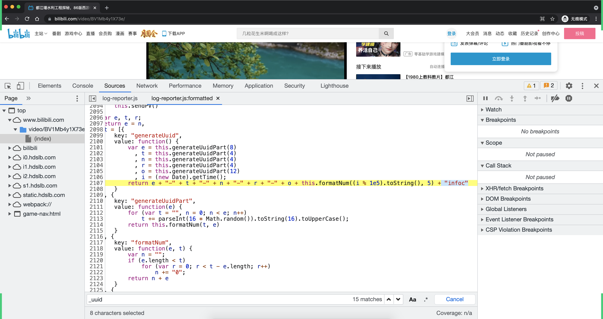
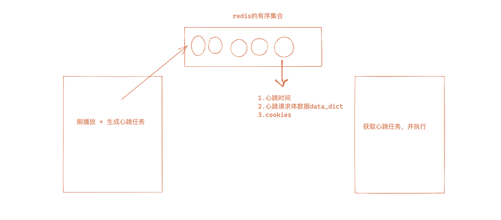

# day03 X站

今日概要：

- 播放量（PC & H5）
- 完播率（PC & H5）


## 1.PC播放量

- click now

  ```
  https://api.bilibili.com/x/click-interface/click/now?jsonp=jsonp
  ```

  ```
  buvid3=B5A768A8-F2B7-8B7A-97B7-376AC0F1616609160infoc; 
  CURRENT_FNVAL=80; 
  _uuid=6B81048E-67AB-B0A6-CBE2-FF185666AA2209999infoc; 
  blackside_state=1; 
  bfe_id=5db70a86bd1cbe8a88817507134f7bb5; 
  sid=6m1jakr0
  ```

- click web h5

  ```
  https://api.bilibili.com/x/click-interface/click/web/h5
  ```

  ```
  aid=629890572&cid=318066735&bvid=BV1Mb4y1X73e&part=1&mid=0&lv=0&ftime=1632399715&stime=1632399715&jsonp=jsonp&type=3&sub_type=0&from_spmid=&auto_continued_play=0&refer_url=&bsource=&spmid=
  ```

  ```
  buvid3=B5A768A8-F2B7-8B7A-97B7-376AC0F1616609160infoc; 
  CURRENT_FNVAL=80; 
  _uuid=6B81048E-67AB-B0A6-CBE2-FF185666AA2209999infoc; 
  blackside_state=1; 
  bfe_id=5db70a86bd1cbe8a88817507134f7bb5; 
  sid=6m1jakr0
  ```

- heartbeat

  ```
  https://api.bilibili.com/x/click-interface/web/heartbeat
  ```

  ```
  aid=629890572&cid=318066735&bvid=BV1Mb4y1X73e&mid=0&csrf=&played_time=0&real_played_time=0&realtime=0&start_ts=1632399715&type=3&dt=2&play_type=1&from_spmid=&spmid=&auto_continued_play=0&refer_url=&bsource=
  ```

  ```
  buvid3=B5A768A8-F2B7-8B7A-97B7-376AC0F1616609160infoc; CURRENT_FNVAL=80; _uuid=6B81048E-67AB-B0A6-CBE2-FF185666AA2209999infoc; blackside_state=1; bfe_id=5db70a86bd1cbe8a88817507134f7bb5; sid=6m1jakr0
  ```

  


### 1.1 click now

- https://api.bilibili.com/x/click-interface/click/now?jsonp=jsonp

- GET

- cookie

  ```
  buvid3=B5A768A8-F2B7-8B7A-97B7-376AC0F1616609160infoc;  访问视频首页得来的cookie
  CURRENT_FNVAL=80;  固定（在访问nav请求时携带）
  _uuid=6B81048E-67AB-B0A6-CBE2-FF185666AA2209999infoc;  内部算法生成（逆向）
  blackside_state=1; 固定（在访问nav请求时携带）
  bfe_id=5db70a86bd1cbe8a88817507134f7bb5;   访问nav地址得来。
  sid=6m1jakr0；  访问v2地址得来。
  ```

**__uuid算法是怎么来的？**



```python
import time
import uuid


def gen_uuid():
    uuid_sec = str(uuid.uuid4())
    time_sec = str(int(time.time() * 1000 % 1e5))
    time_sec = time_sec.ljust(5, "0")

    return "{}{}infoc".format(uuid_sec, time_sec)

_uuid = gen_uuid()
print(_uuid)
```


相关代码：

```python
import requests
import time
import uuid
import requests


def get_video_info(bvid):
    session = requests.Session()
    res = session.get(
        url="https://api.bilibili.com/x/player/pagelist?bvid={}&jsonp=jsonp".format(bvid),
    )
    cid = res.json()['data'][0]['cid']

    res = session.get(
        url="https://api.bilibili.com/x/web-interface/view?cid={}&bvid={}".format(cid, bvid),
    )
    res_json = res.json()
    aid = res_json['data']['aid']
    view_count = res_json['data']['stat']['view']
    # total_duration = res_json['data']['duration'] # 总时长
    duration = res_json['data']['pages'][0]['duration']  # 当前视频长度

    return aid, bvid, cid, view_count, duration


def gen_uuid():
    uuid_sec = str(uuid.uuid4())
    time_sec = str(int(time.time() * 1000 % 1e5))
    time_sec = time_sec.ljust(5, "0")

    return "{}{}infoc".format(uuid_sec, time_sec)


session = requests.Session()

session.headers = {
    "user-agent": "Mozilla/5.0 (Macintosh; Intel Mac OS X 10_15_7) AppleWebKit/537.36 (KHTML, like Gecko) Chrome/93.0.4577.82 Safari/537.36",

}

# 1.访问视频首页，获取 buvid3
url = "https://www.bilibili.com/video/BV1iq4y1p7LS"
res = session.get(
    url=url
)
res.close()
# print(session.cookies.get_dict())

# 2.访问nav，获取 bfe_id（需要cookie中携带 uuid + buvid3 + CURRENT_FNVAL + blackside_state）
session.cookies['_uuid'] = gen_uuid()
session.cookies['CURRENT_FNVAL'] = "80"
session.cookies['blackside_state'] = "1"

res = session.get(
    url='https://api.bilibili.com/x/web-interface/nav'
)
res.close()
# print(session.cookies.get_dict())

# 3.访问v2，获取sid
aid, bvid, cid, view_count, duration = get_video_info("BV1Mb4y1X73e")
# print(aid, bvid, cid, view_count, duration)

res = session.get(
    url="https://api.bilibili.com/x/player/v2",
    params={
        'cid': cid,  # 可以通过一些其他的接口直接获取到
        'aid': aid,
        'bvid': 'BV1Mb4y1X73e',
    }
)
res.close()

# print(session.cookies.get_dict())

# 4.访问click now
res = session.get(
    url="https://api.bilibili.com/x/click-interface/click/now",
    params={
        "jsonp": "jsonp"
    }
)

print(res.text)
# {"code":0,"message":"0","ttl":1,"data":{"now":1632402498}}
```


### 1.2 click

```
https://api.bilibili.com/x/click-interface/click/web/h5
```

```
aid=629890572&cid=318066735&bvid=BV1Mb4y1X73e&part=1&mid=0&lv=0&ftime=1632399715&stime=1632399715&jsonp=jsonp&type=3&sub_type=0&from_spmid=&auto_continued_play=0&refer_url=&bsource=&spmid=
```

```
buvid3=B5A768A8-F2B7-8B7A-97B7-376AC0F1616609160infoc; 
CURRENT_FNVAL=80; 
_uuid=6B81048E-67AB-B0A6-CBE2-FF185666AA2209999infoc; 
blackside_state=1; 
bfe_id=5db70a86bd1cbe8a88817507134f7bb5; 
sid=6m1jakr0
```


```python
import requests
import time
import uuid
import requests
import random


def get_video_info(bvid):
    session = requests.Session()
    res = session.get(
        url="https://api.bilibili.com/x/player/pagelist?bvid={}&jsonp=jsonp".format(bvid),
    )
    cid = res.json()['data'][0]['cid']

    res = session.get(
        url="https://api.bilibili.com/x/web-interface/view?cid={}&bvid={}".format(cid, bvid),
    )
    res_json = res.json()
    aid = res_json['data']['aid']
    view_count = res_json['data']['stat']['view']
    # total_duration = res_json['data']['duration'] # 总时长
    duration = res_json['data']['pages'][0]['duration']  # 当前视频长度

    return aid, cid, view_count, duration


def gen_uuid():
    uuid_sec = str(uuid.uuid4())
    time_sec = str(int(time.time() * 1000 % 1e5))
    time_sec = time_sec.ljust(5, "0")

    return "{}{}infoc".format(uuid_sec, time_sec)


session = requests.Session()

session.headers = {
    "user-agent": "Mozilla/5.0 (Macintosh; Intel Mac OS X 10_15_7) AppleWebKit/537.36 (KHTML, like Gecko) Chrome/93.0.4577.82 Safari/537.36",

}

# 1.访问视频首页，获取 buvid3
url = "https://www.bilibili.com/video/BV1iq4y1p7LS"
res = session.get(
    url=url
)
res.close()
# print(session.cookies.get_dict())

# 2.访问nav，获取 bfe_id（需要cookie中携带 uuid + buvid3 + CURRENT_FNVAL + blackside_state）
session.cookies['_uuid'] = gen_uuid()
session.cookies['CURRENT_FNVAL'] = "80"
session.cookies['blackside_state'] = "1"

res = session.get(
    url='https://api.bilibili.com/x/web-interface/nav'
)
res.close()
# print(session.cookies.get_dict())

# 3.访问v2，获取sid
bvid = "BV1Mb4y1X73e"
aid, cid, view_count, duration = get_video_info(bvid)
# print(aid, bvid, cid, view_count, duration)

res = session.get(
    url="https://api.bilibili.com/x/player/v2",
    params={
        'cid': cid,  # 可以通过一些其他的接口直接获取到
        'aid': aid,
        'bvid': bvid,
    }
)
res.close()

# print(session.cookies.get_dict())

# 4.访问click now
res = session.get(
    url="https://api.bilibili.com/x/click-interface/click/now",
    params={
        "jsonp": "jsonp"
    }
)

# print(res.text)
# ctime = res.json()['data']['now']
ctime = int(time.time())

# 5.click web h5
res = session.post(
    url="https://api.bilibili.com/x/click-interface/click/web/h5",
    data={
        "aid": aid,
        "cid": cid,
        "bvid": bvid,
        "part": "1",
        "mid": "0",
        "lv": "0",
        "ftime": ctime - random.randint(10, 200),  # 浏览器首次打开时间
        "stime": ctime,
        "jsonp": "jsonp",
        "type": "3",
        "sub_type": "0",
        "from_spmid": "",
        "auto_continued_play": "0",
        "refer_url": "",
        "bsource": "",
        "spmid": ""
    }
)

print(res.text)
print(session.cookies.get_dict())
```


### 1.3 首次心跳

```
https://api.bilibili.com/x/click-interface/web/heartbeat
```

```
aid=629890572&cid=318066735&bvid=BV1Mb4y1X73e&mid=0&csrf=&played_time=0&real_played_time=0&realtime=0&start_ts=1632399715&type=3&dt=2&play_type=1&from_spmid=&spmid=&auto_continued_play=0&refer_url=&bsource=
```

```
buvid3=B5A768A8-F2B7-8B7A-97B7-376AC0F1616609160infoc; CURRENT_FNVAL=80; _uuid=6B81048E-67AB-B0A6-CBE2-FF185666AA2209999infoc; blackside_state=1; bfe_id=5db70a86bd1cbe8a88817507134f7bb5; sid=6m1jakr0
```


示例代码：

```python
import requests
import time
import uuid
import requests
import random


def get_video_info(bvid):
    session = requests.Session()
    res = session.get(
        url="https://api.bilibili.com/x/player/pagelist?bvid={}&jsonp=jsonp".format(bvid),
    )
    cid = res.json()['data'][0]['cid']

    res = session.get(
        url="https://api.bilibili.com/x/web-interface/view?cid={}&bvid={}".format(cid, bvid),
    )
    res_json = res.json()
    aid = res_json['data']['aid']
    view_count = res_json['data']['stat']['view']
    # total_duration = res_json['data']['duration'] # 总时长
    duration = res_json['data']['pages'][0]['duration']  # 当前视频长度

    return aid, cid, view_count, duration


def gen_uuid():
    uuid_sec = str(uuid.uuid4())
    time_sec = str(int(time.time() * 1000 % 1e5))
    time_sec = time_sec.ljust(5, "0")

    return "{}{}infoc".format(uuid_sec, time_sec)


session = requests.Session()

session.headers = {
    "user-agent": "Mozilla/5.0 (Macintosh; Intel Mac OS X 10_15_7) AppleWebKit/537.36 (KHTML, like Gecko) Chrome/93.0.4577.82 Safari/537.36",

}

# 1.访问视频首页，获取 buvid3
url = "https://www.bilibili.com/video/BV1iq4y1p7LS"
res = session.get(
    url=url
)
res.close()
# print(session.cookies.get_dict())

# 2.访问nav，获取 bfe_id（需要cookie中携带 uuid + buvid3 + CURRENT_FNVAL + blackside_state）
session.cookies['_uuid'] = gen_uuid()
session.cookies['CURRENT_FNVAL'] = "80"
session.cookies['blackside_state'] = "1"

res = session.get(
    url='https://api.bilibili.com/x/web-interface/nav'
)
res.close()
# print(session.cookies.get_dict())

# 3.访问v2，获取sid
bvid = "BV1Mb4y1X73e"
aid, cid, view_count, duration = get_video_info(bvid)
# print(aid, bvid, cid, view_count, duration)

res = session.get(
    url="https://api.bilibili.com/x/player/v2",
    params={
        'cid': cid,  # 可以通过一些其他的接口直接获取到
        'aid': aid,
        'bvid': bvid,
    }
)
res.close()

# print(session.cookies.get_dict())

# 4.访问click now
res = session.get(
    url="https://api.bilibili.com/x/click-interface/click/now",
    params={
        "jsonp": "jsonp"
    }
)

# print(res.text)
# ctime = res.json()['data']['now']
start_ts = int(time.time())

# 5.click web h5
res = session.post(
    url="https://api.bilibili.com/x/click-interface/click/web/h5",
    data={
        "aid": aid,
        "cid": cid,
        "bvid": bvid,
        "part": "1",
        "mid": "0",
        "lv": "0",
        "ftime": start_ts - random.randint(10, 200),  # 浏览器首次打开时间
        "stime": start_ts,
        "jsonp": "jsonp",
        "type": "3",
        "sub_type": "0",
        "from_spmid": "",
        "auto_continued_play": "0",
        "refer_url": "",
        "bsource": "",
        "spmid": ""
    }
)

res.close()

# 6.首次心跳
res = session.post(
    url="https://api.bilibili.com/x/click-interface/web/heartbeat",
    data={
        "aid": aid,
        "cid": cid,
        "bvid": bvid,
        "mid": "0",
        "csrf": "",
        "played_time": "0",
        "real_played_time": "0",
        "realtime": "0",
        "start_ts": start_ts,
        "type": "3",
        "dt": "2",
        "play_type": "1",
        "from_spmid": "",
        "spmid": "",
        "auto_continued_play": "0",
        "refer_url": "",
        "bsource": ""
    }
)

print(res.text)

```


### 1.4 代码梳理

```python
import requests
import uuid
import time
import random

import requests


def get_video_info(bvid):
    session = requests.Session()
    res = session.get(
        url="https://api.bilibili.com/x/player/pagelist?bvid={}&jsonp=jsonp".format(bvid),
    )
    cid = res.json()['data'][0]['cid']

    res = session.get(
        url="https://api.bilibili.com/x/web-interface/view?cid={}&bvid={}".format(cid, bvid),
    )
    res_json = res.json()
    aid = res_json['data']['aid']
    view_count = res_json['data']['stat']['view']
    # total_duration = res_json['data']['duration'] # 总时长
    duration = res_json['data']['pages'][0]['duration']  # 当前视频长度

    return aid, bvid, cid, view_count, duration


class PcAnonymous(object):
    """ 匿名pc播放"""

    def __init__(self, aid, bvid, cid, view_count, duration, proxies):
        self.aid = aid
        self.bvid = bvid
        self.cid = cid
        self.view_count = view_count
        self.duration = duration

        self.session = requests.Session()
        self.session.proxies = proxies
        self.session.headers = {
            "user-agent": "Mozilla/5.0 (Macintosh; Intel Mac OS X 10_15_7) AppleWebKit/537.36 (KHTML, like Gecko) Chrome/93.0.4577.82 Safari/537.36",
        }

        self._uuid = self.gen_uuid()
        self.start_ts = None

    def gen_uuid(self):
        uuid_sec = str(uuid.uuid4())
        time_sec = str(int(time.time() * 1000 % 1e5))
        time_sec = time_sec.ljust(5, "0")

        return "{}{}infoc".format(uuid_sec, time_sec)

    def gen_buvid3(self):
        url = "https://www.bilibili.com/video/{}".format(self.bvid)
        res = self.session.get(
            url=url
        )
        res.close()

    def gen_bfe_id(self):
        self.session.cookies['_uuid'] = self._uuid
        self.session.cookies['CURRENT_FNVAL'] = "80"
        self.session.cookies['blackside_state'] = "1"
        res = self.session.get(
            url='https://api.bilibili.com/x/web-interface/nav'
        )
        res.close()

    def gen_sid(self):
        res = self.session.get(
            url="https://api.bilibili.com/x/player/v2",
            params={
                'cid': self.cid,  # 可以通过一些其他的接口直接获取到
                'aid': self.aid,
                'bvid': self.bvid,
            }
        )
        res.close()

    def click_now(self):
        res = self.session.get(
            url="https://api.bilibili.com/x/click-interface/click/now",
            params={
                "jsonp": "jsonp"
            }
        )
        self.start_ts = res.json()['data']['now']

    def click_web_h5(self):
        self.start_ts = start_ts = int(time.time())
        res = self.session.post(
            url="https://api.bilibili.com/x/click-interface/click/web/h5",
            data={
                "aid": self.aid,
                "cid": self.cid,
                "bvid": self.bvid,
                "part": "1",
                "mid": "0",
                "lv": "0",
                "ftime": start_ts - random.randint(10, 200),  # 浏览器首次打开时间
                "stime": start_ts,
                "jsonp": "jsonp",
                "type": "3",
                "sub_type": "0",
                "from_spmid": "",
                "auto_continued_play": "0",
                "refer_url": "",
                "bsource": "",
                "spmid": ""
            }
        )

        res.close()

    def first_heartbeat(self):
        res = self.session.post(
            url="https://api.bilibili.com/x/click-interface/web/heartbeat",
            data={
                "aid": self.aid,
                "cid": self.cid,
                "bvid": self.bvid,
                "mid": "0",
                "csrf": "",
                "played_time": "0",
                "real_played_time": "0",
                "realtime": "0",
                "start_ts": self.start_ts,
                "type": "3",
                "dt": "2",
                "play_type": "1",
                "from_spmid": "",
                "spmid": "",
                "auto_continued_play": "0",
                "refer_url": "",
                "bsource": ""
            }
        )

        res.close()

    def run(self):
        try:
            self.gen_buvid3()
            self.gen_bfe_id()
            self.gen_sid()
            # self.click_now()
            self.click_web_h5()
            self.first_heartbeat()
        except Exception as e:
            print("请求异常：", e)


def handler():
    # 1.用户输入视频buvid
    buvid = "BV1Mb4y1X73e"

    # 2.获取视频信息
    aid, bvid, cid, view_count, duration = get_video_info(buvid)

    # 3.播放
    pc = PcAnonymous(aid, bvid, cid, view_count, duration, None)
    pc.run()


if __name__ == '__main__':
    handler()
```


### 1.5 代理IP

- 普通代理，3块钱500个IP
- 隧道代理，20/天（5个并发）

注意：即使有了代理IP也不是万能的。

```python
import requests


def get_tunnel_proxies():
    proxy_host = 'tps135.kdlapi.com:15818'
    proxy_username = 't12909832214236290'
    proxy_pwd = 'sdfsdfsdffsd'

    return {
        "http": "http://{}:{}@{}".format(proxy_username, proxy_pwd, proxy_host),
        "https": "https://{}:{}@{}".format(proxy_username, proxy_pwd, proxy_host),
    }

proxies = get_tunnel_proxies()


while True:
    res = requests.get(
        url= "....",
        proxies=proxies
    )
    res.close()
```


## 2.H5播放量

pc：

```
https://api.bilibili.com/x/click-interface/click/now?jsonp=jsonp
https://api.bilibili.com/x/click-interface/click/web/h5
https://api.bilibili.com/x/click-interface/web/heartbeat
```

h5：

```
https://api.bilibili.com/x/report/click/now?jsonp=jsonp
https://api.bilibili.com/x/click-interface/click/h5
https://api.bilibili.com/x/report/web/heartbeat
```

H5版本相比较于PC而言，其实：

- url差异
- 参数差异

```python
import requests
import uuid
import time
import random

import requests


def get_video_info(bvid):
    session = requests.Session()
    res = session.get(
        url="https://api.bilibili.com/x/player/pagelist?bvid={}&jsonp=jsonp".format(bvid),
    )
    cid = res.json()['data'][0]['cid']

    res = session.get(
        url="https://api.bilibili.com/x/web-interface/view?cid={}&bvid={}".format(cid, bvid),
    )
    res_json = res.json()
    aid = res_json['data']['aid']
    view_count = res_json['data']['stat']['view']
    # total_duration = res_json['data']['duration'] # 总时长
    duration = res_json['data']['pages'][0]['duration']  # 当前视频长度

    return aid, bvid, cid, view_count, duration


class H5Anonymous(object):
    """ 匿名h5播放"""

    def __init__(self, aid, bvid, cid, view_count, duration, proxies):
        self.aid = aid
        self.bvid = bvid
        self.cid = cid
        self.view_count = view_count
        self.duration = duration

        self.session = requests.Session()
        self.session.proxies = proxies
        self.session.headers = {
            "user-agent": "Mozilla/5.0 (Linux; Android 5.0; SM-G900P Build/LRX21T) AppleWebKit/537.36 (KHTML, like Gecko) Chrome/93.0.4577.82 Mobile Safari/537.36",
        }

        self._uuid = self.gen_uuid()
        self.start_ts = None

    def gen_uuid(self):
        uuid_sec = str(uuid.uuid4())
        time_sec = str(int(time.time() * 1000 % 1e5))
        time_sec = time_sec.ljust(5, "0")

        return "{}{}infoc".format(uuid_sec, time_sec)

    def gen_buvid3(self):
        url = "https://m.bilibili.com/video/{}".format(self.bvid)
        res = self.session.get(
            url=url
        )
        res.close()

    def gen_bfe_id(self):
        res = self.session.get(
            url='https://api.bilibili.com/x/web-interface/nav'
        )
        res.close()

    def gen_sid(self):
        self.session.cookies['_uuid'] = self._uuid
        res = self.session.get(
            url="https://api.bilibili.com/x/player/v2",
            params={
                'cid': self.cid,  # 可以通过一些其他的接口直接获取到
                'aid': self.aid,
                'ep_id': 0,
                'season_id': 0,
            }
        )
        res.close()

    def click_now(self):
        res = self.session.get(
            url="https://api.bilibili.com/x/report/click/now",
            params={
                "jsonp": "jsonp"
            }
        )
        self.start_ts = res.json()['data']['now']

    def click_h5(self):
        self.start_ts = start_ts = int(time.time())
        res = self.session.post(
            url="https://api.bilibili.com/x/click-interface/click/h5",
            data={
                "aid": self.aid,
                "cid": self.cid,
                "bvid": self.bvid,
                "part": "1",
                "did": self.session.cookies['sid'],
                "mid": "",
                "lv": "0",
                "ftime": start_ts - random.randint(10, 200),  # 浏览器首次打开时间
                "stime": start_ts,
                "jsonp": "jsonp",
                "type": "3",
                "sub_type": "0",
                "from_spmid": "undefined",
                "spmid": "333.401.0.0"
            }
        )

        res.close()

    def first_heartbeat(self):
        res = self.session.post(
            url="https://api.bilibili.com/x/report/web/heartbeat",
            data={
                "aid": self.aid,
                "cid": self.cid,
                "bvid": self.bvid,
                "csrf": "",
                "played_time": "0",
                "realtime": "0",
                "start_ts": self.start_ts,
                "type": "3",
                "dt": "7",
                "play_type": "1",
                "spmid": "333.401.0.0",
                "refer": "https://m.bilibili.com/video/{}".format(self.bvid),
            }
        )

        res.close()

    def run(self):
        try:
            self.gen_buvid3()
            self.gen_bfe_id()
            self.gen_sid()
            # self.click_now()
            self.click_h5()
            self.first_heartbeat()
        except Exception as e:
            print("请求异常：", e)


def handler():
    # 1.用户输入视频buvid
    buvid = "BV1Mb4y1X73e"

    # 2.获取视频信息
    aid, bvid, cid, view_count, duration = get_video_info(buvid)

    # 3.播放
    h5 = H5Anonymous(aid, bvid, cid, view_count, duration, None)
    h5.run()


if __name__ == '__main__':
    handler()

```


## 3.PC完播率和播放时长

```python
import requests
import uuid
import time
import random

import requests


def get_video_info(bvid):
    session = requests.Session()
    res = session.get(
        url="https://api.bilibili.com/x/player/pagelist?bvid={}&jsonp=jsonp".format(bvid),
    )
    cid = res.json()['data'][0]['cid']

    res = session.get(
        url="https://api.bilibili.com/x/web-interface/view?cid={}&bvid={}".format(cid, bvid),
    )
    res_json = res.json()
    aid = res_json['data']['aid']
    view_count = res_json['data']['stat']['view']
    # total_duration = res_json['data']['duration'] # 总时长
    duration = res_json['data']['pages'][0]['duration']  # 当前视频长度

    return aid, bvid, cid, view_count, duration


class PcAnonymous(object):
    """ 匿名pc播放"""

    def __init__(self, aid, bvid, cid, view_count, duration, proxies):
        self.aid = aid
        self.bvid = bvid
        self.cid = cid
        self.view_count = view_count
        self.duration = duration

        self.session = requests.Session()
        self.session.proxies = proxies
        self.session.headers = {
            "user-agent": "Mozilla/5.0 (Macintosh; Intel Mac OS X 10_15_7) AppleWebKit/537.36 (KHTML, like Gecko) Chrome/93.0.4577.82 Safari/537.36",
        }

        self._uuid = self.gen_uuid()
        self.start_ts = None

    def gen_uuid(self):
        uuid_sec = str(uuid.uuid4())
        time_sec = str(int(time.time() * 1000 % 1e5))
        time_sec = time_sec.ljust(5, "0")

        return "{}{}infoc".format(uuid_sec, time_sec)

    def gen_buvid3(self):
        url = "https://www.bilibili.com/video/{}".format(self.bvid)
        res = self.session.get(
            url=url
        )
        res.close()

    def gen_bfe_id(self):
        self.session.cookies['_uuid'] = self._uuid
        self.session.cookies['CURRENT_FNVAL'] = "80"
        self.session.cookies['blackside_state'] = "1"
        res = self.session.get(
            url='https://api.bilibili.com/x/web-interface/nav'
        )
        res.close()

    def gen_sid(self):
        res = self.session.get(
            url="https://api.bilibili.com/x/player/v2",
            params={
                'cid': self.cid,  # 可以通过一些其他的接口直接获取到
                'aid': self.aid,
                'bvid': self.bvid,
            }
        )
        res.close()

    def click_now(self):
        res = self.session.get(
            url="https://api.bilibili.com/x/click-interface/click/now",
            params={
                "jsonp": "jsonp"
            }
        )
        self.start_ts = res.json()['data']['now']

    def click_web_h5(self):
        self.start_ts = start_ts = int(time.time())
        res = self.session.post(
            url="https://api.bilibili.com/x/click-interface/click/web/h5",
            data={
                "aid": self.aid,
                "cid": self.cid,
                "bvid": self.bvid,
                "part": "1",
                "mid": "0",
                "lv": "0",
                "ftime": start_ts - random.randint(10, 200),  # 浏览器首次打开时间
                "stime": start_ts,
                "jsonp": "jsonp",
                "type": "3",
                "sub_type": "0",
                "from_spmid": "",
                "auto_continued_play": "0",
                "refer_url": "",
                "bsource": "",
                "spmid": ""
            }
        )

        res.close()

    def first_heartbeat(self):
        res = self.session.post(
            url="https://api.bilibili.com/x/click-interface/web/heartbeat",
            data={
                "aid": self.aid,
                "cid": self.cid,
                "bvid": self.bvid,
                "mid": "0",
                "csrf": "",
                "played_time": "0",
                "real_played_time": "0",
                "realtime": "0",
                "start_ts": self.start_ts,
                "type": "3",
                "dt": "2",
                "play_type": "1",
                "from_spmid": "",
                "spmid": "",
                "auto_continued_play": "0",
                "refer_url": "",
                "bsource": ""
            }
        )

        res.close()

    def heartbeat(self):
        # loop=20，中间心跳15s一次
        # div=5，最后一次心跳
        # div=0 ?
        loop_count, div = divmod(self.duration, 15)
        if div == 0:
            div = 15
            loop_count -= 1
        # 根据loop_count循环多少次，中间心跳15s一次
        for i in range(1, loop_count + 1):
            interval_time = i * 15
            time.sleep(15)
            data_dict = {
                "aid": self.aid,
                "cid": self.cid,
                "bvid": self.bvid,
                "mid": "0",
                "csrf": "",
                "played_time": interval_time,
                "real_played_time": interval_time,
                "realtime": interval_time,
                "start_ts": self.start_ts,
                "type": "3",
                "dt": "2",
                "play_type": "0",
                "from_spmid": "",
                "spmid": "",
                "auto_continued_play": "0",
                "refer_url": "",
                "bsource": ""
            }

            res = self.session.post(
                url="https://api.bilibili.com/x/click-interface/click/web/h5",
                data=data_dict
            )
            res.close()

        # 再根据div执行最后一次心跳
        time.sleep(div)
        data_dict = {
            "aid": self.aid,
            "cid": self.cid,
            "bvid": self.bvid,
            "mid": "0",
            "csrf": "",
            "played_time": -1,
            "real_played_time": self.duration,
            "realtime": self.duration,
            "start_ts": self.start_ts,
            "type": "3",
            "dt": "2",
            "play_type": "4",
            "from_spmid": "",
            "spmid": "",
            "auto_continued_play": "0",
            "refer_url": "",
            "bsource": ""
        }
        res = self.session.post(
            url="https://api.bilibili.com/x/click-interface/click/web/h5",
            data=data_dict
        )
        res.close()

    def run(self):
        try:
            self.gen_buvid3()
            self.gen_bfe_id()
            self.gen_sid()
            # self.click_now()
            self.click_web_h5()
            self.first_heartbeat()

            # 继续后续心跳
            self.heartbeat()
        except Exception as e:
            print("请求异常：", e)


def handler():
    # 1.用户输入视频buvid
    buvid = "BV1Mb4y1X73e"

    # 2.获取视频信息
    aid, bvid, cid, view_count, duration = get_video_info(buvid)

    # 3.播放
    pc = PcAnonymous(aid, bvid, cid, view_count, duration, None)
    pc.run()


if __name__ == '__main__':
    handler()

```


这个代码的效率很低，后期可以利用队列提升效率。



## 4.H5完播

```python
import requests
import uuid
import time
import random

import requests


def get_video_info(bvid):
    session = requests.Session()
    res = session.get(
        url="https://api.bilibili.com/x/player/pagelist?bvid={}&jsonp=jsonp".format(bvid),
    )
    cid = res.json()['data'][0]['cid']

    res = session.get(
        url="https://api.bilibili.com/x/web-interface/view?cid={}&bvid={}".format(cid, bvid),
    )
    res_json = res.json()
    aid = res_json['data']['aid']
    view_count = res_json['data']['stat']['view']
    # total_duration = res_json['data']['duration'] # 总时长
    duration = res_json['data']['pages'][0]['duration']  # 当前视频长度

    return aid, bvid, cid, view_count, duration


class H5Anonymous(object):
    """ 匿名h5播放"""

    def __init__(self, aid, bvid, cid, view_count, duration, proxies):
        self.aid = aid
        self.bvid = bvid
        self.cid = cid
        self.view_count = view_count
        self.duration = duration

        self.session = requests.Session()
        self.session.proxies = proxies
        self.session.headers = {
            "user-agent": "Mozilla/5.0 (Linux; Android 5.0; SM-G900P Build/LRX21T) AppleWebKit/537.36 (KHTML, like Gecko) Chrome/93.0.4577.82 Mobile Safari/537.36",
        }

        self._uuid = self.gen_uuid()
        self.start_ts = None

    def gen_uuid(self):
        uuid_sec = str(uuid.uuid4())
        time_sec = str(int(time.time() * 1000 % 1e5))
        time_sec = time_sec.ljust(5, "0")

        return "{}{}infoc".format(uuid_sec, time_sec)

    def gen_buvid3(self):
        url = "https://m.bilibili.com/video/{}".format(self.bvid)
        res = self.session.get(
            url=url
        )
        res.close()

    def gen_bfe_id(self):
        res = self.session.get(
            url='https://api.bilibili.com/x/web-interface/nav'
        )
        res.close()

    def gen_sid(self):
        self.session.cookies['_uuid'] = self._uuid
        res = self.session.get(
            url="https://api.bilibili.com/x/player/v2",
            params={
                'cid': self.cid,  # 可以通过一些其他的接口直接获取到
                'aid': self.aid,
                'ep_id': 0,
                'season_id': 0,
            }
        )
        res.close()

    def click_now(self):
        res = self.session.get(
            url="https://api.bilibili.com/x/report/click/now",
            params={
                "jsonp": "jsonp"
            }
        )
        self.start_ts = res.json()['data']['now']

    def click_h5(self):
        self.start_ts = start_ts = int(time.time())
        res = self.session.post(
            url="https://api.bilibili.com/x/click-interface/click/h5",
            data={
                "aid": self.aid,
                "cid": self.cid,
                "bvid": self.bvid,
                "part": "1",
                "did": self.session.cookies['sid'],
                "mid": "",
                "lv": "0",
                "ftime": start_ts - random.randint(10, 200),  # 浏览器首次打开时间
                "stime": start_ts,
                "jsonp": "jsonp",
                "type": "3",
                "sub_type": "0",
                "from_spmid": "undefined",
                "spmid": "333.401.0.0"
            }
        )

        res.close()

    def first_heartbeat(self):
        res = self.session.post(
            url="https://api.bilibili.com/x/report/web/heartbeat",
            data={
                "aid": self.aid,
                "cid": self.cid,
                "bvid": self.bvid,
                "csrf": "",
                "played_time": "0",
                "realtime": "0",
                "start_ts": self.start_ts,
                "type": "3",
                "dt": "7",
                "play_type": "1",
                "spmid": "333.401.0.0",
                "refer": "https://m.bilibili.com/video/{}".format(self.bvid),
            }
        )

        res.close()

    def heartbeat(self):

        loop_count, div = divmod(self.duration, 15)
        if div == 0:
            div = 15
            loop_count -= 1

        for i in range(1, loop_count + 1):
            interval_time = i * 15
            time.sleep(15)
            data_dict = {
                "aid": self.aid,
                "cid": self.cid,
                "bvid": self.bvid,
                "csrf": "",
                "played_time": interval_time,
                "realtime": interval_time,
                "start_ts": self.start_ts,
                "type": "3",
                "dt": "7",
                "play_type": "0",
                "spmid": "333.401.0.0",
                "refer": "https://m.bilibili.com/video/{}".format(self.bvid),
            }

            res = self.session.post(
                url="https://api.bilibili.com/x/report/web/heartbeat",
                data=data_dict
            )
            res.close()

        time.sleep(div)

        data_dict = {
            "aid": self.aid,
            "cid": self.cid,
            "bvid": self.bvid,
            "csrf": "",
            "played_time": -1,
            "realtime": self.duration,
            "start_ts": self.start_ts,
            "type": "3",
            "dt": "7",
            "play_type": "0",
            "spmid": "333.401.0.0",
            "refer": "https://m.bilibili.com/video/{}".format(self.bvid),
        }

        res = self.session.post(
            url="https://api.bilibili.com/x/report/web/heartbeat",
            data=data_dict
        )
        res.close()
        
    def run(self):
        try:
            self.gen_buvid3()
            self.gen_bfe_id()
            self.gen_sid()
            # self.click_now()
            self.click_h5()
            self.first_heartbeat()

            # 心跳
            self.heartbeat()
        except Exception as e:
            print("请求异常：", e)


def handler():
    # 1.用户输入视频buvid
    buvid = "BV1Mb4y1X73e"

    # 2.获取视频信息
    aid, bvid, cid, view_count, duration = get_video_info(buvid)

    # 3.播放
    h5 = H5Anonymous(aid, bvid, cid, view_count, duration, None)
    h5.run()


if __name__ == '__main__':
    handler()
```


这个代码的效率很低，后期可以利用队列提升效率。


问题：

- IP不同，不会造成问题。

- B站中的小漏洞。

  ```python
  - H5和PC中都间隔15s一次心跳（5分钟的视频）
  - APP发现（目前可用）
  	- 开头
      - 结束
      
  start_ts + 心跳间隔，那我能不能直接把完播的数据发送过去。
  ```

  


## 总结

- 目前：600 ~ 1000播放。
- 更多：模拟人操作。


