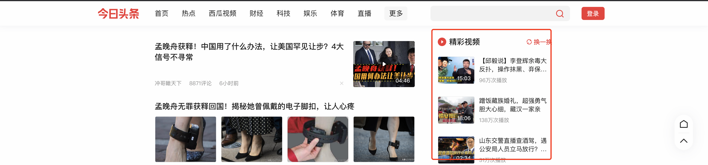

# day04 XX头条

今日概要：

- 分类资讯
- 获取评论
- 热门视频


提示：xx头条中主要要解决的是 `signature`。


## 1.前戏

```html
<!DOCTYPE html>
<html lang="en">
<head>
    <meta charset="UTF-8">
    <title>Title</title>
</head>
<body>

<script>
    function Foo(name, age) {
        this.name = name;
        this.age = age;

        function _0987123() {
            console.log(arguments); // 11,22,33 ; 77,88,99   this
            return 666
        }

        this["sign"] = _0987123;

        this._0001 = function () {
            console.log("传过来的所有参数：",arguments);
            return 666
        }
    }

    var obj = new Foo("武沛齐", 20)
    console.log(obj.name);
    console.log(obj.age);
    var v1 = obj._0001(); // 可以调用

    // 直接执行
    var v2 = obj.sign(11,22,33);
    console.log('v2=', v2);

    // call执行函数，可以让函数名动态起来。
    // var v3 = obj.sign.call();
    var v3 = obj['sign'].call(obj,77,88,99);
    console.log('call v3=', v3);

    // 参数问题
    var v4 = obj._0001(11,22,33,44); // 可以调用

</script>

</body>
</html>

```


## 2.分类资讯

```
v1 = 条件 ? 值1 : 值2 

```

```javascript
null === (n=window.xxx)

# 1. n=window.xxx
# 2. True或flase
```

```javascript
1 || 2   		-> 1
false || 9		-> 9
```

```javascript
var o = (null === (n = window.byted_acrawler) || void 0 === n ? void 0 : null === (a = n.sign) || void 0 === a ? void 0 : a.call(n, i)) || "";

n = window.byted_acrawler
a = n.sign

# n=window.byted_acrawler
# i = {url:https://www.toutiao.com/api/pc/list/feed?channel_id=0&max_behot_time=1632576973&category=pc_profile_recommend}
结果 = window.byted_acrawler.sign.call(window.byted_acrawler, i)
var o = 结果 || "";
```

```
window.byted_acrawler.sign.call(window.byted_acrawler, i)
window.byted_acrawler.sign(i)
```

- 思路1：探究sign函数内容到底是怎么实现？如果能搞明白，就用Python直接去实现这个算法。
- 思路2：用Python代码去直接调用JS。
  - 执行某个JS，会在window中赋值 byted_acrawler 对象。
  - window.byted_acrawler.sign(i)


### 2.1 本次HTML尝试（成功）

```html
<!DOCTYPE html>
<html lang="en">
<head>
    <meta charset="UTF-8">
    <title>Title</title>
</head>
<body>
<script src="sdk.js"></script>
<script>
    // _02B4Z6wo00f01Tg50AwAAIDAxnWsPKnLkL04EdSAAC9Eed
    var url = "https://www.toutiao.com/api/pc/list/feed?channel_id=3189398957&max_behot_time=1632572648&category=pc_profile_channel";
    let sign = window.byted_acrawler.sign({url: url});
    console.log(sign);
</script>
</body>
</html>

```


### 2.2 Python编译JS

### 2.2.1 node.js 编译

示例1：

```python
import os
import subprocess

os.environ["NODE_PATH"] = "/usr/local/lib/node_modules/"  # 根据自己的操作系统去修改
signature = subprocess.getoutput('node local1.js')
print("结果是--->", signature)
```

```js
// 导入一个第三方包
function func(prev) {
    return prev + 'wupeiqi666'; // 微信：wupeiqi666
}
let data = func("微信：");
console.log(data)
```

示例2：

```python
"""
1. 安装node.js         （Python + pip install xxxx)
2. npm install 模块名 -g

"""
import os
import subprocess

os.environ["NODE_PATH"] = "/usr/local/lib/node_modules/"
signature = subprocess.getoutput('node local2.js "123" ')
print("结果是--->", signature)

```

```
function func(prev) {
    return prev + 'wupeiqi666'
}

let v1 = process.argv[2]

let data = func(v1);
console.log(data)
```


注意：参数为了防止断开，可以用引号包裹。


### 2.2.2 execjs 编译

execjs是Python的模块，方便去执行并编译JS（node.js）

```python
import execjs
import os

os.environ["NODE_PATH"] = "/usr/local/lib/node_modules/"
with open('local.js', mode='r', encoding='utf-8') as f:
    js = f.read()

JS = execjs.compile(js)

sign = JS.call("func", "微信")
print(sign)

```

```
// 导入一个第三方包
function func(prev) {
    return prev + 'wupeiqi666'; // 微信：wupeiqi666
}
```


### 2.2.3 编译`acrawler.js`

直接编译报错，因为缺少浏览器必备环境。


在node.js中补充这个环境，编译应该就能通过了，如何在node.js补充呢？

- jsdom用来补充浏览器环境。

  ```
  npm install node-gyp@latest sudo npm explore -g npm -- npm i node-gyp@latest
  npm install jsdom -g
  
  # /usr/local/lib/node_modules/
  ```

- 安装 `canvas`（后续编译 `acrawler.js`执行报错，提示加入的）

  ```
  npm install canvas -g
  ```


环境补充好之后，如果你想要让本地编译 `acrawler.js`，接下来你需要 调整 `acrawler.js`代码。【根据jsdom语法 + JS功底】。


见代码：【6.编译acrawler.js】


## 3.获取评论

```python
import requests

res = requests.get(
    url="https://www.toutiao.com/article/v2/tab_comments/?aid=24&app_name=toutiao_web&offset=20&count=20&group_id=7011724095981240835&item_id=7011724095981240835",
    headers={
        "user-agent": "Mozilla/5.0 (Macintosh; Intel Mac OS X 10_15_7) AppleWebKit/537.36 (KHTML, like Gecko) Chrome/93.0.4577.82 Safari/537.36"
    }
)

print(res.text)

```


## 4.精彩视频




- 请求时：签名
- 返回数据：部分数据加密。
  - base64
  - aes加密
  - rsa加密


```python
import os
import json
import requests
import subprocess
from base64 import b64decode
from urllib.parse import urlencode

import execjs


def get_signature(url):
    # /usr/local/lib/node_modules/jsdom
    os.environ["NODE_PATH"] = "/usr/local/lib/node_modules/"
    signature = subprocess.getoutput('node acrawler.js "{}"'.format(url))
    return signature.strip()


def get_signature_execjs(url):
    os.environ["NODE_PATH"] = "/usr/local/lib/node_modules/"
    with open('acrawler.js', mode='r', encoding='utf-8') as f:
        js = f.read()
    js_compile = execjs.compile(js)

    sign = js_compile.call("get_sign", url)
    return sign


def run():
    base_url = "https://www.toutiao.com/api/pc/list/feed"

    params = {
        "offset": 32,
        "channel_id": "94349549395",
        "max_behot_time": "0",
        "category": "pc_profile_channel",
    }
    url = "{}?{}".format(base_url, urlencode(params))

    # sign = get_signature(url)
    sign = get_signature_execjs(url)
    params['_signature'] = sign

    res = requests.get(
        url=base_url,
        params=params,
        headers={
            'user-agent': "Mozilla/5.0 (Macintosh; Intel Mac OS X 10_15_7) AppleWebKit/537.36 (KHTML, like Gecko) Chrome/93.0.4577.82 Safari/537.36"
        }
    )

    data_list = res.json()['data']
    for item in data_list:
        raw_data = item['raw_data']
        data_string = b64decode(raw_data).decode('utf-8')
        row_dict = json.loads(data_string)
        print(row_dict)
        print('------')


if __name__ == '__main__':
    run()
```


## 总结

- Python执行js（补充环境） + 头条案例


## 你的签名短？

```
_02B4Z6wo00f01uoArNQAAIDDbG5.MQnse6LqIqhAANvc33
```

```
_02B4Z6wo00f01tDFOMAAAIDDLolE8CUQfoLQ4TxAANWLn4VBAeBPTPb7cfaf6MX.kve65aq1VNkA43r9EK1LW0zq2mieL35TblOGj6CixmF6FMK-il9aTtNzFmIq3r0I9YBAk0kWpJhxDNck18
```


- 头条的用法

  ```
  不是直接：var sign = global.byted_acrawler.sign({url: un_sign_url})
  
  - global.byted_acrawler.init()，定时器发送 getInfo请求，返回一个cookie:
  	tt_scid = "nzyEtQzz62OY7uAAQXx4NM0fIM7ZTbvEIz1a07kYe9yZTRNOC2wB6GSPzw8HN2l1109b"
  	
  - 再在他的代码内部global.byted_acrawler.sign({url: un_sign_url})生成签名。
  	- 内部签名判断，没有 tt_scid，则直接签名 -> 短签名。
  	- 内部签名判断，有 tt_scid，根据 tt_scid 再去调用内部算法生成一个动态的值。
  ```

- 我们调用（投机取巧）

  ```
  global.byted_acrawler.sign({url: un_sign_url})生成签名
  ```

  

目前：

- 算法，头条 + 西瓜。
- 抖音，更新。


## 疑问：

- 完全复制那个url来请求好像也是啥也不返回。

  - 时效性
  - 不能修改

- 打完断点 在console 控制台 调用window.xxxx.sign 那个函数生成的签名去测试应该也是可以的吧

- 老师你那个url path部分怎么会有个offset=0这个东西 我看一下 往后滑的请求页面是没有这个东西的

  ```
  第一页：
      offset=0&
      max_behot_time=0&
      channel_id=94349549395&
      category=pc_profile_channel
      
      返回的数据：
      	最后一条：1632583158
  
  第二页：
      max_behot_time: 1632574758
  	channel_id: 3189398957
      category: pc_profile_channel
  ```

  ```
  传数字页数，数据量越大翻页越，limit offset（页码越大、效率越低）
  ```

  


