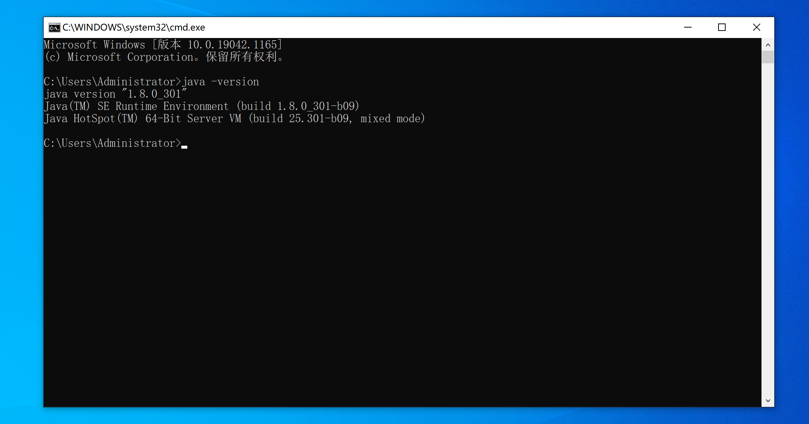

# day06 Java开发基础

- Python，解释型的编程语言。

  ```python
  # hello.py
  
  print("你好呀")
  ```

  ```
  >>>python.exe hello.py
  ```

- Java，编译型&解释型的特定。

  - 学习Java语法，编写Java。
  - 编译 & 解释，环境搭建。


## 1.环境搭建

- **JRE**，（ Java Runtime Envrionment ），Java 运行时环境。

  ```
  含JVM和运行必备的类库。
  
  电脑上想要运行java程序，就必须安装JRE。
  ```

- **JDK**，（ Java Development Kit ），Java开发工具。【包含JRE】【Java开发】

  ```
  含JRE 和 开发必备的工具。
  工具包含：编译工具javac.exe 和 运行工具java.exe
  想要开发Java应用程序，就必须安装JDK。
  ```


接下来，我们就来下载和安装吧。

```
JDK8（jdk 1.8）版本（目前最新已到17）

官方地址：https://www.oracle.com/java/technologies/downloads/#java8
百度云盘：
```

安装好之后需要配置下环境变量。





关于mac系统，自带JDK：


```
/Library/Java/JavaVirtualMachines 
```


JDK安装成功之后就可以编写Java代码并编译 & 运行。

- 编写 Hello.java文件

  ```java
  public class Hello {
      public static void main(String[] args) {
          System.out.println("Hello World");
      }
  }
  ```

- 打开终端编译并运行

  ```
  >>>javac Hello.java
  >>>java Hello
  ```

  


编写代码建议大家使用IDE（集成开发环境）来提供开发效率。

- 下载 2020.1 版本。  https://www.jetbrains.com/idea/

- 激活：https://www.zhihu.com/zvideo/1254435808801050624

  ```
  工具见课后 代码和笔记。
  ```


-------------------------

以上就是环境搭建。


## 2.初识Java

代码的初步分析： Hello.java

```java
public class Hello {
    public static void main(String[] args) {
        System.out.println("Hello World");
    }
}
```

- 文件名

  ```
  一个文件中最多只能有一个public类，文件名需要与此public类一致。
  如果文件中有多个类，文件名与public类名一致。
  如果文件中有多个类 且 无public类，文件名可与任意类名一致。
  ```

- 类名

  ```
  一般首字母大写，例如：Hello、UserInfo
  ```

- 类修饰符：public、（不写）default

  ```java
  // public，表示此类可以被任意类调用，例如：
  src
  ├── Hello.java
  └── utils
      └── Request.java
  
  
  // Request.Java文件
  package utils;
  
  public class Request {
      public void show(){
          System.out.println("哈哈哈哈哈");
      }
  }
  
  
  // Hello.java文件
  import utils.Request;
  
  public class Hello {
      // 程序入口
      public static void main(String[] args) {
          // 根据类创建了一个对象
          Request req = new Request();
          // 对象.show()
          req.show();
      }
  }
  ```

  ```java
  // default，表示此类只能在当前包被调用，例如：
  src
  ├── Hello.java
  └── utils
      ├── Helper.java
      └── Request.java
  
  // Request.Java文件
  package utils;
  class Request {
      public void show(){
          System.out.println("哈哈哈哈哈");
      }
  }
  
  // Helper.java文件
  package utils;
  import utils.Request;
  public class Helper {
      public void doAction(){
          Request req = new Request();
          req.show();
      }
  }
  
  // Hello.java文件
  import utils.Helper;
  public class Hello {
      public static void main(String[] args) {
          Helper req = new Helper();
          req.doAction();
      }
  }
  ```

- 类成员修饰符：public、private、protected、default（大前提：要先就有访问类的权限）

  - public，只要有权访问类，在任意情况下都可以调用。

  - private，只允许自己类调用，在其他类中无法调用到。

    ```java
    class Other {
        private static void doSomething() {
            System.out.println("DoSomething");
        }
    
        public static void doing() {
            System.out.println("doing");
            doSomething();
        }
    }
    
    public class Hello {
    
        private static void show() {
            System.out.println("show");
        }
    
        public static void main(String[] args) {
            show(); // 可以
            // Other.doSomething(); // 不可以
            Other.doing(); // 可以
        }
    }
    ```

  - protected，对同一包内的类和所有**子类可见（不是同一个包）**。

    ```java
    package utils;
    
    public class Helper {
    
        protected void doIt(){
        }
        
        void doAction(){
        }
    }
    ```

    ```java
    package xx;
    import utils.Helper;
    
    public class Db extends Helper {
        public void exec(){
            doIt(); // 可以访问
            // doAction(); 无法访问
        }
    }
    ```

  - default，在同一包内可见。

- 静态成员，无序实例化直接通过类就能调用。

  ```java
  class Person {
      /**
       * 静态方法
       */
      public static void f1() {
          System.out.println("f1");
      }
  
  
      public String name;
      public Integer age;
  
      /**
       * 构造方法
       *
       * @param n1 姓名
       * @param n2 年龄
       */
      public Person(String n1, int n2) {
          this.name = n1;
          this.age = n2;
      }
  
      /**
       * 实例方法
       */
      public void f2() {
          System.out.println("f2" + this.name);
      }
  
  }
  
  public class Hello {
  
      public static void main(String[] args) {
          Person.f1();
  
          Person p1 = new Person("武沛齐", 999);
          p1.f2();
      }
  }
  ```

- 返回值，方法有返回值就必须要在定义是指定。

  ```java
  class Person {
  	
      // void，无返回值。
      public static void f1() {
          System.out.println("f1");
      }
  
      // 字符串类型返回值
      public static String f2() {
          return "哈哈哈哈";
      }
      
      public static int f3() {
          return 12;
      }
  
  }
  
  public class Hello {
  
      public static void main(String[] args) {
          Person.f1();
  
          String res = Person.f2();
      }
  }
  
  ```

- 参数，Java中传参时需要指定类型和形参。

  ```java
  class Person {
  
      public static void f1(String name,int age) {
          System.out.println("f1");
      }
  
  }
  
  public class Hello {
  
      public static void main(String[] args) {
          Person.f1("武沛齐",888);
      }
  }
  ```

  

## 3.注释

```java
/**
 * 类的注释
 * 类的注释
 */
public class Hello {

    /**
     * 方法的注释
     * @param args 参数...
     */
    public static void main(String[] args) {
        // 1.单行注释
        
        /*
        2.多行注释
        多行注释
         */
    }
}
```


## 4.变量

Java中定义变量的格式：`变量类型 变量名 = 值;`

```java

public class Hello {

    public static void main(String[] args) {
        String name = "武沛齐";
        int age = 18;
        String firstName = "xxx"; // python first_name

        String email;
        email = "wupeiqi@live.com";

        String hobby = null;
        hobby = "玩游戏";
    }
}
```


## 6.输入和输出

```java
import java.util.Scanner;

public class Hello {

    public static void main(String[] args) {

        // 输入
        Scanner input = new Scanner(System.in);
        System.out.print("用户：");
        String name = input.nextLine();
        
        System.out.print("年龄：");
        int age = input.nextInt(); // 将输入的内容转化弄成int类型
        
        String message = String.format("姓名：%s，年龄:%d",name,age);
        System.out.println(message);
    }
}
```

```java
import java.util.Scanner;

public class Hello {

    public static void main(String[] args) {
        Scanner input = new Scanner(System.in);
        System.out.print("用户：");
        String name = input.nextLine();

        System.out.print("密码：");
        String pwd = input.nextLine();

        // name.equals("武沛齐") && pwd.equals("123")
        if (name == "武沛齐" && pwd == "123") {
            System.out.println("登录成功");
        } else {
            System.out.println("登录失败");
        }

    }
}
```


## 5.条件语句

```java
import java.util.Scanner;

public class Hello {

    public static void main(String[] args) {
        Scanner input = new Scanner(System.in);
        System.out.print("请输入年龄：");
        int age = input.nextInt();
        
        if (age < 18) {
            System.out.println("少年");
        } else if (age < 40) {
            System.out.println("大叔");
        } else {
            System.out.println("老汉");
        }
    }
}
```


```java
import java.util.Scanner;

public class Hello {

    public static void main(String[] args) {
        Scanner input = new Scanner(System.in);
        System.out.print("请输入序号：");
        int num = input.nextInt(); // 任意数字

        switch (num) {
            case 1:
                System.out.println("话费查询");
                break;
            case 2:
                System.out.println("电话预约");
                if (1 == 1) {
                    System.out.println("哈哈哈哈");
                }
                break;
            default:
                System.out.println("输入错误");
                break;
        }
    }
}
```


## 6.循环语句

while

```java
import java.util.Scanner;

public class Hello {

    public static void main(String[] args) {
        int count = 0;
        while (count < 3) {
            Scanner input = new Scanner(System.in);
            System.out.print("用户：");
            String name = input.nextLine();

            System.out.print("密码：");
            String pwd = input.nextLine();

            // name == "武沛齐" && pwd == "123"
            if (name.equals("武沛齐") && pwd.equals("123")) {
                System.out.println("登录成功");
                break;
            } else {
                System.out.println("登录失败");
            }
            count += 1;
        }

    }
}
```


do while

```java
import java.util.Scanner;

public class Hello {

    public static void main(String[] args) {
        Scanner input = new Scanner(System.in);
        System.out.print("请输入序号：");
        int num = input.nextInt();

        do {
            System.out.println("符合规范");
        } while (num < 3);
    }
}
```


for循环

```java
public class Hello {

    public static void main(String[] args) {
        for (int i = 0; i < 10; i++) {
            System.out.println(i); // continue/break
        }
    }
}
```


```java
public class Hello {

    public static void main(String[] args) {

        String[] dataArray = {"武沛齐", "Alex", "日天", "张开"}; // 列表
        for (String item : dataArray) {
            System.out.println(item);
        }
        for(int i=0;i<dataArray.length;i++){
            String item = dataArray[i];
            System.out.println(item);
        }
    }
}
```


注意：循环中也可以使用break和continue关键字（与Python中的功能相同）。


## 7. 数据类型相关


### 7.1 整数类型

- byte，字节		  【1字节】表示范围：-128 ~ 127 即：`-2^7 ~ 2^7 -1  `  
- short，短整型    【2字节】表示范围：-32768 ~ 32767
- int，整型             【4字节】表示范围：-2147483648 ~ 2147483647
- long，长整型      【8字节】表示范围：-9223372036854775808 ~ 9223372036854775807

```java
public class Hello {

    public static void main(String[] args) {
        byte v1 = 32;
        short v2 = 10000;
        int v3 = 22221331;
        long v4 = 554534353424L;
    }
}
```

```java
public class Hello {

    public static void main(String[] args) {

        short v1 = 32;

        // 强制类型转换
        int v2 = (int)v1;
        System.out.println(v2);
    }
}
```


**特别提醒**：在逆向时经常会看到byte数组表示字符串。

```java
import java.util.Arrays;

public class Hello {

    public static void main(String[] args) {
        // byte数组，每个元素都是一个字节 [11,22,33,44,55]
        byte[] data = {97, 105, 100, 61, 50, 52, 54, 51, 56, 55, 53, 55, 49, 38, 97, 117, 116, 111, 95, 112, 108, 97, 121, 61, 48, 38, 99, 105, 100, 61, 50, 56, 57, 48, 48, 56, 52, 52, 49, 38, 100, 105, 100, 61, 75, 82, 69, 104, 69, 83, 77, 85, 74, 104, 56, 116, 70, 67, 69, 86, 97, 82, 86, 112, 69, 50, 116, 97, 80, 81, 107, 55, 87, 67, 104, 67, 74, 103, 38, 101, 112, 105, 100, 61, 48, 38, 102, 116, 105, 109, 101, 61, 49, 54, 50, 55, 49, 48, 48, 57, 51, 55, 38, 108, 118, 61, 48, 38, 109, 105, 100, 61, 48, 38, 112, 97, 114, 116, 61, 49, 38, 115, 105, 100, 61, 48, 38, 115, 116, 105, 109, 101, 61, 49, 54, 50, 55, 49, 48, 52, 51, 55, 50, 38, 115, 117, 98, 95, 116, 121, 112, 101, 61, 48, 38, 116, 121, 112, 101, 61, 51}; // 这里应该表示的是一个字符串。

        String dataString = new String(data);
        System.out.println("字节数组转换为字符串：" + dataString);

        
        
        // 字符串也可以转换成字节
        byte[] res = dataString.getBytes();
        System.out.println(Arrays.toString(res));

        try{
            String name = "武沛齐";
            // v1 = [-50, -28, -59, -26, -58, -21] Java中
            // v2 = [206, 228, 197, 230, 198, 235] Python中
            byte[] v1 = name.getBytes("GBK");
            System.out.println(Arrays.toString(v1));

            byte[] v2 = name.getBytes("UTF-8"); // 默认
            System.out.println(Arrays.toString(v2));
        }catch (Exception e){

        }
    }
}
```

```python
# Python脚本，方便你们以后使用。
byte_list = [-50, -28, -59, -26, -58, -21]

bs = bytearray() # python字节数组
for item in byte_list:
    if item < 0:
        item = item + 256
    bs.append(item)
str_data = bs.decode('gbk')  # data = bytes(bs)
print(str_data)
```


**进制转换**：在java中除了十进制以外，其他的进制都是用字符串来表示。

```java
public class Hello {

    public static void main(String[] args) {
        // 十进制转其他
        int n = 18;
        
        String v2 = Integer.toBinaryString(n); // 二进制，字符串形式
        String v8 = Integer.toOctalString(n);
        String v16 = Integer.toHexString(n);
        String v3 = Integer.toString(n,3);
        
        String dataStr = Integer.toString(n); // "18"
        
        // 其他转十进制
        String data = "10010";
        int v10 = Integer.parseInt(data,2);
        
        // 其实：Integer.toString 和 Integer.parseInt 其实就是整型和字符串之间的转换。
    }
}
```


### 7.2 字符

```java
char v1 = '武'; // 字符
String v2 = "武沛齐"; // 字符串
```


字符，char		【2字节】对应的是unicode中的码点，用于存储单个字符。

```java
public class Hello {

    public static void main(String[] args) {
        String text = "alex是个大傻B";

        char v1 = text.charAt(1);
        System.out.println(v1); // l

        char v2 = text.charAt(2);
        System.out.println(v2); // e

        char v3 = '中'; // 单引号
        System.out.println(v3);

        char v4 = 'A'; // 单引号   65
        char v5 = '#'; // 单引号   35
        
        int v6 = v4 + v5; // 十进制 100
        System.out.println(v6); //100

        char v7 = (char)v6;
        System.out.println(v7); // d
    }
}
```


### 7.3 字符串

```java
import java.io.UnsupportedEncodingException;

public class Hello {

    public static void main(String[] args) throws UnsupportedEncodingException {
        String v1 = "武沛齐";
        String v2 = new String("武沛齐");

        // char[] data = new char[]{'武', '沛', '齐'};
        // char[] data = {'武', '沛', '齐'};
        // String v3 = new String(data);
        String v3 = new String(new char[]{'武', '沛', '齐'});

        String v4 = new String(new byte[]{-26, -83, -90, -26, -78, -101, -23, -67, -112});
        String v5 = new String(new byte[]{-50, -28, -59, -26, -58, -21},"GBK");
		
        // 上面都是不可变  "alex" + "SB" + "xx" + "xxxx"
        // 可变字符串 "name=wupeiqi"
        StringBuilder sb = new StringBuilder(); 
        sb.append("name");
        sb.append("=");
        sb.append("wupeiqi");
        sb.append("&");
        sb.append("age=");
        sb.append("999");
        // String v6 = sb.toString(); //name=wupeqi&age=999
        String v6 = new String(sb);

        StringBuffer strBuffer = new StringBuffer(); // 线程安全（多线程）
        strBuffer.append("name");
        strBuffer.append("=");
        strBuffer.append("wupeiqi");
        strBuffer.append("&");
        strBuffer.append("age=");
        strBuffer.append("999");
        // String v6 = strBuffer.toString();
        String v7 = new String(strBuffer);


        
        // 其他类型的方法执行，直接返回一个字符串
        String v8 = Integer.toString(123123);
        String v9 = Double.toString(3.14);
        
        // 或这
        String v10 = String.valueOf(123);
    }
}
```


对于字符串，内部提供了很多方便的方法对他进行操作，例如：

```java
public class Hello {

    public static void main(String[] args) {
        String origin = "alex是个大DB";

        char v1 = origin.charAt(5); // 指定字符
        int len = origin.length();  // 长度
        for (int i = 0; i < len; i++) {
            char item = origin.charAt(i);
        }

        String v2 = origin.trim(); // 去除空白

        String v3 = origin.toLowerCase(); // 小写
        String v4 = origin.toUpperCase(); // 大写

        String[] v5 = origin.split("是"); // 分割

        String v6 = origin.replace("D", "S"); // 替换

        String v7 = origin.substring(2, 6);  // 子字符串

        boolean v8 = origin.equals("alex是个大SB");

        boolean v9 = origin.contains("el");

        boolean v10 = origin.startsWith("a");

        String v11 = origin.concat("哈哈哈");
    }
}
```


关于StringBuilder，在Java开发中经常会使用，用于对字符串进行拼接处理。

```java
public class Hello {

    public static void main(String[] args) {
        StringBuilder sb = new StringBuilder();
        sb.append("name=");
        sb.append("wupeiqi");
        sb.append("age=");
        sb.append("18");
        sb.append("&");
		
        // 删除指定位置的字符
        sb.deleteCharAt(sb.length()-1); // name=wupeiqiage=18
        
        sb.insert(12,"&"); // name=wupeiqi&age=18
        String dataString = sb.toString();

        System.out.println(dataString); //name=wupeiqi&age=18
    }
}
```


### 7.4 数组

数据，具有 相同数据类型且定长 的元素集合。【定长】

```java
import java.util.Arrays;

public class Hello {

    public static void main(String[] args) {
        int[] numArray = new int[3];
        numArray[0] = 11;
        numArray[1] = 22;
        numArray[2] = 33;
        System.out.println(Arrays.toString(numArray));

        String[] names = new String[]{"武沛齐", "alex", "张开"};
        System.out.println(Arrays.toString(names));

        short[] number = {66, 99};
        System.out.println(Arrays.toString(number));

        for (int i = 0; i < names.length; i++) {
            String item = names[i];
            System.out.println(item);
        }

        for (String item : names) {
            System.out.println(item);
        }

    }
}
```


```java
public class Hello {

    public static void main(String[] args) {
        /*
            多维数据
              data=[
                    [11,22],
                    [33,44]
                    [55,66]
                ]
         */
        int[][] numArray = new int[3][2];
        numArray[0] = new int[]{11, 22};
        numArray[1] = new int[]{33, 44};
        numArray[2] = new int[]{55, 66};
    }
}
```


### 7.5 List系列

List是一个接口，常见实现这个接口的有两个类，用于实现变长的数组。

- ArrayList，底层是连续的位置存储，类似于数组。（内部自动扩容）。

  ```
  11,22,333
  ```

- LinkedList，底层是基于链表来存储。


ArrayList示例：

```java
import java.util.ArrayList;
import java.util.Arrays;

public class Hello {

    public static void main(String[] args) {
		
        // ArrayList，内部存放的是混合数据类型。
        // ArrayList<String> data = new ArrayList<String>();
        ArrayList data = new ArrayList();
        data.add("武沛齐");
        data.add("alex");
        data.add(666);
        data.add("tony");
		
        String value = data.get(1);
        
        // String value = (String) data.get(1);
        Object temp = data.get(1);
        String value = (String) temp; // 转化可转换的数据
        System.out.println(value);


        int xo = (int) data.get(2);
        System.out.println(xo);

        data.set(0, "哈哈哈哈");
        System.out.println(data);

        data.remove("eric");
        data.remove(0);
        System.out.println(data);

        int size = data.size();
        System.out.println(size);

        boolean exists = data.contains("武沛齐");
        System.out.println(exists);


        for (Object item : data) {
            System.out.println(item);
        }

        for (int i = 0; i < data.size(); i++) {
            Object item = data.get(i);
            System.out.println(item);
        }
    }
}
```


```java
import java.util.LinkedList;

public class Hello {

    public static void main(String[] args) {
        LinkedList<Integer> v1 = new LinkedList<Integer>();
        v1.add(11);
        v1.add(22);

        LinkedList<Object> v2 = new LinkedList<Object>();
        v2.add("有阪深雪");
        v2.add("大桥未久");
        v2.add(666);
        v2.add(123);

        //v2.remove(1);
        //v2.remove("路飞");

        v2.set(2, "苍老师");
        v2.push("哈哈哈");
        // v2.addFirst(11);


        for (int i = 0; i < v2.size(); i++) {
            Object item = v2.get(i);
            System.out.println(item);
        }

        for (Object item : v2) {
            System.out.println(item);
        }
    }
}
```


关于迭代器：

```java
import java.util.*;

public class Hello {

    public static void main(String[] args) {

        ArrayList s1 = new ArrayList();
        s1.add("P站");
        s1.add("B站");
        s1.add("A站");


        Iterator it = s1.iterator(); // 迭代器
        while (it.hasNext()) {
            String item = (String) it.next();
            System.out.println(item);
        }
    }
}
```


关于foreach

```java
import java.util.*;

public class Hello {

    public static void main(String[] args) {

        ArrayList s1 = new ArrayList();
        s1.add("P站");
        s1.add("B站");
        s1.add("A站");

		// JDK8
        s1.forEach(item -> {
            System.out.println(item);
        });
    }
}

```


关于 List、ArrayList、LinkedList

```java
import java.util.ArrayList;
import java.util.LinkedList;
import java.util.List;

public class Hello {

    public static void main(String[] args) {
        List<Integer> v1 = new LinkedList<Integer>();
        v1.add(11);
        v1.add(22);

        List v2 = new ArrayList();
        v2.add(11);
        v2.add("哈哈哈");

        List<Integer> v3 = new ArrayList<Integer>();
        v1.add(11);
        v1.add(22);
    }
}
```


直接创建：

```java
import java.util.ArrayList;
import java.util.LinkedList;
import java.util.List;

public class Hello {

    public static void main(String[] args) {
        List<Integer> v1 = new LinkedList<Integer>() {
            {
                add(11);
                add(22);
            }
        };

    }
}
```


### 7.6 Set系列

Set是一个接口，常见实现这个接口的有两个类，用于实现不重复的多元素集合。

- HashSet，去重，无序。
- TreeSet，去重，内部默认排序（同类型元素，无法比较大小）。

```java
import java.util.*;

public class Hello {

    public static void main(String[] args) {
        // Set s1 = new HashSet();
        // HashSet<String> s1 = new HashSet<String>();
        HashSet s1 = new HashSet();
        s1.add("P站");
        s1.add("B站");
        s1.add("A站");
        s1.add("P站");
        s1.add(666);
        System.out.println(s1); // [B站, A站, P站,666]

        HashSet s2 = new HashSet(){
            {
                add("东京热");
                add("东北热");
                add("南京热");
            }
        };
        System.out.println(s2); // [B站, A站, P站]


        // Set s2 = new TreeSet();
        // TreeSet<String> s2 = new TreeSet<String>();
        TreeSet s3 = new TreeSet();
        s3.add("P站");
        s3.add("B站");
        s3.add("A站");
        s3.add("P站");
        // s3.add(666); //不可以

        System.out.println(s3); // [B站, A站, P站]

        TreeSet s4 = new TreeSet(){
            {
                add("P站");
                add("B站");
                add("A站");
                add("P站");
            }
        };
        System.out.println(s4); // [B站, A站, P站]

    }
}
```


关于交并差：

```java
import java.util.*;

public class Hello {

    public static void main(String[] args) {
        // Set s1 = new HashSet();
        HashSet s1 = new HashSet();
        s1.add("P站");
        s1.add("B站");
        s1.add("A站");
        s1.remove("P站");
        System.out.println(s1); // [B站, A站, P站]

        boolean exists = s1.contains("B站");
        System.out.println(exists);

        HashSet s2 = new HashSet();
        s2.add(123);
        s2.add(456);


        HashSet v1 = new HashSet();
        v1.addAll(s1);
        v1.retainAll(s2); // 交集
        System.out.println(v1);


        HashSet v2 = new HashSet();
        v2.addAll(s1);
        v2.addAll(s2); // 并集
        System.out.println(v2);

        HashSet v3 = new HashSet();
        v3.addAll(s1);
        v3.removeAll(s2); // 差集 s1 - s2
        System.out.println(v3);


        HashSet v4 = new HashSet();
        v4.addAll(s2);
        v4.removeAll(s1); // 差集 s2 - s1
        System.out.println(v4);
    }
}
```


关于循环获取：

```java
import java.util.*;

public class Hello {

    public static void main(String[] args) {

        TreeSet s1 = new TreeSet();
        s1.add("P站");
        s1.add("B站");
        s1.add("A站");

        for (Object item : s1) {
            System.out.println(item);
        }

        // 不用这种循环
        for(int i=0;i<s1.size();i++){
            // Object item = s1[i]     不支持
            // Object item = s1.get(i) 不支持
        }
    }
}
```


关于迭代器：

```java
import java.util.*;

public class Hello {

    public static void main(String[] args) {

        TreeSet s1 = new TreeSet();
        s1.add("P站");
        s1.add("B站");
        s1.add("A站");


        Iterator it = s1.iterator();
        while (it.hasNext()) {
            String item = (String) it.next();
            System.out.println(item);
        }
    }
}
```


关于foreach

```java
import java.util.*;

public class Hello {

    public static void main(String[] args) {

        TreeSet s1 = new TreeSet();
        s1.add("P站");
        s1.add("B站");
        s1.add("A站");


        s1.forEach(item -> {
            System.out.println(item);
        });
    }
}
```


### 7.7 Map系列

Map是一个接口，常见实现这个接口的有两个类，用于存储键值对。

- HashMap，无序。
- TreeMap，默认根据key排序。

```java
import java.util.*;

public class Hello {

    public static void main(String[] args) {
        HashMap h1 = new HashMap();
        h1.put("name","alex");
        h1.put("age",18);
        h1.put("hobby","男");
        System.out.println(h1); // {gender=男, name=alex, age=18}

        HashMap<String,String> h2 = new HashMap<String,String>();
        h2.put("name","alex");
        h2.put("age","18");
        h2.put("hobby","男");
        System.out.println(h2); // {gender=男, name=alex, age=18}


        HashMap<String,String> h3 = new HashMap<String,String>(){
            {
                put("name","alex");
                put("age","18");
                put("hobby","男");
            }
        };
        System.out.println(h3); // {gender=男, name=alex, age=18}


        Map h4 = new HashMap();
        h4.put("name","alex");
        h4.put("age",18);
        h4.put("hobby","男");
        System.out.println(h4); // {gender=男, name=alex, age=18}
    }
}
```

```java
import java.util.*;

public class Hello {

    public static void main(String[] args) {
        TreeMap h1 = new TreeMap(); // 改为了TreeMap
        h1.put("name","alex");
        h1.put("age",18);
        h1.put("hobby","男");
        System.out.println(h1); // {age=18, hobby=男, name=alex}

        TreeMap<String,String> h2 = new TreeMap<String,String>();
        h2.put("name","alex");
        h2.put("age","18");
        h2.put("hobby","男");
        System.out.println(h2); // {age=18, hobby=男, name=alex}


        TreeMap<String,String> h3 = new TreeMap<String,String>(){
            {
                put("name","alex");
                put("age","18");
                put("hobby","男");
            }
        };
        System.out.println(h3); // {age=18, hobby=男, name=alex}


        Map h4 = new TreeMap();
        h4.put("name","alex");
        h4.put("age",18);
        h4.put("hobby","男");
        System.out.println(h4); // {age=18, hobby=男, name=alex}
    }
}
```


常见操作：

```java
import java.util.*;

public class Hello {

    public static void main(String[] args) {
        TreeMap h1 = new TreeMap(); // 改为了TreeMap
        h1.put("name", "alex");
        h1.put("age", "18");
        h1.put("hobby", "男");
        h1.put("hobby", "女人");

        h1.remove("age");
        int size = h1.size();

        Object value = h1.get("name"); // 不存在，返回null
        System.out.println(value);

        boolean existsKey = h1.containsKey("age");
        boolean existsValue = h1.containsValue("alex");

        h1.replace("name", "李杰");
        System.out.println(h1);


        // 循环: 示例1
        Set<Map.Entry<String, String>> s1 = h1.entrySet();
        Iterator it1 = s1.iterator();
        while (it1.hasNext()) {
            Map.Entry<String, String> entry = (Map.Entry<String, String>) it1.next();
            String k = (String) entry.getKey();
            String v = (String) entry.getValue();
        }

        // 循环: 示例2
        Set s2 = h1.entrySet();
        Iterator it2 = s2.iterator();
        while (it2.hasNext()) {
            Map.Entry entry = (Map.Entry) it2.next();
            String k = (String) entry.getKey();
            String v = (String) entry.getValue();
        }

        // 循环: 示例3
        TreeMap<String, String> h2 = new TreeMap<String, String>(); // 改为了TreeMap
        h2.put("name", "alex");
        h2.put("age", "18");
        for (Map.Entry<String, String> entry : h2.entrySet()) {
            String k = entry.getKey();
            String v = entry.getValue();
        }

        // 循环: 示例4
        TreeMap h3 = new TreeMap(); // 改为了TreeMap
        h3.put("name", "alex");
        h3.put("age", 18);
        for (Object entry : h3.entrySet()) {
            Map.Entry<String, Object> entryMap = (Map.Entry<String, Object>) entry;
            String k = entryMap.getKey();
            Object v = entryMap.getValue();
            if (v instanceof Integer) {
                System.out.println("数字：" + Integer.toString((Integer) v));
            } else if (v instanceof String) {
                System.out.println("字符串：" + (String) v);
            } else {
                System.out.println("未知类型：" + v.toString());
            }
        }

        // 循环: 示例5（JDK8）
        TreeMap h4 = new TreeMap(); // 改为了TreeMap
        h4.put("name", "alex");
        h4.put("age", 18);
        h4.forEach((k, v) -> {
            System.out.print(k + "：" + v + "   v的类型是：");
            System.out.println(v.getClass());
        });
    }
}
```


上述就是关于Java中常见数据类型的操作，了解上述的内容之后，再来看B站逆向的代码案例，例如：


## 8.面向对象相关（一）


### 8.1 类和对象

```java
class Person {

    // 实例变量
    public String name;
    public Integer age;
    public String email;

    // 构造方法1
    public Person() {
        this.name = "Eric";
        this.age = 99999;
    }

    // 构造方法2
    public Person(String name, Integer age) {
        this.name = name;
        this.age = age;
        this.email = "xxx@live.com";
    }

    // 构造方法3
    public Person(String name, String email) {
        this.name = name;
        this.age = 83;
        this.email = email;
    }
	
    // 定义函数（重载）
    public void doSomething() {
        System.out.println(this.name);
    }

	// 定义函数（重载）
    public void doSomething(String prev) {
        String text = String.format("%s-%s", prev, this.name);
        System.out.println(text);
    }

}

public class Hello {

    public static void main(String[] args) {
		
        // 实例化对象时，体现的主要是封装。
        Person p1 = new Person();
        Person p2 = new Person("alex", 73);
        Person p3 = new Person("tony", "alex@sb.com");

        p1.doSomething();
        p1.doSomething("你好呀，");

        p2.doSomething();
        p2.doSomething("你好呀，");
        
        p3.doSomething();
        p3.doSomething("你好呀，");
    }
}
```


### 8.2 继承和多态

Java中只是支持单继承（同时只能继承一个基类）。

```java
class Base {
    public String email;

    public Base(String email) {
        this.email = email;
    }

    public String getSubInfo() {
        return String.format("%s", this.email);
    }
}

class Person extends Base {

    public String name;
    public Integer age;

    public Person(String name, Integer age, String email) {
        super(email);
        this.name = name;
        this.age = age;
    }

    public String getInfo() {
        return String.format("%s-%d-%s", this.name, this.age, this.email);
    }

    public String getSubInfo() {
        return String.format("%s-%s", this.name, this.email);
    }
}

public class Hello {

    public static void main(String[] args) {
        Person p = new Person("武沛齐", 73, "wupeiqi@live.com");
        String text = p.getInfo();
        System.out.println(text);

        String subText = p.getSubInfo();
        System.out.println(subText);
    }
}
```


特别的：使用类的继承关系，也可以在 传参 或 指定类型时，可以用基类 泛指 所有继承他的子类（多态）。

```java
import java.util.ArrayList;

class Base {
    public String name;
    public Integer age;
    public String email;

    public Base(String name, Integer age, String email) {
        this.name = name;
        this.age = age;
        this.email = email;
    }

    public String getSubInfo() {
        return String.format("%s", this.email);
    }
}

class Person extends Base {

    public Person(String name, Integer age, String email) {
        super(name, age, email);
    }

    public String getInfo() {
        return String.format("%s-%d-%s", this.name, this.age, this.email);
    }

    public String getSubInfo() {
        return String.format("%s-%s", this.name, this.email);
    }
}

public class Hello {

    public static void main(String[] args) {

        Base[] v1 = {
                new Base("alex", 73, "alex@live.com"),
                new Base("武沛齐", 23, "wupeiqi@live.com"),
                new Person("日天", 83, "ritian@live.com"),
                new Person("张开", 13, "zhangkai@live.com"),
        };

        ArrayList<Base> v2 = new ArrayList<Base>() {
            {
                add(new Base("alex", 73, "alex@live.com"));
                add(new Base("武沛齐", 23, "wupeiqi@live.com"));
                add(new Person("日天", 83, "ritian@live.com"));
                add(new Person("张开", 13, "zhangkai@live.com"));
            }
        };

        for (Base item : v2) {
            String info = item.getSubInfo(); 
            System.out.println(info);
        }
        
        for (Base item : v2) {
            String info = null;
            if (item instanceof Person) {
                info = ((Person) item).getInfo();
            } else {
                info = item.getSubInfo();
            }
            System.out.println(info);
        }
        
    }
}


```

```java
class Base {
    public String name;
    public Integer age;
    public String email;

    public Base(String name, Integer age, String email) {
        this.name = name;
        this.age = age;
        this.email = email;
    }

    public String getSubInfo() {
        return String.format("%s", this.email);
    }
}

class Person extends Base {

    public Person(String name, Integer age, String email) {
        super(name, age, email);
    }

    public String getInfo() {
        return String.format("%s-%d-%s", this.name, this.age, this.email);
    }

    public String getSubInfo() {
        return String.format("%s-%s", this.name, this.email);
    }
}

public class Hello {

    public static void action(Base obj) {
        String info = obj.getSubInfo();
        System.out.println(info);
    }

    public static void main(String[] args) {
        Base p1 = new Base("alex", 73, "alex@live.com");
        Person p2 = new Person("日天", 83, "ritian@live.com");
        Base p3 = new Person("张开", 83, "zhangkai@live.com");

        action(p1);
        action(p2);
        action(p3);
    }
}
```


### 8.3 接口

接口的作用：约束、泛指实现他的类型。


约束：

```java
interface IPerson {
    public void f1();

    public void f1(int age);

    public void f2(String info);
}

interface IUser {
    public String f3(int num);
}

class Base {
    public String name;
    public Integer age;
    public String email;

    public Base(String name, Integer age, String email) {
        this.name = name;
        this.age = age;
        this.email = email;
    }

    public String getSubInfo() {
        return String.format("%s", this.email);
    }
}

class Person extends Base implements IUser, IPerson {

    public Person(String name, Integer age, String email) {
        super(name, age, email);
    }

    public String getInfo() {
        return String.format("%s-%d-%s", this.name, this.age, this.email);
    }

    public String getSubInfo() {
        return String.format("%s-%s", this.name, this.email);
    }

    public void f1() {
        System.out.println("F1,无参数");
    }

    public void f1(int age) {
        System.out.println("F1,age参数");
    }

    public void f2(String info) {
        System.out.println("F2");
    }

    public String f3(int num) {
        return "哈哈哈";
    }
}

public class Hello {


    public static void main(String[] args) {
        Person p = new Person("日天", 83, "ritian@live.com");
        p.f1();
    }
}

```


泛指一些类型：

```java
interface IAnimal {
    public void exec();

}

class Dog implements IAnimal {
    public void exec() {
        System.out.println("狗子");
    }
}

class Cat implements IAnimal {
    public void exec() {
        System.out.println("猫咪");
    }
}

public class Hello {

    public static void action(IAnimal obj) {
        obj.exec();
    }

    public static void main(String[] args) {
        IAnimal[] v1 = {
                new Dog(),
                new Dog(),
                new Cat(),
                new Cat(),
        };
        for (IAnimal item : v1) {
            item.exec();
        }

        for (IAnimal item : v1) {
            action(item);
        }
    }
}
```

```java
interface IPerson {
    public void f1();

    public void f1(int age);

    public void f2(String info);
}

interface IUser {
    public String f3(int num);
}

class Base {
    public String name;
    public Integer age;
    public String email;

    public Base(String name, Integer age, String email) {
        this.name = name;
        this.age = age;
        this.email = email;
    }

    public String getSubInfo() {
        return String.format("%s", this.email);
    }
}

class Person extends Base implements IUser, IPerson {

    public Person(String name, Integer age, String email) {
        super(name, age, email);
    }

    public String getInfo() {
        return String.format("%s-%d-%s", this.name, this.age, this.email);
    }

    public String getSubInfo() {
        return String.format("%s-%s", this.name, this.email);
    }

    public void f1() {
        System.out.println("F1,无参数");
    }

    public void f1(int age) {
        System.out.println("F1,age参数");
    }

    public void f2(String info) {
        System.out.println("F2");
    }

    public String f3(int num) {
        return "哈哈哈";
    }
}

public class Hello {


    public static void main(String[] args) {
        IPerson[] v1 = {
                new Person("日天", 83, "ritian@live.com"),
                new Person("张开", 13, "zhangkai@live.com"),
        };
        for (IPerson item : v1) {
            item.f1();
            // item.f3(); 错误
        }
    }
}
```


