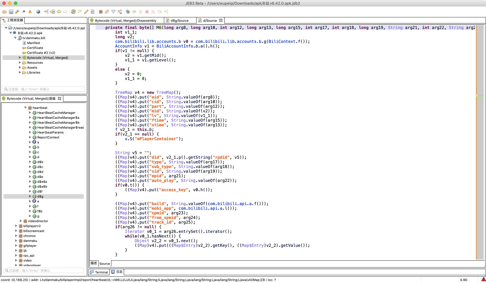
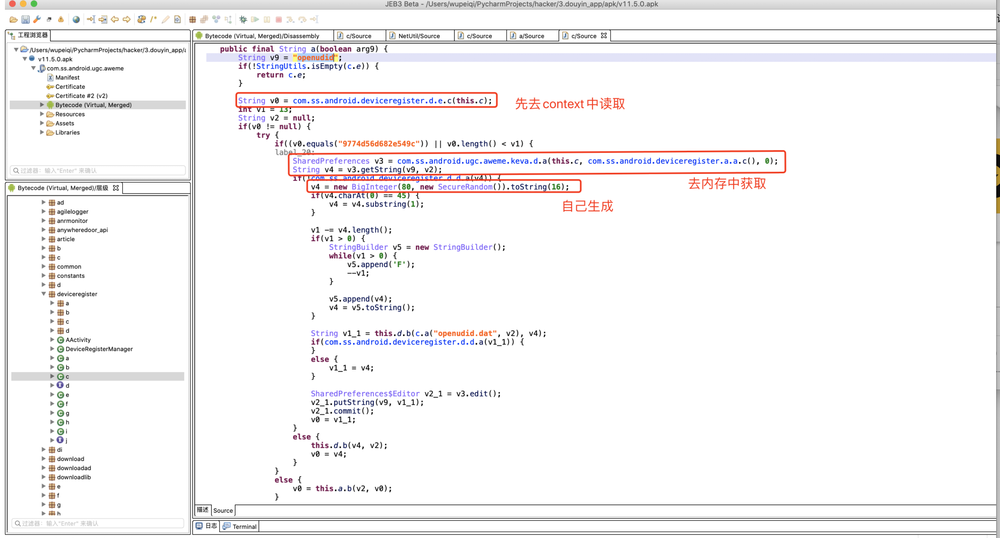
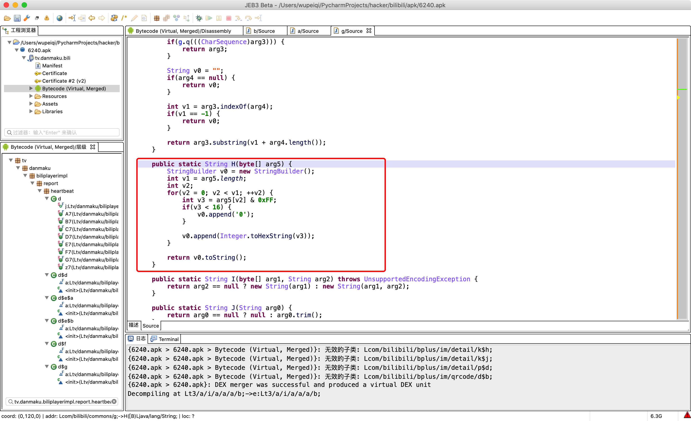
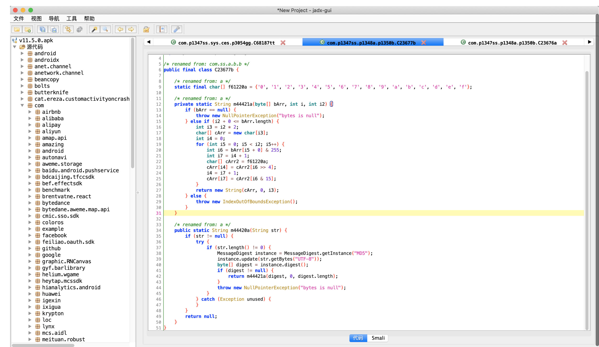
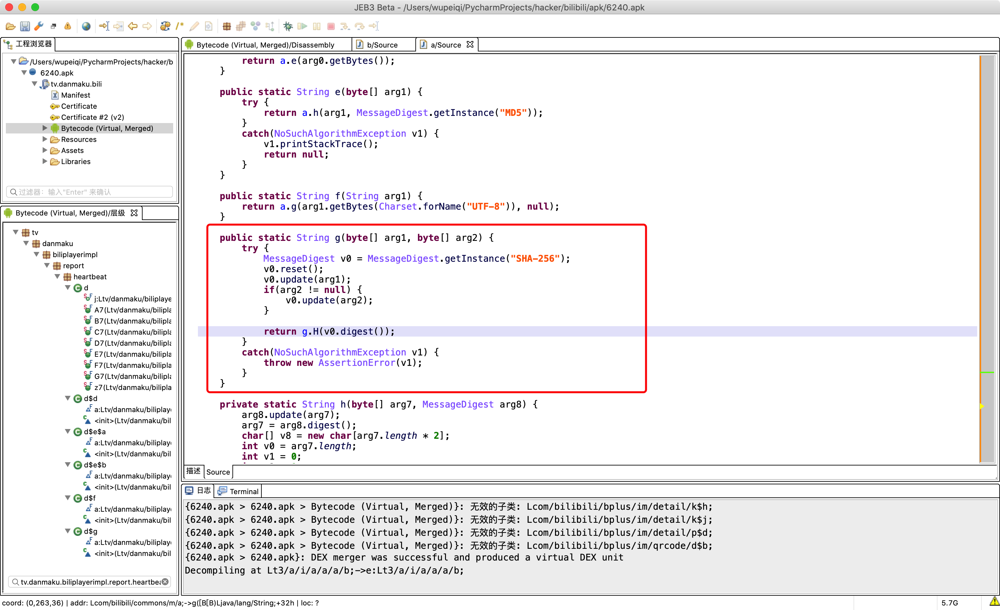
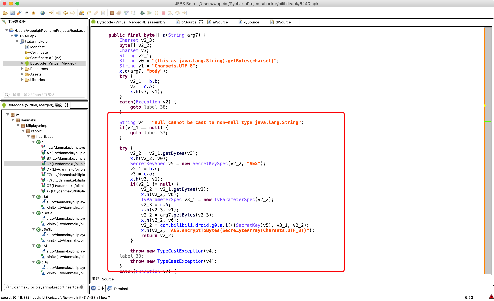

# day07 Java开发基础（下）

## 1. 数据类型相关


### 1.1 整数类型

- byte，字节		  【1字节】表示范围：-128 ~ 127 即：`-2^7 ~ 2^7 -1  `  
- short，短整型    【2字节】表示范围：-32768 ~ 32767
- int，整型             【4字节】表示范围：-2147483648 ~ 2147483647
- long，长整型      【8字节】表示范围：-9223372036854775808 ~ 9223372036854775807

```java
public class Hello {

    public static void main(String[] args) {
        byte v1 = 32;
        short v2 = 10000;
        int v3 = 22221331;
        long v4 = 554534353424L;
    }
}
```


```java
public class Hello {
    public static void main(String[] args) {
        short v1 = 32;
        // 强制类型转换
        int v2 = (int)v1;
        System.out.println(v2);
    }
}
```


**特别提醒**：在逆向时经常会看到byte数组表示字符串。

```java
import java.util.Arrays;

public class Hello {

    public static void main(String[] args) {
        // byte数组，每个元素都是一个字节 [11,22,33,44,55]
        byte[] data = {97, 105, 100, 61, 50, 52, 54, 51, 56, 55, 53, 55, 49, 38, 97, 117, 116, 111, 95, 112, 108, 97, 121, 61, 48, 38, 99, 105, 100, 61, 50, 56, 57, 48, 48, 56, 52, 52, 49, 38, 100, 105, 100, 61, 75, 82, 69, 104, 69, 83, 77, 85, 74, 104, 56, 116, 70, 67, 69, 86, 97, 82, 86, 112, 69, 50, 116, 97, 80, 81, 107, 55, 87, 67, 104, 67, 74, 103, 38, 101, 112, 105, 100, 61, 48, 38, 102, 116, 105, 109, 101, 61, 49, 54, 50, 55, 49, 48, 48, 57, 51, 55, 38, 108, 118, 61, 48, 38, 109, 105, 100, 61, 48, 38, 112, 97, 114, 116, 61, 49, 38, 115, 105, 100, 61, 48, 38, 115, 116, 105, 109, 101, 61, 49, 54, 50, 55, 49, 48, 52, 51, 55, 50, 38, 115, 117, 98, 95, 116, 121, 112, 101, 61, 48, 38, 116, 121, 112, 101, 61, 51}; // 这里应该表示的是一个字符串。

        String dataString = new String(data);
        System.out.println("字节数组转换为字符串：" + dataString);

        
        
        // 字符串也可以转换成字节
        byte[] res = dataString.getBytes();
        System.out.println(Arrays.toString(res));

        try{
            String name = "武沛齐";
            // v1 = [-50, -28, -59, -26, -58, -21] Java中
            // v2 = [206, 228, 197, 230, 198, 235] Python中
            byte[] v1 = name.getBytes("GBK");
            System.out.println(Arrays.toString(v1));

            byte[] v2 = name.getBytes("UTF-8"); // 默认
            System.out.println(Arrays.toString(v2));
        }catch (Exception e){

        }
    }
}
```

```python
# Python脚本，方便你们以后使用。
byte_list = [-50, -28, -59, -26, -58, -21]

bs = bytearray() # python字节数组
for item in byte_list:
    if item < 0:
        item = item + 256
    bs.append(item)
str_data = bs.decode('gbk')  # data = bytes(bs)
print(str_data)
```


**进制转换**：在java中除了十进制以外，其他的进制都是用字符串来表示。

```java
public class Hello {

    public static void main(String[] args) {
        // 十进制转其他
        int n = 18;
        
        String v2 = Integer.toBinaryString(n); // 二进制，字符串形式
        String v8 = Integer.toOctalString(n);
        String v16 = Integer.toHexString(n);
        String v3 = Integer.toString(n,3);
        
        String dataStr = Integer.toString(n); // "18"
        
        // 其他转十进制
        String data = "10010";
        int v10 = Integer.parseInt(data,2);
        
        // 其实：Integer.toString 和 Integer.parseInt 其实就是整型和字符串之间的转换。
    }
}
```


### 7.2 字符

```java
char v1 = '武'; // 字符
String v2 = "武沛齐"; // 字符串
```


字符，char		【2字节】对应的是unicode中的码点，用于存储单个字符。

```java
public class Hello {

    public static void main(String[] args) {
        String text = "alex是个大傻B";

        char v1 = text.charAt(1);
        System.out.println(v1); // l

        char v2 = text.charAt(2);
        System.out.println(v2); // e

        char v3 = '中'; // 单引号
        System.out.println(v3);

        char v4 = 'A'; // 单引号   65
        char v5 = '#'; // 单引号   35
        
        int v6 = v4 + v5; // 十进制 100
        System.out.println(v6); //100

        char v7 = (char)v6;
        System.out.println(v7); // d
    }
}
```


### 7.3 字符串

```java
import java.io.UnsupportedEncodingException;

public class Hello {

    public static void main(String[] args) throws UnsupportedEncodingException {
        String v1 = "武沛齐";
        String v2 = new String("武沛齐");

        // char[] data = new char[]{'武', '沛', '齐'};
        // char[] data = {'武', '沛', '齐'};
        // String v3 = new String(data);
        String v3 = new String(new char[]{'武', '沛', '齐'});

        String v4 = new String(new byte[]{-26, -83, -90, -26, -78, -101, -23, -67, -112});
        String v5 = new String(new byte[]{-50, -28, -59, -26, -58, -21},"GBK");
		
        // 上面都是不可变  "alex" + "SB" + "xx" + "xxxx"
        // 可变字符串 "name=wupeiqi"
        StringBuilder sb = new StringBuilder(); 
        sb.append("name");
        sb.append("=");
        sb.append("wupeiqi");
        sb.append("&");
        sb.append("age=");
        sb.append("999");
        // String v6 = sb.toString(); //name=wupeqi&age=999
        String v6 = new String(sb);

        StringBuffer strBuffer = new StringBuffer(); // 线程安全（多线程）
        strBuffer.append("name");
        strBuffer.append("=");
        strBuffer.append("wupeiqi");
        strBuffer.append("&");
        strBuffer.append("age=");
        strBuffer.append("999");
        // String v6 = strBuffer.toString();
        String v7 = new String(strBuffer);


        
        // 其他类型的方法执行，直接返回一个字符串
        String v8 = Integer.toString(123123);
        String v9 = Double.toString(3.14);
        
        // 或这
        String v10 = String.valueOf(123);
    }
}
```


对于字符串，内部提供了很多方便的方法对他进行操作，例如：

```java
public class Hello {

    public static void main(String[] args) {
        String origin = "alex是个大DB";

        char v1 = origin.charAt(5); // 指定字符
        int len = origin.length();  // 长度
        for (int i = 0; i < len; i++) {
            char item = origin.charAt(i);
        }

        String v2 = origin.trim(); // 去除空白

        String v3 = origin.toLowerCase(); // 小写
        String v4 = origin.toUpperCase(); // 大写

        String[] v5 = origin.split("是"); // 分割

        String v6 = origin.replace("D", "S"); // 替换

        String v7 = origin.substring(2, 6);  // 子字符串

        boolean v8 = origin.equals("alex是个大SB");

        boolean v9 = origin.contains("el");

        boolean v10 = origin.startsWith("a");

        String v11 = origin.concat("哈哈哈");
    }
}
```


关于StringBuilder，在Java开发中经常会使用，用于对字符串进行拼接处理。

```java
public class Hello {

    public static void main(String[] args) {
        StringBuilder sb = new StringBuilder();
        sb.append("name=");
        sb.append("wupeiqi");
        sb.append("age=");
        sb.append("18");
        sb.append("&");
		
        // 删除指定位置的字符
        sb.deleteCharAt(sb.length()-1); // name=wupeiqiage=18
        
        sb.insert(12,"&"); // name=wupeiqi&age=18
        String dataString = sb.toString();

        System.out.println(dataString); //name=wupeiqi&age=18
    }
}
```


### 1.4 数组

数据，具有 相同数据类型且定长 的元素集合。【定长】

```java
import java.util.Arrays;

public class Hello {

    public static void main(String[] args) {
        int[] numArray = new int[3];
        numArray[0] = 11;
        numArray[1] = 22;
        numArray[2] = 33;
        System.out.println(Arrays.toString(numArray));

        String[] names = new String[]{"武沛齐", "alex", "张开"};
        System.out.println(Arrays.toString(names));

        short[] number = {66, 99};
        System.out.println(Arrays.toString(number));

        for (int i = 0; i < names.length; i++) {
            String item = names[i];
            System.out.println(item);
        }

        for (String item : names) {
            System.out.println(item);
        }

    }
}
```


```java
public class Hello {

    public static void main(String[] args) {
        /*
            多维数据
              data=[
                    [11,22],
                    [33,44]
                    [55,66]
                ]
         */
        int[][] numArray = new int[3][2];
        numArray[0] = new int[]{11, 22};
        numArray[1] = new int[]{33, 44};
        numArray[2] = new int[]{55, 66};
    }
}
```


### 1.5 List系列

List是一个接口，常见实现这个接口的有两个类，用于实现变长的数组。

- ArrayList，底层是连续的位置存储，类似于数组。（内部自动扩容）。

  ```
  11,22,333
  ```

- LinkedList，底层是基于链表来存储。


```java
List l1 = new ArrayList();
List l2 = new LinkedList();
```


ArrayList示例：

```java
import java.util.ArrayList;
import java.util.Arrays;

public class Hello {

    public static void main(String[] args) {
		
        // ArrayList，内部存放的是混合数据类型。
        // ArrayList<String> data = new ArrayList<String>();
        ArrayList data = new ArrayList();
        data.add("武沛齐");
        data.add("alex");
        data.add(666);
        data.add("tony");
		
        String value = data.get(1);
        
        // String value = (String) data.get(1);
        Object temp = data.get(1);
        String value = (String) temp; // 转化可转换的数据
        System.out.println(value);


        int xo = (int) data.get(2);
        System.out.println(xo);

        data.set(0, "哈哈哈哈");
        System.out.println(data);

        data.remove("eric");
        data.remove(0);
        System.out.println(data);

        int size = data.size();
        System.out.println(size);

        boolean exists = data.contains("武沛齐");
        System.out.println(exists);


        for (Object item : data) {
            System.out.println(item);
        }

        for (int i = 0; i < data.size(); i++) {
            Object item = data.get(i);
            System.out.println(item);
        }
    }
}
```


```java
import java.util.LinkedList;

public class Hello {

    public static void main(String[] args) {
        LinkedList<Integer> v1 = new LinkedList<Integer>();
        v1.add(11);
        v1.add(22);

        LinkedList<Object> v2 = new LinkedList<Object>();
        v2.add("有阪深雪");
        v2.add("大桥未久");
        v2.add(666);
        v2.add(123);

        //v2.remove(1);
        //v2.remove("路飞");

        v2.set(2, "苍老师");
        v2.push("哈哈哈");
        // v2.addFirst(11);


        for (int i = 0; i < v2.size(); i++) {
            Object item = v2.get(i);
            System.out.println(item);
        }

        for (Object item : v2) {
            System.out.println(item);
        }
    }
}
```


关于迭代器：

```java
import java.util.*;

public class Hello {

    public static void main(String[] args) {

        ArrayList s1 = new ArrayList();
        s1.add("P站");
        s1.add("B站");
        s1.add("A站");


        Iterator it = s1.iterator(); // 迭代器
        while (it.hasNext()) {
            String item = (String) it.next();
            System.out.println(item);
        }
    }
}
```


关于foreach

```java
import java.util.*;

public class Hello {

    public static void main(String[] args) {

        ArrayList s1 = new ArrayList();
        s1.add("P站");
        s1.add("B站");
        s1.add("A站");

		// JDK8
        s1.forEach(item -> {
            System.out.println(item);
        });
    }
}

```


关于 List、ArrayList、LinkedList

```java
import java.util.ArrayList;
import java.util.LinkedList;
import java.util.List;

public class Hello {

    public static void main(String[] args) {
        List<Integer> v1 = new LinkedList<Integer>();
        v1.add(11);
        v1.add(22);

        List v2 = new ArrayList();
        v2.add(11);
        v2.add("哈哈哈");

        List<Integer> v3 = new ArrayList<Integer>();
        v1.add(11);
        v1.add(22);
    }
}
```


直接创建：

```java
import java.util.ArrayList;
import java.util.LinkedList;
import java.util.List;

public class Hello {

    public static void main(String[] args) {
        List<Integer> v1 = new LinkedList<Integer>() {
            {
                add(11);
                add(22);
            }
        };

    }
}
```


### 1.6 Set系列

Set是一个接口，常见实现这个接口的有两个类，用于实现不重复的多元素集合。

- HashSet，去重，无序。
- TreeSet，去重，内部默认排序（同类型元素，无法比较大小）。

```java
import java.util.*;

public class Hello {

    public static void main(String[] args) {
        // Set s1 = new HashSet();
        // HashSet<String> s1 = new HashSet<String>();
        HashSet s1 = new HashSet();
        s1.add("P站");
        s1.add("B站");
        s1.add("A站");
        s1.add("P站");
        s1.add(666);
        System.out.println(s1); // [B站, A站, P站,666]

        HashSet s2 = new HashSet(){
            {
                add("东京热");
                add("东北热");
                add("南京热");
            }
        };
        System.out.println(s2); // [B站, A站, P站]


        // Set s2 = new TreeSet();
        // TreeSet<String> s2 = new TreeSet<String>();
        TreeSet s3 = new TreeSet();
        s3.add("P站");
        s3.add("B站");
        s3.add("A站");
        s3.add("P站");
        // s3.add(666); //不可以

        System.out.println(s3); // [B站, A站, P站]

        TreeSet s4 = new TreeSet(){
            {
                add("P站");
                add("B站");
                add("A站");
                add("P站");
            }
        };
        System.out.println(s4); // [B站, A站, P站]

    }
}
```


关于交并差：

```java
import java.util.*;

public class Hello {

    public static void main(String[] args) {
        // Set s1 = new HashSet();
        HashSet s1 = new HashSet();
        s1.add("P站");
        s1.add("B站");
        s1.add("A站");
        s1.remove("P站");
        System.out.println(s1); // [B站, A站, P站]

        boolean exists = s1.contains("B站");
        System.out.println(exists);

        HashSet s2 = new HashSet();
        s2.add(123);
        s2.add(456);


        HashSet v1 = new HashSet(); // 空  [B站, A站, P站]
        v1.addAll(s1);
        v1.retainAll(s2); // 交集
        System.out.println(v1);


        HashSet v2 = new HashSet();
        v2.addAll(s1);
        v2.addAll(s2); // 并集
        System.out.println(v2);

        HashSet v3 = new HashSet();
        v3.addAll(s1);
        v3.removeAll(s2); // 差集 s1 - s2
        System.out.println(v3);


        HashSet v4 = new HashSet();
        v4.addAll(s2);
        v4.removeAll(s1); // 差集 s2 - s1
        System.out.println(v4);
    }
}
```


关于循环获取：

```java
import java.util.*;

public class Hello {

    public static void main(String[] args) {

        TreeSet s1 = new TreeSet();
        s1.add("P站");
        s1.add("B站");
        s1.add("A站");

        for (Object item : s1) {
            System.out.println(item);
        }

        // 不用这种循环
        for(int i=0;i<s1.size();i++){
            // Object item = s1[i]     不支持
            // Object item = s1.get(i) 不支持
        }
    }
}
```


关于迭代器：

```java
import java.util.*;

public class Hello {

    public static void main(String[] args) {

        TreeSet s1 = new TreeSet();
        s1.add("P站");
        s1.add("B站");
        s1.add("A站");


        Iterator it = s1.iterator();
        while (it.hasNext()) {
            String item = (String) it.next();
            System.out.println(item);
        }
    }
}
```


关于foreach

```java
import java.util.*;

public class Hello {

    public static void main(String[] args) {

        TreeSet s1 = new TreeSet();
        s1.add("P站");
        s1.add("B站");
        s1.add("A站");


        s1.forEach(item -> {
            System.out.println(item);
        });
    }
}
```


### 1.7 Map系列

Map是一个接口，常见实现这个接口的有两个类，用于存储键值对。

- HashMap，无序。

- TreeMap，默认根据key排序。

  ```python
  data_dict = {
      "aid": "123",
      "cid": "44",
      "bid": "5",
  }
  
  data_list = ["{}={}".format(key, data_dict[key]) for key in sorted(data_dict.keys())]
  res = "&".join(data_list)
  print(res)
  ```

  

```java
import java.util.*;

public class Hello {

    public static void main(String[] args) {
        HashMap h1 = new HashMap();
        h1.put("name","alex");
        h1.put("age",18);
        h1.put("hobby","男");
        System.out.println(h1); // {gender=男, name=alex, age=18}

        HashMap<String,String> h2 = new HashMap<String,String>();
        h2.put("name","alex");
        h2.put("age","18");
        h2.put("hobby","男");
        System.out.println(h2); // {gender=男, name=alex, age=18}


        HashMap<String,String> h3 = new HashMap<String,String>(){
            {
                put("name","alex");
                put("age","18");
                put("hobby","男");
            }
        };
        System.out.println(h3); // {gender=男, name=alex, age=18}
    }
}
```

```java
import java.util.*;

public class Hello {

    public static void main(String[] args) {
        TreeMap h1 = new TreeMap(); // 改为了TreeMap
        h1.put("name","alex");
        h1.put("age",18);
        h1.put("hobby","男");
        System.out.println(h1); // {age=18, hobby=男, name=alex}

        TreeMap<String,String> h2 = new TreeMap<String,String>();
        h2.put("name","alex");
        h2.put("age","18");
        h2.put("hobby","男");
        System.out.println(h2); // {age=18, hobby=男, name=alex}


        TreeMap<String,String> h3 = new TreeMap<String,String>(){
            {
                put("name","alex");
                put("age","18");
                put("hobby","男");
            }
        };
        System.out.println(h3); // {age=18, hobby=男, name=alex}


        Map h4 = new TreeMap();
        h4.put("name","alex");
        h4.put("age",18);
        h4.put("hobby","男");
        System.out.println(h4); // {age=18, hobby=男, name=alex}
    }
}
```


常见操作：

```java
import java.util.*;

public class Hello {

    public static void main(String[] args) {
        TreeMap h1 = new TreeMap(); // 改为了TreeMap
        h1.put("name", "alex");
        h1.put("age", "18");
        h1.put("hobby", "男");
        h1.put("hobby", "女人");

        h1.remove("age");
        int size = h1.size();

        Object value = h1.get("name"); // 不存在，返回null
        System.out.println(value);

        boolean existsKey = h1.containsKey("age");
        boolean existsValue = h1.containsValue("alex");

        h1.replace("name", "李杰");
        System.out.println(h1);


        // 循环: 示例1
        Set<Map.Entry<String, String>> s1 = h1.entrySet();
        Iterator it1 = s1.iterator();
        while (it1.hasNext()) {
            Map.Entry<String, String> entry = (Map.Entry<String, String>) it1.next();
            String k = (String) entry.getKey();
            String v = (String) entry.getValue();
        }

        // 循环: 示例2
        Set s2 = h1.entrySet();
        Iterator it2 = s2.iterator();
        while (it2.hasNext()) {
            Map.Entry entry = (Map.Entry) it2.next();
            String k = (String) entry.getKey();
            String v = (String) entry.getValue();
        }

        // 循环: 示例3
        TreeMap<String, String> h2 = new TreeMap<String, String>(); // 改为了TreeMap
        h2.put("name", "alex");
        h2.put("age", "18");
        for (Map.Entry<String, String> entry : h2.entrySet()) {
            String k = entry.getKey();
            String v = entry.getValue();
        }

        // 循环: 示例4
        TreeMap h3 = new TreeMap(); // 改为了TreeMap
        h3.put("name", "alex");
        h3.put("age", 18);
        
        for (Object entry : h3.entrySet()) {
            Map.Entry<String, Object> entryMap = (Map.Entry<String, Object>) entry;
            String k = entryMap.getKey();
            Object v = entryMap.getValue(); // 18   "alex"
            
            if (v instanceof Integer) {
                System.out.println("数字：" + Integer.toString((Integer) v));
            } else if (v instanceof String) {
                System.out.println("字符串：" + (String) v);
            } else {
                System.out.println("未知类型：" + v.toString());
            }
        }

        // 循环: 示例5（JDK8）
        TreeMap h4 = new TreeMap(); // 改为了TreeMap
        h4.put("name", "alex");
        h4.put("age", 18);
        h4.forEach((k, v) -> {
            System.out.print(k + "：" + v + "   v的类型是：");
            System.out.println(v.getClass());
        });
    }
}
```


上述就是关于Java中常见数据类型的操作，了解上述的内容之后，再来看B站逆向的代码案例，例如：





## 2.面向对象

### 2.1 类和对象

```java
class Person {

    // 实例变量
    public String name;
    public Integer age;
    public String email;

    // 构造方法1
    public Person() {
        this.name = "Eric";
        this.age = 99999;
    }

    // 构造方法2
    public Person(String name, Integer age) {
        this.name = name;
        this.age = age;
        this.email = "xxx@live.com";
    }

    // 构造方法3
    public Person(String name, String email) {
        this.name = name;
        this.age = 83;
        this.email = email;
    }
	
    // 定义函数（重载）
    public void doSomething() {
        System.out.println(this.name);
    }

	// 定义函数（重载）
    public void doSomething(String prev) {
        String text = String.format("%s-%s", prev, this.name);
        System.out.println(text);
    }
}

public class Hello {

    public static void main(String[] args) {
		
        // 实例化对象时，体现的主要是封装。
        Person p1 = new Person();
        Person p2 = new Person("alex", 73);
        Person p3 = new Person("tony", "alex@sb.com");

        p1.doSomething();
        p1.doSomething("你好呀，");

        p2.doSomething();
        p2.doSomething("你好呀，");
        
        p3.doSomething();
        p3.doSomething("你好呀，");
    }
}
```


### 2.2 继承和多态 

Java中只是支持单继承（同时只能继承一个基类）。

```java
class Base {
    public String email;

    public Base(String email) {
        this.email = email;
    }

    public String getSubInfo() {
        return String.format("%s", this.email);
    }
}

class Person extends Base {

    public String name;
    public Integer age;

    public Person(String name, Integer age, String email) {
        super(email);
        this.name = name;
        this.age = age;
    }

    public String getInfo() {
        return String.format("%s-%d-%s", this.name, this.age, this.email);
    }

    public String getSubInfo() {
        return String.format("%s-%s", this.name, this.email);
    }
}

public class Hello {
    
    public static void main(String[] args) {
        Person p = new Person("武沛齐", 73, "wupeiqi@live.com");
        String text = p.getInfo();
        System.out.println(text);

        String subText = p.getSubInfo();
        System.out.println(subText);
    }
}
```


用父类泛指子类的对象：

```java
class Base {
    public String email;

    // 构造方法
    public Base(String email) {
        this.email = email;
    }

    public String getInfo() {
        return "哈哈哈哈";
    }

    // 方法getSubInfo
    public String getSubInfo() {
        return String.format("%s", this.email);
    }
}

class Person extends Base {

    public String name;
    public Integer age;

    public Person(String name, Integer age, String email) {
        // 找父类中的 构造方法并执行  this=self
        super(email);

        this.name = name;
        this.age = age;
    }

    public String getInfo() {
        return String.format("%s-%d-%s", this.name, this.age, this.email);
    }

    public String getSubInfo() {
        return String.format("%s-%s", this.name, this.email);
    }
}

public class Hello {

    public static void main(String[] args) {
        // 1. 实例化Person对象  p = {email="wupeiqi@live.com" name="武沛齐",age=73 }
        Base p = new Person("武沛齐", 73, "wupeiqi@live.com");

        System.out.println(p.getClass());  // class Person
        // 1.可以自己判断类型，然后再做其他的处理。
        // 2.p可以强制类型转化弄成Person类型。
        // 3.做了泛指之后，
        String text = p.getSubInfo();  // 找到实际是那个类的对象，就去找当前对象对应类中的方法。
        System.out.println(text);    // 武沛齐-wupeiqi@live.com

        String data = p.getInfo();  // 武沛齐-73-wupeiqi@live.com
        System.out.println(data);


        // 调用p的getInfo方法。
//        String text = p.getInfo();
//        System.out.println(text);
//
//        // 调用p的getSubInfo
//        String subText = p.getSubInfo();
//        System.out.println(subText);
    }
}
```


特别的：使用类的继承关系，也可以在 传参 或 指定类型时，可以用基类 泛指 所有继承他的子类（多态）。

```java
import java.util.ArrayList;

class Base {
    public String name;
    public Integer age;
    public String email;

    public Base(String name, Integer age, String email) {
        this.name = name;
        this.age = age;
        this.email = email;
    }

    public String getSubInfo() {
        return String.format("%s", this.email);
    }
}

class Person extends Base {

    public Person(String name, Integer age, String email) {
        super(name, age, email);
    }

    public String getInfo() {
        return String.format("%s-%d-%s", this.name, this.age, this.email);
    }

    public String getSubInfo() {
        return String.format("%s-%s", this.name, this.email);
    }
}

public class Hello {

    public static void main(String[] args) {

        Base[] v1 = {
                new Base("alex", 73, "alex@live.com"),
                new Base("武沛齐", 23, "wupeiqi@live.com"),
                new Person("日天", 83, "ritian@live.com"),
                new Person("张开", 13, "zhangkai@live.com"),
        };

        ArrayList<Base> v2 = new ArrayList<Base>() {
            {
                add(new Base("alex", 73, "alex@live.com"));
                add(new Base("武沛齐", 23, "wupeiqi@live.com"));
                add(new Person("日天", 83, "ritian@live.com"));
                add(new Person("张开", 13, "zhangkai@live.com"));
            }
        };

        for (Base item : v2) {
            String info = item.getSubInfo(); 
            System.out.println(info);
        }
        
        for (Base item : v2) {
            String info = null;
            if (item instanceof Person) {
                info = ((Person) item).getInfo();
            } else {
                info = item.getSubInfo();
            }
            System.out.println(info);
        }
        
    }
}


```

```java
class Base {
    public String name;
    public Integer age;
    public String email;

    public Base(String name, Integer age, String email) {
        this.name = name;
        this.age = age;
        this.email = email;
    }

    public String getSubInfo() {
        return String.format("%s", this.email);
    }
}

class Person extends Base {

    public Person(String name, Integer age, String email) {
        super(name, age, email);
    }

    public String getInfo() {
        return String.format("%s-%d-%s", this.name, this.age, this.email);
    }

    public String getSubInfo() {
        return String.format("%s-%s", this.name, this.email);
    }
}

public class Hello {

    public static void action(Base obj) {
        String info = obj.getSubInfo();
        System.out.println(info);
    }

    public static void main(String[] args) {
        Base p1 = new Base("alex", 73, "alex@live.com");
        Person p2 = new Person("日天", 83, "ritian@live.com");
        Base p3 = new Person("张开", 83, "zhangkai@live.com");

        action(p1);
        action(p2);
        action(p3);
    }
}
```


### 2.3 接口 

接口的作用：约束、泛指 ”实现“ 他的类型。


约束：

```java
import java.util.ArrayList;

interface IMessage {
    public void send();
}

class Wechat implements IMessage {
    public void send() {
        System.out.println("发送微信");
    }
}

class DingDing implements IMessage {
    public void send() {
        System.out.println("发送钉钉");
    }
}

class Sms implements IMessage {
    public void send() {
        System.out.println("发送短信");
    }
}

public class Hello {

    public static void main(String[] args) {
        ArrayList<IMessage> objList = new ArrayList<IMessage>() {
            {
                add(new Wechat());
                add(new DingDing());
                add(new Sms());
            }
        };
        objList.get(0).send();

    }
}
```


```java
interface IPerson {
    public void f1();

    public void f1(int age);

    public void f2(String info);
}

interface IUser {
    public String f3(int num);
}

class Base {
    public String name;
    public Integer age;
    public String email;

    public Base(String name, Integer age, String email) {
        this.name = name;
        this.age = age;
        this.email = email;
    }

    public String getSubInfo() {
        return String.format("%s", this.email);
    }
}

class Person extends Base implements IUser, IPerson {

    public Person(String name, Integer age, String email) {
        super(name, age, email);
    }

    public String getInfo() {
        return String.format("%s-%d-%s", this.name, this.age, this.email);
    }

    public String getSubInfo() {
        return String.format("%s-%s", this.name, this.email);
    }

    public void f1() {
        System.out.println("F1,无参数");
    }

    public void f1(int age) {
        System.out.println("F1,age参数");
    }

    public void f2(String info) {
        System.out.println("F2");
    }

    public String f3(int num) {
        return "哈哈哈";
    }
}

public class Hello {


    public static void main(String[] args) {
        Person p = new Person("日天", 83, "ritian@live.com");
        p.f1();
    }
}

```


泛指一些类型：

```java
interface IAnimal {
    public void exec();

}

class Dog implements IAnimal {
    public void exec() {
        System.out.println("狗子");
    }
}

class Cat implements IAnimal {
    public void exec() {
        System.out.println("猫咪");
    }
}

public class Hello {

    public static void action(IAnimal obj) {
        obj.exec();
    }

    public static void main(String[] args) {
        IAnimal[] v1 = {
                new Dog(),
                new Dog(),
                new Cat(),
                new Cat(),
        };
        for (IAnimal item : v1) {
            item.exec();
        }

        for (IAnimal item : v1) {
            action(item);
        }
    }
}
```

```java
interface IPerson {
    public void f1();

    public void f1(int age);

    public void f2(String info);
}

interface IUser {
    public String f3(int num);
}

class Base {
    public String name;
    public Integer age;
    public String email;

    public Base(String name, Integer age, String email) {
        this.name = name;
        this.age = age;
        this.email = email;
    }

    public String getSubInfo() {
        return String.format("%s", this.email);
    }
}

class Person extends Base implements IUser, IPerson {

    public Person(String name, Integer age, String email) {
        super(name, age, email);
    }

    public String getInfo() {
        return String.format("%s-%d-%s", this.name, this.age, this.email);
    }

    public String getSubInfo() {
        return String.format("%s-%s", this.name, this.email);
    }

    public void f1() {
        System.out.println("F1,无参数");
    }

    public void f1(int age) {
        System.out.println("F1,age参数");
    }

    public void f2(String info) {
        System.out.println("F2");
    }

    public String f3(int num) {
        return "哈哈哈";
    }
}

public class Hello {


    public static void main(String[] args) {
        IPerson[] v1 = {
                new Person("日天", 83, "ritian@live.com"),
                new Person("张开", 13, "zhangkai@live.com"),
        };
        for (IPerson item : v1) {
            item.f1();
            // item.f3(); 错误
        }
    }
}
```


### 2.4 抽象

在Java开发中可以基于 抽象方法 & 抽象类实现。

```java
// 抽象类
abstract class Base {

    // 抽象方法（约束子类中必须有这个方法）
    public abstract void play(String name);

    // 普通方法
    public void stop() {
        System.out.println("Stop");
    }
}

class Son extends Base {
    public void play(String name) {
        System.out.println("play");
    }
}

public class Hello {

    public static void main(String[] args) {
        Son obj = new Son();
        obj.play("hahha");
        obj.stop();
    }
}
```


也可以实现多态：

```java
abstract class Base {
    public abstract void play(String name);

    public void stop() {
        System.out.println("Stop");
    }
}

class Son extends Base {

    public void play(String name) {
        System.out.println("play");
    }
}

public class Hello {
    public static void func(Base obj){
        obj.play("hahha");
        obj.stop();
    }
    public static void main(String[] args) {
        Son obj = new Son();
        func(obj);
    }
}
```


### 2.5 其他

```java
class Foo {
    public static String name = "武沛齐";
    public int age;

    public Foo(){
        this.age = 19; // 实例变量
        
        System.out.println(Foo.name); // "武沛齐"
        Foo.name = "哈哈哈哈";
        System.out.println(Foo.name); // 
    }
}


public class Hello {

    public static void main(String[] args) {
        Foo obj = new Foo();
    }
}
```

```java

class Foo {
    private int age;

    public int getAge() {
        // 再加工
        return age;
    }

    public void setAge(int age) {
        // 再加工
        this.age = age;
    }

    public Foo(){
        this.age = 19;
    }
}


public class Hello {

    public static void main(String[] args) {
        Foo obj = new Foo();
        obj.setAge(99);
        int data = obj.getAge();
        System.out.println(data);
    }
}
```


## 3.逆向常见

### 3.1 接口中的方法

根据调用关系，最终找到接口中的方法了。

```java
interface IRequest {
    public void send(String url);
}

class Context {

    public IRequest req;

    public Context(IRequest req) {
        this.req = req;
    }

    public void doRequest() {
        String url = "/click/android2/";
        this.req.send(url);
    }
}


public class Hello {

    public static void main(String[] args) {

    }
}
```


- 思路1：寻找实现了 IRequest 接口的类。
- 思路2：谁传入的req？找他的调用栈。


### 3.2 隐藏的字节

```java
String v4 = new String(new byte[]{-26, -83, -90, -26, -78, -101, -23, -67, -112});
```


### 3.3 UUID

抖音udid


```java
import java.util.UUID;

public class Hello {

    public static void main(String[] args){
        String uid = UUID.randomUUID().toString();
        System.out.println(uid);
    }
}
```


### 3.4 随机值

抖音：openudid



```java
import java.math.BigInteger;
import java.security.SecureRandom;

public class Hello {

    public static void main(String[] args) {
        // 随机生成80位，10个字节
        BigInteger v4 = new BigInteger(80, new SecureRandom());
        // 让字节以16进制展示
        String res = v4.toString(16);
        System.out.println(res);

    }
}
```

```python
import random

open_udid = "".join([hex(i)[2:] for i in random.randbytes(10)])
print(open_udid)
```


### 3.5 时间戳

抖音：_ticket


```java
public class Hello {

    public static void main(String[] args) {
        String t1 = String.valueOf(System.currentTimeMillis() / 1000);
        String t2 = String.valueOf(System.currentTimeMillis());

        System.out.println(t1);
        System.out.println(t2);
    }
}
```


### 3.6 十六进制字符串





```java
import java.util.Arrays;

public class Hello {

    public static void main(String[] args) {

        String name = "\n武沛齐";
        byte[] nameBytes =name.getBytes();

        // [10, -26, -83, -90, -26, -78, -101, -23, -67, -112]
        //  0a   e6    ad   a6
        System.out.println(Arrays.toString(nameBytes));
        StringBuilder sb = new StringBuilder();
        for(int i=0;i<nameBytes.length;i++){
            int val = nameBytes[i] & 255;  // 负数转换为正数（byte，正数、负数）
            if (val<16){
                sb.append("0");
            }
            sb.append(Integer.toHexString(val));
        }
        String res = sb.toString();
        System.out.println(res); // e6ada6e6b29be9bd90

    }
}
```

```python
name = "武沛齐"

data_list = []
for item in name.encode('utf-8'):
    val = hex(item)
    data = val[2:].zfill(2)
    data_list.append(data)

result = ''.join(data_list)
print(result) # e6ada6e6b29be9bd90
```


### 3.7 base64处理

```java
import java.util.Base64;

public class Hello {

    public static void main(String[] args) {
        String name = "武沛齐";
        Base64.Encoder encoder  = Base64.getEncoder();
        String res = encoder.encodeToString(name.getBytes());
        System.out.println(res); // 5q2m5rKb6b2Q

        Base64.Decoder decoder  = Base64.getDecoder();
        byte[] origin = decoder.decode(res);
        String data = new String(origin);
        System.out.println(data); // 武沛齐

    }
}
```

```python
import base64

name = "武沛齐"

res = base64.b64encode(name.encode('utf-8'))
print(res) # b'5q2m5rKb6b2Q'


data = base64.b64decode(res)
print(data.decode('utf-8'))
```


### 3.8 md5加密

抖音：X-SS-STUB



```java
import java.security.MessageDigest;
import java.security.NoSuchAlgorithmException;
import java.util.Arrays;
import java.util.Base64;

public class Hello {

    public static void main(String[] args) throws NoSuchAlgorithmException {
        String name = "武沛齐";
        MessageDigest instance = MessageDigest.getInstance("MD5");
        byte[] nameBytes = instance.digest(name.getBytes());
        System.out.println(Arrays.toString(nameBytes));

        String res = new String(nameBytes);
        System.out.println(res);

        // 十六进制展示
        StringBuilder sb = new StringBuilder();
        for(int i=0;i<nameBytes.length;i++){
            int val = nameBytes[i] & 255;  // 负数转换为正数
            if (val<16){
                sb.append("0");
            }
            sb.append(Integer.toHexString(val));
        }
        String hexData = sb.toString();
        System.out.println(hexData); // e6ada6e6b29be9bd90
    }
}
```

```python
import hashlib

m = hashlib.md5()
m.update("武沛齐".encode("utf-8"))
v1 = m.digest()
print(v1) # b'\x175\x10\x12G$)\xd5-\x0c\r#\xd4h\x17='
v2 = m.hexdigest()
print(v2) # 17351012472429d52d0c0d23d468173d
```


md5加盐

```java
import java.security.MessageDigest;
import java.security.NoSuchAlgorithmException;
import java.util.Arrays;
import java.util.Base64;

public class Hello {

    public static void main(String[] args) throws NoSuchAlgorithmException {
        String name = "武沛齐";
        MessageDigest instance = MessageDigest.getInstance("MD5");
        instance.update("xxxxxx".getBytes());
        byte[] nameBytes = instance.digest(name.getBytes());
        System.out.println(Arrays.toString(nameBytes));

        String res = new String(nameBytes);
        System.out.println(res);

        // 十六进制展示
        StringBuilder sb = new StringBuilder();
        for(int i=0;i<nameBytes.length;i++){
            int val = nameBytes[i] & 255;  // 负数转换为正数
            if (val<16){
                sb.append("0");
            }
            sb.append(Integer.toHexString(val));
        }
        String hexData = sb.toString();
        System.out.println(hexData); // e6ada6e6b29be9bd90
    }
}
```


```java
import hashlib

m = hashlib.md5("xxxxxx".encode('utf-8'))
m.update("武沛齐".encode("utf-8"))
v1 = m.digest()
print(v1) # b'\x175\x10\x12G$)\xd5-\x0c\r#\xd4h\x17='
v2 = m.hexdigest()
print(v2) # 17351012472429d52d0c0d23d468173d

```


### 3.9 sha-256加密

B站：x/report/andriod2，请求体




```java
import java.security.MessageDigest;
import java.security.NoSuchAlgorithmException;
import java.util.Arrays;
import java.util.Base64;

public class Hello {

    public static void main(String[] args) throws NoSuchAlgorithmException {
        String name = "武沛齐";
        MessageDigest instance = MessageDigest.getInstance("SHA-256");
        byte[] nameBytes = instance.digest(name.getBytes());
        System.out.println(Arrays.toString(nameBytes));

        String res = new String(nameBytes);
        System.out.println(res);

        // 十六进制展示
        StringBuilder sb = new StringBuilder();
        for(int i=0;i<nameBytes.length;i++){
            int val = nameBytes[i] & 255;  // 负数转换为正数
            if (val<16){
                sb.append("0");
            }
            sb.append(Integer.toHexString(val));
        }
        String hexData = sb.toString();
        System.out.println(hexData); // e6ada6e6b29be9bd90
    }
}
```

```python
import hashlib

m = hashlib.sha256()
m.update("武沛齐".encode("utf-8"))
v1 = m.digest()
print(v1)
v2 = m.hexdigest()
print(v2)

```


### 3.10 aes加密




```java
import javax.crypto.BadPaddingException;
import javax.crypto.Cipher;
import javax.crypto.IllegalBlockSizeException;
import javax.crypto.NoSuchPaddingException;
import javax.crypto.spec.IvParameterSpec;
import javax.crypto.spec.SecretKeySpec;
import java.io.UnsupportedEncodingException;
import java.security.InvalidAlgorithmParameterException;
import java.security.InvalidKeyException;
import java.security.MessageDigest;
import java.security.NoSuchAlgorithmException;
import java.util.Arrays;
import java.util.Base64;

public class Hello {

    public static void main(String[] args) throws Exception {
        String data = "武沛齐";
        String key = "fd6b639dbcff0c2a1b03b389ec763c4b";
        String iv = "77b07a672d57d64c";

        // 加密
        byte[] raw = key.getBytes();
        SecretKeySpec skeySpec = new SecretKeySpec(raw, "AES");
        Cipher cipher = Cipher.getInstance("AES/CBC/PKCS5Padding");
        IvParameterSpec ivSpec = new IvParameterSpec(iv.getBytes());
        cipher.init(Cipher.ENCRYPT_MODE, skeySpec, ivSpec);
        byte[] encrypted = cipher.doFinal(data.getBytes());
        System.out.println(Arrays.toString(encrypted));
        
    }
}
```

```python
from Crypto.Cipher import AES
from Crypto.Util.Padding import pad

KEY = "fd6b639dbcff0c2a1b03b389ec763c4b"
IV = "77b07a672d57d64c"


def aes_encrypt(data_string):
    aes = AES.new(
        key=KEY.encode('utf-8'),
        mode=AES.MODE_CBC,
        iv=IV.encode('utf-8')
    )
    raw = pad(data_string.encode('utf-8'), 16)
    return aes.encrypt(raw)

data = aes_encrypt("武沛齐")
print(data)
print([ i for i in data])

```


### 3.11 gzip压缩

抖音注册设备：


```java
import java.io.ByteArrayInputStream;
import java.io.ByteArrayOutputStream;
import java.io.IOException;
import java.math.BigInteger;
import java.security.SecureRandom;
import java.util.ArrayList;
import java.util.Arrays;
import java.util.HashMap;
import java.io.OutputStream;
import java.util.zip.GZIPInputStream;
import java.util.zip.GZIPOutputStream;

public class Hello {

    public static void main(String[] args) throws IOException {

        // 压缩
        String data = "武沛齐";
        // System.out.println(Arrays.toString(data.getBytes()));
        ByteArrayOutputStream v0_1 = new ByteArrayOutputStream();
        GZIPOutputStream v1 = new GZIPOutputStream((v0_1));
        v1.write(data.getBytes());
        v1.close();
        byte[] arg6 = v0_1.toByteArray();
        System.out.println(Arrays.toString(arg6));

        // 解压缩
        ByteArrayOutputStream out = new ByteArrayOutputStream();
        ByteArrayInputStream in = new ByteArrayInputStream(arg6);
        GZIPInputStream ungzip = new GZIPInputStream(in);
        byte[] buffer = new byte[256];
        int n;
        while ((n = ungzip.read(buffer)) >= 0) {
            out.write(buffer, 0, n);
        }
        byte[] res = out.toByteArray();
        // System.out.println(Arrays.toString(res));
        System.out.println(out.toString("UTF-8"));

    }
}
```

```python
import gzip


# 压缩
"""
s_in = "我是武沛齐".encode('utf-8')
s_out = gzip.compress(s_in)
print([i for i in s_out])
"""

# 解压缩
"""
res = gzip.decompress(s_out)
print(res)
print(res.decode('utf-8'))
"""
```


