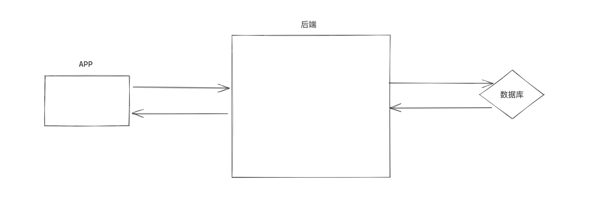
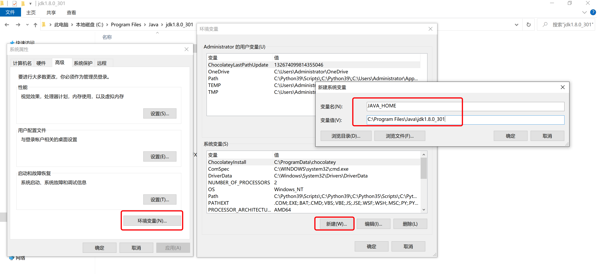
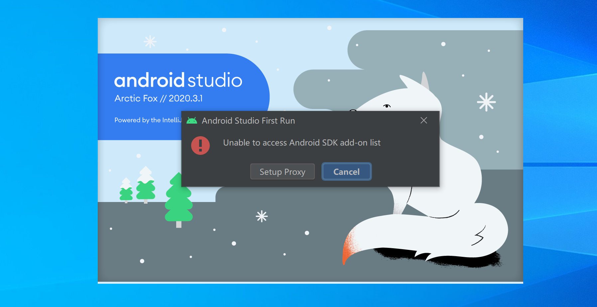
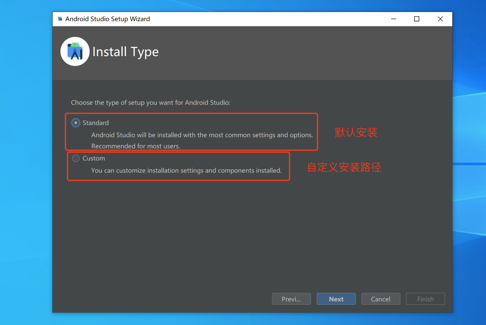
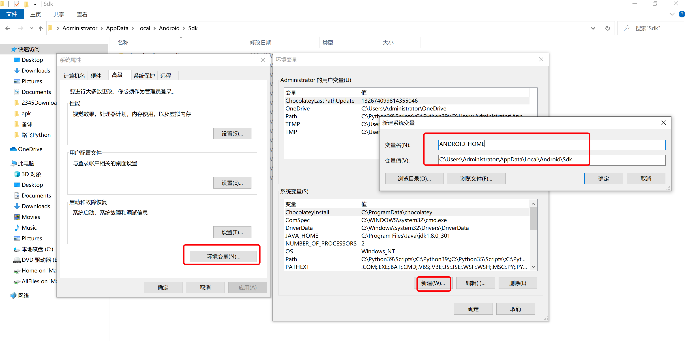
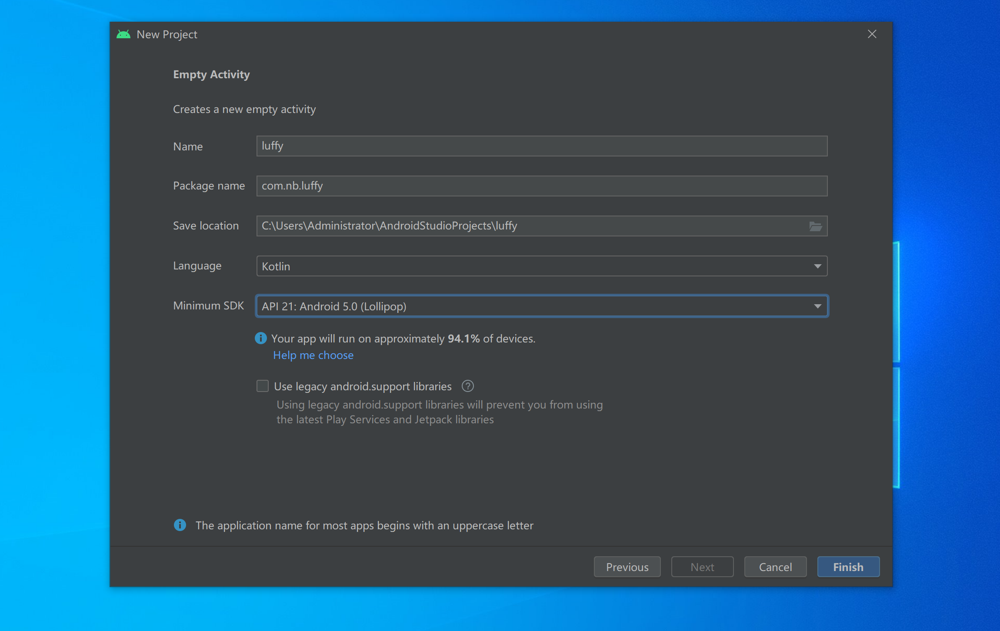
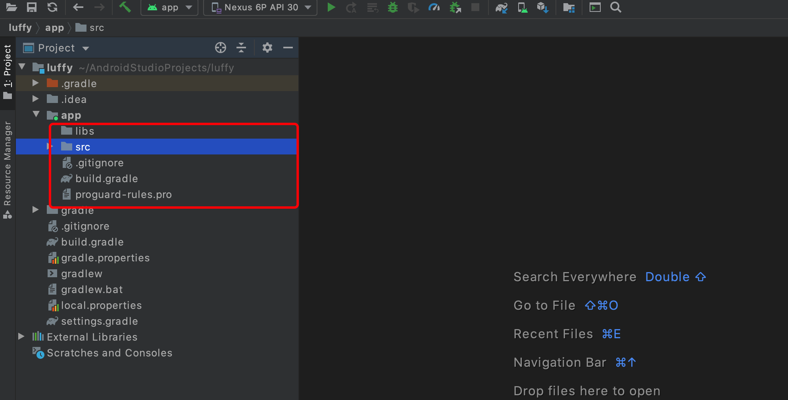
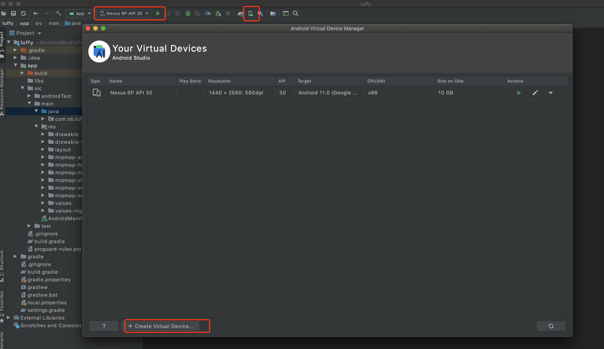

# day08 安卓开发



## 1. 环境搭建

### 1.1 JDK

在自己电脑上安装 JDK并设置环境变量。


接下来，我们就来下载和安装吧。

```
JDK8（jdk 1.8）版本（目前最新已到17）

官方地址：https://www.oracle.com/java/technologies/downloads/#java8
百度云盘：
```

安装好之后需要配置下环境变量。




如果先配置 JAVA_HOME的话，再在Path中配置时，只需要写：

```
%JAVA_HOME%\bin
```


### 1.2 Android Studio

Android Studio是安卓的继承开发环境。

https://developer.android.google.cn/studio/

下载之后，点击下一步去安装即可完成。


首次启动时会报错显示：



这是因为，我们如果想要做安卓开发的话，还需要去安装 android SDK，而Android Studio没有检测到安装的SDK，所以报错了。

此处直接点击 【Cancel】即可，接下来我们会在Android Studio中去安装android SDK。




注意：此处一定要记住自己SDK安装目录。


### 1.3 Android SDK环境变量

方便我们以后再命令行去执行安卓相关的命令。





### 1.4 创建项目





- .gradle 和 .idea，自动生成的隐藏文件。
- app，项目相关的代码和资源在这个目录。
- gradle，是一个构件工具，帮助我们自动寻找配置中的第三方包、依赖的版本、Java代码、资源并编译成APK。
  - gradle
  - build.gradle
  - gradel.properties
  - gradlew
  - gradlew.bat
  - settings.gradle 
- local.properties，本地属性（android sdk的安装路径）。
- .gitignore，是git版本控制时的忽略文件。


进入app里面




### 1.5 虚拟设备




当然，也可以去连接你 mumu模拟器 or  手机设备。


