# JNI开发

什么是jni？

java native interface ，Java本地开发接口，实现JAVA和C语言之间的相互调用。

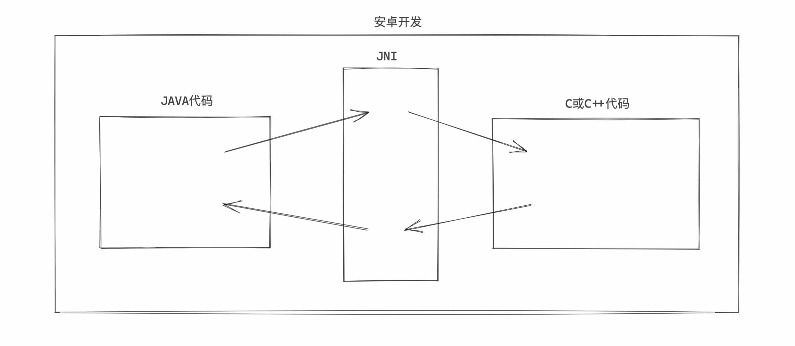

JNI存在的意义是什么呢？

- 【开发】一些系统底层功能Java无法直接调用，只能借助C、C++编程来实现。
- 【开发】对于一些性能要求比较高的功能，用C、C++更加高效。
- 【爬虫】将核心算法用C、C++ 增加逆向破解的难度。

对于我们来讲，需要了解安卓开发中如何用JNI进行开发，并实现Java和C代码的相互调用，更有利于你的分析和逆向app程序。


那么如何基于JNI来开发app程序呢？

ndk，native develop kits。本地开发工具包，用于JNI开发的工具包。

- 【之前】单独下载。

- 【现在】Andorid Studio

  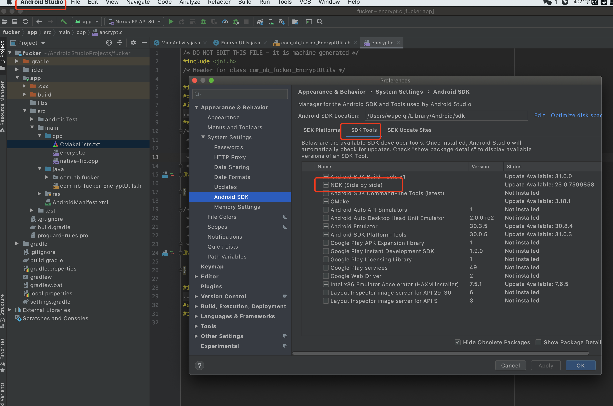


只要你安装好的NDK，就可以基于Andriod Studio进行JNI开发。

- 原来的安装项目开发【city】
  - Empty 模板
- 新建Andriod项目时，会用C去开发核心代码。【Navtive C++模板】
  - Navtive C++模板（Empty 模板 + C基本设置）


如果你想在java中结合JNI实现调用C代码。

- 项目中进行调用

  ```python
  int res = EncryptUtils.add(1,2);
  ```

- Java类，不需要实现具体的逻辑，只定义类和方法。

  ```java
  package com.nb.fucker;
  
  //com.nb.fucker.EncryptUtils
  class EncryptUtils {
  
      static {
          // 加载C语言的文件。
          System.loadLibrary("encrypt");
      }
  
      /*
      调用native方法实现数据相加
       */
      public static native int add(int v1, int v2);
  
      /*
      调用native方法实现字符串加密
       */
      public static native String sign(String origin);
  }
  
  ```

- C/C++，具体实现功能的函数。

  ```c
  // java_包名_类名称_方法名称
  // java_com_nb_fucker_EncryptUtils_add
  Java_com_nb_fucker_EncryptUtils_add(JNIEnv *env, jclass obj, jint v1, jint v2) {
      int base = 100;
      int result = base + v1 - v2;
      return result;
  }
  
  Java_com_nb_fucker_EncryptUtils_sign(JNIEnv *env, jclass obj, jstring origin) {
  
      char data[] = "ubffi19912ybbbc";
      data[0] = 'b';
  
      return (*env)->NewStringUTF(env, data);
  }
  ```

- 配置 CMakeLists.txt

  ```python
  add_library( # Sets the name of the library.
      encrypt
  
      # Sets the library as a shared library.
  
      SHARED
      # Provides a relative path to your source file(s).
  
      encrypt.c)
  
  target_link_libraries( # Specifies the target library.
          native-lib encrypt
  
          # Links the target library to the log library
          # included in the NDK.
          ${log-lib})
  ```


## 1. Native C++模板

在项目开发之处，如果知道项目肯定会用到JNI开发，那么在创建安卓项目时，可以选择 Native C++模板。

- 空安卓Activety
- 基本JNI配置。


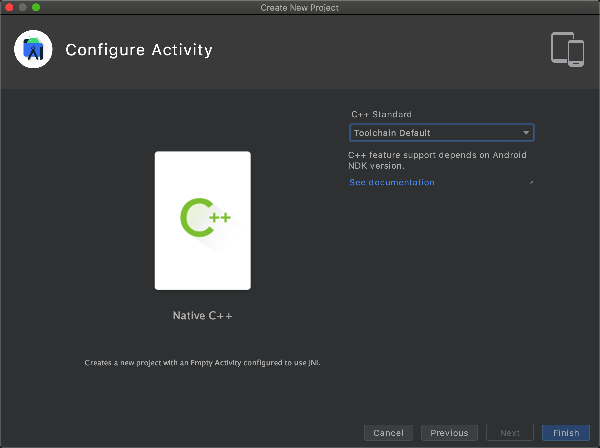

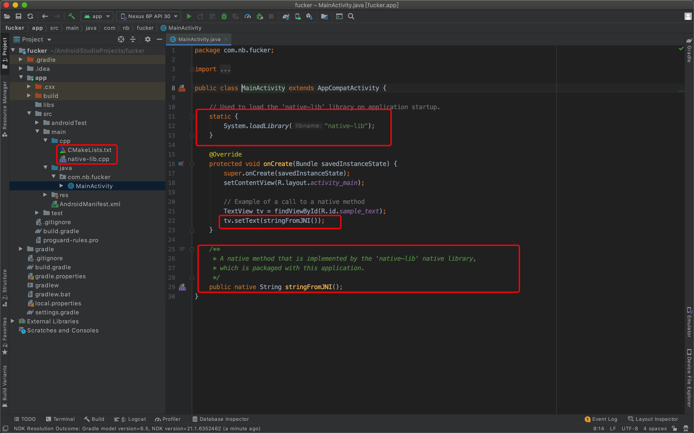


### 1.1 新建加密类

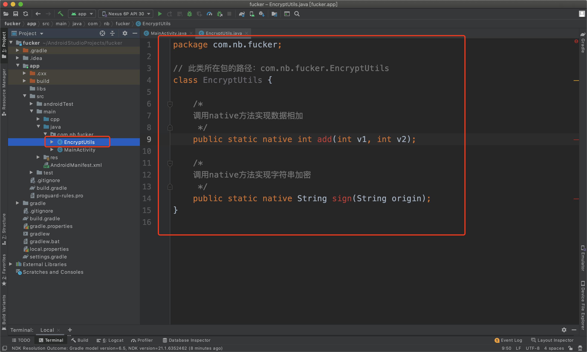


### 1.2 生成头文件

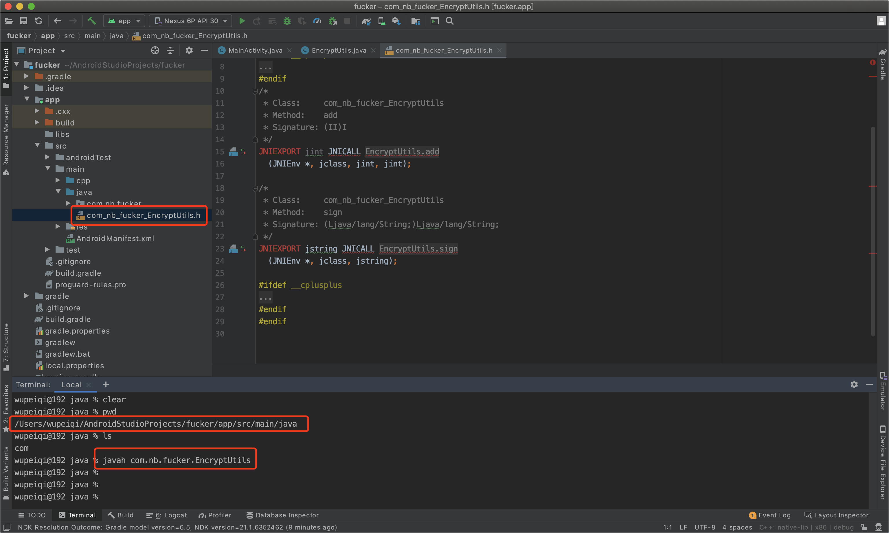


### 1.3 创建c文件

创建c文件，用于编写算法的底层实现（将头文件的内容拷贝过来，在他的基础上进行修改）。


提示：删除上一步生成的头文件。

### 1.4 配置

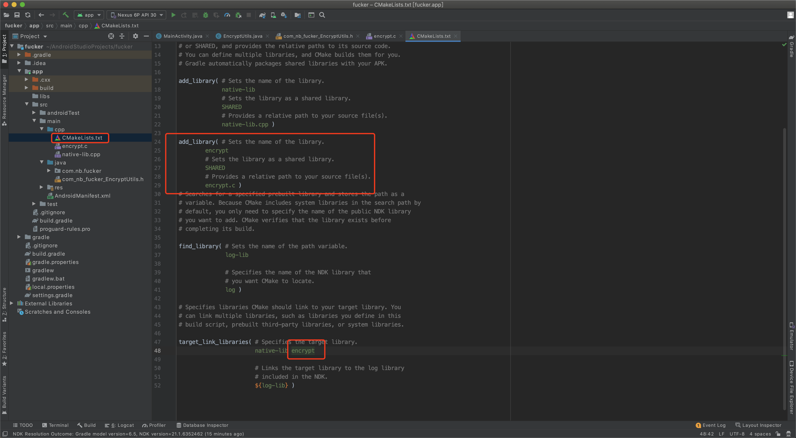


### 1.5 同步

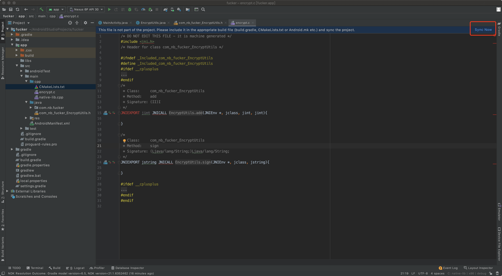


同步，程序不再报错，接下来就需要补充代码并基于C实现具体的算法。

注意：如果无法同步，则需要在项目中安装NDK。

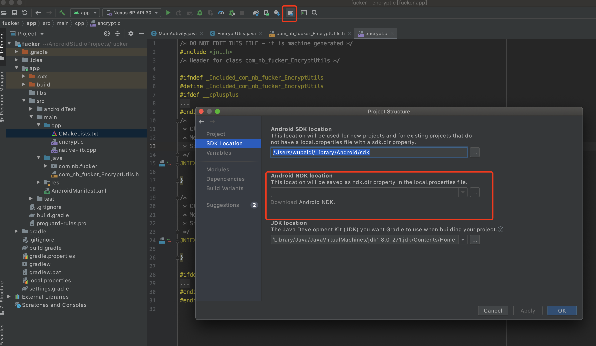


### 1.6 算法实现

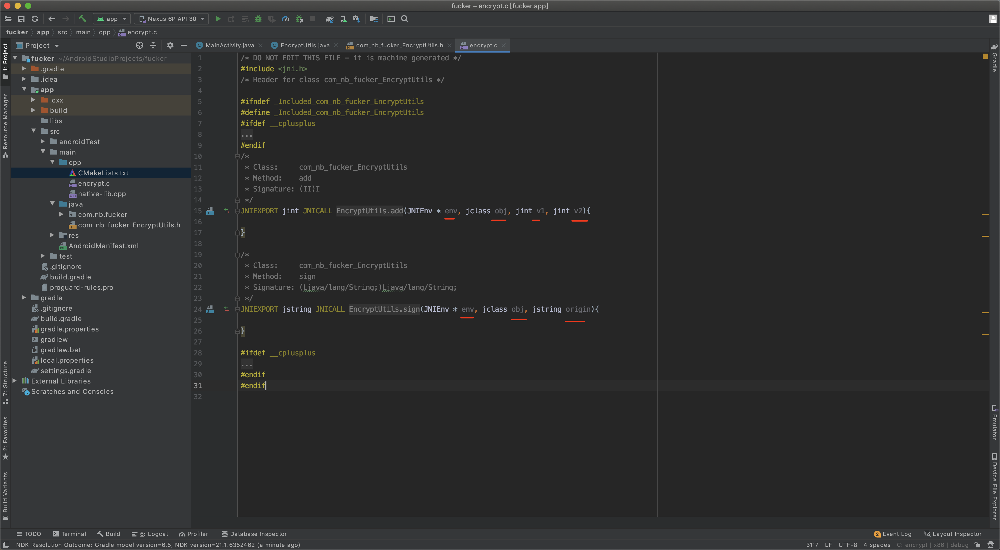

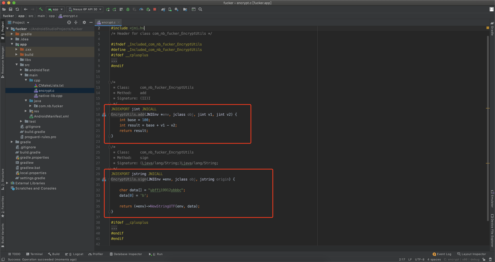


### 1.7 运行并调用

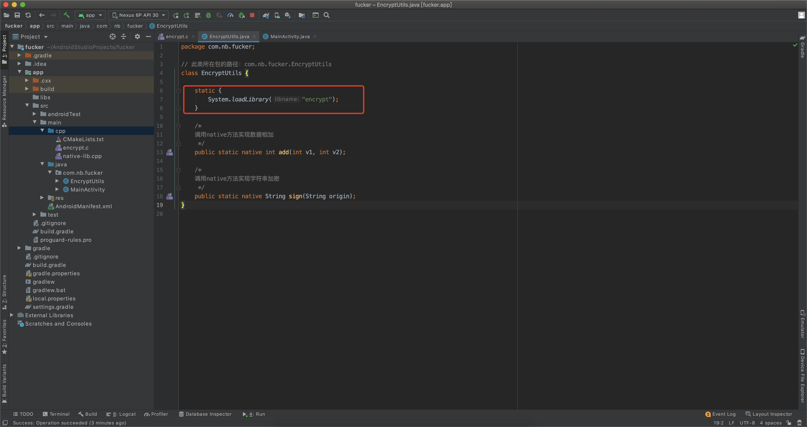


## 价值

逆向别人网站的so文件时，知道他们文件名之间的对应关系。

告诉一个不幸的消息，定位到到我的C函数太简单了。


## 2.动态注册

上述示例是基于静态注册，即使：

```
	 Java中的包名称					  				C中定义的方法名称
com.nb.fucker.EncryptUtils				Java_com_nb_fucker_EncryptUtils_add
```

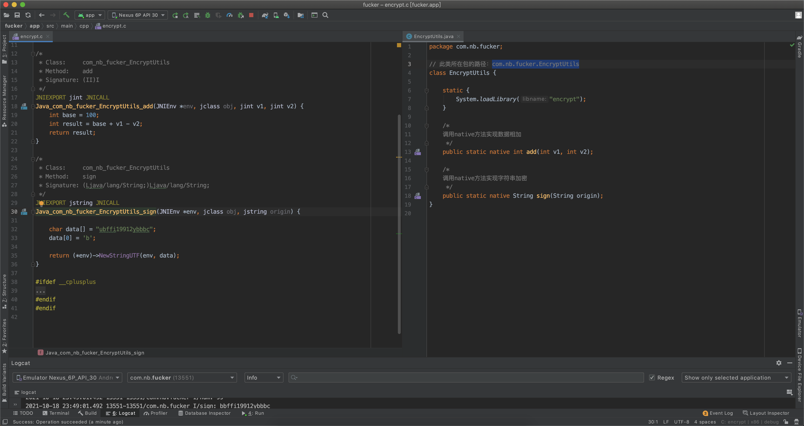


动态注册的步骤：

- 调用

  ```python
  int v1 = DynamicUtils.add(1,2)
  ```

  

- Java的类

  ```java
  package com.nb.fucker;
  
  class DynamicUtils {
      static {
          System.loadLibrary("dynamic");
      }
  
      public static native int add(int v1, int v2);
  }
  ```

- C函数

  ```c
  jint plus(JNIEnv *env, jobject obj, jint v1, jint v2) {
      return v1 + v2;
  }
  
  
  static JNINativeMethod gMethods[] = {
          //Java函数             C语言中的函数
          {"add", "(II)I", (void *) plus},
  };
  
  JNIEXPORT jint JNICALL JNI_OnLoad(JavaVM *vm, void *reserved) {
      JNIEnv *env = NULL;
      // 在java虚拟机中获取 env
      if ((*vm)->GetEnv(vm, (void **) &env, JNI_VERSION_1_6) != JNI_OK) {
          return JNI_ERR;
      }
      
      // 找到Java中的类，env=JNI
      jclass clazz = (*env)->FindClass(env, "com/nb/fucker/DynamicUtils");
  
      // 将类中的方法注册到JNI中
      int res = (*env)->RegisterNatives(env, clazz, gMethods, 1);
      
      if (res < 0) {
          return JNI_ERR;
      }
      return JNI_VERSION_1_6;
  }
  ```

- 配置 CMakeLists.txt

  ```
  ...
  ```

  

## 价值

分析动态注册流程。


