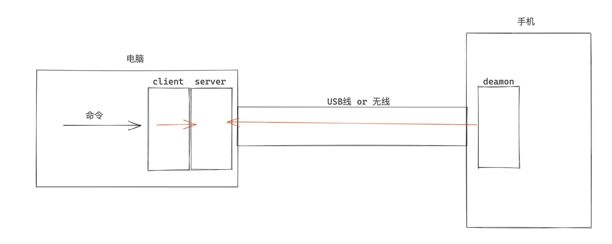
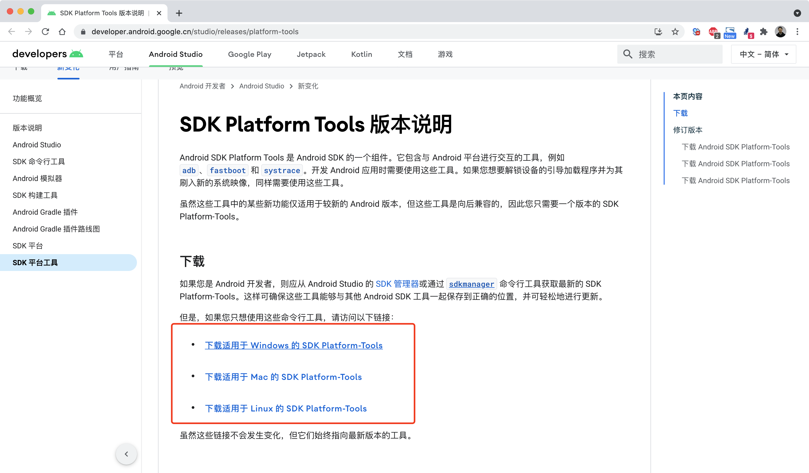
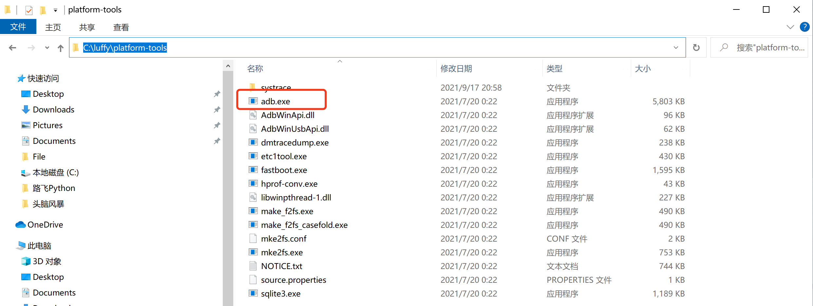
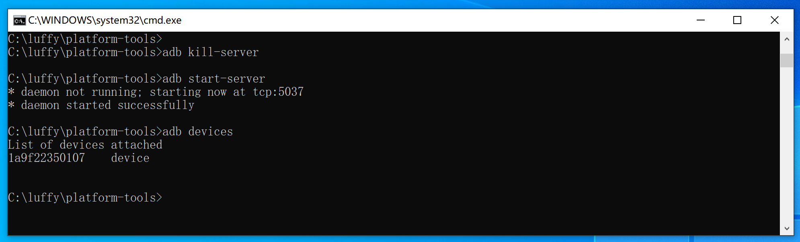

# ADB

Android Debug Bridge，简称 adb（调试桥 ） 是一种功能多样的命令行工具，可让您与设备进行通信。



`adb` 包含在 Android SDK 平台工具软件包中。

- 方式1：您可以使用 [SDK 管理器](https://developer.android.google.cn/studio/intro/update#sdk-manager)下载此软件包，该管理器会将其安装在 `android_sdk/platform-tools/` 下。
- 方式2：如果您需要独立的 Android SDK 平台工具软件包，也可以[点击此处进行下载](https://developer.android.google.cn/studio/releases/platform-tools)。


## 1.下载ADB

https://developer.android.google.cn/studio/releases/platform-tools




## 2.安装

安装，其实就是将压缩包解压并放入指定文件夹（也可以添加到环境变量），例如：




## 3.启动adb

```
>>>adb start-server     启动ADB
>>>adb kill-server		关闭ADB
>>>adb devices          查看已连接的设备
```

注意：设备需要开启USB调试并与PC连接起来之后，才能监测到设备。




后期如果想要给某个设备发送命令命令的话，只需要执行：

```
adb -s 设备ID 相关命令
```


## 4.常用命令


- 上传和下载文件

  ```
  adb -s 1a9f22350107 push C:\2345Downloads\demo.txt /sdcard
  ```

  ```
  adb -s 1a9f22350107 pull /sdcard/demo.txt C:\2345Downloads
  ```

- 安装和卸载app

  ```
  adb -s 1a9f22350107 install C:\2345Downloads\xianyu.apk
  ```

  ```
  adb -s 1a9f22350107 uninstall   包名称
  adb -s 1a9f22350107 uninstall   com.taobao.idlefish
  adb -s 1a9f22350107 uninstall   com.nb.city
  ```

  ```
  adb -s 1a9f22350107 shell pm list packages 		  		  # 查看包列表
  adb -s 1a9f22350107 shell pm list packages	-e 关键字   	# 查看包列表（搜索）
  ```

- 查看处理器（32位/64位）

  ```
  adb shell -s 1a9f22350107 getprop ro.product.cpu.abi 
  ```

  ```
  armeabi-v7a（32位ARM设备）
  arm64-v8a（64位ARM设备）
  ```

- 进入系统

  ```
  C:\luffy\platform-tools> adb shell
  olivelite:/ $ su
  olivelite:/ # ls
  acct            init.exaid.hardware.rc               lost+found
  apex            init.mishow.ctl.rc                   mnt
  bin             init.miui.cust.rc                    odm
  ```

- 其他

  ```
  - 查看手机设备：adb devices
  - 查看设备型号：adb shell getprop ro.product.model
  - 查看电池信息：adb shell dumpsys battery
  - 查看设备ID：adb shell settings get secure android_id
  - 查看设备IMEI：adb shell dumpsys iphonesubinfo
  - 查看Android版本：adb shell getprop ro.build.version.release
  - 查看手机网络信息：adb shell ifconfig
  - 查看设备日志：adb logcat
  - 重启手机设备：adb reboot
  - 安装一个apk：adb install /path/demo.apk
  - 卸载一个apk：adb uninstall <package>
  - 查看系统运行进程：adb shell ps
  - 查看系统磁盘情况：adb shell ls /path/
  - 手机设备截屏：adb shell screencap -p /sdcard/aa.png
  - 手机文件下载到电脑：adb pull /sdcard/aa.png ./
  - 电脑文件上传到手机：adb push aa.png /data/local/
  - 手机设备录像：adb shell screenrecord /sdcard/ab.mp4
  - 手机屏幕分辨率：adb shell wm size
  - 手机屏幕密度：adb shell wm density
  - 手机屏幕点击：adb shell input tap xvalue yvalue
  - 手机屏幕滑动：adb shell input swipe 1000 1500 200 200
  - 手机屏幕带时间滑动：adb shell input swipe 1000 1500 0 0 1000
  - 手机文本输入：adb shell input text xxxxx
  - 手机键盘事件：adb shell input keyevent xx
  ```

  

## 5.小案例：刷抖音

- 打开抖音

  ```
  adb shell am start -n com.ss.android.ugc.aweme/.splash.SplashActivity
  ```

- 滑动屏幕

  ```
  adb shell input swipe 311 952 622 444 400
  ```

  

```python
import subprocess

adb_path = "tools/platform-tools-mac/adb"
device = "1a9f22350107"
package_name = "com.ss.android.ugc.aweme"

# 打开抖音
subprocess.getoutput(f"{adb_path} -s {device} shell am start -n {package_name}/.splash.SplashActivity")

# 刷抖音（在屏幕滑动的命令）
# subprocess.getoutput(f"{adb_path} -s {device} shell input swipe 311 952 622 444 400")

# 点赞（在屏幕点击的命令）
# subprocess.getoutput(f"{adb_path} -s {device} shell input tap 1092 989")
```


