# day10 毒app

今日概要：

- adb工具
- 毒app
  - 抓包
  - 反编译
  - 基于frida来进行Hook（Java代码）
  - newSign算法 so 文件
  - 基于frida来进行Hook（C代码）【AES加密的key】


## 1.adb工具

见 adb 文件。

在座的各位你们无序，你们找到 android SDK目录。


注意：手机、模拟器 -> 开发者模式。


## 2.得物app


### 2.1 设备

- 模拟器
- 已root真机


### 2.2 抓包工具

- charles 且 charles证书已安装到模拟器了。

  ```
  安装证书：
  	- android 7版本之前：模拟器
  	- android 7版本之后：证书文件 --> ssl  --> 发到手机上（root） --> 系统受信任的证书。（现在不用做）
  ```

- 手机中：drony


### 2.3 抓包

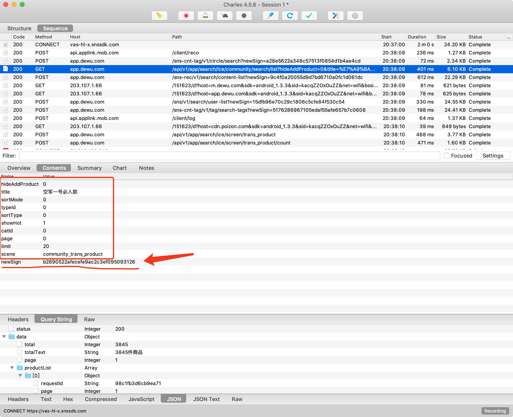


大家的思考：

- 之前的请求返回
- app内部算法获得（一般情况sign都是是算法）。


### 2.4 根据关键字去定位算法

- newSign
- 根据URL去搜索关键字
- 其他参数
- 【以后】Hook HashMap的put方法


去哪里搜索关键字？反编译app的APK文件。

- jadx（搜索）
- jeb
- gda

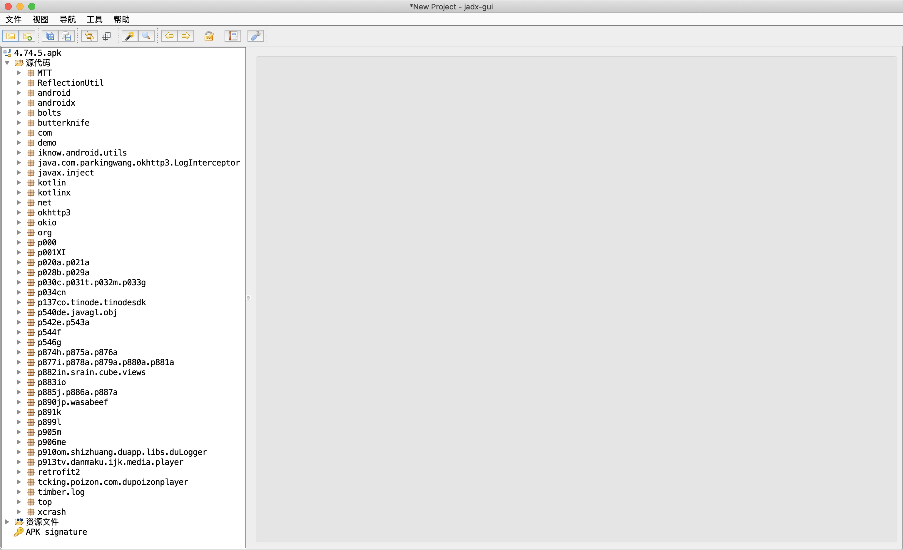


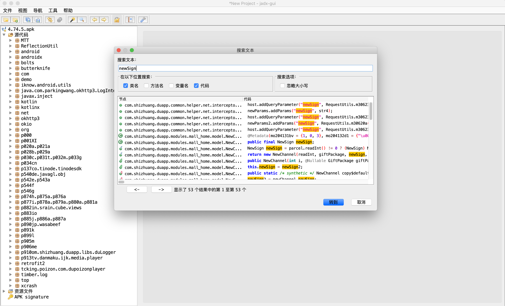


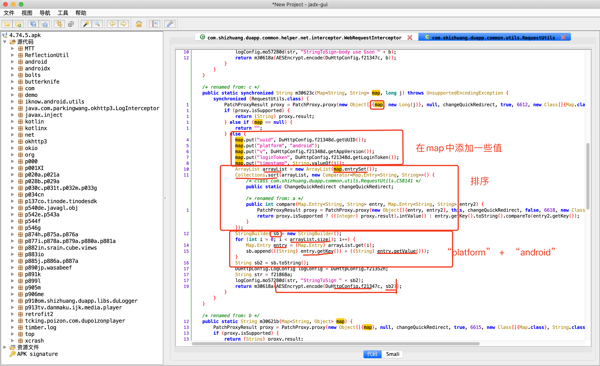


大致分析：

- 参数会传入一个map，时间戳

- map中添加一些键值对

  ```python
  map.put("uuid", DuHttpConfig.f21348d.getUUID());
  map.put("platform", "android");
  map.put("v", DuHttpConfig.f21348d.getAppVersion());
  map.put("loginToken", DuHttpConfig.f21348d.getLoginToken());
  map.put("timestamp", String.valueOf(j));
  ```

- 参数排序并拼接

- 根据拼接后的字符串进行AES加密

- 在对aes结果进行MD5加密。

- 结果赋值 newSign 。


### 2.5 点击后是否走此方法

是否有一种机制，可以让我们实现：

- 替换安卓代码中的某个方法
- 在里面写一个 输出 ，说明请求执行流程正确。

在安卓逆向中大家说的hook，其实就是让自己自定义的函数替换某个写函数。


frida，专门用于hook的神器。

#### 1.安装frida

- 电脑安装：frida

  ```python
  pip install frida
  pip install frida-tools
  ```

- 手机安装：frida（root权限）

  ```
  1. 确定手机的CPU架构
  	adb -s emulator-5554 shell getprop ro.product.cpu.abi     模拟器：x86_64
  2. 下载frida-server 包
  	https://github.com/frida/frida/releases
  3. 解压，改名 frida-server
  4. 将 frida-server 上传到手机上。
  ```

  ```
  5. 先将 frida-server 推到到手机的 /sdcard
  adb -s 设备 push  xx/xxx/xxx/frida-server  /sdcard
  ```

  ```
  6.通过adb shell 进入手机
  
  wupeiqi@192 ~ % adb shell       进入手机
  root@x86_64:/ # su -            获得root权限
  ```

  ```
  7.将frida-server移动到 /data/local/tmp
  root@x86_64:/ # mv /sdcard/frida-server  /data/local/tmp 
  root@x86_64:/ # cd /data/local/tmp 
  ```

  ```
  8.给frida-server赋可执行权限
  root@x86_64:/ # chmod 777 frida-server
  ```


#### 2.运行frida

- 第一步：【电脑】在电脑通过adb进行端口的转发

  ```
  adb forward tcp:27042 tcp:27042
  adb forward tcp:27043 tcp:27043
  ```

  

- 第二步：【手机】通过adb的shell进入手机并运行起来frida

  ```
  wupeiqi@192 ~ % adb shell       进入手机
  root@x86_64:/ # su -            获得root权限
  root@x86_64:/ # cd /data/local/tmp 
  root@x86_64:/ # ./frida-server
  ```

  

- 第三步：【电脑】写代码让咱们自定义的函数替换 安卓手机中的函数 并运行起来。

  ```python
  import frida
  import sys
  
  rdev = frida.get_remote_device()
  session = rdev.attach("com.shizhuang.duapp")
  
  # 目标：指定替换是那个包中的方法名
  #   - 包名称：com.shizhuang.duapp.common.utils
  #   - 类名称：RequestUtils
  #   - 方法名：c        m30623c-jadx工具给你创造的。
  #       - 参数1：map<string,string>
  #       - 参数2：long
  scr = """
  Java.perform(function () {
      // 导入类
      var RequestUtils = Java.use("com.shizhuang.duapp.common.utils.RequestUtils");
  
      // 找到类中的方法进行hook
      RequestUtils.c.implementation = function(map,j){
          console.log("666");
          var res = this.c(map,j);
          console.log("999");
          return res;
      }    
  
  });
  """
  script = session.create_script(scr)
  
  
  def on_message(message, data):
      print(message, data)
  
  
  script.on("message", on_message)
  
  script.load()
  sys.stdin.read()
  
  ```

  直接运行：
  

  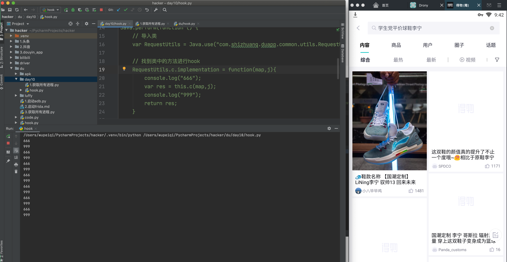


```python
import frida
import sys

rdev = frida.get_remote_device()
session = rdev.attach("com.shizhuang.duapp")

# 目标：指定替换是那个包中的方法名
#   - 包名称：com.shizhuang.duapp.common.utils
#   - 类名称：RequestUtils
#   - 方法名：c        m30623c-jadx工具给你创造的。
#       - 参数1：map<string,string>
#       - 参数2：long
scr = """
Java.perform(function () {
    // 导入类
    var RequestUtils = Java.use("com.shizhuang.duapp.common.utils.RequestUtils");

    // 找到类中的方法进行hook
    RequestUtils.c.implementation = function(map,j){
        var res = this.c(map,j);
        console.log(res);
        return res;
    }    

});
"""
script = session.create_script(scr)


def on_message(message, data):
    print(message, data)


script.on("message", on_message)

script.load()
sys.stdin.read()

```


结论，请求中newSign的算法一定会经过。


### 2.6 深入分析次方法


大致分析：

- 参数会传入一个map，时间戳

  ```
  请求的URL中GET传入的参数
  ```

  ```
  hideAddProduct	0
  title	空军一号必入款
  sortMode	0
  typeId	0
  sortType	0
  showHot	1
  catId	0
  page	0
  limit	20
  scene	community_trans_product
  ```

- map中添加一些键值对

  ```python
  map.put("uuid", DuHttpConfig.f21348d.getUUID());
  map.put("platform", "android");
  map.put("v", DuHttpConfig.f21348d.getAppVersion());
  map.put("loginToken", DuHttpConfig.f21348d.getLoginToken());
  map.put("timestamp", String.valueOf(j));
  ```

- 参数排序并拼接，之后的结果：

  ```
  catId0hideAddProduct0limit20loginTokenpage0platformandroidscenecommunity_trans_productshowHot1sortMode0sortType0timestamp1634825149805title空军一号必入款typeId0uuidacfc41da1e61b072v4.74.5
  ```

  ```
  - timestamp:1634825149805
  - uuid: acfc41da1e61b072
  ```

- 根据拼接后的字符串进行AES加密

- 在对aes结果进行MD5加密。

- 结果赋值 newSign 。


#### 1. Hook encode方法

从这个方法可以获取两个东西：

- 获取所有的参数
- 看看他的内部实现


先通过hook来看看str到底是个啥？

```python
import frida
import sys

rdev = frida.get_remote_device()
session = rdev.attach("com.shizhuang.duapp")

# 目标：指定替换是那个包中的方法名
#   - 包名称：com.shizhuang.duapp.common.utils
#   - 类名称：RequestUtils
#   - 方法名：c        m30623c-jadx工具给你创造的。
#       - 参数1：map<string,string>
#       - 参数2：long
scr = """
Java.perform(function () {
    // 导入类
    var RequestUtils = Java.use("com.shizhuang.duapp.common.utils.RequestUtils");
    var AESEncrypt = Java.use("com.duapp.aesjni.AESEncrypt");

    // 找到类中的方法进行hook
    AESEncrypt.encode.overload('java.lang.Object', 'java.lang.String').implementation = function(obj,args){
        
        console.log("1.参数拼接后的值=",args);
        
        var res = this.encode(obj,args);
        return res;
    }    
    
    // 找到类中的方法进行hook
    RequestUtils.c.implementation = function(map,j){
        var res = this.c(map,j);
        console.log("2.生成newSign的值=",res);
        return res;
    }   

});
"""
script = session.create_script(scr)


def on_message(message, data):
    print(message, data)


script.on("message", on_message)

script.load()
sys.stdin.read()
```


```
map = {
    hideAddProduct	0
    title	空军一号必入款
    sortMode	0
    typeId	0
    sortType	0
    showHot	1
    catId	0
    page	0
    limit	20
    scene	community_trans_product
}

map.put("uuid", DuHttpConfig.f21348d.getUUID());
map.put("platform", "android");
map.put("v", DuHttpConfig.f21348d.getAppVersion());
map.put("loginToken", DuHttpConfig.f21348d.getLoginToken());
map.put("timestamp", String.valueOf(j));

-> key值key值key值key值key值key值key值key值

1.参数拼接后的值= catId0hideAddProduct0limit20loginTokenpage0platformandroidscenecommunity_trans_productshowHot1sortMode0sortType0timestamp1634825149805title空军一号必入款typeId0uuidacfc41da1e61b072v4.74.5


2.生成newSign的值= 3be95445acd081adbe1b2b855ecbb632
```

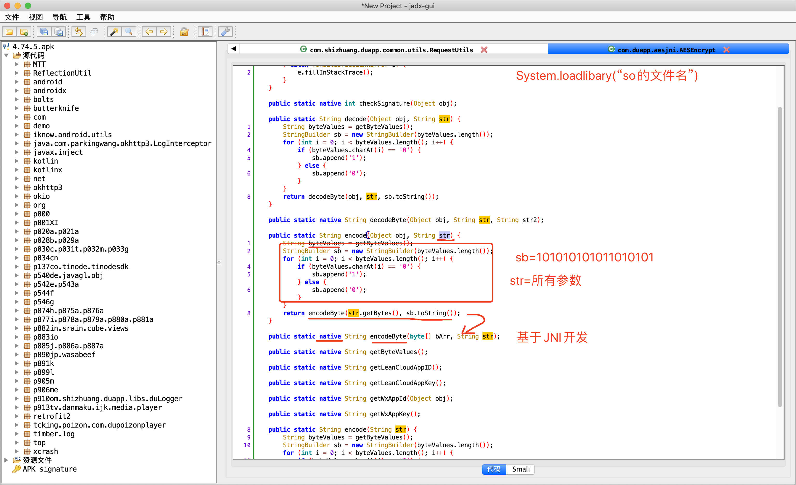


#### 2. so中的 encodeByte方法

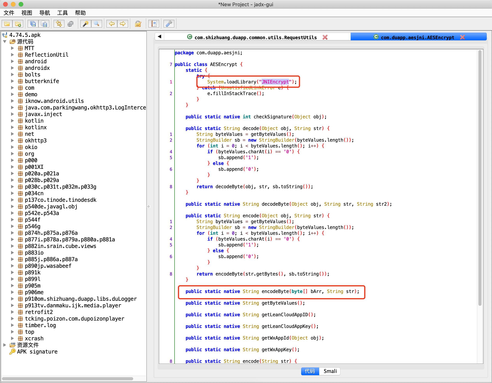


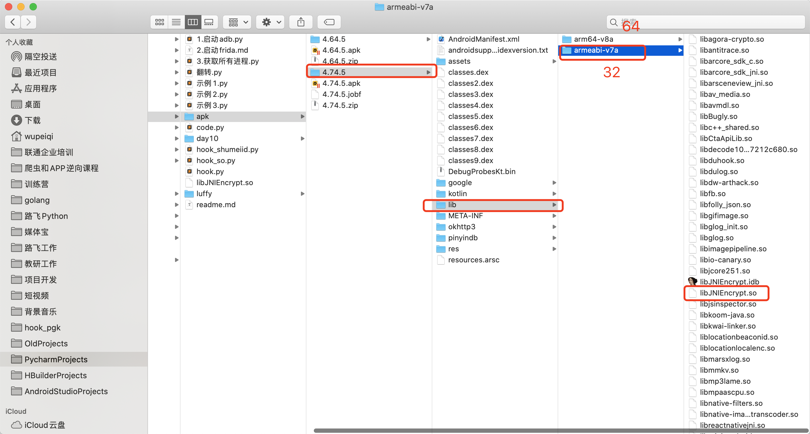


反编译so文件，看看他的C代码是如何实现的。


IDA工具，反编译so文件。

- 如果安卓程序员开发JNI时，静态注册。`Java_包名_类名_方法名`
- 如果安卓程序员开发JNI时，动态注册。`JNI_Onload`

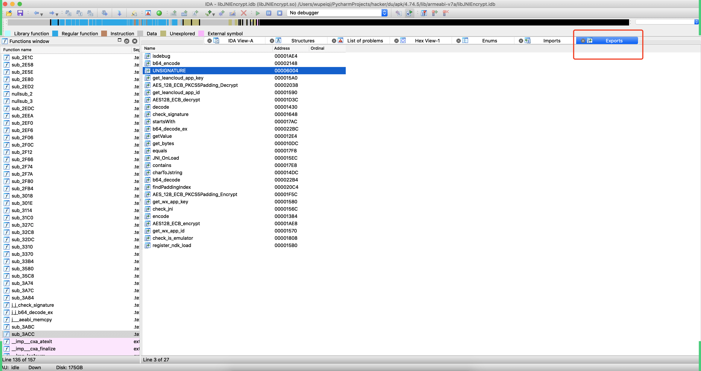


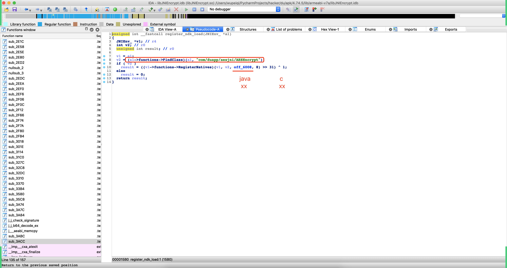


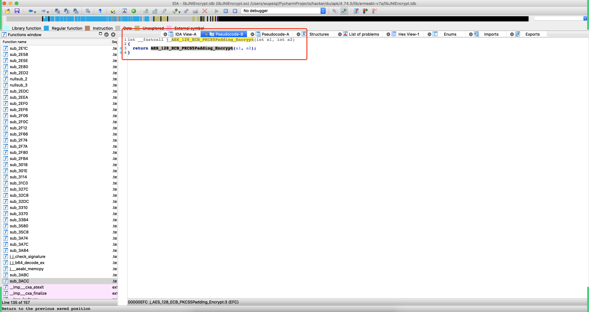


#### 3.hook so AES_128_ECB_PKCS5Padding_Encrypt

基于frida去hook so文件中某个JNI函数。

- 模拟器，无法完成 so 中的JNI函数hook（app中只提供了arm32、64位架构）
- 真机，arm架构（红米8A - 32)

```python
# com.shizhuang.duapp
import frida
import sys

rdev = frida.get_remote_device()
session = rdev.attach("com.shizhuang.duapp")

scr = """
Java.perform(function () {    
    var addr_func = Module.findExportByName("libJNIEncrypt.so", "AES_128_ECB_PKCS5Padding_Encrypt");
    Interceptor.attach(addr_func, {
        onEnter: function(args){
        	// 进入并执行函数：AES_128_ECB_PKCS5Padding_Encrypt，args就是参数
            console.log("-------------参数 1-------------");
            console.log(args[0].readUtf8String())
            
            console.log("-------------参数 2-------------");
            console.log(args[1].readUtf8String());
        },
        onLeave: function(retValue){
            console.log("-------------返回-------------");
            console.log(retValue.readUtf8String());
        }
    })
});
"""
script = session.create_script(scr)


def on_message(message, data):
    print(message, data)


script.on("message", on_message)
script.load()
sys.stdin.read()
```


```
/Users/wupeiqi/PycharmProjects/hacker/.venv/bin/python /Users/wupeiqi/PycharmProjects/hacker/du/hook_so.py
-------------参数 1-------------
loginTokenplatformandroidrefreshFlag1timestamp1630150454842uuid5134632ab5e3cbf0v4.75.0
-------------参数 2-------------
d245a0ba8d678a61 -> key
-------------返回-------------
knGGXR0bR7LQn4eRCvJsdYNfetkeqjZBVthbIRIafsqv0YFHekjJsi6VKoEXUuXa6mz5NcD27rP2o4xSRtmZ0oeT/VYgmQ7NSZzwnhAdSAZMefeRfChNlYX4DE9XhuBb
```


结果：内部so中AES加密且加密的字符串

```
catId0hideAddProduct0limit20loginTokenpage0platformandroidscenecommunity_trans_productshowHot1sortMode0sortType0timestamp1634825149805title空军一号必入款typeId0uuidacfc41da1e61b072v4.74.5
```

key=`d245a0ba8d678a61`


## 总结

- 请求时，传入了一些参数：

  ```
  hideAddProduct	0
  title	空军一号必入款
  sortMode	0
  typeId	0
  sortType	0
  showHot	1
  catId	0
  page	0
  limit	20
  scene	community_trans_product
  ```

- 根据上述参数来进行生成newSign

  - 字符串的拼接，排序并生成最终的待加密的字符串。

    ```
    hideAddProduct	0
    title	空军一号必入款
    sortMode	0
    typeId	0
    sortType	0
    showHot	1
    catId	0
    page	0
    limit	20
    scene	community_trans_product
    
    map.put("uuid", DuHttpConfig.f21348d.getUUID());
    map.put("platform", "android");
    map.put("v", DuHttpConfig.f21348d.getAppVersion());
    map.put("loginToken", DuHttpConfig.f21348d.getLoginToken());
    map.put("timestamp", String.valueOf(j));
    
    拼接后的字符串如下：
    catId0hideAddProduct0limit20loginTokenpage0platformandroidscenecommunity_trans_productshowHot1sortMode0sortType0timestamp1634825149805title空军一号必入款typeId0uuidacfc41da1e61b072v4.74.5
    - timestamp:1634825149805
    - uuid: acfc41da1e61b072
    
    import random
    def create_android_id():
        data_list = []
        for i in range(1, 9):
            part = "".join(random.sample("0123456789ABCDEF", 2))
            data_list.append(part)
        return "".join(data_list).lower()
        
    uuid = create_android_id()
    ```

  - 根据 待加密的字符串 + key 进行AES加密 -> 得到AES密文

    ```python
    key = "d245a0ba8d678a61"
    data_string = "catId0hideAddProduct0limit20loginTokenpage0platformandroidscenecommunity_trans_productshowHot1sortMode0sortType0timestamp1634825149805title空军一号必入款typeId0uuidacfc41da1e61b072v4.74.5"
    
    from Crypto.Cipher import AES
    from Crypto.Util.Padding import pad
    
    def aes_encrypt(data_string):
        key = "d245a0ba8d678a61"
        aes = AES.new(
            key=key.encode('utf-8'),
            mode=AES.MODE_ECB,
        )
        raw = pad(data_string.encode('utf-8'), 16)
        return aes.encrypt(raw)
    ```

  - 拿到AES密文后，再进行MD5加密（无盐）

    ```python
    import hashlib
    
    def md5(data_bytes):
        hash_object = hashlib.md5()
        hash_object.update(data_bytes)
        return hash_object.hexdigest()
    ```

  - MD5加密后的结果就是：newSign

- 再次放入到请求的参数中，将请求发送到后台。

  ```
  hideAddProduct	0
  title	空军一号必入款
  sortMode	0
  typeId	0
  sortType	0
  showHot	1
  catId	0
  page	0
  limit	20
  scene	community_trans_product
  newSign=MD5加密后的结果就是：newSign
  ```

  


得物的后台，从请求头中获取：uuid和时间戳。

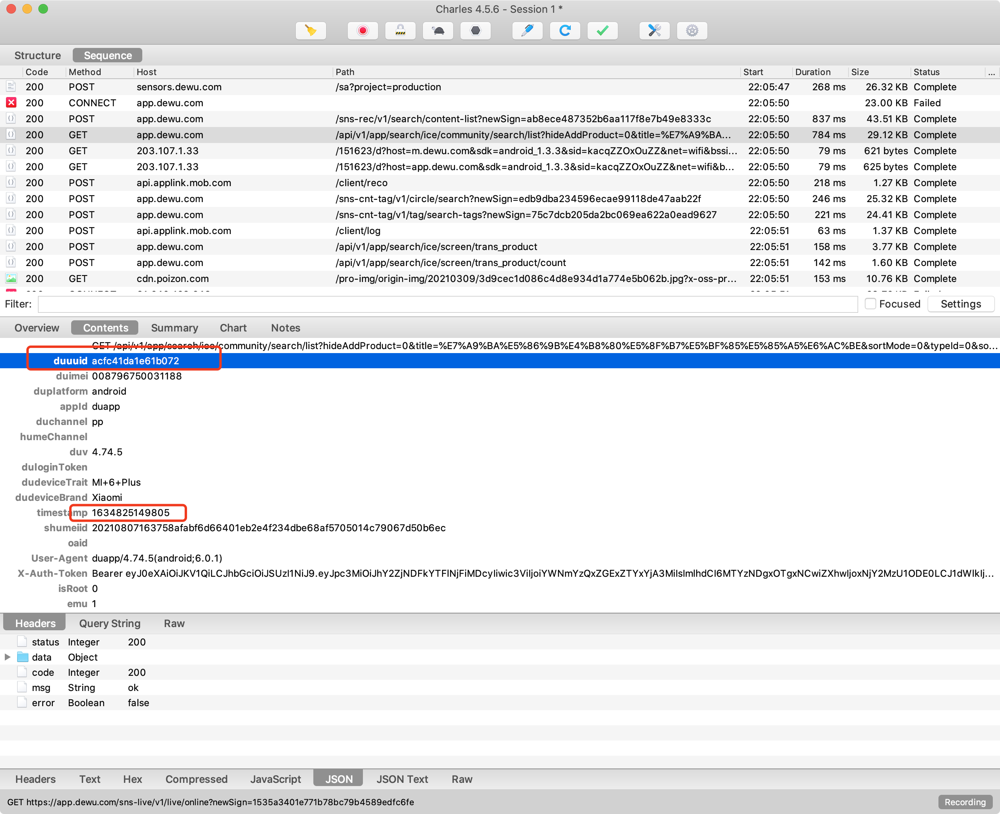


## 不幸的消息

- 学技术，完全没问题。

- 通过得物的接口去获取搜索数据。

  ```
  - 10月19号前：无限制的获取数据。
  - 10月19号后：验证码（**）
  ```

  


