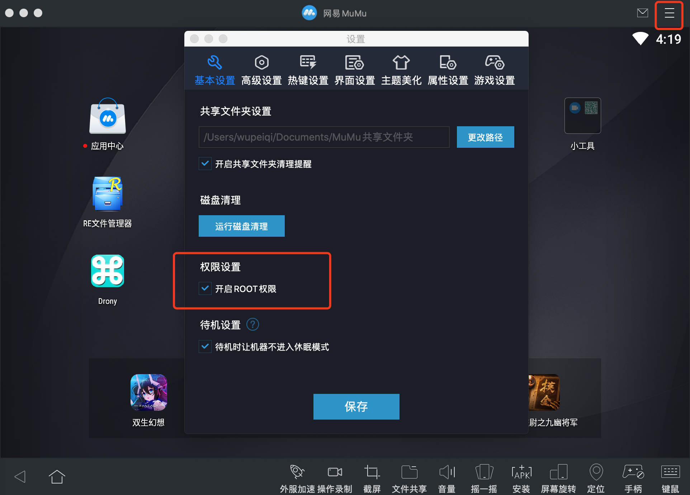
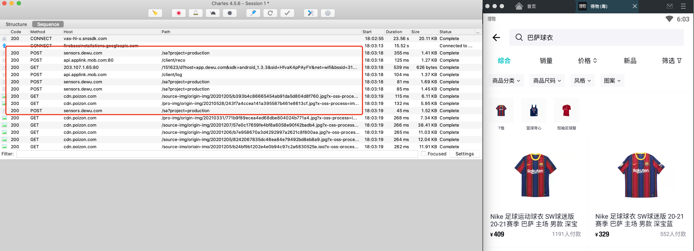
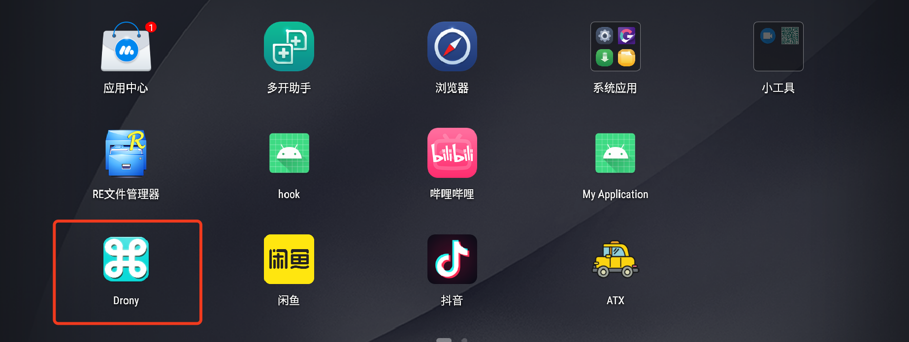
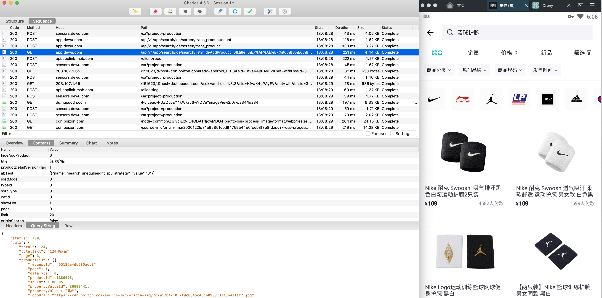
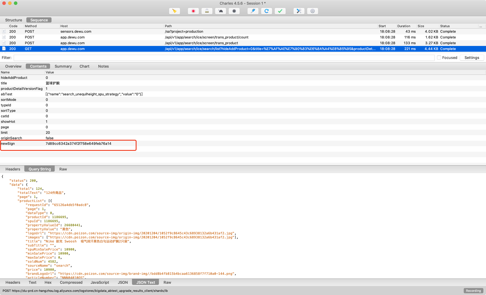
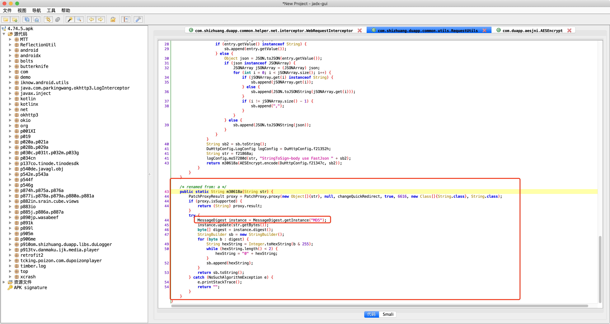
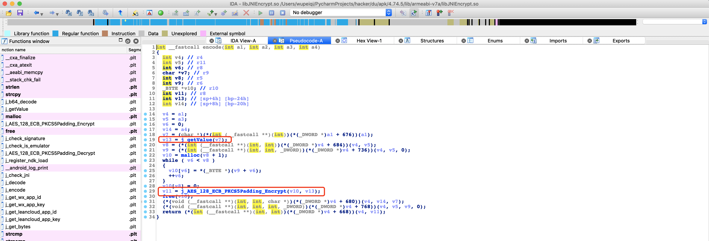
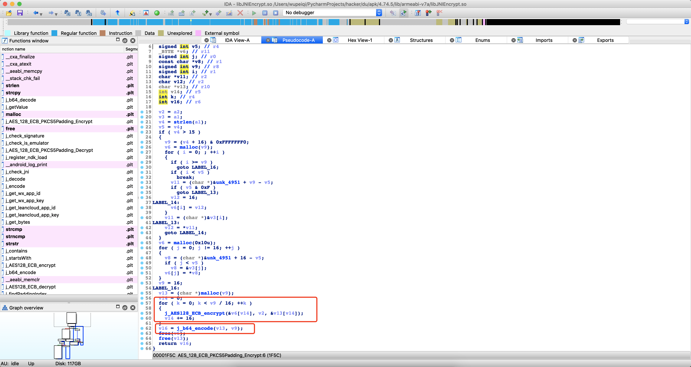
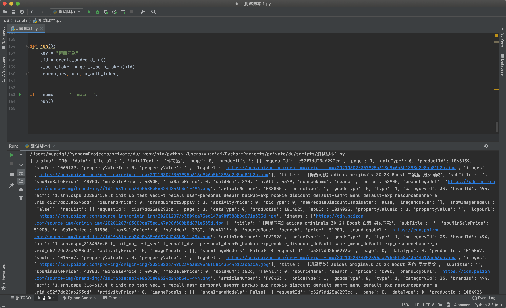

### 1. 模拟器

安装安卓模拟器，用于模拟手机操作。推荐：网易mumu

注意：要开启模拟器中的root权限。




提醒：so文件的逆向&调试。


### 2. 抓包工具

安装 charles 来对 模拟器 中的app进行抓包。

- 【charles】查看IP地址
- 【安卓模拟器】wifi中设置代理（charles中的IP地址）。
- 【安卓模拟器】在浏览器上打开网址：chls.pro/ssl，下载并安装证书（抓https包）。




### 3. 抓不到咋办？

本质上：安卓开发在OKHttp设置Proxy.NO_PROXY来屏蔽系统代理。






### 4.分析请求参数




### 5.反编译apk

通过反编译apk文件从而得到java代码，然后根据关键字去寻找相关代码的位置。





```
1. 拼接参数  
	param_dict = {
		原有参数值
        "loginToken": 未知,
        "platform": 未知,
        "timestamp": 未知,
        "uuid": 未知,
        "v": 未知
    }
2. 根据key进行排序并拼接，例如：
	ordered_string = loginTokenplatformandroidtimestamp1630148299777uuidacfc41da1e61b072v4.74.5

3. 对拼接的字符串进行 aes加密
	aes_data = aes加密(ordered_string)
	
4. md5加密
	sign = md5加密(aes_data)

5. 最后将sign放到参数中，进行搜索。
```


### 6.Hook

Frida是一个基于Python实现Hook框架，让你可以结合Python & JavaScript实现对app的Hook。

- 在自己PC的Python环境中安装frida

  ```
  pip install frida
  pip install frida-tools
  ```

- 手机安装frida

  ```
  1. 根据手机cpu选择frida-server并下载。地址：https://github.com/frida/frida/releases （x86 or arm）
  2. 解压，然后重名为：frida-server
  3. 将frida-server文件上传到手机的 /data/local/tmp 目录
  ```

```
adb -s emulator-5554 shell getprop ro.product.cpu.abi
```

此时的frida已安装成功，但未启动。【依赖adb】

在使用frida时，一般都会配合 adb  来使用，以方便来操作frida。

接下来，我们将使用adb来启动frida。

```
>>> ./hook_pgk/adb/platform-tools-mac/adb kill-server
>>> ./hook_pgk/adb/platform-tools-mac/adb start-server
```

```
>>> ./hook_pgk/adb/platform-tools-mac/adb shell

root@x86_64:/ # cd /data/local/tmp/                                            

root@x86_64:/data/local/tmp # ls
frida-server
frida-server-64
re.frida.server

root@x86_64:/data/local/tmp # chmod 777 frida-server-64                        

root@x86_64:/data/local/tmp # ./frida-server-64   
```

启动后还不够，还需要进行端口的转发。

```
./hook_pgk/adb/platform-tools-mac/adb forward tcp:27042 tcp:27042
./hook_pgk/adb/platform-tools-mac/adb forward tcp:27043 tcp:27043
```

上述操作完成之后，就可以编写代码进行hook了。


```python
# com.shizhuang.duapp
import frida
import sys

rdev = frida.get_remote_device()
session = rdev.attach("com.shizhuang.duapp")

scr = """
Java.perform(function () {
    var RequestUtils = Java.use("com.shizhuang.duapp.common.utils.RequestUtils");
    var AESEncrypt = Java.use("com.duapp.aesjni.AESEncrypt");
    
    // 先进行aes加密
     AESEncrypt.encode.overload('java.lang.Object', 'java.lang.String').implementation = function(params,arg5){
        console.log("aes加密传来的arg5=",arg5);
        var res = this.encode(params,arg5);
        console.log("aes加密后的结果res=", res);
        return res;
    }
    
    // 再进行md5加密
    RequestUtils.a.overload('java.lang.String').implementation = function(arg9){
        var res = this.a(arg9);
        // console.log("md5加密参数=",arg9);
        console.log("md5加密结果=",res);
        // console.log(Java.use("android.util.Log").getStackTraceString(Java.use("java.lang.Throwable").$new()));
        console.log("---------");
        return res;
    }
});
"""
script = session.create_script(scr)


def on_message(message, data):
    print(message, data)


script.on("message", on_message)
script.load()
sys.stdin.read()
```

```python
---------
aes加密传来的
sb2= 'abTest[{"name":"search_unequlheight_spu_strategy","value":"0"}]catId0hideAddProduct0limit20loginTokenoriginSearchfalsepage0platformandroidproductDetailVersionFlag1showHot1sortMode0sortType0suggestRequestId7cd2dda38c86b0d7timestamp1630155301455title篮球护腕耐克typeId0uuidacfc41da1e61b072v4.74.5'


aes加密后的结果res= 'CAq/7Du5NqfKIvlaSO2V2s+p2sBgFrKmJlDXjTMDBvv6LQ3p3mwEeAXo+/QIKq8nBwH/k8pLVxLuHthHYgk63i8+9EaJg2Jj/kDxtu2Ejo8zJb3wn4EM1IXhugtNrVXadzG4bIf+VjXYAmvrf3cL9DjcYu+aU8P+2HBelZi97KLM2GJoda6uUroa+w3gvQc8tg8IjLNh1h0Bza0EFhy5iVlpOTtaWcpYCi/FLn9aJ7HUZloyHFZ66ENuc9NEY9823TZcD2l25wK8OU5wfnwcEitKecCKMaQkSazKfw50EsEUXTyeb35wqNgdSpHVQLW2TjLa5fBx30EGAoD8RK7QPxPtgRkSgRkIEkF0EnadTX+uyyeoJyRv42CfM0Z6rSf8DbIgoKNOgqtuBePlMd5NWA=='


md5加密结果= '05bd70f31fe62e5870edab17158c5065'
			 05bd70f31fe62e5870edab17158c5065
      		 05bd70f31fe62e5870edab17158c5065
---------
```


#### 6.1 MD5加密

```python
aes加密传来的arg5= abTest[{"name":"search_unequlheight_spu_strategy","value":"0"}]catId0hideAddProduct0limit20loginTokenoriginSearchfalsepage0platformandroidproductDetailVersionFlag1showHot1sortMode0sortType0suggestRequestId7ec4431283d6e62dtimestamp1630149238290title巴萨罗那交通卡typeId0uuidacfc41da1e61b072v4.74.5
aes加密后的结果res= CAq/7Du5NqfKIvlaSO2V2s+p2sBgFrKmJlDXjTMDBvv6LQ3p3mwEeAXo+/QIKq8nBwH/k8pLVxLuHthHYgk63i8+9EaJg2Jj/kDxtu2Ejo8zJb3wn4EM1IXhugtNrVXadzG4bIf+VjXYAmvrf3cL9DjcYu+aU8P+2HBelZi97KLM2GJoda6uUroa+w3gvQc8tg8IjLNh1h0Bza0EFhy5iVlpOTtaWcpYCi/FLn9aJ7HUZloyHFZ66ENuc9NEY982DbIoKFOBUCcMUicRwJrsaCTHpqK8KwTKuEdYLwGJHwejHQxBwJ73CoxJ2mUm0K5Gv9TNo9w/P6XEUqNbZR8EvmpFK+OY2wkNa0DMyIxYqGXLDnp350IbLDaHG2U7J2GVCf86G6WelepvFVKZTuS0FQ==
md5加密结果= b5d76dac19ac3f2df50c4eaf3b99d3cf
```

```python
import hashlib

def md5(data_bytes):
    hash_object = hashlib.md5()
    hash_object.update(data_bytes)
    return hash_object.hexdigest()


aes_string = b"CAq/7Du5NqfKIvlaSO2V2s+p2sBgFrKmJlDXjTMDBvv6LQ3p3mwEeAXo+/QIKq8nBwH/k8pLVxLuHthHYgk63i8+9EaJg2Jj/kDxtu2Ejo8zJb3wn4EM1IXhugtNrVXadzG4bIf+VjXYAmvrf3cL9DjcYu+aU8P+2HBelZi97KLM2GJoda6uUroa+w3gvQc8tg8IjLNh1h0Bza0EFhy5iVlpOTtaWcpYCi/FLn9aJ7HUZloyHFZ66ENuc9NEY982DbIoKFOBUCcMUicRwJrsaCTHpqK8KwTKuEdYLwGJHwejHQxBwJ73CoxJ2mUm0K5Gv9TNo9w/P6XEUqNbZR8EvmpFK+OY2wkNa0DMyIxYqGXLDnp350IbLDaHG2U7J2GVCf86G6WelepvFVKZTuS0FQ=="
sign = md5(aes_string)
print(sign) # b5d76dac19ac3f2df50c4eaf3b99d3cf
```


#### 6.2 AES加密

aes的加密过程调用了 `JNIEncrypt.so`







Hook这个so文件来获取参数（需要用真机，虚拟机不可以）

```python
# com.shizhuang.duapp
import frida
import sys

rdev = frida.get_remote_device()
session = rdev.attach("com.shizhuang.duapp")

scr = """
Java.perform(function () {
    //var soAddr = Module.findBaseAddress("libJNIEncrypt.so");
    //console.log(soAddr); 
    //var loadModule=Module.load("libJNIEncrypt.so");
    //console.log(loadModule);
    
    var addr_func = Module.findExportByName("libJNIEncrypt.so", "AES_128_ECB_PKCS5Padding_Encrypt");
    Interceptor.attach(addr_func, {
        onEnter: function(args){
            console.log("-------------参数 1-------------");
            console.log(args[0].readUtf8String())
            console.log("-------------参数 2-------------");
            console.log(args[1].readUtf8String());
        },
        onLeave: function(retValue){
            console.log("-------------返回-------------");
            console.log(retValue.readUtf8String());
        }
    })
});
"""
script = session.create_script(scr)


def on_message(message, data):
    print(message, data)


script.on("message", on_message)
script.load()
sys.stdin.read()
```


```python
/Users/wupeiqi/PycharmProjects/hacker/.venv/bin/python /Users/wupeiqi/PycharmProjects/hacker/du/hook_so.py
-------------参数 1-------------
loginTokenplatformandroidrefreshFlag1timestamp1630150454842uuid5134632ab5e3cbf0v4.75.0
-------------参数 2-------------
d245a0ba8d678a61
-------------返回-------------
knGGXR0bR7LQn4eRCvJsdYNfetkeqjZBVthbIRIafsqv0YFHekjJsi6VKoEXUuXa6mz5NcD27rP2o4xSRtmZ0oeT/VYgmQ7NSZzwnhAdSAZMefeRfChNlYX4DE9XhuBb
```


所以， aes加密算法：

```python
import hashlib
from Crypto.Cipher import AES
from Crypto.Util.Padding import pad
from urllib.parse import quote_plus
import base64


def md5(data_bytes):
    hash_object = hashlib.md5()
    hash_object.update(data_bytes)
    return hash_object.hexdigest()


def aes_encrypt(data_string):
    key = "d245a0ba8d678a61"
    aes = AES.new(
        key=key.encode('utf-8'),
        mode=AES.MODE_ECB,
    )
    raw = pad(data_string.encode('utf-8'), 16)
    return aes.encrypt(raw)


data = 'catId0loginTokenoriginSearchfalseplatformandroidscreenTabFilter1suggestRequestId4e64edfb94eb4ec5timestamp1628436196502title卡地亚蓝气球男士手表uuidacfc41da1e61b072v4.74.5'
aes_string = aes_encrypt(data)
aes_string = base64.encodebytes(aes_string)
aes_string = aes_string.replace(b"\n", b"")
sign = md5(aes_string)
print(sign)

```


### 7. 搞定了




