# day11 B站

目标：自动刷播放（APP端）。

- 版本：v6.24.0

  ```
  https://www.wandoujia.com/apps/281291/history_v6240300
  ```

- 工具

  - jeb
  - jadx

- 抓包

  - charles
  - mumu模拟器


## 1.抓包

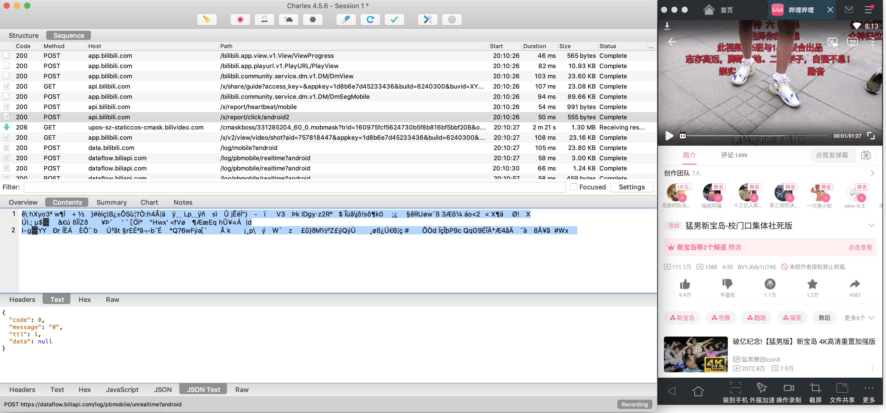


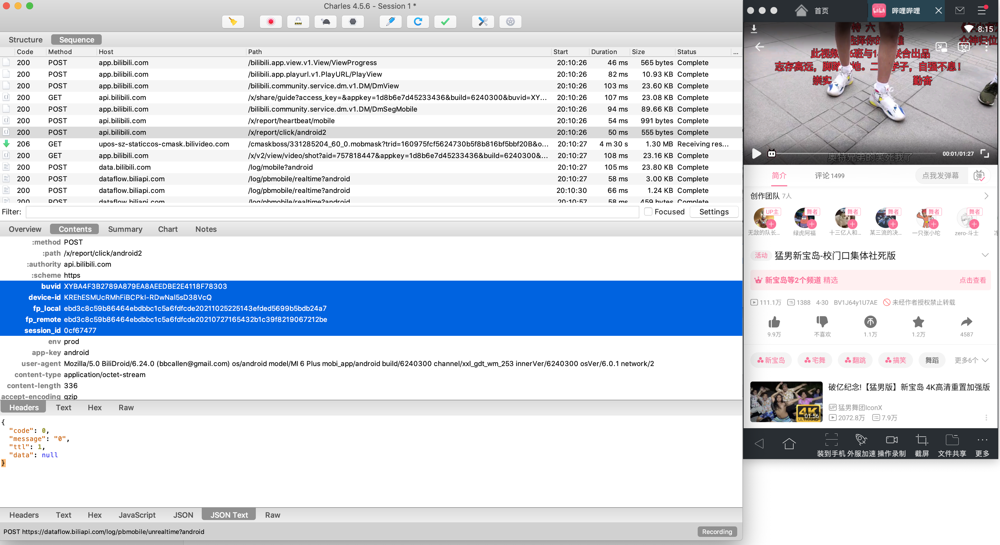


后续的逆向过程：

- 请求体
- 请求头（5个算法）


根据关键字去搜索：

- `/x/report/click/android2`


应该同时打开：

- jadx，优先。
- jeb


## 2.搜索关键字

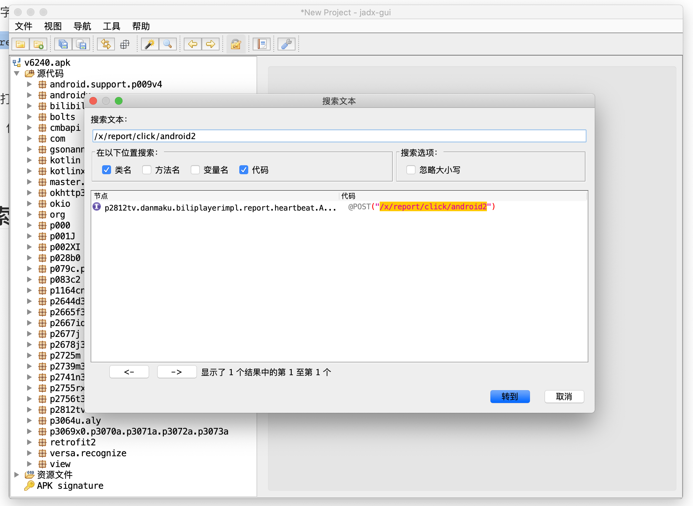


```java
@BaseUrl("https://api.bilibili.com")
/* renamed from: tv.danmaku.biliplayerimpl.report.heartbeat.a */
/* compiled from: BL */
public interface AbstractC65782a {
    @POST("/x/report/click/android2")
    @RequestInterceptor(C42623c.class)
    C42599a<String> reportClick(@Body AbstractC60181c0 c0Var);

    @FormUrlEncoded
    @POST("/x/report/heartbeat/mobile")
    C42599a<GeneralResponse<String>> reportV2(@FieldMap HeartbeatParams heartbeatParams);
}
```


应该想到：

- 一定有一个地方调用 reportClick 来发送请求（处理请求体）

- 请求头中的数据应该在拦截器中：

  ```
  @RequestInterceptor(C42623c.class)
  ```

  

## 3.分析 reportClick 方法

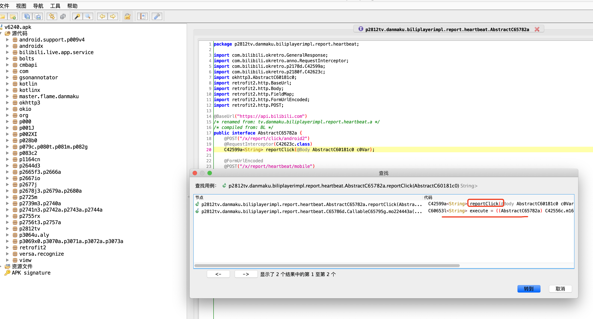

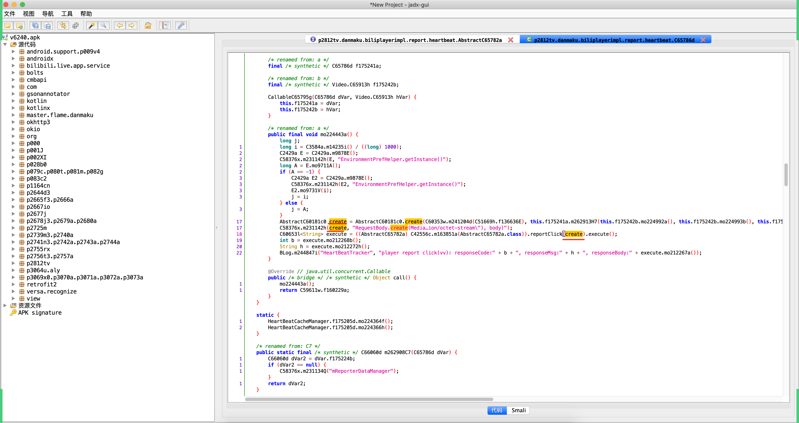


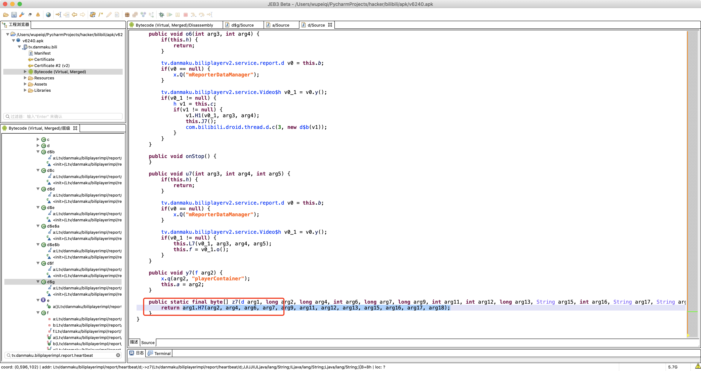


### 3.1 签名

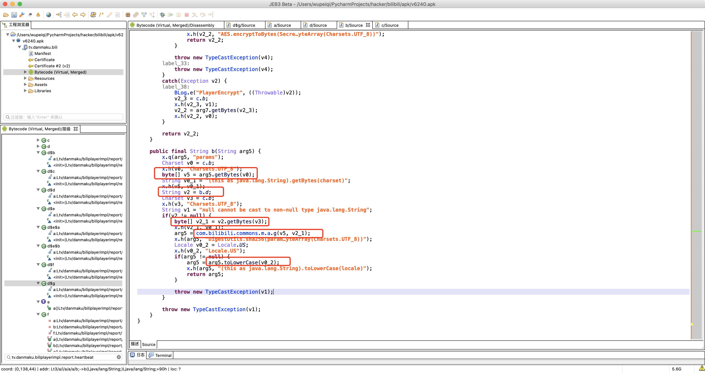

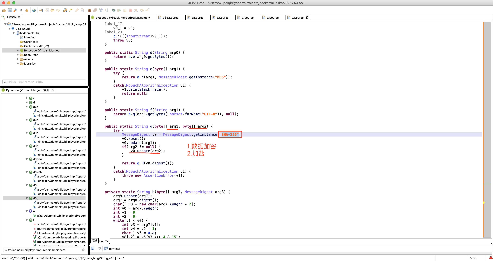

过程：

- 获取请求相关的参数
- 按照顺序拼接字符串
- sha256加密
  - 盐：**9cafa6466a028bfb**
  - 数据：字符串


尝试：

```
t3.a.i.a.a.a.b
b方法。
```


启动并运行frida：

- 端口的转发

  ```
  adb  forward tcp:27042 tcp:27042
  adb  forward tcp:27043 tcp:27043
  ```

- 登录模拟器启动frida

  ```
  adb shell
  su - 
  cd /data/local/tmp/
  ./frida-server
  ```

- 写脚本hook

  - 读取所有进程

    ```
    import frida
    
    # 获取设备信息
    rdev = frida.get_remote_device()
    print(rdev)
    
    # 枚举所有的进程
    processes = rdev.enumerate_processes()
    for process in processes:
        print(process)
    
    # 获取在前台运行的APP
    front_app = rdev.get_frontmost_application()
    print(front_app)
    ```

  - 写hook脚本
    


```python
"""
未加密->aid=377070035&auto_play=0&build=6240300&cid=382149257&did=KREhESMUcRMhFiBCPkI-RDwNal5sD38VcQ&epid=&from_spmid=tm.recommend.0.0&ftime=1635250162&lv=0&mid=0&mobi_app=android&part=1&sid=0&spmid=main.ugc-video-detail.0.0&stime=1635253608&sub_type=0&type=3
加密后-> dd1c45eda72a3bffd05fbb7187774b52f8b904ff9210067a7d35aec89ee312e6
"""

data_string = "aid=377070035&auto_play=0&build=6240300&cid=382149257&did=KREhESMUcRMhFiBCPkI-RDwNal5sD38VcQ&epid=&from_spmid=tm.recommend.0.0&ftime=1635250162&lv=0&mid=0&mobi_app=android&part=1&sid=0&spmid=main.ugc-video-detail.0.0&stime=1635253608&sub_type=0&type=3"
salt = "9cafa6466a028bfb"

import hashlib

obj = hashlib.sha256()
obj.update(data_string.encode('utf-8'))
obj.update(salt.encode('utf-8'))
res = obj.hexdigest().lower()
print(res)
# dd1c45eda72a3bffd05fbb7187774b52f8b904ff9210067a7d35aec89ee312e6
# dd1c45eda72a3bffd05fbb7187774b52f8b904ff9210067a7d35aec89ee312e6
```


### 3.2 再处理

```
aid=377070035&auto_play=0&build=6240300&cid=382149257&did=KREhESMUcRMhFiBCPkI-RDwNal5sD38VcQ&epid=&from_spmid=tm.recommend.0.0&ftime=1635250162&lv=0&mid=0&mobi_app=android&part=1&sid=0&spmid=main.ugc-video-detail.0.0&stime=1635253608&sub_type=0&type=3&sign=sha256加密的结果。
```

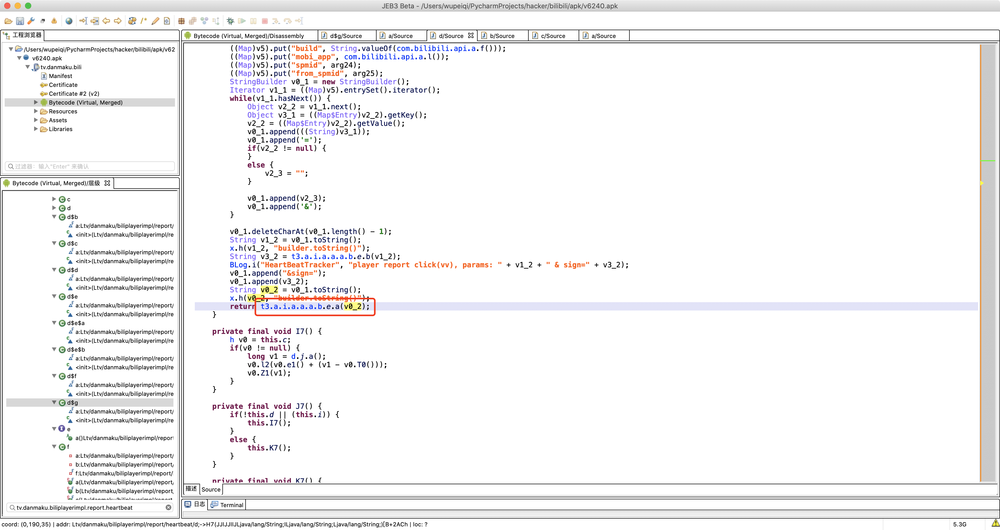


```
key=fd6b639dbcff0c2a1b03b389ec763c4b
iv=77b07a672d57d64c
数据=aid=377070035&auto_play=0&build=6240300&cid=382149257&did=KREhESMUcRMhFiBCPkI-RDwNal5sD38VcQ&epid=&from_spmid=tm.recommend.0.0&ftime=1635250162&lv=0&mid=0&mobi_app=android&part=1&sid=0&spmid=main.ugc-video-detail.0.0&stime=1635253608&sub_type=0&type=3&sign=sha256加密的结果。
```


### 3.3 考虑参数 did

```
auto_play=0&build=6240300&cid=382149257&did=KREhESMUcRMhFiBCPkI-RDwNal5sD38VcQ&epid=&from_spmid=tm.recommend.0.0&ftime=1635250162&lv=0&mid=0&mobi_app=android&part=1&sid=0&spmid=main.ugc-video-detail.0.0&stime=1635253608&sub_type=0&type=3&sign=sha256加密的结果
```

```
{
  "auto_play": "0",
  "build": "6240300",
  "cid": "382149257",
  "did": "KREhESMUcRMhFiBCPkI-RDwNal5sD38VcQ",   # 设备ID
  "epid": "",
  "from_spmid": "tm.recommend.0.0",
  "ftime": "1635250162",   # 首次运行时间
  "lv": "0",
  "mid": "0",
  "mobi_app": "android",
  "part": "1",
  "sid": "0",
  "spmid": "main.ugc-video-detail.0.0",
  "stime": "1635253608",   # 当前时间
  "sub_type": "0",
  "type": "3"
}
```

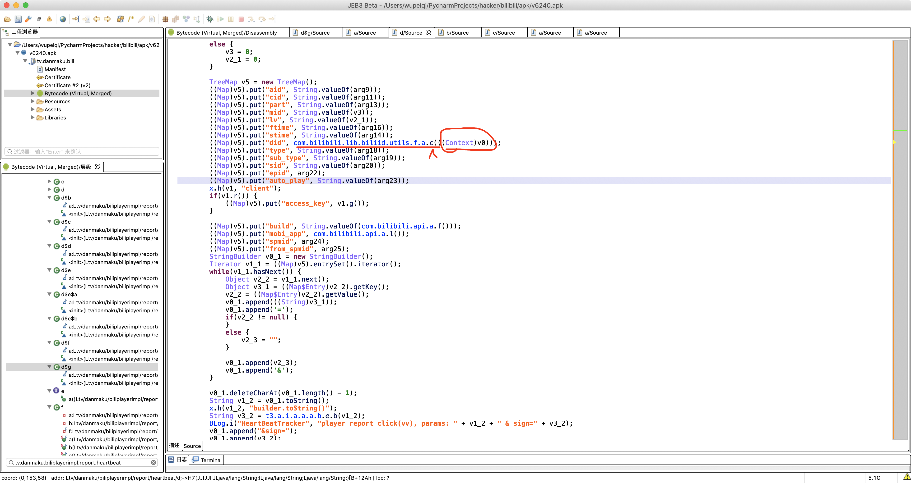


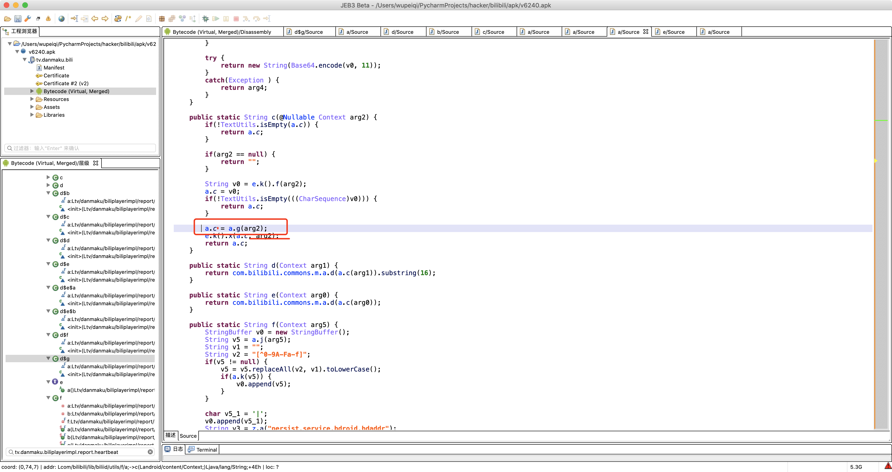


- 先去静态字段中找

- 去xml文件中

  ```
  environment_prefs、persist.c.bl.did
  ```

- a.g算法，到底是怎么生成的？


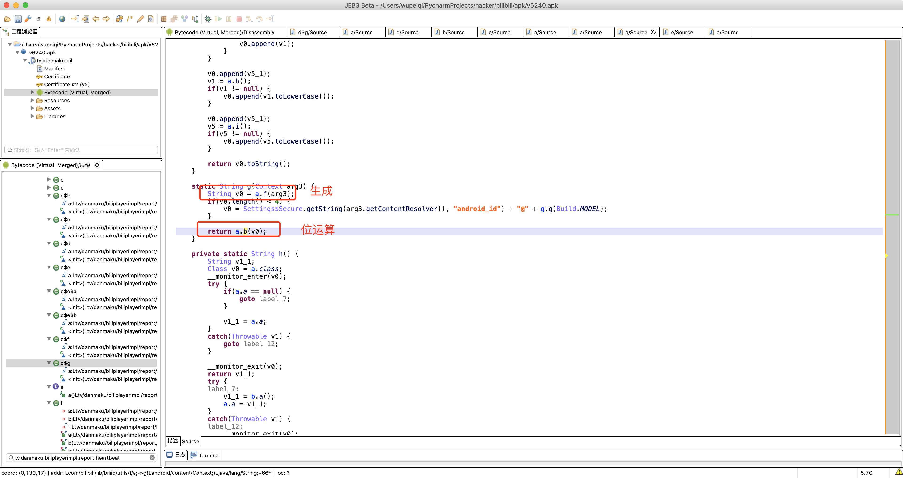


#### 3.3.1 生成


- wifimac地址
- 蓝牙mac地址
- 设备总线注册设备信息
- 设备SN
- 在通过竖线将这个几个值拼接起来。


下面开始hook，监测他们是否为空。

```python
import frida
import sys

rdev = frida.get_remote_device()
session = rdev.attach("tv.danmaku.bili")

scr = """
Java.perform(function () {
    var didCls = Java.use("com.bilibili.lib.biliid.utils.f.a");
    
    didCls.f.implementation = function(arg5){
        var res = this.f(arg5);
        console.log("生成的did = ",res);
        return res;
    }    
   
});
"""
script = session.create_script(scr)


def on_message(message, data):
    print(message, data)


script.on("message", on_message)
script.load()
sys.stdin.read()
```


所以，初次我们需要随机创建mac地址和SN号。

```python
import random
import string


def create_random_mac(sep=":"):
    """ 随机生成mac地址 """

    def mac_same_char(mac_string):
        v0 = mac_string[0]
        index = 1
        while index < len(mac_string):
            if v0 != mac_string[index]:
                return False
            index += 1
        return True

    data_list = []
    for i in range(1, 7):
        part = "".join(random.sample("0123456789ABCDEF", 2))
        data_list.append(part)
    mac = sep.join(data_list)

    if not mac_same_char(mac) and mac != "00:90:4C:11:22:33":
        return mac

    return create_random_mac(sep)


def gen_sn():
    return "".join(random.sample("123456789" + string.ascii_lowercase, 10))


mac_string = create_random_mac(sep="")
sn = gen_sn()

did = "{}|||{}".format(mac_string, sn)
print(did)

```


#### 3.3.2 位运算

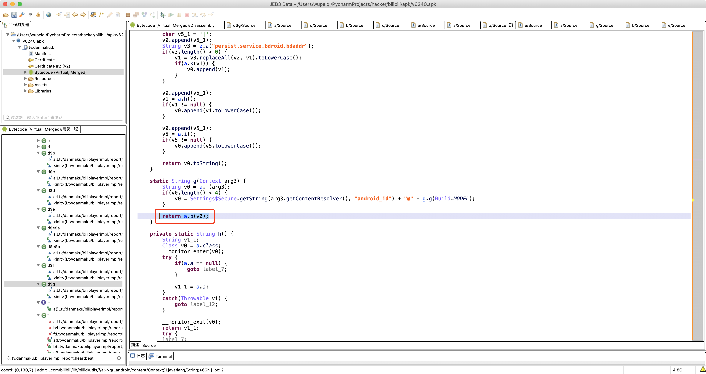


自己写完之后，要测试是否合法。

```python
import random
import string
import base64


def base64_encrypt(data_string):
    data_bytes = bytearray(data_string.encode('utf-8'))
    data_bytes[0] = data_bytes[0] ^ (len(data_bytes) & 0xFF)
    for i in range(1, len(data_bytes)):
        data_bytes[i] = (data_bytes[i - 1] ^ data_bytes[i]) & 0xFF
    res = base64.encodebytes(bytes(data_bytes))
    return res.strip().strip(b"==").decode('utf-8')
```


所以，生成did的逻辑就是这样。

```python
import random
import string
import base64


def base64_encrypt(data_string):
    data_bytes = bytearray(data_string.encode('utf-8'))
    data_bytes[0] = data_bytes[0] ^ (len(data_bytes) & 0xFF)
    for i in range(1, len(data_bytes)):
        data_bytes[i] = (data_bytes[i - 1] ^ data_bytes[i]) & 0xFF
    res = base64.encodebytes(bytes(data_bytes))
    return res.strip().strip(b"==").decode('utf-8')


def create_random_mac(sep=":"):
    """ 随机生成mac地址 """

    def mac_same_char(mac_string):
        v0 = mac_string[0]
        index = 1
        while index < len(mac_string):
            if v0 != mac_string[index]:
                return False
            index += 1
        return True

    data_list = []
    for i in range(1, 7):
        part = "".join(random.sample("0123456789ABCDEF", 2))
        data_list.append(part)
    mac = sep.join(data_list)

    if not mac_same_char(mac) and mac != "00:90:4C:11:22:33":
        return mac

    return create_random_mac(sep)


def gen_sn():
    return "".join(random.sample("123456789" + string.ascii_lowercase, 10))


mac_string = create_random_mac(sep="")
sn = gen_sn()

did = base64_encrypt("{}|||{}".format(mac_string, sn))
print(did)
```


### 小结

至此，我们就将此请求中请求体的处理全部搞定。

- 生成did

- did和其他参数拼接（key进行排序，然后再通过&符号链接起来。）

  ```
  {
    "auto_play": "0",
    "build": "6240300",
    "cid": "382149257",
    "did": "KREhESMUcRMhFiBCPkI-RDwNal5sD38VcQ",   # 设备ID
    "epid": "",
    "from_spmid": "tm.recommend.0.0",
    "ftime": "1635250162",   # 首次运行时间
    "lv": "0",
    "mid": "0",
    "mobi_app": "android",
    "part": "1",
    "sid": "0",
    "spmid": "main.ugc-video-detail.0.0",
    "stime": "1635253608",   # 当前时间
    "sub_type": "0",
    "type": "3"
  }
  ```

- 将拼接起来的字符串进行 sha256加密，得到sign（salt）

  ```
  aid=377070035&auto_play=0&build=6240300&cid=382149257&did=KREhESMUcRMhFiBCPkI-RDwNal5sD38VcQ&epid=&from_spmid=tm.recommend.0.0&ftime=1635250162&lv=0&mid=0&mobi_app=android&part=1&sid=0&spmid=main.ugc-video-detail.0.0&stime=1635253608&sub_type=0&type=3&sign=sha256加密的结果。
  ```

- 再对sign之后的数据进行 AES加密（key、iv）


最终，请求体就是这个AES加密的值。


