# day12 B站（下）


## 1.buvid


此时，我们可以去找都有谁引用过b，还有另外一种方式。

我们对b进行hook，hook到之后，获取他的所有调用栈（谁调用谁）。

```python
import frida
import sys

rdev = frida.get_remote_device()
session = rdev.attach("tv.danmaku.bili")

scr = """
Java.perform(function () {
    var api_c = Java.use("com.bilibili.api.c");

    api_c.b.implementation = function(arg0){
        console.log("设置buvid=",arg0);
        console.log(Java.use("android.util.Log").getStackTraceString(Java.use("java.lang.Throwable").$new()));
        this.b(arg0);
    }    

});
"""
script = session.create_script(scr)


def on_message(message, data):
    print(message, data)


script.on("message", on_message)
script.load()
sys.stdin.read()
```


发现一直没有被hook到？为什么？

```
		   XYBA4F3B2789A879EA8AEEDBE2E4118F78303
设置buvid= XYBA4F3B2789A879EA8AEEDBE2E4118F78303
java.lang.Throwable
	at com.bilibili.api.c.b(Native Method)
	at c2.f.b0.c.a.d.e(BL:1)
	at c2.f.b0.c.a.d.a(BL:11)
	at tv.danmaku.bili.utils.BiliInitHelper$initConfig$2.invoke(BL:1)
	at tv.danmaku.bili.utils.BiliInitHelper$initConfig$2.invoke(BL)
	at com.bilibili.lib.blconfig.internal.CommonContext.c(BL:1)
	at com.bilibili.lib.blconfig.internal.DecisionTree.c(BL:17)
	at com.bilibili.lib.blconfig.internal.DecisionTree.d(BL:1)
	at com.bilibili.lib.blconfig.internal.DecisionTree.c(BL:23)
	at com.bilibili.lib.blconfig.internal.ABNode$toFunction$1$whiteFunc$2.invoke(BL:2)
	at com.bilibili.lib.blconfig.internal.ABNode$toFunction$1$whiteFunc$2.invoke(BL:1)
	at kotlin.SynchronizedLazyImpl.getValue(BL:6)
	at com.bilibili.lib.blconfig.internal.ABNode$toFunction$1.a(BL)
	at com.bilibili.lib.blconfig.internal.ABNode$toFunction$1.b(BL:2)
	at com.bilibili.lib.blconfig.internal.ABNode$toFunction$1.invoke(BL:1)
	at com.bilibili.lib.blconfig.internal.ABSource.f(BL:7)
	at com.bilibili.lib.blconfig.internal.ABSource.invoke(BL:1)
	at com.bilibili.lib.blconfig.internal.h.get(BL:1)
	at com.bilibili.lib.blconfig.a$a.a(BL:1)
	at tv.danmaku.bili.httpdns.internal.configs.a.c(BL:1)
	at tv.danmaku.bili.h0.a.b.a.a.b(BL:1)
	at tv.danmaku.bili.h0.a.b.a.a.g(BL:1)
	at tv.danmaku.bili.h0.a.a.b(BL:1)
	at tv.danmaku.bili.b0.b.a(BL:2)
	at tv.danmaku.bili.proc.MainBiliAppProc.a(BL:8)
	at tv.danmaku.bili.proc.MainBiliAppProcWrapper$onApplicationCreate$1.invoke(BL:2)
	at tv.danmaku.bili.proc.MainBiliAppProcWrapper$onApplicationCreate$1.invoke(BL:1)
	at tv.danmaku.bili.delaytask.a.l(BL:3)
	at tv.danmaku.bili.delaytask.a.e(BL:2)
	at com.bilibili.base.util.a.e(BL:1)
	at tv.danmaku.bili.ui.main2.userprotocol.e.onClick(BL:4)
	at android.view.View.performClick(View.java:5204)
	at android.view.View$PerformClick.run(View.java:21153)
	at android.os.Handler.handleCallback(Handler.java:739)
	at android.os.Handler.dispatchMessage(Handler.java:95)
	at android.os.Looper.loop(Looper.java:148)
	at android.app.ActivityThread.main(ActivityThread.java:5606)
	at java.lang.reflect.Method.invoke(Native Method)
	at com.android.internal.os.ZygoteInit$MethodAndArgsCaller.run(ZygoteInit.java:745)
	at com.android.internal.os.ZygoteInit.main(ZygoteInit.java:635)


```


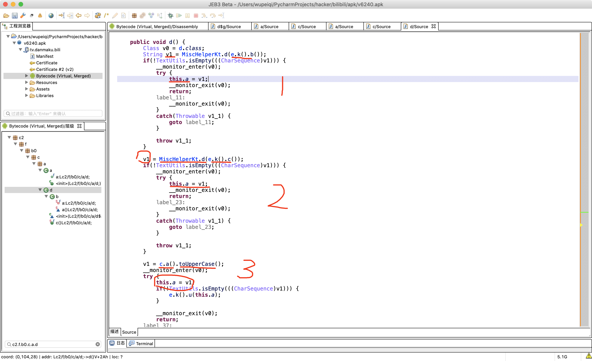


生成并变大写。

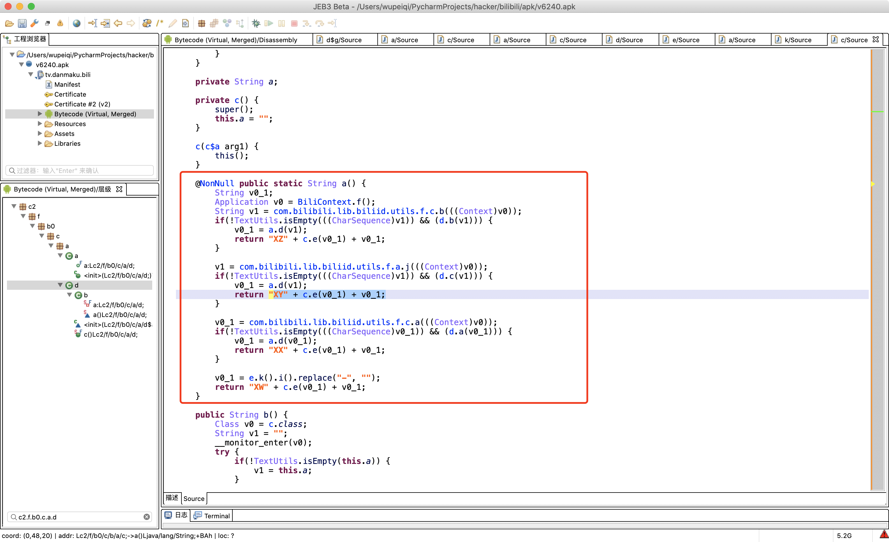


XY + MD5值[2] + MD5值[12] + MD5值[22]  +MD5值

```
XYBA4F3B2789A879EA8AEEDBE2E4118F78303
```


```python
import uuid
import hashlib
import random


def gen_buvid_by_uuid():
    # v1 = "008796750031188"  模拟器中是获取的设备ID
    v1 = str(uuid.uuid4()).replace("-", "")
    md5 = hashlib.md5()
    md5.update(v1.encode('utf-8'))
    v0_1 = md5.hexdigest()

    return "XW{}{}{}{}".format(v0_1[2], v0_1[12], v0_1[22], v0_1).upper()


def create_random_mac(sep=":"):
    # 00:90:4C:11:22:33
    data_list = []
    for i in range(1, 7):
        part = "".join(random.sample("0123456789ABCDEF", 2))
        data_list.append(part)
    mac = sep.join(data_list)
    if mac != "00:90:4C:11:22:33":
        return mac
    return create_random_mac(sep)


def get_buvid_by_wifi_mac():
    mac = create_random_mac()
    md5 = hashlib.md5()
    md5.update(mac.encode('utf-8'))
    v0_1 = md5.hexdigest()
    return "XY{}{}{}{}".format(v0_1[2], v0_1[12], v0_1[22], v0_1).upper()


if __name__ == '__main__':
    # buvid = gen_buvid_by_uuid()
    # print(buvid)
    buvid = get_buvid_by_wifi_mac()
    print(buvid)

```


## 2.session_id

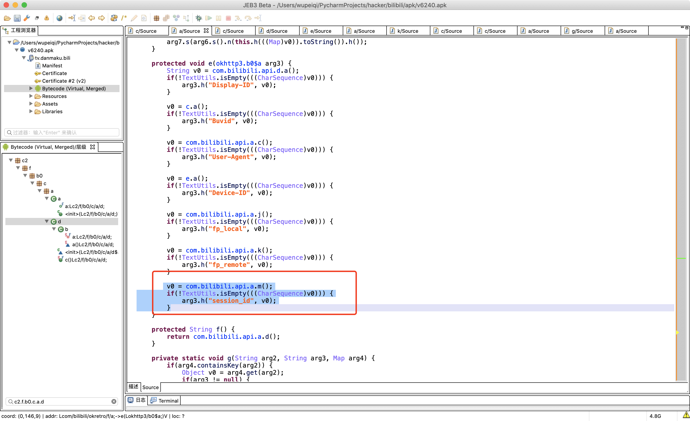


```java
interface IPerson{
    void getSessionId();
}

class Foo implaments IPerson{
    ...
}

IPerson obj = Foo()
```


此处给a.b赋值，传过来的值一定是实现接口的类。


接下来hook这个o方法，找到到底是谁执行并传入的参数。

```
设置对象 tv.danmaku.bili.utils.p$a@cd7be5
java.lang.Throwable
	at com.bilibili.api.a.o(Native Method)
	at tv.danmaku.bili.utils.p.b(BL:1)
	at tv.danmaku.bili.proc.MainBiliAppProc.v(BL:2)
	at tv.danmaku.bili.proc.k.invoke(lambda)
	at tv.danmaku.bili.delaytask.a.l(BL:3)
	at tv.danmaku.bili.delaytask.a.e(BL:2)
	at com.bilibili.base.util.a.e(BL:1)
	at tv.danmaku.bili.ui.main2.userprotocol.e.onClick(BL:4)
	at android.view.View.performClick(View.java:5204)
	at android.view.View$PerformClick.run(View.java:21153)
	at android.os.Handler.handleCallback(Handler.java:739)
	at android.os.Handler.dispatchMessage(Handler.java:95)
	at android.os.Looper.loop(Looper.java:148)
	at android.app.ActivityThread.main(ActivityThread.java:5606)
	at java.lang.reflect.Method.invoke(Native Method)
	at com.android.internal.os.ZygoteInit$MethodAndArgsCaller.run(ZygoteInit.java:745)
	at com.android.internal.os.ZygoteInit.main(ZygoteInit.java:635)
```


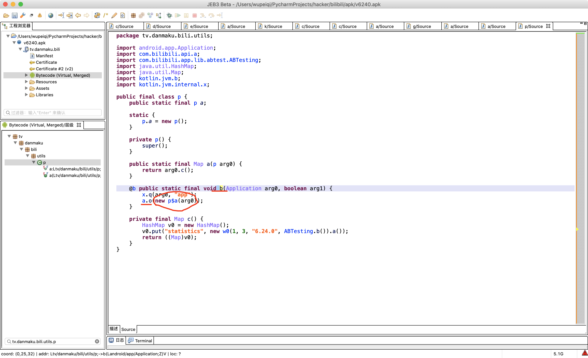


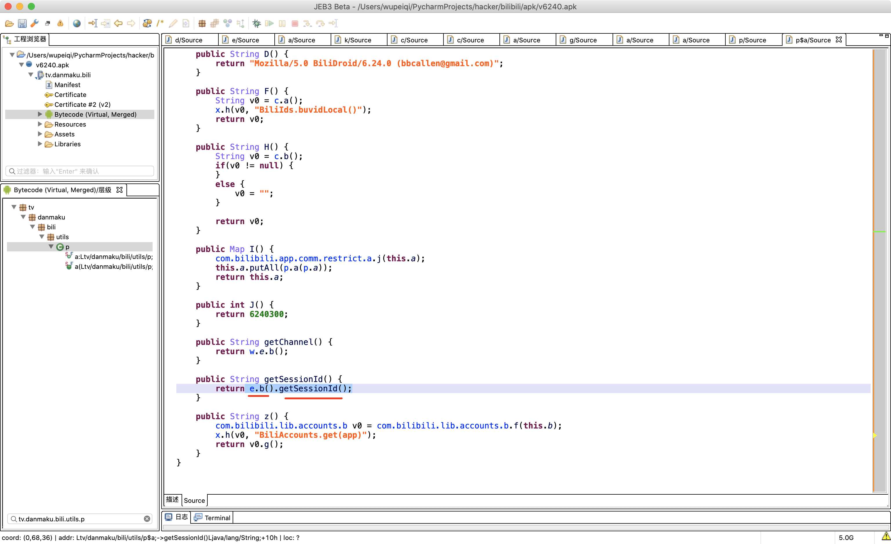


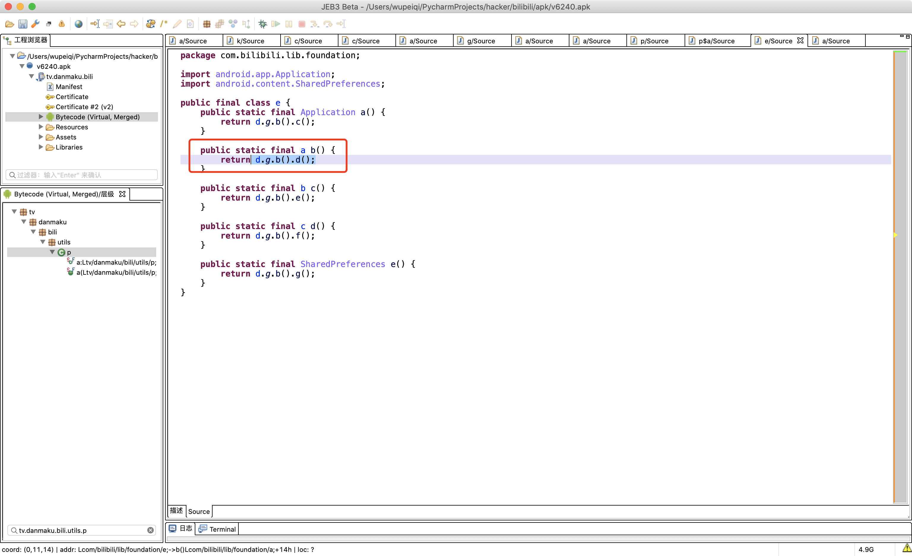


继续hook：

```
import frida
import sys

rdev = frida.get_remote_device()
session = rdev.attach("tv.danmaku.bili")

scr = """
Java.perform(function () {
    var foundation_e = Java.use("com.bilibili.lib.foundation.e");

    foundation_e.b.implementation = function(){
        var res = this.b();
        console.log("返回的是那个类的对象->",res);
        console.log(Java.use("android.util.Log").getStackTraceString(Java.use("java.lang.Throwable").$new()));
    }    

});
"""
script = session.create_script(scr)


def on_message(message, data):
    print(message, data)


script.on("message", on_message)
script.load()
sys.stdin.read()

```


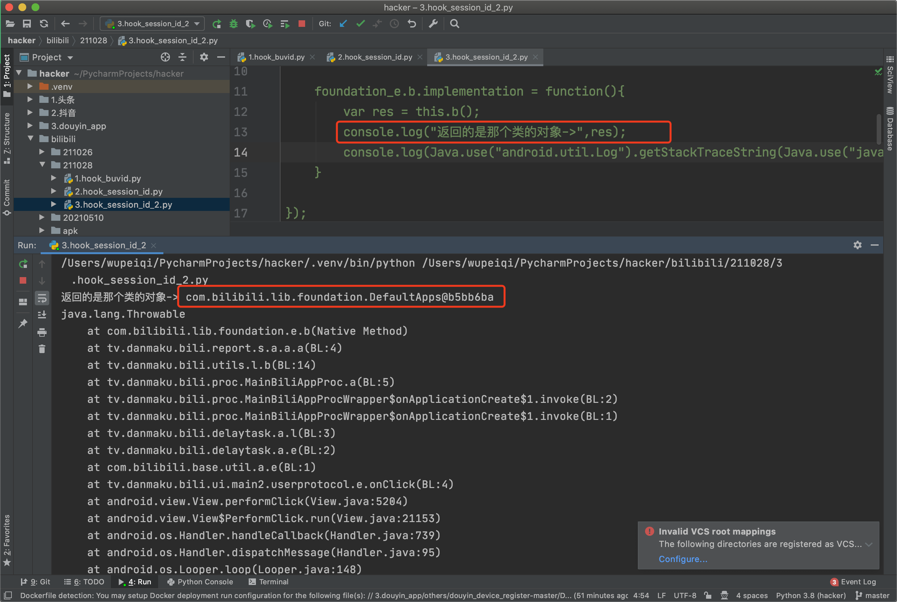


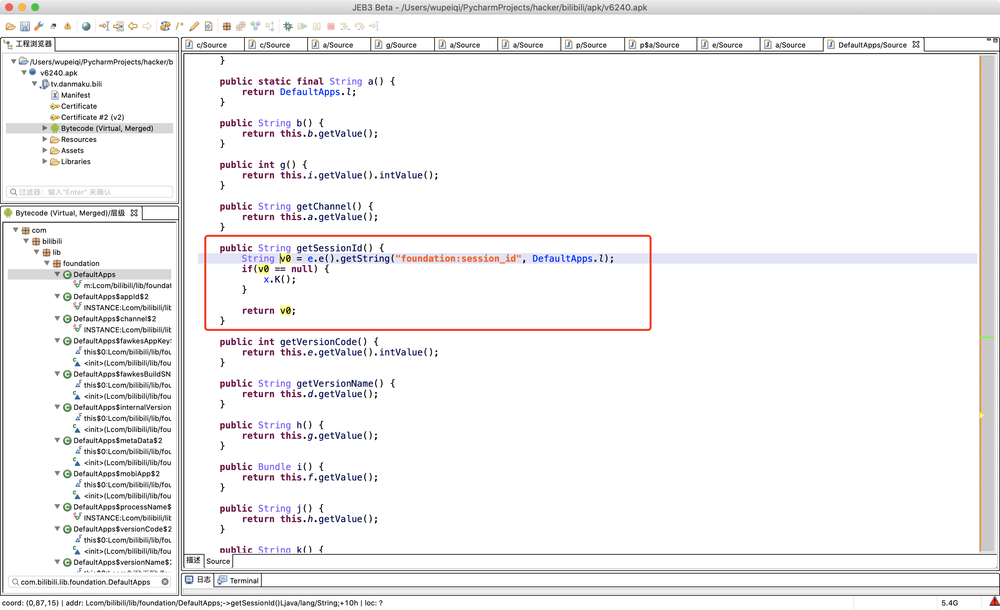

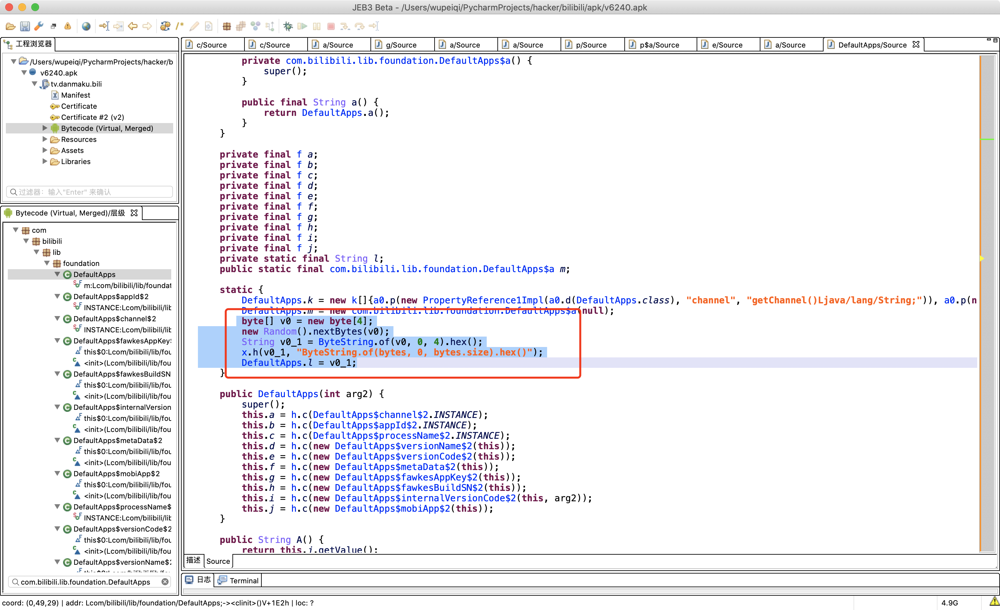


```python
import random

session_id = "".join([hex(item)[2:] for item in random.randbytes(4)])
print(session_id)
```


## 3.device_id

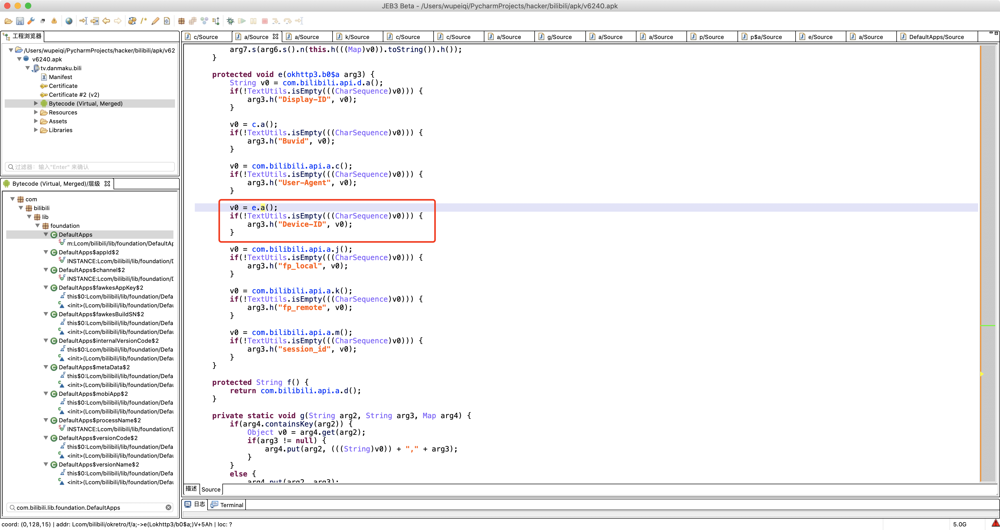


同上一节的did。


## 4.fp_local & fp_remote


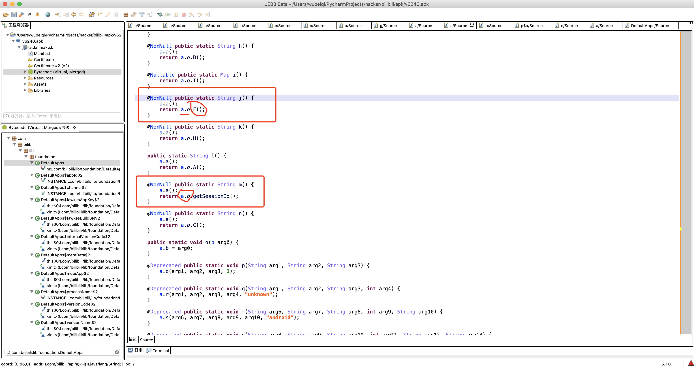


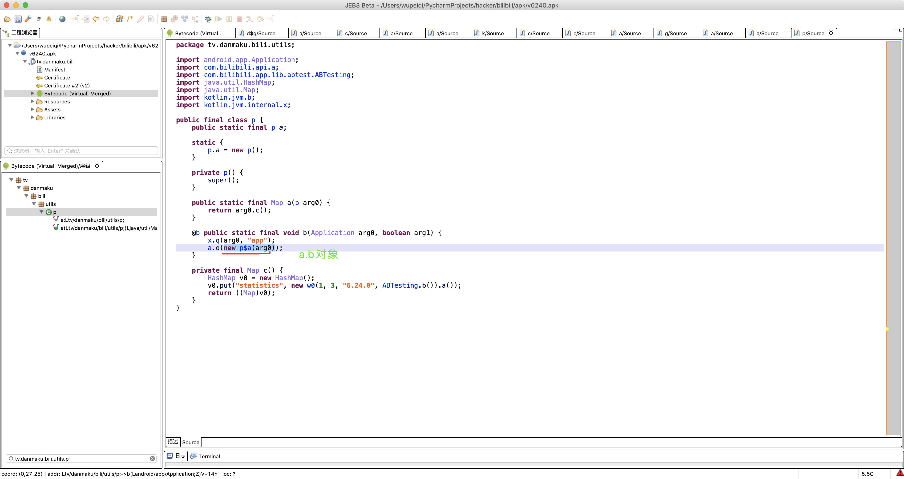


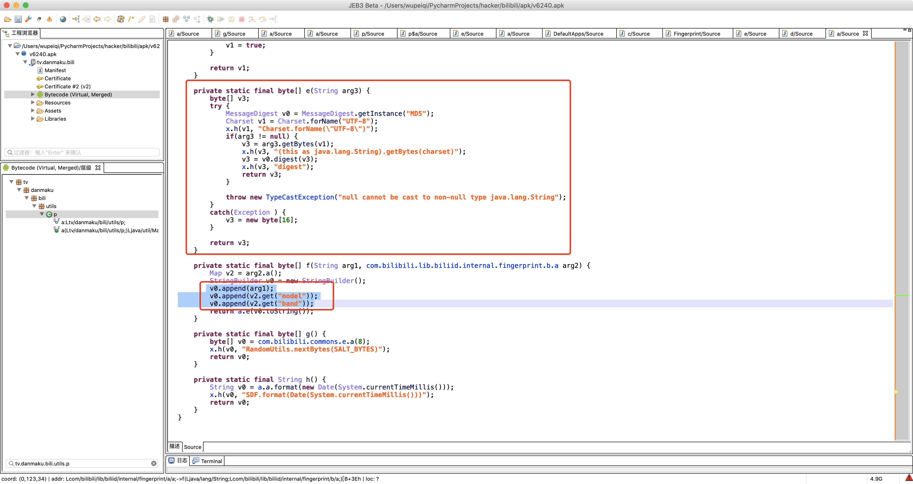

```
XYBA4F3B2789A879EA8AEEDBE2E4118F78303   MI 6 Plus
```


hook这个md5方法，就可以知道arg1和model、band是多少？

```
import frida
import sys

rdev = frida.get_remote_device()
session = rdev.attach("tv.danmaku.bili")

scr = """
Java.perform(function () {
    var a = Java.use("com.bilibili.lib.biliid.internal.fingerprint.a.a");

    a.e.implementation = function(arg3){
        console.log("要进行md5的参数->",arg3);
        var res = this.e(arg3);
        return res;
    }    

});
"""
script = session.create_script(scr)


def on_message(message, data):
    print(message, data)


script.on("message", on_message)
script.load()
sys.stdin.read()

```


要进行md5的参数-> XYBA4F3B2789A879EA8AEEDBE2E4118F78303MI 6 Plus

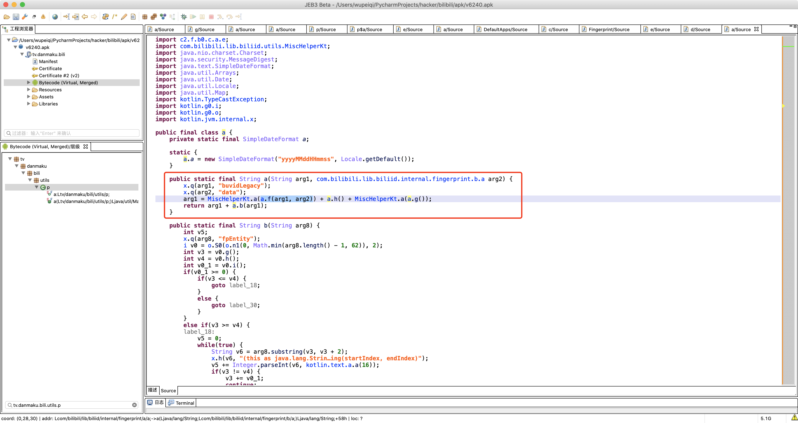


a.f(xxx)  => MD5加密（buvid + 型号 + 品牌）

注意：暂时缺少b方法的处理。

```python
import hashlib
import datetime
import random


def gen_local(buvid, phone_model, phone_band):
    """
    fp_local和fp_remote都是用这个算法来生成的，在手机初始化阶段生成 fp_local，
    :param buvid: 根据算法生成的buvid，例如："XYBA4F3B2789A879EA8AEEDBE2E4118F78303"
    :param phone_model:  手机型号modal，例如："Mate 10 Pro"
    :param phone_band:  手机品牌band，在模拟器上是空字符串（我猜是程序员想要写成 brand ）哈哈哈哈
    :return:
    """
    def misc_helper_kt(data_bytes):
        data_list = []
        v7 = len(data_bytes)
        v0 = 0
        while v0 < v7:
            v2 = data_bytes[v0]
            data_list.append("%02x" % v2)
            v0 += 1
        return ''.join(data_list)

    data_string = "{}{}{}".format(buvid, phone_model, phone_band)
    hash_object = hashlib.md5()
    hash_object.update(data_string.encode('utf-8'))
    data = hash_object.digest()

    arg1 = misc_helper_kt(data)
    arg2 = datetime.datetime.now().strftime("%Y%m%d%H%M%S")
    arg3 = misc_helper_kt(random.randbytes(8))

    return "{}{}{}".format(arg1, arg2, arg3)

# 暂时不完整。
```


## 刷播放

```python
import datetime
import uuid
import base64
import hashlib
import time
import requests
import re
import json
from Crypto.Cipher import AES
from Crypto.Util.Padding import pad
from urllib.parse import quote_plus
import string
import random
import time
import hashlib
import ctypes


class BiliBili(object):
    def __init__(self, aid, bvid, cid, duration, proxies):
        self.aid, self.bvid, self.cid, self.duration = aid, bvid, cid, duration

        self.wifi_mac = self.create_random_mac().upper()
        self.device_id = self.create_device_id(self.wifi_mac)
        self.buvid = self.create_buvid_by_wifi()
        self.session_id = self.create_session_id()

        self.build_brand = "HUAWEI"
        self.build_model = 'Mate 10 Pro'

        self.fp_local = self.create_local(self.buvid, self.build_model, "")
        self.fp_remote = self.create_local(self.buvid, self.build_model, "")

        self.app_first_run_time = str(int(time.time()) - random.randint(0, 24 * 60 * 60))  # fts

        self.ts = str(int(time.time() - 10))

        self.session = requests.Session()
        self.session.proxies = proxies

    @staticmethod
    def get_video_id_info(exec_url, proxies):

        session = requests.Session()
        bvid = exec_url.rsplit('/')[-1]
        res = session.get(
            url="https://api.bilibili.com/x/player/pagelist?bvid={}&jsonp=jsonp".format(bvid),
            proxies=proxies
        )

        cid = res.json()['data'][0]['cid']

        res = session.get(
            url="https://api.bilibili.com/x/web-interface/view?cid={}&bvid={}".format(cid, bvid),
            proxies=proxies
        )
        res_json = res.json()
        aid = res_json['data']['aid']
        view_count = res_json['data']['stat']['view']
        duration = res_json['data']['duration']
        print("\n开始：{}，初始播放量为：{}".format(bvid, view_count))
        session.close()
        return aid, bvid, cid, duration, int(view_count)

    def create_random_mac(self, sep=":"):
        """ 随机生成mac地址 """

        def mac_same_char(mac_string):
            v0 = mac_string[0]
            index = 1
            while index < len(mac_string):
                if v0 != mac_string[index]:
                    return False
                index += 1
            return True

        data_list = []
        for i in range(1, 7):
            part = "".join(random.sample("0123456789ABCDEF", 2))
            data_list.append(part)
        mac = sep.join(data_list)

        if not mac_same_char(mac) and mac != "00:90:4C:11:22:33":
            return mac

        return self.create_random_mac(sep)

    def create_device_id(self, mac):
        """
        根据mac地址生成 3.device_id
        :param mac: 传入参数的格式是 00:00:00:00:00
        :return:
        """

        def gen_sn():
            return "".join(random.sample("123456789" + string.ascii_lowercase, 10))

        def base64_encrypt(data_string):
            data_bytes = bytearray(data_string.encode('utf-8'))
            data_bytes[0] = data_bytes[0] ^ (len(data_bytes) & 0xFF)
            for i in range(1, len(data_bytes)):
                data_bytes[i] = (data_bytes[i - 1] ^ data_bytes[i]) & 0xFF
            res = base64.encodebytes(bytes(data_bytes))
            return res.strip().strip(b"==").decode('utf-8')

        # 1. 生成mac地址（保证mac中的每个元素是不重复的，例如：0000000000)
        mac_str = mac

        # 2. 去除IP地址中的符号，只保留 48e1e828e02e（变小写）
        mac_str = re.sub("[^0-9A-Fa-f]", "", mac_str)
        mac_str = mac_str.lower()

        # 3. 获取手续序列号
        sn = gen_sn()

        # 4. 拼接并进行base64加密
        total_string = "{}|||{}".format(mac_str, sn)
        return base64_encrypt(total_string)

    def create_buvid_by_wifi(self):
        """
            基于wifi mac地址生成buvid （ B站app中有四种获取buvid的方式：设备ID、wifi mac地址、3.device_id、uuid ）
        """
        md5 = hashlib.md5()
        md5.update(self.wifi_mac.encode('utf-8'))
        v0_1 = md5.hexdigest()
        return "XY{}{}{}{}".format(v0_1[2], v0_1[12], v0_1[22], v0_1).upper()

    def create_session_id(self):
        return "".join([hex(item)[2:] for item in random.randbytes(4)])

    def create_local(self, buvid, phone_model, phone_band):
        """
        fp_local和fp_remote都是用这个算法来生成的，在手机初始化阶段生成 fp_local，
        :param buvid: 根据算法生成的buvid，例如："XYBA4F3B2789A879EA8AEEDBE2E4118F78303"
        :param phone_model:  手机型号modal，例如："Mate 10 Pro"
        :param phone_band:  手机品牌band，在模拟器上是空字符串（我猜是程序员想要写成 brand ）哈哈哈哈
        :return:
        """

        def misc_helper_kt(data_bytes):
            data_list = []
            v7 = len(data_bytes)
            v0 = 0
            while v0 < v7:
                v2 = data_bytes[v0]
                data_list.append("%02x" % v2)
                v0 += 1
            return ''.join(data_list)

        data_string = "{}{}{}".format(buvid, phone_model, phone_band)
        hash_object = hashlib.md5()
        hash_object.update(data_string.encode('utf-8'))
        data = hash_object.digest()

        arg1 = misc_helper_kt(data)
        arg2 = datetime.datetime.now().strftime("%Y%m%d%H%M%S")
        arg3 = misc_helper_kt(random.randbytes(8))

        return "{}{}{}".format(arg1, arg2, arg3)

    def x_report_click_android2(self):
        SALT = "9cafa6466a028bfb"
        KEY = "fd6b639dbcff0c2a1b03b389ec763c4b"
        IV = "77b07a672d57d64c"

        def sha_256_encrypt(data_string):
            sha = hashlib.sha256()
            sha.update(data_string.encode('utf-8'))
            sha.update(SALT.encode('utf-8'))
            return sha.hexdigest()

        def aes_encrypt(data_string):
            aes = AES.new(
                key=KEY.encode('utf-8'),
                mode=AES.MODE_CBC,
                iv=IV.encode('utf-8')
            )
            raw = pad(data_string.encode('utf-8'), 16)
            return aes.encrypt(raw)

        ctime = int(time.time())
        info = {
            'aid': self.aid,
            'cid': self.cid,
            'part': 1,
            'mid': 0,
            'lv': 0,
            'ftime': ctime - random.randint(100, 1000),
            'stime': ctime,
            'did': self.device_id,
            'type': 3,
            'sub_type': 0,
            'sid': '0',
            'epid': '',
            'auto_play': 0,
            'build': 6240300,
            'mobi_app': 'android',
            'spmid': 'main.ugc-video-detail.0.0',
            'from_spmid': 'search.search-result.0.0'
        }
        data = "&".join(["{}={}".format(key, info[key]) for key in sorted(info.keys())])
        sign = sha_256_encrypt(data).lower()
        data = "{}&sign={}".format(data, sign)
        aes_string = aes_encrypt(data)

        res = self.session.post(
            url="https://api.bilibili.com/x/report/click/android2",
            headers={
                "accept-length": "gzip",
                "content-type": "application/json; charset=utf-8",
                "app-key": "android",
                "User-Agent": "Mozilla/5.0 BiliDroid/6.24.0 (bbcallen@gmail.com) os/android model/Mate 10 Pro mobi_app/android build/6240300 channel/bili innerVer/6240300 osVer/6.0.1 network/2",
                "env": "prod",
                "buvid": self.buvid,
                "device-id": self.device_id,
                "session_id": self.session_id,
                "fp_local": self.fp_local,
                "fp_remote": self.fp_remote,
            },
            data=aes_string,
            timeout=10

        )
        print(res.text)
        res.close()


def task(url):
    proxies = None  # 购买隧道代理
    aid, bvid, cid, duration, view_count = BiliBili.get_video_id_info(url, proxies)
    for _ in range(10):
        try:
            bili = BiliBili(aid, bvid, cid, duration, proxies=proxies)
            bili.x_report_click_android2()
            bili.session.close()

            view_count += 1
            print("理论播放数：", view_count)

            time.sleep(3)
            BiliBili.get_video_id_info(url, proxies)
        except Exception as e:
            print("异常：", e)


if __name__ == '__main__':
    # 1w（上午10：00 ~ 24：00）
    url = "https://www.bilibili.com/video/BV14P4y1L7sG"
    task(url)
```


上述都是Java层面的算法。

- 播放（0秒）
- 完播 + 心跳（JNI，C做的算法）。


## 下节预告


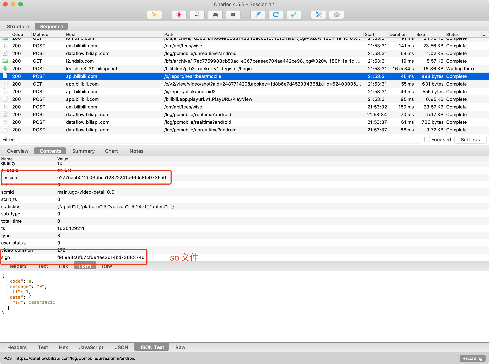


其他的参数都有，就是没有 sign => so文件（libbili.so）。


