# day16 知乎app逆向（上）

目标：知乎搜索

版本：v5.32.1

```
https://www.wandoujia.com/apps/584215/history_v1031
```


## 1.抓包

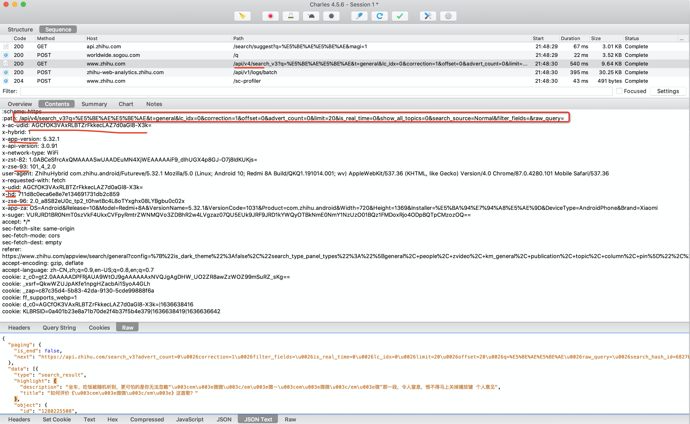

```python
import requests

res = requests.get(
    url="https://www.zhihu.com/api/v4/search_v3?q=%E5%93%88%E5%93%88%E5%93%88%E5%93%88&t=general&lc_idx=0&correction=1&offset=0&advert_count=0&limit=20&is_real_time=0&show_all_topics=0&search_source=Normal&filter_fields=&raw_query=",
    headers={
        "x-udid": "AIDQoejlCRRLBXqaH0Zjw4S5gqeSRdBIlEE=",
        
        "x-ac-udid": "AIDQoejlCRRLBXqaH0Zjw4S5gqeSRdBIlEE=",
        "x-hd": "bdf95f1eb35b1db1386535cff3adb645",
        "x-zse-96": "2.0_aTFBo4XyrLNXHhtBzwtyNgU8bH2fNhFBGMF0gvH0k_Of",

        "user-agent": "ZhihuHybrid com.zhihu.android/Futureve/5.32.1 Mozilla/5.0 (Linux; Android 10; Redmi 8A Build/QKQ1.191014.001; wv) AppleWebKit/537.36 (KHTML, like Gecko) Version/4.0 Chrome/87.0.4280.101 Mobile Safari/537.36",
        'x-app-version': "5.32.1",
        "x-zse-93": "101_4_2.0",
    }
)

print(res.text)

```


## 2.请求URL

请求的URL中没有特殊的参数。

```
https://www.zhihu.com/api/v4/search_v3?q=%E5%BE%AE%E5%BE%AE&t=general&lc_idx=0&correction=1&offset=0&advert_count=0&limit=20&is_real_time=0&show_all_topics=0&search_source=Normal&filter_fields=&raw_query=
```


```python
from urllib.parse import unquote_plus, quote_plus

q = "%E5%BE%AE%E5%BE%AE"
data = unquote_plus(q)
print(data) # "微微"
```


## 3.请求头

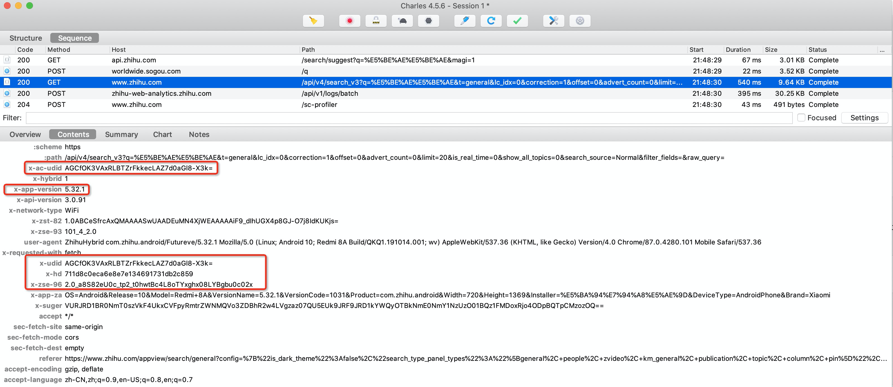


先搜索 `x-udid`

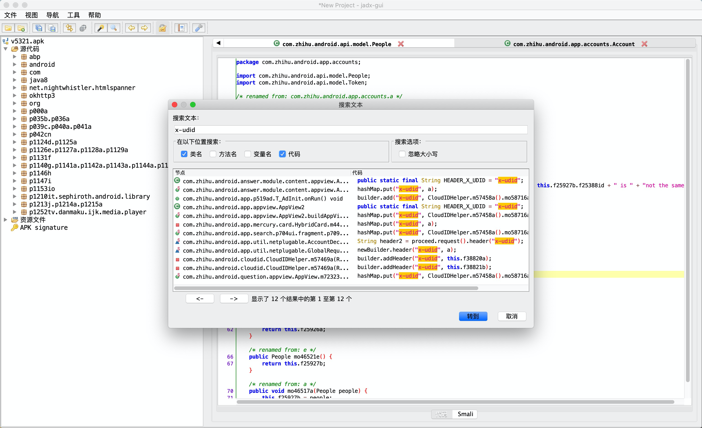

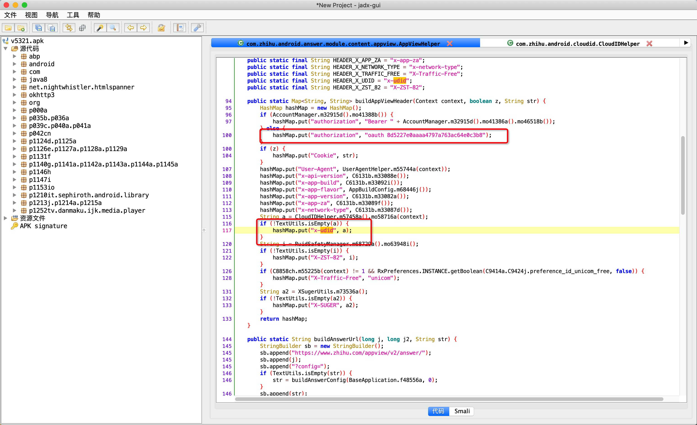

发现：

- authorization，是固定的 `"oauth 8d5227e0aaaa4797a763ac64e0c3b8"`
- x-udid，往里找。


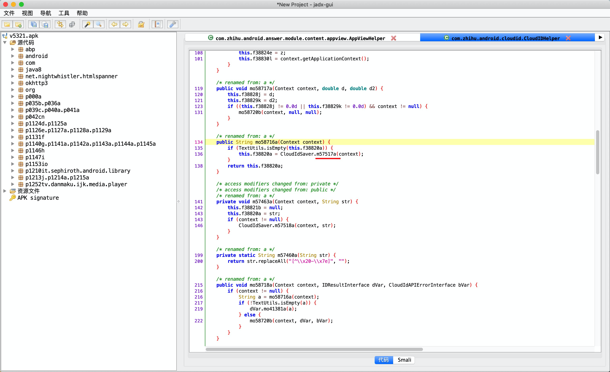


没有看到生成x-udid的功能，所以x-udid大概率是从之前的URL返回的。


### 3.1 x-udid

x-udid是在第一次打开app时，由知乎后台返回的数据。

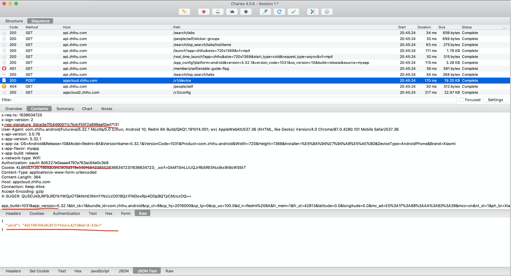


分析这个请求：

- authorization，固定的值（之前搜索x-udid时候看到了）
- x-req-signature，无头绪。


#### 1. x-req-signature

搜索：`x-req-signature`

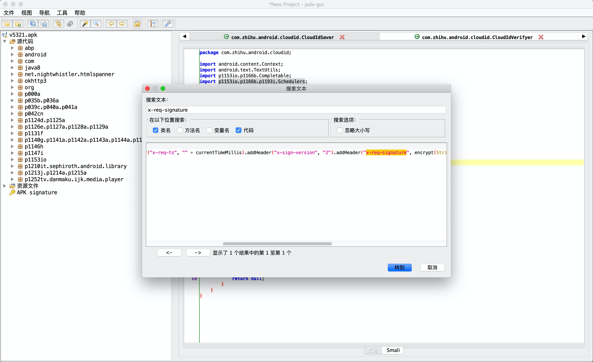

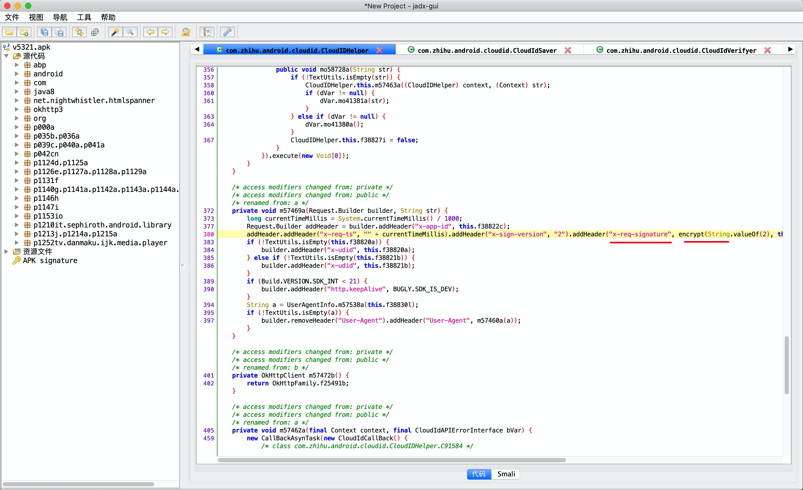

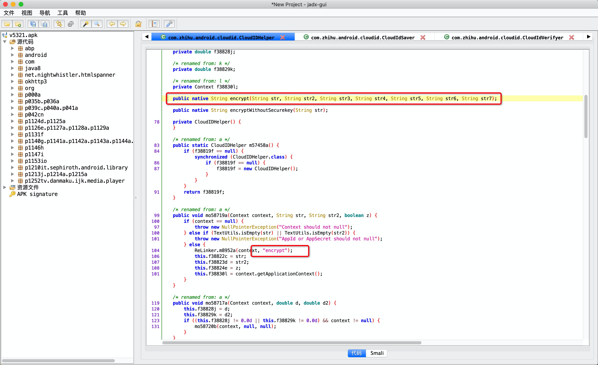

注意：ReLinker是一个加载本机so库的类库。


接下里，hook这个encrypt方法，看看他参数和结果分别是什么？

```python
import frida
import sys

rdev = frida.get_remote_device()
session = rdev.attach("com.zhihu.android")

scr = """
Java.perform(function () {
    var CloudIDHelper = Java.use("com.zhihu.android.cloudid.CloudIDHelper");

    CloudIDHelper.encrypt.implementation = function(str,str2,str3,str4,str5,str6,str7){
        console.log("参数str=",str);
        console.log("参数str2=",str2);
        console.log("参数str3=",str3);
        console.log("参数str4=",str4);
        console.log("参数str5=",str5);
        console.log("参数str6=",str6);
        console.log("参数str7=",str7);
        var res = this.encrypt(str,str2,str3,str4,str5,str6,str7);
        console.log("结果是：",res);
        return res;
    }

});
"""

script = session.create_script(scr)


def on_message(message, data):
    pass


script.on("message", on_message)
script.load()
sys.stdin.read()

```

```
# post请求
参数str= 2
参数str2= null
参数str3= null
参数str4= app_build=1031&app_version=5.32.1&bt_ck=1&bundle_id=com.zhihu.android&cp_ct=8&cp_fq=2016000&cp_tp=0&cp_us=100.0&d_n=Redmi%208A&fr_mem=202&fr_st=42809&latitude=0.0&longitude=0.0&mc_ad=E0%3A1F%3A88%3AAA%3AB3%3A39&mcc=cn&nt_st=1&ph_br=Xiaomi&ph_md=Redmi%208A&ph_os=Android%2010&ph_sn=unknown&pvd_nm=%E4%B8%AD%E5%9B%BD%E8%81%94%E9%80%9A&tt_mem=256&tt_st=51140&tz_of=28800
参数str5= 1355
参数str6= 1636642368（时间戳）
参数str7= dd49a835-56e7-4a0f-95b5-efd51ea5397f（固定）


结果是： aba4022b4bc3eabd046e0eabd443e59585157c34
```

```
# put请求

参数str= 2
参数str2= AEDfLtXyAxRLBVpAl3tGPed_e6jndKWOpB8=
参数str3= null
参数str4= app_build=1031&app_version=5.32.1&bt_ck=1&bundle_id=com.zhihu.android&cp_ct=8&cp_fq=2016000&cp_tp=0&cp_us=100.0&d_n=Redmi%208A&fr_mem=19&fr_st=42809&latitude=0.0&longitude=0.0&mc_ad=E0%3A1F%3A88%3AAA%3AB3%3A39&mcc=cn&nt_st=1&ph_br=Xiaomi&ph_md=Redmi%208A&ph_os=Android%2010&ph_sn=unknown&pvd_nm=%E4%B8%AD%E5%9B%BD%E8%81%94%E9%80%9A&tt_mem=45&tt_st=51140&tz_of=28800
参数str5= 1355
参数str6= 1636642370
参数str7= dd49a835-56e7-4a0f-95b5-efd51ea5397f

结果是： ed311734e6ddd4127d83374b2352bcd1c55452a4

```

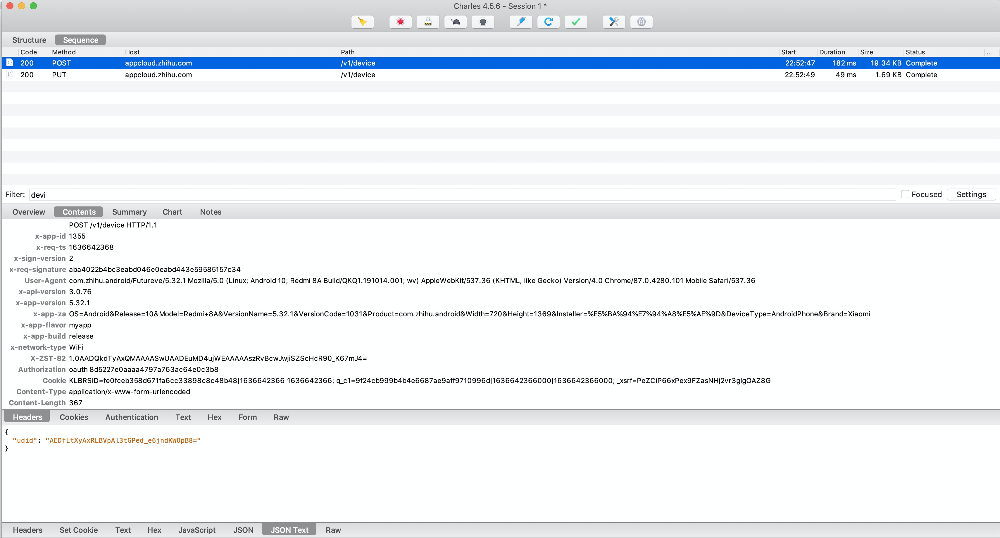


#### 2. 分析so

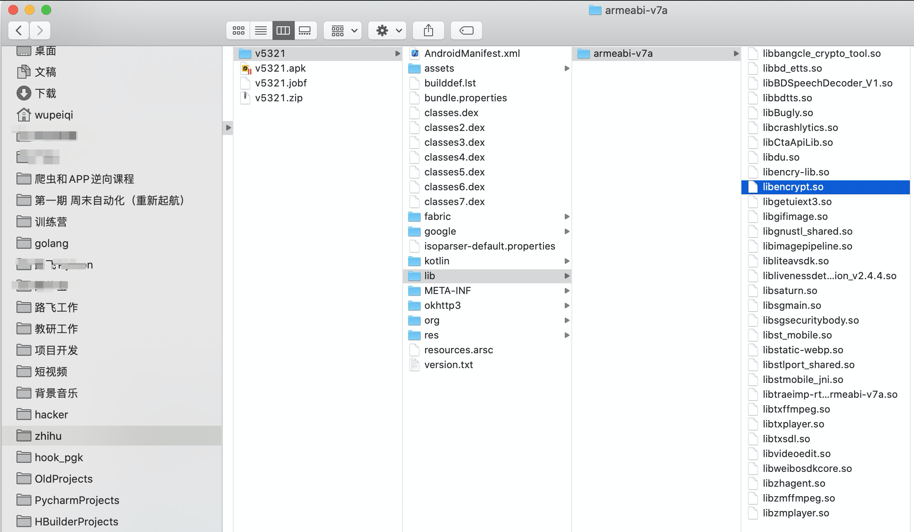

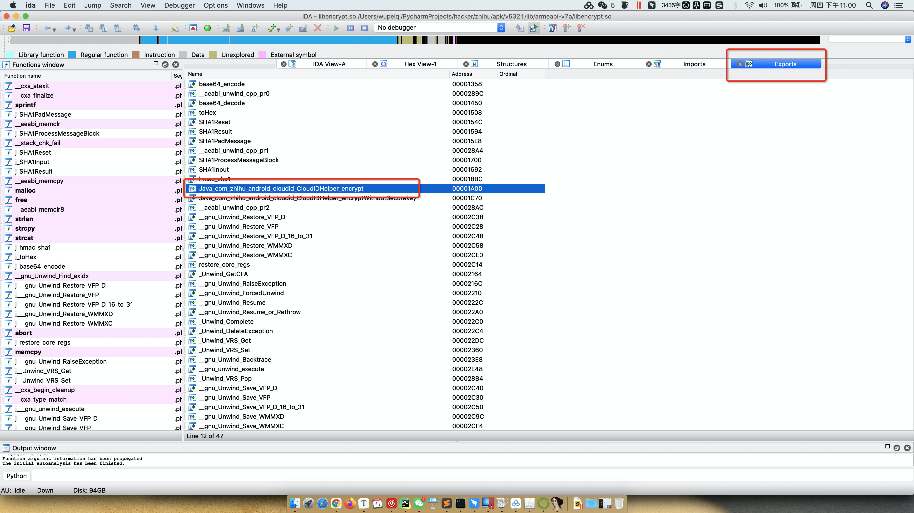


```C
//v23，是拼接和处理后的一个字符串。
//v45，是v23的长度
//s，  是传入的最后一个参数，即：str7（sha1加密的秘钥）
//v46，是s的长度
j_hmac_sha1(v23, v45, s, v46, &v52);
```


所以，现在的关键是要知道v23是什么。

根据传入的参数，分析出来 `v23 = str5 + str + str4 +  str6`

```
参数str= 2
参数str2= null
参数str3= null
参数str4= app_build=1031&app_version=5.32.1&bt_ck=1&bundle_id=com.zhihu.android&cp_ct=8&cp_fq=2016000&cp_tp=0&cp_us=100.0&d_n=Redmi%208A&fr_mem=202&fr_st=42809&latitude=0.0&longitude=0.0&mc_ad=E0%3A1F%3A88%3AAA%3AB3%3A39&mcc=cn&nt_st=1&ph_br=Xiaomi&ph_md=Redmi%208A&ph_os=Android%2010&ph_sn=unknown&pvd_nm=%E4%B8%AD%E5%9B%BD%E8%81%94%E9%80%9A&tt_mem=256&tt_st=51140&tz_of=28800
参数str5= 1355
参数str6= 1636642368
参数str7= dd49a835-56e7-4a0f-95b5-efd51ea5397f

结果是： aba4022b4bc3eabd046e0eabd443e59585157c34
```

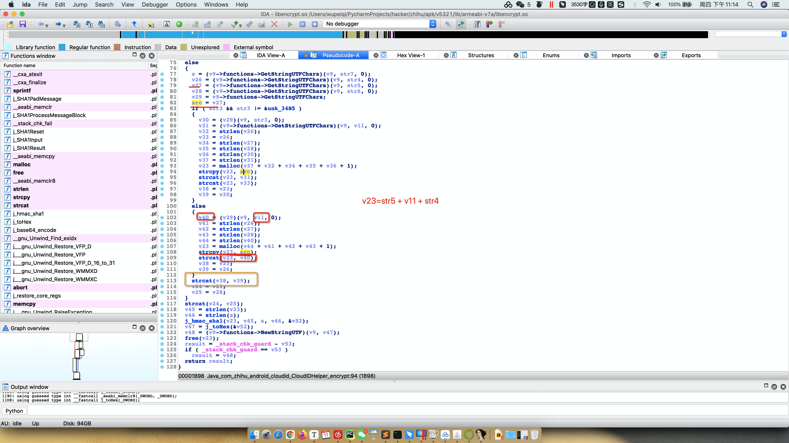

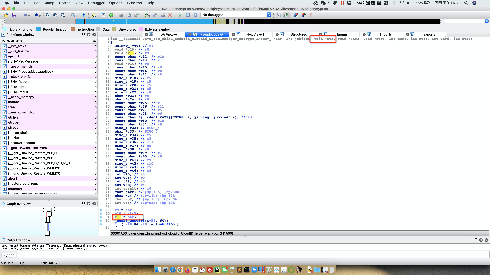


Python代码实现：

```python
import hmac
from hashlib import sha1

v23 = "1355" + "2" + "app_build=1031&app_version=5.32.1&bt_ck=1&bundle_id=com.zhihu.android&cp_ct=8&cp_fq=2016000&cp_tp=0&cp_us=100.0&d_n=Redmi%208A&fr_mem=202&fr_st=42809&latitude=0.0&longitude=0.0&mc_ad=E0%3A1F%3A88%3AAA%3AB3%3A39&mcc=cn&nt_st=1&ph_br=Xiaomi&ph_md=Redmi%208A&ph_os=Android%2010&ph_sn=unknown&pvd_nm=%E4%B8%AD%E5%9B%BD%E8%81%94%E9%80%9A&tt_mem=256&tt_st=51140&tz_of=28800" + "1636642368"

hmac_code = hmac.new("dd49a835-56e7-4a0f-95b5-efd51ea5397f".encode('utf-8'), v23.encode('utf-8'), sha1)
res = hmac_code.hexdigest()
print(res) # aba4022b4bc3eabd046e0eabd443e59585157c34
```


#### 3.获取udid

```python
import hmac
import requests
import random
import time
from hashlib import sha1
from urllib.parse import quote_plus


def create_random_mac(sep=":"):
    """ 随机生成mac地址 """

    def mac_same_char(mac_string):
        v0 = mac_string[0]
        index = 1
        while index < len(mac_string):
            if v0 != mac_string[index]:
                return False
            index += 1
        return True

    data_list = []
    for i in range(1, 7):
        part = "".join(random.sample("0123456789ABCDEF", 2))
        data_list.append(part)
    mac = sep.join(data_list)

    if not mac_same_char(mac) and mac != "00:90:4C:11:22:33":
        return mac

    return create_random_mac(sep)


def encrypt(app_id, sign_version, ts, params_string):
    key = "dd49a835-56e7-4a0f-95b5-efd51ea5397f"
    str1 = sign_version
    str5 = app_id
    str6 = ts
    str4 = params_string
    # v23 = "1355" + "2" + "app_build=1031&app_version=5.32.1&bt_ck=1&bundle_id=com.zhihu.android&cp_ct=8&cp_fq=2016000&cp_tp=0&cp_us=100.0&d_n=Redmi%208A&fr_mem=202&fr_st=42809&latitude=0.0&longitude=0.0&mc_ad=E0%3A1F%3A88%3AAA%3AB3%3A39&mcc=cn&nt_st=1&ph_br=Xiaomi&ph_md=Redmi%208A&ph_os=Android%2010&ph_sn=unknown&pvd_nm=%E4%B8%AD%E5%9B%BD%E8%81%94%E9%80%9A&tt_mem=256&tt_st=51140&tz_of=28800" + "1636642368"
    v23 = "{}{}{}{}".format(str5, str1, str4, str6)
    hmac_code = hmac.new(key.encode('utf-8'), v23.encode('utf-8'), sha1)
    res = hmac_code.hexdigest()
    return res


def get_udid():
    app_id = "1355"
    sign_version = "2"

    ts = str(int(time.time()))
    mac_string = create_random_mac()
    mac_quote_string = quote_plus(mac_string)

    tpl = "app_build=1031&app_version=5.32.1&bt_ck=1&bundle_id=com.zhihu.android&cp_ct=8&cp_fq=2016000&cp_tp=0&cp_us=100.0&d_n=Redmi%208A&fr_mem=202&fr_st=42809&latitude=0.0&longitude=0.0&mc_ad={}&mcc=cn&nt_st=1&ph_br=Xiaomi&ph_md=Redmi%208A&ph_os=Android%2010&ph_sn=unknown&pvd_nm=%E4%B8%AD%E5%9B%BD%E8%81%94%E9%80%9A&tt_mem=256&tt_st=51140&tz_of=28800"
    form_string = tpl.format(mac_quote_string)

    sign = encrypt(app_id, sign_version, ts, form_string)

    res = requests.post(
        url="https://appcloud.zhihu.com/v1/device",
        data=form_string,
        headers={
            "x-req-signature": sign,
            "x-req-ts": ts,
            "x-app-id": app_id,
            "x-sign-version": "2",
            "user-agent": "ZhihuHybrid com.zhihu.android/Futureve/5.32.1 Mozilla/5.0 (Linux; Android 10; Redmi 8A Build/QKQ1.191014.001; wv) AppleWebKit/537.36 (KHTML, like Gecko) Version/4.0 Chrome/87.0.4280.101 Mobile Safari/537.36",
        }
    )
    udid = res.json()['udid']
    print(udid)
    # {"udid":"AKAdWa4ABBRLBcRx8h10PCJ6NCQoMLaQYqg="}
    # print(res.text)

    # {'_xsrf': 'XhgPgcviB640eXESAJL8g3P2lI5R8tij', 'KLBRSID': 'cdfcc1d45d024a211bb7144f66bda2cf|1636645997|1636645997'}
    # print(res.cookies.get_dict())
    return udid


if __name__ == '__main__':
    get_udid()
```


