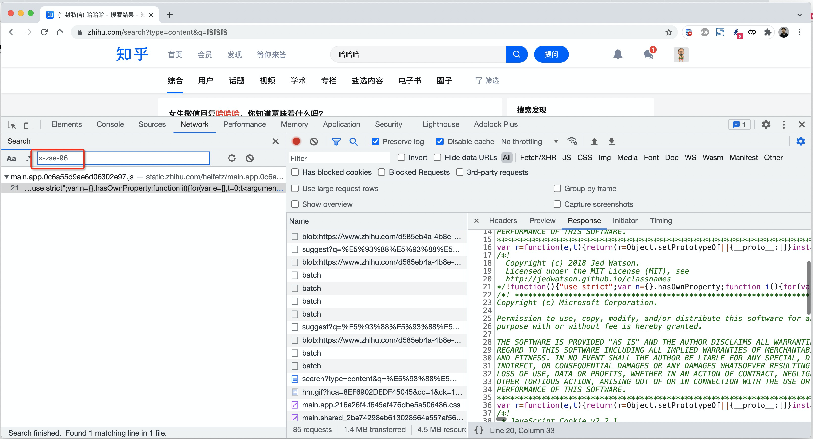
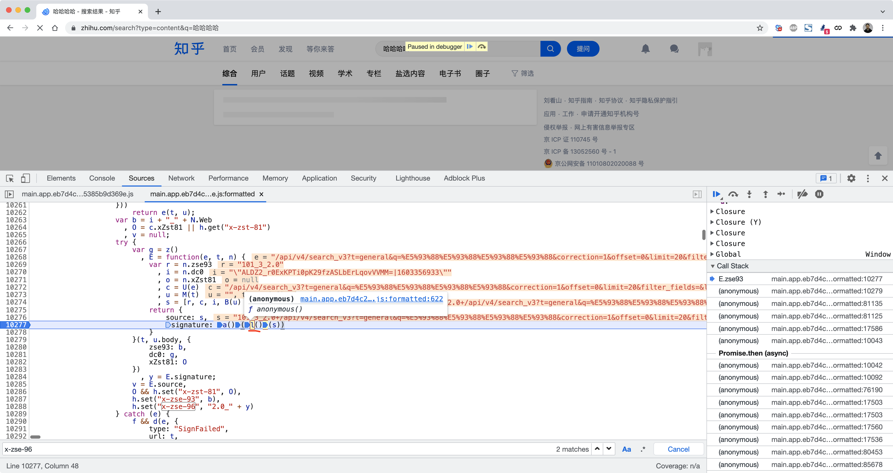
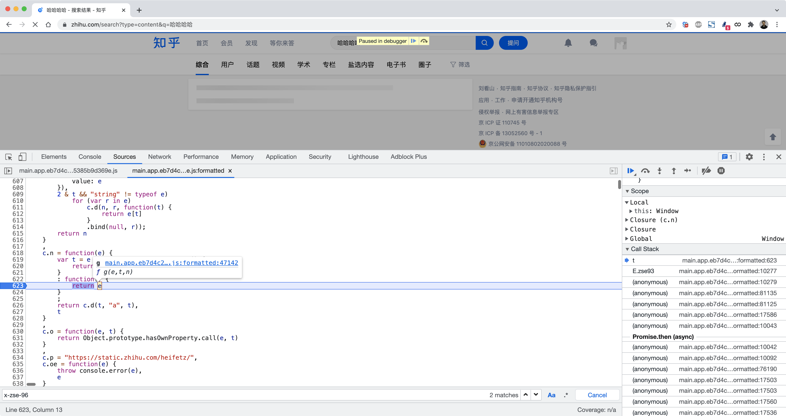
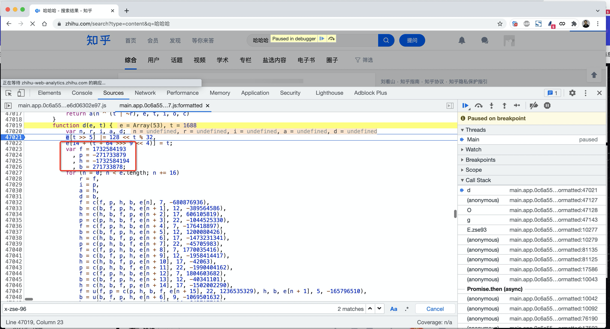
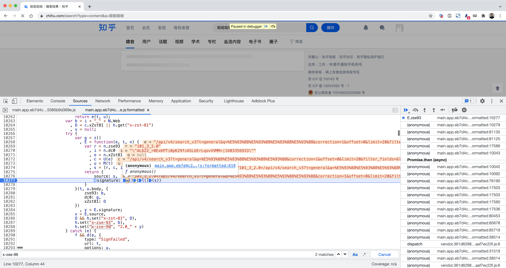
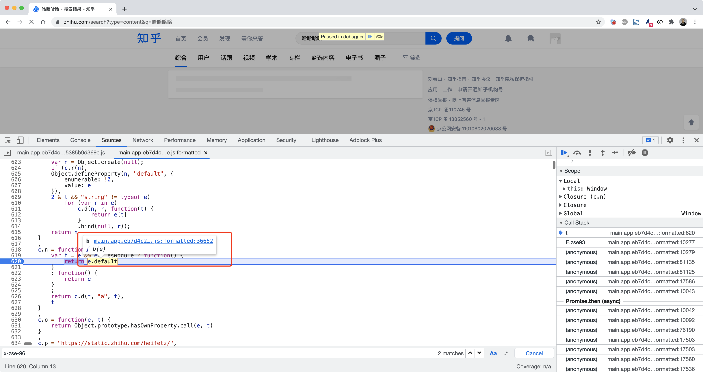

## 3.请求头

### 3.1 x-udid

已搞定。


### 3.2 x-hd


```python
import requests

res = requests.post(
    url="https://api.zhihu.com/guests/token",
    data={
        "source": "com.zhihu.android"
    },
    headers={
        "x-udid": "AGBQ9YDFAxRLBel97ZJuRX4mzPE3_trJT4k=",
        "user-agent": "ZhihuHybrid com.zhihu.android/Futureve/5.32.1 Mozilla/5.0 (Linux; Android 10; Redmi 8A Build/QKQ1.191014.001; wv) AppleWebKit/537.36 (KHTML, like Gecko) Version/4.0 Chrome/87.0.4280.101 Mobile Safari/537.36",
        'x-app-version': "5.32.1"
    },
)

print(res.text)
```


整合代码：

```python
import hmac
import requests
import random
import time
from hashlib import sha1
from urllib.parse import quote_plus


def create_random_mac(sep=":"):
    """ 随机生成mac地址 """

    def mac_same_char(mac_string):
        v0 = mac_string[0]
        index = 1
        while index < len(mac_string):
            if v0 != mac_string[index]:
                return False
            index += 1
        return True

    data_list = []
    for i in range(1, 7):
        part = "".join(random.sample("0123456789ABCDEF", 2))
        data_list.append(part)
    mac = sep.join(data_list)

    if not mac_same_char(mac) and mac != "00:90:4C:11:22:33":
        return mac

    return create_random_mac(sep)


def encrypt(app_id, sign_version, ts, params_string):
    key = "dd49a835-56e7-4a0f-95b5-efd51ea5397f"
    str1 = sign_version
    str5 = app_id
    str6 = ts
    str4 = params_string
    # v23 = "1355" + "2" + "app_build=1031&app_version=5.32.1&bt_ck=1&bundle_id=com.zhihu.android&cp_ct=8&cp_fq=2016000&cp_tp=0&cp_us=100.0&d_n=Redmi%208A&fr_mem=202&fr_st=42809&latitude=0.0&longitude=0.0&mc_ad=E0%3A1F%3A88%3AAA%3AB3%3A39&mcc=cn&nt_st=1&ph_br=Xiaomi&ph_md=Redmi%208A&ph_os=Android%2010&ph_sn=unknown&pvd_nm=%E4%B8%AD%E5%9B%BD%E8%81%94%E9%80%9A&tt_mem=256&tt_st=51140&tz_of=28800" + "1636642368"
    v23 = "{}{}{}{}".format(str5, str1, str4, str6)
    hmac_code = hmac.new(key.encode('utf-8'), v23.encode('utf-8'), sha1)
    res = hmac_code.hexdigest()
    return res


def get_udid():
    app_id = "1355"
    sign_version = "2"

    ts = str(int(time.time()))
    mac_string = create_random_mac()
    mac_quote_string = quote_plus(mac_string)

    tpl = "app_build=1031&app_version=5.32.1&bt_ck=1&bundle_id=com.zhihu.android&cp_ct=8&cp_fq=2016000&cp_tp=0&cp_us=100.0&d_n=Redmi%208A&fr_mem=202&fr_st=42809&latitude=0.0&longitude=0.0&mc_ad={}&mcc=cn&nt_st=1&ph_br=Xiaomi&ph_md=Redmi%208A&ph_os=Android%2010&ph_sn=unknown&pvd_nm=%E4%B8%AD%E5%9B%BD%E8%81%94%E9%80%9A&tt_mem=256&tt_st=51140&tz_of=28800"
    form_string = tpl.format(mac_quote_string)

    sign = encrypt(app_id, sign_version, ts, form_string)

    res = requests.post(
        url="https://appcloud.zhihu.com/v1/device",
        data=form_string,
        headers={
            "x-req-signature": sign,
            "x-req-ts": ts,
            "x-app-id": app_id,
            "x-sign-version": "2",
            "user-agent": "ZhihuHybrid com.zhihu.android/Futureve/5.32.1 Mozilla/5.0 (Linux; Android 10; Redmi 8A Build/QKQ1.191014.001; wv) AppleWebKit/537.36 (KHTML, like Gecko) Version/4.0 Chrome/87.0.4280.101 Mobile Safari/537.36",
        }
    )
    udid = res.json()['udid']
    # {"udid":"AKAdWa4ABBRLBcRx8h10PCJ6NCQoMLaQYqg="}
    # print(res.text)

    # {'_xsrf': 'XhgPgcviB640eXESAJL8g3P2lI5R8tij', 'KLBRSID': 'cdfcc1d45d024a211bb7144f66bda2cf|1636645997|1636645997'}
    # print(res.cookies.get_dict())
    return udid


def get_hd(udid):
    res = requests.post(
        url="https://api.zhihu.com/guests/token",
        data={
            "source": "com.zhihu.android"
        },
        headers={
            "x-udid": udid,
            "user-agent": "ZhihuHybrid com.zhihu.android/Futureve/5.32.1 Mozilla/5.0 (Linux; Android 10; Redmi 8A Build/QKQ1.191014.001; wv) AppleWebKit/537.36 (KHTML, like Gecko) Version/4.0 Chrome/87.0.4280.101 Mobile Safari/537.36",
            'x-app-version': "5.32.1"
        },
    )

    # print(res.text)
    return res.json()['id']


def run():
    udid = get_udid()
    hd = get_hd(udid)

    print(udid)
    print(hd)


if __name__ == '__main__':
    run()
```


### 3.3 x-zse-96

没有搜索到关键字。

但是请求中还是会携带，所以直接hook了HashMap，发现这个参数是调用的WebView生成的。

也就是，调用前端的js加密生成的，所以，要在js中分析。

```python
import frida
import sys

rdev = frida.get_remote_device()
session = rdev.attach("com.zhihu.android")

scr = """
Java.perform(function () {
    var HashMap = Java.use("java.util.HashMap");

    HashMap.put.implementation = function(key,value){
        if(key == "x-zse-96"){
            console.log(key,value);
            console.log(Java.use("android.util.Log").getStackTraceString(Java.use("java.lang.Throwable").$new()));
        }
        
        var res = this.put(key,value);
        
        return res;
    }

});
"""

script = session.create_script(scr)


def on_message(message, data):
    pass


script.on("message", on_message)
script.load()
sys.stdin.read()
```

```
# 输出的内容
x-zse-96 2.0_a8S82eU0c_tp2_t0hwtBc4L8oTYxghx08LYBgbu0c02x


java.lang.Throwable
	at java.util.HashMap.put(Native Method)
	at SK.<init>(chromium-TrichromeWebViewGoogle.apk-stable-428010130:15)
	at org.chromium.android_webview.AwContentsBackgroundThreadClient.shouldInterceptRequestFromNative(chromium-TrichromeWebViewGoogle.apk-stable-428010130:1)
```

这个参数不是通过Java代码实现，而是在APP中嵌套HTML页面，由JS生成的。

- 直接去看知乎网站，网站中是否有 x-zse-96，这个x-zse-96关键字是否能搜索。【不正确】【算法+参数不对】
- APP中网站界面拿过来，在app中嵌套页面时候算法是一样的，算法底层的参数不同。【正确】【参数】





#### 3.3.1 s是什么？

结合断点和代码发现：

```
s = zse93 + 请求地址 + cookie中的d_c0

其中：
	zse93是固定的：pc上是 "101_3_2.0"、app的请求头中是 "101_4_2.0"
	cookie中的d_c0，想知乎的任意连接发送请求时，会返回的一个。

例如：pc中测试的值
s = '101_3_2.0+/api/v4/search_v3?t=general&q=%E5%93%88%E5%93%88%E5%93%88&correction=1&offset=0&limit=20&filter_fields=&lc_idx=0&show_all_topics=0&search_source=Normal+"ALDZ2_r0ExKPTi0pK29fzASLbErLqovVVMM=|1603356933"'
```


#### 3.3.2 l() 获取函数并执行

先执行 `l()` 生成一个函数，再调用次函数（参数是s）。

这个函数的内部本质上就是对s进行md5加密。

```python
import hashlib


data = '101_3_2.0+/api/v4/search_v3?t=general&q=%E5%93%88%E5%93%88%E5%93%88%E5%93%88&correction=1&offset=0&limit=20&filter_fields=&lc_idx=0&show_all_topics=0&search_source=Normal+"ALDZ2_r0ExKPTi0pK29fzASLbErLqovVVMM=|1603356933"'

obj = hashlib.md5()
obj.update(data.encode('utf-8'))
res = obj.hexdigest()
print(res)

# fb33a76df5f78678a1b0f31d840ff616
```










#### 3.3.3 a() 获取函数并执行

执行 `a()` 函数后获得一个函数b，接下来执行此函数并以上一步的中的md5值为参数。

函数b的实现过程比较复杂，需要拿出他的js并使用execjs执行。






代码实现：

```python
import execjs
import os

os.environ["NODE_PATH"] = "/usr/local/lib/node_modules/"
with open('sdk.js', mode='r', encoding='utf-8') as f:
    js = f.read()

md5_string = 'fb33a76df5f78678a1b0f31d840ff616'
ct = execjs.compile(js).call("get_sign", md5_string)

# a8Y0SQHBQ_FXHw200uF8rAXyo8FXo8Oq09NqoAe02TxY
print(ct)

```

```javascript
const jsdom = require("jsdom");
const {JSDOM} = jsdom;


const dom = new JSDOM(`<!DOCTYPE html><p>Hello world</p>`);
window = dom.window;
document = dom.window.document;
atob = window.atob;

function xx(module, exports, __webpack_require__) {
    "use strict";

    function t(e) {
        return (t = "function" == typeof Symbol && "symbol" == typeof Symbol.A ? function (e) {
                    return typeof e
                }
                : function (e) {
                    return e && "function" == typeof Symbol && e.constructor === Symbol && e !== Symbol.prototype ? "symbol" : typeof e
                }
        )(e)
    }

    Object.defineProperty(exports, "__esModule", {
        value: !0
    });
    var A = "2.0", __g = {};

    function s() {
    }

    function i(e) {
        this.t = (2048 & e) >> 11,
            this.s = (1536 & e) >> 9,
            this.i = 511 & e,
            this.h = 511 & e
    }

    function h(e) {
        this.s = (3072 & e) >> 10,
            this.h = 1023 & e
    }

    function a(e) {
        this.a = (3072 & e) >> 10,
            this.c = (768 & e) >> 8,
            this.n = (192 & e) >> 6,
            this.t = 63 & e
    }

    function c(e) {
        this.s = e >> 10 & 3,
            this.i = 1023 & e
    }

    function n() {
    }

    function e(e) {
        this.a = (3072 & e) >> 10,
            this.c = (768 & e) >> 8,
            this.n = (192 & e) >> 6,
            this.t = 63 & e
    }

    function o(e) {
        this.h = (4095 & e) >> 2,
            this.t = 3 & e
    }

    function r(e) {
        this.s = e >> 10 & 3,
            this.i = e >> 2 & 255,
            this.t = 3 & e
    }

    s.prototype.e = function (e) {
        e.o = !1
    }
        ,
        i.prototype.e = function (e) {
            switch (this.t) {
                case 0:
                    e.r[this.s] = this.i;
                    break;
                case 1:
                    e.r[this.s] = e.k[this.h]
            }
        }
        ,
        h.prototype.e = function (e) {
            e.k[this.h] = e.r[this.s]
        }
        ,
        a.prototype.e = function (e) {
            switch (this.t) {
                case 0:
                    e.r[this.a] = e.r[this.c] + e.r[this.n];
                    break;
                case 1:
                    e.r[this.a] = e.r[this.c] - e.r[this.n];
                    break;
                case 2:
                    e.r[this.a] = e.r[this.c] * e.r[this.n];
                    break;
                case 3:
                    e.r[this.a] = e.r[this.c] / e.r[this.n];
                    break;
                case 4:
                    e.r[this.a] = e.r[this.c] % e.r[this.n];
                    break;
                case 5:
                    e.r[this.a] = e.r[this.c] == e.r[this.n];
                    break;
                case 6:
                    e.r[this.a] = e.r[this.c] >= e.r[this.n];
                    break;
                case 7:
                    e.r[this.a] = e.r[this.c] || e.r[this.n];
                    break;
                case 8:
                    e.r[this.a] = e.r[this.c] && e.r[this.n];
                    break;
                case 9:
                    e.r[this.a] = e.r[this.c] !== e.r[this.n];
                    break;
                case 10:
                    e.r[this.a] = t(e.r[this.c]);
                    break;
                case 11:
                    e.r[this.a] = e.r[this.c] in e.r[this.n];
                    break;
                case 12:
                    e.r[this.a] = e.r[this.c] > e.r[this.n];
                    break;
                case 13:
                    e.r[this.a] = -e.r[this.c];
                    break;
                case 14:
                    e.r[this.a] = e.r[this.c] < e.r[this.n];
                    break;
                case 15:
                    e.r[this.a] = e.r[this.c] & e.r[this.n];
                    break;
                case 16:
                    e.r[this.a] = e.r[this.c] ^ e.r[this.n];
                    break;
                case 17:
                    e.r[this.a] = e.r[this.c] << e.r[this.n];
                    break;
                case 18:
                    e.r[this.a] = e.r[this.c] >>> e.r[this.n];
                    break;
                case 19:
                    e.r[this.a] = e.r[this.c] | e.r[this.n];
                    break;
                case 20:
                    e.r[this.a] = !e.r[this.c]
            }
        }
        ,
        c.prototype.e = function (e) {
            e.Q.push(e.C),
                e.B.push(e.k),
                e.C = e.r[this.s],
                e.k = [];
            for (var t = 0; t < this.i; t++)
                e.k.unshift(e.f.pop());
            e.g.push(e.f),
                e.f = []
        }
        ,
        n.prototype.e = function (e) {
            e.C = e.Q.pop(),
                e.k = e.B.pop(),
                e.f = e.g.pop()
        }
        ,
        e.prototype.e = function (e) {
            switch (this.t) {
                case 0:
                    e.u = e.r[this.a] >= e.r[this.c];
                    break;
                case 1:
                    e.u = e.r[this.a] <= e.r[this.c];
                    break;
                case 2:
                    e.u = e.r[this.a] > e.r[this.c];
                    break;
                case 3:
                    e.u = e.r[this.a] < e.r[this.c];
                    break;
                case 4:
                    e.u = e.r[this.a] == e.r[this.c];
                    break;
                case 5:
                    e.u = e.r[this.a] != e.r[this.c];
                    break;
                case 6:
                    e.u = e.r[this.a];
                    break;
                case 7:
                    e.u = !e.r[this.a]
            }
        }
        ,
        o.prototype.e = function (e) {
            switch (this.t) {
                case 0:
                    e.C = this.h;
                    break;
                case 1:
                    e.u && (e.C = this.h);
                    break;
                case 2:
                    e.u || (e.C = this.h);
                    break;
                case 3:
                    e.C = this.h,
                        e.w = null
            }
            e.u = !1
        }
        ,
        r.prototype.e = function (e) {
            switch (this.t) {
                case 0:
                    for (var t = [], n = 0; n < this.i; n++)
                        t.unshift(e.f.pop());
                    e.r[3] = e.r[this.s](t[0], t[1]);
                    break;
                case 1:
                    for (var r = e.f.pop(), i = [], o = 0; o < this.i; o++)
                        i.unshift(e.f.pop());
                    e.r[3] = e.r[this.s][r](i[0], i[1]);
                    break;
                case 2:
                    for (var a = [], c = 0; c < this.i; c++)
                        a.unshift(e.f.pop());
                    e.r[3] = new e.r[this.s](a[0], a[1])
            }
        }
    ;
    var k = function (e) {
        for (var t = 66, n = [], r = 0; r < e.length; r++) {
            var i = 24 ^ e.charCodeAt(r) ^ t;
            n.push(String.fromCharCode(i)),
                t = i
        }
        return n.join("")
    };

    function Q(e) {
        this.t = (4095 & e) >> 10,
            this.s = (1023 & e) >> 8,
            this.i = 1023 & e,
            this.h = 63 & e
    }

    function C(e) {
        this.t = (4095 & e) >> 10,
            this.a = (1023 & e) >> 8,
            this.c = (255 & e) >> 6
    }

    function B(e) {
        this.s = (3072 & e) >> 10,
            this.h = 1023 & e
    }

    function f(e) {
        this.h = 4095 & e
    }

    function g(e) {
        this.s = (3072 & e) >> 10
    }

    function u(e) {
        this.h = 4095 & e
    }

    function w(e) {
        this.t = (3840 & e) >> 8,
            this.s = (192 & e) >> 6,
            this.i = 63 & e
    }

    function G() {
        this.r = [0, 0, 0, 0],
            this.C = 0,
            this.Q = [],
            this.k = [],
            this.B = [],
            this.f = [],
            this.g = [],
            this.u = !1,
            this.G = [],
            this.b = [],
            this.o = !1,
            this.w = null,
            this.U = null,
            this.F = [],
            this.R = 0,
            this.J = {
                0: s,
                1: i,
                2: h,
                3: a,
                4: c,
                5: n,
                6: e,
                7: o,
                8: r,
                9: Q,
                10: C,
                11: B,
                12: f,
                13: g,
                14: u,
                15: w
            }
    }

    Q.prototype.e = function (e) {
        switch (this.t) {
            case 0:
                e.f.push(e.r[this.s]);
                break;
            case 1:
                e.f.push(this.i);
                break;
            case 2:
                e.f.push(e.k[this.h]);
                break;
            case 3:
                e.f.push(k(e.b[this.h]))
        }
    }
        ,
        C.prototype.e = function (A) {
            switch (this.t) {
                case 0:
                    var t = A.f.pop();
                    A.r[this.a] = A.r[this.c][t];
                    break;
                case 1:
                    var s = A.f.pop()
                        , i = A.f.pop();
                    A.r[this.c][s] = i;
                    break;
                case 2:
                    var h = A.f.pop();
                    A.r[this.a] = eval(h)
            }
        }
        ,
        B.prototype.e = function (e) {
            e.r[this.s] = k(e.b[this.h])
        }
        ,
        f.prototype.e = function (e) {
            e.w = this.h
        }
        ,
        g.prototype.e = function (e) {
            throw e.r[this.s]
        }
        ,
        u.prototype.e = function (e) {
            var t = this
                , n = [0];
            e.k.forEach((function (e) {
                    n.push(e)
                }
            ));
            var r = function (r) {
                var i = new G;
                return i.k = n,
                    i.k[0] = r,
                    i.v(e.G, t.h, e.b, e.F),
                    i.r[3]
            };
            r.toString = function () {
                return "() { [native code] }"
            }
                ,
                e.r[3] = r
        }
        ,
        w.prototype.e = function (e) {
            switch (this.t) {
                case 0:
                    for (var t = {}, n = 0; n < this.i; n++) {
                        var r = e.f.pop();
                        t[e.f.pop()] = r
                    }
                    e.r[this.s] = t;
                    break;
                case 1:
                    for (var i = [], o = 0; o < this.i; o++)
                        i.unshift(e.f.pop());
                    e.r[this.s] = i
            }
        }
        ,
        G.prototype.D = function (e) {
            for (var t = atob(e), n = t.charCodeAt(0) << 8 | t.charCodeAt(1), r = [], i = 2; i < n + 2; i += 2)
                r.push(t.charCodeAt(i) << 8 | t.charCodeAt(i + 1));
            this.G = r;
            for (var o = [], a = n + 2; a < t.length;) {
                var c = t.charCodeAt(a) << 8 | t.charCodeAt(a + 1)
                    , u = t.slice(a + 2, a + 2 + c);
                o.push(u),
                    a += c + 2
            }
            this.b = o
        }
        ,
        G.prototype.v = function (e, t, n) {
            for (t = t || 0,
                     n = n || [],
                     this.C = t,
                     "string" == typeof e ? this.D(e) : (this.G = e,
                         this.b = n),
                     this.o = !0,
                     this.R = Date.now(); this.o;) {
                var r = this.G[this.C++];
                if ("number" != typeof r)
                    break;
                var i = Date.now();
                if (500 < i - this.R)
                    return;
                this.R = i;
                try {
                    this.e(r)
                } catch (e) {
                    this.U = e,
                    this.w && (this.C = this.w)
                }
            }
        }
        ,
        G.prototype.e = function (e) {
            var t = (61440 & e) >> 12;
            new this.J[t](e).e(this)
        }
        ,
    "undefined" != typeof window && (new G).v("AxjgB5MAnACoAJwBpAAAABAAIAKcAqgAMAq0AzRJZAZwUpwCqACQACACGAKcBKAAIAOcBagAIAQYAjAUGgKcBqFAuAc5hTSHZAZwqrAIGgA0QJEAJAAYAzAUGgOcCaFANRQ0R2QGcOKwChoANECRACQAsAuQABgDnAmgAJwMgAGcDYwFEAAzBmAGcSqwDhoANECRACQAGAKcD6AAGgKcEKFANEcYApwRoAAxB2AGcXKwEhoANECRACQAGAKcE6AAGgKcFKFANEdkBnGqsBUaADRAkQAkABgCnBagAGAGcdKwFxoANECRACQAGAKcGKAAYAZx+rAZGgA0QJEAJAAYA5waoABgBnIisBsaADRAkQAkABgCnBygABoCnB2hQDRHZAZyWrAeGgA0QJEAJAAYBJwfoAAwFGAGcoawIBoANECRACQAGAOQALAJkAAYBJwfgAlsBnK+sCEaADRAkQAkABgDkACwGpAAGAScH4AJbAZy9rAiGgA0QJEAJACwI5AAGAScH6AAkACcJKgAnCWgAJwmoACcJ4AFnA2MBRAAMw5gBnNasCgaADRAkQAkABgBEio0R5EAJAGwKSAFGACcKqAAEgM0RCQGGAYSATRFZAZzshgAtCs0QCQAGAYSAjRFZAZz1hgAtCw0QCQAEAAgB7AtIAgYAJwqoAASATRBJAkYCRIANEZkBnYqEAgaBxQBOYAoBxQEOYQ0giQKGAmQABgAnC6ABRgBGgo0UhD/MQ8zECALEAgaBxQBOYAoBxQEOYQ0gpEAJAoYARoKNFIQ/zEPkAAgChgLGgkUATmBkgAaAJwuhAUaCjdQFAg5kTSTJAsQCBoHFAE5gCgHFAQ5hDSCkQAkChgBGgo0UhD/MQ+QACAKGAsaCRQCOYGSABoAnC6EBRoKN1AUEDmRNJMkCxgFGgsUPzmPkgAaCJwvhAU0wCQFGAUaCxQGOZISPzZPkQAaCJwvhAU0wCQFGAUaCxQMOZISPzZPkQAaCJwvhAU0wCQFGAUaCxQSOZISPzZPkQAaCJwvhAU0wCQFGAkSAzRBJAlz/B4FUAAAAwUYIAAIBSITFQkTERwABi0GHxITAAAJLwMSGRsXHxMZAAk0Fw8HFh4NAwUABhU1EBceDwAENBcUEAAGNBkTGRcBAAFKAAkvHg4PKz4aEwIAAUsACDIVHB0QEQ4YAAsuAzs7AAoPKToKDgAHMx8SGQUvMQABSAALORoVGCQgERcCAxoACAU3ABEXAgMaAAsFGDcAERcCAxoUCgABSQAGOA8LGBsPAAYYLwsYGw8AAU4ABD8QHAUAAU8ABSkbCQ4BAAFMAAktCh8eDgMHCw8AAU0ADT4TGjQsGQMaFA0FHhkAFz4TGjQsGQMaFA0FHhk1NBkCHgUbGBEPAAFCABg9GgkjIAEmOgUHDQ8eFSU5DggJAwEcAwUAAUMAAUAAAUEADQEtFw0FBwtdWxQTGSAACBwrAxUPBR4ZAAkqGgUDAwMVEQ0ACC4DJD8eAx8RAAQ5GhUYAAFGAAAABjYRExELBAACWhgAAVoAQAg/PTw0NxcQPCQ5C3JZEBs9fkcnDRcUAXZia0Q4EhQgXHojMBY3MWVCNT0uDhMXcGQ7AUFPHigkQUwQFkhaAkEACjkTEQspNBMZPC0ABjkTEQsrLQ==");
    var b = function (e) {
        return __g._encrypt(encodeURIComponent(e))
    };
    exports.ENCRYPT_VERSION = A,
        exports.default = b
}


n = {
    i: 253,
    l: false,
    exports: {}
};

xx(n.exports, n)


function get_sign(s) {
    var res = n.default(s)
    return res;
}
```


#### 3.3.4 拼接前缀


在生成的sign前面要添加 `2.0_` 。


#### 代码整合：获得zse96（发现错误）

```python
import os
import execjs
import hashlib
import requests
import hmac
import requests
import random
import time
from hashlib import sha1
from urllib.parse import quote_plus


def create_random_mac(sep=":"):
    """ 随机生成mac地址 """

    def mac_same_char(mac_string):
        v0 = mac_string[0]
        index = 1
        while index < len(mac_string):
            if v0 != mac_string[index]:
                return False
            index += 1
        return True

    data_list = []
    for i in range(1, 7):
        part = "".join(random.sample("0123456789ABCDEF", 2))
        data_list.append(part)
    mac = sep.join(data_list)

    if not mac_same_char(mac) and mac != "00:90:4C:11:22:33":
        return mac

    return create_random_mac(sep)


def encrypt_so(app_id, sign_version, ts, params_string):
    key = "dd49a835-56e7-4a0f-95b5-efd51ea5397f"
    str1 = sign_version
    str5 = app_id
    str6 = ts
    str4 = params_string
    # v23 = "1355" + "2" + "app_build=1031&app_version=5.32.1&bt_ck=1&bundle_id=com.zhihu.android&cp_ct=8&cp_fq=2016000&cp_tp=0&cp_us=100.0&d_n=Redmi%208A&fr_mem=202&fr_st=42809&latitude=0.0&longitude=0.0&mc_ad=E0%3A1F%3A88%3AAA%3AB3%3A39&mcc=cn&nt_st=1&ph_br=Xiaomi&ph_md=Redmi%208A&ph_os=Android%2010&ph_sn=unknown&pvd_nm=%E4%B8%AD%E5%9B%BD%E8%81%94%E9%80%9A&tt_mem=256&tt_st=51140&tz_of=28800" + "1636642368"
    v23 = "{}{}{}{}".format(str5, str1, str4, str6)
    hmac_code = hmac.new(key.encode('utf-8'), v23.encode('utf-8'), sha1)
    res = hmac_code.hexdigest()
    return res


def get_udid():
    app_id = "1355"
    sign_version = "2"

    ts = str(int(time.time()))
    mac_string = create_random_mac()
    mac_quote_string = quote_plus(mac_string)

    tpl = "app_build=1031&app_version=5.32.1&bt_ck=1&bundle_id=com.zhihu.android&cp_ct=8&cp_fq=2016000&cp_tp=0&cp_us=100.0&d_n=Redmi%208A&fr_mem=202&fr_st=42809&latitude=0.0&longitude=0.0&mc_ad={}&mcc=cn&nt_st=1&ph_br=Xiaomi&ph_md=Redmi%208A&ph_os=Android%2010&ph_sn=unknown&pvd_nm=%E4%B8%AD%E5%9B%BD%E8%81%94%E9%80%9A&tt_mem=256&tt_st=51140&tz_of=28800"
    form_string = tpl.format(mac_quote_string)

    sign = encrypt_so(app_id, sign_version, ts, form_string)

    res = requests.post(
        url="https://appcloud.zhihu.com/v1/device",
        data=form_string,
        headers={
            "x-req-signature": sign,
            "x-req-ts": ts,
            "x-app-id": app_id,
            "x-sign-version": "2",
            "user-agent": "ZhihuHybrid com.zhihu.android/Futureve/5.32.1 Mozilla/5.0 (Linux; Android 10; Redmi 8A Build/QKQ1.191014.001; wv) AppleWebKit/537.36 (KHTML, like Gecko) Version/4.0 Chrome/87.0.4280.101 Mobile Safari/537.36",
        }
    )
    udid = res.json()['udid']
    # {"udid":"AKAdWa4ABBRLBcRx8h10PCJ6NCQoMLaQYqg="}
    # print(res.text)

    # {'_xsrf': 'XhgPgcviB640eXESAJL8g3P2lI5R8tij', 'KLBRSID': 'cdfcc1d45d024a211bb7144f66bda2cf|1636645997|1636645997'}
    # print(res.cookies.get_dict())
    return udid


def get_hd(udid):
    res = requests.post(
        url="https://api.zhihu.com/guests/token",
        data={
            "source": "com.zhihu.android"
        },
        headers={
            "x-udid": udid,
            "user-agent": "ZhihuHybrid com.zhihu.android/Futureve/5.32.1 Mozilla/5.0 (Linux; Android 10; Redmi 8A Build/QKQ1.191014.001; wv) AppleWebKit/537.36 (KHTML, like Gecko) Version/4.0 Chrome/87.0.4280.101 Mobile Safari/537.36",
            'x-app-version': "5.32.1"
        },
    )

    # print(res.text)
    return res.json()['id']


def md5(data_string):
    obj = hashlib.md5()
    obj.update(data_string.encode('utf-8'))
    return obj.hexdigest()


def encrypt(md5_string):
    os.environ["NODE_PATH"] = "/usr/local/lib/node_modules/"
    with open('sdk.js', mode='r', encoding='utf-8') as f:
        js = f.read()

    ct = execjs.compile(js).call("get_sign", md5_string)
    return ct


def get_cookie_d_c0():
    res = requests.get(
        url="https://www.zhihu.com/",
        headers={
            "user-agent": "ZhihuHybrid com.zhihu.android/Futureve/5.32.1 Mozilla/5.0 (Linux; Android 10; Redmi 8A Build/QKQ1.191014.001; wv) AppleWebKit/537.36 (KHTML, like Gecko) Version/4.0 Chrome/87.0.4280.101 Mobile Safari/537.36",
        }
    )
    return res.cookies.get_dict()['d_c0']


def get_zse_96(url_string):
    zse_93 = "101_3_2.0"
    d_c0 = get_cookie_d_c0()

    s_string = '{}+{}+{}'.format(zse_93, url_string, d_c0)

    md5_string = md5(s_string)
    part_sign = encrypt(md5_string)

    zse_96 = "2.0_{}".format(part_sign)

    return zse_96


def run():
    udid = get_udid()
    hd = get_hd(udid)

    url_string = "/api/v4/search_v3?q=%E9%A2%84%E7%BA%A6%E4%B9%9D%E4%BB%B7&t=general&lc_idx=0&correction=1&offset=0&advert_count=0&limit=20&is_real_time=0&show_all_topics=0&search_source=Suggestion&filter_fields=&raw_query="

    zse_96 = get_zse_96(url_string)

    res = requests.get(
        url="https://www.zhihu.com{}".format(url_string),
        headers={
            "x-udid": udid,
            "x-ac-udid": udid,
            "x-zse-96": zse_96,
            "x-hd": hd,
            "x-zse-93": "101_4_2.0",
            "user-agent": "ZhihuHybrid com.zhihu.android/Futureve/5.32.1 Mozilla/5.0 (Linux; Android 10; Redmi 8A Build/QKQ1.191014.001; wv) AppleWebKit/537.36 (KHTML, like Gecko) Version/4.0 Chrome/87.0.4280.101 Mobile Safari/537.36",
            'x-app-version': "5.32.1"
        },

    )

    print(res.json())


if __name__ == '__main__':
    run()
```


