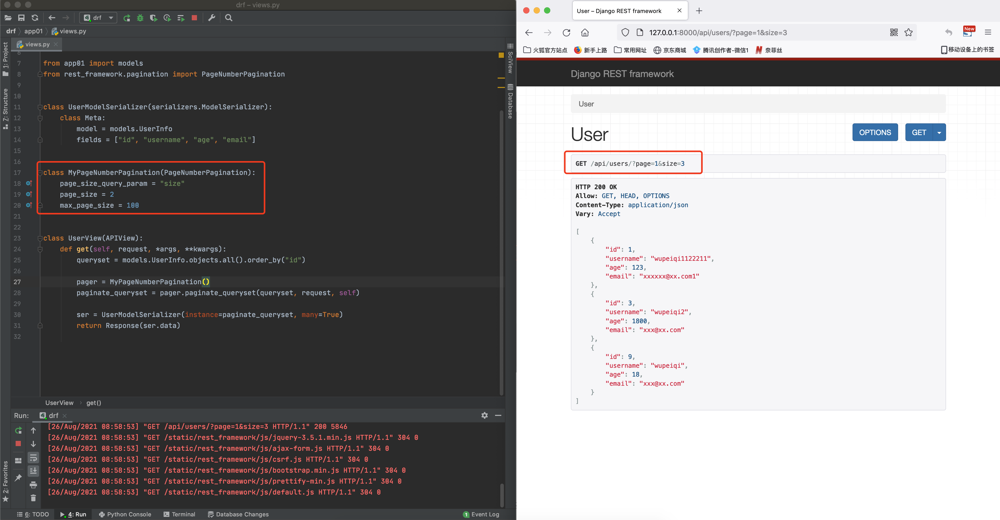

## 1.5 django restframework（下）

drf内置了很多便捷的功能，在接下来的课程中会给大家依次讲解下面的内容：

- 快速上手
- 请求的封装
- 版本管理
- 认证
- 权限
- 限流
- 序列化
- 视图
- 条件搜索
- **分页**
- **路由**
- **解析器**


### 10. 分页

在查看数据列表的API中，如果 数据量 比较大，肯定不能把所有的数据都展示给用户，而需要通过分页展示。

在drf中为我们提供了一些分页先关类：

```
BasePagination，分页基类
PageNumberPagination(BasePagination)	支持 /accounts/?page=4&page_size=100 格式的分页
LimitOffsetPagination(BasePagination)	支持 ?offset=100&limit=10 格式的分页
CursorPagination(BasePagination)		支持 上一下 & 下一页 格式的分页（不常用）
```

#### 10.1 APIView视图

如果编写视图是直接继承APIView，那么在使用分页时，就必须自己手动 实例化 和 调用相关方法。

##### 1.PageNumberPagination





##### 2.LimitOffsetPagination


##### 3.CursorPagination


#### 10.2 GenericAPIView派生类

如果是使用 `ListModelMixin` 或 `ModelViewSet` ，则只需要配置相关类即可，内部会自动执行相关分页的方法。

##### 1.PageNumberPagination

###### 

##### 2.LimitOffsetPagination


##### 3.CursorPagination


### 11. 路由

在之前进行drf开发时，对于路由我们一般进行两种配置：

- 视图继承APIView

  ```python
  from django.urls import path
  from app01 import views
  
  urlpatterns = [
      path('api/users/', views.UserView.as_view()),
  ]
  ```

- 视图继承 `ViewSetMixin`（GenericViewSet、ModelViewSet）

  ```python
  from django.urls import path, re_path, include
  from app01 import views
  
  urlpatterns = [
      path('api/users/', views.UserView.as_view({"get":"list","post":"create"})),
      path('api/users/<int:pk>/', views.UserView.as_view({"get":"retrieve","put":"update","patch":"partial_update","delete":"destory"})),
  ]
  ```

  对于这种形式的路由，drf中提供了更简便的方式：

  ```python
  from rest_framework import routers
  from app01 import views
  
  router = routers.SimpleRouter()
  router.register(r'api/users', views.UserView)
  
  urlpatterns = [
      # 其他URL
      # path('xxxx/', xxxx.as_view()),
  ]
  
  urlpatterns += router.urls
  ```

  

  也可以利用include，给URL加前缀：
  
  ```python
  from django.urls import path, include
  from rest_framework import routers
  from app01 import views
  
  router = routers.SimpleRouter()
  router.register(r'users', views.UserView)
  
  urlpatterns = [
      path('api/', include((router.urls, 'app_name'), namespace='instance_name')),
      # 其他URL
      # path('forgot-password/', ForgotPasswordFormView.as_view()),
  ]
  ```


### 12. 解析器

之前使用 `request.data` 获取请求体中的数据。

这个 `reqeust.data` 的数据怎么来的呢？其实在drf内部是由解析器，根据请求者传入的数据格式 + 请求头来进行处理。

#### 1.JSONParser 


#### 2.FormParser


#### 3.MultiPartParser


```html
<!DOCTYPE html>
<html lang="en">
<head>
    <meta charset="UTF-8">
    <title>Title</title>
</head>
<body>
<form action="http://127.0.0.1:8000/test/" method="post" enctype="multipart/form-data">
    <input type="text" name="user" />
    <input type="file" name="img">

    <input type="submit" value="提交">

</form>
</body>
</html>
```


#### 4.FileUploadParser


解析器可以设置多个，默认解析器：

```python
from rest_framework.views import APIView
from rest_framework.response import Response
from rest_framework.parsers import MultiPartParser, JSONParser, FormParser


class UserView(APIView):

    def post(self, request):
        print(request.content_type)
        print(request.data)

        return Response("...")

```

 

## 写在最后

至此，drf相关的知识点就全部讲完了。

- 你的感受：单独听的时候都明白，现在感觉自己已经忘记了 并且 还不知道怎么组合起来一起使用。

- 切记：现在千万不要重复回去再看视频，接着往下看学习《drf实战案例》，结合实战功能 & drf各个组件的小项目。


