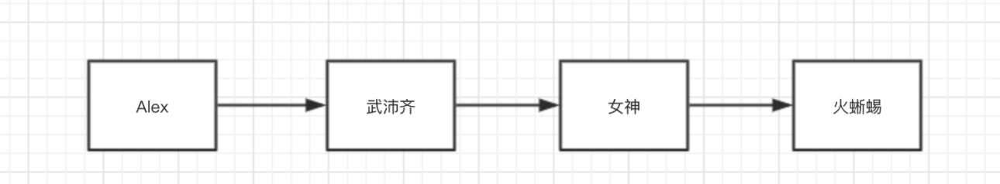
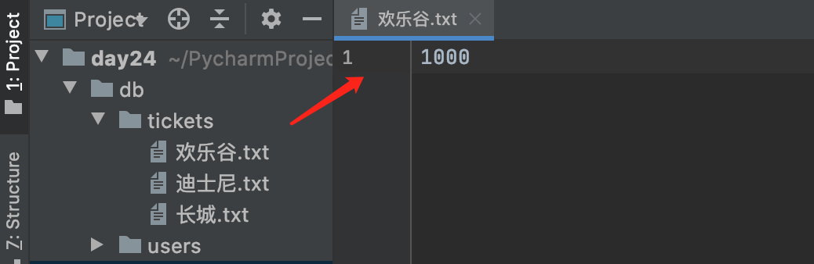

# 第三阶段考试题

1. 简述面向对象的三大特性

2. super的作用？

3. 实例变量和类变量的区别？

4. @staticmethod 和 @classmethod的区别？

5. 简述 `__new__`和`__init__`的区别？

6. 在Python中如何定义私有成员？

7. 请基于`__new__` 实现一个单例类（加锁）。

8. 比较以下两段代码的区别

   ```python
   class F1(object):
       def func(self,num):
           print("F1.func",num)
           
   class F2(F1):
       def func(self,num):
           print("F2.func",num)
           
   class F3(F2):
       def run(self):
   		F1.func(self,1)
           
   obj = F3()
   obj.run()
   ```

   ```python
   class F1(object):
       def func(self,num):
           print("F1.func",num)
           
   class F2(F1):
       def func(self,num):
           print("F2.func",num)
           
   class F3(F2):
       def run(self):
   		super().func(1)
           
   obj = F3()
   obj.run()
   ```

9. 补充代码实现

   ```python
   class Context:
       pass
   
   with Context() as ctx:
       ctx.do_something()
       
   # 请在Context类下添加代码完成该类的实现
   ```

10. 简述 迭代器、可迭代对象 的区别？

11. 什么是反射？反射的作用？

12. 简述OSI七层模型。

13. UDP和TCP的区别。

14. 简述TCP三次握手和四次挥手的过程。

15. 简述你理解的IP和子网掩码。

16. 端口的作用？

17. 什么是粘包？如何解决粘包？

18. IO多路复用的作用是什么？

19. 简述进程、线程、协程的区别。

20. 什么是GIL锁？其作用是什么？

21. 进程之间如何实现数据的共享？

22. 已知一个订单对象（tradeOrder）有如下字段：

    | 字段英文名 | 中文名     | 字段类型 | 取值举例             |
    | ---------- | ---------- | -------- | -------------------- |
    | nid        | ID         | int      | 123456789            |
    | name       | 姓名       | str      | 张三                 |
    | items      | 商品列表   | list     | 可以存放多个订单对象 |
    | is_member  | 是否是会员 | bool     | True                 |

    商品对象有如下字段：

    | 字段英文名称 | 中文名   | 字段类型 | 取值      |
    | ------------ | -------- | -------- | --------- |
    | id           | 主键     | int      | 987654321 |
    | name         | 商品名称 | str      | 手机      |

    请根据要求实现如下功能：

    - 编写相关类。
    - 创建订单对象并根据关系关联多个商品对象。
    - 用json模块将对象进行序列化为JSON格式（提示：需自定义`JSONEncoder`）。

23. 基于面向对象的知识构造一个链表。

    

    注意：每个链表都是一个对象，对象内部均存储2个值，分为是：当前值、下一个对象 。

24. 读源码，分析代码的执行过程。

    - socket服务端

      ```python
      import socket
      import threading
      
      
      class BaseServer:
      
          def __init__(self, server_address, request_handler_class):
              self.server_address = server_address
              self.request_handler_class = request_handler_class
      
          def serve_forever(self):
              while True:
                  request, client_address = self.get_request()
                  self.process_request(request, client_address)
      
          def finish_request(self, request, client_address):
              self.request_handler_class(request, client_address, self)()
      
          def process_request(self, request, client_address):
              pass
      
          def get_request(self):
              return "傻儿子", "Alex"
      
      
      class TCPServer(BaseServer):
          address_family = socket.AF_INET
      
          socket_type = socket.SOCK_STREAM
      
          request_queue_size = 5
      
          allow_reuse_address = False
      
          def __init__(self, server_address, request_handler_class, bind_and_activate=True):
              BaseServer.__init__(self, server_address, request_handler_class)
              self.socket = socket.socket(self.address_family, self.socket_type)
              self.server_bind()
              self.server_activate()
      
          def server_bind(self):
              self.socket.setsockopt(socket.SOL_SOCKET, socket.SO_REUSEADDR, 1)
              self.socket.bind(self.server_address)
              self.server_address = self.socket.getsockname()
      
          def server_activate(self):
              self.socket.listen(self.request_queue_size)
      
          def get_request(self):
              return self.socket.accept()
      
          def close_request(self, request):
              request.close()
      
      
      class ThreadingMixIn:
          def process_request_thread(self, request, client_address):
              self.finish_request(request, client_address)
              self.close_request(request)
      
          def process_request(self, request, client_address):
              t = threading.Thread(target=self.process_request_thread, args=(request, client_address))
              t.start()
      
      
      class ThreadingTCPServer(ThreadingMixIn, TCPServer):
          pass
      
      
      class BaseRequestHandler:
          def __init__(self, request, client_address, server):
              self.request = request
              self.client_address = client_address
              self.server = server
              self.setup()
      
          def __call__(self, *args, **kwargs):
              try:
                  self.handle()
              finally:
                  self.finish()
      
          def setup(self):
              pass
      
          def handle(self):
              pass
      
          def finish(self):
              pass
      
      
      class MyHandler(BaseRequestHandler):
          def handle(self):
              print(self.request)
              self.request.sendall(b'hahahahah...')
      
      
      server = ThreadingTCPServer(("127.0.0.1", 8000), MyHandler)
      server.serve_forever()
      
      ```
      
- socket客户端
    
  ```python
      import socket
      
      # 1. 向指定IP发送连接请求
      client = socket.socket()
      client.connect(('127.0.0.1', 8000)) # 向服务端发起连接（阻塞）10s
      
      # 2. 连接成功之后，发送消息
      client.sendall('hello'.encode('utf-8'))
      
      # 3. 等待，消息的回复（阻塞）
      reply = client.recv(1024)
      print(reply)
      
      # 4. 关闭连接
      client.close()
      ```
    
25. 请自己基于socket模块和threading模块实现  门票预订 平台。（无需考虑粘包）

    - 用户作为socket客户端

      - 输入`景区名称`，用来查询景区的余票。
      - 输入`景区名称-预订者-8`，用于预定门票。

    - socket服务端，可以支持并发多人同时查询和购买。（为每个客户度创建一个线程）。

      - 服务端数据存储结构如下：

        ```python
        db
        ├── tickets
        │   ├── 欢乐谷.txt # 内部存储放票数量
        │   ├── 迪士尼.txt
        │   └── 长城.txt
        └── users
            ├── alex.txt # 内部存储次用户预定记录
            └── 武沛齐.txt
            
        # 注意：当用户预定门票时，放票量要减去相应的数量（变为0之后，则不再接受预定）。
        ```

        

        

    

    


