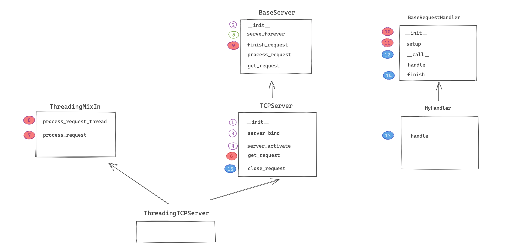

# 第三阶段考试题（含答案）

1. 简述面向对象的三大特性

   ```
   继承，将多个子类中相同的方法放在父类中，子类可以继承父类中的方法（提升重用性）
   封装，将多个数据封装到一个对象； 将同类的方法编写（封装）在一个类型中。
   多态，天然支持多态，崇尚鸭子模型，不会对类型进行限制，只要具备相应的属性即可，例如：
   	def func(arg):
   		arg.send()
   	不管arg是什么类型，只要具备send方法即可。
   ```

2. super的作用？

   ```
   根据mro的顺序，向上寻找类。
   ```

3. 实例变量和类变量的区别？

   ```
   实例变量，属于对象，每个对象中都各自存储各自的实例变量。
   类变量，属于类，在类中存储。
   ```

4. @staticmethod 和 @classmethod的区别？

   ```
   @staticmethod，静态方法；  定义时：可以有任意个参数；    执行时：类和对象均可以触发执行。
   @classmethod，类方法；     定义时：至少有一个cls参数；  执行时：类和对象均可以触发执行，自动把当前类当做参数传递给cls。
   ```

5. 简述 `__new__`和`__init__`的区别？

   ```python
   __new__，构造方法，用于创建对象。
   __init__，初始化方法，用于在对象中初始化值。
   ```

6. 在Python中如何定义私有成员？

   ```python
   用两个下划线开头。
   ```

7. 请基于`__new__` 实现一个单例类（加锁）。

   ```python
   import threading
   
   
   class Singleton(object):
       instance = None
       lock = threading.RLock()
   
       def __init__(self, name, age):
           self.name = name
           self.age = age
   
       def __new__(cls, *args, **kwargs):
           if cls.instance:
               return cls.instance
           with cls.lock:
               if cls.instance:
                   return cls
               cls.instance = super().__new__(cls)
           return cls.instance
   
   
   obj1 = Singleton('武沛齐', 18)
   print(obj1)
   
   obj2 = Singleton('alex', 18)
   print(obj2)
   
   # 注意：单例模式，用于用的是第一次创建的那个对象，但对象中的实例变量会被重置。
   ```

8. 比较以下两段代码的区别

   ```python
   class Foo(object):
       def func(self,num):
           pass
       
   obj = Foo()
   obj.func(123)
   
   obj = Foo()
   Foo.func(obj,123)
   ```

   

   ```python
   class F1(object):
       def func(self,num):
           print("F1.func",num)
           
   class F2(F1):
       def func(self,num):
           print("F2.func",num)
           
   class F3(F2):
       def run(self):
   		F1.func(self,1)   # 直接执行F1中的func方法。
           
   obj = F3()
   obj.run()
   ```

   ```python
   class F1(object):
       def func(self,num):
           print("F1.func",num)
           
   class F2(F1):
       def func(self,num):
           print("F2.func",num)
           
   class F3(F2):
       def run(self):
   		super().func(1)  # 根据mro的顺序，执行F2中的func方法
           
   obj = F3()
   obj.run()
   ```

9. 补充代码实现

   ```python
   class Context:
       pass
   
   with Context() as ctx:
       ctx.do_something()
       
   # 请在Context类下添加代码完成该类的实现
   ```

   ```python
   class Context:
   
       def __enter__(self):
           print("进入")
           return self
   
       def __exit__(self, exc_type, exc_val, exc_tb):
           print("出去")
   
       def do_something(self):
           print("执行")
   
   
   with Context() as ctx:
       ctx.do_something()
   
   ```

10. 简述 迭代器、可迭代对象 的区别？

    ```python
    迭代器，
        1.当类中定义了 __iter__ 和 __next__ 两个方法。
        2.__iter__ 方法需要返回对象本身，即：self
        3. __next__ 方法，返回下一个数据，如果没有数据了，则需要抛出一个StopIteration的异常。
    
    可迭代对象，在类中定义了 __iter__ 方法并返回一个迭代器对象。	
    ```

11. 什么是反射？

    ```
    反射，通过字符串的形式去操作对象中的成员。例如：getattr/setattr/delattr/hashattr
    ```

12. 简述OSI七层模型。

    ```
    OSI七层模型分为：应用层、表示层、会话层、传输层、网络层、数据连路程、物理层，其实就是让各层各司其职，完成各自的事。
    
    以Http协议为例，简述各层的职责：
    	应用层，规定数据传格式。
    		"GET /s?wd=你好 HTTP/1.1\r\nHost:www.baidu.com\r\n\r\n"
    	表示层，对应用层数据的编码、压缩（解压缩）、分块、加密（解密）等任务。
    		"GET /s?wd=你好 HTTP/1.1\r\nHost:www.baidu.com\r\n\r\n你好".encode('utf-8')
    	会话层，负责与目标建立、中断连接。
    	传输层，建立端口到端口的通信，其实就确定双方的端口信息。
    		数据："GET /s?wd=你好 HTTP/1.1\r\nHost:www.baidu.com\r\n\r\n你好".encode('utf-8')
            端口：
                - 目标：80
                - 本地：6784
    	网络层，标记IP信息。
    		数据："GET /s?wd=你好 HTTP/1.1\r\nHost:www.baidu.com\r\n\r\n你好".encode('utf-8')
            端口：
                - 目标：80
                - 本地：6784
            IP：
                - 目标IP：110.242.68.3
                - 本地IP：192.168.10.1
    	数据连路程，设置MAC地址信息
    		数据："POST /s?wd=你好 HTTP/1.1\r\nHost:www.baidu.com\r\n\r\n你好".encode('utf-8')
            端口：
                - 目标：80
                - 本地：6784
            IP：
                - 目标IP：110.242.68.3（百度）
                - 本地IP：192.168.10.1
            MAC：
                - 目标MAC：FF-FF-FF-FF-FF-FF 
                - 本机MAC：11-9d-d8-1a-dd-cd
    	物理层，将二进制数据在物理媒体上传输。
    ```

13. UDP和TCP的区别。

    ```python
    - UDP，UDP不提供可靠性，它只是把应⽤程序传给IP层的数据报发送出去， 但是并不能保证它们能到达⽬的地。 由于UDP在传输数据报前不⽤在客户和服务器之间建⽴⼀个连接， 且没有超时重发等机制， 故⽽传输速度很快。常见的有：语音通话、视频通话、实时游戏画面 等。
    - TCP，在收发数据前，必须和对方建立可靠的连接，然后再进行收发数据。常见有：网站、手机APP数据获取等。
    ```

14. 简述TCP三次握手和四次挥手的过程。

    ```python
    创建连接，三次握手：
    	第一次：客户端向服务端请求，发送：seq=100（随机值）；  
        第二次：服务端接收请求，然后给客户端发送：seq=300（随机值）、ack=101（原来客户端口发来请求的seq+1）
        第三次：客户接接收请求，然后给服务端发送：seq=101（第2次返回的值）、 ack=301（第2次seq+1）
        
    	第1、2次过程，客户端发送了数据seq，服务端也回给了seq+1，证明：客户端可以正常收发数据。此时，服务端不知客户端是否正常接收到了。
        第2、3次过程，服务端发送了数据seq，客户端也返回了seq+1，证明：服务端可以正常收发数据。
    
    断开连接，四次挥手：（任意一方都可以发起）
    	第一次：客户端向服务端发请求，发送：<seq=100><ack=300>       （我要与你断开连接）
        第二次：服务端接收请求，然后给客户端发送：<seq=300><ack=101>  （已收到，可能还有数据未处理，等等）
        第三次：服务端接收请求，然后给客户端发送：<seq=300><ack=101>  （可以断开连接了）
        第四次：客户端接收请求，然后给服务端发送：<seq=101><ack=301>  （好的，可以断开了）
    ```

15. 简述你理解的IP和子网掩码。

    ```
    子网掩码用于给IP划分网段，IP分为：网络地址 + 主机地址。
    简而言之，子网掩码掩盖的IP部分就是网络地址，未掩盖就是主机部分。
    
    例如：
        	IP：192.168.1.199      11000000.10101000.00000001.11000111
    	子网掩码：255.255.255.0     11111111.11111111.11111111.00000000
    此时，网络地址就是前24位 + 主机地址是后8位。你可能见过有些IP这样写 192.168.1.199/24，意思也是前24位是网络地址。
    ```

16. 端口的作用？

    ```
    在网络编程中，IP代指的是计算机，而端口则代指计算机中的某个程序。以方便对计算机中的多个程序进程区分。
    ```

17. 什么是粘包？如何解决粘包？

    ```python
    两台电脑在进行收发数据时，其实不是直接将数据传输给对方。
    
    - 对于发送者，执行 `sendall/send` 发送消息时，是将数据先发送至自己网卡的 写缓冲区 ，再由缓冲区将数据发送给到对方网卡的读缓冲区。
    - 对于接受者，执行 `recv` 接收消息时，是从自己网卡的读缓冲区获取数据。
    
    所以，如果发送者连续快速的发送了2条信息，接收者在读取时会认为这是1条信息，即：2个数据包粘在了一起。
    
    解决思路：
    	双方约定好规则，在每次收发数据时，都按照固定的 数据头 + 数据 来进行处理数据包，在数据头中设置好数据的长度。
    ```

    

18. IO多路复用的作用是什么？

    ```
    可以监听多个 IO对象 的变化（可读、可写、异常）。
    
    在网络编程中一般与非阻塞的socket对象配合使用，以监听 socket服务端、客户端是否 （可读、可写、异常）
    
    IO多路复用有三种模式：
    	- select，限制1024个 & 轮训的机制监测。
    	- poll，无限制 & 轮训的机制监测。
    	- epoll，无限制 & 采用回调的机制（边缘触发）。
    ```

19. 简述进程、线程、协程的区别。

    ```
    线程，是计算机中可以被cpu调度的最小单元。
    进程，是计算机资源分配的最小单元（进程为线程提供资源）。
    一个进程中可以有多个线程,同一个进程中的线程可以共享此进程中的资源。
    
    由于CPython中GIL的存在：
    	- 线程，适用于IO密集型操作。
        - 进程，适用于计算密集型操作。
    
    协程，协程也可以被称为微线程，是一种用户态内的上下文切换技术，在开发中结合遇到IO自动切换，就可以通过一个线程实现并发操作。
    
    
    所以，在处理IO操作时，协程比线程更加节省开销（协程的开发难度大一些）。
    ```

20. 什么是GIL锁？其作用是什么？

    ```
    GIL， 全局解释器锁（Global Interpreter Lock），是CPython解释器特有一个玩意，让一个进程中同一个时刻只能有一个线程可以被CPU调用。
    ```

21. 进程之间如何实现数据的共享？

    ```python
    multiprocessing.Value 或 multiprocessing.Array
    multiprocessing.Manager
    multiprocessing.Queue
    multiprocessing.Pipe
    ```

22. 已知一个订单对象（tradeOrder）有如下字段：

    | 字段英文名 | 中文名     | 字段类型 | 取值举例             |
    | ---------- | ---------- | -------- | -------------------- |
    | nid        | ID         | int      | 123456789            |
    | name       | 姓名       | str      | 张三                 |
    | items      | 商品列表   | list     | 可以存放多个订单对象 |
    | is_member  | 是否是会员 | bool     | True                 |

    商品对象有如下字段：

    | 字段英文名称 | 中文名   | 字段类型 | 取值      |
    | ------------ | -------- | -------- | --------- |
    | id           | 主键     | int      | 987654321 |
    | name         | 商品名称 | str      | 手机      |

    请根据要求实现如下功能：

    - 编写相关类。
    - 创建订单对象并根据关系关联多个商品对象。
    - 用json模块将对象进行序列化为JSON格式（提示：需自定义`JSONEncoder`）。

    ```python
    import json
    
    
    class ObjectJsonEncoder(json.JSONEncoder):
        def default(self, o):
            if type(o) in {Order, Goods}:
                return o.__dict__
            else:
                return o
    
    
    class Order(object):
        def __init__(self, nid,name,is_member):
            self.nid = nid
            self.name = name
            self.is_member = is_member
            self.items = []
    
    
    class Goods(object):
        def __init__(self, id, name):
            self.id = id
            self.name = name
    
    
    od = Order(666,"武沛齐",True)
    od.items.append( Goods(1, "汽车") )
    od.items.append( Goods(2, "美女") )
    od.items.append( Goods(3, "游艇") )
    
    data = json.dumps(od, cls=ObjectJsonEncoder)
    print(data)
    ```

23. 基于面向对象的知识构造一个链表。

    

    注意：每个链表都是一个对象，对象内部均存储2个值，分为是：当前值、下一个对象 。

    ```python
    class Node(object):
    
        def __init__(self, value, _next):
            self.value = value
            self.next = _next
      
    # 手动创建链表
    v4 = Node("火蜥蜴",None)
    v3 = Node("女神",v4)
    v2 = Node("武沛齐",v3)
    v1 = Node("alex",v2)
    
    
    # 根据列表创建链表
    data_list = ["alex", "武沛齐", "女神", "火蜥蜴"]
    root = None
    for index in range(len(data_list) - 1, -1, -1): # [3,2,1,0]
        node = Node( data_list[index] , root)
        root = node
    ```

    

24. 读源码，分析代码的执行过程。
    

    - socket服务端

      ```python
      import socket
      import threading
      
      
      class BaseServer:
      
          def __init__(self, server_address, request_handler_class):
              # ("127.0.0.1", 8000),   MyHandler -> 类
              self.server_address = server_address
              self.request_handler_class = request_handler_class
      
          def serve_forever(self):
              while True:
                  # 等待客户端来连接
                  # conn,address = socket.accept()
                  request, client_address = self.get_request()
                  
                  self.process_request(request, client_address)
      
          def finish_request(self, request, client_address):
              # MyHandler -> 类
              # MyHandler()   -> MyHandler.__init__(conn,address, self)
              # MyHandler.__call__方法
              self.request_handler_class(request, client_address, self)()
      
          def process_request(self, request, client_address):
              pass
      
          def get_request(self):
              return "傻儿子", "Alex"
      
      
      class TCPServer(BaseServer):
          address_family = socket.AF_INET
      
          socket_type = socket.SOCK_STREAM
      
          request_queue_size = 5
      
          allow_reuse_address = False
      
          def __init__(self, server_address, request_handler_class, bind_and_activate=True):
              # ("127.0.0.1", 8000),   MyHandler
              BaseServer.__init__(self, server_address, request_handler_class)
              
              self.socket = socket.socket(self.address_family, self.socket_type)
              self.server_bind()
              self.server_activate()
      
          def server_bind(self):
      		self.socket.setsockopt(socket.SOL_SOCKET, socket.SO_REUSEADDR, 1)
              self.socket.bind(self.server_address) # （IP、端口）
              self.server_address = self.socket.getsockname()
      
          def server_activate(self):
              self.socket.listen(self.request_queue_size)
      
          def get_request(self):
              return self.socket.accept()
      
          def close_request(self, request):
              request.close()
      
      
      class ThreadingMixIn:
          def process_request_thread(self, request, client_address):
              self.finish_request(request, client_address)
              self.close_request(request)
      
          def process_request(self, request, client_address):
              t = threading.Thread(target=self.process_request_thread, args=(request, client_address))
              t.start()
      
      
      class ThreadingTCPServer(ThreadingMixIn, TCPServer):
          pass
      
      
      
      
      class BaseRequestHandler:
          def __init__(self, request, client_address, server):
              # conn
              self.request = request
              self.client_address = client_address
              self.server = server
              self.setup()
      
          def __call__(self, *args, **kwargs):
              try:
                  self.handle()
              finally:
                  self.finish()
      
          def setup(self):
              pass
      
          def handle(self):
              pass
      
          def finish(self):
              pass
      
  
      class MyHandler(BaseRequestHandler):
      def handle(self):
              print(self.request) # conn
              self.request.sendall(b'hahahahah...')
              
      
      
      
      # 在server封装了点值、然后又创建socket服务端
      server = ThreadingTCPServer(  ("127.0.0.1", 8000),   MyHandler    )
      server.serve_forever()
      ```
    
    - socket客户端
    
      ```python
      import socket
      
      # 1. 向指定IP发送连接请求
  client = socket.socket()
      client.connect(('127.0.0.1', 8000)) # 向服务端发起连接（阻塞）10s
      
      # 2. 连接成功之后，发送消息
      client.sendall('hello'.encode('utf-8'))
      
      # 3. 等待，消息的回复（阻塞）
      reply = client.recv(1024)
      print(reply)
      
      # 4. 关闭连接
      client.close()
      ```
    
25. 请自己基于socket模块和threading模块实现  门票预订 平台。（无需考虑粘包）

    - 用户作为socket客户端

      - 输入`景区名称`，用来查询景区的余票。
      - 输入`景区名称-预订者-数量`，例如：`欢乐谷-alex-8`，用于预定门票。

    - socket服务端，可以支持并发多人同时查询和购买（为每个客户度创建一个线程）。

      - 服务端数据存储结构如下：

        ```python
        db
        ├── tickets
        │   ├── 欢乐谷.txt # 内部存储放票数量
        │   ├── 迪士尼.txt
        │   └── 长城.txt
        └── users
            ├── alex.txt # 内部存储次用户预定记录
            └── 武沛齐.txt
            
        # 注意：当用户预定门票时，放票量要减去相应的数量（变为0之后，则不再接受预定）。 约定时会存在多个线程同时操作文件去修改数值。
        ```

        

        

    

    

    


