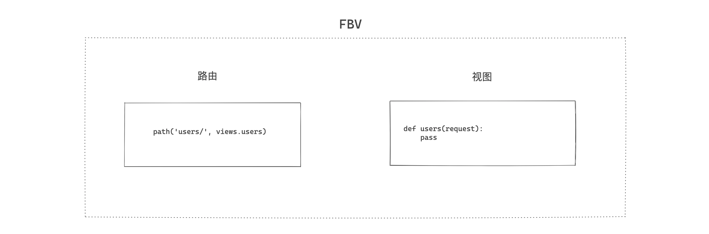
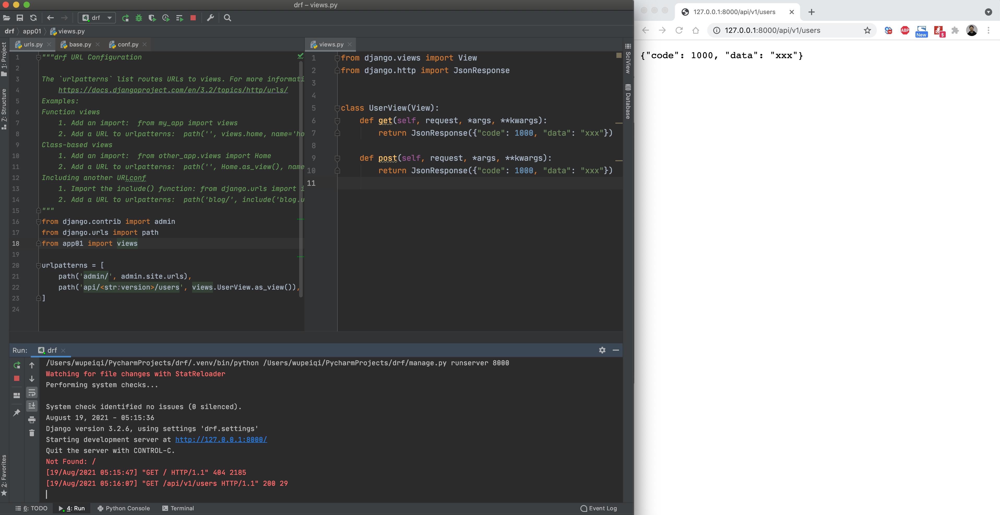

## 1.2 Django的FBV和CBV

基于django开发项目时，对于视图可以使用 FBV 和 CBV 两种模式编写。


- FBV，function base views，其实就是编写函数来处理业务请求。

  ```python
  from django.contrib import admin
  from django.urls import path
  from app01 import views
  urlpatterns = [
      path('users/', views.users),
  ]
  ```

  ```python
  from django.http import JsonResponse
  
  def users(request,*args, **kwargs):
      if request.method == "GET":
          return JsonResponse({"code":1000,"data":"xxx"})
      elif request.method == 'POST':
          return JsonResponse({"code":1000,"data":"xxx"})
      ...
  ```

- CBV，class base views，其实就是编写类来处理业务请求。

  ```python
  from django.contrib import admin
  from django.urls import path
  from app01 import views
  urlpatterns = [
      path('users/', views.UserView.as_view()),
  ]
  ```

  ```python
  from django.views import View
  
  class UserView(View):
      def get(self, request, *args, **kwargs):
          return JsonResponse({"code": 1000, "data": "xxx"})
  
      def post(self, request, *args, **kwargs):
          return JsonResponse({"code": 1000, "data": "xxx"})
  ```


其实，CBV和FBV的底层实现本质上相同的。




CBV，其实就是在FBV的基础上进行的功能的扩展，根据请求的方式不同，直接定位到不同的函数中去执行。

如果是基于django编写restful API，很显然使用CBV的方式会更加简洁，因为restful规范中就是根据method不同来执行不同操作。


基于django的CBV和restful规范开发实战案例：

```python
# urls.py

from django.urls import path
from app01 import views

urlpatterns = [
    # http://www.xxx.com/api/v1/users/
    path('api/<str:version>/users/', views.UserView.as_view()),

    # http://www.xxx.com/api/v1/users/2/
    path('api/<str:version>/users/<int:pk>/', views.UserView.as_view()),

]
```

```python
# views.py

from django.views import View
from django.http import JsonResponse


class UserView(View):
    def get(self, request, version, pk=None):
        if not pk:
            # 请求用户列表
            info = {
                "code": 0,
                "data": [
                    {"id": 1, "name": "武沛齐"},
                    {"id": 1, "name": "武沛齐"},
                ]
            }
            return JsonResponse(info)
        else:
            # 获取ID=pk的用户信息，并返回
            info = {
                "code": 0,
                "data": {"id": 1, "name": "武沛齐"}
            }
            return JsonResponse(info)

    def post(self, request, version):
        # 新增用户，读取 request.POST 中提交的数据并添加到数据库中
        info = {
            "code": 0,
            "data": {"id": 1, "name": "武沛齐"}
        }
        return JsonResponse(info)

    def delete(self, request, version, pk):
        # 删除id=pk的用户
        info = {
            "code": 0,
            "data": {}
        }
        return JsonResponse(info)

    def put(self, request, version, pk):
        # 读取request.POST中的数据 + pk，更新数据库中的用户信息
        info = {
            "code": 0,
            "data": {"id": 1, "name": "武沛齐"}
        }
        return JsonResponse(info)

    def patch(self, request, version, pk):
        # 读取request.POST中的数据 + pk，更新数据库中的用户信息
        info = {
            "code": 0,
            "data": {"id": 1, "name": "武沛齐"}
        }
        return JsonResponse(info)

```


从上面的示例看来，基于django框架完全可以开发restful API。


django restframework框架 是在django的基础上又给我们提供了很多方便的功能，让我们可以更便捷基于django开发restful API，来一个简单的实例，快速了解下：

- 基于django
  
- 基于django + django restframework框架
  

