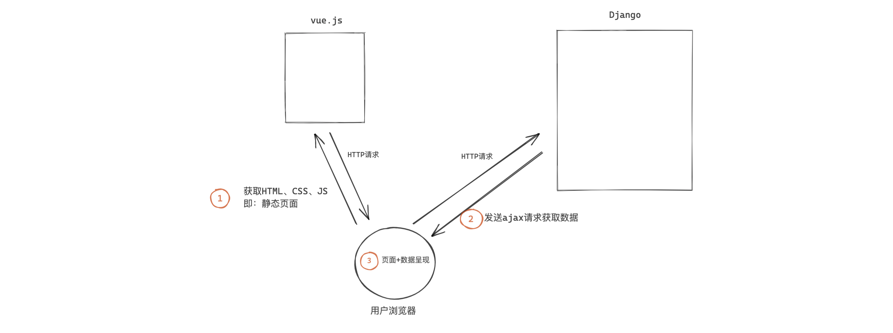

## 关于前后端分离

接下来，你将进入 **前后端分离项目开发** 模块。 这也是现在企业中比较常见的开发模式。

疑问：

- 什么是前后端分离？与之前的开发模式有什么区别？
- 企业为什么要用前后端分离？


### 1. 什么是前后端分离？

- 前后端不分离，像咱们之前学习django、案例、crm项目、bug管理 时的那些模块。

  ```
  特点：
  	- 用户访问URL
  	- 执行视图函数，视图进行业务处理
  	- 视图render，读取HTML模块+数据渲染，将渲染完成的HTML/CSS/JS返回并呈现在用户浏览器上。
  	
  配合开发：
  	- 前端，写HTML、CSS、JS
  	- 后端，前端代码给我后端，后端代码 + 前端代码 集成到项目中。
  ```

  

  

- 前后端分离

  ```
  特点：
  	- 一般基于 vue.js、react.js、angular.js 框架来编写前端页面（本质上是HTML、CSS、JS）。
  	- 页面上如果需要呈现数据，则需要则需要通过 ajax 的形式向后端发送请求（URL）并获取数据。
  	- 后端接收到请求后，执行视图函数并进行业务处理
  	- 后端的视图执行完毕后，给前端返回JSON格式数据。
  	- 前端接收到JSON格式数据后呈现在浏览器上即可。
  	
  配合开发：
  	- 前端，写HTML、CSS、JS（数据都是通过调用后端API获得）
  	- 后端，写API接口
  	- 前后端约定好接口的规则。
  ```

  

  

  


### 2.为什么要使用前后端分离？

目前企业一般都会采用前后端分离的形式来进行项目开发，这种模式：

- 前后端职责清晰，前端开发者只vue.js、react.js、angular.js等框架编写页面；后端开发者只用Python编写后端代码；（两者通过json格式请求数据的传输）。
- 开发高效，前后端做自己擅长的领域且使用vue.js等前端框架比用传统的HTML、CSS、JS、jQuery等开发速度快很多。
- 有利于项目的扩展（开发APP、微信小程序等）。


**注意：**前后端不分离的项目，现在一般用于开发用户量少、简单的项目。


## 关于项目安排


此项目最终是基于前后端分离来进行开发，所以对于你们来讲需要学会前端开发必备技能、后端开发必备技能后，再进行业务功能开发，所以我们的项目讲解的安排如下：

- 第一部分：作为后端开发者，学会基于Django编写后端API（给前端提供URL并返回相应格式数据）。
- 第二部分：作为前端开发者，学会基于vue.js编写前端页面并调用后端API获取数据。
- 第三部分：结合前端和后端技术，开发本项目的业务功能。


