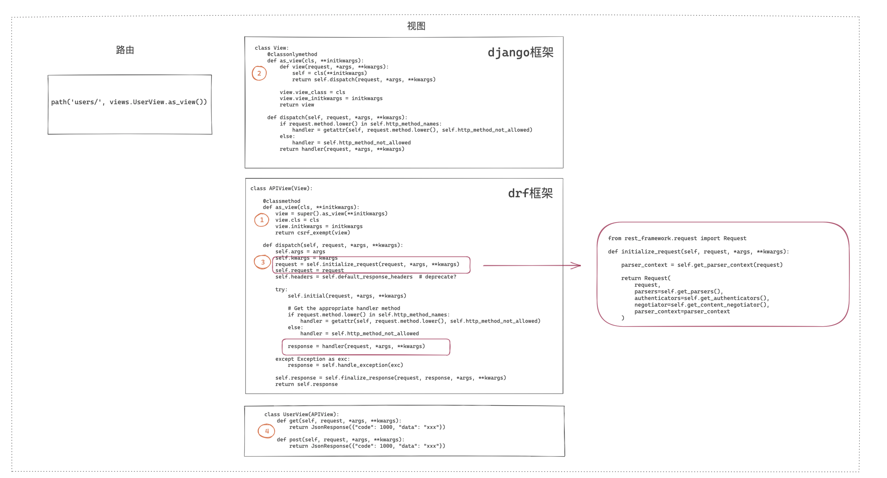
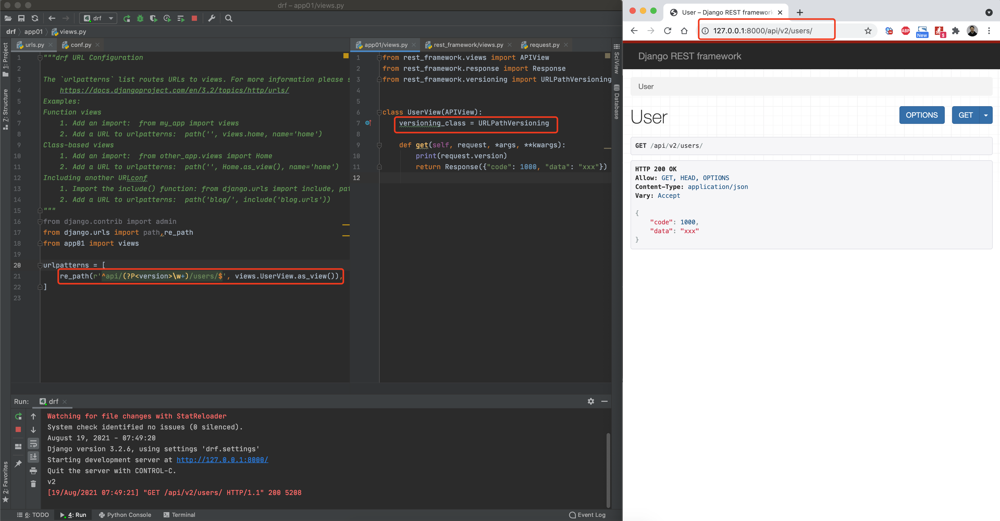
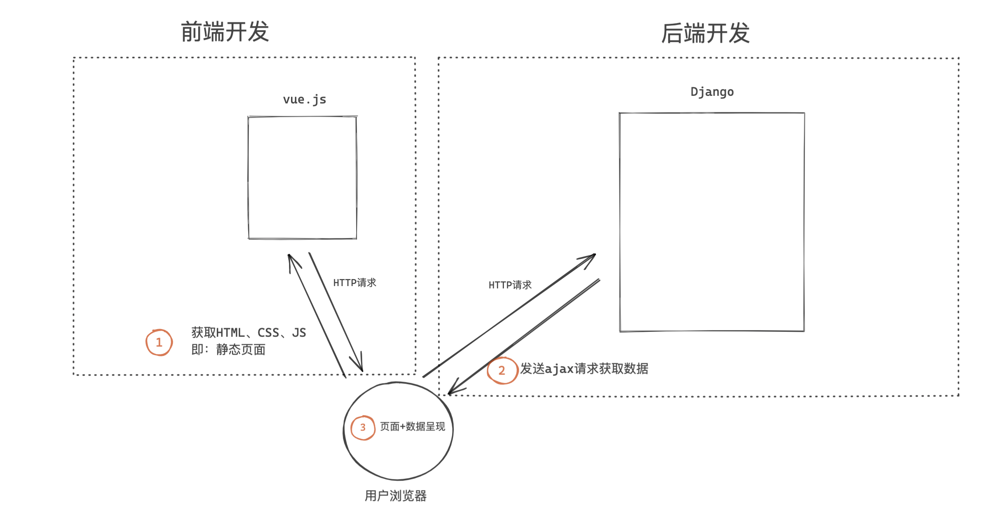
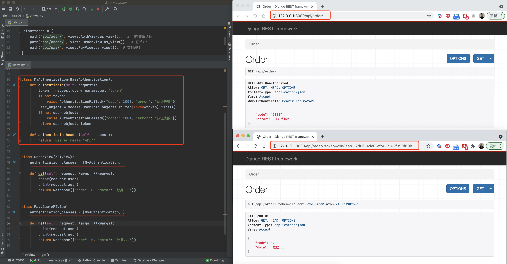
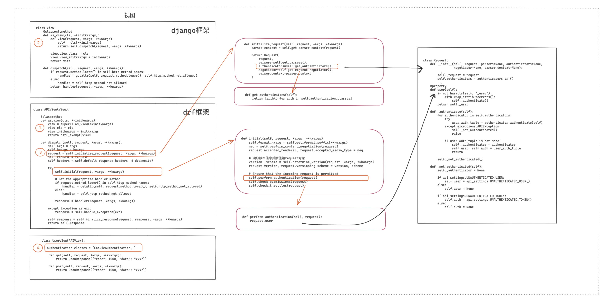
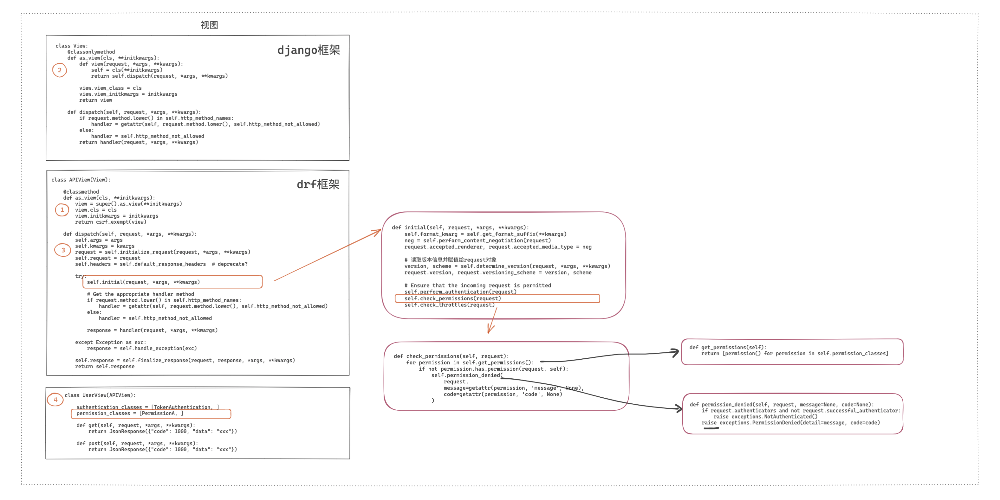

## 1.3 django restframework（上）

django restframework（简称drf）本质上其实就是一个别人编写好的app，里面集成了很多编写restful API的功能功能，接下里咱们就来学习drf并用他来开发restful API。

drf内置了很多便捷的功能，在接下来的课程中会给大家依次讲解下面的内容：

- **快速上手**
- **请求的封装**
- **版本管理**
- **认证**
- **权限**
- 限流
- 序列化
- 视图
- 条件搜索
- 分页
- 路由
- 解析器


### 1. 快速上手

- 安装

  ```
  pip install djangorestframework==3.12.4
  ```

  ```python
  版本要求：djangorestframework==3.12.4
  	Python (3.5, 3.6, 3.7, 3.8, 3.9)
  	Django (2.2, 3.0, 3.1)
      
  版本要求：djangorestframework==3.11.2
  	Python (3.5, 3.6, 3.7, 3.8)
  	Django (1.11, 2.0, 2.1, 2.2, 3.0)
  ```

- 配置，在settings.py中添加配置

  ```python
  INSTALLED_APPS = [
      ...
      # 注册rest_framework（drf）
      'rest_framework',
  ]
  
  # drf相关配置以后编写在这里 
  REST_FRAMEWORK = {
     
  }
  ```

- URL和视图

  ```python
  # urls.py
  
  from django.urls import path
  from app01 import views
  
  urlpatterns = [
      path('users/', views.UserView.as_view()),
  ]
  ```
  
  ```python
  # views.py
  from rest_framework.views import APIView
  from rest_framework.response import Response
  
  
  class UserView(APIView):
      def get(self, request, *args, **kwargs):
          return Response({"code": 1000, "data": "xxx"})
  
      def post(self, request, *args, **kwargs):
          return Response({"code": 1000, "data": "xxx"})
  ```


其实drf框架是在django基础进行的扩展，所以上述执行过得底层实现流程（同django的CBV）：


drf中重写了 `as_view` 和`dispatch`方法，其实就是在原来django的功能基础上添加了一些功能，例如：

- `as_view`，免除了csrf 验证，一般前后端分离不会使用csrf token认证（后期会使用jwt认证）。
- `dispatch`，内部添加了 版本处理、认证、权限、访问频率限制等诸多功能（后期逐一讲解）。


### 2. 请求数据的封装

以前我们通过django开发项目时，视图中的request是 `django.core.handlers.wsgi.WSGIRequest` 类的对象，其中包含了请求相关的所有数据。

```python
# Django FBV
def index(request):
	request.method
	request.POST
	request.GET
	request.body

# Django CBV
from django.views import View
class UserView(View):
	def get(self,request):
        request.method
        request.POST
        request.GET
        request.body
```


而在使用drf框架时，视图中的request是`rest_framework.request.Request`类的对象，其是又对django的request进行了一次封装，包含了除django原request对象以外，还包含其他后期会使用的其他对象。

```python
from rest_framework.views import APIView
from rest_framework.response import Response


class UserView(APIView):
    def get(self, request, *args, **kwargs):
        # request，不再是django中的request，而是又被封装了一层，内部包含：django的request、认证、解析器等。
        return Response({"code": 1000, "data": "xxx"})

    def post(self, request, *args, **kwargs):
        return Response({"code": 1000, "data": "xxx"})

```

```python
对象 = (request, 其他数据)
```

```python
# rest_framework.request.Request 类

class Request:
    """
    Wrapper allowing to enhance a standard `HttpRequest` instance.
    Kwargs:
        - request(HttpRequest). The original request instance. （django中的request）
        - parsers(list/tuple). The parsers to use for parsing the
          request content.
        - authenticators(list/tuple). The authenticators used to try
          authenticating the request's user.
    """

    def __init__(self, request, parsers=None, authenticators=None,negotiator=None, parser_context=None):
    	self._request = request
        self.parsers = parsers or ()
        self.authenticators = authenticators or ()
        ...
	
    @property
    def query_params(self):
        """
        More semantically correct name for request.GET.
        """
        return self._request.GET

    @property
    def data(self):
        if not _hasattr(self, '_full_data'):
            self._load_data_and_files()
        return self._full_data
    
	def __getattr__(self, attr):
        try:
            return getattr(self._request, attr) # self._request.method
        except AttributeError:
            return self.__getattribute__(attr)
```

所以，在使用drf框架开发时，视图中的request对象与原来的有些不同，例如：

```python
from rest_framework.views import APIView
from rest_framework.response import Response
from django.views import View
from rest_framework.request import Request


class UserView(APIView):
    def get(self, request, *args, **kwargs):
        
        # 通过对象的嵌套直接找到原request，读取相关值
        request._request.method
        request._request.GET
        request._request.POST
        request._request.body
        
        # 举例：
        	content-type: url-form-encoded
        	v1=123&v2=456&v3=999
            django一旦读取到这个请求头之后，就会按照 {"v1":123,"v2":456,"v3":999}
            
            content-type: application/json
            {"v1":123,"v2":456}
            request._request.POST
            request._request.body
        
        # 直接读取新request对象中的值，一般此处会对原始的数据进行一些处理，方便开发者在视图中使用。
        request.query_params  # 内部本质上就是 request._request.GET
        request.data # 内部读取请求体中的数据，并进行处理，例如：请求者发来JSON格式，他的内部会对json字符串进行反序列化。
        
        # 通过 __getattr__ 去访问 request._request 中的值
        request.method
        
        
```


**底层源码实现：**




### 3. 版本管理

在restful规范中要去，后端的API中需要体现版本。

drf框架中支持5种版本的设置。

#### 3.1 URL的GET参数传递（*）


```python
# settings.py

REST_FRAMEWORK = {
    "VERSION_PARAM": "v",
    "DEFAULT_VERSION": "v1",
    "ALLOWED_VERSIONS": ["v1", "v2", "v3"],
    "DEFAULT_VERSIONING_CLASS":"rest_framework.versioning.QueryParameterVersioning"
}
```

源码执行流程：


#### 3.2 URL路径传递（*）




#### 3.3 请求头传递


#### 3.4 二级域名传递


在使用二级域名这种模式时需要先做两个配置：

- 域名需解析至IP，本地可以在hosts文件中添加
  

  ```
  127.0.0.1       v1.wupeiqi.com
  127.0.0.1       v2.wupeiqi.com
  ```

- 在django的settings.py配置文件中添加允许域名访问

  ```
  ALLOWED_HOSTS = ["*"]
  ```


#### 3.5 路由的namespace传递


以上就是drf中支持的5种版本管理的类的使用和配置。


**全局配置**

上述示例中，如果想要应用某种 版本 的形式，需要在每个视图类中定义类变量：

```python
from rest_framework.views import APIView
from rest_framework.response import Response
from rest_framework.versioning import QueryParameterVersioning


class UserView(APIView):
    versioning_class = QueryParameterVersioning
    ...
```

如果你项目比较大，需要些很多的视图类，在每一个类中都写一遍会比较麻烦，所有drf中也支持了全局配置。

```python
# settings.py

REST_FRAMEWORK = {
    "DEFAULT_VERSIONING_CLASS": "rest_framework.versioning.QueryParameterVersioning",  # 处理版本的类的路径
    "VERSION_PARAM": "version",  # URL参数传参时的key，例如：xxxx?version=v1
    "ALLOWED_VERSIONS": ["v1", "v2", "v3"],  # 限制支持的版本，None表示无限制
    "DEFAULT_VERSION": "v1",  # 默认版本
}
```


访问URL：

````
http://127.0.0.1:8000/api/users/?version=v1
http://127.0.0.1:8000/api/users/?version=v2
http://127.0.0.1:8000/api/users/?version=v3

http://127.0.0.1:8000/api/admin/?version=v1
http://127.0.0.1:8000/api/admin/?version=v2
http://127.0.0.1:8000/api/admin/?version=v3

http://127.0.0.1:8000/api/v1/order/
http://127.0.0.1:8000/api/v2/order/
http://127.0.0.1:8000/api/v3/order/
````


**底层源码实现**


**反向生成URL**

在每个版本处理的类中还定义了`reverse`方法，他是用来反向生成URL并携带相关的的版本信息用的，例如：


### 小结

以后使用drf开发后端API接口时：

1. 创建django程序
2. 安装drf框架
3. 创建一个app专门来处理用户的请求
4. 注册APP
5. 设置版本
6. 编写视图类


### 4. 认证



在开发后端的API时，不同的功能会有不同的限制，例如：

- 无需认证，就可以访问并获取数据。
- 需认证，用户需先登录，后续发送请求需携带登录时发放的凭证（后期会讲jwt）


在drf中也给我们提供了 认证组件 ，帮助我们快速实现认证相关的功能，例如：

```python
# models.py

from django.db import models

class UserInfo(models.Model):
    username = models.CharField(verbose_name="用户名", max_length=32)
    password = models.CharField(verbose_name="密码", max_length=64)
    token = models.CharField(verbose_name="TOKEN", max_length=64, null=True, blank=True)
```





在视图类中设置类变量 `authentication_classes`的值为 认证类 `MyAuthentication`，表示此视图在执行内部功能之前需要先经过 认证。

认证类的内部就是去执行：`authenticate`方法，根据返回值来表示认证结果。

- 抛出异常AuthenticationFailed，表示认证失败。内部还会执行 `authenticate_header`将返回值设置给响应头 `WWW-Authenticate`

- 返回含有两个元素的元组，表示认证成功，并且会将元素的第1个元素赋值给 `request.user`、第2个值赋值给`request.auth` 。

  ```
  第1个值，一般是用户对象。
  第2个值，一般是token
  ```

- 返回None，表示继续调用 后续的认证类 进行认证（上述案例未涉及）


**关于 ”返回None“ **

接下来说说 “返回None” 是咋回事。

> 在视图类的 `authentication_classes` 中定义认证类时，传入的是一个列表，支持定义多个认证类。
>
> 当出现多个认证类时，drf内部会按照列表的顺序，逐一执行认证类的 `authenticate` 方法，如果 返回元组 或 抛出异常 则会终止后续认证类的执行；如果返回None，则意味着继续执行后续的认证类。
>
> 如果所有的认证类`authenticate`都返回了None，则默认 request.user="AnonymousUser" 和 request.auth=None，也可以通过修改配置文件来修改默认值。
>
> ```python
> REST_FRAMEWORK = {
>     "UNAUTHENTICATED_USER": lambda: None,
>     "UNAUTHENTICATED_TOKEN": lambda: None,
> }
> ```


”返回None“的应用场景：

> 当某个API，已认证 和 未认证 的用户都可以方法时，比如：
>
> - 已认证用户，访问API返回该用户的视频播放记录列表。
> - 未认证用户，访问API返回最新的的视频列表。
>
> 注意：不同于之前的案例，之前案例是：必须认证成功后才能访问，而此案例则是已认证和未认证均可访问。


**关于多个认证类**

一般情况下，编写一个认证类足矣。 

当项目中可能存在多种认证方式时，就可以写多个认证类。例如，项目认证支持：

- 在请求中传递token进行验证。
- 请求携带cookie进行验证。
- 请求携带jwt进行验证（后期讲）。
- 请求携带的加密的数据，需用特定算法解密（一般为app开发的接口都是有加密算法）
- ...

此时，就可以编写多个认证类，并按照需要应用在相应的视图中，例如：


注意：此示例后续在视图中读取的 `request.user` 的值为None时，表示未认证成功；不为None时，则表示认证成功。


**全局配置**

在每个视图类的类变量 `authentication_classes` 中可以定义，其实在配置文件中也可以进行全局配置，例如：

```
REST_FRAMEWORK = {
    "UNAUTHENTICATED_USER": lambda: None,
    "UNAUTHENTICATED_TOKEN": lambda: None,
    "DEFAULT_AUTHENTICATION_CLASSES":["xxxx.xxxx.xx.类名","xxxx.xxxx.xx.类名",]
}
```


**底层源码实现：**




### 5. 权限

认证，根据用户携带的 token/其他 获取当前用户信息。

权限，读取认证中获取的用户信息，判断当前用户是否有权限访问，例如：普通用户、管理员、超级用户，不同用户具有不同的权限。

```python
class UserInfo(models.Model):
    
    role_choices = ((1, "普通用户"), (2, "管理员"), (3, "超级管理员"),)
    role = models.IntegerField(verbose_name="角色", choices=role_choices, default=1)
    
    username = models.CharField(verbose_name="用户名", max_length=32)
    password = models.CharField(verbose_name="密码", max_length=64)
    token = models.CharField(verbose_name="TOKEN", max_length=64, null=True, blank=True)
```


```python
import uuid
from rest_framework.views import APIView
from rest_framework.request import Request
from rest_framework.response import Response
from rest_framework.authentication import BaseAuthentication
from rest_framework.permissions import BasePermission
from rest_framework.exceptions import AuthenticationFailed

from app01 import models


class AuthView(APIView):
    """ 用户登录认证 """
    authentication_classes = []
    permission_classes = []

    def post(self, request, *args, **kwargs):
        print(request.data)  # {"username": "wupeiqi", "password": "123"}
        username = request.data.get('username')
        password = request.data.get('password')

        user_object = models.UserInfo.objects.filter(username=username, password=password).first()
        if not user_object:
            return Response({"code": 1000, "data": "用户名或密码错误"})

        token = str(uuid.uuid4())

        user_object.token = token
        user_object.save()

        return Response({"code": 0, "data": {"token": token, "name": username}})


class TokenAuthentication(BaseAuthentication):
    def authenticate(self, request):
        token = request.query_params.get("token")
        if not token:
            raise AuthenticationFailed({"code": 1002, "data": "认证失败"})
        user_object = models.UserInfo.objects.filter(token=token).first()
        if not user_object:
            raise AuthenticationFailed({"code": 1002, "data": "认证失败"})
        return user_object, token

    def authenticate_header(self, request):
        return 'Bearer realm="API"'


class PermissionA(BasePermission):
    message = {"code": 1003, 'data': "无权访问"}

    def has_permission(self, request, view):
        if request.user.role == 2:
            return True
        return False
	
    # 暂时先这么写
    def has_object_permission(self, request, view, obj):
        return True


class OrderView(APIView):
    authentication_classes = [TokenAuthentication, ]

    permission_classes = [PermissionA,]

    def get(self, request, *args, **kwargs):
        print(request.user)
        return Response({"code": 0, "data": {"user": None, 'list': [1, 2, 3]}})


class PayView(APIView):
    authentication_classes = [TokenAuthentication, ]
    permission_classes = [PermissionA, ]

    def get(self, request, *args, **kwargs):
        print(request.user)
        return Response({"code": 0, "data": "数据..."})

```


**关于多个权限类**

当开发过程中需要用户同时具备多个权限（缺一不可）时，可以用多个权限类来实现。

权限组件内部处理机制：按照列表的顺序逐一执行 `has_permission` 方法，如果返回True，则继续执行后续的权限类；如果返回None或False，则抛出权限异常并停止后续权限类的执行。

```python
# models.py

from django.db import models


class Role(models.Model):
    """ 角色表 """
    title = models.CharField(verbose_name="名称", max_length=32)


class UserInfo(models.Model):
    """ 用户表 """
    username = models.CharField(verbose_name="用户名", max_length=32)
    password = models.CharField(verbose_name="密码", max_length=64)
    token = models.CharField(verbose_name="TOKEN", max_length=64, null=True, blank=True)

    roles = models.ManyToManyField(verbose_name="角色", to="Role")
```


```python
# urls.py

from django.urls import path, re_path, include
from app01 import views

urlpatterns = [
    path('api/auth/', views.AuthView.as_view()),
    path('api/order/', views.OrderView.as_view()),
]

```


```python
# views.py

import uuid
from rest_framework.views import APIView
from rest_framework.request import Request
from rest_framework.response import Response
from rest_framework.authentication import BaseAuthentication
from rest_framework.permissions import BasePermission
from rest_framework.exceptions import AuthenticationFailed

from app01 import models


class AuthView(APIView):
    """ 用户登录认证 """

    def post(self, request, *args, **kwargs):
        print(request.data)  # {"username": "wupeiqi", "password": "123"}
        username = request.data.get('username')
        password = request.data.get('password')

        user_object = models.UserInfo.objects.filter(username=username, password=password).first()
        if not user_object:
            return Response({"code": 1000, "data": "用户名或密码错误"})

        token = str(uuid.uuid4())

        user_object.token = token
        user_object.save()

        return Response({"code": 0, "data": {"token": token, "name": username}})


class TokenAuthentication(BaseAuthentication):
    def authenticate(self, request):
        token = request.query_params.get("token")
        if not token:
            raise AuthenticationFailed({"code": 1002, "data": "认证失败"})
        user_object = models.UserInfo.objects.filter(token=token).first()
        if not user_object:
            raise AuthenticationFailed({"code": 1002, "data": "认证失败"})
        return user_object, token

    def authenticate_header(self, request):
        return 'Bearer realm="API"'


class PermissionA(BasePermission):
    message = {"code": 1003, 'data': "无权访问"}

    def has_permission(self, request, view):
        exists = request.user.roles.filter(title="员工").exists()
        if exists:
            return True
        return False

    def has_object_permission(self, request, view, obj):
        return True


class PermissionB(BasePermission):
    message = {"code": 1003, 'data': "无权访问"}

    def has_permission(self, request, view):
        exists = request.user.roles.filter(title="主管").exists()
        if exists:
            return True
        return False

    def has_object_permission(self, request, view, obj):
        return True

class OrderView(APIView):
    authentication_classes = [TokenAuthentication, ]
    permission_classes = [PermissionA, PermissionA]

    def get(self, request, *args, **kwargs):
        return Response({"code": 0, "data": {"user": None, 'list': [1, 2, 3]}})


class PayView(APIView):
    authentication_classes = [TokenAuthentication, ]
    permission_classes = [PermissionA, ]

    def get(self, request, *args, **kwargs):
        return Response({"code": 0, "data": "数据..."})
```


**关于 has_object_permission**【欠】

当我们使用drf来编写 视图类时，如果是继承 `APIView`，则 `has_object_permission`不会被执行（没用），例如：

```python
from rest_framework.views import APIView

class PayView(APIView):
    authentication_classes = [TokenAuthentication, ]
    permission_classes = [PermissionA, ]

    def get(self, request, *args, **kwargs):
        return Response({"code": 0, "data": "数据..."})
```


但是，当我们后期学习了 视图类的各种骚操作之后，发现视图也可以继承 `GenericAPIView`，此时 **有可能** 会执行 `has_object_permission` 用于判断是否有权限访问某个特定ID的对象（**学完视图后，再细讲**）。


调用 `self.get_object` 方法时，会按照 `permission_classes`中权限组件的顺序，依次执行他们的 `has_object_permission` 方法。

`self.get_object`其实就根据用户传入的 pk，搜索并获取某个对象的过程。


**全局配置**

```python
REST_FRAMEWORK = {
    "DEFAULT_PERMISSION_CLASSES":["xxxx.xxxx.xx.类名","xxxx.xxxx.xx.类名",]
}
```


**底层源码实现**




### 小结

- 请求的封装
- 版本的处理
  - 过程：选择版本处理类，获取用户传入的版本信息
  - 结果：在 `request.version = 版本`、`request.versioning_scheme=版本处理类的对象`
- 认证组件，在视图执行之前判断用户是否认证成功。
  - 过程：执行所有的认证类中的 `authenticate` 方法
    - 返回None，继续执行后续的认证类（都未认证成功，request.user 和 auth有默认值，也可以全局配置）
    - 返回2个元素的元组，中断
    - 抛出 `AuthenticationFailed`，中断
  - 结果：在 `request.user` 和 `request.auth` 赋值（后续代码可以使用）
- 权限
  - 过程：执行所有的权限类的`has_permission`方法，只有所有都返回True时，才表示具有权限
  - 结果：有权限则可以执行后续的视图，无权限则直接返回 自定义的错误信息


