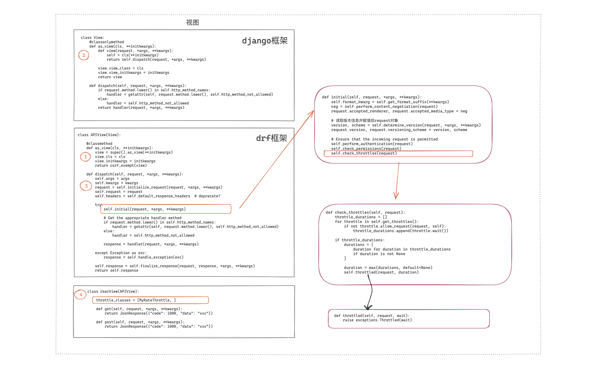
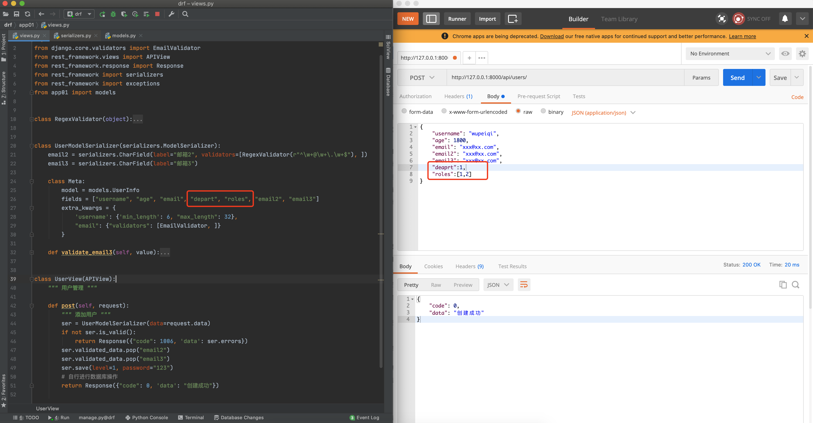
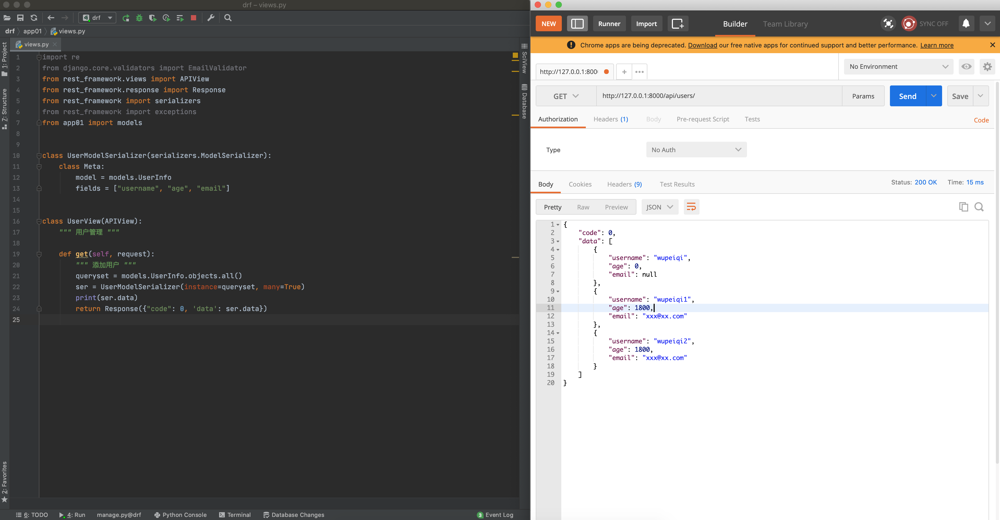
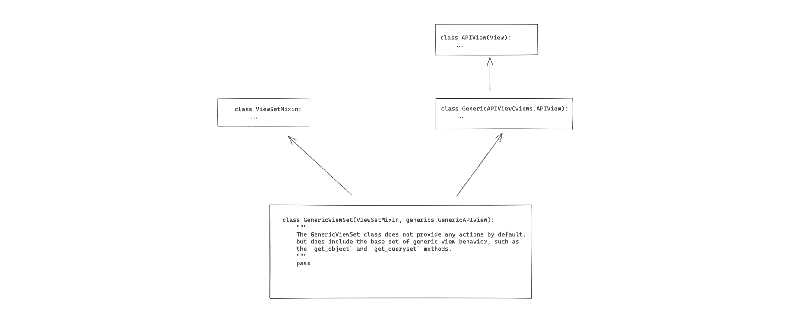
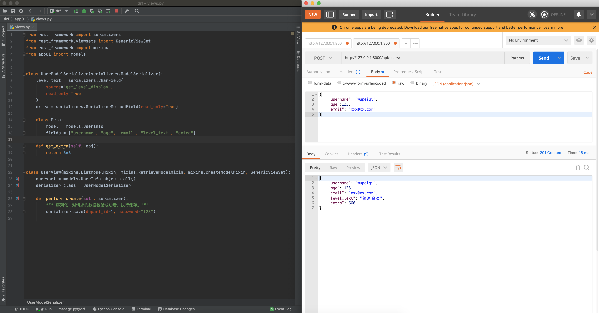
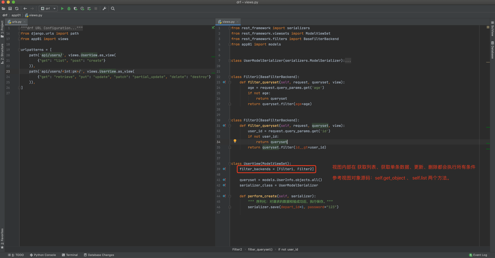

## 1.4 django restframework（中）

drf内置了很多便捷的功能，在接下来的课程中会给大家依次讲解下面的内容：

- 快速上手
- 请求的封装
- 版本管理
- 认证
- 权限
- **限流**
- **序列化**
- **视图**
- **条件搜索**
- 分页
- 路由
- 解析器


### 6. 限流

限流，限制用户访问频率，例如：用户1分钟最多访问100次 或者 短信验证码一天每天可以发送50次， 防止盗刷。

- 对于匿名用户，使用用户IP作为唯一标识。
- 对于登录用户，使用用户ID或名称作为唯一标识。

```python
缓存={
	用户标识：[12:33,12:32,12:31,12:30,12,]    1小时/5次   12:34   11:34
{
```

```
pip3 install django-redis
```

```python
# settings.py
CACHES = {
    "default": {
        "BACKEND": "django_redis.cache.RedisCache",
        "LOCATION": "redis://127.0.0.1:6379",
        "OPTIONS": {
            "CLIENT_CLASS": "django_redis.client.DefaultClient",
            "PASSWORD": "qwe123",
        }
    }
}
```


```python
CACHES = {
    "default": {
        "BACKEND": "django_redis.cache.RedisCache",
        "LOCATION": "redis://127.0.0.1:6379",
        "OPTIONS": {
            "CLIENT_CLASS": "django_redis.client.DefaultClient",
            "PASSWORD": "qwe123",
        }
    }
}
```

```python
from django.urls import path, re_path
from app01 import views

urlpatterns = [
    path('api/order/', views.OrderView.as_view()),
]
```

```python
# views.py

from rest_framework.views import APIView
from rest_framework.response import Response
from rest_framework import exceptions
from rest_framework import status
from rest_framework.throttling import SimpleRateThrottle
from django.core.cache import cache as default_cache


class ThrottledException(exceptions.APIException):
    status_code = status.HTTP_429_TOO_MANY_REQUESTS
    default_code = 'throttled'


class MyRateThrottle(SimpleRateThrottle):
    cache = default_cache  # 访问记录存放在django的缓存中（需设置缓存）
    scope = "user"  # 构造缓存中的key
    cache_format = 'throttle_%(scope)s_%(ident)s'

    # 设置访问频率，例如：1分钟允许访问10次
    # 其他：'s', 'sec', 'm', 'min', 'h', 'hour', 'd', 'day'
    THROTTLE_RATES = {"user": "10/m"}

    def get_cache_key(self, request, view):
        if request.user:
            ident = request.user.pk  # 用户ID
        else:
            ident = self.get_ident(request)  # 获取请求用户IP（去request中找请求头）

        # throttle_u # throttle_user_11.11.11.11ser_2

        return self.cache_format % {'scope': self.scope, 'ident': ident}

    def throttle_failure(self):
        wait = self.wait()
        detail = {
            "code": 1005,
            "data": "访问频率限制",
            'detail': "需等待{}s才能访问".format(int(wait))
        }
        raise ThrottledException(detail)


class OrderView(APIView):
    throttle_classes = [MyRateThrottle, ]

    def get(self, request):
        return Response({"code": 0, "data": "数据..."})
```


**多个限流类**

本质，每个限流的类中都有一个 `allow_request` 方法，此方法内部可以有三种情况：

- 返回True，表示当前限流类允许访问，继续执行后续的限流类。
- 返回False，表示当前限流类不允许访问，继续执行后续的限流类。所有的限流类执行完毕后，读取所有不允许的限流，并计算还需等待的时间。
- 抛出异常，表示当前限流类不允许访问，后续限流类不再执行。


**全局配置**

```python
REST_FRAMEWORK = {
    "DEFAULT_THROTTLE_CLASSES":["xxx.xxx.xx.限流类", ],
    "DEFAULT_THROTTLE_RATES": {
        "user": "10/m",
        "xx":"100/h"
    }
}
```

**底层源码实现：**




```python
# settings.py

...
CACHES = {
    "default": {
        "BACKEND": "django_redis.cache.RedisCache",
        "LOCATION": "redis://127.0.0.1:6379",
        "OPTIONS": {
            "CLIENT_CLASS": "django_redis.client.DefaultClient",
            "PASSWORD": "qwe123",
        }
    }
}
```

```python
# urls.py

from django.urls import path, re_path, include
from app01 import views

urlpatterns = [
    path('api/order/', views.OrderView.as_view()),
]
```

```python
# views.py

from rest_framework.views import APIView
from rest_framework.response import Response
from rest_framework import exceptions
from rest_framework import status
from rest_framework.throttling import SimpleRateThrottle
from django.core.cache import cache as default_cache


class ThrottledException(exceptions.APIException):
    status_code = status.HTTP_429_TOO_MANY_REQUESTS
    default_code = 'throttled'


class MyRateThrottle(SimpleRateThrottle):
    cache = default_cache  # 访问记录存放在django的缓存中（需设置缓存）
    scope = "user"  # 构造缓存中的key
    cache_format = 'throttle_%(scope)s_%(ident)s'

    # 设置访问频率，例如：1分钟允许访问10次
    # 其他：'s', 'sec', 'm', 'min', 'h', 'hour', 'd', 'day'
    THROTTLE_RATES = {"user": "10/m"}

    def get_cache_key(self, request, view):
        if request.user:
            ident = request.user.pk  # 用户ID
        else:
            ident = self.get_ident(request)  # 获取用户IP
        return self.cache_format % {'scope': self.scope, 'ident': ident}


class OrderView(APIView):
    throttle_classes = [MyRateThrottle, ]

    def get(self, request):
        return Response({"code": 0, "data": "数据..."})

    def throttled(self, request, wait):
        detail = {
            "code": 1005,
            "data": "访问频率",
            'detail': "需等待{}s才能访问".format(int(wait))
        }
        raise ThrottledException(detail)

```


--------


### 7. Serializer（*）

drf中为我们提供了Serializer，他主要有两大功能：

- 对请求数据校验（底层调用Django的Form和ModelForm）
- 对数据库查询到的对象进行序列化


#### 7.1.数据校验

示例1：基于Serializer：


示例2：基于ModelSerializer：

```python
# models.py

from django.db import models


class Role(models.Model):
    """ 角色表 """
    title = models.CharField(verbose_name="名称", max_length=32)


class Department(models.Model):
    """ 部门表 """
    title = models.CharField(verbose_name="名称", max_length=32)


class UserInfo(models.Model):
    """ 用户表 """
    level_choices = ((1, "普通会员"), (2, "VIP"), (3, "SVIP"),)
    level = models.IntegerField(verbose_name="级别", choices=level_choices, default=1)

    username = models.CharField(verbose_name="用户名", max_length=32)
    password = models.CharField(verbose_name="密码", max_length=64)
    age = models.IntegerField(verbose_name="年龄", default=0)
    email = models.CharField(verbose_name="邮箱", max_length=64)
    token = models.CharField(verbose_name="TOKEN", max_length=64, null=True, blank=True)

    # 外键
    depart = models.ForeignKey(verbose_name="部门", to="Department", on_delete=models.CASCADE)
    
    # 多对多
    roles = models.ManyToManyField(verbose_name="角色", to="Role")

```


*提示：save方法会返回新生成的数据对象。*


示例3：基于ModelSerializer（含FK+M2M）：



*提示：save方法会返回新生成的数据对象。*


#### 7.2 序列化

通过ORM从数据库获取到的 QuerySet 或 对象 均可以被序列化为 json 格式数据。

```python
# models.py

from django.db import models


class Role(models.Model):
    """ 角色表 """
    title = models.CharField(verbose_name="名称", max_length=32)


class Department(models.Model):
    """ 部门表 """
    title = models.CharField(verbose_name="名称", max_length=32)


class UserInfo(models.Model):
    """ 用户表 """
    level_choices = ((1, "普通会员"), (2, "VIP"), (3, "SVIP"),)
    level = models.IntegerField(verbose_name="级别", choices=level_choices, default=1)

    username = models.CharField(verbose_name="用户名", max_length=32)
    password = models.CharField(verbose_name="密码", max_length=64)
    age = models.IntegerField(verbose_name="年龄", default=0)
    email = models.CharField(verbose_name="邮箱", max_length=64, null=True, blank=True)
    token = models.CharField(verbose_name="TOKEN", max_length=64, null=True, blank=True)

    depart = models.ForeignKey(verbose_name="部门", to="Department", on_delete=models.CASCADE, null=True, blank=True)
    roles = models.ManyToManyField(verbose_name="角色", to="Role")
```


示例1：序列化基本字段



```python
# 切记， 如果从数据库获取的不是QuerySet对象，而是单一对象，例如：
data_object = modes.UserInfo.objects.filter(id=2).first()
ser = UserModelSerializer(instance=data_object,many=False)
print(ser.data)
```


示例2：自定义字段


示例3：序列化类的嵌套


#### 7.3 数据校验&序列化

上述示例均属于单一功能（要么校验，要么序列化），其实当我们编写一个序列化类既可以做数据校验，也可以做序列化，例如：


```python
# models.py

from django.db import models


class Role(models.Model):
    """ 角色表 """
    title = models.CharField(verbose_name="名称", max_length=32)


class Department(models.Model):
    """ 部门表 """
    title = models.CharField(verbose_name="名称", max_length=32)


class UserInfo(models.Model):
    """ 用户表 """
    level_choices = ((1, "普通会员"), (2, "VIP"), (3, "SVIP"),)
    level = models.IntegerField(verbose_name="级别", choices=level_choices, default=1)

    username = models.CharField(verbose_name="用户名", max_length=32)
    password = models.CharField(verbose_name="密码", max_length=64)
    age = models.IntegerField(verbose_name="年龄", default=0)
    email = models.CharField(verbose_name="邮箱", max_length=64, null=True, blank=True)
    token = models.CharField(verbose_name="TOKEN", max_length=64, null=True, blank=True)

    depart = models.ForeignKey(verbose_name="部门", to="Department", on_delete=models.CASCADE, null=True, blank=True)
    roles = models.ManyToManyField(verbose_name="角色", to="Role")

```


```python
# urls.py

from django.urls import path, re_path, include
from app01 import views

urlpatterns = [
    path('api/users/', views.UserView.as_view()),
]

```

```python
# views.py

from django.core.validators import EmailValidator
from rest_framework.views import APIView
from rest_framework.response import Response
from rest_framework import serializers

from app01 import models


class DepartModelSerializer(serializers.ModelSerializer):
    class Meta:
        model = models.Department
        fields = ['id', "title"]
        extra_kwargs = {
            "id": {"read_only": False},  # 数据验证
            "title": {"read_only": True}  # 序列化
        }


class RoleModelSerializer(serializers.ModelSerializer):
    class Meta:
        model = models.Role
        fields = ['id', "title"]
        extra_kwargs = {
            "id": {"read_only": False},  # 数据验证
            "title": {"read_only": True}  # 序列化
        }


class UserModelSerializer(serializers.ModelSerializer):
    level_text = serializers.CharField(source="get_level_display", read_only=True)

    # Serializer嵌套，不是read_only，一定要自定义create和update，自定义新增和更新的逻辑。
    depart = DepartModelSerializer(many=False)
    roles = RoleModelSerializer(many=True)

    extra = serializers.SerializerMethodField(read_only=True)
    email2 = serializers.EmailField(write_only=True)

    # 数据校验：username、email、email2、部门、角色信息
    class Meta:
        model = models.UserInfo
        fields = [
            "username", "age", "email", "level_text", "depart", "roles", "extra", "email2"
        ]
        extra_kwargs = {
            "age": {"read_only": True},
            "email": {"validators": [EmailValidator, ]},
        }

    def get_extra(self, obj):
        return 666

    def validate_username(self, value):
        return value

    # 新增加数据时
    def create(self, validated_data):
        """ 如果有嵌套的Serializer，在进行数据校验时，只有两种选择：
              1. 将嵌套的序列化设置成 read_only
              2. 自定义create和update方法，自定义新建和更新的逻辑
            注意：用户端提交数据的格式。
        """
        depart_id = validated_data.pop('depart')['id']

        role_id_list = [ele['id'] for ele in validated_data.pop('roles')]

        # 新增用户表
        validated_data['depart_id'] = depart_id
        user_object = models.UserInfo.objects.create(**validated_data)

        # 在用户表和角色表的关联表中添加对应关系
        user_object.roles.add(*role_id_list)

        return user_object


class UserView(APIView):
    """ 用户管理 """

    def get(self, request):
        """ 添加用户 """
        queryset = models.UserInfo.objects.all()
        ser = UserModelSerializer(instance=queryset, many=True)
        return Response({"code": 0, 'data': ser.data})

    def post(self, request):
        """ 添加用户 """
        ser = UserModelSerializer(data=request.data)
        if not ser.is_valid():
            return Response({'code': 1006, 'data': ser.errors})

        ser.validated_data.pop('email2')

        instance = ser.save(age=18, password="123", depart_id=1)

        # 新增之后的一个对象（内部调用UserModelSerializer进行序列化）
        print(instance)
        # ser = UserModelSerializer(instance=instance, many=False)
        # ser.data

        return Response({'code': 0, 'data': ser.data})

```


**底层源码实现：**

序列化的底层源码实现有别于上述其他的组件，序列化器相关类的定义和执行都是在视图中被调用的，所以源码的分析过程可以分为：定义类、序列化、数据校验。

源码1：序列化过程


源码2：数据校验过程


### 8. 视图

#### 8.1 APIView

- View，django
- APIView，drf，在请求到来时，新增了：免除csrf、请求封装、版本、认证、权限、限流的功能。

```python
class GenericAPIView(APIView):
    pass # 10功能

class GenericViewSet(xxxx.View-2个功能, GenericAPIView):
    pass # 5功能能

class UserView(GenericViewSet):
    def get(self,request):
        pass
```

`APIView`是drf中 “顶层” 的视图类，在他的内部主要实现drf基础的组件的使用，例如：版本、认证、权限、限流等。

```python
# urls.py

from django.urls import path, re_path, include
from app01 import views

urlpatterns = [
    path('api/users/', views.UserView.as_view()),
    path('api/users/<int:pk>/', views.UserDetailView.as_view()),
]
```

```python
# views.py

from rest_framework.views import APIView
from rest_framework.response import Response

class UserView(APIView):
    
    # 认证、权限、限流等
    
    def get(self, request):
		# 业务逻辑：查看列表
        return Response({"code": 0, 'data': "..."})

    def post(self, request):
        # 业务逻辑：新建
        return Response({'code': 0, 'data': "..."})
    
class UserDetailView(APIView):
    
	# 认证、权限、限流等
        
    def get(self, request,pk):
		# 业务逻辑：查看某个数据的详细
        return Response({"code": 0, 'data': "..."})

    def put(self, request,pk):
        # 业务逻辑：全部修改
        return Response({'code': 0, 'data': "..."})
    
    def patch(self, request,pk):
        # 业务逻辑：局部修改
        return Response({'code': 0, 'data': "..."})
    
    def delete(self, request,pk):
        # 业务逻辑：删除
        return Response({'code': 0, 'data': "..."})
```


#### 8.2 GenericAPIView

`GenericAPIView` 继承APIView，在APIView的基础上又增加了一些功能。例如：`get_queryset`、`get_object`等。

实际在开发中一般不会直接继承它，他更多的是担任 `中间人`的角色，为子类提供公共功能。

```python
# urls.py

from django.urls import path, re_path, include
from app01 import views

urlpatterns = [
    path('api/users/', views.UserView.as_view()),
    path('api/users/<int:pk>/', views.UserDetailView.as_view()),
]
```

```python
# views.py

from rest_framework.generics import GenericAPIView
from rest_framework.response import Response

class UserView(GenericAPIView):
    queryset = models.UserInfo.objects.filter(status=True)
    serializer_class = 序列化类
    
    def get(self, request):
        queryset = self.get_queryset()
        ser = self.get_serializer(intance=queryset,many=True)
        print(ser.data)
        return Response({"code": 0, 'data': "..."})    
```


注意：最大的意义，将数据库查询、序列化类提取到类变量中，后期再提供公共的get/post/put/delete等方法，让开发者只定义类变量，自动实现增删改查。


#### 8.3 GenericViewSet



`GenericViewSet`类中没有定义任何代码，他就是继承 `ViewSetMixin` 和 `GenericAPIView`，也就说他的功能就是将继承的两个类的功能继承到一起。

- `GenericAPIView`，将数据库查询、序列化类的定义提取到类变量中，便于后期处理。
- `ViewSetMixin`，将 get/post/put/delete 等方法映射到 list、create、retrieve、update、partial_update、destroy方法中，让视图不再需要两个类。

```python
# urls.py

from django.urls import path, re_path, include
from app01 import views

urlpatterns = [
    path('api/users/', views.UserView.as_view({"get":"list","post":"create"})),
    path('api/users/<int:pk>/', views.UserView.as_view({"get":"retrieve","put":"update","patch":"partial_update","delete":"destory"})),
]
```

```python
# views.py

from rest_framework.viewsets import GenericViewSet
from rest_framework.response import Response

    
class UserView(GenericViewSet):
    
	# 认证、权限、限流等
    queryset = models.UserInfo.objects.filter(status=True)
    serializer_class = 序列化类
    
    def list(self, request):
		# 业务逻辑：查看列表
        queryset = self.get_queryset()
        ser = self.get_serializer(intance=queryset,many=True)
        print(ser.data)
        return Response({"code": 0, 'data': "..."})

    def create(self, request):
        # 业务逻辑：新建
        return Response({'code': 0, 'data': "..."})
    
    def retrieve(self, request,pk):
		# 业务逻辑：查看某个数据的详细
        return Response({"code": 0, 'data': "..."})

    def update(self, request,pk):
        # 业务逻辑：全部修改
        return Response({'code': 0, 'data': "..."})
    
    def partial_update(self, request,pk):
        # 业务逻辑：局部修改
        return Response({'code': 0, 'data': "..."})
    
    def destory(self, request,pk):
        # 业务逻辑：删除
        return Response({'code': 0, 'data': "..."})
```


注意：开发中一般也很少直接去继承他，因为他也属于是 `中间人`类，在原来 `GenericAPIView` 基础上又增加了一个映射而已。


#### 8.4 五大类

在drf的为我们提供好了5个用于做 增、删、改（含局部修改）、查列表、查单个数据的5个类（需结合 `GenericViewSet` 使用）。

```python
# urls.py

from django.urls import path, re_path, include
from app01 import views

urlpatterns = [
    path('api/users/', views.UserView.as_view({"get":"list","post":"create"})),
    path('api/users/<int:pk>/', views.UserView.as_view({"get":"retrieve","put":"update","patch":"partial_update","delete":"destroy"})),
]
```

```python
# views.py

from rest_framework.viewsets import GenericViewSet
from rest_framework.mixins import (
    ListModelMixin, CreateModelMixin, RetrieveModelMixin, UpdateModelMixin,
    DestroyModelMixin, ListModelMixin
)

class UserView(CreateModelMixin,RetrieveModelMixin, UpdateModelMixin, DestroyModelMixin,ListModelMixin,GenericViewSet):
    
	# 认证、权限、限流等
    queryset = models.UserInfo.objects.filter(status=True)
    serializer_class = 序列化类
```


在这个5个类中已帮我们写好了 `list`、`create`、`retrieve`、`update`、`partial_update`、`destory` 方法，我们只需要在根据写 类变量：queryset、serializer_class即可。

**示例1：**


```python
# urls.py

from django.urls import path
from app01 import views

urlpatterns = [
    path('api/users/', views.UserView.as_view({"get": "list"})),
    path('api/users/<int:pk>/', views.UserView.as_view({"get": "retrieve"})),
]
```

```python
# views.py

from rest_framework import serializers
from rest_framework.viewsets import GenericViewSet
from rest_framework import mixins
from app01 import models


class UserModelSerializer(serializers.ModelSerializer):
    level_text = serializers.CharField(
        source="get_level_display",
        read_only=True
    )
    extra = serializers.SerializerMethodField(read_only=True)

    class Meta:
        model = models.UserInfo
        fields = ["username", "age", "email", "level_text", "extra"]

    def get_extra(self, obj):
        return 666


class UserView(mixins.ListModelMixin, mixins.RetrieveModelMixin, GenericViewSet):
    queryset = models.UserInfo.objects.all()
    serializer_class = UserModelSerializer
```


**示例2：**



```python
# urls.py

from django.urls import path
from app01 import views

urlpatterns = [
    path('api/users/', views.UserView.as_view({"get": "list", "post": "create"})),
    path('api/users/<int:pk>/', views.UserView.as_view({"get": "retrieve"})),
]
```

```python
# views.py

from rest_framework import serializers
from rest_framework.viewsets import GenericViewSet
from rest_framework import mixins
from app01 import models


class UserModelSerializer(serializers.ModelSerializer):
    level_text = serializers.CharField(
        source="get_level_display",
        read_only=True
    )
    extra = serializers.SerializerMethodField(read_only=True)

    class Meta:
        model = models.UserInfo
        fields = ["username", "age", "email", "level_text", "extra"]

    def get_extra(self, obj):
        return 666


class UserView(mixins.ListModelMixin, mixins.RetrieveModelMixin, mixins.CreateModelMixin, GenericViewSet):
    queryset = models.UserInfo.objects.all()
    serializer_class = UserModelSerializer

    def perform_create(self, serializer):
        """ 序列化：对请求的数据校验成功后，执行保存。"""
        serializer.save(depart_id=1, password="123")
```


**示例3：**

```python
# urls.py

from django.urls import path
from app01 import views

urlpatterns = [
    path('api/users/', views.UserView.as_view(
        {"get": "list", "post": "create"}
    )),
    path('api/users/<int:pk>/', views.UserView.as_view(
        {"get": "retrieve", "put": "update", "patch": "partial_update", "delete": "destroy"}
    )),
]

```

```python
# views.py

from rest_framework import serializers
from rest_framework.viewsets import GenericViewSet
from rest_framework import mixins
from app01 import models


class UserModelSerializer(serializers.ModelSerializer):
    level_text = serializers.CharField(
        source="get_level_display",
        read_only=True
    )
    extra = serializers.SerializerMethodField(read_only=True)

    class Meta:
        model = models.UserInfo
        fields = ["username", "age", "email", "level_text", "extra"]

    def get_extra(self, obj):
        return 666


class UserView(mixins.ListModelMixin,
               mixins.RetrieveModelMixin,
               mixins.CreateModelMixin,
               mixins.UpdateModelMixin,
               mixins.DestroyModelMixin,
               GenericViewSet):
    queryset = models.UserInfo.objects.all()
    serializer_class = UserModelSerializer

    def perform_create(self, serializer):
        """ 序列化：对请求的数据校验成功后，执行保存。"""
        serializer.save(depart_id=1, password="123")
	
	def perform_update(self, serializer):
        serializer.save()
        
    def perform_destroy(self, instance):
        instance.delete()
```


**示例4：**

```python
# urls.py

from django.urls import path
from app01 import views

urlpatterns = [
    path('api/users/', views.UserView.as_view(
        {"get": "list", "post": "create"}
    )),
    path('api/users/<int:pk>/', views.UserView.as_view(
        {"get": "retrieve", "put": "update", "patch": "partial_update", "delete": "destroy"}
    )),
]

```

```python
# views.py
from rest_framework import serializers
from rest_framework.viewsets import ModelViewSet
from app01 import models


class UserModelSerializer(serializers.ModelSerializer):
    level_text = serializers.CharField(
        source="get_level_display",
        read_only=True
    )
    extra = serializers.SerializerMethodField(read_only=True)

    class Meta:
        model = models.UserInfo
        fields = ["username", "age", "email", "level_text", "extra"]

    def get_extra(self, obj):
        return 666


class UserView(ModelViewSet):
    queryset = models.UserInfo.objects.all()
    serializer_class = UserModelSerializer

    def perform_create(self, serializer):
        """ 序列化：对请求的数据校验成功后，执行保存。"""
        serializer.save(depart_id=1, password="123")
```


在开发过程中使用 `五大类` 或 `ModelViewSet` 是比较常见的，并且如果他们内部的某些功能不够用，还可以进行重新某些方法进行扩展。


问题：drf中提供了这么多视图，以后那个用的比较多？

- 接口与数据库操作无关，直接继承APIView

- 接口背后需要对数据库进行操作，一般：`ModelViewSet` 或 `CreateModelMixin、ListModelMixin...`

  ```
  - 利用钩子自定义功能。
  - 重写某个写方法，实现更加完善的功能。
  ```

- 根据自己公司的习惯，自定义 ：`ModelViewSet` 或 `CreateModelMixin、ListModelMixin...`


### 补充：权限

在之前定义权限类时，类中可以定义两个方法：`has_permission` 和 `has_object_permission` 

- `has_permission` ，在请求进入视图之前就会执行。
- `has_object_permission`，当视图中调用 `self.get_object`时就会被调用（删除、更新、查看某个对象时都会调用），一般用于检查对某个对象是否具有权限进行操作。

```python
class PermissionA(BasePermission):
    message = {"code": 1003, 'data': "无权访问"}

    def has_permission(self, request, view):
        exists = request.user.roles.filter(title="员工").exists()
        if exists:
            return True
        return False

    def has_object_permission(self, request, view, obj):
        return True
```


所以，让我们在编写视图类时，如果是直接获取间接继承了 GenericAPIView，同时内部调用 `get_object`方法，这样在权限中通过 `has_object_permission` 就可以进行权限的处理。


### 9. 条件搜索

如果某个API需要传递一些条件进行搜索，其实就在是URL后面通过GET传参即可，例如：

```
/api/users?age=19&category=12
```

在drf中也有相应组件可以支持条件搜索。

#### 9.1 自定义Filter



```python
# urls.py

from django.urls import path
from app01 import views

urlpatterns = [
    path('api/users/', views.UserView.as_view(
        {"get": "list", "post": "create"}
    )),
    path('api/users/<int:pk>/', views.UserView.as_view(
        {"get": "retrieve", "put": "update", "patch": "partial_update", "delete": "destroy"}
    )),
]
```

```python
# views.py

from rest_framework import serializers
from rest_framework.viewsets import ModelViewSet
from rest_framework.filters import BaseFilterBackend
from app01 import models


class UserModelSerializer(serializers.ModelSerializer):
    level_text = serializers.CharField(
        source="get_level_display",
        read_only=True
    )
    extra = serializers.SerializerMethodField(read_only=True)

    class Meta:
        model = models.UserInfo
        fields = ["username", "age", "email", "level_text", "extra"]

    def get_extra(self, obj):
        return 666


class Filter1(BaseFilterBackend):
    def filter_queryset(self, request, queryset, view):
        age = request.query_params.get('age')
        if not age:
            return queryset
        return queryset.filter(age=age)


class Filter2(BaseFilterBackend):
    def filter_queryset(self, request, queryset, view):
        user_id = request.query_params.get('id')
        if not user_id:
            return queryset
        return queryset.filter(id__gt=user_id)


class UserView(ModelViewSet):
    filter_backends = [Filter1, Filter2]

    queryset = models.UserInfo.objects.all()
    serializer_class = UserModelSerializer

    def perform_create(self, serializer):
        """ 序列化：对请求的数据校验成功后，执行保存。"""
        serializer.save(depart_id=1, password="123")
```


#### 9.2 第三方Filter

在drf开发中有一个常用的第三方过滤器：DjangoFilterBackend。

```
pip install django-filter
```

注册app：

```python
INSTALLED_APPS = [
    ...
    'django_filters',
    ...
]
```

视图配置和应用（示例1）：

```python
# views.py
from rest_framework import serializers
from rest_framework.viewsets import ModelViewSet
from django_filters.rest_framework import DjangoFilterBackend
from app01 import models


class UserModelSerializer(serializers.ModelSerializer):
    level_text = serializers.CharField(
        source="get_level_display",
        read_only=True
    )
    extra = serializers.SerializerMethodField(read_only=True)

    class Meta:
        model = models.UserInfo
        fields = ["username", "age", "email", "level_text", "extra"]

    def get_extra(self, obj):
        return 666


class UserView(ModelViewSet):
    filter_backends = [DjangoFilterBackend, ]
    filterset_fields = ["id", "age", "email"]

    queryset = models.UserInfo.objects.all()
    serializer_class = UserModelSerializer

    def perform_create(self, serializer):
        """ 序列化：对请求的数据校验成功后，执行保存。"""
        serializer.save(depart_id=1, password="123")

```


视图配置和应用（示例2）：

```python
from rest_framework import serializers
from rest_framework.viewsets import ModelViewSet
from django_filters.rest_framework import DjangoFilterBackend
from django_filters import FilterSet, filters
from app01 import models


class UserModelSerializer(serializers.ModelSerializer):
    level_text = serializers.CharField(
        source="get_level_display",
        read_only=True
    )
    depart_title = serializers.CharField(
        source="depart.title",
        read_only=True
    )
    extra = serializers.SerializerMethodField(read_only=True)

    class Meta:
        model = models.UserInfo
        fields = ["id", "username", "age", "email", "level_text", "extra", "depart_title"]

    def get_extra(self, obj):
        return 666


class MyFilterSet(FilterSet):
    depart = filters.CharFilter(field_name="depart__title", lookup_expr="exact")
    min_id = filters.NumberFilter(field_name='id', lookup_expr='gte')

    class Meta:
        model = models.UserInfo
        fields = ["min_id", "depart"]


class UserView(ModelViewSet):
    filter_backends = [DjangoFilterBackend, ]
    filterset_class = MyFilterSet

    queryset = models.UserInfo.objects.all()
    serializer_class = UserModelSerializer

    def perform_create(self, serializer):
        """ 序列化：对请求的数据校验成功后，执行保存。"""
        serializer.save(depart_id=1, password="123")

```


视图配置和应用（示例3）：

```python
from rest_framework import serializers
from rest_framework.viewsets import ModelViewSet
from django_filters.rest_framework import DjangoFilterBackend, OrderingFilter
from django_filters import FilterSet, filters
from app01 import models


class UserModelSerializer(serializers.ModelSerializer):
    level_text = serializers.CharField(
        source="get_level_display",
        read_only=True
    )
    depart_title = serializers.CharField(
        source="depart.title",
        read_only=True
    )
    extra = serializers.SerializerMethodField(read_only=True)

    class Meta:
        model = models.UserInfo
        fields = ["id", "username", "age", "email", "level_text", "extra", "depart_title"]

    def get_extra(self, obj):
        return 666


class MyFilterSet(FilterSet):
    # /api/users/?min_id=2  -> id>=2
    min_id = filters.NumberFilter(field_name='id', lookup_expr='gte')

    # /api/users/?name=wupeiqi  -> not ( username=wupeiqi )
    name = filters.CharFilter(field_name="username", lookup_expr="exact", exclude=True)

    # /api/users/?depart=xx     -> depart__title like %xx%
    depart = filters.CharFilter(field_name="depart__title", lookup_expr="contains")

    # /api/users/?token=true      -> "token" IS NULL
    # /api/users/?token=false     -> "token" IS NOT NULL
    token = filters.BooleanFilter(field_name="token", lookup_expr="isnull")

    # /api/users/?email=xx     -> email like xx%
    email = filters.CharFilter(field_name="email", lookup_expr="startswith")

    # /api/users/?level=2&level=1   -> "level" = 1 OR "level" = 2（必须的是存在的数据，否则报错-->内部有校验机制）
    # level = filters.AllValuesMultipleFilter(field_name="level", lookup_expr="exact")
    level = filters.MultipleChoiceFilter(field_name="level", lookup_expr="exact", choices=models.UserInfo.level_choices)

    # /api/users/?age=18,20     -> age in [18,20]
    age = filters.BaseInFilter(field_name='age', lookup_expr="in")

    # /api/users/?range_id_max=10&range_id_min=1    -> id BETWEEN 1 AND 10
    range_id = filters.NumericRangeFilter(field_name='id', lookup_expr='range')

    # /api/users/?ordering=id     -> order by id asc
    # /api/users/?ordering=-id     -> order by id desc
    # /api/users/?ordering=age     -> order by age asc
    # /api/users/?ordering=-age     -> order by age desc
    ordering = filters.OrderingFilter(fields=["id", "age"])

    # /api/users/?size=1     -> limit 1（自定义搜索）
    size = filters.CharFilter(method='filter_size', distinct=False, required=False)
    
    class Meta:
        model = models.UserInfo
        fields = ["id", "min_id", "name", "depart", "email", "level", "age", 'range_id', "size", "ordering"]

    def filter_size(self, queryset, name, value):
        int_value = int(value)
        return queryset[0:int_value]


class UserView(ModelViewSet):
    filter_backends = [DjangoFilterBackend, ]
    filterset_class = MyFilterSet

    queryset = models.UserInfo.objects.all()
    serializer_class = UserModelSerializer

    def perform_create(self, serializer):
        """ 序列化：对请求的数据校验成功后，执行保存。"""
        serializer.save(depart_id=1, password="123")

```

`lookup_expr`有很多常见选择：

```python
'exact': _(''),
'iexact': _(''),

'contains': _('contains'),
'icontains': _('contains'),
'startswith': _('starts with'),
'istartswith': _('starts with'),
'endswith': _('ends with'),  
'iendswith': _('ends with'),
    
'gt': _('is greater than'),
'gte': _('is greater than or equal to'),
'lt': _('is less than'),
'lte': _('is less than or equal to'),

'in': _('is in'),
'range': _('is in range'),
'isnull': _(''),
    
'regex': _('matches regex'),
'iregex': _('matches regex'),
```


全局配置和应用：

```python
# settings.py 全局配置

REST_FRAMEWORK = {
    'DEFAULT_FILTER_BACKENDS': ['django_filters.rest_framework.DjangoFilterBackend',]
}
```


#### 9.3 内置Filter

drf源码中内置了2个filter，分别是：

- OrderingFilter，支持排序。

  ```python
  from rest_framework import serializers
  from rest_framework.viewsets import ModelViewSet
  from app01 import models
  from rest_framework.filters import OrderingFilter
  
  
  class UserModelSerializer(serializers.ModelSerializer):
      level_text = serializers.CharField(
          source="get_level_display",
          read_only=True
      )
      depart_title = serializers.CharField(
          source="depart.title",
          read_only=True
      )
      extra = serializers.SerializerMethodField(read_only=True)
  
      class Meta:
          model = models.UserInfo
          fields = ["id", "username", "age", "email", "level_text", "extra", "depart_title"]
  
      def get_extra(self, obj):
          return 666
  
  
  class UserView(ModelViewSet):
      filter_backends = [OrderingFilter, ]
      # ?order=id
      # ?order=-id
      # ?order=age
      ordering_fields = ["id", "age"]
  
      queryset = models.UserInfo.objects.all()
      serializer_class = UserModelSerializer
  
      def perform_create(self, serializer):
          """ 序列化：对请求的数据校验成功后，执行保存。"""
          serializer.save(depart_id=1, password="123")
  ```

- SearchFilter，支持模糊搜索。

  ```python
  from rest_framework import serializers
  from rest_framework.viewsets import ModelViewSet
  from app01 import models
  from rest_framework.filters import SearchFilter
  
  
  class UserModelSerializer(serializers.ModelSerializer):
      level_text = serializers.CharField(
          source="get_level_display",
          read_only=True
      )
      depart_title = serializers.CharField(
          source="depart.title",
          read_only=True
      )
      extra = serializers.SerializerMethodField(read_only=True)
  
      class Meta:
          model = models.UserInfo
          fields = ["id", "username", "age", "email", "level_text", "extra", "depart_title"]
  
      def get_extra(self, obj):
          return 666
  
  
  class UserView(ModelViewSet):
      # ?search=武沛%齐
      filter_backends = [SearchFilter, ]
      search_fields = ["id", "username", "age"]
  
      queryset = models.UserInfo.objects.all()
      serializer_class = UserModelSerializer
  
      def perform_create(self, serializer):
          """ 序列化：对请求的数据校验成功后，执行保存。"""
          serializer.save(depart_id=1, password="123")
  
  ```
  
  ```python
  "app01_userinfo"."id" LIKE %武沛齐% ESCAPE '\' 
  OR 
  "app01_userinfo"."username" LIKE %武沛齐% ESCAPE '\' 
  OR 
  "app01_userinfo"."age" LIKE %武沛齐% ESCAPE '\'
  ```
  
  


