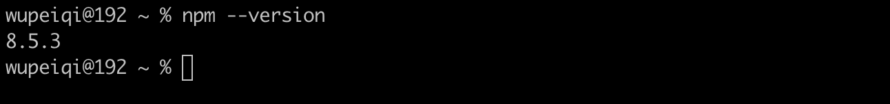
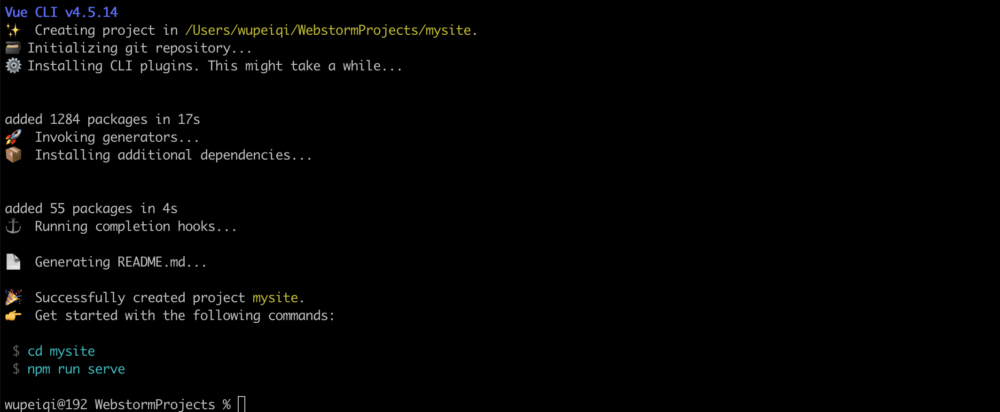
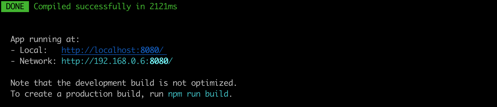
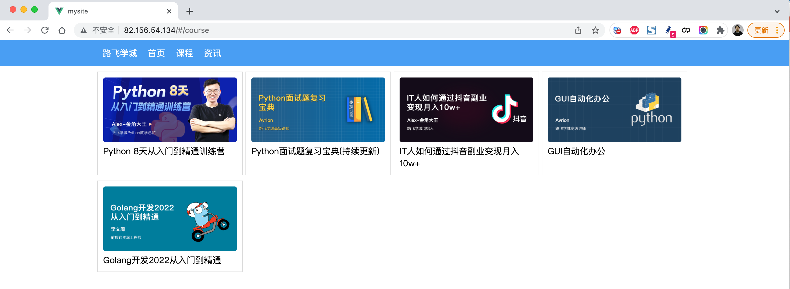

## 5.脚手架

基于vue+vue-router单文件开发，可以完成小规模的页面的开发，但如果项目大+组件多+依赖多，开发起来就非常不方便。

此时，脚手架（vue cli - Vue Command Line Interface ）是一个基于 Vue.js 进行快速开发的完整系统。

```
官方的说法：
Vue CLI 致力于将 Vue 生态中的工具基础标准化。它确保了各种构建工具能够基于智能的默认配置即可平稳衔接，这样你可以专注在撰写应用上，而不必花好几天去纠结配置的问题。
```

```
通俗的说法：
他帮助我们构内置了很多组件来帮助我们更便捷的的开发vue.js项目。
```


### 5.1 安装

- 第一步：安装node.js

  ```
  Vue CLI 4.x+ 需要 Node.js v8.9 或更高版本 (推荐 v10 以上)。
  
  https://nodejs.org/en/download/
  ```

  

  ```
  =======如果想要更新node.js的版本=======
  
  1.先查看本机node.js版本：
  	node -v
  	
  2.清除node.js的cache：
  	sudo npm cache clean -f
  
  3.安装 n 工具，这个工具是专门用来管理node.js版本的，别怀疑这个工具的名字，是他是他就是他，他的名字就是 "n"
  	sudo npm install -g n
  
  4.安装最新版本的node.js
  	sudo n stable
  
  5.再次查看本机的node.js版本：
  	node -v
  ```

- 第二步：关于npm

  ```
  安装上node之后，自带了npm包管理工具，类似于Python中的pip。
  
  如果想要更新npm到最新版，可以执行命令：
  	sudo npm install npm@latest -g
  ```

  

- 第三步：npm淘宝源，以后基于npm安装包就会快了（相当于豆瓣的pip源）

  ```
  npm config set registry https://registry.npm.taobao.org
  ```

- 第四步：全局安装vue-cli

  ```
  # 安装（最新版）
  sudo npm install -g @vue/cli
  
  # 安装（指定版本）
  sudo npm install -g @vue/cli@4.5.14
  
  # 卸载
  sudo npm uninstall -g @vue/cli
  ```

  


### 5.2 创建项目

```
cd /Users/wupeiqi/WebstormProjects
vue create mysite
```


提示：babel是一个将ES6语法转化成ES5的工具，eslint是做语法检查。


a few moments later...



按照提示执行如下命令，脚手架就会给我们大家一个Web服务去运行编写的vue项目（便于开发测试）。

```
cd mysite
npm run serve
```




### 5.3 编译部署

项目创建完，脚手架会默认会生成如下文件（包含项目依赖、配置文件、默认代码）。


如果以后项目开发完毕，想要进行项目部署，是不需要这些文件的，执行命令：

```
cd 项目目录
npm run build
```


build会将项目中的依赖和代码自动编译成HTML、CSS、JavaScript代码，后续只需要将此代码上传至服务器部署即可。


### 5.4 目录结构

```
- babel.config.js      babel是ES6转换ES5的组件，这是他所需的配置文件（一般不需要动）。
- package.json         项目所需的包的版本信息。
- package-lock.json    保存项目所需的包细节以及包的依赖等信息。
- node-modules         项目安装依赖包的文件保存的地方。例如：npm install axios 
                       axios包会保存在此目录、信息也会写在 package.json、package-lock.json中   
- src
	- main.js          项目的启动 npm run serve ，用户访问时程序的入门。
	- App.vue		   主组件
	- components       子组件
	- assets           静态文件（自己的静态文件，会被压缩和合并）
- public		      【此目录下的文件直接被复制到dist/目录下，一般放不动的数据，引入第三方】
	- index.html       主HTML文件（模板引擎）
	- favicon.icon     图标
- README.md            项目说明文档
```

```
cd 项目
npm install
```

本质上，其实就是将原来的代码做了拆分来进行开发，开发完毕之后再编译整合起来。

```html
<!DOCTYPE html>
<html lang="en">
<head>
    <meta charset="UTF-8">
    <title>Title</title>
    <script src="https://cdn.jsdelivr.net/npm/vue@2/dist/vue.js"></script>
</head>
<body>

<div id="app">
    <h1>欢迎学习Vue.js</h1>
    <div>我叫{{name}}，微信{{wechat}}</div>
</div>

<script>
    
    
    var app = new Vue({
        el: '#app',
        data: {
            name: '武沛齐',
            wechat: 'wupeiqi888'
        },
        methods: {
            clickMe: function () {
                this.name = "alex";
                this.wechat = "wupeiqi666";
            }
        }
    })
</script>
</body>
</html>
```


### 5.5 快速上手


#### 5.5.1 axios组件

安装：

```
cd 项目目录
npm install axios
npm install vue-axios
```

导入：

```
import Vue from 'vue'
import axios from 'axios'
import VueAxios from 'vue-axios'

Vue.use(VueAxios, axios)
```

使用：

```
Vue.axios.get(api).then((response) => {
  console.log(response.data)
})

this.axios.get(api).then((response) => {
  console.log(response.data)
})

this.$http.get(api).then((response) => {
  console.log(response.data)
})
```


#### 5.5.2 vue-router组件

安装：

```
cd 项目目录
npm install vue-router@3 
```

引入：

```javascript
// router/index.js

import Vue from 'vue'
import VueRouter from 'vue-router'


import Home from '../components/Home'


Vue.use(VueRouter)

const router = new VueRouter({
    routes: [
        {
            path: '/home',
            name: "Home",
            component: Home
        },
    ]
})

export default router
```

```javascript
// main.js
import Vue from 'vue'
import axios from 'axios'
import VueAxios from 'vue-axios'


import App from './App.vue'

// 导入router文件
import router from "./router"


Vue.use(VueAxios, axios)

Vue.config.productionTip = true


new Vue({
    router: router,
    render: h => h(App),
}).$mount('#app')
```

使用：App.vue

```
<router-link to="/home">点我</router-link>
<router-view></router-view>
```


#### 5.5.3 案例：路飞学城

基于vue-cli快速开发：路飞学城（第一版）


### 5.6 线上部署

- 第一步：编译

  ```
  npm run build
  ```

- 第二步：将编译后的代码dist文件上传到服务器（阿里云、腾讯云）

  

- 第三步：安装nginx + 配置 + 启动

  ```
  yum install nginx
  ```


  vim /etc/nginx/nginx.conf

  ```
  user nginx;
  worker_processes auto;
  error_log /var/log/nginx/error.log;
  pid /run/nginx.pid;
  
  # Load dynamic modules. See /usr/share/doc/nginx/README.dynamic.
  include /usr/share/nginx/modules/*.conf;
  
  events {
      worker_connections 1024;
  }
  
  http {
      log_format  main  '$remote_addr - $remote_user [$time_local] "$request" '
                        '$status $body_bytes_sent "$http_referer" '
                        '"$http_user_agent" "$http_x_forwarded_for"';
  
      access_log  /var/log/nginx/access.log  main;
  
      sendfile            on;
      tcp_nopush          on;
      tcp_nodelay         on;
      keepalive_timeout   65;
      types_hash_max_size 4096;
  
      include             /etc/nginx/mime.types;
      default_type        application/octet-stream;
  
      include /etc/nginx/conf.d/*.conf;
  
      server {
          listen       80;
          listen       [::]:80;
          server_name  _;
          # 项目目录
          root         /data/mysite;
  
          # Load configuration files for the default server block.
          include /etc/nginx/default.d/*.conf;
  
          error_page 404 /404.html;
          location = /404.html {
          }
  
          error_page 500 502 503 504 /50x.html;
          location = /50x.html {
          }
      }
  
  
  }
  ```

  ```
  >>>systemctl start nginx
  ```

- 第四步：访问
  


## 6.vuex

Vuex 是一个专为 Vue.js 应用程序开发的**状态管理模式**。它采用集中式存储管理应用的所有组件的状态，并以相应的规则保证状态以一种可预测的方式发生变化。

说人话：将组件中需要共享的数据交给vuex来帮我们进行管理，例如：用户登录状态、加入购物车。


### 6.1 案例：登录

```
vue create vxdemo
```

```
npm install vue-router@3
```

```
npm install vuex@3
```


- main.js

  ```javascript
  import Vue from 'vue'
  import App from './App.vue'
  import router from "./router"
  import store from "./store"
  
  Vue.config.productionTip = false
  
  new Vue({
      router: router,
      store: store,
      render: h => h(App),
  }).$mount('#app')
  ```

- App.vue

  ```vue
  <template>
      <div id="app">
          <div class="menu">
              <div class="container">
                  <router-link to="/home">首页</router-link>
                  <router-link to="/course">课程</router-link>
  
                  <div style="float: right">
                      <a v-if="this.$store.state.isLogin">
                          {{this.$store.state.userInfo.username}}
                      </a>
                      <router-link v-else to="/login">登录</router-link>
  
                  </div>
              </div>
          </div>
          <div class="container">
              <router-view></router-view>
          </div>
      </div>
  </template>
  <script>
      export default {
          name: 'App',
          data() {
              return {}
          },
          components: {},
      }
  </script>
  
  <style>
      body {
          margin: 0;
      }
      .container {
          width: 1100px;
          margin: 0 auto;
      }
      .menu {
          height: 48px;
          background-color: #499ef3;
          line-height: 48px;
  
      }
      .menu a {
          color: white;
          text-decoration: none;
          padding: 0 10px;
      }
  </style>
  ```

- store/index.js

  ```javascript
  import Vue from 'vue'
  import Vuex from 'vuex'
  
  Vue.use(Vuex)
  
  
  export default new Vuex.Store({
      state: {
          isLogin: false, //是否登录
          userInfo: null //用户信息
      },
      mutations: {
          login: function (state, info) {
              state.userInfo = info;
              state.isLogin = true;
          },
  
      },
      actions: {}
  })
  
  ```

- router/index.js

  ```javascript
  // router/index.js
  
  import Vue from 'vue'
  import VueRouter from 'vue-router'
  
  
  import Home from '../components/Home'
  import Course from '../components/Course'
  import Login from '../components/Login'
  
  
  Vue.use(VueRouter)
  
  const router = new VueRouter({
      routes: [
          {
              path: '/home',
              name: "Home",
              component: Home
          },
          {
              path: '/course',
              name: "Course",
              component: Course
          },
          {
              path: '/login',
              name: "Login",
              component: Login
          },
      ]
  })
  
  export default router
  ```

- components/Login.vue

  ```html
  <template>
      <div>
          <input type="text" v-model="info.username" placeholder="用户名">
          <input type="password" v-model="info.password" placeholder="密码">
          <input type="button" value="登录" @click="doLogin"/>
      </div>
  </template>
  
  <script>
      export default {
          name: "Login",
          data() {
              return {
                  info: {
                      username: "",
                      password: ""
                  }
              }
          },
          methods: {
              doLogin: function () {
                  // 1.用户登录
                  this.$store.commit('login', this.info);
                  // 2.登录成功修改状态
                  this.$router.push({name: 'Home'});
              }
          }
      }
  </script>
  
  <style scoped>
  
  </style>
  ```


### 6.2 关于computed属性

在vue的组件中有一个computed属性（计算属性），监听关联的数据，如果发生变化则重新计算并显示。

```html
<template>
    <div>
        <h1>主页 {{v1}} {{ v2}}</h1>
        
        <div>总数：{{totalData}}</div>
        <input type="button" value="点我" @click="addData"/>
    </div>
</template>

<script>
    export default {
        name: "Home",
        data() {
            return {
                v1: 123,
                v2: 456
            }
        },
        computed: {
            totalData: {
                get() {
                    let data = this.v1 + this.v2;
                    return data + 1000;
                },
                set(value) {
                    this.v1 = value;
                }
            }
        },
        methods: {
            addData() {
                this.totalData = 999;
                // this.v2 = 1000;
            }
        }
    }
</script>

<style scoped>

</style>
```


所以，上述案例也可以用computed属性来实现，例如：App.vue改成：

```html
<template>
    <div id="app">
        <div class="menu">
            <div class="container">
                <router-link to="/home">首页</router-link>
                <router-link to="/course">课程</router-link>

                <div style="float: right">
                    <a v-if="userState">
                        {{userName}}
                    </a>
                    <router-link v-else to="/login">登录</router-link>

                </div>
            </div>
        </div>
        <div class="container">
            <router-view></router-view>
        </div>
    </div>
</template>

<script>

    export default {
        name: 'App',
        data() {
            return {}
        },
        computed: {
            userState: {
                get() {
                    return this.$store.state.isLogin;
                }
            },
            userName() {
                return this.$store.state.userInfo.username;
            },

        },
        components: {},
    }
</script>

<style>
    body {
        margin: 0;
    }

    .container {
        width: 1100px;
        margin: 0 auto;
    }

    .menu {
        height: 48px;
        background-color: #499ef3;
        line-height: 48px;

    }

    .menu a {
        color: white;
        text-decoration: none;
        padding: 0 10px;
    }


</style>
```


### 6.3 案例：购物车


### 6.4 关于Action

Action 类似于 mutation，不同在于：

- Action 提交的是 mutation，而不是直接变更状态。
- Action 可以包含任意异步操作。

代码示例：

```javascript
const store = createStore({
  state: {
    count: 0
  },
  mutations: {
    increment (state) {
      state.count+=1;
    }
  },
  actions: {
    increment (context) {
        // 触发mutations
      	context.commit('increment')
    }
  }
})
```

在组件中如果要触发，则应该执行：

```javascript
this.$store.dispatch('increment')
```


这就有点像脱裤子放屁，意义何在呢？ 当有异步操作时，应该使用action、而不是mutation，例如：

```javascript
import Vue from 'vue'
import Vuex from 'vuex'

Vue.use(Vuex)


export default new Vuex.Store({
    state: {
        isLogin: false, //是否登录
        userInfo: null, //用户信息
        carNumber: 0,
        xxxxx: 10
    },
    mutations: {
        login: function (state, info) {
            state.userInfo = info;
            state.isLogin = true;
        },
        addCar: function (state) {
            state.carNumber += 1;
        },
        fetchAsync: function (state) {
            // ajax
            setTimeout(function () {
                state.xxxxx += 1;
            }, 1000);
        }

    },
    actions: {}
})

```

```
this.$store.commit("fetchAsync");
```

从效果上看是没有问题的，但是通过开发者工具就会发现，监测到的state的数据不准确。


所以，这种情况可以选择用Action。

```javascript
import Vue from 'vue'
import Vuex from 'vuex'

Vue.use(Vuex)


export default new Vuex.Store({
    state: {
        isLogin: false, //是否登录
        userInfo: null, //用户信息
        carNumber: 0,
        xxxxx: 10
    },
    mutations: {
        login: function (state, info) {
            state.userInfo = info;
            state.isLogin = true;
        },
        addCar: function (state) {
            state.carNumber += 1;
        },
        fetchAsync: function (state,data) {
            state.xxxxx += 1;
            console.log(data);
        }

    },
    actions: {
        fetchAsync: function (context,data) {
            setTimeout(function () {
                context.commit("fetchAsync",data);
            }, 1000);
        }
    }
})

```

再触发时，调用：

```
this.$store.dispatch('fetchAsync',{ amount: 10})
```


## 7.flex布局

在CSS3中flex可以非常便捷的可以帮助我们实现对页面的布局。

- 传统的页面布局，基于div+float来实现。
- flex可以快速实现页面的布局（很方便）。


关于flex布局你必须要了解的有一下几点：

```html
<div class="menu" 样式>
    <div class="item" 样式>112</div>
    <div class="item">113</div>
</div>
```

### 7.1 容器

#### 7.1.1 flex布局

在容器元素上应用

```
<div class="menu">
    <div class="item">112</div>
    <div class="item">113</div>
</div>

<style>
    .menu{
        border: 1px solid red;
        width: 500px;
        display: flex;         // 表示flex布局
    }
</style>
```


#### 7.1.2 元素的方向（主轴和副轴）

```
<div class="menu">
    <div class="item">112</div>
    <div class="item">113</div>
</div>
<style>
    .menu{
        border: 1px solid red;
        width: 500px;
        
        display: flex;         // 表示flex布局
        flex-direction: row;   // 主轴是横向，副轴是纵向。
    }
</style>
```


#### 7.1.3 元素排列方式

```
justify-content，主轴上的元素的排列方式
align-items，副轴上的元素的排列方式。
```

示例1： 

```
<div class="menu">
    <div class="item">11</div>
    <div class="item">112</div>
    <div class="item">112</div>
</div>
<style>
    .menu {
        width: 500px;
        border: 1px solid red;
        display: flex;

        flex-direction: row;
        justify-content: flex-start;     /* 主轴=横向，横向从左开始 */
        justify-content: flex-end;       /* 主轴=横向，横向从右开始 */
        justify-content: space-between;   /* 主轴=横向，左右定格，中间元素等分空白 */
        justify-content: space-around;   /* 主轴=横向，所有元素等分空白 */
        justify-content: space-evenly;   /* 主轴=横向，元素间距一样 */
    }

    .item {
        border: 1px solid green;
        padding: 5px 50px;
        height: 50px;
        width: 40px;
    }
</style>
```

示例2： 

```
<div class="menu">
    <div class="item">11</div>
    <div class="item">112</div>
    <div class="item">112</div>
</div>
<style>
    .menu {
        width: 500px;
        height: 300px;
        border: 1px solid red;
        display: flex;

        flex-direction: row;
        justify-content: flex-start;     /* 主轴=横向，横向从左开始 */
        justify-content: flex-end;       /* 主轴=横向，横向从右开始 */
        justify-content: space-between;   /* 主轴=横向，左右定格，中间元素等分空白 */
        justify-content: space-around;   /* 主轴=横向，所有元素等分空白 */
        justify-content: space-evenly;   /* 主轴=横向，元素间距一样 */

        align-items: center;             /* 副轴=纵向，元素居中*/
        align-items: flex-start;         /* 副轴=纵向，元素顶部*/
        align-items: flex-end;           /* 副轴=纵向，元素底部*/
    }

    .item {
        border: 1px solid green;
        padding: 5px 50px;
        height: 50px;
        width: 40px;
    }
</style>
```


#### 7.1.4 换行

- `flex-wrap: nowrap;` 元素超过容器，不换行
- `flex-wrap: wrap;` 元素超过容器，换行


示例1：不换行


```
<div class="menu">
    <div class="item">11</div>
    <div class="item">112</div>
    <div class="item">112</div>
    <div class="item">112</div>
    <div class="item">112</div>
</div>
<style>
    .menu {
        width: 500px;
        height: 200px;
        border: 1px solid red;
        display: flex;

        flex-direction: row;
        justify-content: space-evenly;   /* 主轴=横向，元素间距一样 */
        align-items: flex-start;         /* 副轴=纵向，元素顶部*/

        flex-wrap: nowrap;

    }

    .item {
        border: 1px solid green;
        padding: 5px 50px;
        height: 50px;
        width: 40px;
    }
</style>
```


示例2：换行


```
<div class="menu">
    <div class="item">111</div>
    <div class="item">112</div>
    <div class="item">112</div>
    <div class="item">112</div>
    <div class="item">112</div>

</div>

<style>
    body{
        margin: 0;
    }
    .menu {
        width: 500px;
        height: 200px;
        border: 1px solid red;
        display: flex;

        flex-direction: row;
        justify-content: space-evenly;   /* 主轴=横向，元素间距一样 */
        align-items: flex-start;         /* 副轴=纵向，元素顶部*/

        flex-wrap: wrap;

    }

    .item {
        border: 1px solid green;
        padding: 5px 50px;
        height: 50px;
        width: 40px;
    }
</style>
```


#### 7.1.5 多行对齐方式

**align-content**用于控制多行元素的对齐方式，如果元素只有一行则不会起作用；默认stretch，即在元素没设置高度，或高度为auto情况下让元素填满整个容器。

```
flex-start | flex-end | center | space-between | space-around | space-evenly | stretch(默认);
```


### 7.2 元素

#### 7.2.1 顺序

order，默认0，用于决定项目排列顺序，数值越小，项目排列越靠前。


```
<div class="father">
    <div class="son" style="order: 2">11</div>
    <div class="son" style="order: 0">22</div>
    <div class="son" style="order: 1">33</div>
</div>

<style scoped>
    .father {
        border: 1px solid red;
        width: 500px;
        height: 300px;
        display: flex;
        flex-direction: row;
        justify-content: flex-start;
    }

    .father .son {
        border: 1px solid saddlebrown;
        width: 20px;
        height: 18px;
    }
</style>
```


#### 7.2.2 剩余空间

flex-grow，默认0，用于决定项目在有剩余空间的情况下是否放大，默认不放大；


```
<div class="father">
    <div class="son">11</div>
    <div class="son" style="flex-grow: 1">22</div>
    <div class="son" style="flex-grow: 1">33</div>
</div>
```


### 案例：flex页面布局


```
<template>
    <div>
        <div class="row1">
            <div class="company"></div>
            <div class="pic"></div>
            <div class="pic"></div>
            <div class="pic"></div>
        </div>
        <div class="row2">
            <div class="title">
                <div>手机</div>
                <div>查看更多</div>
            </div>
            <div class="pic-list">
                <div class="big"></div>
                <div class="right-list">
                    <div class="group">
                        <div class="phone"></div>
                        <div class="phone"></div>
                        <div class="phone"></div>
                        <div class="phone"></div>
                    </div>
                    <div class="group">
                        <div class="phone"></div>
                        <div class="phone"></div>
                        <div class="phone"></div>
                        <div class="phone"></div>
                    </div>

                </div>
            </div>
        </div>

        <div class="course-list">
            <div class="item"></div>
            <div class="item"></div>
            <div class="item"></div>
            <div class="item"></div>
            <div class="item"></div>

        </div>
    </div>
</template>

<script>
    export default {
        name: "Mi"
    }
</script>

<style scoped>
    .row1 {
        display: flex;
        flex-direction: row;
        justify-content: space-between;
    }

    .row1 .company {
        width: 210px;
        height: 180px;
        background-color: saddlebrown;
    }

    .row1 .pic {
        width: 266px;
        height: 180px;
        background-color: cadetblue;
    }

    .row2 .title {
        display: flex;
        flex-direction: row;
        justify-content: space-between;
    }

    .row2 .pic-list {
        display: flex;
        flex-direction: row;
        justify-content: space-between;
    }

    .row2 .pic-list .big {
        background-color: aquamarine;
        height: 610px;
        width: 210px;
        margin-right: 20px;
    }

    .row2 .pic-list .right-list {
        /*background-color: antiquewhite;*/
        flex-grow: 1;
    }

    .row2 .pic-list .right-list .group {


        display: flex;
        flex-direction: row;
        justify-content: space-between;
        flex-wrap: wrap;
    }

    .row2 .pic-list .right-list .phone {
        margin-bottom: 10px;
        border: 1px solid red;
        width: 200px;
        height: 300px;
    }

    .course-list {
        display: flex;
        justify-content: space-between;
        flex-wrap: wrap;
    }

    .course-list .item {
        width: 24%;
        height: 100px;
        background-color: skyblue;
        margin-top: 15px;
    }
	
	// 如果最后一个元素，是第3个，右边距=一个位置 + 所有空白位置/3（有三个空白位置）
    .course-list .item:last-child:nth-child(4n - 1) {
        margin-right: calc(24% + 4% / 3);
    }

	// 如果最后一个元素，是第2个，右边距=两个位置 + 所有空白位置/3*2（有三个空白位置）
    .course-list .item:last-child:nth-child(4n - 2) {
        margin-right: calc(48% + 8% / 3);
    }
</style>
```


至此，结合以上的知识点，我们就可以来开发一个项目，但很多的页面按钮、标签、提示框等都需要自己手动，太费劲。

所以，接下来就要给大家的来聊一个UI框架 - ElementUI，他的内部提供了很多方便的样式和组件，可以加速我们开发。


## 8.ElementUI

Element，是有 饿了吗 团队开发一套为开发者、设计师和产品经理准备的基于 Vue 2.0 的组件库（也支持vue3.x）。

在他的基础上来开发，可以大大提升开发进度。


想要在项目中进行使用element-ui需要提前安装并引入。


### 8.1 引入

**方式1：**完整引入

- 安装

  ```
  cd 项目目录
  npm install element-ui
  ```

- 引入

  ```javascript
  import Vue from 'vue';
  import ElementUI from 'element-ui';
  import 'element-ui/lib/theme-chalk/index.css';
  import App from './App.vue';
  
  Vue.use(ElementUI);
  
  new Vue({
      render: h => h(App),
  }).$mount('#app')
  
  ```

- 在组件中使用

  ```html
  <el-button type="success">哈哈哈</el-button>
  ```


**方式2**：局部引入

- 安装

  ```
  cd 项目目录
  npm install element-ui
  ```

- 引入

  ```javascript
  import Vue from 'vue';
  import { Button, Select } from 'element-ui';
  import 'element-ui/lib/theme-chalk/index.css';
  import App from './App.vue';
  
  
  Vue.use(Button)
  Vue.use(Select)
  
  new Vue({
      render: h => h(App),
  }).$mount('#app')
  
  ```

- 在组件中使用

  ```html
  <el-button type="success">哈哈哈</el-button>
  ```

  完整组件名称：https://element.eleme.cn/#/zh-CN/component/quickstart


### 8.2 组件的使用

参见官方文档，在后续的项目开发中来应用并使用。


