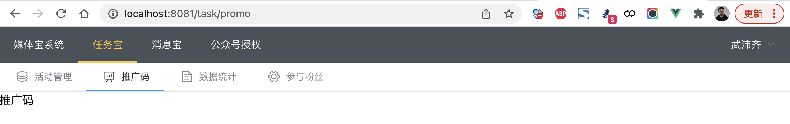
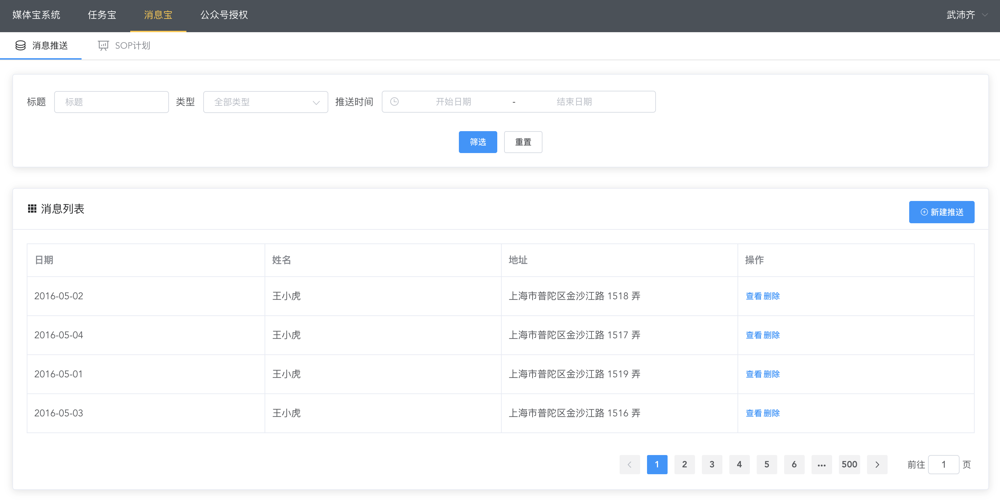
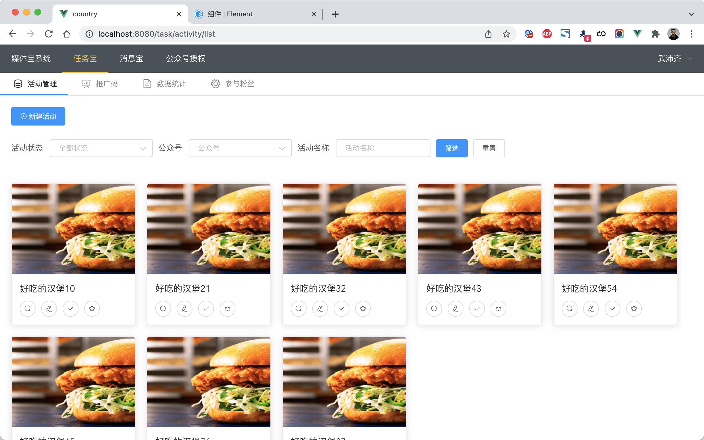
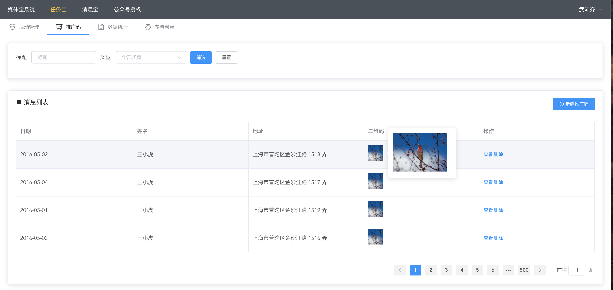
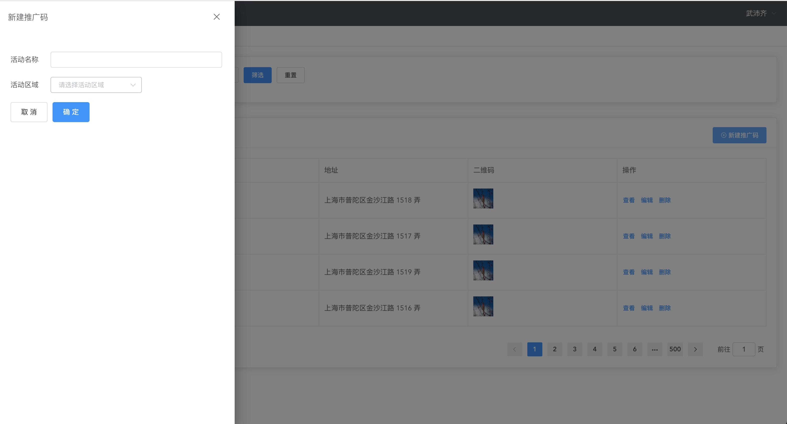
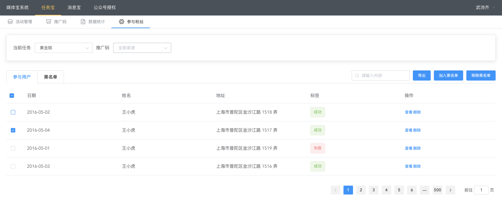

# 项目案例

结合之前学习的 vue.js、脚手架、vuex、vue-router、axios、elementui 等知识点，来开发前端项目案例（仅前端不含后端）。

此案例中的页面，其实就是后续项目的界面，后续项目开发时，直接拿来和后端API进行集成就行了。


## 1.项目搭建

其实就是将我们项目需要用到的组件都安装并配置好，需要做的事有：

- 创建项目 & 运行项目

  ```
  vue create 项目名称
  npm run serve
  ```

  ```
  WebStorm集成开发环境
  ```

- 安装和配置 vue-router

  ```
  npm install vue-router@3
  手动创建文件和配置
  ```

  ```
  vue add router
  ```

- 安装和配置 vuex

  ```
  npm install vue-vuex@3
  手动创建文件和配置
  ```

  ```
  vue add vuex
  ```

- 安装和配置 elementui

  ```
  npm install element-ui
  手动创建文件和配置
  ```

  ```
  vue add element
  ```

  

## 2.登录


## 3.路由和菜单




## 4.授权


##  5.消息宝


### 5.1 消息推送




### 5.2 SOP计划


## 6.任务宝

### 6.1 活动列表




### 6.2 新建活动


### 6.3 推广码





### 6.4 参与粉丝




### 6.5 数据统计


```
npm install highcharts-vue
```

```
import HighchartsVue from 'highcharts-vue'

Vue.use(HighchartsVue)
```

文档：https://www.highcharts.com.cn/docs/highcharts-vue


