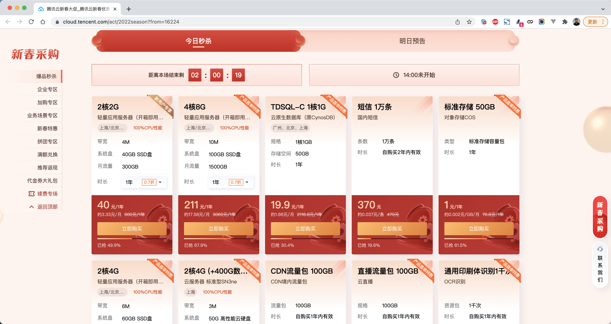
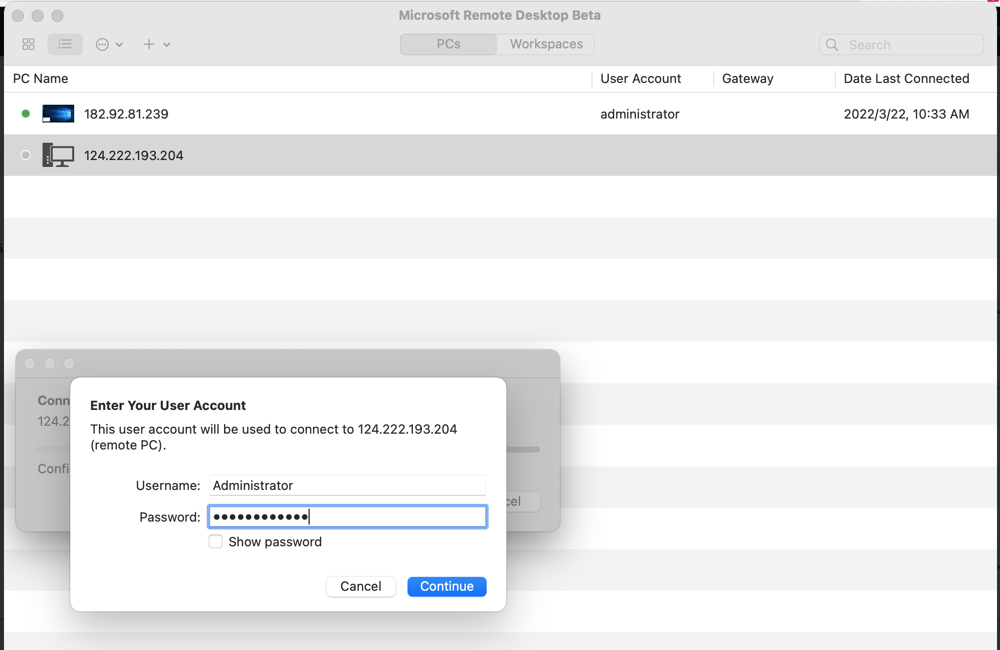
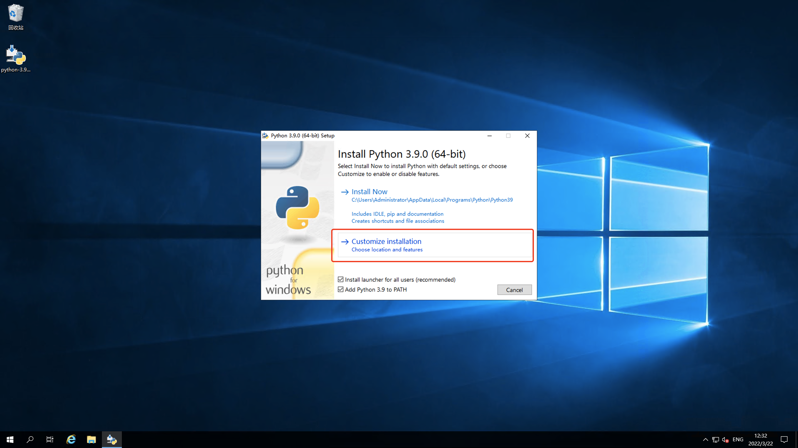
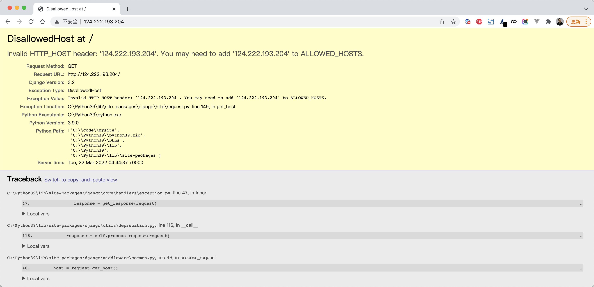
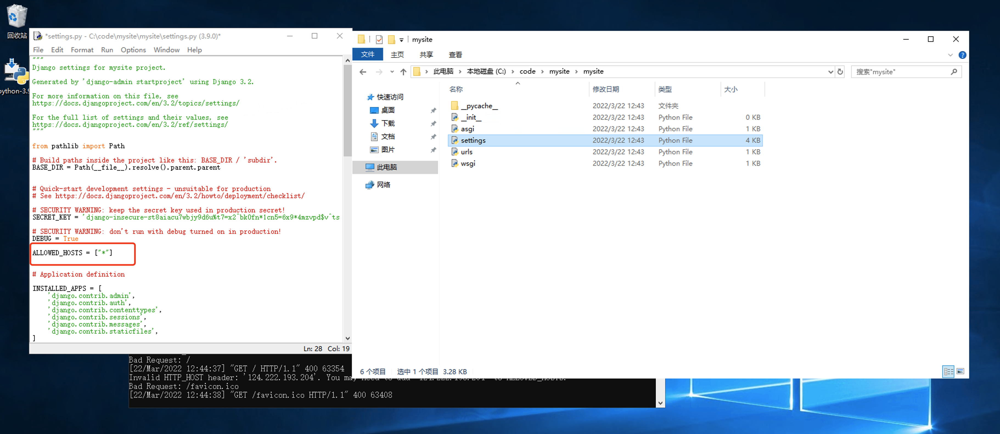
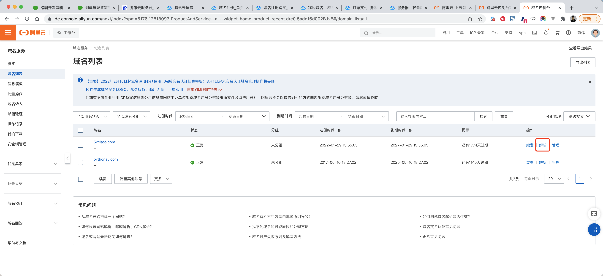
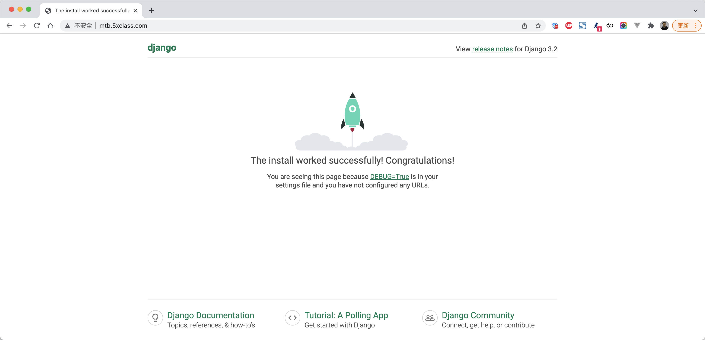
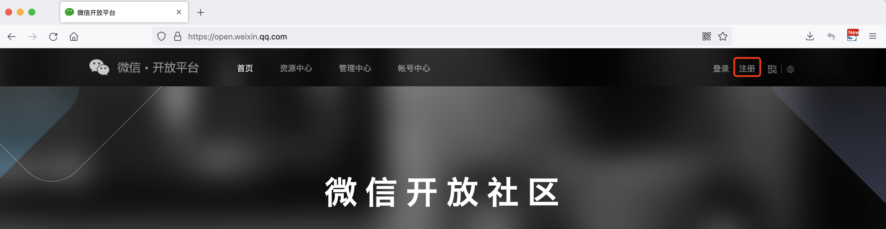
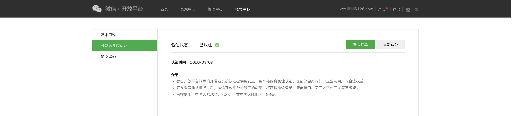

# 02 业务开发：媒体宝


媒体宝，新媒体营销平台，让平台帮你管理微信公众号，实现对粉丝、活动、消息等管理。

- 授权管理，打通平台与企业微信公众号的管理，只有授权后，平台才能接入微信，并自动化获取公众号的关注、取关、接收、发送消息等。
- 任务宝，发布微信活动任务，扫码转发并邀请好友助力，做裂变任务并配备相关奖励。
- 消息宝，基于平台实现批量的公众号消息管理，例如：消息发送、图文消息、定时任务等。


**提示**：想要开发此项目，你必须准备以下东西。

- 注册一个域名
- 购买一台云服务器，必须有公网IP（win和linux都可以）
- 将域名解析到此公网IP上
- 微信开发平台：企业的营业执照，这种平台只有企业才能申请出权限，个人不开放。
- 注册一个 **已认证的公众号** 或 **服务号**，用于自己开发测试。


## 1.服务器和域名


### 1.1 购买云服务器

自己可以去阿里云和腾讯云购买（促销活动比较便宜）

关于系统：Linux或windows，根据自己的情况去选择。




### 1.2 设置密码

设置密码，通过远程桌面连接，例如：

```
服务器公网IP：124.222.193.204
服务器账户：Administrator
服务器密码：Buxuyaomima*
```


### 1.3 远程登录

win


Mac





其实，这就相当于你有了另外一个电脑了，不过这个电脑具有外网IP，别人可以根据IP找到他。


### 1.4 Python和Django

咱们在这台服务器上安装python和django并运行起来。




创建项目并启动


外网访问：







再次启动：


### 1.4 购买域名


### 1.5 解析

就是让域名和我们刚才买的服务器绑定，以后通过域名就可以找到那台服务器，不需要再使用IP了。




解析成功后，基于域名就可以访问了。




## 2.必备物料-开放平台


### 2.1 注册开放平台

平台：https://open.weixin.qq.com/

文档：https://developers.weixin.qq.com/doc/oplatform/Third-party_Platforms/2.0/operation/open/create.html

注册微信开发者平台并填写企业资质。




### 2.2 资质认证

注册成功后需要进行开发者资质认证。





### 2.3 创建第三方平台


根据提示，按照自己的公司信息去填写即可。**注意：选择平台型服务商**


### 2.4 配置第三方平台


#### 2.4.1 公众号集权

把公众号中的所有权限打开。


#### 2.4.2 开发资料（重要）

设置好集权后，继续向下拉，就可以看到开发者资料配置。


下载校验文件（留着一会用）


## 3.必备物料-公众号

网址：https://mp.weixin.qq.com

选择：订阅号（认证）、服务号


