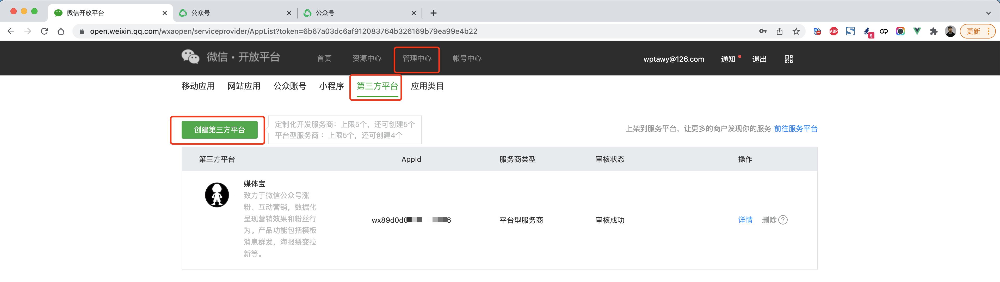
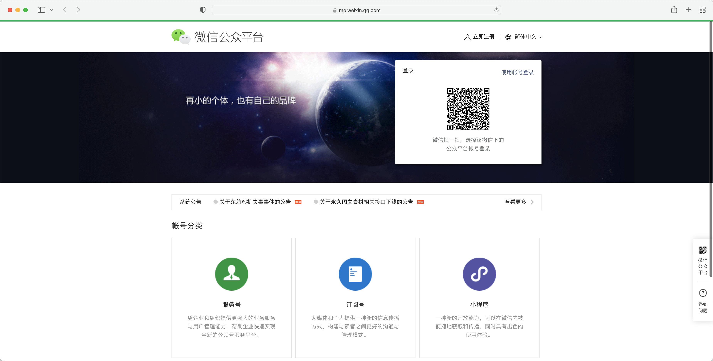

## 2.必备物料-开放平台

### 2.1 注册开放平台

平台：https://open.weixin.qq.com/

文档：https://developers.weixin.qq.com/doc/oplatform/Third-party_Platforms/2.0/operation/open/create.html

注册微信开发者平台并填写企业资质。

### 1.2 资质认证

注册成功后需要进行开发者资质认证。

### 1.3 创建第三方平台

根据提示，按照自己的公司信息去填写即可。**注意：选择平台型服务商**

### 1.4 配置第三方平台

#### 2.4.1 公众号集权

把公众号中的所有权限打开。

#### 2.4.2 开发资料（重要）

设置好集权后，继续向下拉，就可以看到开发者资料配置。

下载校验文件（留着一会用）

## 3.必备物料-公众号

网址：https://mp.weixin.qq.com

选择：订阅号（认证）、服务号

