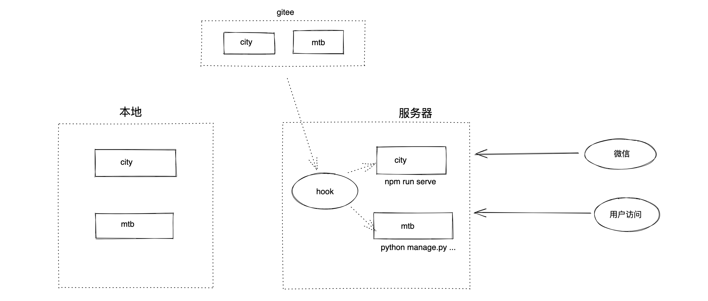
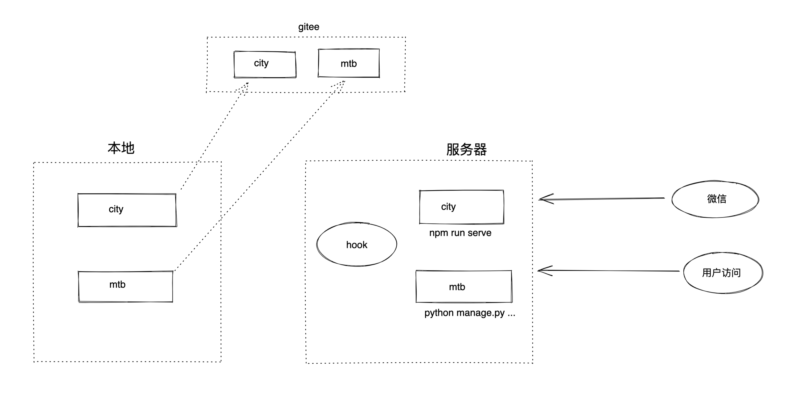
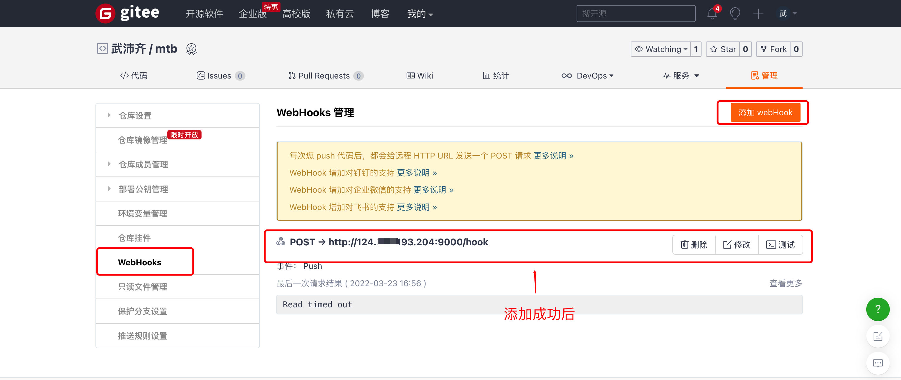
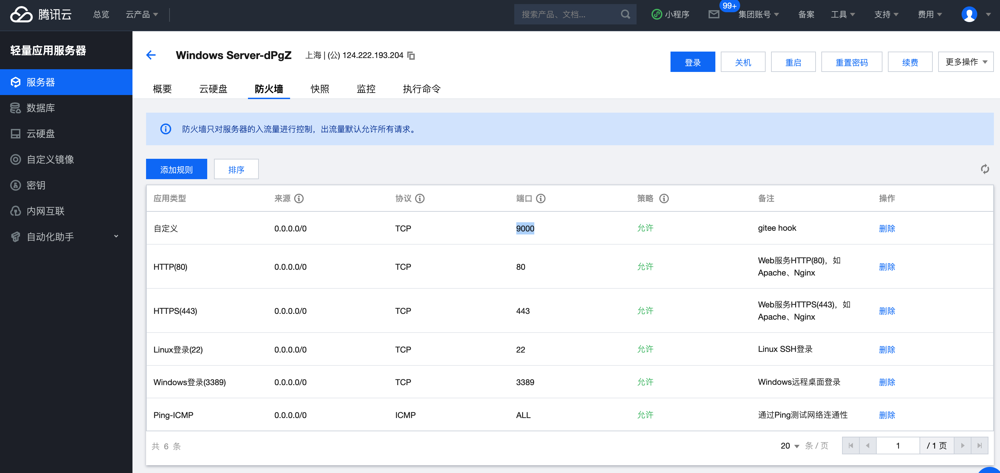

## 4.媒体宝-环境

由于代码需要放在服务器上才能让所有的功能正常运行，所以，开发测试时也需要将代码同步到服务器。可以用的代码同步方案有三种：

- 基于IDE的Deployment的功能实现
  
- 基于git + 手动pull的方案
  
- 基于git + hook + 自动git pull（模拟公司的持续集成&持续交付）
  


### 4.1 本地->Gitee



- 第一步：【本机】在自己电脑上安装git（一路next即可）

  ```
  https://git-scm.com/
  ```

- 第二步：【gitee】在gitee上注册账号并创建仓库

  - city，vue项目
  - mtb，django项目

- 第三步：【本机】将代码push到gitee仓库

  ```
  git config --global user.name "武沛齐"
  git config --global user.email "wupeiqi@live.com"
  ```

  ```
  cd 项目目录
  git init 
  git remote add origin https://gitee.com/wupeiqi/xxxxxx.git
  ```

  ```
  cd 项目目录
  git add .
  git commit -m '提交信息'
  ```

  ```
  git push origin master
  ```

  
  


### 4.2 Gitee的Hook


在gitee的项目中可以设置hook，当你向项目提交代码时，他可以自动向某个地址发送请求，表示有新代码提交了。







### 4.3 部署脚本


在服务器上基于Flask开发一个持续集成的程序，监听gitee的提交，只要提交，就在服务器上去更新项目代码。基于git去gitee拉最新代码：

```
cd 项目上级目录
git clone git项目的网址
git clone https://gitee.com/wupeiqi/mtb.git
```

```
cd 项目目录
git pull origin master
```

所以需要提前：

- 在服务器上安装git
- 在服务器上安装python + flask

基于Flask编写的部署脚本：

```python
import os
import subprocess
from flask import Flask, request

app = Flask(__name__)


@app.route("/hook", methods=["POST"])
def hook():
    repo_dict = {
        "mtb": {
            "folder": r"C:\code",
            "install": "npm install"
        },
        "city": {
            "folder": r"C:\code",
            "install": "pip3.9 install -r requirements.txt"
        }
    }
    # 项目名称：mtb  city
    repo_name = request.json['project']['path']
    # 放在服务器的那个目录？
    local_info = repo_dict.get(repo_name)
    if not local_info:
        return "error"
	# 项目的父级
    parent_folder_path = local_info['folder']
    install_command = local_info['install']
	
    # 项目的目录
    project_file_path = os.path.join(parent_folder_path, repo_name)
    
    # git仓库地址 https://gitee.com/wupeiqi/mtb.git
    git_http_url = request.json['project']['git_http_url']
    
    # 项目目录是否存在
    if not os.path.exists(project_file_path):
        # cd c:\code
        # git clone https://gitee.com/wupeiqi/mtb.git
        subprocess.check_call('git clone {}'.format(git_http_url), shell=True, cwd=parent_folder_path)
    else:
        # cd c:\code\mtb
        # git pull origin master
        subprocess.check_call('git pull origin master', shell=True, cwd=project_file_path)

    # 安装依赖包
    # cd c:\code\mtb
    # pip3.9 install -r requirements.txt
    subprocess.check_call(install_command, shell=True, cwd=project_file_path)
    return "success"


if __name__ == '__main__':
    app.run(host="0.0.0.0", port=9000, debug=True)

```

请求确保已完成的步骤：

- gitee上设置了webhook
- 服务器安全组加上了9000端口
- 服务器上已安装git
- 服务器上已安装python + node.js
- 服务器上的python已安装flask框架


### 4.4 数据库


由于我们程序组要运行在服务器上，所以MySQL必须安在服务器上，才能正常运行，所以，接下来你需要做两步：

- 服务器上安装MySQL & 创建用户 & 授权 & 创建数据库mtb

  ```sql
  create database mtb DEFAULT CHARSET utf8 COLLATE utf8_general_ci;
  
  create user mtb@'%' identified by 'root123';
  
  grant all privileges on mtb.* to 'mtb'@'%';
  
  flush privileges;
  ```

- mtb项目连接数据库配置修改 & 重新初始化数据

  ```python
  DATABASES = {
      'default': {
          'ENGINE': 'django.db.backends.mysql',
          'NAME': 'mtb',
          'USER': 'mtb',  # mtb
          'PASSWORD': 'root123',  # root123
          'HOST': '124.222.193.204',  # 124.222.193.204
          'PORT': 3306,
      }
  }
  ```

  ```
  python manage.py makemigrations
  python manage.py migrate
  ```

  

注意：在服务器的安全组中一定要打开3306端口。


### 4.5 运行&开发


环境准备好后，接下来就需要让程序运行起来并测试，后续开发只需要做到一下几点：

- 在服务器上开启部署的Hook脚本。

- 在服务器上运行起来django程序

  - 修改`ALLOWED_HOSTS = []`

    ```
    ALLOWED_HOSTS = [*]
    ```

  - 手动在服务器上runserver启动django（修改文件自动重启）

    ```
    python manage.py runserver 0.0.0.0:8000
    ```

  - 在腾讯云开启8000端口

- 在服务器上运行vue程序

  - 修改axios发送请求的地址

    ```
    127.0.0.1:xxxx  改为   124.222.193.204:8000
    ```

  - 启动vue程序

    ```
    npm run serve -- --port 80
    ```

    

后续开发时，编写 + git提交。


## 小结

以后本地只做代码的编写，想要测试看效果，就需要将代码提交到gitee，由gitee和服务器hook脚本进行代码更新，这样就可以看到同步开发效果。


**本质是：搞了一个线上开发机。**

他与公司线上服务器的正式环境不同点有：

- 线上服务器Linux操作系统              vs       windows操作系统
- 线上代码Nginx+uwsgi运行项目     vs      项目用django、npm自带的功能运行（性能差）
- 线上持续集成&交付用的jekins       vs      用自己写的hook脚本


