## 5.媒体宝-授权

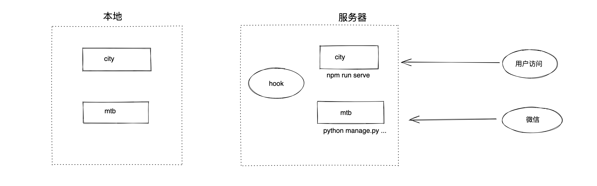

授权，让公众号的商户管理员扫码，授予我们平台来管理公众号。

从**功能**的角度来看，我们的程序需要为用户提交一个二维码页面，公众号管理员扫码授权，之后如果公众再收到消息、关注、取消关注都会向我们指定的URL发送请求，从而实现管理公众号。

从技术上，如果想要实现此功能，需要好几个步骤（主要用于去微信获取凭证、token等过程），划分为三类：

- 校验
- 授权 + 令牌
- 消息回调

-----


**校验的过程：**

- 校验，在开发平台设置时需要处理
  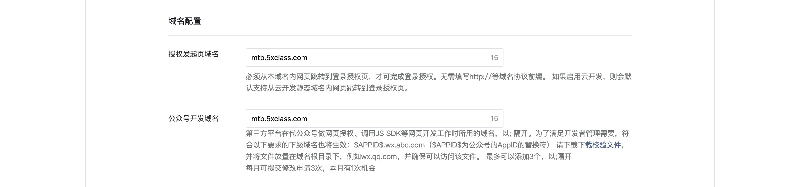

---

**授权+令牌的过程：**

- component_verify_ticket

  ```
  在第三方平台创建审核通过后，微信服务器每隔10分钟会向我们指定的接口推送一次 component_verify_ticket。
  
  component_verify_ticket有效期为12h
  
  用于获取第三方平台接口调用凭据 component_access_token 。
  ```

  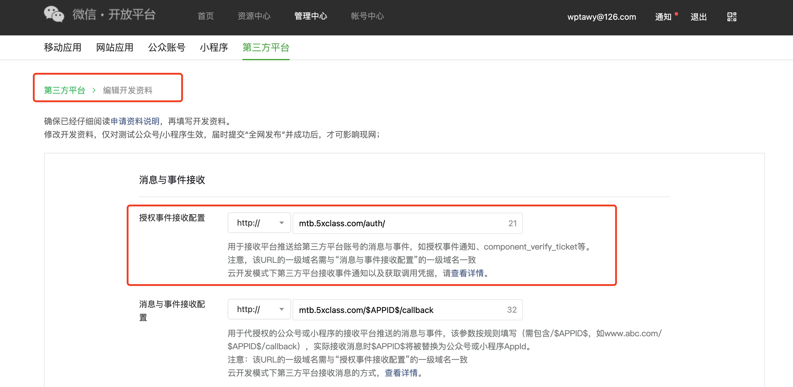

- component_access_token

  ```
  component_access_token有效期2h.
  
  当遭遇异常没有及时收到component_verify_ticket时，建议以上一次可用的component_verify_ticket继续生成component_access_token。避免出现因为 component_verify_ticket 接收失败而无法更新 component_access_token 的情况。
  ```

- pre_auth_code

  ```
  基于component_access_token生成pre_auth_code
  用于生成扫码授权二维码或者链接需要的pre_auth_code
  
  根据pre_auth_code -> 浏览器跳转
  ```

- 根据pre_auth_code生成URL，跳转到微信页面去扫码授权

  ```
  生成的URL中需要传入一个redirect_uri的参数（一个地址），用户扫码成功后会自动向此地址发请求。
  ```

- authorization_code

  ```
  扫码授权成功后，微信向redirect_uri发送请求时，会携带 authorization_code + 过期时间。
  
  注意：authorization_code是扫码后微信给我我们的。
  ```

- authorizer_access_token【调用令牌】

  ```
  获取授权码authorization_code后，可根据authorization_code去获取authorizer_access_token，例如：
  {
    "authorization_info": {
      "authorizer_appid": "wxf8b4f85f3a794e77",
      "authorizer_access_token": "QXjUqNqfYVH0yBE1iI_",
      "expires_in": 7200,
      "authorizer_refresh_token": "dTo-YCXPL4llX-u1W1pPpnp8Hgm4wpJtlR6iV0doKdY",
      "func_info":[...]
      }
  }
  
  authorizer_access_token 非常重要，后续获取公众号信息都会用到。
  
  注意：
  authorizer_access_token的有效期2小时（有限额需缓存），在过期后用authorizer_refresh_token重新去获取。
  ```

----

**消息回调的过程：**

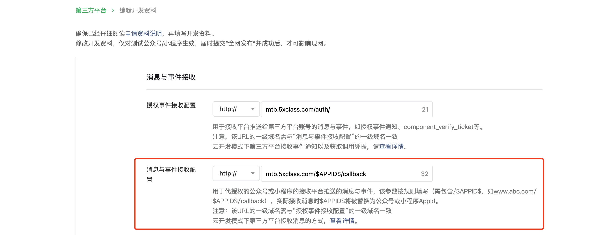


### 5.1 校验

这个其实不需要写任何代码来实现，后续再项目部署时，只需要在nginx中配置URL和内容返回即可。

正式在Linux项目部署时：


开发机服务器：

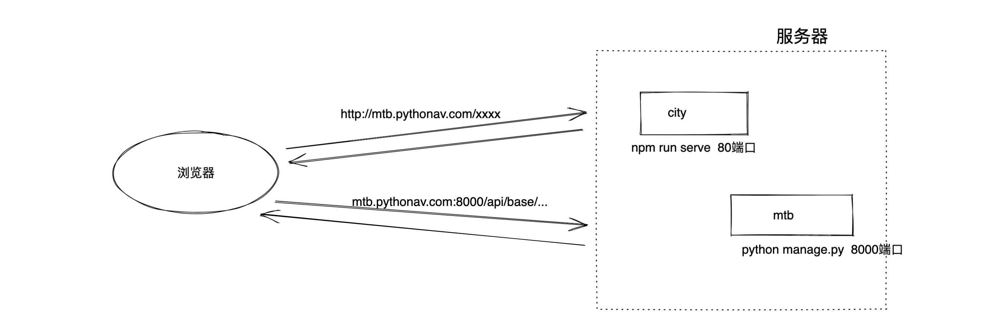

所以，在开发机搞了一个mysite。

```python
from django.urls import path, include
from apps.base.views import wx

urlpatterns = [
    path('api/base/', include('apps.base.urls')),
    path('<str:filename>.txt', wx.file_verify),
]
```

```python
from django.http import FileResponse


def file_verify(request, filename):
    file = open('4631992212.txt', 'rb')
    response = FileResponse(file)
    response['Content-Type'] = 'application/octet-stream'
    response['Content-Disposition'] = 'attachment;filename="%s.txt"' % filename
    return response
```


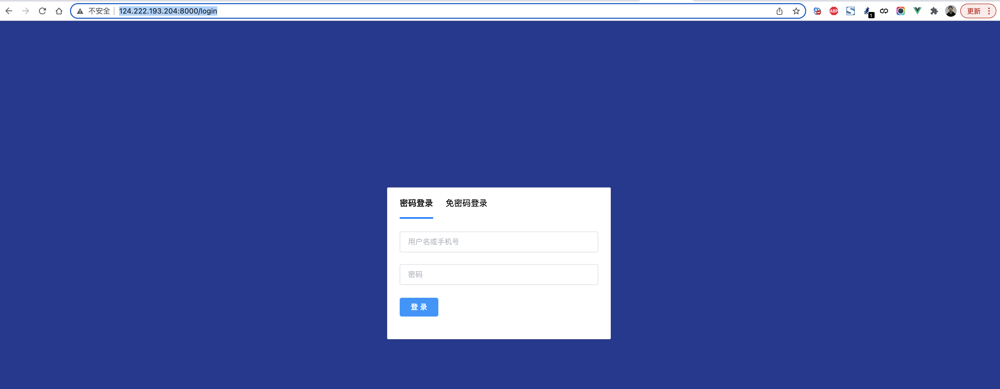


在根目录下创建文件vue.config.js，然后填入如下内容

```
module.exports = {
    devServer: {
        disableHostCheck: true,
    }
}
```


### 5.2 授权+令牌


#### 5.2.1 component_verify_ticket

在第三方平台创建审核通过后，微信服务器每隔10分钟会向我们指定的接口推送一次 component_verify_ticket（开启ticket推送）且有效期component_verify_ticket有效期为12h。

```
接收 POST 请求后，只需直接返回字符串 success。为了加强安全性，postdata 中的 xml 将使用服务申请时的加解密 key 来进行加密，具体请见《加密解密技术方案》, 在收到推送后需进行解密（详细请见《消息加解密接入指引》）。
```

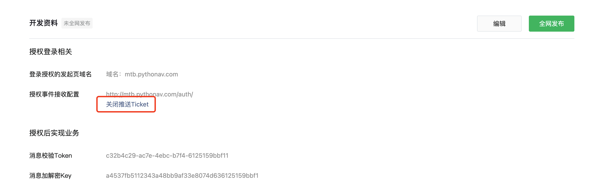

我们需要做以下几个步骤：

- 编写 `/auth/` 的地址接收推送消息（加密）
- 对推送消息解密获取 component_verify_ticket（SDK-py2 + key） 
- 将 component_verify_ticket 持久化（写入 redis 或 数据库 ）

官方文档：https://developers.weixin.qq.com/doc/oplatform/Third-party_Platforms/2.0/api/ThirdParty/token/component_verify_ticket.html


实现步骤：

- 编写URL `mtb/urls.py`

  ```
  from django.urls import path, include
  from apps.base.views import wx
  
  urlpatterns = [
      path('api/base/', include('apps.base.urls')),
      path('<str:filename>.txt', wx.file_verify),
      path('auth/', wx.component_verify_ticket),
  ]
  ```

- 编写配置 `mtb/local_settings.py`

  ```
  WX_TOKEN = "c32b4c29-ac7e-4ebc-b7f4-6125159bbf11"
  WX_KEY = "a4537fb5112343a48bb9af33e8074d636125159bbf1"
  WX_APP_ID = "wx89d0d065c7b25a06"
  WX_APP_SECRET = "e359cf673dae224e976d75d00dbec0a6"
  ```

  

  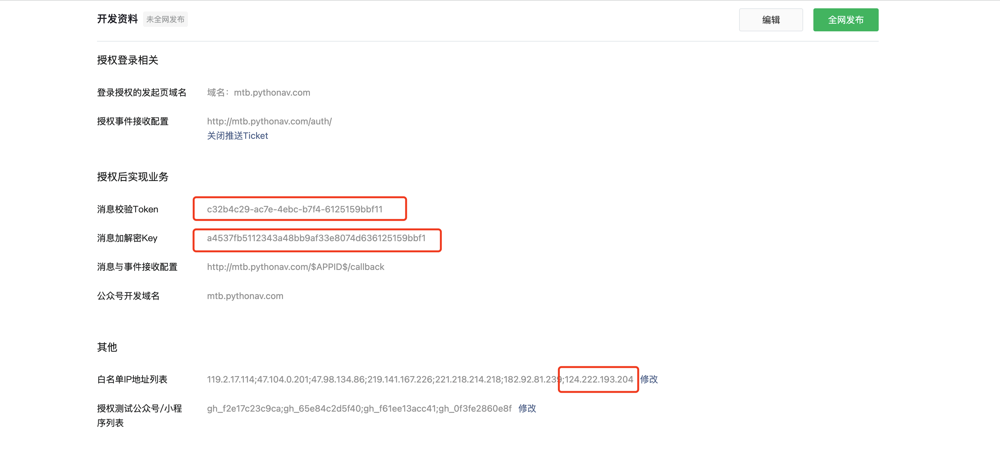

- 编写视图`apps/base/views/wx.py`

  ```
  注意：依赖微信的SDK，但是他支持py2，不支持py3（需要手动修改）
  pip install pycryptodome==3.14.1
  ```

  ```python
  import time
  import xml.etree.cElementTree as ET
  
  from django.http import FileResponse, HttpResponse
  from django.conf import settings
  from utils.wx2.WXBizMsgCrypt import WXBizMsgCrypt
  from .. import models
  
  
  def file_verify(request, filename):
      """ 文件校验 """
      file = open('4631992212.txt', 'rb')
      response = FileResponse(file)
      response['Content-Type'] = 'application/octet-stream'
      response['Content-Disposition'] = 'attachment;filename="%s.txt"' % filename
      return response
  
  
  def component_verify_ticket(request):
      """ 微信每隔10分钟以POST请求发送一次 """
      if request.method != "POST":
          return HttpResponse('error')
      # 获取请求体数据
      body = request.body.decode("utf-8")
  
      # 获取URL中的数据
      nonce = request.GET.get("nonce")
      timestamp = request.GET.get('timestamp')
      msg_sign = request.GET.get('msg_signature')
  
      # 解密
      decrypt_test = WXBizMsgCrypt(settings.WX_TOKEN, settings.WX_KEY, settings.WX_APP_ID)
      code, decrypt_xml = decrypt_test.DecryptMsg(body, msg_sign, timestamp, nonce)
  
      # code=0时 解密成功
      if code != 0:
          return HttpResponse('error')
  
      # 解析decrypt_xml，格式如下
      """
      <xml>
          <AppId><![CDATA[wx89d0d065c7b25a06]]></AppId>
          <CreateTime>1648305909</CreateTime>
          <InfoType><![CDATA[component_verify_ticket]]></InfoType>
          <ComponentVerifyTicket><![CDATA[ticket@@@fAovP2Qo9vbcdJ_O6sw6r2APV2jTQZJkeV73OBnazo6rTDhC85I8ywcY_wqXhthC5AFRNHg_aNuiAl7xljFf-w]]></ComponentVerifyTicket>
      </xml>
      """
      xml_tree = ET.fromstring(decrypt_xml)
      # 没获取节点
      verify_ticket = xml_tree.find("ComponentVerifyTicket")
      if verify_ticket is None:
          return HttpResponse('error')
      # 节点为空
      verify_ticket_text = verify_ticket.text
      if not verify_ticket_text:
          return HttpResponse('error')
  
      # 写入数据库（过期时间12h）
      period_time = int(time.time()) + 12 * 60
      models.WxCode.objects.update_or_create(defaults={"value": verify_ticket_text, "period": period_time}, code_type=1)
      return HttpResponse('success')
  ```

  

接下来，就要等待了，10分钟后会有请求发到服务器。


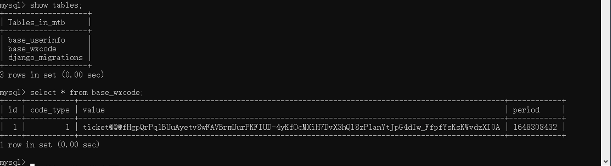


#### 5.2.2 显示二维码

点点击添加公众号后：

```
先根据 component_verify_ticket 生成 component_access_token【有效期2小时】
再根据 component_access_token  生成 pre_auth_code【有效期10分钟】
最后用 pre_auth_code 拼接一个URL，返回给前端
前端页面，获取URL再进行跳转。
```


##### 1.vue页面

```
<el-card class="box-card flex-row-center" shadow="hover" >
    <div class="flex-col-center">
        <i @click="toAuthorization()" class="el-icon-circle-plus-outline icon"></i>
        <div class="text">添加公众号</div>
    </div>
</el-card>
```

```
<script>
    export default {
        name: 'Auth',
        created: function () {

        },
        methods: {
            toAuthorization() {
                // 发送请求获取 微信二维码URL的页面，跳转过去
                this.axios.get("/base/wxurl/").then(res => {
                    if (res.data.code === 0) {
                        window.location.href = res.data.data.url;
                    } else {
                        this.$message.error("请求失败");
                    }
                })
            }
        }
    }
</script>
```

##### 2.drf接口

- 依赖包

  ```
  pip install requests
  pip freeze > requirements.txt
  
  注意：建议提交一次并push一次。
  ```

- 数据库字段

  ```python
  from django.db import models
  
  
  class WxCode(models.Model):
      """ 微信授权相关的码 """
      code_type_choices = (
          (1, "component_verify_ticket"),
          (2, "component_access_token"),
          (3, "pre_auth_code"),
      )
      code_type = models.IntegerField(verbose_name="类型", choices=code_type_choices)
  
      # value = models.CharField(verbose_name="值", max_length=128)
      value = models.CharField(verbose_name="值", max_length=255)
      period = models.PositiveIntegerField(verbose_name="过期时间")
  
  
  class UserInfo(models.Model):
      username = models.CharField(verbose_name="用户名", max_length=32)
      password = models.CharField(verbose_name="密码", max_length=64)
  
  ```

- apps/base/urls.py

  ```python
  urlpatterns = [
      path('auth/', account.AuthView.as_view()),
      path('test/', account.TestView.as_view()),
      # http://mtb.pythonav.com/api/base/wxurl/
      path('wxurl/', wx.WxUrlView.as_view()),
      path('wxcallback/', wx.WxCallBackView.as_view(), name='wx_callback'),
  ]
  ```

- apps/base/views/wx.py

  ```python
  import time
  import xml.etree.cElementTree as ET
  
  import requests
  
  from django.conf import settings
  from django.urls import reverse
  from django.http import FileResponse, HttpResponse
  
  from rest_framework.views import APIView
  from rest_framework.response import Response
  from utils.wx2.WXBizMsgCrypt import WXBizMsgCrypt
  from utils import return_code
  from .. import models
  
  
  def file_verify(request, filename):
      """ 文件校验 """
      file = open('4631992212.txt', 'rb')
      response = FileResponse(file)
      response['Content-Type'] = 'application/octet-stream'
      response['Content-Disposition'] = 'attachment;filename="%s.txt"' % filename
      return response
  
  
  def component_verify_ticket(request):
      """ 微信每隔10分钟以POST请求发送一次 """
      if request.method != "POST":
          return HttpResponse('error')
      # 获取请求体数据
      body = request.body.decode("utf-8")
  
      # 获取URL中的数据
      nonce = request.GET.get("nonce")
      timestamp = request.GET.get('timestamp')
      msg_sign = request.GET.get('msg_signature')
  
      # 解密 pip install pycryptodome
      decrypt_test = WXBizMsgCrypt(settings.WX_TOKEN, settings.WX_KEY, settings.WX_APP_ID)
      code, decrypt_xml = decrypt_test.DecryptMsg(body, msg_sign, timestamp, nonce)
  
      # code=0时 解密成功
      if code != 0:
          return HttpResponse('error')
  
      # 解析decrypt_xml，格式如下
      """
      <xml>
          <AppId><![CDATA[wx89d0d065c7b25a06]]></AppId>
          <CreateTime>1648305909</CreateTime>
          <InfoType><![CDATA[component_verify_ticket]]></InfoType>
          <ComponentVerifyTicket><![CDATA[ticket@@@fAovP2Qo9vbcdJ_O6sw6r2APV2jTQZJkeV73OBnazo6rTDhC85I8ywcY_wqXhthC5AFRNHg_aNuiAl7xljFf-w]]></ComponentVerifyTicket>
      </xml>
      """
      xml_tree = ET.fromstring(decrypt_xml)
      # 没获取节点
      verify_ticket = xml_tree.find("ComponentVerifyTicket")
      if verify_ticket is None:
          return HttpResponse('error')
      # 节点为空
      verify_ticket_text = verify_ticket.text
      if not verify_ticket_text:
          return HttpResponse('error')
  
      # 写入数据库（过期时间12h）
      period_time = int(time.time()) + 12 * 60 * 60
      # 不存在，写；存在，更新。
      models.WxCode.objects.update_or_create(defaults={"value": verify_ticket_text, "period": period_time}, code_type=1)
      return HttpResponse('success')
  
  
  class WxUrlView(APIView):
  
      def create_component_access_token(self):
          """ 根据 component_verify_ticket 生成新的component_access_token并写入数据库"""
          verify_ticket_object = models.WxCode.objects.filter(code_type=1).first()
          res = requests.post(
              url="https://api.weixin.qq.com/cgi-bin/component/api_component_token",
              json={
                  "component_appid": settings.WX_APP_ID,
                  "component_appsecret": settings.WX_APP_SECRET,
                  "component_verify_ticket": verify_ticket_object.value
              }
          )
          data_dict = res.json()
          print(data_dict)
          access_token = data_dict["component_access_token"]
          period_time = int(data_dict["expires_in"]) + int(time.time())
          models.WxCode.objects.update_or_create(defaults={"value": access_token, "period": period_time}, code_type=2)
          return access_token
  
      def create_pre_auth_code(self, access_token):
          # 生成预授权码
          res = requests.post(
              url="https://api.weixin.qq.com/cgi-bin/component/api_create_preauthcode",
              params={
                  "component_access_token": access_token
              },
              json={
                  "component_appid": settings.WX_APP_ID
              }
          )
  
          data_dict = res.json()
          pre_auth_code = data_dict["pre_auth_code"]
          period_time = int(data_dict["expires_in"]) + int(time.time())
          models.WxCode.objects.update_or_create(defaults={"value": pre_auth_code, "period": period_time}, code_type=3)
          return pre_auth_code
  
      def create_qr_code_url(self, pre_auth_code):
          redirect_uri = "{}{}".format("http://mtb.pythonav.com", reverse("wx_callback"))
          auth_url = "https://mp.weixin.qq.com/cgi-bin/componentloginpage?component_appid={}&pre_auth_code={}&redirect_uri={}&auth_type=1"
          target_url = auth_url.format(settings.WX_APP_ID, pre_auth_code, redirect_uri)
          return target_url
  
      def get(self, request, *args, **kwargs):
          """ 生成URL并返回，用户跳转到微信扫码授权页面 """
  
          # 去数据库获取预授权码（10分钟有效期）
          pre_auth_code_object = models.WxCode.objects.filter(code_type=3).first()
          pre_exp_time = pre_auth_code_object.period if pre_auth_code_object else 0
          # 预授权码还在有效期，直接生成URL返回
          if int(time.time()) < pre_exp_time:
              # redirect_uri = "http://mtb.pythonav.com/api/base/wxcallback/"
              url = self.create_qr_code_url(pre_auth_code_object.value)
              return Response({"code": return_code.SUCCESS, "data": {"url": url}})
  
          # 根据 component_verify_ticket 获取 component_access_token（有效期2小时）
          access_token_object = models.WxCode.objects.filter(code_type=2).first()
          expiration_time = access_token_object.period if access_token_object else 0
          if int(time.time()) >= expiration_time:
              # 已过期或没有
              access_token = self.create_component_access_token()
          else:
              # 未过期
              access_token = access_token_object.value
  
          # 根据 component_access_token 生成预pre_auth_code授权码（10分钟有效期）
          pre_auth_code = self.create_pre_auth_code(access_token)
          url = self.create_qr_code_url(pre_auth_code)
          return Response({"code": return_code.SUCCESS, "data": {"url": url}})
  
  
  class WxCallBackView(APIView):
      def get(self, request, *args, **kwargs):
          auth_code = request.GET.get("auth_code")
          expires_in = request.GET.get("expires_in")
          print(auth_code, expires_in)
          return Response(auth_code)
  ```


#### 5.2.3 扫码授权


##### 1.登录公众平台【测试】

登录微信公众平台，获取自己公众号或服务号的原始ID

https://mp.weixin.qq.com/cgi-bin/loginpage

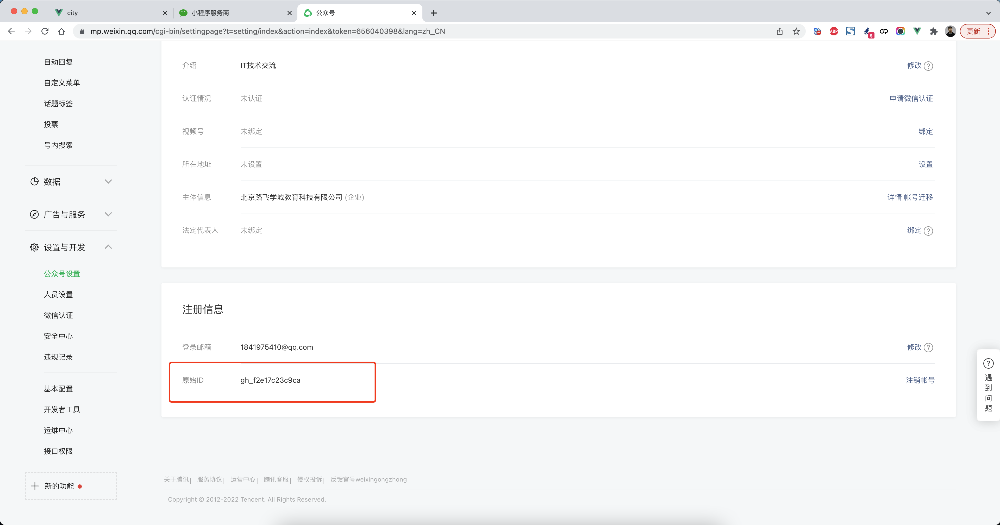


##### 2.登录开放平台【测试】

登录开放平台，填写测试公众号或服务号原始ID。

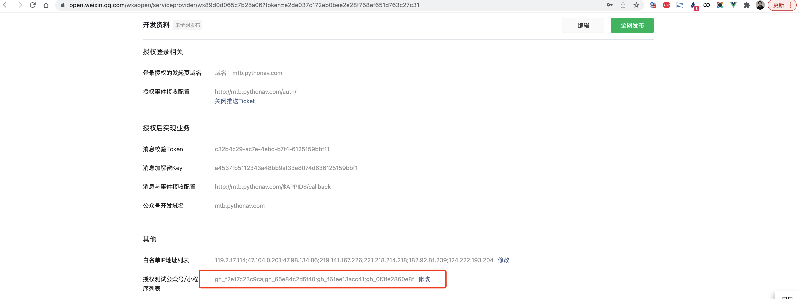


##### 3.扫码授权


##### 4.获取authorization_code

在我们的回调地址中可以获取到authorization_code（需要解决登录状态）。


##### 5.获取authorizer_access_token

- authorization_code获取 `authorizer_access_token` 和  `authorizer_refresh_token`。

  ```python
  res = requests.post(
      url="https://api.weixin.qq.com/cgi-bin/component/api_query_auth",
      params={
          "component_access_token": access_token
      },
      json={
          "component_appid": settings.WX_APP_ID,  # 固定的APP_ID
          "authorization_code": auth_code
      }
  )
  result = res.json()
  authorizer_appid = result['authorization_info']['authorizer_appid']
  authorizer_access_token = result['authorization_info']['authorizer_access_token']
  authorizer_refresh_token = result['authorization_info']['authorizer_refresh_token']
  authorizer_period = int(result['authorization_info']['expires_in']) + int(time.time())
  
  
  
  文档：https://developers.weixin.qq.com/doc/oplatform/Third-party_Platforms/2.0/api/ThirdParty/token/authorization_info.html
  ```

- 获取公众号信息

  ```python
  res = requests.post(
      url="https://api.weixin.qq.com/cgi-bin/component/api_get_authorizer_info",
      params={
          "component_access_token": access_token
      },
      json={
          "component_appid": settings.WX_APP_ID,
          "authorizer_appid": authorizer_appid
      }
  ).json()
  
  nick_name = res["authorizer_info"]["nick_name"]
  user_name = res["authorizer_info"]["user_name"]  # 原始ID
  avatar = res["authorizer_info"]["head_img"]
  service_type_info = res["authorizer_info"]["service_type_info"]["id"]
  verify_type_info = res["authorizer_info"]["verify_type_info"]["id"]
  
  
  # 文档：https://developers.weixin.qq.com/doc/oplatform/Third-party_Platforms/2.0/api/ThirdParty/token/api_get_authorizer_info.html
  ```

  

- 保存

  ```python
  
  class PublicNumbers(models.Model):
      authorizer_app_id = models.CharField(verbose_name="授权ID", max_length=64)
      authorizer_access_token = models.CharField(verbose_name="授权token", max_length=255)
      authorizer_refresh_token = models.CharField(verbose_name="授权更新token", max_length=64)
      authorizer_period = models.PositiveIntegerField(verbose_name="过期时间")
  
      nick_name = models.CharField(verbose_name="公众号名称", max_length=32)
      user_name = models.CharField(verbose_name="公众号原始ID", max_length=64)
      avatar = models.CharField(verbose_name="公众号头像", max_length=128)
      service_type_info = models.IntegerField(
          verbose_name="公众号类型",
          choices=(
              (0, "订阅号"),
              (1, "由历史老帐号升级后的订阅号"),
              (2, "服务号")
          )
      )
      verify_type_info = models.IntegerField(
          verbose_name="认证类型",
          choices=(
              (-1, "未认证"),
              (0, "微信认证"),
              (1, "新浪微博认证"),
              (2, "腾讯微博认证"),
              (3, "已资质认证通过但还未通过名称认证"),
              (4, "已资质认证通过、还未通过名称认证，但通过了新浪微博认证"),
              (5, "已资质认证通过、还未通过名称认证，但通过了腾讯微博认证"),)
      )
  
      mtb_user = models.ForeignKey(verbose_name="媒体宝用户", to="UserInfo", on_delete=models.CASCADE)
  
  ```

  ```python
          models.PublicNumbers.objects.update_or_create(
              defaults={
                  "authorizer_app_id": authorizer_appid,
                  "authorizer_access_token": authorizer_access_token,
                  "authorizer_refresh_token": authorizer_refresh_token,
                  "authorizer_period": authorizer_period,  # 2小时
                  "nick_name": nick_name,
                  "avatar": avatar,
                  "service_type_info": service_type_info,
                  "verify_type_info": verify_type_info,
              },
              mtb_user_id=request.user.user_id,
              user_name=user_name
          )
  ```


#### 5.2.4 展示 授权公众号


```
{
    "code": 0,
    "data": [
        {
            "id": 1,
            "nick_name": "公众号名称...",
            "avatar": "http://wx.qlogo.cn/mmop...ia/0",
            "service_type_info_text": "服务号",
            "verify_type_info_text": "未认证"
        }
    ]
}
```

##### 1.vue页面

加载页面时发送请求当前用户已授权的公众号信息。

```html
<el-card v-for="item in dataList" :key="item.id" class="box-card box-item" shadow="hover" :body-style="{width:'100%',padding:'20px'}">
    <div class="item flex-row-center">
        <el-avatar size="large" :src="item.avatar"></el-avatar>
    </div>
    <div class="item flex-row-center">{{item.nick_name}}</div>
    <div class="item flex-row-center">
        <div class="flex-row-between" style="width: 100px;font-size: 12px;">
            <div style="color: gray">{{item.service_type_info_text}}</div>
            <div style="color: #0c8eff;">{{item.verify_type_info_text}}</div>
        </div>
    </div>
    <el-divider></el-divider>
    <div class="item small flex-row-between">
        <div><i class="el-icon-position"></i> 任务包</div>
        <div class="date">永久</div>
    </div>
    <div class="item small flex-row-between">
        <div><i class="el-icon-bell"></i> 消息宝</div>
        <div class="date">永久</div>
    </div>
</el-card>
<script>
    export default {
        name: 'Auth',
        data() {
            return {
                dataList: []
            }
        },
        created: function () {
            this.initDataList();
        },
        methods: {
            toAuthorization() {
                // 发送请求获取 微信二维码URL的页面，跳转过去
                // http://mtb.pythonav.com/api/base/wxurl/
                this.axios.get("/base/wxurl/").then(res => {
                    // {code:0,data:{url:"微信跳转URL"}}
                    if (res.data.code === 0) {
                        window.location.href = res.data.data.url;
                    } else {
                        this.$message.error("请求失败");
                    }
                })
            },
            initDataList() {
                this.axios.get("/base/public/").then(res => {
                    // {code:0,data:[]}
                    if (res.data.code === 0) {
                        this.dataList = res.data.data;
                    } else {
                        this.$message.error("请求失败");
                    }
                })
            }
        }
    }
</script>
```


##### 2.drf接口

代码太多，详细请参考源码


#### 5.2.5 取消授权

如果用户在公众平台中取消了授权，我们的平台怎么知道呢？

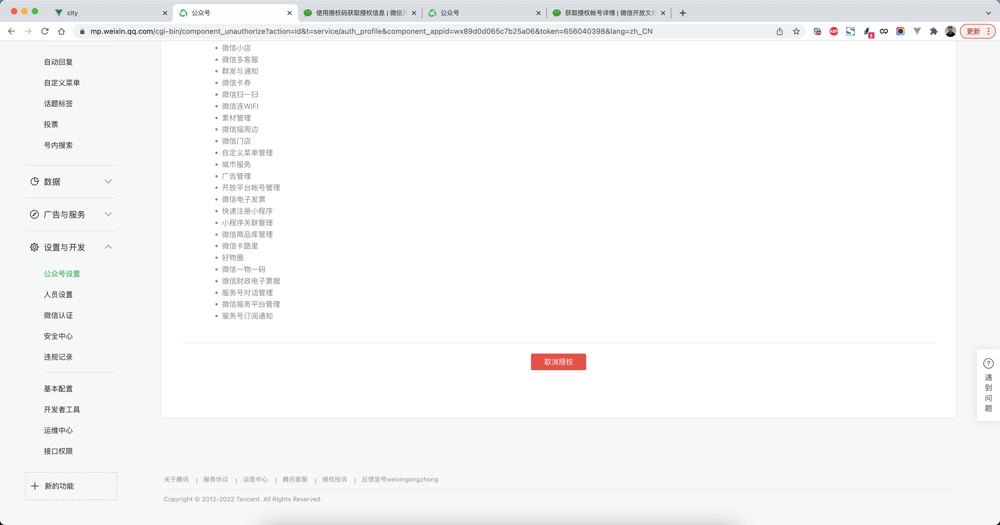


其实当用户取消授权后，会自动执行我们之前在开放平台定义的（就是没10分钟执行一次的请求）。

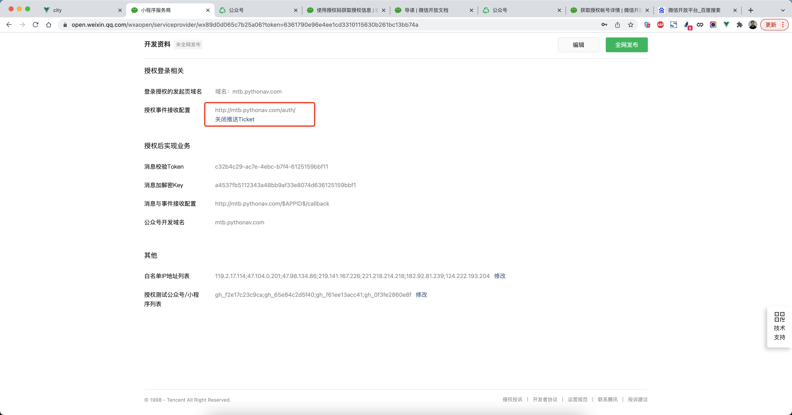


```
<xml>
    <AppId><![CDATA[wx89d0d065c7b25a06]]></AppId>
    <CreateTime>1648305909</CreateTime>
    <InfoType><![CDATA[component_verify_ticket]]></InfoType>
    <ComponentVerifyTicket><![CDATA[ticket@@@fAovP2Q8ywcY_wqXhthC5AFRNHg_aNuiAl7xljFf-w]]></ComponentVerifyTicket>
</xml>
```

```
<xml>
	<AppId><![CDATA[wx89d0d065c7b25a06]]></AppId>
	<CreateTime>1648455334</CreateTime>
	<InfoType><![CDATA[unauthorized]]></InfoType>
	<AuthorizerAppid><![CDATA[wx75cd30b4c2693497]]></AuthorizerAppid>
</xml>
```


#### 5.2.6 获取数据

当授权公众号之后，我们平台就可以接管公众号，接收数据。

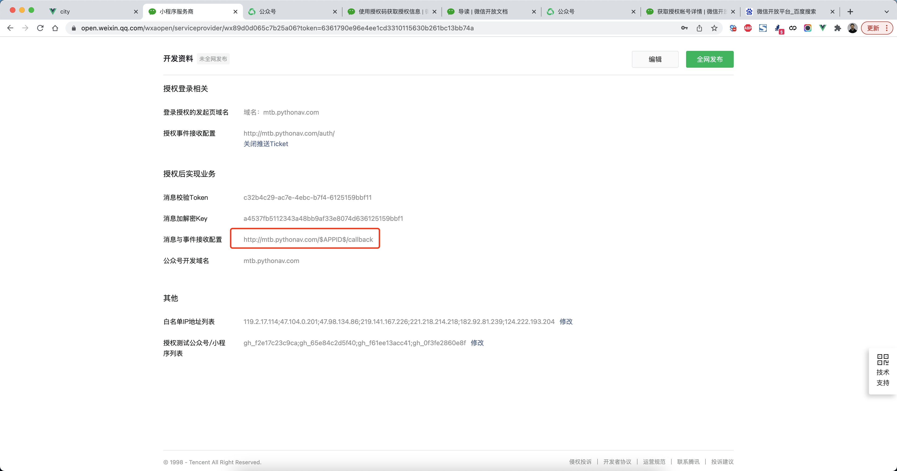

```python
from django.urls import path, include
from apps.base.views import wx

urlpatterns = [
    path('api/base/', include('apps.base.urls')),

    path('<str:filename>.txt', wx.file_verify),  # 微信调用
    path('auth/', wx.component_verify_ticket),  # 微信调用
    path('<str:authorizer_app_id>/callback', wx.event_callback),  # 微信调用
]
```

```python
def event_callback(request, authorizer_app_id):
    """ 公众号的消息与事件接收配置 """
    if request.method != "POST":
        return HttpResponse('error')
    # 获取请求体数据
    body = request.body.decode("utf-8")

    # 获取URL中的数据
    nonce = request.GET.get("nonce")
    timestamp = request.GET.get('timestamp')
    msg_sign = request.GET.get('msg_signature')

    # 解密 pip install pycryptodome
    decrypt_test = WXBizMsgCrypt(settings.WX_TOKEN, settings.WX_KEY, settings.WX_APP_ID)
    code, decrypt_xml = decrypt_test.DecryptMsg(body, msg_sign, timestamp, nonce)

    # code=0时 解密成功
    if code != 0:
        return HttpResponse('error')
    print('--------')
    print(authorizer_app_id, decrypt_xml)
    return HttpResponse("success")
```


```
<xml>
	<ToUserName><![CDATA[gh_f2e17c23c9ca]]></ToUserName>
    <FromUserName><![CDATA[oko631YbM3Mq-0tewUUVH1rOAAJY]]></FromUserName>
    <CreateTime>1648457984</CreateTime>
    <MsgType><![CDATA[text]]></MsgType>
    <Content><![CDATA[武沛齐]]></Content>
    <MsgId>23600239816888806</MsgId>
</xml>
```

```
<xml>
 	<ToUserName><![CDATA[gh_f2e17c23c9ca]]></ToUserName>
	<FromUserName><![CDATA[oko631YbM3Mq-0tewUUVH1rOAAJY]]></FromUserName>
	<CreateTime>1648458242</CreateTime>
	<MsgType><![CDATA[image]]></MsgType>
	<PicUrl><![CDATA[http://mmbiz.qpic.cn/mmbiz_jpg/1cPbuONfU6P3WuLnOAVg/0]]></PicUrl>
	<MsgId>23600244842458443</MsgId>
	<MediaId><![CDATA[RanDds2osD-3NBMlFC5NRQCG1b9jKmeYhujUleqe]]></MediaId>
</xml>
```

```
<xml>
	<ToUserName><![CDATA[gh_f2e17c23c9ca]]></ToUserName>
	<FromUserName><![CDATA[oko631YbM3Mq-0tewUUVH1rOAAJY]]></FromUserName>
	<CreateTime>1648458550</CreateTime>
	<MsgType><![CDATA[event]]></MsgType>
	<Event><![CDATA[VIEW]]></Event>
	<EventKey><![CDATA[https://m.ke.qq.com/agencyHome.html?_bid=1rom=wechat]]></EventKey>
	<MenuId>454021062</MenuId>
</xml>
```

```
<xml>
    <ToUserName><![CDATA[gh_f2e17c23c9ca]]></ToUserName>
    <FromUserName><![CDATA[oko631YbM3Mq-0tewUUVH1rOAAJY]]></FromUserName>
    <CreateTime>1648458077</CreateTime>
    <MsgType><![CDATA[event]]></MsgType>
    <Event><![CDATA[subscribe]]></Event>
    <EventKey><![CDATA[]]></EventKey>
</xml>
```

```
<xml>
    <ToUserName><![CDATA[gh_f2e17c23c9ca]]></ToUserName>
    <FromUserName><![CDATA[oko631YbM3Mq-0tewUUVH1rOAAJY]]></FromUserName>
    <CreateTime>1648458011</CreateTime>
    <MsgType><![CDATA[event]]></MsgType>
    <Event><![CDATA[unsubscribe]]></Event>
    <EventKey><![CDATA[]]></EventKey>
</xml>
```


