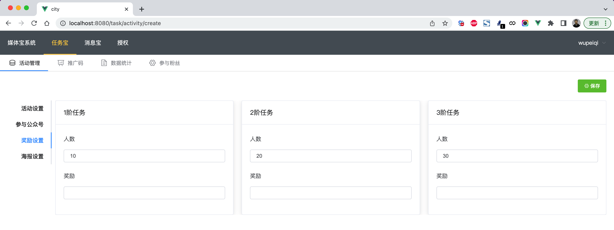
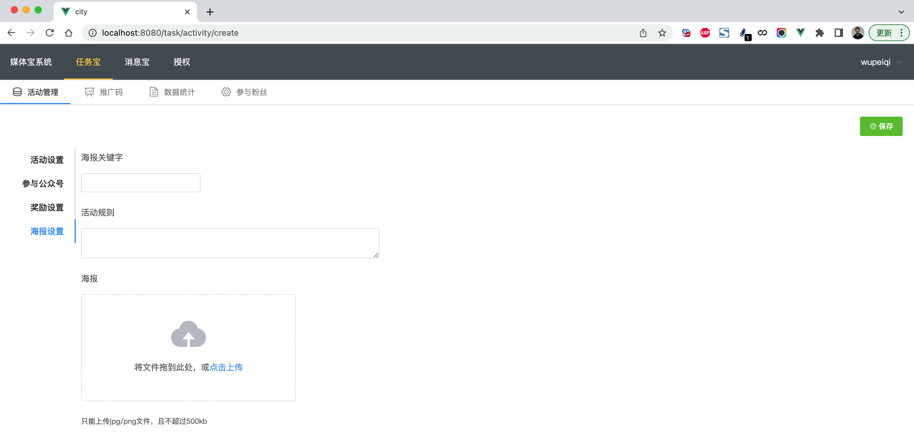
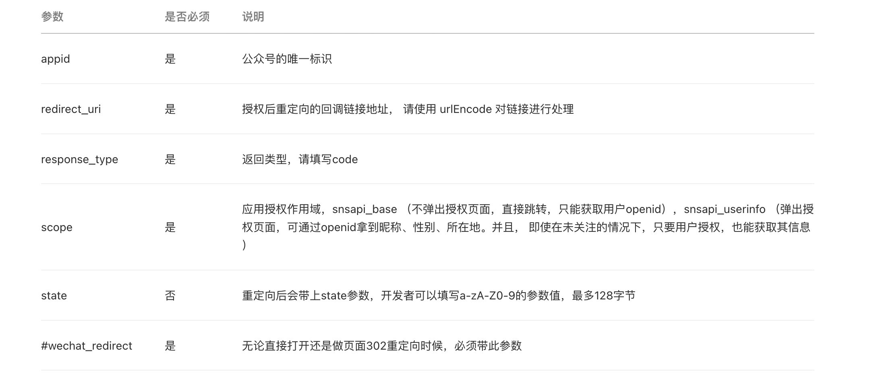
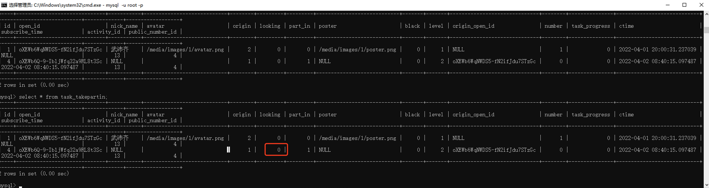
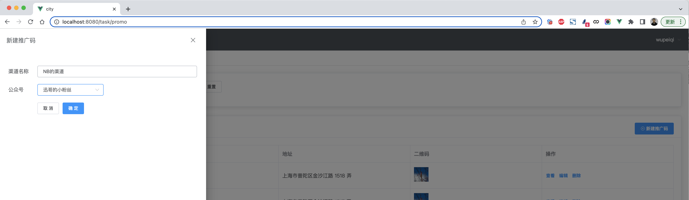
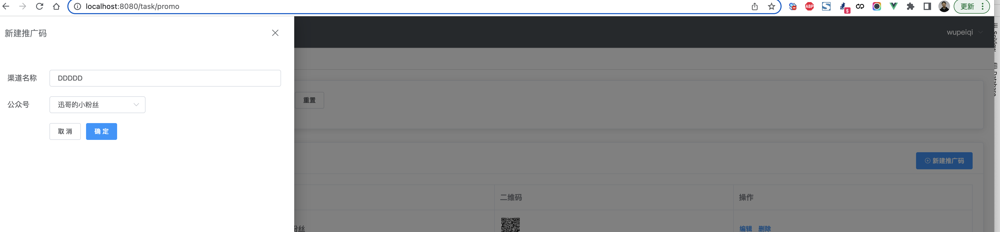
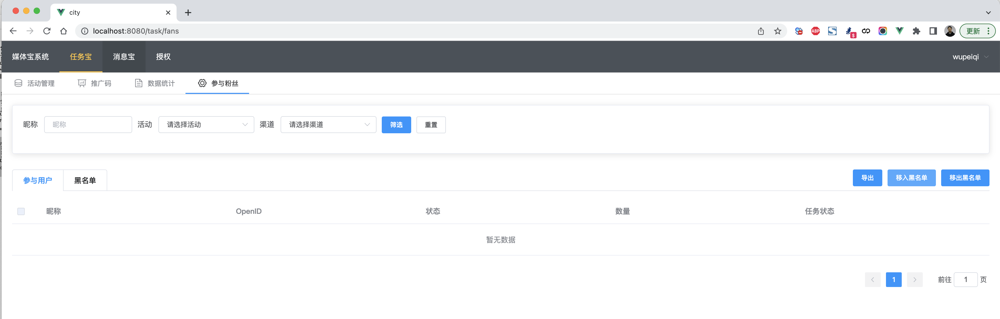

## 7.媒体宝-任务宝

任务包的核心功能：

- 媒体宝用户，创建活动并与绑定公众号。
- 粉丝向公众号发送指定关键词，公众号自动回复：活动介绍、生成海报连接。
- 粉丝点击连接自动生成海报（含头像、二维码），粉丝发朋友圈或群发等找好友助力。
- 其他人看到朋友圈，扫描海报上的二维码，自动跳转到公众号关注页面，只要关注，助力成功。
- 助力的人数越多，参与活动的人就可以获得更多的奖励。


### 7.1 表结构

```python
from django.db import models


class Activity(models.Model):
    """活动表"""
    mtb_user = models.ForeignKey("base.UserInfo", verbose_name="创建人", on_delete=models.CASCADE)
    name = models.CharField(max_length=16, verbose_name="活动名称")
    start_time = models.DateTimeField(verbose_name="活动开始时间", )
    end_time = models.DateTimeField(verbose_name="活动结束时间", )

    # 开启拉新保护后， 只算扫第一个人的
    protect_switch = models.SmallIntegerField(verbose_name="拉新保护", choices=((1, "开"), (2, "关"),), default=1)


class PublicJoinActivity(models.Model):
    """ 参与获得公众号 """
    public = models.ForeignKey("base.PublicNumbers", verbose_name="公众号", on_delete=models.CASCADE)
    activity = models.ForeignKey(Activity, verbose_name="活动", on_delete=models.CASCADE, related_name="publics")


class Award(models.Model):
    """ 活动奖励表 """
    activity = models.ForeignKey(Activity, verbose_name="参与活动", on_delete=models.CASCADE, related_name="awards")
    level = models.IntegerField(verbose_name="任务等级", choices=(
        (1, "一阶任务"),
        (2, "二阶任务"),
        (3, "三阶任务"),
    ), default=1)
    number = models.IntegerField(verbose_name="任务数量", default=0)
    good = models.CharField(verbose_name="奖品", max_length=255)


class PosterSetting(models.Model):
    """海报配置表"""
    activity = models.OneToOneField(Activity, verbose_name="活动", on_delete=models.CASCADE, related_name="poster")
    background_img = models.CharField(verbose_name="背景图片", max_length=128)

    key_word = models.CharField(verbose_name="海报生成关键字", max_length=10)
    rule = models.CharField(verbose_name="活动规则描述", max_length=256)


class TakePartIn(models.Model):
    """ 参与活动 """
    activity = models.ForeignKey(Activity, verbose_name="活动", on_delete=models.CASCADE)
    public_number = models.ForeignKey("base.PublicNumbers", verbose_name="公众号", on_delete=models.CASCADE)

    open_id = models.CharField(verbose_name="粉丝OpenID", max_length=64)

    nick_name = models.CharField(verbose_name="粉丝昵称", max_length=64, null=True, blank=True)
    avatar = models.FileField(verbose_name="粉丝头像", null=True, blank=True)

    origin = models.IntegerField(verbose_name="粉丝来源", choices=(
        (0, "其他粉丝"),
        (1, "推广码"),
        (2, "其他")
    ), default=2)

    looking = models.IntegerField(verbose_name="关注状态", choices=(
        (0, "关注中"),
        (1, "已取关"),
    ), default=0)

    part_in = models.IntegerField(verbose_name="参与活动", choices=(
        (0, "参与"),
        (1, "不参与"),  # 助力别人
    ), default=0)

    poster = models.CharField(verbose_name="专属拉新海报", max_length=128, null=True,blank=True)

    black = models.IntegerField(verbose_name="黑名单开关", choices=(
        (0, "未加入黑名单"),
        (1, "加入黑名单"),  # 加入黑名单的人不能参与
    ), default=0)

    level = models.IntegerField(verbose_name="裂变层级", default=1)
    origin_open_id = models.CharField(verbose_name="来源ID", max_length=64, null=True)  # 是推广码的ID, 或者是用户的ID

    number = models.IntegerField(verbose_name="邀请人数", default=0)
    task_progress = models.IntegerField(verbose_name="任务完成度", choices=(
        (0, "参与"),
        (1, "完成任务一"),
        (2, "完成任务二"),
        (3, "完成任务三"),
    ), default=0)
    ctime = models.DateTimeField(verbose_name="参与时间", auto_now_add=True)
    subscribe_time = models.DateTimeField(verbose_name="关注时间")

```


### 7.2 创建活动








- 海报背景上传

- 提交活动

  ```
  # 1.接收数据
  # 2.分别校验 活动表/公众号/奖励/海报
  # 3.在数据库新增
  ```

  

### 7.3 活动列表

- 数据的展示
- 数据的筛选


### 7.4 参与活动

- 创建一个活动
- 粉丝发送数据 & 微信转发给我们
- 判断输入的内容是否是指定的关键字，如果是则
  - 回复活动规则。（客服消息）
  - 回复链接（图文消息）。


**接口调用请求说明**

https://developers.weixin.qq.com/doc/offiaccount/Message_Management/Service_Center_messages.html#7

> http请求方式: POST https://api.weixin.qq.com/cgi-bin/message/custom/send?access_token=ACCESS_TOKEN

各消息类型所需的JSON数据包如下：

```
{
    "touser":"OPENID",
    "msgtype":"news",
    "news":{
        "articles": [
         {
             "title":"Happy Day",
             "description":"Is Really A Happy Day",
             "url":"URL",
             "picurl":"PIC_URL"
         }
         ]
    }
}
```

发送图文消息（点击跳转到外链） 图文消息条数限制在1条以内，注意，如果图文数超过1，则将会返回错误码45008。

```python
requests.post(
    url="https://api.weixin.qq.com/cgi-bin/message/custom/send",
    params={"access_token": access_token},
    data=json.dumps({
        "touser": user_open_id,
        "msgtype": "news",
        "news": {
            "articles": [
                {
                    "title": "点击链接生成我的专属海报",
                    "description": "邀请好友助力即可领取奖励",
                    "url": "http://mtb.pythonav.com/task/get_t...",
                    "picurl": ""
                }
            ]
        }
    }, ensure_ascii=False).encode('utf-8')
)
```


### 7.5 参与活动&生成海报

- 参与活动时，创建参与活动表（无昵称、无头像）

- 构造跳转的连接

  ```python
  # 发送图文消息（用于引导用户授权并获取昵称和头像）
  url = "https://open.weixin.qq.com/connect/oauth2/authorize?appid={}&redirect_uri={}&response_type=code&scope=snsapi_userinfo&state={}&component_appid={}#wechat_redirect"
  auth_url = url.format(authorizer_app_id, quote_plus("http://mtb.pythonav.com/api/task/oauth"), 11111,
                        settings.WX_APP_ID)
  
  requests.post(
      url="https://api.weixin.qq.com/cgi-bin/message/custom/send",
      params={"access_token": access_token},
      data=json.dumps({
          "touser": user_open_id,
          "msgtype": "news",
          "news": {
              "articles": [
                  {
                      "title": "点击链接生成我的专属海报",
                      "description": "邀请好友助力即可领取奖励",
                      "url": auth_url,
                      "picurl": ""
                  }
              ]
          }
      }, ensure_ascii=False).encode('utf-8')
  )
  ```

  https://developers.weixin.qq.com/doc/offiaccount/OA_Web_Apps/Wechat_webpage_authorization.html#0

  ```
  https://open.weixin.qq.com/connect/oauth2/authorize?appid=wxf0e81c3bee622d60&redirect_uri=http%3A%2F%2Fnba.bluewebgame.com%2Foauth_response.php&response_type=code&scope=snsapi_userinfo&state=STATE#wechat_redirect
  ```

  ```
  "https://open.weixin.qq.com/connect/oauth2/authorize?appid={}&redirect_uri=http%3A%2F%2Fmtb.pythonav.com%2Ftask%2Ftemp%2F&response_type=code&scope=snsapi_userinfo&state={}&component_appid=wx89d0d065c7b25a06#wechat_redirect"
  ```

  

- 授权成功后，微信会直接跳转回我们指定的redirect_uri + 携带参数

  ```
  {
  	'code': '001vjeGa165zUC02xrFa1uxx1p0vjeG6', 
  	'state': '111', 
  	'appid': 'wx71bf291c758aaabf'
  }
  ```

- 根据微信携带的参数获取头像和昵称

- 写生成海报

- 写入数据库


### 7.6 助力


生成海报之后，就可以发朋友圈，让我的朋友开始帮我助力了。

- 扫码

- 关注公众号

  ```xml
  <xml>
      <ToUserName><![CDATA[gh_0f3fe2860e8f]]></ToUserName>
      <FromUserName><![CDATA[oXEWb6Q-9-IbljWfq32a9RL8t3Sc]]></FromUserName>
      <CreateTime>1648828935</CreateTime>
      <MsgType><![CDATA[event]]></MsgType>
      <Event><![CDATA[subscribe]]></Event>
      <EventKey><![CDATA[qrscene_1]]></EventKey>
      <Ticket><![CDATA[gQGT7zwAAAAAAAAAAS5odHRwOi8vd2VpeGluMXkAAgRkIEdiAwQAjScA]]></Ticket>
  </xml>
  ```

  ```xml
   <xml>
       <ToUserName><![CDATA[gh_0f3fe2860e8f]]></ToUserName>
      <FromUserName><![CDATA[oXEWb6Q-9-IbljWfq32a9RL8t3Sc]]></FromUserName>
      <CreateTime>1648829021</CreateTime>
      <MsgType><![CDATA[event]]></MsgType>
      <Event><![CDATA[SCAN]]></Event>
      <EventKey><![CDATA[1]]></EventKey>
      <Ticket><![CDATA[gQGT7zwAAAAAAAAAeGluLnFxLmNvbKS2h5MXkAAgRkIEdiAwQAjScA]]></Ticket>
  </xml>
  ```

  ```xml
  <xml>
       <ToUserName><![CDATA[gh_0f3fe2860e8f]]></ToUserName>
      <FromUserName><![CDATA[oXEWb6Q-9-IbljWfq32a9RL8t3Sc]]></FromUserName>
      <CreateTime>1648830102</CreateTime>
      <MsgType><![CDATA[event]]></MsgType>
      <Event><![CDATA[subscribe]]></Event>
      <EventKey><![CDATA[qrscene_1_1]]></EventKey>
      <Ticket><![CDATA[gQEh7zwAAAAAAAAAAS5odHR5Y2wAAgRNJkdiAwQAjScA]]></Ticket>
  </xml>
  ```

  

### 7.7 取关

如果用户取关。



```xml
<xml>
    <ToUserName><![CDATA[gh_0f3fe2860e8f]]></ToUserName>
	<FromUserName><![CDATA[oXEWb6Q-9-IbljWfq32a9RL8t3Sc]]></FromUserName>
	<CreateTime>1648860835</CreateTime>
	<MsgType><![CDATA[event]]></MsgType>
	<Event><![CDATA[unsubscribe]]></Event>
	<EventKey><![CDATA[]]></EventKey>
</xml>
```


### 7.8 其他问题

- 粉丝参与
- 活动时间


### 7.9 推广码

如果我们有一些合作渠道，他们可以帮我们去引流，例如：搞一个二维码放到他们网站上，直接扫码关注我们公众号，那么就需要给他生成推广码。

```python
class Promo(models.Model):
    """渠道表"""
    name = models.CharField(verbose_name="渠道名称", max_length=16)
    qr = models.CharField(verbose_name="二维码", max_length=128,null=True,blank=True)
    public = models.ForeignKey("base.PublicNumbers", verbose_name="公众号", on_delete=models.CASCADE)
    mtb_user = models.ForeignKey("base.UserInfo", verbose_name="创建人", on_delete=models.CASCADE)
```


#### 7.9.1 新建推广码



- 打开页面，加载公众号列表。
- 提交表单 -> 后端API -> 生成二维码（media） -> 放在数据库地址
- 后期页面展示就是拿到二维码


#### 7.9.2 推广码列表


功能：

- 搜索 & 筛选
- 分页
- 数据展示


#### 7.9.3 推广码删除


#### 7.9.4 推广码编辑




#### 7.9.5 推广码来源-统计

如果用户通过推广码进行关注公众号，需要进行记录。

```xml
<xml>
    <ToUserName><![CDATA[gh_0f3fe2860e8f]]></ToUserName>
    <FromUserName><![CDATA[oXEWb6Q-9-IbljWfq32a9RL8t3Sc]]></FromUserName>
    <CreateTime>1648881233</CreateTime>
    <MsgType><![CDATA[event]]></MsgType>
    <Event><![CDATA[subscribe]]></Event>
    <EventKey><![CDATA[qrscene_2_7]]></EventKey>
    <Ticket><![CDATA[gQHS8DwAAAAAAAckYxMDAwMHcwN3UAAgQQxUdiAwQAAAAA]]></Ticket>
</xml>
```


### 7.10 参与粉丝

其实就是对参与活动和推广码过的人员进行筛选。





### 7.11 数据统计


## 总结

> 此项目的本质是结合微信开发平台实现新媒体的运营平台（微信裂变）。

媒体宝，新媒体营销平台，让平台帮你管理微信公众号，实现对粉丝、活动、消息等管理。

- 授权管理，打通平台与企业微信公众号的管理，只有授权后，平台才能接入微信，并自动化获取公众号的关注、取关、接收、发送消息等。
- 任务宝，发布微信活动任务，扫码转发并邀请好友助力，做裂变任务并配备相关奖励。
- 消息宝，基于平台实现批量的公众号消息管理，例如：消息发送、图文消息、定时任务等。


共享信息

- 代码

  ```
  https://gitee.com/wupeiqi/mtb
  https://gitee.com/wupeiqi/city
  ```

- 开发机（服务器）

  ```
  服务器公网IP：124.222.193.204
  服务器账户：Administrator
  服务器密码：Buxuyaomima*
  ```

  


