# 0. 序章

本项目是在Linux系统环境下拟真开发，所以大家需要从网盘上下载一个ubuntu系统镜像。因为各位学习的小伙伴的电脑系统不一致，所以在此需要大家根据自己的操作系统选择安装对应平台的Vmware虚拟机。

Windows：Vmware  Workstation 15.5以上（当然，最新的也没有问题）

Mac Os：VMware fusion  for mac 11.0以上（当然，最新的也没有问题，苹果系统也可以不使用Linux，因为苹果系统是Unix系统。）

视频中，本人安装的是Vmware  Workstation  for windows --->15.5版本。

ubuntu系统镜像下载地址：

```
链接：https://pan.baidu.com/s/19qZ2-vtMbz4amIJG3KNPcQ 
提取码：40nl 
复制这段内容后打开百度网盘手机App，操作更方便哦
```


Ubuntu镜像的运行要求：CPU i3以上（2*2），4G运行内存，50GSSD固态硬盘空间。

# 1. 项目开发基础概念

所谓项目，就是一个针对某个商业模式而定下的目标开展的一次有时间性或无限期的工作任务。

## 1.1 企业开发中常见的web项目类型

1. 商城，以商业交易为主，把传统的商业交易以互联网IT技术来实现的网站

   1.1 B2C  **直销商城**  商家与会员直接交易  ( Business To Customer )  

   ​	鸿星尔克、361。。

   1.2 B2B  **批发商城**  商家与商家直接交易( Business To Business )

   ​	阿里巴巴、钢材批发网站、服装批发、化工产品批发

   1.3 B2B2C   **购物平台**   进驻商家和会员在另一个商家提供的平台上面进行交易

   ​	天猫、京东、当当网

   1.4 C2B   **定制商城**   会员向商家发起定制商品的需求，商家照单去完成。

   ​	旅游路线定制、早期小米、互联网+、3D打印、服装定制

   1.5 O2O  线上线下交易平台 [Online To Offline]  

   ​	外卖、专车、旅拍、共享打车、12306、飞毛腿、

   1.6 C2C   二手交易平台，会员与会员之间的交易、网站不参与到商业中。

   ​	淘宝、孔夫子二手书、转转、闲鱼、

   

2. 门户网站[企业站和门户站]，以信息发布为主的，把企业、组织、机构的政策、历史、动态、产品对外发布的网站。

   1. 网易门户、腾讯门户、搜狐门户

   2. 各大高校的官网、

   3. 各大公司的官网、

   4. 各大银行、政府、医院的官网

      

3. 社交网络，以用户之间的社交属性的行为为主，让用户可以通过项目可以进行交友、交流、搭讪的网站。

   1. 陌陌、微信、豆瓣、。。。

4. 资讯论坛，以有时效性的信息为主，让用户可以在项目中可以进行交流和互通各种时效信息的网站。

   1. 贴吧、虎扑、boss直聘、前程无忧、猎聘

5. 内部系统，以权限为主的信息管理，不会对外开放，企业内部人员使用的。

   1. OA、在线办公系统，基于编程开发实现自动化办公的项目、python自动化办公
   2. CRM、客户关系管理系统，基于编程开发实现客户端关系的管理，完成销售阶段的资源共享和分配。
   3. ERP、企业权限管理系统，基于生产线进行物资、生成品控管理的网站。
   4. ERM、企业资源管理，CRM和ERP的结合出现的产物

6. 个人博客，以个人信息共享为主的非商业性的网站

   1. 技术博客
   2. 摄影博客
   3. 日志空间

   

7. 内容收费站，以网站内容限流收费为主。常见于VIP、会员充值、内容购买

   1. 爱奇艺、腾讯视频、哔哩哔哩、
   2. 漫画网、小说网、起点中文网、游戏充值网站
   3. 音乐网、视频网站、UI素材网站

路飞2.0在线教育 ----> B2C的在线教育商城

## 1.2 企业项目开发流程 


原型策划、设计协作的开发软件：蓝湖、摹客、Axure、CoDesign、墨刀

UI设计开发工具：Pixso、Figma、Sketch、photoshop、firework、coredraw

UI设计狮的工作产出物：具有图层分离效果的设计图（png、psd、Figma，Sketch....）

web前端开发人员，根据UI设计狮提供的设计稿（png、psd），进行拆板（使用HTML、CSS、js高度还原设计稿的效果制作成HTML静态网页）。

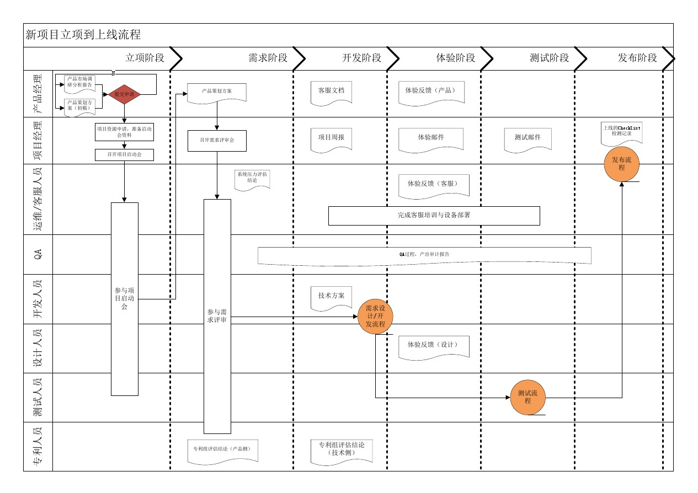


## 1.3 立项申请阶段

立项其实就是对产品项目能不能做和怎么做，提出理论基础。大的互联网公司都有比较正规的立项流程。


通常公司内部要研发一款软硬件的产品之前，都要经过市场评估和调研分析，产生一份`产品项目立项报告`给公司。

产品项目立项报告一般包含以下内容：

```
项目概述[1. 项目总体概述，2. 市场价值，3 整体架构]
需求市场
需求分析和项目建设的必要性
业务分析
总体建设方案
项目风险和风险管理
可行性分析阶段
```


# 2. 需求分析

## 2.1 首页

功能：

导航菜单（顶级菜单，侧边栏菜单，课程分类菜单）、轮播广告图、快捷登陆注册和退出登录、课程搜索、新课推荐、热门课程推荐


## 2.2 登录注册

功能：用户登录、第三方验证码、多条件登录、记住密码、短信发送、短信冷却倒计时、jwt认证


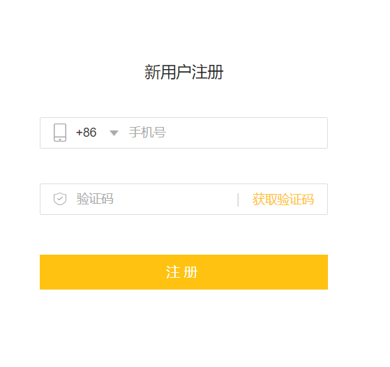


## 2.3 课程列表

功能：学习方向、课程分类、课程列表、课程多条件筛选展示、课程分类展示、课程分页展示、课程章节课时展示、课程优惠策略


## 2.4 课程详情

功能：课程信息展示、优惠活动设置、视频播放、富文本编辑器

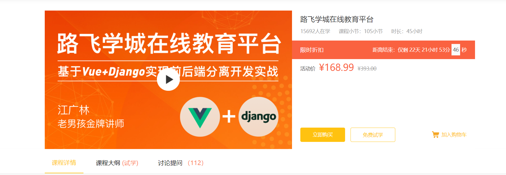

## 2.5 购物车

功能：购物车商品列表、添加商品、删除商品、勾选商品状态、商品结算、订单生成、唯一订单号生成

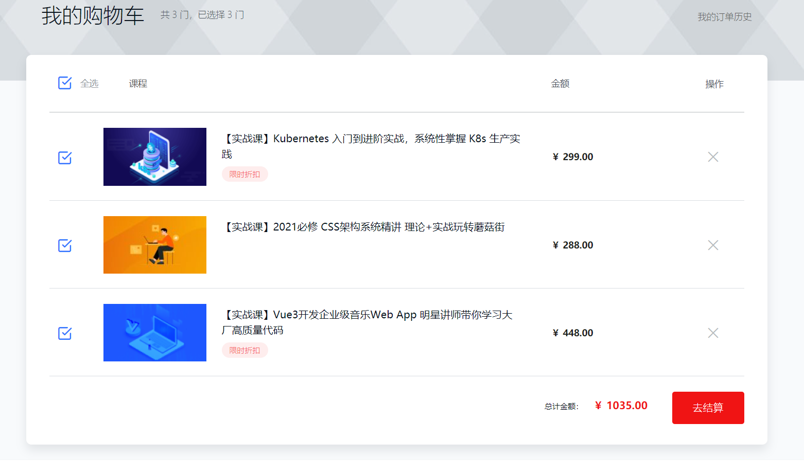


## 2.6 商品结算

功能：订单商品信息列表、订单信息展示、积分计算功能、优惠券、第三方支付平台接口集成

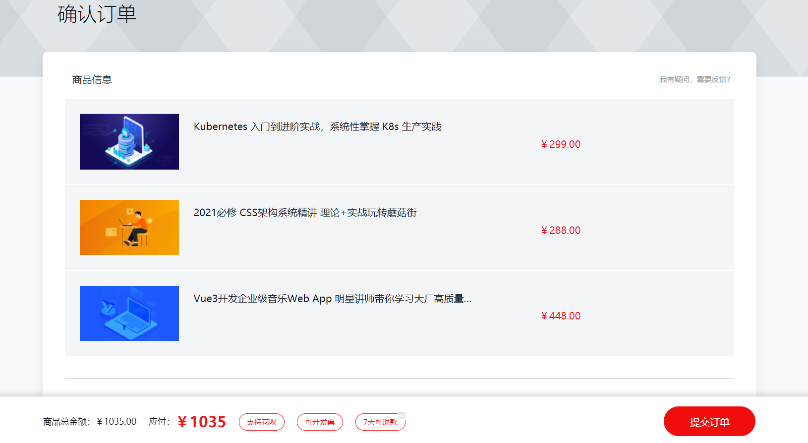


## 2.7 购买成功

功能：订单状态切换，购物课程记录展示，学习记录


## 2.8 个人中心

功能列表：我的订单、订单状态改变


## 2.9 我的课程及课程学习

功能：视频加密播放，课件下载，进度跟踪

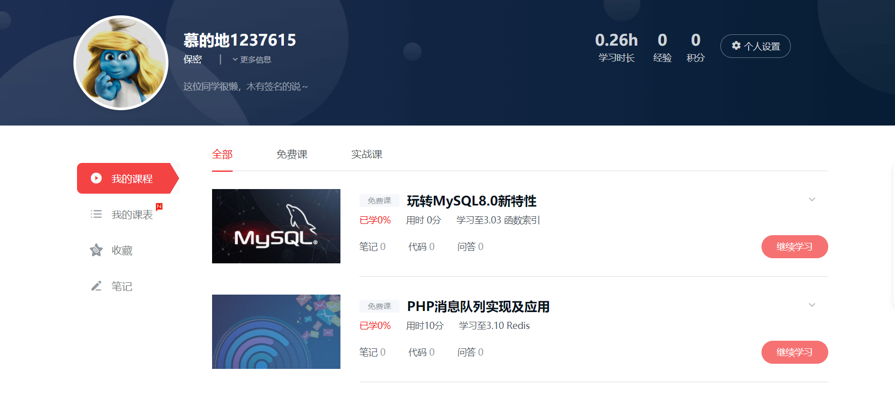


# 3. 环境搭建

一个开发机子下需要安装多个项目的python解释器，涉及不同项目所依赖的模块。

## 3.1 创建虚拟环境

虚拟环境就一个可以隔离项目的python的解释器和安装模块的工具，虚拟环境让不同的python环境隔离在不同的目录下。

工作中常用的虚拟环境工具：anaconda（开发环境）、virtualenv、miniconda（生产环境）

```python
cd ~/Desktop
conda create -n luffycity python=3.9
```


## 3.2 相关命令

虚拟环境名称不能使用特殊符号，虚拟环境名称将来会作为目录名，所以不能使用特殊符号也不要使用中文！！！

```python
# anaconda
创建虚拟环境：               conda create -n 虚拟环境名称 python=版本号
查看所有虚拟环境：           conda env list
使用虚拟环境：               conda activate 虚拟环境名称
退出当前虚拟环境：           conda deactivate
删除虚拟环境（必须先退出虚拟环境内部才能删除当前虚拟环境）:
                           conda remove -n 虚拟环境名称 --all
在当前虚拟环境安装模块       conda install -c conda-forge 包名==版本号
在当前虚拟环境移除模块       conda remove 包名
其他相关命令：
查看虚拟环境中安装的包：              pip freeze  或者 pip list
收集当前环境中安装的包及其版本：        pip freeze > requirements.txt
在部署项目的服务器中安装项目使用的模块： pip install -r requirements.txt
```

提示:

- 虚拟环境只会管理环境内部的模块和python解析器,对于源代码是毫无关系

- 创建虚拟环境需要联网
- 创建成功后, 需要手动切换到虚拟环境中
- 工作在虚拟环境上, 提示符最前面会出现 “(虚拟环境名称)”，因为每个小伙伴的网络不一样，如果网络卡了，需要耐心等待。


## 3.3 技术选型

### 依赖包安装

```
pip install django==3.2.9 -i https://pypi.douban.com/simple

pip install djangorestframework  -i https://pypi.douban.com/simple

pip install Pillow  -i https://pypi.douban.com/simple

conda install  -c conda-forge PymySQL
```

### 服务器架构

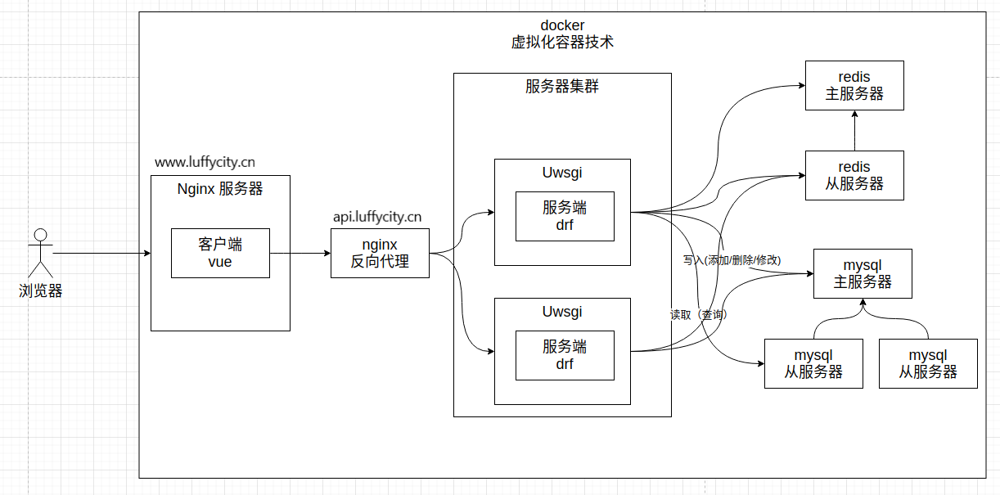


### 外部依赖

1.  注册支付宝的开发者账号。https://open.alipay.com/platform/home.htm

2.  注册阿里云账号，如果可以购买一个ESC服务器和购买一个心仪的域名，[先不要买。在项目部署阶段再买]

    域名需要进行备案[ICP备案和公安部备案]

    阿里云ICP备案：https://beian.aliyun.com/?spm=5176.19720258.J_8058803260.11.e9392c4auztrvI

    公安部备案：http://www.beian.gov.cn/portal/index.do

    注意：服务器和域名最好是同一个平台购买，否则备案有问题的，到时候还需要迁移域名到同一个平台。

3.  注册[容联云短信接口](https://www.yuntongxun.com/)平台的账号 。

4.  注册保利威视频服务平台的账号[先不要注册，有个7天免费的测试开发时间，项目最后会带着大家注册的]

5.  注册gitee[码云]的账号，托管项目代码。

6.  开通阿里云OSS对象存储。

7.  注册一个163邮箱。

# 4. 服务端项目搭建

## 4.1 创建服务端项目

```python
cd ~/Desktop
# 创建工程目录，将来在这个目录下创建服务端项目和客户端项目。
mkdir luffycity
cd luffycity
conda activate luffycity
# 创建api服务端项目
django-admin startproject luffycityapi
```


## 4.3 打开项目

在目录下打开桌面，并拖动luffycity目录到pycharm中，就可以在pycharm中打开项目了。

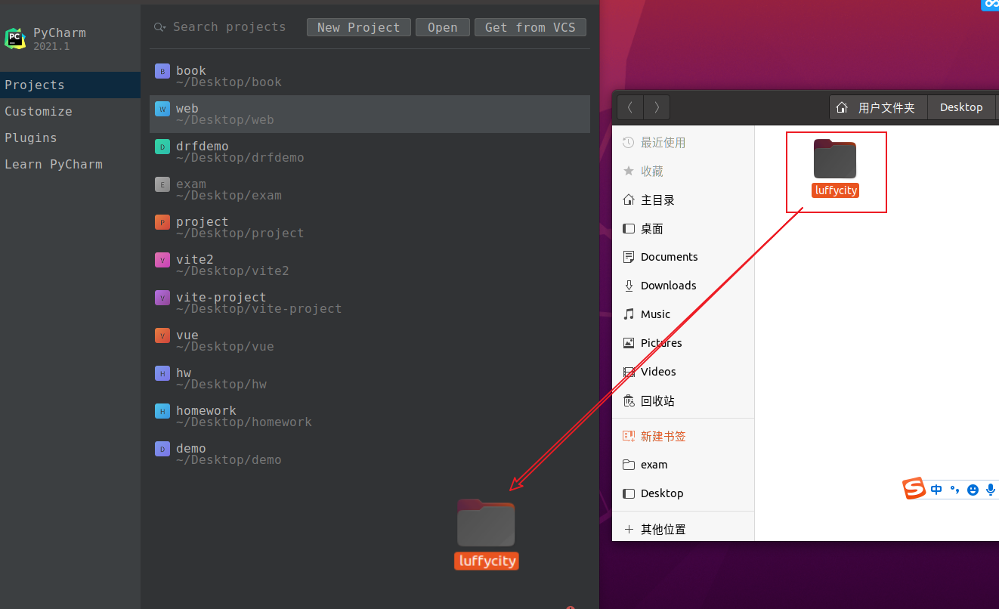

设置项目运行时使用luffycity虚拟环境下的python解释器。

点击菜单file（窗口左上角），选择Setttings.

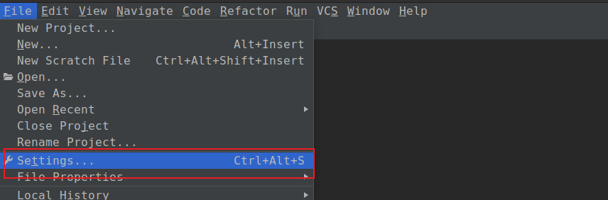

点选左侧菜单Project：项目目录名，接着选择Python Interpreter。进入选择解释器窗口。


点击窗口右侧的齿轮。


选择Add....


在新窗口左侧选择"Conda Env...."，接着选择"Existing environment"，点击 ... 选择luffycity对应的python解释器文件。


在pycharm左侧项目目录下，找到manage.py，双击打开，并点击下图中的绿色三角形，启动django项目

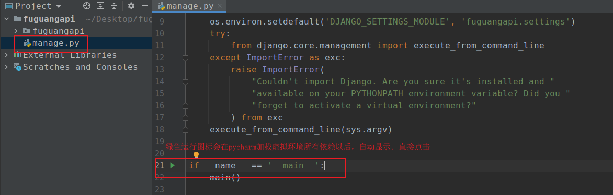

点选pycharm的右上角的manage，选择Edit Configurations... 进入修改python文件的启动参数设置窗口。

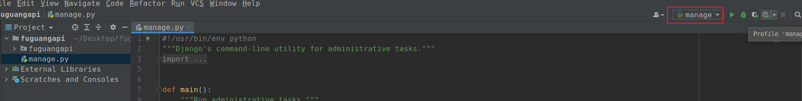


在新窗口中，在Parameters对应一栏下加上 runserver 0.0.0.0:8000 并点击OK按钮


再次点击manage右侧绿色三角形，运行django项目，打开浏览器，输入访问项目的地址：`http://127.0.0.1:8000`，效果如下：


## 4.2 调整目录

```
luffycity/                  # 工程目录
  ├── docs/                 # 项目相关资料保存目录
  │    ├── 技术开发文档.md   # touch 技术开发文档.md
  │    ├── requirements.txt
  │    ├── luffycity.sql
  ├── luffycityweb/         # 前端项目目录[该目录先不用创建]
  ├── luffycityapi/         # api服务端项目目录
       ├── manage.py
       ├── logs/            # 项目运行时/开发时日志目录
       ├── luffycityapi/    # 项目主应用，开发时的代码保存
       │    ├── apps/       # 开发者的代码保存目录，以模块[子应用]为目录保存
       │    ├── libs/       # 第三方类库的保存目录[别人写好的，开源的第三方组件、模块]
       │    ├── settings/
       │         ├── dev.py   # 项目开发时的本地配置[不需要上传到线上或者服务器]
       │         ├── prod.py  # 项目上线时的运行配置
       │    ├── urls.py       # 总路由
       │    └── utils/        # 项目各个子应用所使用的公共函数类库[自己开发的组件]
       └── scripts/           # 保存项目运营时的维护项目脚本文件
```

在pycharm编辑器中开发服务端项目时,必须指定项目目录才能运行，例如,开发后端项目,则必须选择的目录是luffycityapi


### 4.2.1 分不同运行环境进行项目配置


开发者本地的环境、目录、数据库密码和线上的服务器都会不一样,所以我们的配置文件可以针对不同的系统分成多分.

1. 在项目主应用luffycityapi下,创建一个settings的配置文件存储目录
2. 根据线上线下两种情况分别创建2个配置文件 dev.py和prod.py
3. 把原来项目主应用的settings.py配置文件改名，并把内容复制2份到dev.py和prod.py里面
4. 修改mange.py中加载配置的路径。

新的配置包目录settings:

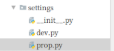

接下来,就可以根据在manage.py中根据不同的情况导入对应的配置文件了。

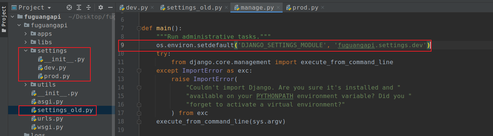


在工作中，一个项目的开发和维护往往会是比较长的时间周期，在这个过程中，一般存在多个开发人员一起写代码的情况，为了避免互相代码冲突，误删对方文件，或者因为自己电脑故障导致代码丢失的情况，所以我们需要使用git这样的代码管理系统，来记录每天或者每一个功能的代码进度，这样后面即使误删了代码，也能找回。

## 4.3 创建代码版本

在当前项目中，我们开发的工程包含了2个项目：api服务端和vue客户端。企业中，往往都是针对不同的项目创建不同的仓库，但是这里，我们现在学习的时候是没有那么人手的。所以我们针对当前整个工程搭建一个git仓库即可。

cd进入到自己希望存储代码的目录路径，并创建本地仓库.git【pycharm直接打开终端就是项目根目录了。无须cd了】
新创建的本地仓库.git是个空仓库

```python
cd ~/Desktop/luffycity
git init
```


### 4.3.1 配置用户名和邮箱

首次使用git需要给git配置当前开发者的用户名和邮箱地址。在.git的同级目录，打开终端： 

```bash
# 针对当前项目配置用户名和邮箱
git config user.name 'mooluo'
git config user.email '649641514@qq.com'

# 针对当前电脑进行全局配置，意味着以后所有的项目都使用这个账号信息
# git config --global user.name 'mooluo'
# git config --global user.email '649641514@qq.com'
```


## 4.4 在gitee创建代码仓库

代码托管：gitee(码云)，github，gitlab，codepan

Gitee码云平台：http://www.gitee.com

1） 这里我们是学习，所以我这创建项目库名luffycity。项目库名建议是英文的。


选择git-flow自定义分支模型。

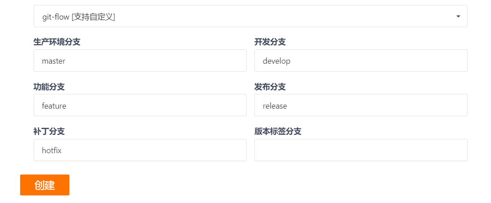

所谓的分支，其实就是一个项目的代码的不同流程版本。


git-flow分支命名规范：

| 分支前缀 | 描述                                                         |
| -------- | ------------------------------------------------------------ |
| master   | 生产环境分支，将来可以部署到生产环境（公司的外网服务器）的代码 |
| release  | 预发布环境分支，将来可以部署到预发布环境的代码，也可以是rel  |
| develop  | 开发环境分支，也可以是dev                                    |
| feature  | 新功能，新增业务分支，也可以是feat                           |
| hotfix   | 修复bug问题、漏洞分支，也可以是fix                           |
| test     | 测试相关分支                                                 |

补充说明：

```bash
release/feature/xxx   # 表示待发布分支下的xxx业务功能相关代码
develop/feature/xxx   # 表示开发分支下的xxx业务的新功能代码
develop/test/xxx      # 表示开发分支下的正在测试的xxx业务功能的代码
develop/hotfix/xxx    # 表示开发分支下的修复xxx业务相关功能的bug

# 当然，分支名称并不是固定的，只要能让开发人员一目了然，名字都可以换，所以也可以这样：
release/xxx   # 表示待发布的xxx业务新功能代码
feature/xxx   # 表示正在开发的xxx业务功能代码
test/xxx      # 表示正在测试的xxx业务功能代码
hotfix/user   # 表示正在修复bug的xxx业务功能的代码
```

创建私有空仓库以后的界面：


接下来，我们会使用ssh连接远程的git仓库。所以需要先在本地电脑下生成ssh秘钥对。

```python
# 例如我的码云账号是 649641514@qq.com，那么该账号生成ssh秘钥对（基于rsa加密算法生成的秘钥对，公钥和私钥）
ssh-keygen -t rsa -C "649641514@qq.com"
# 查看生成的秘钥对中的公钥（私钥id_rsa保存在自己电脑不要乱动，公钥id_rsa.pub需要复制文件内容到码云平台）
cat /home/moluo/.ssh/id_rsa.pub
# 把公钥进行复制到码云平台上 https://gitee.com/profile/sshkeys
```


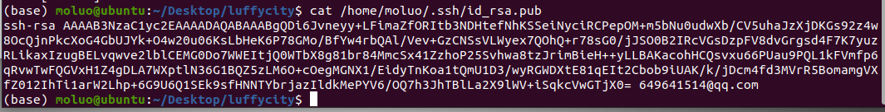

复制终端下出现的公钥信息，复制到码云上面。


切换项目的仓库地址，设置线上仓库

```bash
# git remote remove origin # 删除仓库地址，origin可以理解是一个变量，因为当前时一个新仓库，所以不需要执行这段。
git remote add origin git@gitee.com:mooluo_admin/luffycity.git # 新仓库地址，等同于origin= git..../luffycity.git
```


分支管理，git提交代码版本并同步到远程服务器。

```bash
git branch    # 查看分支
# 刚执行git init 初始化时，会没有分支，因此我们需要进行第一次的代码提交。
cd ~/Desktop/luffycity
git add .
git commit -m "feature:项目初始化"
git branch

# git branch <分支名称>    # 新建分支
# git branch test         # 例如：创建一个test分支

# git checkout <分支名称>  # 切换分支
# git checkout test       # 例如：切换到test分支，检出分支代码

# git branch -d <分支名称>   # 删除分支
# git branch -d test

# git push <远程仓库别名> --delete <分支名称>    # 删除远程服务器分支
# git push origin --delete test  # 例如：删除远程仓库origin中的test

git checkout -b develop   # 创建本地分支develop, develop在自定义分支模型(git-flow)中属于开发分支
```


使用`.gitignore`可以在git上传或下载代码时，把一些不必要记录的垃圾文件/目录过滤掉。

```bash
cd ~/Desktop/luffycity

# 新建git忽略文件
vim .gitignore

# .gitignore的内容复制于开源仓库 https://github.com/github/gitignore/blob/main/Python.gitignore
# :wq 保存文件
```

注意：必须保证.git 和.gitignore在同一级目录下，才能生效。


.gitignore文件内容：

```.gitignore
# Byte-compiled / optimized / DLL files
__pycache__/
*.py[cod]
*$py.class

# C extensions
*.so

# Distribution / packaging
.Python
build/
develop-eggs/
dist/
downloads/
eggs/
.eggs/
lib/
lib64/
parts/
sdist/
var/
wheels/
share/python-wheels/
*.egg-info/
.installed.cfg
*.egg
MANIFEST

# PyInstaller
#  Usually these files are written by a python script from a template
#  before PyInstaller builds the exe, so as to inject date/other infos into it.
*.manifest
*.spec

# Installer logs
pip-log.txt
pip-delete-this-directory.txt

# Unit test / coverage reports
htmlcov/
.tox/
.nox/
.coverage
.coverage.*
.cache
nosetests.xml
coverage.xml
*.cover
*.py,cover
.hypothesis/
.pytest_cache/
cover/

# Translations
*.mo
*.pot

# Django stuff:
*.log
local_settings.py
db.sqlite3
db.sqlite3-journal

# Flask stuff:
instance/
.webassets-cache

# Scrapy stuff:
.scrapy

# Sphinx documentation
docs/_build/

# PyBuilder
.pybuilder/
target/

# Jupyter Notebook
.ipynb_checkpoints

# IPython
profile_default/
ipython_config.py

# pyenv
#   For a library or package, you might want to ignore these files since the code is
#   intended to run in multiple environments; otherwise, check them in:
# .python-version

# pipenv
#   According to pypa/pipenv#598, it is recommended to include Pipfile.lock in version control.
#   However, in case of collaboration, if having platform-specific dependencies or dependencies
#   having no cross-platform support, pipenv may install dependencies that don't work, or not
#   install all needed dependencies.
#Pipfile.lock

# poetry
#   Similar to Pipfile.lock, it is generally recommended to include poetry.lock in version control.
#   This is especially recommended for binary packages to ensure reproducibility, and is more
#   commonly ignored for libraries.
#   https://python-poetry.org/docs/basic-usage/#commit-your-poetrylock-file-to-version-control
#poetry.lock

# PEP 582; used by e.g. github.com/David-OConnor/pyflow
__pypackages__/

# Celery stuff
celerybeat-schedule
celerybeat.pid

# SageMath parsed files
*.sage.py

# Environments
.env
.venv
env/
venv/
ENV/
env.bak/
venv.bak/

# Spyder project settings
.spyderproject
.spyproject

# Rope project settings
.ropeproject

# mkdocs documentation
/site

# mypy
.mypy_cache/
.dmypy.json
dmypy.json

# Pyre type checker
.pyre/

# pytype static type analyzer
.pytype/

# Cython debug symbols
cython_debug/

# PyCharm
#  JetBrains specific template is maintained in a separate JetBrains.gitignore that can
#  be found at https://github.com/github/gitignore/blob/main/Global/JetBrains.gitignore
#  and can be added to the global gitignore or merged into this file.  For a more nuclear
#  option (not recommended) you can uncomment the following to ignore the entire idea folder.
.idea/

# vue https://github.com/vuejs/vue/blob/dev/.gitignore
.DS_Store
node_modules
*.log
explorations
TODOs.md
dist/*.gz
dist/*.map
dist/vue.common.min.js
test/e2e/reports
test/e2e/screenshots
coverage
RELEASE_NOTE*.md
dist/*.js
packages/vue-server-renderer/basic.js
packages/vue-server-renderer/build.js
packages/vue-server-renderer/server-plugin.js
packages/vue-server-renderer/client-plugin.js
packages/vue-template-compiler/build.js
.vscode
```

记录并保存.gitignore到git中

```bash
git add .
git commit -m "feature:.gitignore新建忽略文件"
# 推送代码记录到远程服务器的代码仓库
git push origin develop # 推送的过程中，如果本地有该分支，但是线上没有这个分支，则git会自动在远程中创建该分支
```

接下来，可以看到远程仓库中是没有master，因此，需要把develop的代码合并到master下，再次提交master，就可以让远程仓库中也存在一个主分支了。


```python
# 因为线上没有master分支，所以我们可以把develop分支的代码合并到master下面。
# 当然这个操作，一般都是develop的功能已经开发完成了，并且经过测试没有问题了，才会合并代码
git checkout master   # 要合并到哪个分支下面，就要切换到对应分支
# 合并代码操作
git merge develop
# 推送master主分支到远程服务器
git push origin master
```

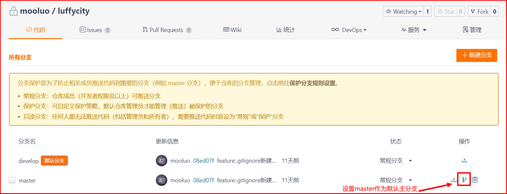

git commit 提交版本的描述信息，编写前缀规范：

| 描述前缀  | 描述                                                         |
| --------- | ------------------------------------------------------------ |
| feature:  | 本次提交的代码用于开发新功能，新增业务                       |
| fix:      | 本次提交的代码用于修复bug问题、漏洞                          |
| docs:     | 本次提交的代码用于修改文档，注释等相关                       |
| style:    | 本次提交的代码用于修改代码格式，不影响代码逻辑，常见的代码规范：PEP8，PEP484 |
| refactor: | 本次提交的代码用于项目/代码重构，理论上不影响现有功能(针对代码的重写，改造原来的模块/类/函数/方法) |
| perf:     | 本次提交的代码用于提升性能，代码优化                         |
| test:     | 本次提交的代码用于增加或修改测试用例代码                     |
| deps:     | 本次提交的代码用于升级项目依赖（更新依赖模块）               |

最终，成功提交了代码版本到gitee平台。效果：


## 4.5 服务端项目初始化

### 4.5.1 日志配置

这里我们基于django开发， Django 使用 Python 内置的logging 模块处理系统日志。 

django官方日志配置文档：https://docs.djangoproject.com/zh-hans/3.2/topics/logging/

日志信息从严重程度由高到低，一共分了5个等级。

由loging模块默认提供了5个操作方法，分别可以记录以下5个等级日志的。

 ```bash
CRITICAL（fatal）：  致命错误，程序根本跑不起来。
ERROR：              运行错误，程序运行发生错误的地方时就会退出程序。
WARNING：            运行警告，程序运行发生警告的地方时会显示警告提示，但是程序会继续往下执行。
INFO：               运行提示，一般的系统信息，并非日志
DEBUG：              调试信息，排查故障时使用的低级别系统信息
 ```


在settings/dev.py文件中追加如下配置：

```python
# 日志
LOGGING = {
    'version': 1, # 使用的日志模块的版本，目前官方提供的只有版本1，但是官方有可能会升级，为了避免升级出现的版本问题，所以这里固定为1
    'disable_existing_loggers': False, # 是否禁用其他的已经存在的日志功能？肯定不能，有可能有些第三方模块在调用，所以禁用了以后，第三方模块无法捕获自身出现的异常了。
    'formatters': { # 日志格式设置，verbose或者simple都是自定义的
        'verbose': { # 详细格式，适合用于开发人员不在场的情况下的日志记录。
            # 格式定义：https://docs.python.org/3/library/logging.html#logrecord-attributes
            # levelname 日志等级
            # asctime   发生时间
            # module    文件名
            # process   进程ID
            # thread    线程ID
            # message   异常信息
            'format': '{levelname} {asctime} {module} {process:d} {thread:d} {message}',
            'style': '{', # 变量格式分隔符
        },
        'simple': { # 简单格式，适合用于开发人员在场的情况下的终端输出
            'format': '{levelname} {message}',
            'style': '{',
        },
    },
    'filters': {  # 过滤器
        'require_debug_true': {
            '()': 'django.utils.log.RequireDebugTrue',
        },
    },
    'handlers': { # 日志处理流程，console或者mail_admins都是自定义的。
        'console': {
            'level': 'DEBUG', # 设置当前日志处理流程中的日志最低等级
            'filters': ['require_debug_true'], # 当前日志处理流程的日志过滤
            'class': 'logging.StreamHandler',  # 当前日志处理流程的核心类，StreamHandler可以帮我们把日志信息输出到终端下
            'formatter': 'simple'              # 当前日志处理流程的日志格式
        },
        # 'mail_admins': {
        #     'level': 'ERROR',                  # 设置当前日志处理流程中的日志最低等级
        #     'class': 'django.utils.log.AdminEmailHandler',  # AdminEmailHandler可以帮我们把日志信息输出到管理员邮箱中。
        #     'filters': ['special']             # 当前日志处理流程的日志过滤
        # }
        'file': {
            'level': 'INFO',
            'class': 'logging.handlers.RotatingFileHandler',
            # 日志位置,日志文件名，日志保存目录logs必须手动创建
            'filename': BASE_DIR.parent / "logs/luffycity.log",
            # 单个日志文件的最大值，这里我们设置300M
            'maxBytes': 300 * 1024 * 1024,
            # 备份日志文件的数量，设置最大日志数量为10
            'backupCount': 10,
            # 日志格式:详细格式
            'formatter': 'verbose'
        },
    },
    'loggers': {  # 日志处理的命名空间
        'django': {
            'handlers': ['console','file'], # 当基于django命名空间写入日志时，调用那几个日志处理流程
            'propagate': True,   # 是否在django命名空间对应的日志处理流程结束以后，冒泡通知其他的日志功能。True表示允许
        },
    }
}
```

在终端下提交git版本记录。

```bash
cd ~/Desktop/luffycity
git add .
git commit -m "feature:日志初始化"
git push origin master
# 编写新代码之前，切换一下分支到开发分支下。
git checkout develop
```


### 4.5.2 异常处理

新建utils/exceptions.py用于保存异常处理的工具函数代码。

```python
from rest_framework.views import exception_handler

from django.db import DatabaseError
from rest_framework.response import Response
from rest_framework import status

import logging
logger = logging.getLogger('django')


def custom_exception_handler(exc, context):
    """
    自定义异常处理
    :param exc: 异常类
    :param context: 抛出异常的上下文
    :return: Response响应对象
    """
    # 调用drf框架原生的异常处理方法
    response = exception_handler(exc, context)

    if response is None:
        view = context['view']
        if isinstance(exc, DatabaseError):
            # 数据库异常
            logger.error('[%s] %s' % (view, exc))
            response = Response({'message': '服务器内部错误'}, status=status.HTTP_507_INSUFFICIENT_STORAGE)

    return response
```


settings/dev.py配置文件中添加自定义异常处理的配置。

```python
# drf配置
REST_FRAMEWORK = {
    # 自定义异常处理
    'EXCEPTION_HANDLER': 'luffycityapi.utils.exceptions.custom_exception_handler',
}
```

使用git记录代码版本

```bash
cd ~/Desktop/luffycity
git add .
git commit -m "feature:自定义异常处理"
git push origin develop
```


### 4.5.3 数据库配置

#### 创建数据库

```mysql
mysql -uroot -p123
create database luffycity;

# 如果使用的数据库是低于8.0，使用下面的语句
# create database luffycity default charset=utf8mb4;
```

#### 为数据库分配管理员

为当前项目创建数据库用户[这个用户只能看到这个数据库]

```mysql
# 8.0版本以上的mysql/MariaDB10.3
# 创建用户：create user '用户名'@'主机地址' identified by '密码';
create user 'luffycity_user'@'%' identified by 'luffycity';  # %表示任意主机都可以通过当前账户登录到mysql
# 分配权限：grant 权限选项 on 数据库名.数据表 to 'luffycity_user'@'%' with grant option;
grant all privileges on luffycity.* to 'luffycity_user'@'%' with grant option;

# create user 'xiaoming'@'%' identified by 'xiaoming';
# grant select,insert on homework.* to 'xiaoming'@'%' with grant option;


# mysql8.0/MariaDB10.3版本以下，创建数据库用户并设置数据库权限给当前新用户，并刷新内存中的权限记录
create user luffycity_user identified by 'luffycity';
grant all privileges on luffycity.* to 'luffycity_user'@'%';
flush privileges;
```

使用pycharm连接mysql数据库。


#### 配置mysql数据库连接

连接池可以提升项目在使用数据库过程中的性能。dbutils和db-connecion-pool

```bash
# pip install pymysql  # 常见的数据库连接驱动：如果已经安装了，就不必要执行了。
pip install django-db-connection-pool
pip install cryptography
```

打开settings/dev.py文件，并配置

```python
DATABASES = {
    # 'default': {
    #     'ENGINE': 'django.db.backends.sqlite3',
    #     'NAME': BASE_DIR / 'db.sqlite3',
    # }
    'default': {
        # 'ENGINE': 'django.db.backends.mysql',
        'ENGINE': 'dj_db_conn_pool.backends.mysql',
        'NAME': 'luffycity',
        'PORT': 3306,
        'HOST': '127.0.0.1',
        'USER': 'luffycity_user',
        'PASSWORD': 'luffycity',
        'OPTIONS': {
            'charset': 'utf8mb4', # 连接选项配置,mysql8.0以上无需配置
        },
        'POOL_OPTIONS' : {      # 连接池的配置信息
            'POOL_SIZE': 10,    # 连接池默认创建的链接对象的数量
            'MAX_OVERFLOW': 10  # 连接池默认创建的链接对象的最大数量
        }
    }
}
```


在项目主应用下的 `luffycityapi.__init__.py`中导入pymysql，如果使用的是MySQLdb（mysqlclient），不要加下面的这段代码。

```python
import pymysql

pymysql.install_as_MySQLdb()
```

使用git记录代码版本

```bash
cd ~/Desktop/luffycity
git add .
git commit -m "feature:配置mysql数据库账号与链接"
git push origin develop
```


### 4.5.4 缓存配置

文档：https://django-redis-chs.readthedocs.io/zh_CN/latest/

安装django-redis。

```python
pip install django-redis
```

在settings/dev.py配置中添加一下代码：

```python
# redis configration
# 设置redis缓存
CACHES = {
    # 默认缓存
    "default": {
        "BACKEND": "django_redis.cache.RedisCache",
        # 项目上线时,需要调整这里的路径
        # "LOCATION": "redis://:密码@IP地址:端口/库编号",
        "LOCATION": "redis://:123456@127.0.0.1:6379/0",
        "OPTIONS": {
            "CLIENT_CLASS": "django_redis.client.DefaultClient",
            "CONNECTION_POOL_KWARGS": {"max_connections": 100},
        }
    },
    # 提供给admin运营站点的session存储
    "session": {
        "BACKEND": "django_redis.cache.RedisCache",
        "LOCATION": "redis://:123456@127.0.0.1:6379/1",
        "OPTIONS": {
            "CLIENT_CLASS": "django_redis.client.DefaultClient",
            "CONNECTION_POOL_KWARGS": {"max_connections": 100},
        }
    },
    # 提供存储短信验证码
    "sms_code":{
        "BACKEND": "django_redis.cache.RedisCache",
        "LOCATION": "redis://:123456@127.0.0.1:6379/2",
        "OPTIONS": {
            "CLIENT_CLASS": "django_redis.client.DefaultClient",
            "CONNECTION_POOL_KWARGS": {"max_connections": 100},
        }
    }
}

# 设置用户登录admin站点时,记录登录状态的session保存到redis缓存中
SESSION_ENGINE = "django.contrib.sessions.backends.cache"
# 设置session保存的位置对应的缓存配置项
SESSION_CACHE_ALIAS = "session"
```

django-redis提供了get_redis_connection的方法，通过调用get_redis_connection方法传递redis的配置名称可获取到redis的连接对象，通过redis连接对象可以执行redis命令

https://redis-py.readthedocs.io/en/latest/

使用范例：

```python
from django_redis import get_redis_connection
// 链接redis数据库
redis_conn = get_redis_connection("sms_code")
```


## 4.6 测试服务端项目

如果没有创建子应用home，可以根据以下步骤创建，终端操作

```bash
cd luffycityapi/apps
python ../../manage.py startapp home
```

注册home子应用到项目分2步：

1.  在settings/dev.py中的INSTALLED_APPS配置项里面新增home

因为项目目录的结构有所调整，所以我们在apps下保存了home子应用，因此需要让python能直接对home进行导包识别，需要给sys.path增加一个路径成员。

`settings/dev.py`，代码：

```bash
# 当前项目的主应用开发目录
BASE_DIR = Path(__file__).resolve().parent.parent
# 新增apps作为导包路径，导包路径默认保存sys.path属性中，所有的python的import或者from导包语句默认都是从sys.path中记录的路径下查找模块
sys.path.insert(0, str( BASE_DIR / "apps") )
# print(sys.path)

# django3.2.9版本中，默认关闭DEBUG模式的，我们自己手动开启下，方便开发，当然如果本身是True，则无需修改。
DEBUG = True

ALLOWED_HOSTS = []


INSTALLED_APPS = [
    'django.contrib.admin',
    'django.contrib.auth',
    'django.contrib.contenttypes',
    'django.contrib.sessions',
    'django.contrib.messages',
    'django.contrib.staticfiles',
    "rest_framework", # 注意：记得加入 rest_framework
    "home",
]
```

home子应用下创建路由文件，home/urls.py，代码：

```python
from django.urls import path
from . import views
urlpatterns = [

]
```

把子路由文件home/urls.py注册到总路由，`luffycityapi/urls.py`，代码：

```python
from django.contrib import admin
from django.urls import path, include

urlpatterns = [
    path('admin/', admin.site.urls),
    path('home/', include("home.urls")),
]
```

home/views.py，编写视图，代码：

```python
from rest_framework.views import APIView
from rest_framework.response import Response
from rest_framework import status
from django_redis import get_redis_connection
# 对日志调用
import logging
logger = logging.getLogger("django")

# Create your views here.
class HomeAPIView(APIView):
    def get(self,request):
        """测试代码，测试完成以后将来可以删除"""
        # 测试日志功能
        # logger.error("error信息")
        # logger.info("info信息")
        redis = get_redis_connection("sms_code")
        brother = redis.lrange("brother", 0, -1)
        return Response(brother, status.HTTP_200_OK)
```

home/urls.py，代码：

```python
from django.urls import path
from . import views
urlpatterns = [
    path("test", views.HomeAPIView.as_view()),
]
```

可以跟着以下操作模拟下redis终端的数据操作.

```bash
redis-cli
select 2
lpush brother zhangfei 28 guanyu 18 xiaoming 12
```


新增关于异常类和Redis操作异常的处理代码。`utils/exceptions.py`，代码：

```python
from rest_framework.views import exception_handler
from django.db import DatabaseError
from redis import RedisError
from rest_framework.response import Response
from rest_framework import status

import logging
logger = logging.getLogger('django')

def custom_exception_handler(exc, context):
    """
    自定义异常处理工具函数
    :param exc: 异常类
    :param context: 抛出异常的执行上下文
    :return: Response响应对象
    """
    # 先调用drf框架原生的异常处理方法
    response = exception_handler(exc, context)

    if response is None:
        view = context['view']
        # 判断是否发生了数据库异常
        if isinstance(exc, DatabaseError):
            # 数据库异常
            logger.error('mysql数据库异常！[%s] %s' % (view, exc))
            response = Response({'message': '服务器内部错误'}, status=status.HTTP_507_INSUFFICIENT_STORAGE)

        elif isinstance(exc, RedisError):
            logger.error('redis数据库异常！[%s] %s' % (view, exc))
            response = Response({'message': '服务器内部错误'}, status=status.HTTP_507_INSUFFICIENT_STORAGE)

        elif isinstance(exc, ZeroDivisionError):
            response = Response({'message': '0不能作为除数！'}, status=status.HTTP_500_INTERNAL_SERVER_ERROR)
    return response

```


提交Git代码版本

```python
cd /Desktop/luffycity
git add .
git commit -m "test: 测试服务端项目配置"
git push origin develop
```

# 5. 客户端项目搭建

## 5.1 创建vite项目

```bash
cd 项目根目录
yarn create vite
```

例如，我要把项目保存在~/Desktop/桌面的luffycity目录下，可以如下操作：

```bash
cd ~/Desktop/luffycity
yarn create vite
```

根据需要在生成项目时，我们选择对应的选项, 效果如下。

项目目录名称：luffycityweb

选项开发框架：vue 可以通过键盘方向键上（↑）下（↓）控制，回车键确认。

选择vue开发项目的前端语言：vue

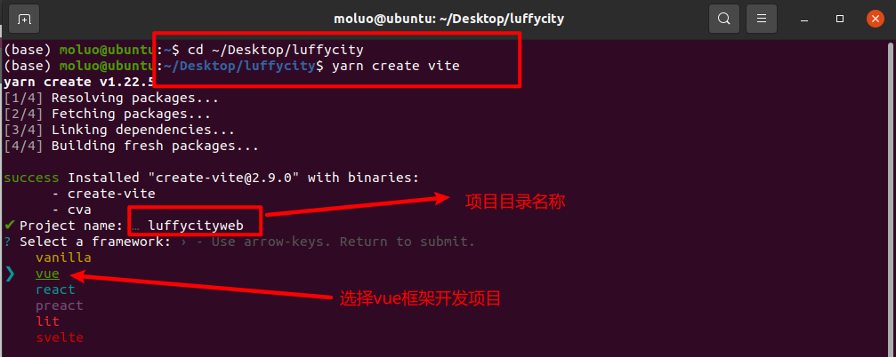

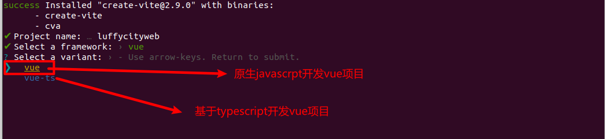

完成上面操作，最终效果：

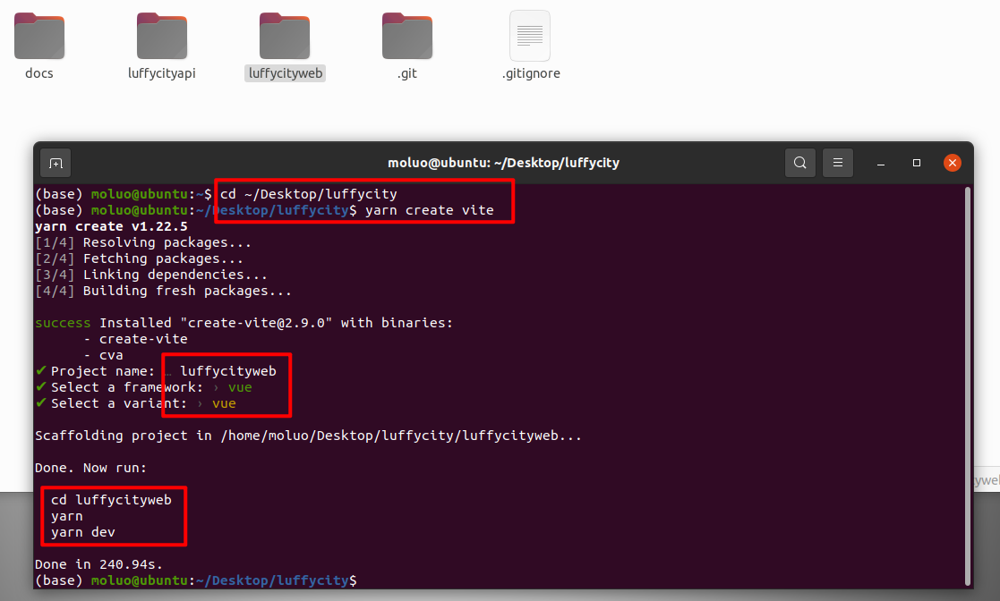

根据上面的提示，我们已经把vue项目构建好了，下载客户端vue项目运行的依赖模块，运行测试服务器。

```pyton
cd luffycityweb
yarn
yarn dev
```


成功运行项目，可以Ctrl+C停止项目并关闭终端了，接着在pycharm下运行vue项目，查看效果。


在pycharm已经打开的服务端项目窗口左上角，File -> Open...

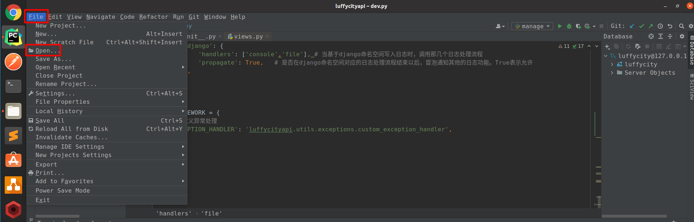

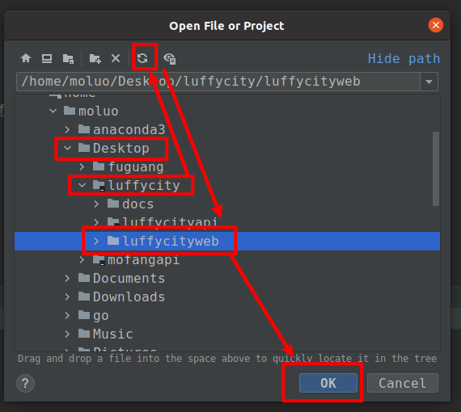

选择在一个新的窗口下打开客户端项目，这样的话，服务端项目在一个窗口下，客户端项目在另一个窗口下。

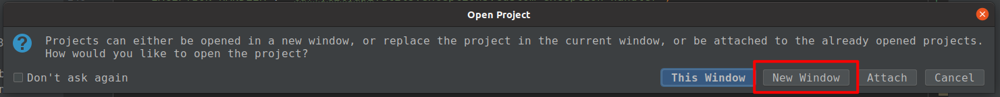

选择node解释器，配置启动项，运行项目。


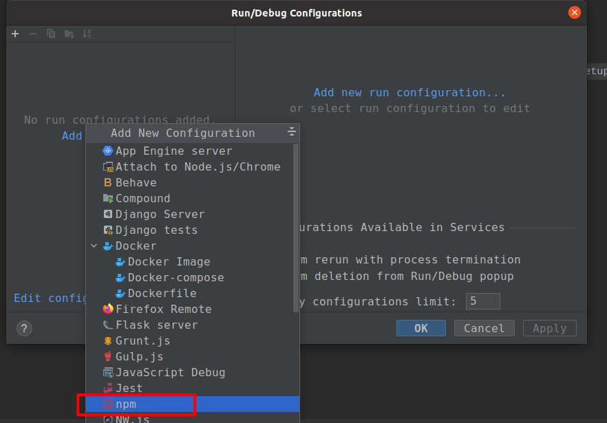


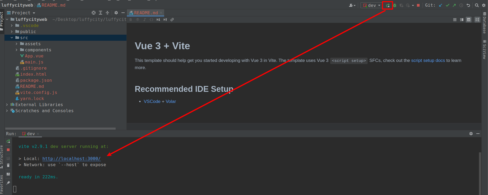

打开浏览器访问：http://localost:3000。效果如下：


把我们的前端项目进行git源代码管理。

```bash
git add .
git commit -m "feature:vue客户端项目搭建"
git push origin develop
```


## 5.2 客户端项目初始化

删除默认提供的HelloWorld.vue组件和src/APP.vue中的默认样式和内容。

App.vue，代码：

```vue
<template>

</template>

<script setup>

</script>

<style>

</style>
```

接下来，我们可以查看效果了，一张白纸~

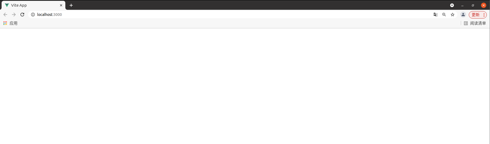

vite.config.js，有部分小伙伴的vite安装项目时因为版本原因，有可能不会自动生成vite配置文件，所以如果没有的话，自己手动创建以下，补充以下，代码：

```javascript
import { defineConfig } from 'vite'
import vue from '@vitejs/plugin-vue'

// https://vitejs.dev/config/
export default defineConfig({
  plugins: [vue()]
})

```


## 5.3 全局css初始化

全局css初始化代码，防止出现浏览器之间的怪异bug和避免外观不一致。

src/App.vue，代码：

```vue
<template>
  <router-view></router-view>
</template>

<script setup>

</script>

<style>
/* 声明全局样式和项目的初始化样式 */
body,h1,h2,h3,h4,p,table,tr,td,ul,li,a,form,input,select,option,textarea{
  margin:0;
  padding: 0;
  font-size: 15px;
}
a{
  text-decoration: none;
  color: #333;
  cursor: pointer;
}
ul,li{
  list-style: none;
}
table{
  border-collapse: collapse; /* 合并边框 */
}
img{
  max-width: 100%;
  max-height: 100%;
}
input{
  outline: none;
}
</style>
```

提交版本

```bash
cd ~/Desktop/luffycity
git add .
git commit -m "feature:客户端初始化css样式"
git push origin develop
```


## 5.4 安装路由组件vue-router

### 5.3.1 下载路由组件

前面没有安装vue-router，使用以下命令在**vue根目录下**安装路由组件：

```bash
cd ~/Desktop/luffycity/luffycityweb
yarn add vue-router@next
```

中文文档：https://next.router.vuejs.org/zh/

### 5.3.2 配置路由

#### 5.3.2.1 初始化路由对象

创建`src/router/index.js`，代码：

```javascript
import {createRouter, createWebHistory} from 'vue-router'

// 路由列表
const routes = [

]

// 路由对象实例化
const router = createRouter({
  // history, 指定路由的模式
  history: createWebHistory(),
  // 路由列表
  routes,
});


// 暴露路由对象
export default router
```

#### 5.3.2.2 注册路由组件

在main.js文件，把router对象注册到vue项目中，代码：

```javascript
import { createApp } from 'vue'
import App from './App.vue'
import router from "./router/index.js";
createApp(App).use(router).mount('#app')
```


#### 5.3.2.3 在视图中显示路由对应的内容

在App.vue组件中，填写路由视图映射的组件。代码：

```vue
<template>
  <router-view></router-view>
</template>

<script setup>

</script>

<style>
/* 声明全局样式和项目的初始化样式 */
body,h1,h2,h3,h4,p,table,tr,td,ul,li,a,form,input,select,option,textarea{
  margin:0;
  padding: 0;
  font-size: 15px;
}
a{
  text-decoration: none;
  color: #333;
  cursor: pointer;
}
ul,li{
  list-style: none;
}
table{
  border-collapse: collapse; /* 合并边框 */
}
img{
  max-width: 100%;
  max-height: 100%;
}
input{
  outline: none;
}
</style>
```

提交版本

```bash
cd ~/Desktop/luffycity
git add .
git commit -m "feature:安装集成vue-router"
git push origin develop
```


#### 5.3.2.4 创建前端首页和登陆的组件

src/routers/index.js

```javascript
import {createRouter, createWebHistory} from 'vue-router'

// 路由列表
const routes = [
  {
    meta:{
        title: "luffy2.0-站点首页",
        keepAlive: true
    },
    path: '/',         // uri访问地址
    name: "Home",
    component: ()=> import("../views/Home.vue")
  },
  {
    meta:{
        title: "luffy2.0-用户登录",
        keepAlive: true
    },
    path:'/login',      // uri访问地址
    name: "Login",
    component: ()=> import("../views/Login.vue")
  }
]

// 路由对象实例化
const router = createRouter({
  // history, 指定路由的模式
  history: createWebHistory(),
  // 路由列表
  routes,
});


// 暴露路由对象
export default router
```


##### 创建Home组件

views/Home.vue，代码：

```vue
<template>
  <h1>首页</h1>
</template>

<script setup>

</script>

<style scoped>

</style>
```


##### 创建Login组件

views/Login.vue，代码：

```vue
<template>
  <h1>登录</h1>
</template>

<script setup>

</script>

<style scoped>

</style>
```

提交版本

```bash
cd ~/Desktop/luffycity
git add .
git commit -m "feature:创建前端首页和登陆的组件"
git push origin develop
```


## 5.5  引入elementPlus

官方文档：https://element-plus.org/#/zh-CN

```bash
cd ~/Desktop/luffycity/luffycityweb
yarn add element-plus
```

### 5.4.1 按需导入element-plus到vue项目中

文档：https://element-plus.gitee.io/zh-CN/guide/quickstart.html# 配置elementPlus的功能组件按需导入

首先需要安装 `unplugin-vue-components`。

```bash
cd ~/Desktop/luffycity/luffycityweb
yarn add unplugin-vue-components
```

vite配置文件， luffycityweb/vite.config.js，加载上面刚安装的导入插件，代码：

```javascript
import { defineConfig } from 'vite'
import vue from '@vitejs/plugin-vue'
import Components from 'unplugin-vue-components/vite'
import { ElementPlusResolver } from 'unplugin-vue-components/resolvers'

// https://vitejs.dev/config/
export default defineConfig({
  plugins: [
      vue(),
      Components({
        resolvers: [ElementPlusResolver()],
      }),
  ]
});
```

Home组件中，调用elementPlus的基本样式，测试下是否成功引入。Home.vue，代码：

```vue
<template>
  <h1>首页</h1>
  <el-row>
    <el-button round>圆角按钮</el-button>
    <el-button type="primary" round>主要按钮</el-button>
    <el-button type="success" round>成功按钮</el-button>
    <el-button type="info" round>信息按钮</el-button>
    <el-button type="warning" round>警告按钮</el-button>
    <el-button type="danger" round>危险按钮</el-button>
    <el-rate v-model="store.value2" :colors="store.colors"> </el-rate>
  </el-row>
</template>

<script setup>
import {reactive} from "vue";
const store = reactive({
  value2: null,
  colors: ['#99A9BF', '#F7BA2A', '#FF9900'],
})
</script>

<style scoped>

</style>
```

访问浏览器，效果：

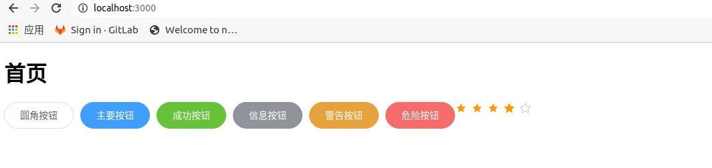

提交版本

```bash
cd ~/Desktop/luffycity
git add .
git commit -m "feature:客户端按需加载element-plus前端框架"
git push origin develop
```

成功引入了ElementPlus以后，接下来我们就可以开始进入前端页面开发，首先是首页。接下来我们把由前端工程师完成的首页，直接拿过来使用[注意除了组件以外，还有静态文件（包括图片，音频，视频）也需要拿过来]，并运行项目。

### 5.4.2 显示首页界面效果

src/components/Header.vue

```vue
<template>
    <div class="header-box">
      <div class="header">
        <div class="content">
          <div class="logo">
            <router-link to="/"></router-link>
          </div>
          <ul class="nav">
              <li><router-link to="">免费课</router-link></li>
              <li><router-link to="">项目课</router-link></li>
              <li><router-link to="">学位课</router-link></li>
              <li><router-link to="">习题库</router-link></li>
              <li><router-link to="">路飞学城</router-link></li>
          </ul>
          <div class="search-warp">
            <div class="search-area">
              <input class="search-input" placeholder="请输入关键字..." type="text" autocomplete="off">
              <div class="hotTags">
                <router-link to="/search/?words=Vue" target="_blank" class="">Vue</router-link>
                <router-link to="/search/?words=Python" target="_blank" class="last">Python</router-link>
              </div>
            </div>
            <div class="showhide-search" data-show="no"></div>
          </div>
          <div class="login-bar">
            <div class="shop-cart full-left">
              
              <span><router-link to="/cart">购物车</router-link></span>
            </div>
            <div class="login-box full-left">
              <span>登录</span>
              &nbsp;/&nbsp;
              <span>注册</span>
            </div>
          </div>
        </div>
      </div>
    </div>
</template>


<script setup>

</script>

<style scoped>
.header-box{
  height: 72px;
}
.header{
  width: 100%;
  height: 72px;
  box-shadow: 0 0.5px 0.5px 0 #c9c9c9;
  position: fixed;
  top:0;
  left: 0;
  right:0;
  margin: auto;
  z-index: 99;
  background: #fff;
}
.header .content{
  max-width: 1366px;
  width: 100%;
  margin: 0 auto;
}
.header .content .logo a{
}
.header .content .logo{
  height: 72px;
  line-height: 72px;
  margin: 0 20px;
  float: left;
  cursor: pointer; /* 设置光标的形状为爪子 */
}
.header .content .logo img{
  vertical-align: middle;
  margin: -40px;
}
.header .nav li{
  float: left;
  height: 80px;
  line-height: 80px;
  margin-right: 30px;
  font-size: 16px;
  color: #4a4a4a;
  cursor: pointer;
}
.header .nav li span{
  padding-bottom: 16px;
  padding-left: 5px;
  padding-right: 5px;
}
.header .nav li span a{
  display: inline-block;
}
.header .nav li .this{
  color: #4a4a4a;
  border-bottom: 4px solid #ffc210;
}
.header .nav li:hover span{
  color: #000;
}

/*首页导航全局搜索*/
.search-warp {
  position: relative;
  float: left;
  margin-left: 24px;
}
.search-warp .showhide-search {
  width: 20px;
  height: 24px;
  text-align: right;
  position: absolute;
  display: inline-block;
  right: 0;
  bottom: 24px;
  padding: 0 8px;
  border-radius: 18px;
}
.search-warp .showhide-search i {
  display: block;
  height: 24px;
  color: #545C63;
  cursor: pointer;
  font-size: 18px;
  line-height: 24px;
  width: 20px;
}
.search-area {
  float: right;
  position: relative;
  height: 40px;
  padding-right: 36px;
  border-bottom: 1px solid rgba(255, 255, 255, 0.4);
  zoom: 1;
  background: #F3F5F6;
  border-radius: 4px;
  margin: 16px 0;
  width: 324px;
  box-sizing: border-box;
  font-size: 0;
  -webkit-transition: width 0.3s;
  -moz-transition: width 0.3s;
  transition: width 0.3s;
}
.search-area .search-input {
  padding: 8px 12px;
  font-size: 14px;
  color: #9199A1;
  line-height: 24px;
  height: 40px;
  width: 100%;
  float: left;
  border: 0;
  -webkit-transition: background-color 0.3s;
  -moz-transition: background-color 0.3s;
  transition: background-color 0.3s;
  background-color: transparent;
  -moz-box-sizing: border-box;
  -webkit-box-sizing: border-box;
  -ms-box-sizing: border-box;
  box-sizing: border-box;
}
.search-area .search-input.w100 {
  width: 100%;
}
.search-area .hotTags {
  display: inline-block;
  position: absolute;
  top: 0;
  right: 32px;
}
.search-area .hotTags a {
  display: inline-block;
  padding: 4px 8px;
  height: 16px;
  font-size: 14px;
  color: #9199A1;
  line-height: 16px;
  margin-top: 8px;
  max-width: 60px;
  overflow: hidden;
  text-overflow: ellipsis;
  white-space: nowrap;
}
.search-area .hotTags a:hover {
  color: #F21F1F;
}
.search-area input::-webkit-input-placeholder {
  color: #A6A6A6;
}
.search-area input::-moz-placeholder {
  /* Mozilla Firefox 19+ */
  color: #A6A6A6;
}
.search-area input:-moz-placeholder {
  /* Mozilla Firefox 4 to 18 */
  color: #A6A6A6;
}
.search-area input:-ms-input-placeholder {
  /* Internet Explorer 10-11 */
  color: #A6A6A6;
}
.search-area .btn_search {
  float: left;
  cursor: pointer;
  width: 30px;
  height: 38px;
  text-align: center;
  -webkit-transition: background-color 0.3s;
  -moz-transition: background-color 0.3s;
  transition: background-color 0.3s;
}
.search-area .search-area-result {
  position: absolute;
  left: 0;
  top: 57px;
  width: 300px;
  margin-bottom: 20px;
  border-top: none;
  background-color: #fff;
  box-shadow: 0 8px 16px 0 rgba(7, 17, 27, 0.2);
  font-size: 12px;
  overflow: hidden;
  display: none;
  z-index: 800;
  border-bottom-right-radius: 8px;
  border-bottom-left-radius: 8px;
}
.search-area .search-area-result.hot-hide {
  top: 47px;
}
.search-area .search-area-result.hot-hide .hot {
  display: none;
}
.search-area .search-area-result.hot-hide .history {
  border-top: 0;
}
.search-area .search-area-result h2 {
  font-size: 12px;
  color: #1c1f21;
  line-height: 12px;
  margin-bottom: 8px;
  font-weight: 700;
}
.search-area .search-area-result .hot {
  padding: 12px 0 8px 12px;
  box-sizing: border-box;
}
.search-area .search-area-result .hot .hot-item {
  background: rgba(84, 92, 99, 0.1);
  border-radius: 12px;
  padding: 4px 12px;
  line-height: 16px;
  margin-right: 4px;
  margin-bottom: 4px;
  display: inline-block;
  cursor: pointer;
  font-size: 12px;
  color: #545c63;
}
.search-area .search-area-result .history {
  border-top: 1px solid rgba(28, 31, 33, 0.1);
  box-sizing: border-box;
}
.search-area .search-area-result .history li {
  height: 40px;
  line-height: 40px;
  padding: 0 10px;
  overflow: hidden;
  text-overflow: ellipsis;
  white-space: nowrap;
  color: #787d82;
  cursor: pointer;
}
.search-area .search-area-result .history li:hover,
.search-area .search-area-result .history li .light {
  color: #1c1f21;
  background-color: #edf0f2;
}


.header .login-bar{
  margin-top: 20px;
  height: 80px;
  float: right;
}
.header .login-bar .shop-cart{
  float: left;
  margin-right: 20px;
  border-radius: 17px;
  background: #f7f7f7;
  cursor: pointer;
  font-size: 14px;
  height: 28px;
  width: 88px;
  line-height: 32px;
  text-align: center;
}
.header .login-bar .shop-cart:hover{
  background: #f0f0f0;
}
.header .login-bar .shop-cart img{
  width: 15px;
  margin-right: 4px;
  margin-left: 6px;
}
.header .login-bar .shop-cart span{
  margin-right: 6px;
}
.header .login-bar .login-box{
  float: left;
  height: 28px;
  line-height: 30px;
}
.header .login-bar .login-box span{
  color: #4a4a4a;
  cursor: pointer;
}
.header .login-bar .login-box span:hover{
  color: #000000;
}
</style>
```

components/Footer.vue

```vue
<template>
    <div class="footer">
      <ul>
        <li><router-link to="">企业服务</router-link></li>
        <li><router-link to="">关于我们</router-link></li>
        <li><router-link to="">联系我们</router-link></li>
        <li><router-link to="">商务合作</router-link></li>
        <li><router-link to="">帮助中心</router-link></li>
        <li><router-link to="">意见反馈</router-link></li>
        <li><router-link to="">新手指南</router-link></li>
      </ul>
      <p>Copyright © luffycity.com版权所有 | 京ICP备17072161号-1</p>
    </div>
</template>

<script setup>

</script>

<style scoped>
.footer {
  width: 100%;
  height: 128px;
  color: #545C63;
}
.footer ul{
  margin: 0 auto 16px;
  padding-top: 38px;
  width: 930px;
}
.footer ul li{
  float: left;
  width: 112px;
  margin: 0 10px;
  text-align: center;
  font-size: 14px;
}
.footer ul::after{
  content:"";
  display:block;
  clear:both;
}
.footer p{
  text-align: center;
  font-size: 12px;
}
</style>
```

views/Home.vue中引入头部组件和脚部组件，添加代码：

```vue
<template>
  <div class="home">
    <Header></Header>
    
    <Footer></Footer>
  </div>
</template>

<script setup>
import Header from "../components/Header.vue"
import Footer from "../components/Footer.vue"

</script>

<style scoped>

</style>
```

提交版本

```bash
cd ~/Desktop/luffycity
git add .
git commit -m "feature:客户端显示首页"
git push origin develop
```


# 6.  客户端与服务端交互

## 6.1 配置本地域名映射

在开发前后端分离类型的项目中，一般客户端和服务端往往处于不同的服务器或2个不同域名地址下。因为客户端需要发送ajax请求不同源下服务端的数据，所以为了模拟真实环境，我们一般也会为客户端和服务端分别设置两个不同的本地域名进行模拟。

| 位置   | 域名               |
| ------ | ------------------ |
| 客户端 | `www.luffycity.cn` |
| 服务端 | `api.luffycity.cn` |

vim编辑`/etc/hosts`文件，可以设置本地域名

```bash
sudo vim /etc/hosts
```

使用i快捷键，进入vim输入模式，并在hosts文件中增加两行代码，然后保存文件内容。

```shell
127.0.0.1   api.luffycity.cn
127.0.0.1   www.luffycity.cn
```

使用:wq保存文件。

```bash
:wq
```

在使用pycharm运行web客户端项目时，默认以www.luffycity.cn:3000启动项目。

```python
--host=www.luffycity.cn --port=3000
```


在使用pycharm运行luffycityapi服务端项目这边窗口下配置，默认以api.luffycity.cn:8000启动。

```python
runserver api.luffycity.cn:8000
```


并打开dev.py，在ALLOWED_HOSTS选项中，增加允许客户端使用任意域名访问django站点。settings/dev.py，代码：

```python
ALLOWED_HOSTS = ["*"]
```

访问服务端网址http://www.luffycity.cn:8000/home/test/，效果：


## 6.2 CORS跨域支持

1.  服务端代理(Server Proxy)
2.  CORS跨域资源共享
3.  jsonp

现在前端与后端分处不同的域名，因为客户端访问不同源的服务端时会遭到浏览器的同源策略的拦截，所以我们需要配置CORS，一般开发中配置CORS有2种方案：

1.  web客户端的vue项目中配置vue.config.js实现跨域（使用vite搭建的vue项目，则配置文件是vite.config.js）
2.  api服务端的django项目中配置cors实现跨域

两种方式中可以任选其一，工作中我们与前端开发人员商量解决。

### 6.2.1 客户端基于nodejs实现跨域代理

配置vue-cli/vite本身内置的nodejs来实现跨域代理，vite.config.js，代码：

```javascript
import { defineConfig } from 'vite'
import vue from '@vitejs/plugin-vue'
import Components from 'unplugin-vue-components/vite'
import { ElementPlusResolver } from 'unplugin-vue-components/resolvers'

// https://vitejs.dev/config/
export default defineConfig({
    plugins: [
        vue(),
            Components({
            resolvers: [ElementPlusResolver()],
        }),
    ],
    server: {
        port: '3000',           // 客户端的运行端口，此处也可以绑定vue运行的端口，当然也可以写在pycharm下
        host: 'www.luffycity.cn', // 客户端的运行地址，此处也可以绑定vue运行的域名，当然也可以写在pycharm下
        // 跨域代理
        proxy: {
            '/api': {
                // 凡是遇到 /api 路径的请求，都映射到 target 属性  /api/header/  ---> http://api.luffycity.cn:8000/header/
                target: 'http://api.luffycity.cn:8000/',
                changeOrigin: true,
                ws: true,    // 是否支持websocket跨域
                rewrite: path => path.replace(/^\/api/, '')
            }
        }
  }
})
```


### 6.2.2 Django安装跨域组件实现服务端跨域代理

使用api服务端配置的话，则前端node代理部分代码就需要先屏蔽掉了，vite.config.js，代码：

```javascript
import { defineConfig } from 'vite'
import vue from '@vitejs/plugin-vue'
import Components from 'unplugin-vue-components/vite'
import { ElementPlusResolver } from 'unplugin-vue-components/resolvers'

// https://vitejs.dev/config/
export default defineConfig({
    plugins: [
        vue(),
            Components({
            resolvers: [ElementPlusResolver()],
        }),
    ],
    // server: {
    //     port: '3000',           // 客户端的运行端口，此处也可以绑定vue运行的端口，当然也可以写在pycharm下
    //     host: 'www.luffycity.cn', // 客户端的运行地址，此处也可以绑定vue运行的域名，当然也可以写在pycharm下
    //     // 跨域代理
    //     proxy: {
    //         '/api': {
    //             // 凡是遇到 /api 路径的请求，都映射到 target 属性  /api/header/  ---> http://api.luffycity.cn:8000/header/
    //             target: 'http://api.luffycity.cn:8000/',
    //             changeOrigin: true,
    //             ws: true,    // 是否支持websocket跨域
    //             rewrite: path => path.replace(/^\/api/, '')
    //         }
    //     }
    // }
})

```

服务端安装跨域组件

```python
pip install django-cors-headers
```

文档：https://github.com/ottoyiu/django-cors-headers/

添加子应用，settings/dev.py，代码：

```python
INSTALLED_APPS = [
    'django.contrib.admin',
    'django.contrib.auth',
    'django.contrib.contenttypes',
    'django.contrib.sessions',
    'django.contrib.messages',
    'django.contrib.staticfiles',
    'rest_framework',
    'corsheaders', # cors跨域子应用
    
    'home',  # apps已经在上面加入到python的系统导包路径列表了，这里还是出现背景颜色，原因是python虽然找到home，pycharm不知道。所以可以鼠标右键，设置apps为mark as source root
]
```

注册CorsMiddleware中间件【必须写在第一个位置】，settings/dev.py，代码：

```python
MIDDLEWARE = [
    'corsheaders.middleware.CorsMiddleware',  # cors跨域的中间件
    'django.middleware.security.SecurityMiddleware',
    'django.contrib.sessions.middleware.SessionMiddleware',
    'django.middleware.common.CommonMiddleware',
    'django.middleware.csrf.CsrfViewMiddleware',
    'django.contrib.auth.middleware.AuthenticationMiddleware',
    'django.contrib.messages.middleware.MessageMiddleware',
    'django.middleware.clickjacking.XFrameOptionsMiddleware',
]
```

添加客户端访问服务端的白名单，设置允许哪些客户端客户端跨域访问服务端，settings/dev.py，代码：

```python
# CORS的配置信息: 
# 方案1：
# CORS_ORIGIN_WHITELIST = (
#     'http://www.luffycity.cn:3000',
# )
# CORS_ALLOW_CREDENTIALS = False  # 不允许ajax跨域请求时携带cookie

# 方案2：
CORS_ALLOW_ALL_ORIGINS = True
```

完成了上面的步骤，我们现在就可以通过后端提供数据给前端使用ajax访问了。

提交版本

```bash
cd ~/Desktop/luffycity
git add .
git commit -m "feature:服务端和客户端分配不同域名，仿真开发，CORS跨域配置"
git push origin develop
```


## 6.3 客户端集成axios实现ajax请求

文档：http://www.axios-js.com/zh-cn/docs/

安装axios工具插件，务必保证是在客户端项目根目录下安装。

```
cd luffycityweb
yarn add axios@next
```

src/views/Home.vue，先测试服务端的跨域资源共享是否能使用，代码：

```vue
<template>
  <div class="home">
    <Header></Header>

    <Footer></Footer>
  </div>
</template>

<script setup>
// vite中导入非ts.js文件时，必须填写文件后缀
import Header from "../components/Header.vue"
import Footer from "../components/Footer.vue"

// 测试CORS的跨域配置是否有问题
import axios from "axios"
const http = axios.create()

// 测试服务端的跨域是否配置成功
http.get("http://api.luffycity.cn:8000/home/test").then(response=>{
  console.log(response.data);
})
</script>

<style scoped>

</style>
```

上面的测试代码仅仅用于测试跨域是否有问题。

那么如果要在项目中使用axios进行ajax请求，肯定需要在新建一个axios的初始化脚本文件src/utils/http.js中进行初始化配置。

axios的初始化配置一般包括以下3部分：

1.  创建axios请求实例对象
2.  配置baseURL设置整个站点ajax请求的api服务端站点公共地址
3.  配置axios请求拦截器和响应拦截器。

src/utils/http.js，代码：

```javascript
import axios from "axios"

const http = axios.create({
    // timeout: 2500,                          // 请求超时，有大文件上传需要关闭这个配置
    baseURL: "http://api.luffycity.cn:8000",     // 设置api服务端的默认地址[如果基于服务端实现的跨域，这里可以填写api服务端的地址，如果基于nodejs客户端测试服务器实现的跨域，则这里不能填写api服务端地址]
    withCredentials: false,                    // 是否允许客户端ajax请求时携带cookie
})

// 请求拦截器
http.interceptors.request.use((config)=>{
    console.log("http请求之前");
    return config;
}, (error)=>{
    console.log("http请求错误");
    return Promise.reject(error);
});

// 响应拦截器
http.interceptors.response.use((response)=>{
    console.log("服务端响应数据成功以后，返回结果给客户端的第一时间，执行then之前");
    return response;
}, (error)=>{
    console.log("服务端响应错误内容的时候。...");
    return Promise.reject(error);
});

export default http;
```

src/views/Home.vue，代码：

```vue
<template>
  <div class="home">
    <Header></Header>

    <Footer></Footer>
  </div>
</template>

<script setup>
// vite中导入非ts.js文件时，必须填写文件后缀
import Header from "../components/Header.vue"
import Footer from "../components/Footer.vue"

// 测试CORS的跨域配置是否有问题
import http from "../utils/http";

// 测试服务端的跨域是否配置成功
// http.get("/api/home/demo/").then(response=>{
//   console.log(response.data);
// })

// 测试服务端的跨域是否配置成功
http.get("/home/test").then(response=>{
  console.log(response.data);
})
</script>

<style scoped>

</style>
```

提交版本

```bash
cd ~/Desktop/luffycity
git add .
git commit -m "feature:客户端集成并配置axios"
git push origin develop
```


