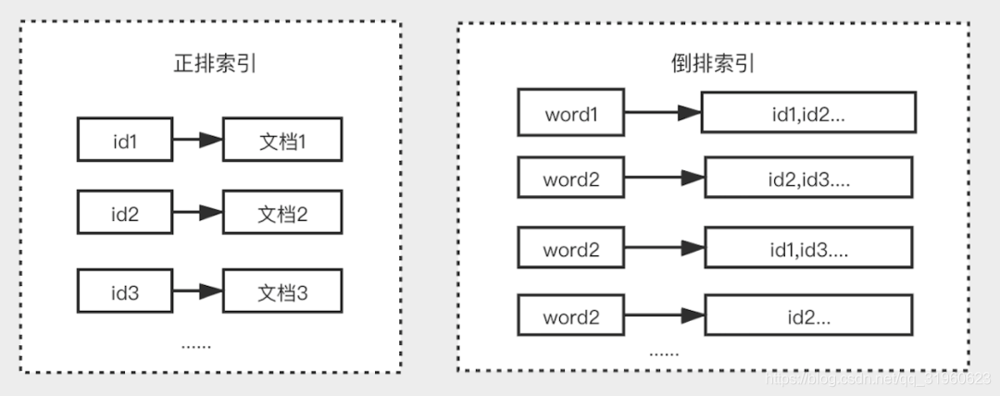
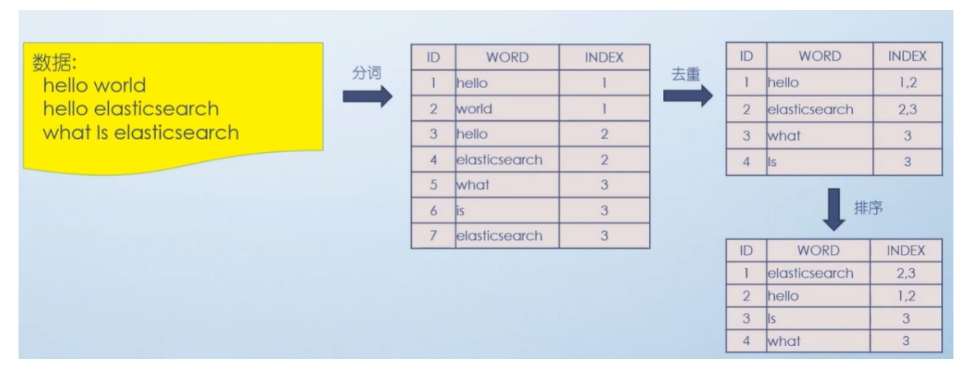
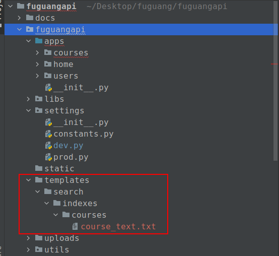

# elasticsearch

Elasticsearch是一个基于[Lucene](https://baike.baidu.com/item/Lucene/6753302)的搜索服务器，也是属于NoSQL阵营的数据库。它提供了一个分布式多用户能力的[全文搜索引擎](https://baike.baidu.com/item/全文搜索引擎/7847410)，基于RESTful web接口提供给我们操作的。Elasticsearch是用Java语言开发的，并作为Apache许可条款下的开放源码发布，是一种流行的企业级搜索引擎。除了es以外， Sphinx 、迅搜、Zebra、Solr 、Whoosh。 

官网：https://www.elastic.co/cn/elasticsearch/

中文文档：https://www.elastic.co/guide/cn/index.html

最新版本：8.0 版本。目前在市面上常用的版本是6.x和7.x，甚至是5.x。

## 安装elasticsearch

支持单点部署和集群部署。

```bash
# 从课件的素材中找到es的镜像压缩包，复制到ubuntu桌面下，执行以下命令
# sudo docker load -i ~/Desktop/elasticsearch.7.13.4.tar.gz
podman load -i ~/Desktop/elasticsearch.7.13.4.tar.gz
# 也可以不执行上面的操作，直接run可以让docker从官网拉取es镜像。

# sudo docker run --name elasticsearch --restart=always -d -p 9200:9200 -p 9300:9300 -e ES_JAVA_OPTS="-Xms256m -Xmx256m" -e "discovery.type=single-node" elasticsearch:7.13.4

podman run --name elasticsearch -d -p 9200:9200 -p 9300:9300 -e ES_JAVA_OPTS="-Xms512m -Xmx512m" -e "discovery.type=single-node" elasticsearch:7.13.4
```

参数说明

```
--name elasticsearch  
       设置当前容器的容器名称为elasticsearch
--restart=always
       设置容器开机自启，即便物理机关机重启了，docker在启动以后也会自动帮我们把当前容器启动起来。
-d     设置当前容器为守护式容器，在后台运行
-p 9200:9200
       设置端口影射，<物理机端口>:<容器端口>
       表示访问了当前物理机的9200，相当于访问了当前容器的9200端口
-p 9300:9300
       设置端口影射，<物理机端口>:<容器端口>
       表示访问了当前物理机的9300，相当于访问了当前容器的9300端口
-e ES_JAVA_OPTS="-Xms256m -Xmx256m"
       设置环境变量，变量名为ES_JAVA_OPTS,这个变量是启动elasticsearch的关键。
       表示设置java环境的最小和最大使用内存，内存不足，elasticsearch是无法启动的，所以此处设置为最小内存必须在256M以上
-e "discovery.type=single-node"
       设置环境变量，变量名discovery.type
       discovery.type 表示当前elasticsearch的运作模式为single-node，表示单机部署/单点部署
elasticsearch:7.13.4
       设置当前容器的镜像名和版本号
```

浏览器访问：http://127.0.0.1:9200

要基于es实现全文搜索，可以参考以下文档了解关于全文搜索的内容。

https://www.elastic.co/guide/cn/elasticsearch/guide/current/full-text-search.html

全文搜索的实现，必须依靠es内部调用分词器对语句进行词性分析，拆词，给每一个单词构建一个索引。

所以默认情况下，es只提供了标准分析器，和简单分析器，这几块分词器都是只能针对英文进行分词。


### IK中文分词器

默认情况下，elasticsearch是外国开发的，所以本身对于中文分词构建分词索引的支持是不行的。所以我们需要在elasticsearch软件中新增一个支持中文索引和中文分词的插件，叫ik分词器。

注意：IK分词器插件的版本必须与elasticsearch的版本号同步。否则安装失败！

文档：https://github.com/medcl/elasticsearch-analysis-ik/releases

把IK分词器解压并复制到elasticsearch容器的/usr/share/elasticsearch/plugins目录下

```bash
unzip ~/Desktop/elasticsearch-analysis-ik-7.13.4.zip -d ~/Desktop/ik-7.13.4
podman cp ~/Desktop/ik-7.13.4 elasticsearch:/usr/share/elasticsearch/plugins
podman stop elasticsearch
podman start elasticsearch
```

注意：elasticsearch内部极其复杂，所以启动容器以后需要等待1分钟左右才对外提供搜索服务。

接下来，我们就可以通过postman测试。

注意：es提供的9200是restful api接口的端口，以http形式访问，9300端口是Api对服务器的管理端口。

post http://127.0.0.1:9200/_analyze?pretty

基于智能分词模式来查询分析词性，json数据

```json
{
   "analyzer":"ik_smart",
   "text":"我是中国人"    
}
```

基于最大分词模式来查询分析词性，json数据

```json
{
   "analyzer":"ik_max_word",
   "text":"我是中国人"  
}
```


### elasticsearch-head

elasticsearch-head 是用于监控 Elasticsearch 状态的客户端插件，包括数据可视化、执行增删改查操作等。不过开发中，我们一般使用elasticsearch-head来查看elasticsearch的数据而已，真正对elasticsearch进行增删查改操作一般我们使用kibana或者postman或者编程语言实现的客户端来完成。

我们可以通过docker安装elasticsearch-head来对Elasticsearch 进行界面化管理。

```bash
# 拉取镜像
# sudo docker pull mobz/elasticsearch-head:5
podman pull mobz/elasticsearch-head:5

# 创建容器
# sudo docker create --name elasticsearch-head -p 9100:9100 mobz/elasticsearch-head:5
podman create --name elasticsearch-head -p 9100:9100 mobz/elasticsearch-head:5

# 启动容器
# sudo docker start elasticsearch-head
podman start elasticsearch-head
```

访问elasticsearch-head：http://127.0.0.1:9100/，会发现无法连接elasticsearch，原因是因为跨域问题导致。

解决方案就是修改容器elasticsearch中的elasticsearch.yml文件增加跨域支持即可。

```bash
# sudo docker cp elasticsearch:/usr/share/elasticsearch/config/elasticsearch.yml ~/Desktop/elasticsearch.yml
podman cp elasticsearch:/usr/share/elasticsearch/config/elasticsearch.yml ~/Desktop/elasticsearch.yml
```

修改elasticsearch.yml内容，增加跨域支持，如下：

```yaml
cluster.name: "docker-cluster"
network.host: 0.0.0.0
http.cors.enabled: true 
http.cors.allow-origin: "*"
```

把elasticsearch.yml文件再次复制到容器elasticsearch中，并重启容器elasticsearch。

```bash
# sudo docker cp ~/Desktop/elasticsearch.yml elasticsearch:/usr/share/elasticsearch/config/elasticsearch.yml
podman cp ~/Desktop/elasticsearch.yml elasticsearch:/usr/share/elasticsearch/config/elasticsearch.yml
```

修改容器elasticsearch-head的vendor.js让elasticsearch-head界面可以操作elasticsearch.  //未操作

```bash
# sudo docker cp elasticsearch-head:/usr/src/app/_site/vendor.js ~/Desktop/vendor.js
podman cp elasticsearch-head:/usr/src/app/_site/vendor.js ~/Desktop/vendor.js
```

修改vendor.js内容，把6886行与7573行所在的"application/x-www-form-urlencoded"替换成"application/json;charset=UTF-8"，并保存文件，复制回容器elasticsearch-head中。

```bash
# sudo docker cp ~/Desktop/vendor.js  elasticsearch-head:/usr/src/app/_site/vendor.js
podman cp ~/Desktop/vendor.js elasticsearch-head:/usr/src/app/_site/vendor.js
```

重启elasticsearch和elasticsearch-head容器

```bash
# sudo docker stop elasticsearch
# sudo docker start elasticsearch
podman stop elasticsearch
podman start elasticsearch

# sudo docker stop elasticsearch-head
# sudo docker start elasticsearch-head
podman stop elasticsearch-head
podman start elasticsearch-head
```


### kibana

Kibana是一个针对Elasticsearch的开源分析及可视化平台，用来搜索、查看交互存储在Elasticsearch索引中的数据。使用Kibana，可以通过各种图表进行高级数据分析及展示。

kibana的版本必须与Elasticsearch一致，所以我们安装的kibana也是7.13.4版本。

```bash
# sudo docker pull kibana:7.13.4
# sudo docker run -d --name kibana -e ELASTICSEARCH_URL=http://127.0.0.1:9200 -p 5601:5601 --restart=always kibana:7.13.4

podman pull kibana:7.13.4
podman run -d --name kibana -p 5601:5601 kibana:7.13.4
```

修改让kibana能访问到Elasticsearch并完成汉化操作

```bash
# sudo docker exec -it kibana bash
podman  exec -it kibana bash
vi config/kibana.yml
```

kibana.yml中的内容需改如下：

```yaml
#
# ** THIS IS AN AUTO-GENERATED FILE **
#

# Default Kibana configuration for docker target
server.host: "0.0.0.0"
# 注意：此处的IP地址替换为网卡地址，不能使用127.0.0.1或localhost，否则无法访问，可以通过ip a来查看
elasticsearch.hosts: [ "http://IP地址:9200" ]
monitoring.ui.container.elasticsearch.enabled: true
i18n.locale: "zh-CN"
```

修改完成以后，退出当前kibana容器，并重启kibana容器即可。

```bash
# sudo docker stop kibana
# sudo docker start kibana
podman stop kibana
podman start kibana
```

等待1分钟左右，打开浏览器直接访问http://127.0.0.1:5601，即可。


## 快速入门

### 核心概念

Elasticsearch是面向文档的，以json格式存储数据的NoSQL数据库，也是一个全文搜索引擎。

|  Elasticsearch   |  关系型数据库（如Mysql）  |
| :--------------: | :-----------------------: |
|  索引（Index）   |    数据库（Database）     |
|   类型（Type）   |        表（Table）        |
| 文档（Document） |  行，记录（Row，Record）  |
|  字段（Field）   | 列，字段（Column，Field） |
| 映射（Mapping）  |      约束（Schema）       |

注意：es中的类型在es7.x版本中已经没有，在后面的8.x版本中被彻底删除掉。

### 倒排索引

倒排索引（Inverted Index），是Elasticsearch中的索引工作机制。倒排索引是区别于正排索引的概念：

- **正排索引**：是以文档对象的唯一ID作为索引，以文档内容作为记录。
- **倒排索引**：指的是将文档内容中的单词作为索引，将包含该词的文档ID作为记录。



Elasticsearch的工作流程如下，因为使用倒排索引产生的文档记录要比mysql数据行少多了，所以会比较快。



### 基本使用

es提供了retfulAPI风格操作接口给开发者对索引、类型、文档、字段、映射等进行增删查改操作。

#### 索引操作

##### 创建索引

请求格式：

```json
PUT /索引名称
```


###### 类型映射[了解]

相当于在mysql中创建数据表时的字段类型

```json
# 索引名称必须已经存在！
POST /索引名称/类型名称
{
    "类型名称": { // 映射的类型名称
        "properties": {  // 索引中文档的属性
            "字段名": {           // 属性名或字段名
                "type": "text"   // 属性值类型或字段类型,text表示文本，如商品标题
                "index": "analyzed",    // 索引类型
                "analyzer": "ik_smart"  // 设置使用的分词器[标准分词]
            },
            "字段名": {           // 属性名或字段名
                "type": "text"   // 属性值类型或字段类型,text表示文本，如商品标题
                "index": "analyzed",    // 索引类型
                "analyzer": "standard"  // 设置使用的分词器
            },
            "字段名": {           // 属性名或字段名
                "type": "text"   // 属性值类型或字段类型,text表示文本，如商品标题
                "index": "analyzed",    // 索引类型
                "analyzer": "standard"  // 设置使用的分词器
            }
        }
    }
}
```

kinana操作：

```json
POST /indexes1/goods
{
  "z": {
    "properties": {
      "id": {
        "type": "long"
      },
      "name": {
        "type": "text",
        "index": "analyzed",
        "analyzer": "ik_max_word"
      },
      "price":{
        "type": "float"
      },
      "created_time":{
          "type": "date",
          "format":"yyyy-MM-dd HH:mm:ss"
      }
    }
  }
}
```

###### 数据类型[了解]

elasticsearch中支持的常见字段数据类型：

| 类型        | 描述                                                         |
| ----------- | ------------------------------------------------------------ |
| **text**    | 字符串类型，可以模糊查询, 可以分词查询，不能聚合、排序       |
| **keyword** | 字符串类型，只能精准查询, 不能分词查询，可以聚合、排序       |
| **long**    | 有符号的64位整数, 范围:[−2<sup>63</sup> ~ 2<sup>63</sup>-1]  |
| **Integer** | 有符号的32位整数, 范围: [−2<sup>31</sup> ~ 2<sup>31</sup>-1] |
| short       | 有符号的16位整数, 范围: [-32768 ~ 32767]                     |
| byte        | 有符号的8位整数, 范围: [-128 ~ 127]                          |
| **float**   | 32位单精度浮点数                                             |
| double      | 64位双精度浮点数                                             |
| **boolean** | 布尔类型，支持使用字符串，数字等零值表示true/false           |
| **date**    | 日期类型，                                                   |
| date_nanos  | 日期纳秒类型，                                               |
| binary      | 二进制类型，Base64编码字符串的二进制值                       |
| **Range**   | 范围类型，有integer_range`, `float_range`, `long_range`, `double_range`, `date_range等 |
| **array**   | 数组类型，ES中没有专门的数组类型, 直接使用[ ]定义即可，所有的成员的值必须是同一种数据类型 |
| **object**  | 对象类型，以json对象为结构                                   |


使用默认类型_doc代替映射的创建，es会内部自动推断字段类型。

```json
PUT /indexes2/_doc/文档ID
{
    "name": "商品的标题",
    "price": 18,
    "created_time": "2022-01-10 22:00:31"
}
```

`_doc` 就是默认类型（default type），type在8.x版本会被彻底删除，以后使用默认类型`_doc`替代即可。

##### 查看索引

```bash
GET /_cat/indices      # 查看所有的索引信息
GET /索引名称           # 查看指定名称的索引信息
```

##### 删除索引

```json
DELETE /索引名称
```


#### 文档操作

| 请求方法/method  | uri地址                         | 描述                                                      |
| ---------------- | ------------------------------- | --------------------------------------------------------- |
| PUT（创建,修改） | `/索引名称/_doc/文档id`         | 创建文档（指定文档id）                                    |
| POST（创建）     | `/索引名称/_doc/文档id`         | 创建文档，如果uri地址只是以_doc结尾，文档id是随机生成的） |
| POST（修改）     | `/索引名称/_doc/文档id/_update` | 修改文档                                                  |
| DELETE（删除）   | `/索引名称/_doc/文档id`         | 删除文档                                                  |
| GET（查询）      | `/索引名称/_doc/文档id`         | 查询文档通过文档ID                                        |
| POST（查询）     | `/索引名称/_doc/文档id/_search` | 查询所有数据                                              |

##### 添加文档

```bash
POST /索引名称/_doc
{
	"id": 1,
    "name": "华为手机",
    "category": "华为",
    "cover": "1.png",
    "price": "3999.00"
}
```


##### 修改文档

```bash
POST /索引名称/_doc/1
{
    "name": "华为手机mate40",
    "price": "4999.00"
}
```


##### 删除文档

```bash
DELETE /索引名称/_doc/1
```


##### 查询文档

查询文档有三种方式：

- 主键查询：根据文档id查询
- 精确查询：根据关键词查询，也叫term查询    浪潮之巅 -> 浪潮之巅
- 匹配查询：根据输入的内容先对内容进行分词，再进行分词匹配查询   浪潮 -> 浪潮之巅

###### 准备数据

```bash
POST /indexes4/_doc/1
{
  "created_time":"2022-04-01",
  "title":"浪潮之巅",
  "content":"一部IT人非读不可，而非IT人也应该阅读的作品，讲故事的经典作品",
  "author_id": 119
}

POST /indexes4/_doc/2
{
  "post_date":"2022-03-12",
  "title":"人月神话",
  "content":"一部IT人非读不可，而非IT人也应该阅读的作品，讲人与团队关系作品",
  "author_id": 120
}

POST /indexes4/_doc/3
{
  "post_date":"2021-12-16",
  "title":"代码之髓",
  "content":"小日子过得不错的人写的作品，对代码中各种语言结构的实现进行揭秘",
  "author_id": 110
}
```


###### 主键查询

```bash
# GET /索引名称/_doc/1
GET /indexes4/_doc/3
```


###### 精确查询

```json
POST /索引名称/_search

{
	"query": {
		"term": {
			"字段名": {
			    "value": "字段值"
			},
			"字段名": {
			    "value": "字段值"
			}
		}
	}
}

# 如果是text格式，无法精确查询的，只能匹配查询
```

kibana操作：

```bash
POST /indexes4/_search
{
	"query": {
		"term": {
			"author_id": {
			    "value": 119
			}
		}
	}
}
```


###### 匹配查询

**查询所有**

```bash
POST /索引名称/_search
{
    "query": {
        "match_all": {}
     },
     "sort": [  # 排序，注意：text无法使用排序，keyword才支持
          # {"字段名":"排序规则,asc正序, desc倒序"}
          {"title": "asc" }
     ],
      "from": 0,                       # 分页，查询起始下标
      "size": 2,                       # 指定返回结果数量
      "_source": ["title", "content"]  # 指定只返回部分字段
}
```

kibana操作：

```bash
POST /indexes4/_search
{
  "query": {
    "match_all": {}
  },
  "sort": {
    "author_id": "desc"
  },
  "from": 0,
  "size": 4,
  "_source": ["title"]
}

```


**条件查询**

格式：

```json
POST /索引名称/_search
{
    "query": {
        "match": {
          "字段名": "查询条件值"
        }
    }
}
```


```bash
POST /indexes4/_search
{
    "query": {
        "match": {
          "content": "非读不可"
        }
    }
}
```


## 集成ES到服务端项目

### 安装haystack

django-> mysql --> ORM

dango-> haystack --> ORM

haystack是django的开源搜索框架，能够结合目前市面上大部分的搜索引擎用于实现自定义搜索功能，特别是全文搜索。

haystack支持多种搜索引擎，不仅仅是 jieba ，whoosh，使用solr、elasticsearch等搜索，也可通过haystack，而且直接切换引擎即可，甚至无需修改搜索代码。中文分词最好的就是jieba和elasticsearch+ik。

github： https://github.com/rhblind/drf-haystack

```bash
# python操作elasticsearch的模块，注意对应版本，类似pymysql
pip install -U elasticsearch==7.13.4
# django开发的haystack的模块，务必先安装drf`-haystack，接着才安装django-haystack。因为drf-haystack不支持es7
pip install -U drf-haystack
pip install -U django-haystack
```


### 基本使用

#### 安装配置

文档：https://drf-haystack.readthedocs.io/en/latest/01_intro.html#examples

```python
INSTALLED_APPS = [
	# 必须在自己创建的子应用前面
	'haystack',

	# 自己创建的子应用
]

# haystack连接elasticsearch的配置信息
HAYSTACK_CONNECTIONS = {
    'default': {
        # haystack操作es的核心模块
        'ENGINE': 'haystack.backends.elasticsearch7_backend.Elasticsearch7SearchEngine',
        # es服务端地址
        'URL': 'http://127.0.0.1:9200/',
        # es索引仓库
        'INDEX_NAME': 'haystack',
    },
}

# 当mysqlORM操作数据库改变时，自动更新es的索引，否则es的索引会找不到新增的数据
HAYSTACK_SIGNAL_PROCESSOR = 'haystack.signals.RealtimeSignalProcessor'
```


#### 索引模型

在courses子应用下创建search_indexes.py，用于设置es的索引模型。注意，索引模型的文件名必须是search_indexes。

```python
from haystack import indexes
from .models import Course

class CourseIndex(indexes.SearchIndex, indexes.Indexable):
    # 全文索引[可以根据配置，可以包括多个字段索引]
    # document=True 表示当前字段为全文索引
    # use_template=True 表示接下来haystack需要加载一个固定路径的html模板文件，让text与其他索引字段绑定映射关系
    text = indexes.CharField(document=True, use_template=True)
    # 普通索引[单字段，只能提供单个字段值的搜索，所以此处的声明更主要是为了提供给上面的text全文索引使用的]
    # es索引名 = indexes.索引数据类型(model_attr="ORM中的字段名")
    id = indexes.IntegerField(model_attr="id")
    name = indexes.CharField(model_attr="name")
    description = indexes.CharField(model_attr="description")
    teacher = indexes.CharField(model_attr="teacher__name")
    course_cover = indexes.CharField(model_attr="course_cover")
    get_level_display=indexes.CharField(model_attr="get_level_display")
    students=indexes.IntegerField(model_attr="students")
    get_status_display=indexes.CharField(model_attr="get_status_display")
    lessons=indexes.IntegerField(model_attr="lessons")
    pub_lessons=indexes.IntegerField(model_attr="pub_lessons")
    price=indexes.DecimalField(model_attr="price")
    discount=indexes.CharField(model_attr="discount_json")
    orders=indexes.IntegerField(model_attr="orders")

    # 指定与当前es索引模型对接的mysql的ORM模型
    def get_model(self):
        return Course

    # 当用户搜索es索引时，对应的提供的mysql数据集有哪些？
    def index_queryset(self, using=None):
        return self.get_model().objects.filter(is_deleted=False,is_show=True)


```


##### ORM模型中新增discount_json字段方法

courses.models，代码：

```python
import json


class Course(BaseModel):
    course_type = (
        (0, '付费购买'),
        (1, '会员专享'),
        (2, '学位课程'),
    )
    level_choices = (
        (0, '初级'),
        (1, '中级'),
        (2, '高级'),
    )
    status_choices = (
        (0, '上线'),
        (1, '下线'),
        (2, '预上线'),
    )
    # course_cover = models.ImageField(upload_to="course/cover", max_length=255, verbose_name="封面图片", blank=True, null=True)
    course_cover = StdImageField(variations={
        'thumb_1080x608': (1080, 608),   # 高清图
        'thumb_540x304': (540, 304),    # 中等比例,
        'thumb_108x61': (108, 61, True),  # 小图(第三个参数表示保持图片质量),
    }, max_length=255, delete_orphans=True, upload_to="course/cover", null=True, verbose_name="封面图片",blank=True)

    course_video = models.FileField(upload_to="course/video", max_length=255, verbose_name="封面视频", blank=True, null=True)
    course_type = models.SmallIntegerField(choices=course_type,default=0, verbose_name="付费类型")
    level = models.SmallIntegerField(choices=level_choices, default=1, verbose_name="难度等级")
    description = RichTextUploadingField(null=True, blank=True, verbose_name="详情介绍")
    pub_date = models.DateField(auto_now_add=True, verbose_name="发布日期")
    period = models.IntegerField(default=7, verbose_name="建议学习周期(day)")
    attachment_path = models.FileField(max_length=1000, blank=True, null=True, verbose_name="课件路径")
    attachment_link = models.CharField(max_length=1000, blank=True, null=True, verbose_name="课件链接")
    status = models.SmallIntegerField(choices=status_choices, default=0, verbose_name="课程状态")
    students = models.IntegerField(default=0, verbose_name="学习人数")
    lessons = models.IntegerField(default=0, verbose_name="总课时数量")
    pub_lessons = models.IntegerField(default=0, verbose_name="已更新课时数量")
    price = models.DecimalField(max_digits=10,decimal_places=2, verbose_name="课程原价",default=0)
    recomment_home_hot = models.BooleanField(default=False, verbose_name="是否推荐到首页新课栏目")
    recomment_home_top = models.BooleanField(default=False, verbose_name="是否推荐到首页必学栏目")
    direction = models.ForeignKey("CourseDirection", related_name="course_list", on_delete=models.DO_NOTHING, null=True, blank=True, db_constraint=False, verbose_name="学习方向")
    category = models.ForeignKey("CourseCategory", related_name="course_list", on_delete=models.DO_NOTHING, null=True, blank=True, db_constraint=False, verbose_name="课程分类")
    teacher = models.ForeignKey("Teacher", related_name="course_list", on_delete=models.DO_NOTHING, null=True, blank=True, db_constraint=False, verbose_name="授课老师")

    class Meta:
        db_table = "fg_course_info"
        verbose_name = "课程信息"
        verbose_name_plural = verbose_name

    def __str__(self):
        return "%s" % self.name

    def course_cover_small(self):
        if self.course_cover:
            return mark_safe(f'')
        return ""

    course_cover_small.short_description = "封面图片(108x61)"
    course_cover_small.allow_tags = True
    course_cover_small.admin_order_field = "course_cover"

    def course_cover_medium(self):
        if self.course_cover:
            return mark_safe(f'')
        return ""

    course_cover_medium.short_description = "封面图片(540x304)"
    course_cover_medium.allow_tags = True
    course_cover_medium.admin_order_field = "course_cover"

    def course_cover_large(self):
        if self.course_cover:
            return mark_safe(f'')
        return ""

    course_cover_large.short_description = "封面图片(1080x608)"
    course_cover_large.allow_tags = True
    course_cover_large.admin_order_field = "course_cover"

    @property
    def discount(self):
        # todo 将来通过计算获取当前课程的折扣优惠相关的信息
        import random
        return {
            "type": ["限时优惠","限时减免"].pop(random.randint(0,1)), # 优惠类型
            "expire": random.randint(100000, 1200000),  #  优惠倒计时
            "price": float(self.price - random.randint(1,10) * 10),  # 优惠价格   //
        }

    def discount_json(self):
        # 必须转成字符串才能保存到es中。所以该方法提供给es使用的。
        return json.dumps(self.discount)

```


##### 全文索引字段模板

全文索引模板必须先配置django项目中的TEMPLATES模板引擎，而且全文索引模板的路径必须是模板目录下的`search/indexes/子应用目录名/模型类名_text.txt`。否则报错。settings.dev，代码：

```python
TEMPLATES = [
    {
        'BACKEND': 'django.template.backends.django.DjangoTemplates',
        'DIRS': [
            BASE_DIR / "templates",  # BASE_DIR 是apps的父级目录，是主应用目录，templates需要手动创建
        ],
        'APP_DIRS': True,
        'OPTIONS': {
            'context_processors': [
                'django.template.context_processors.debug',
                'django.template.context_processors.request',
                'django.contrib.auth.context_processors.auth',
                'django.contrib.messages.context_processors.messages',
            ],
        },
    },
]
```

创建全文索引字段的html模板，在HTML模板中采用django的模板语法，绑定text与其他es单字段索引的映射关系。




注意：course_text.txt 中course就是ORM模型类名小写，text就是es索引模型类中的全文索引字段名。

templates/search/indexes/courses/course_text.txt。代码：

```python
{{ object.name }}
{{ object.description }}
{{ object.teacher.name }}
{{ object.category.name }}
{{ object.diretion.name }}
```

object表示当前orm的模型对应。

#### 索引序列化器

courses.serializers，代码：

```python
from drf_haystack.serializers import HaystackSerializer
from .search_indexes import CourseIndex
from django.conf import settings

class  CourseIndexHaystackSerializer(HaystackSerializer):
    """课程搜索的序列化器"""
    class Meta:
        index_classes = [CourseIndex]
        fields = ["text", "id", "name", "course_cover", "get_level_display", "students", "get_status_display", "pub_lessons", "price", "discount", "orders"]
		
    # 2 使用阿里云oss 存储图片 时候 代码
    def to_representation(self, instance):
        """用于指定返回数据的字段的"""
        # 课程的图片，在这里通过elasticsearch提供的，所以不会提供图片地址左边的域名的。因此在这里手动拼接
        instance.course_cover = f'//{settings.OSS_BUCKET_NAME}.{settings.OSS_ENDPOINT}/uploads/{instance.course_cover}'
        return super().to_representation(instance)
    # 1 未使用阿里云oss 时候课堂里的代码   
    def to_representation(self, instance):
        """用于指定返回数据的字段的"""
        # 课程的图片，在这里通过elasticsearch提供的，所以不会提供图片地址左边的域名的。因此在这里手动拼接
        instance.course_cover = f'//{self.context["request"]._request.META["HTTP_HOST"]}/uploads/{instance.course_cover}'
        return super().to_representation(instance)
```


#### 全文搜索的索引视图

courses.views

```python
from drf_haystack.viewsets import HaystackViewSet
from drf_haystack.filters import HaystackFilter
from .serializers import CourseIndexHaystackSerializer
from .models import Course

class CourseSearchViewSet(HaystackViewSet):
    """课程信息全文搜索视图类"""
    # 指定本次搜索的最终真实数据的保存模型
    index_models = [Course]
    serializer_class = CourseIndexHaystackSerializer
    filter_backends = [OrderingFilter, HaystackFilter]
    ordering_fields = ('id', 'students', 'orders')
    pagination_class = CourseListPageNumberPagination
```


#### 路由

courses.urls

```python
from django.urls import path,re_path
from . import views

from rest_framework import routers
router = routers.DefaultRouter()
# 注册全文搜索到视图集中生成url路由信息
router.register("search", views.CourseSearchViewSet, basename="course-search")

urlpatterns = [
    path("directions/", views.CourseDirectionListAPIView.as_view()),
    re_path("^categories/(?P<direction>\d+)/$", views.CourseCategoryListAPIView.as_view()),
    re_path("^(?P<direction>\d+)/(?P<category>\d+)/$", views.CourseListAPIView.as_view()),
] + router.urls
```


#### 手动构建es索引

因为此前mysql中已经有了部分的数据，而这部分数据在es中是没有创建索引。所以需要先把之前的数据同步生成全文索引。在终端下执行以下命令

```bash
# 重建索引
python manage.py rebuild_index

# 更新索引
# python manage.py update_index --age=<num_hours>

# 删除索引
# python manage.py clear_index
```

访问

http://api.luffycity.cn:8000/courses/search/?text=入门

http://api.luffycity.cn:8000/courses/search/?text=李老师

提交代码版本：

```bash
cd ~/Desktop/luffycity
git add .
git commit -m "feature: 集成elasticsearch到项目中提供全文搜索"
git push origin feature/course
```


## 客户端实现课程全文搜索

api/course.js，代码：

```javascript
import http from "../utils/http";
import {reactive, ref} from "vue";

const course = reactive({
    // 其他代码省略....
    text: "",         // 搜索文本框内容
    // 中间代码省略....
    search_course() {
        // 课程搜索
        let params = {
            page: this.page,
            size: this.size,
            text: this.text,
        }
        if (this.ordering) {
            params['ordering'] = this.ordering
        }
        return http.get(`/courses/search`, {
            params,
        })
    }
});

export default course;
```

views/Course.vue，代码：

```vue
                <div class="actual-header-search">
                    <div class="search-inner">
                        <input class="actual-search-input" v-model="course.text" placeholder="搜索感兴趣的实战课程内容" type="text" autocomplete="off">
                        
                    </div>
                    <div class="actual-searchtags">
                    </div>
                    <div class="search-hot">
                        <span>热搜：</span>
                        <a href="">Java工程师</a>
                        <a href="">Vue</a>
                    </div>
                </div>
```

```vue
<script setup>
import {watch} from "vue";
import Header from "../components/Header.vue"
import Footer from "../components/Footer.vue"
import course from "../api/course";
import {fill0} from "../utils/func";
course.get_course_direction().then(response=>{
  // 获取学习方向
  course.direction_list = response.data;
})


const get_category = ()=>{
  // 获取课程分类

  // 重置当前选中的课程分类
  course.current_category=0;

  course.get_course_category().then(response=>{
    course.category_list = response.data;
  })
}

get_category();

const get_course_list = ()=>{
  // 获取课程列表
  let ret  = null // 预设一个用于保存服务端返回的数据
  if(course.text) {
    ret = course.search_course()
  }else{
    ret = course.get_course_list()
  }
  ret.then(response=>{
    course.course_list = response.data.results;
    // 总数据量
    course.count = response.data.count;
    course.has_perv = !!response.data.previous; // !!2个非表示把数据转换成布尔值
    course.has_next = !!response.data.next;

    // 优惠活动的倒计时
    course.start_timer();
  })
}

get_course_list();

watch(
    // 监听切换不同的学习方向
    ()=> course.current_direction,
    ()=>{
        // 重置搜索文本框
        course.text = "";
        // 重置页码
        course.page = 1;
        // 重置排序条件
        course.ordering = "-id";

        get_category();
        get_course_list();
    }
)

watch(
    // 监听切换不同的课程分类
    ()=> course.current_category,
    ()=>{
        // 重置搜索文本框
        course.text = "";
        // 重置页码
        course.page = 1;
        // 重置排序条件
        course.ordering = "-id";
        get_course_list();
    }
)

watch(
    // 监听课程切换不同的排序条件
    ()=>course.ordering,
    ()=>{
        // 重置页码
        course.page = 1;
        get_course_list();
    }
)

// 监听页码
watch(
    ()=>course.page,
    ()=>{
        // 重新获取课程信息
        get_course_list();
    }
)

</script>
```

提交代码版本：

```bash
cd ~/Desktop/luffycity
git add .
git commit -m "feature: 客户端实现课程信息全文搜搜"
git push origin feature/course
```


## 热门搜索关键字

### 服务端实现搜索关键字的api接口

在用户搜索课程内容时，提供一个单独的redis仓库使用zset有序集合进行存储热门关键字.

settings/dev.py，代码：

```python
# redis configration
# 设置redis缓存
CACHES = {
    # 默认缓存
    "default": {
        "BACKEND": "django_redis.cache.RedisCache",
        # 项目上线时,需要调整这里的路径
        # "LOCATION": "redis://:密码@IP地址:端口/库编号",
        "LOCATION": "redis://:@127.0.0.1:6379/0",
        "OPTIONS": {
            "CLIENT_CLASS": "django_redis.client.DefaultClient",
            "CONNECTION_POOL_KWARGS": {"max_connections": 10},  # 连接池
        }
    },
    # 提供给admin运营站点的session存储
    "session": {
        "BACKEND": "django_redis.cache.RedisCache",
        "LOCATION": "redis://:@127.0.0.1:6379/1",
        "OPTIONS": {
            "CLIENT_CLASS": "django_redis.client.DefaultClient",
            "CONNECTION_POOL_KWARGS": {"max_connections": 10},
        }
    },
    # 提供存储短信验证码
    "sms_code": {
        "BACKEND": "django_redis.cache.RedisCache",
        "LOCATION": "redis://:@127.0.0.1:6379/2",
        "OPTIONS": {
            "CLIENT_CLASS": "django_redis.client.DefaultClient",
            "CONNECTION_POOL_KWARGS": {"max_connections": 10},
        }
    },
    # 提供存储搜索热门关键字
    "hot_word": {
        "BACKEND": "django_redis.cache.RedisCache",
        "LOCATION": "redis://:@127.0.0.1:6379/3",
        "OPTIONS": {
            "CLIENT_CLASS": "django_redis.client.DefaultClient",
        }
    },
}
```


constants.py中，配置有序集合中代表了课程搜索的key值。utils/constants.py，代码：

```python
# 设置热门搜索关键字在redis中的key前缀名称
DEFAULT_HOT_WORD = "hot_word"
# 设置返回的热门搜索关键字的数量
HOT_WORD_LENGTH = 5
# 设置热门搜索关键字的有效期时间[单位：天]
HOT_WORD_EXPIRE = 7
```

视图代码中，在用户每次搜索内容时给对应的搜索关键字增加搜索权重[score]，`courses/views.py`，代码：

```python
import constants
from datetime import datetime
from drf_haystack.viewsets import HaystackViewSet
from drf_haystack.filters import HaystackFilter
from django_redis import get_redis_connection
from .serializers import CourseIndexHaystackSerializer
from .models import Course


class CourseSearchViewSet(HaystackViewSet):
    """课程信息全文搜索视图类"""
    # 指定本次搜索的最终真实数据的保存模型
    index_models = [Course]
    serializer_class = CourseIndexHaystackSerializer
    filter_backends = [OrderingFilter, HaystackFilter]
    ordering_fields = ('id', 'students', 'orders')
    pagination_class = CourseListPageNumberPagination

    def list(self, request, *args, **kwargs):
        # 保存本次搜索的关键字
        redis = get_redis_connection("hot_word")
        text = request.query_params.get("text")
        if text:
            key = f"{constants.DEFAULT_HOT_WORD}:{datetime.now().strftime('%Y:%m:%d')}"
            is_exists = redis.exists(key)
            redis.zincrby(key, 1, text)  # 让有序集合中的text搜索关键字次数+1，如果该关键字第一次出现，则为1
            if not is_exists:
                redis.expire(key, constants.HOT_WORD_EXPIRE * 24 * 3600)

        return super().list(request, *args, **kwargs)

```

服务端编写视图提供热门搜索关键字列表的api接口，`courses/views.py`，代码：

```python

from rest_framework.views import APIView
from rest_framework.response import Response
from datetime import datetime, timedelta


class HotWordAPIView(APIView):
    """搜索热词"""
    def get(self, request):
        redis = get_redis_connection("hot_word")
        # 获取最近指定天数的热词的key
        date_list = []
        for i in range(0, constants.HOT_WORD_EXPIRE):
            day = datetime.now() - timedelta(days=i)
            full_month = day.month if day.month >= 10 else f"0{day.month}"
            full_day = day.day if day.day >= 10 else f"0{day.day}"
            key = f"{constants.DEFAULT_HOT_WORD}:{day.year}:{full_month}:{full_day}"
            date_list.append(key)

        # 先删除原有的统计最近几天的热搜词的有序统计集合
        redis.delete(constants.DEFAULT_HOT_WORD)
        # ZUNIONSTORE hot_word 7 "hot_word:2021:11:22" "hot_word:2021:11:21"  "hot_word:2021:11:20" "hot_word:2021:11:19" "hot_word:2021:11:18" "hot_word:2021:11:17" "hot_word:2021:11:16"
        # 根据date_list找到最近指定天数的所有集合，并完成并集计算，产生新的有序统计集合constants.DEFAULT_HOT_WORD
        redis.zunionstore(constants.DEFAULT_HOT_WORD, date_list, aggregate="sum")
        # 按分数store进行倒序显示排名靠前的指定数量的热词
        word_list = redis.zrevrange(constants.DEFAULT_HOT_WORD, 0, constants.HOT_WORD_LENGTH-1)
        return Response(word_list)

```

路由，`course.urls`，代码：

```python
from django.urls import path,re_path
from . import views

from rest_framework import routers
router = routers.DefaultRouter()
# 注册全文搜索到视图集中生成url路由信息
router.register("search", views.CourseSearchViewSet, basename="course-search")

urlpatterns = [
    path("directions/", views.CourseDirectionListAPIView.as_view()),
    re_path("^categories/(?P<direction>\d+)/$", views.CourseCategoryListAPIView.as_view()),
    re_path("^(?P<direction>\d+)/(?P<category>\d+)/$", views.CourseListAPIView.as_view()),
    path("hot_word/", views.HotWordAPIView.as_view()),
] + router.urls

```

提交代码版本：

```bash
cd ~/Desktop/luffycity
git add .
git commit -m "feature: 服务端实现搜索关键字的记录以及提供搜索关键字列表的API接口"
git push origin feature/course
```


### 客户端显示热门搜索关键字

`api/course.js`，代码：

```javascript
import http from "../utils/http";
import {reactive, ref} from "vue";

const course = reactive({
    // .... 中间代码省略
    hot_word_list: [],// 热搜词列表
    // .... 中间代码省略
    get_hot_word(){
        // 课程热搜关键字
        return http.get("/courses/hot_word")
    }
});

export default course;
```

`views/Course.vue`，代码：

```vue
                <div class="actual-header-search">
                    <div class="search-inner">
                        <input class="actual-search-input" v-model="course.text" placeholder="搜索感兴趣的实战课程内容" type="text" autocomplete="off">
                        
                    </div>
                    <div class="actual-searchtags">
                    </div>
                    <div class="search-hot">
                        <span>热搜：</span>
                        <a href="" @click.stop.prevent="search_by_hotword(hot_word)" v-for="hot_word in course.hot_word_list">{{hot_word}}</a>
                    </div>
                </div>
```

```vue
<script setup>
import {reactive,ref, watch} from "vue"
import Header from "../components/Header.vue"
import Footer from "../components/Footer.vue"
import course from "../api/course";
import {fill0} from "../utils/func";


// 获取学习方向的列表数据
course.get_course_direction().then(response=>{
  course.direction_list = response.data;
})


// 获取课程分类的列表数据
const get_category = ()=>{
  // 获取课程分类
  course.get_course_category().then(response=>{
    course.category_list = response.data;
  })
}

get_category();


const get_hot_word = ()=>{
  // 搜索热门关键字列表
  course.get_hot_word().then(response=>{
    course.hot_word_list = response.data
  })
}


const get_course_list = ()=>{
  // 获取课程列表
  let ret  = null // 预设一个用于保存服务端返回的数据
  if(course.text) {
    ret = course.search_course()
  }else{
    ret = course.get_course_list()
  }

  ret.then(response=>{
    course.course_list = response.data.results;
    // 总数据量
    course.count = response.data.count;
    course.has_perv = !!response.data.previous; // !!2个非表示把数据转换成布尔值
    course.has_next = !!response.data.next;
    // 优惠活动的倒计时
    course.start_timer();
  })

  // 每次获取课程都同事获取一次热搜词列表
  get_hot_word();

}

get_course_list();


// 当热搜词被点击，进行搜索
const search_by_hotword = (hot_word)=>{
  course.text = hot_word
  get_course_list()
}


watch(
    // 监听当前学习方向，在改变时，更新对应方向下的课程分类与课程信息
    ()=> course.current_direction,
    ()=>{
        // 重置排序条件
        course.ordering = "-id";
        // 重置当前选中的课程分类
        course.current_category=0;
        get_category();
        get_course_list();
    }
)

watch(
    // 监听切换不同的课程分类，在改变时，更新对应分类下的课程信息
    ()=> course.current_category,
    ()=>{
        // 重置排序条件
        course.ordering = "-id";
        get_course_list();
    }
)


watch(
    // 监听课程切换不同的排序条件
    ()=>course.ordering,
    ()=>{
        get_course_list();
    }
)

// 监听页码
watch(
    ()=>course.page,
    ()=>{
        // 重新获取课程信息
        get_course_list();
    }
)


</script>
```

提交代码版本：

```bash
cd ~/Desktop/luffycity
git add .
git commit -m "feature: 客户端展示最近7天的热搜关键字列表并实现点击关键字自动搜索内容"
git push origin feature/course
```

