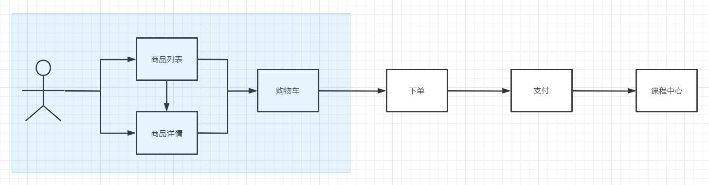

# 购物车实现



## 准备工作

### 创建子应用 cart

```
cd ~/Desktop/luffycity/
git checkout master
git merge feature/discount
git checkout -b feature/cart

cd luffycityapi/apps
python ../../manage.py startapp cart
```

### 注册子应用cart

`settings/dev.py`，配置文件

```python
INSTALLED_APPS = [
    'simpleui', # admin界面美化,必须写在admin上面
    'django.contrib.admin',
    'django.contrib.auth',
    'django.contrib.contenttypes',
    'django.contrib.sessions',
    'django.contrib.messages',
    'django.contrib.staticfiles',

    "rest_framework",  # 注意：记得加入 rest_framework
    'corsheaders',  # cors跨域子应用
    'ckeditor',   # 富文本编辑器
    'ckeditor_uploader',  # 富文本编辑器上传文件子用用
    'stdimage',  # 生成缩略图
    'haystack',  # 搜索引擎框架

    "home",
    'users',
    'courses',
    'cart',
]

```

#### 注册子应用到总路由

`cart/urls.py`，代码：

```python
from django.urls import path
from . import views
urlpatterns = [

]
```

`luffycityapi/urls.py`，总路由，代码：

```python
from django.contrib import admin
from django.urls import path,include,re_path

from django.conf import settings
from django.views.static import serve # 静态文件代理访问模块

urlpatterns = [
    path('admin/', admin.site.urls),
    re_path(r'uploads/(?P<path>.*)', serve, {"document_root": settings.MEDIA_ROOT}),
    path('ckeditor/', include('ckeditor_uploader.urls')),
    path('', include("home.urls")),
    path("users/", include("users.urls")),
    path("courses/", include("courses.urls")),
    path("cart/", include("cart.urls")),
]

```

因为购物车中的商品(课程)信息会经常被用户操作,所以为了减轻mysql服务器的压力,可以选择把购物车信息通过redis来存储.

### 配置信息

```python
# redis configration
# 设置redis缓存
CACHES = {
    # 默认缓存
    "default": {
        "BACKEND": "django_redis.cache.RedisCache",
        # 项目上线时,需要调整这里的路径
        # "LOCATION": "redis://:密码@IP地址:端口/库编号",
        "LOCATION": "redis://:@127.0.0.1:6379/0",
        "OPTIONS": {
            "CLIENT_CLASS": "django_redis.client.DefaultClient",
            "CONNECTION_POOL_KWARGS": {"max_connections": 10},  # 连接池
        }
    },
    # 提供给admin运营站点的session存储
    "session": {
        "BACKEND": "django_redis.cache.RedisCache",
        "LOCATION": "redis://:@127.0.0.1:6379/1",
        "OPTIONS": {
            "CLIENT_CLASS": "django_redis.client.DefaultClient",
            "CONNECTION_POOL_KWARGS": {"max_connections": 10},
        }
    },
    # 提供存储短信验证码
    "sms_code": {
        "BACKEND": "django_redis.cache.RedisCache",
        "LOCATION": "redis://:@127.0.0.1:6379/2",
        "OPTIONS": {
            "CLIENT_CLASS": "django_redis.client.DefaultClient",
            "CONNECTION_POOL_KWARGS": {"max_connections": 10},
        }
    },
    # 提供存储搜索热门关键字
    "hot_word": {
        "BACKEND": "django_redis.cache.RedisCache",
        "LOCATION": "redis://:@127.0.0.1:6379/3",
        "OPTIONS": {
            "CLIENT_CLASS": "django_redis.client.DefaultClient",
        }
    },
    # 提供存储购物车课程商品
    "cart": {
        "BACKEND": "django_redis.cache.RedisCache",
        "LOCATION": "redis://:@127.0.0.1:6379/4",
        "OPTIONS": {
            "CLIENT_CLASS": "django_redis.client.DefaultClient",
        }
    },
}
```


接下来购物车中要实现记录用户添加到购物车中的商品信息，存储数据应有以下内容:

```python
购物车中的商品数据的格式：
    *商品数量[因为目前的商品是课程，属于虚拟商品，所以没有数量的，如果以后做到真实商品，则必须有数量]
    商品id
    用户id
    商品勾选状态----> 在用户勾选了商品以后，该商品才会在下单结算阶段中出现。没勾选则会保留在购物车中，等下次购买。
    
五种数据类型
    hash哈希字典
        用户ID:{  # 使用哈希记录用户添加到购物车中的所有商品
            商品ID1: 商品数量,
            商品ID2: 商品数量,
        }
        用户ID：{商品1,商品2,....}  # 使用无需集合被勾选的商品列表
    list列表
        用户ID: [商品1, 商品,....] # 使用列表记录用户添加到购物车中的商品ID
        用户ID：{商品1,商品2,....}  # 使用无需集合被勾选的商品列表
    set集合
        键: {值1,值2,....}

经过比较可以发现没有一种数据类型完整有效的存储购物车数据，勉强可以保存的只有hash，但是hash默认情况下只会保存3种数据而已，当如果再需要保存1种，则可能需要花费更多的操作完成这个存储过程，所以我们完全使用redis的2种数据结构或多种数据结构来分别保存购物车相关数据

可以发现，上面5种数据类型中，哈希hash可以存储的数据量是最多的。因为购物车中的商品不需要顺序，反而需要在勾选的时候进行唯一的处理，所以选用set
当然，现在我们实现的在线教育商城只需要保存的字段只有：用户ID，商品ID，勾选状态即可。所以我们采用hash一种数据结构即可。

当前在线教育商城的购物车数据结构：
hash：
    键[用户ID]:{
        域[商品ID]:勾选状态,
        域[商品ID]:勾选状态,
        域[商品ID]:勾选状态,
        域[商品ID]:勾选状态,
    }

如果将来保存有数量的商品：
hash：
    键[用户ID]:{
        域[商品ID]:商品数量,
        域[商品ID]:商品数量,
        域[商品ID]:商品数量,
        域[商品ID]:商品数量,
    }
set:   
    键[用户ID]:{商品ID1,商品ID2....}
```


## 添加课程商品到购物车

视图提供添加商品到购物车的api接口，`cart/views.py`，代码：

```python
from rest_framework.views import APIView
from rest_framework.permissions import IsAuthenticated
from rest_framework.response import Response
from rest_framework import status
from django_redis import get_redis_connection
from courses.models import Course

# Create your views here.
class CartAPIView(APIView):
    permission_classes = [IsAuthenticated] # 保证用户必须时登录状态才能调用当前视图
    def post(self, request):
        """添加课程商品到购物车中"""
        # 1. 接受客户端提交的商品信息：用户ID，课程ID，勾选状态
        user_id = request.user.id
        course_id = request.data.get("course_id", None)
        selected = 1  # 默认商品是勾选状态的
        print(f"user_id={user_id},course_id={course_id}")

        # 2. 验证课程是否允许购买[is_show=True, is_deleted=False]
        try:
            # 判断课程是否存在
            # todo 判断用户是否已经购买了
            course = Course.objects.get(is_show=True, is_deleted=False, pk=course_id)
        except:
            return Response({"errmsg": "当前课程不存在！"}, status=status.HTTP_400_BAD_REQUEST)

        # 3. 添加商品到购物车
        redis = get_redis_connection("cart")
        """
        cart_用户ID: {
           课程ID: 1
        }
        """
        redis.hset(f"cart_{user_id}", course_id, selected)

        # 4. 获取购物车中的商品课程数量
        cart_total = redis.hlen(f"cart_{user_id}")

        # 5. 返回结果给客户端
        return Response({"errmsg": "成功添加商品课程到购物车！", "cart_total": cart_total}, status=status.HTTP_201_CREATED)
```

redis的异常处理[当然，我们前面已经完成了，如果没完成的小伙伴确认一下]，utils/exceptions.py，代码：

```python
from rest_framework.views import exception_handler
from django.db import DatabaseError
from redis import RedisError
from rest_framework.response import Response
from rest_framework import status

import logging
logger = logging.getLogger('django')

def custom_exception_handler(exc, context):
    """
    自定义异常处理工具函数
    :param exc: 异常类
    :param context: 抛出异常的执行上下文
    :return: Response响应对象
    """
    # 先调用drf框架原生的异常处理方法
    response = exception_handler(exc, context)

    if response is None:
        view = context['view']
        # 判断是否发生了数据库异常
        if isinstance(exc, DatabaseError):
            # 数据库异常
            logger.error('mysql数据库异常！[%s] %s' % (view, exc))
            response = Response({'message': '服务器内部错误'}, status=status.HTTP_507_INSUFFICIENT_STORAGE)

        elif isinstance(exc, RedisError):
            logger.error('redis数据库异常！[%s] %s' % (view, exc))
            response = Response({'message': '缓存服务器内部错误'}, status=status.HTTP_507_INSUFFICIENT_STORAGE)

        elif isinstance(exc, ZeroDivisionError):
            response = Response({'message': '0不能作为除数！'}, status=status.HTTP_500_INTERNAL_SERVER_ERROR)
    return response

```

`cart/urls.py`，代码：

```python
from django.urls import path
from . import views
urlpatterns = [
    path("", views.CartAPIView.as_view()),
]
```

提交代码版本

```bash
cd ~/Desktop/luffycity/
git add .
git commit -m "feature: 服务端实现添加商品课程到购物车"
git push --set-upstream origin feature/cart
```


## 客户端用户添加商品到购物车

`api/cart.js`，代码：

```javascript
import http from "../utils/http";
import {reactive, ref} from "vue"

const cart = reactive({
    // 添加课程到购物车
    add_course_to_cart(course_id, token) {
        return http.post("/cart/", {
            course_id: course_id
        }, {
            // 因为当前课程端添加课程商品到购物车必须登录，所以接口操作时必须发送jwt
            headers: {
                Authorization: "jwt " + token,
            }
        })
    }
})

export default cart;
```

`views/Course.vue`，代码：

```vue
                    <p class="two clearfix">
                        <span class="price l red bold" v-if="course_info.discount.price>=0">￥{{parseFloat(course_info.discount.price).toFixed(2)}}</span>
                        <span class="price l red bold" v-else>￥{{parseFloat(course_info.price).toFixed(2)}}</span>
                        <span class="origin-price l delete-line" v-if="course_info.discount.price>=0">￥{{parseFloat(course_info.price).toFixed(2)}}</span>
                        <span class="add-shop-cart r" @click.prevent.stop="add_cart(course_info)">加入购物车</span>
                    </p>
```

```vue
<script setup>
import {reactive,ref, watch} from "vue"
import { ElMessage } from 'element-plus'
import Header from "../components/Header.vue"
import Footer from "../components/Footer.vue"
import course from "../api/course";
import cart   from "../api/cart";
import {fill0} from "../utils/func";

import {useStore} from "vuex";
const store = useStore()

// 获取学习方向的列表数据
course.get_course_direction().then(response=>{
  course.direction_list = response.data;
})


// 获取课程分类的列表数据
const get_category = ()=>{
  // 获取课程分类
  course.get_course_category().then(response=>{
    course.category_list = response.data;
  })
}

get_category();


const get_hot_word = ()=>{
  // 搜索热门关键字列表
  course.get_hot_word().then(response=>{
    course.hot_word_list = response.data
  })
}


const get_course_list = ()=>{
  // 获取课程列表
  let ret  = null // 预设一个用于保存服务端返回的数据
  if(course.text) {
    ret = course.search_course()
  }else{
    ret = course.get_course_list()
  }

  ret.then(response=>{
    course.course_list = response.data.results;
    // 总数据量
    course.count = response.data.count;
    course.has_perv = !!response.data.previous; // !!2个非表示把数据转换成布尔值
    course.has_next = !!response.data.next;
    // 优惠活动的倒计时
    course.start_timer();
  })

  // 每次获取课程都同事获取一次热搜词列表
  get_hot_word();

}

get_course_list();


// 当热搜词被点击，进行搜索
const search_by_hotword = (hot_word)=>{
  course.text = hot_word
  get_course_list()
}


// 添加课程到购物车
const add_cart = (course_info)=>{
  // 从本地存储中获取jwt token
  let token = sessionStorage.token || localStorage.token;
  cart.add_course_to_cart(course_info.id, token).then(response=>{
    ElMessage.success(response.data.errmsg)
  }).catch(error=>{
    if(error.response.status === 401){
      store.commit("logout");
      ElMessage.error("您尚未登录或已登录超时，请登录后继续操作！");
    }else{
      ElMessage.error("添加商品到购物车失败！");
    }
  })
}


watch(
    // 监听当前学习方向，在改变时，更新对应方向下的课程分类与课程信息
    ()=> course.current_direction,
    ()=>{
        // 重置排序条件
        course.ordering = "-id";
        // 重置当前选中的课程分类
        course.current_category=0;
        get_category();
        get_course_list();
    }
)

watch(
    // 监听切换不同的课程分类，在改变时，更新对应分类下的课程信息
    ()=> course.current_category,
    ()=>{
        // 重置排序条件
        course.ordering = "-id";
        get_course_list();
    }
)


watch(
    // 监听课程切换不同的排序条件
    ()=>course.ordering,
    ()=>{
        get_course_list();
    }
)

// 监听页码
watch(
    ()=>course.page,
    ()=>{
        // 重新获取课程信息
        get_course_list();
    }
)


</script>
```

`views/Info.vue`，代码：

```vue
            <div class="buy">
              <div class="buy-btn">
                <button class="buy-now">立即购买</button>
                <button class="free">免费试学</button>
              </div>
              <el-popconfirm title="您确认添加当前课程加入购物车吗？" @confirm="add_cart" confirmButtonText="买买买！" cancelButtonText="误操作！">
                <template #reference>
                  <div class="add-cart">加入购物车</div>
                </template>
              </el-popconfirm>
              <!--              <div class="add-cart">加入购物车</div>-->
            </div>
```

```vue
<script setup>
import {reactive,ref, watch} from "vue"
import {useRoute, useRouter} from "vue-router"
import Header from "../components/Header.vue"
import Footer from "../components/Footer.vue"
import { AliPlayerV3 } from "vue-aliplayer-v3"
import course from "../api/course"
import cart from "../api/cart";
import { ElMessage } from 'element-plus'
import {fill0} from "../utils/func";
import {useStore} from "vuex";

const store = useStore()
let route = useRoute()
let router= useRouter()
let player = ref(null)

// 获取url地址栏上的课程ID
course.course_id = route.params.id;


// 简单判断课程ID是否合法
if(course.course_id > 0){
  // 根据课程ID到服务端获取课程详情数据
  course.get_course().then(response=> {
    course.info = response.data;
    clearInterval(course.timer);
    course.timer = setInterval(() => {
      if (course.info.discount.expire && course.info.discount.expire > 0) {
        course.info.discount.expire--
      }
    }, 1000);
  }).catch(error=>{
    ElMessage.error({
      message: "非法的URL地址，无法获取课程信息！",
      duration: 1000,
      onClose(){
        router.go(-1);
      }
    })
  })

  // 获取课程章节信息
  course.get_course_chapters().then(response=>{
    course.chapter_list = response.data
  })

}else{
    ElMessage.error({
      message: "非法的URL地址，无法获取课程信息！",
      duration: 1000,
      onClose(){
        router.go(-1)
      }
    })
}


// 阿里云播放器的选项参数
const options = reactive({
  // source: "/src/assets/1.mp4",
  // cover: "/src/assets/course-1.png",
  autoplay: false,   // 是否自动播放
  preload: true,     // 是否自动预加载
  isLive: false,     // 切换为直播流的时候必填true
  // format: 'm3u8'  // 切换为直播流的时候必填
})

const onPlay = (event)=>{
  console.log("播放视频");
  console.log(player.value.getCurrentTime());  // 当前视频播放时间
}

const onPause = (event)=>{
  console.log("暂停播放");
  console.log(player.value.getCurrentTime());
}

const onPlaying = (event)=>{
  console.log("播放中");
  console.log(player.value.getCurrentTime());
  console.log(player.value.getDuration());  // 获取视频长度
}


// 添加商品到购物车
let add_cart = ()=>{
  let token = sessionStorage.token || localStorage.token
  // 详情页中添加商品到购物车，不用传递参数，直接使用state.course来获取课程信息
  cart.add_course_to_cart(course.course_id, token).then(response=>{
    ElMessage.success(response.data.errmsg)
  }).catch(error=>{
    if(error.response.status === 401){
      store.commit("logout");
      ElMessage.error("您尚未登录或已登录超时，请登录后继续操作！");
    }
    ElMessage.error("添加商品到购物车失败！")
  })
}


</script>
```

提交代码版本

```bash
cd ~/Desktop/luffycity/
git add .
git commit -m "feature: 客户端实现添加商品课程到购物车"
git push origin feature/cart
```


## 显示购物车的商品数量

`components/Header.vue`，代码：

```vue
          <!-- 登录之后的登录栏 -->
          <div class="login-bar logined-bar" v-if="store.state.user.user_id">
            <div class="shop-cart ">
              
              <el-badge type="danger" :value="store.state.cart_total" class="item">
              <span><router-link to="/cart">购物车</router-link></span>
              </el-badge>
            </div>
```

`store/index.js`，代码：

```javascript
import {createStore} from "vuex"
import createPersistedState from "vuex-persistedstate"

// 实例化一个vuex存储库
export default createStore({
    // 调用永久存储vuex数据的插件，localstorage里会多一个名叫vuex的Key，里面就是vuex的数据
    plugins: [createPersistedState()],
    state () {  // 数据存储位置，相当于组件中的data
        return {
          user: {

          },
          cart_total: 0, // 购物车中的商品数量，默认为0
        }
    },
    getters: {
        getUserInfo(state){
            // 从jwt的载荷中提取用户信息
            let now = parseInt( (new Date() - 0) / 1000 ); // js获取本地时间戳(秒)
            if(state.user.exp === undefined) {
                // 没登录
                state.user = {}
                localStorage.token = null;
                sessionStorage.token = null;
                return null
            }

            if(parseInt(state.user.exp) < now) {
                // 过期处理
                state.user = {}
                localStorage.token = null;
                sessionStorage.token = null;
                return null
            }
            return state.user;
        }
    },
    mutations: { // 操作数据的方法，相当于methods
        login (state, user) {  // state 就是上面的state，mutations中每一个方法都默认第一个参数固定是它   state.user 就是上面的数据
          state.user = user
        },
        logout(state){ // 退出登录
            state.user = {}
            state.cart_total = 0
            localStorage.token = null;
            sessionStorage.token = null;
        },
        cart_total(state, total) {
            // 设置商品数量的总数
            state.cart_total = total
        },
    }
})
```

views/Course.vue，代码：

```vue
<script setup>
import {reactive,ref, watch} from "vue"
import { ElMessage } from 'element-plus'
import Header from "../components/Header.vue"
import Footer from "../components/Footer.vue"
import course from "../api/course";
import cart   from "../api/cart";
import {fill0} from "../utils/func";

import {useStore} from "vuex";
const store = useStore()

// 获取学习方向的列表数据
course.get_course_direction().then(response=>{
  course.direction_list = response.data;
})


// 获取课程分类的列表数据
const get_category = ()=>{
  // 获取课程分类
  course.get_course_category().then(response=>{
    course.category_list = response.data;
  })
}

get_category();


const get_hot_word = ()=>{
  // 搜索热门关键字列表
  course.get_hot_word().then(response=>{
    course.hot_word_list = response.data
  })
}


const get_course_list = ()=>{
  // 获取课程列表
  let ret  = null // 预设一个用于保存服务端返回的数据
  if(course.text) {
    ret = course.search_course()
  }else{
    ret = course.get_course_list()
  }

  ret.then(response=>{
    course.course_list = response.data.results;
    // 总数据量
    course.count = response.data.count;
    course.has_perv = !!response.data.previous; // !!2个非表示把数据转换成布尔值
    course.has_next = !!response.data.next;
    // 优惠活动的倒计时
    course.start_timer();
  })

  // 每次获取课程都同事获取一次热搜词列表
  get_hot_word();

}

get_course_list();


// 当热搜词被点击，进行搜索
const search_by_hotword = (hot_word)=>{
  course.text = hot_word
  get_course_list()
}


// 添加课程到购物车
const add_cart = (course_info)=>{
  // 从本地存储中获取jwt token
  let token = sessionStorage.token || localStorage.token;
  cart.add_course_to_cart(course_info.id, token).then(response=>{
    store.commit("cart_total", response.data.cart_total)
    ElMessage.success(response.data.errmsg)
  }).catch(error=>{
    if(error.response.status === 401){
      store.commit("logout");
      ElMessage.error("您尚未登录或已登录超时，请登录后继续操作！");
    }else{
      ElMessage.error("添加商品到购物车失败！");
    }
  })
}


watch(
    // 监听当前学习方向，在改变时，更新对应方向下的课程分类与课程信息
    ()=> course.current_direction,
    ()=>{
        // 重置排序条件
        course.ordering = "-id";
        // 重置当前选中的课程分类
        course.current_category=0;
        get_category();
        get_course_list();
    }
)

watch(
    // 监听切换不同的课程分类，在改变时，更新对应分类下的课程信息
    ()=> course.current_category,
    ()=>{
        // 重置排序条件
        course.ordering = "-id";
        get_course_list();
    }
)


watch(
    // 监听课程切换不同的排序条件
    ()=>course.ordering,
    ()=>{
        get_course_list();
    }
)

// 监听页码
watch(
    ()=>course.page,
    ()=>{
        // 重新获取课程信息
        get_course_list();
    }
)


</script>
```


### 设置jwt登录/jwt注册时返回购物车商品数量

文档：https://jpadilla.github.io/django-rest-framework-jwt/#jwt_response_payload_handler

`utils/authenticate.py`，自定义返回响应内容，代码：

```python
from django_redis import get_redis_connection
def jwt_response_payload_handler(token, user, request):
    """
    增加返回购物车的商品数量
    token: jwt token
    user: 用户模型对象
    request: 客户端的请求对象
    """
    redis = get_redis_connection("cart")
    cart_total = redis.hlen(f"cart_{user.id}")

    return {
        "cart_total": cart_total,
        "token": token
    }
```

配置文件，`settings/dev.py`，代码：

```python
import datetime
# jwt认证相关配置项
JWT_AUTH = {
    # 设置jwt的有效期
    # 如果内部站点，例如：运维开发系统，OA，往往配置的access_token有效期基本就是15分钟，30分钟，1~2个小时
    'JWT_EXPIRATION_DELTA': datetime.timedelta(weeks=1),  # 一周有效
    # 自定义载荷
    'JWT_PAYLOAD_HANDLER': 'luffycityapi.utils.authenticate.jwt_payload_handler',
    # 自定义响应数据
    'JWT_RESPONSE_PAYLOAD_HANDLER': 'luffycityapi.utils.authenticate.jwt_response_payload_handler'
}

```

客户端登录成功以后，显示当前用户的购物车中的商品课程总数量。

刚注册的用户是不会在redis有商品购物车的数量。`components/Login.vue`，代码：

```vue
<script setup>
import user from "../api/user";
import { ElMessage } from 'element-plus'
import "../utils/TCaptcha"
const emit = defineEmits(["successhandle",])
import settings from "../settings";
import {useStore} from "vuex"
const store = useStore()

// 显示验证码
const show_captcha = ()=>{
  var captcha1 = new TencentCaptcha(settings.captcha_app_id, (res)=>{
      // 接收验证结果的回调函数
      /* res（验证成功） = {ret: 0, ticket: "String", randstr: "String"}
         res（客户端出现异常错误 仍返回可用票据） = {ret: 0, ticket: "String", randstr: "String", errorCode: Number, errorMessage: "String"}
         res（用户主动关闭验证码）= {ret: 2}
      */
      console.log(res);
      // 调用登录处理
      loginhandler(res);
  });
  captcha1.show(); // 显示验证码
}

// 登录处理
const loginhandler = (res)=>{
  // 验证数据
  if(user.account.length<1 || user.password.length<1){
    // 错误提示
    console.log("错了哦，用户名或密码不能为空！");
    ElMessage.error("错了哦，用户名或密码不能为空！");
    return ;
  }

  // 登录请求处理
  user.login({
    ticket: res.ticket,
    randstr: res.randstr,
  }).then(response=>{
    // 先删除之前存留的状态
    localStorage.removeItem("token");
    sessionStorage.removeItem("token");
    // 根据用户选择是否记住登录密码，保存token到不同的本地存储中
    if(user.remember){
      // 记录登录状态
      localStorage.token = response.data.token
    }else{
      // 不记录登录状态
      sessionStorage.token = response.data.token
    }
    ElMessage.success("登录成功！");
    // 登录后续处理，通知父组件，当前用户已经登录成功
    user.account = ""
    user.password = ""
    user.mobile = ""
    user.code = ""
    user.remember = false

    // vuex存储用户登录信息，保存token，并根据用户的选择，是否记住密码
    let payload = response.data.token.split(".")[1]  // 载荷
    let payload_data = JSON.parse(atob(payload)) // 用户信息
    console.log("payload_data=", payload_data)
    store.commit("login", payload_data)
    store.commit("cart_total", response.data.cart_total)
    emit("successhandle")
  }).catch(error=>{
    ElMessage.error("登录失败！");
  })
}

</script>
```


### 课程详情页显示购物车商品总数

`views/Info.vue`，代码：

```vue
<script setup>
import {reactive,ref, watch} from "vue"
import {useRoute, useRouter} from "vue-router"
import Header from "../components/Header.vue"
import Footer from "../components/Footer.vue"
import { AliPlayerV3 } from "vue-aliplayer-v3"
import course from "../api/course"
import cart from "../api/cart";
import { ElMessage } from 'element-plus'
import {fill0} from "../utils/func";
import {useStore} from "vuex";

const store = useStore()
let route = useRoute()
let router= useRouter()
let player = ref(null)

// 获取url地址栏上的课程ID
course.course_id = route.params.id;


// 简单判断课程ID是否合法
if(course.course_id > 0){
  // 根据课程ID到服务端获取课程详情数据
  course.get_course().then(response=> {
    course.info = response.data;
    clearInterval(course.timer);
    course.timer = setInterval(() => {
      if (course.info.discount.expire && course.info.discount.expire > 0) {
        course.info.discount.expire--
      }
    }, 1000);
  }).catch(error=>{
    ElMessage.error({
      message: "非法的URL地址，无法获取课程信息！",
      duration: 1000,
      onClose(){
        router.go(-1);
      }
    })
  })

  // 获取课程章节信息
  course.get_course_chapters().then(response=>{
    course.chapter_list = response.data
  })

}else{
    ElMessage.error({
      message: "非法的URL地址，无法获取课程信息！",
      duration: 1000,
      onClose(){
        router.go(-1)
      }
    })
}


// 阿里云播放器的选项参数
const options = reactive({
  // source: "/src/assets/1.mp4",
  // cover: "/src/assets/course-1.png",
  autoplay: false,   // 是否自动播放
  preload: true,     // 是否自动预加载
  isLive: false,     // 切换为直播流的时候必填true
  // format: 'm3u8'  // 切换为直播流的时候必填
})

const onPlay = (event)=>{
  console.log("播放视频");
  console.log(player.value.getCurrentTime());  // 当前视频播放时间
}

const onPause = (event)=>{
  console.log("暂停播放");
  console.log(player.value.getCurrentTime());
}

const onPlaying = (event)=>{
  console.log("播放中");
  console.log(player.value.getCurrentTime());
  console.log(player.value.getDuration());  // 获取视频长度
}


// 添加商品到购物车
let add_cart = ()=>{
  let token = sessionStorage.token || localStorage.token
  // 详情页中添加商品到购物车，不用传递参数，直接使用state.course来获取课程信息
  cart.add_course_to_cart(course.course_id, token).then(response=>{
    store.commit("cart_total", response.data.cart_total)
    ElMessage.success(response.data.errmsg)
  }).catch(error=>{
    if(error.response.status === 401){
      store.commit("logout");
      ElMessage.error("您尚未登录或已登录超时，请登录后继续操作！");
    }
    ElMessage.error("添加商品到购物车失败！")
  })
}


</script>
```

提交代码版本

```bash
cd ~/Desktop/luffycity/
git add .
git commit -m "feature: 显示购物车的商品数量"
git push origin feature/cart
```


## 购物车商品列表展示

### 客户端页面展示

`src/router/index.js`，代码：

```javascript
import {createRouter, createWebHistory, createWebHashHistory} from 'vue-router'
import store from "../store";

// 路由列表
const routes = [
  {
    meta:{
        title: "luffy2.0-站点首页",
        keepAlive: true
    },
    path: '/',         // uri访问地址
    name: "Home",
    component: ()=> import("../views/Home.vue")
  },
  {
    meta:{
        title: "luffy2.0-用户登录",
        keepAlive: true
    },
    path:'/login',      // uri访问地址
    name: "Login",
    component: ()=> import("../views/Login.vue")
  },
  {
      meta:{
        title: "luffy2.0-用户注册",
        keepAlive: true
      },
      path: '/register',
      name: "Register",            // 路由名称
      component: ()=> import("../views/Register.vue"),         // uri绑定的组件页面
  },
  {
    meta:{
        title: "luffy2.0-个人中心",
        keepAlive: true,
        authorization: true,
    },
    path: '/user',
    name: "User",
    component: ()=> import("../views/User.vue"),
  },
  {
    meta:{
        title: "luffy2.0-课程列表",
        keepAlive: true,
    },
    path: '/project',
    name: "Course",
    component: ()=> import("../views/Course.vue"),
  },
  {
    meta:{
        title: "luffy2.0-课程详情",
        keepAlive: true
    },
    path: '/project/:id',     // :id vue的路径参数，代表了课程的ID
    name: "Info",
    component: ()=> import("../views/Info.vue"),
  },{
      meta:{
        title: "luffy2.0-购物车",
        keepAlive: true
      },
      path: '/cart',
      name: "Cart",
      component: ()=> import("../views/Cart.vue"),
    }
]


// 路由对象实例化
const router = createRouter({
  // history, 指定路由的模式
  history: createWebHistory(),
  // 路由列表
  routes,
});

// 导航守卫
router.beforeEach((to, from, next)=>{
  document.title=to.meta.title
  // 登录状态验证
  if (to.meta.authorization && !store.getters.getUserInfo) {
    next({"name": "Login"})
  }else{
    next()
  }
})


// 暴露路由对象
export default router
```

`views/Cart.vue`，代码：

```vue
<template>
  <div class="cart">
    <Header/>
    <div class="cart-main">
      <div class="cart-header">
        <div class="cart-header-warp">
          <div class="cart-title left">
            <h1 class="left">我的购物车</h1>
            <div class="left">
              共<span>5</span>门，已选择<span>5</span>门
            </div>
          </div>
          <div class="right">
            <div class="">
              <span class="left"><router-link class="myorder-history" to="/myorder">我的订单列表</router-link></span>
            </div>
          </div>
        </div>
      </div>
      <div class="cart-body" id="cartBody">
        <div class="cart-body-title">
          <div class="item-1 l"><el-checkbox v-model="state.checked">全选</el-checkbox></div>
          <div class="item-2 l"><span class="course">课程</span></div>
          <div class="item-3 l"><span>金额</span></div>
          <div class="item-4 l"><span>操作</span></div>
        </div>
        <div class="cart-body-table">
          <div class="item">
              <div class="item-1">
                  <el-checkbox v-model="state.checked"></el-checkbox>
              </div>
              <div class="item-2">
                  <a href="" class="img-box l">
                    
                  </a>
                  <dl class="l has-package">
                    <dt>【实战课 移动端UI设置入门与实战</dt>
                    <p class="package-item">优惠价</p>
                  </dl>
              </div>

              <div class="item-3">
                  <div class="price">
                      <span class="discount-price"><em>￥</em><span>588.00</span></span><br>
                      <span class="original-price"><em>￥</em><span>1988.00</span></span>
                  </div>
              </div>
              <div class="item-4"><el-icon :size="26" class="close"><Close /></el-icon></div>
          </div>
          <div class="item">
              <div class="item-1"><el-checkbox v-model="state.checked"></el-checkbox></div>
              <div class="item-2">
                  <a href="" class="img-box l"></a>
                  <dl class="l has-package">
                      <dt>【实战课】算法与数据结构</dt>
                      <p class="package-item">限时优惠</p>
                  </dl>
              </div>
              <div class="item-3">
                <div class="price"><em>￥</em><span>299.00</span></div></div>
              <div class="item-4"><el-icon :size="26" class="close"><Close /></el-icon></div>
          </div>
          <div class="cart-body-bot fixed">
            <div class=" cart-body-bot-box">
              <div class="right">
                <div class="add-coupon-box">
                  <div class="li-left">
                    <div class="li-2">
                      <span class="topdiv w70">总计金额：</span>
                      <span class="price price-red w100">
                        <em>￥</em>
                        <span>1751.00</span>
                      </span>
                    </div>
                  </div>
                  <div class="li-3"><span class="btn">去结算</span></div>
                </div>
              </div>
            </div>
          </div>
        </div>
      </div>
    </div>
    <Footer/>
  </div>
</template>

<script setup>
import {Close} from '@element-plus/icons-vue'
import {reactive} from "vue"
import Header from "../components/Header.vue"
import Footer from "../components/Footer.vue"
import {} from "../api/cart"
import { ElMessage } from 'element-plus'
let state = reactive({
  checked: false,
})
</script>

<style scoped>
.cart-header {
	height: 160px;
	background-color: #e3e6e9;
	background: url("/src/assets/cart-header-bg.jpeg") repeat-x;
	background-size: 38%;
}

.cart-header .cart-header-warp {
	width: 1500px;
	height: 120px;
	line-height: 120px;
	margin-left: auto;
	margin-right: auto;
	font-size: 14px
}

.cart-header .cart-header-warp .myorder-history {
	font-weight: 200
}

.cart-header .left {
	float: left
}

.cart-header .right {
	float: right
}

.cart-header .cart-title {
	color: #4d555d;
	font-weight: 200;
	font-size: 14px
}

.cart-header .cart-title h1 {
	font-size: 32px;
	line-height: 115px;
	margin-right: 25px;
	color: #07111b;
	font-weight: 200
}

.cart-header .cart-title span {
	margin: 0 4px
}

.cart-header .cart-title .js-number-box-cart {
	line-height: 115px
}

.cart-header .num {
	display: none;
	padding: 4px 5px;
	background-color: #f01414;
	color: #fff;
	border-radius: 50%;
	text-align: center;
	font-size: 12px;
	line-height: 10px;
	margin-top: 51px;
	margin-left: 5px
}

.l {
    float: left;
}

.cart-body {
	width: 1500px;
	padding: 0 36px 32px;
	background-color: #fff;
	margin-top: -40px;
	margin-left: auto;
	margin-right: auto;
	box-shadow: 0 8px 16px 0 rgba(7,17,27,.1);
	border-radius: 8px;
	box-sizing: border-box
}

.cart-body .left {
	float: left!important
}

.cart-body .right {
	float: right!important
}

.cart-body .cart-body-title {
	min-height: 88px;
	line-height: 88px;
	border-bottom: 1px solid #b7bbbf;
	box-sizing: border-box
}

.cart-body .priceprice i {
	float: left
}

body {
	background: #f8fafc
}

.cart-body .cart-body-title span {
	font-size: 14px
}

.cart-body .cart-body-title .item-1>span,
.cart-body .cart-body-title .item-2>span,
.cart-body .cart-body-title .item-3>span,
.cart-body .cart-body-title .item-4>span {
	display: inline-block;
	font-size: 14px;
	line-height: 24px;
	color: #4d555d
}

.cart-body .cart-body-title .item-1>span {
	color: #93999f
}

.cart-body .cart-body-title .item-2>span {
	margin-left: 40px
}
.cart-body .cart-body-title .item-2 .course{
  line-height: 88px;
}
.cart-body .cart-body-title .item-4>span {
	margin-right: 32px
}

.cart-body .cart-body-table .title .title-content span {
	margin-right: 9px;
	position: relative
}

.cart-body .cart-body-table .title .title-content span::after {
	content: "/";
	position: absolute;
	right: -9px
}

.cart-body .cart-body-table .title .title-content span:last-child::after {
	content: ''
}

.cart-body .item {
	height: 88px;
	padding: 24px 0;
	border-bottom: 1px solid #d9dde1
}

.cart-body .item>div {
	float: left
}

.cart-body .item .item-1 {
	padding-top: 34px;
	position: relative;
	z-index: 1
}

.cart-body .item:last-child>.item-1::after {
	display: none
}

.cart-body .item.disabled .price,.cart-body .item.disabled dt {
	color: #93999f!important
}

.cart-body .item-1 {
	width: 120px
}

.cart-body .item-1 i {
	margin-left: 12px;
	margin-right: 8px;
	font-size: 24px
}

.cart-body .item-2 {
	width: 820px;
  position:relative;
}
.cart-body .item-2>span{
  line-height: 88px;
}
.cart-body .item-2 dl {
	width: 464px;
	margin-left: 24px;
	padding-top: 12px
}

.cart-body .item-2 dl a {
	display: block;
}

.cart-body .item-2 dl.has-package {
	padding-top: 4px;
}

.cart-body .item-2 dl.has-package .package-item {
	display: inline-block;
	padding: 0 12px;
	margin-top: 4px;
	font-size: 12px;
	color: rgba(240,20,20,.6);
	line-height: 24px;
	background: rgba(240,20,20,.08);
	border-radius: 12px;
	cursor: pointer
}

.cart-body .item-2 dl.has-package .package-item:hover {
	color: #fff;
	background: rgba(240,20,20,.2)
}

.cart-body .item-2 dt {
	font-size: 16px;
	color: #07111b;
	line-height: 24px;
	margin-bottom: 4px
}

.cart-body .item-2 .img-box {
	display: block;
  margin-left: 42px;
}
.cart-body .item-2 .img-box img{
  height: 94px;
}
.cart-body .item-2 dd {
	font-size: 12px;
	color: #93999f;
	line-height: 24px;
	font-weight: 200
}

.cart-body .item-2 dd a {
	display: inline-block;
	margin-left: 12px;
	color: rgba(240,20,20,.4)
}

.cart-body .item-2 dd a:hover {
	color: #f01414
}

.cart-body .item-3 {
	width: 280px;
	margin-left: 48px;
  position: relative;
}

.cart-body .item-3 .price {
	display: inline-block;
	color: #1c1f21;
	height: 46px;
	width: 96px;
  padding-top: 24px;
  padding-bottom: 24px;
  font-size: 18px;
}
.cart-body .item-3 .price .original-price
{
  color: #aaa;
  text-decoration: line-through;
}
.cart-body .item-4 {
	margin-left: 74px;
}

.cart-body .item-4 .close {
	font-size: 40px;
	height: 90px;
	color: #b7bbbf;
	line-height: 90px;
	cursor: pointer
}
.cart-body .item-4 .close:hover{
  color: #ff0000;
}
.cart-body .cart-body-bot.fixed {
	position: fixed;
	bottom: 0;
	left: 0;
	width: 100%;
	background-color: #fff;
	z-index: 300;
	box-shadow: 10px -2px 12px rgba(7,17,27,.2)
}

.cart-body .cart-body-bot.fixed .cart-body-bot-box {
	padding-bottom: 70px;
	width: 1500px;
  height: 20px;
  padding-top: 40px;
}

.cart-body .cart-body-bot.fixed .cart-body-bot-box .li-3 {
	margin-right: 36px
}

.cart-body .cart-body-bot .cart-body-bot-box {
	margin-left: auto;
	margin-right: auto;
	display: block;
	padding-top: 24px
}

.cart-body .cart-body-bot .cart-body-bot-box .add-coupon-box {
	display: flex;
	flex-direction: row;
	align-items: center
}

.cart-body .cart-body-bot li {
	float: left
}

.cart-body .cart-body-bot .li-left {
	text-align: right
}

.cart-body .cart-body-bot .li-3 {
	font-size: 12px;
	color: #07111b;
	line-height: 24px
}

.cart-body .cart-body-bot .li-1 em,.cart-body .cart-body-bot .li-3 em {
	font-style: normal;
	color: red
}

.cart-body .cart-body-bot .li-2 {
	font-size: 0
}

.cart-body .cart-body-bot .li-2 .topdiv {
	font-size: 14px;
	color: #07111b;
	line-height: 28px
}

.cart-body .cart-body-bot .li-2 .price {
	font-size: 16px;
	color: #f01414;
	line-height: 24px;
	font-weight: 700
}

.cart-body .cart-body-bot .li-3 .btn {
	margin-left: 38px;
	float: right;
	padding: 13px 32px;
	color: #fff;
	font-size: 16px;
	color: #fff;
	cursor: pointer;
	font-weight: 200;
	background: #f01414;
	border-radius: 4px
}

.cart-body .cart-body-bot .w70 {
	display: inline-block;
	width: 120px;
	text-align: right
}

.cart-body .cart-body-bot .w100 {
	display: inline-block;
	width: 100px;
	text-align: right
}
</style>
```

修改多选框的外观效果

https://element-plus.gitee.io/en-US/component/checkbox.html#checkbox

`src/App.vue`，代码：

```vue
<style>
/* 声明全局样式和项目的初始化样式 */
/* 前面内容省略 */
.cart .el-checkbox .el-checkbox__inner{
  width: 30px;
  height: 30px;
  border: 1px solid #aaa;
}
.cart .el-checkbox .el-checkbox__inner::after{
  height: 17px;
  left: 8px;
  width: 10px;
  border: 3px solid #FFF;
  border-left: 0;
  border-top: 0;
}
</style>
```

提交代码版本

```bash
cd ~/Desktop/luffycity/
git add .
git commit -m "feature: 客户端显示购物车商品列表页面"
git push origin feature/cart
```


### 服务端提供购物车商品课程列表api接口

`cart.views`，当前商品课程列表与前面的添加商品课程到购物车中，使用的url地址一致。代码：

```python
from rest_framework.views import APIView
from rest_framework.permissions import IsAuthenticated
from rest_framework.response import Response
from rest_framework import status
from django_redis import get_redis_connection
from courses.models import Course

# Create your views here.
class CartAPIView(APIView):
    permission_classes = [IsAuthenticated] # 保证用户必须时登录状态才能调用当前视图
    def post(self, request):
        """添加课程商品到购物车中"""
        # 1. 接受客户端提交的商品信息：用户ID，课程ID，勾选状态
        user_id = request.user.id
        course_id = request.data.get("course_id", None)
        selected = 1  # 默认商品是勾选状态的
        print(f"user_id={user_id},course_id={course_id}")

        # 2. 验证课程是否允许购买[is_show=True, is_delete=False]
        try:
            # 判断课程是否存在
            # todo 判断用户是否已经购买了
            course = Course.objects.get(is_show=True, is_deleted=False, pk=course_id)
        except:
            return Response({"errmsg": "当前课程不存在！"}, status=status.HTTP_400_BAD_REQUEST)

        # 3. 添加商品到购物车
        redis = get_redis_connection("cart")
        """
        cart_用户ID: {
           课程ID: 1
        }
        """
        redis.hset(f"cart_{user_id}", course_id, selected)

        # 4. 获取购物车中的商品课程数量
        cart_total = redis.hlen(f"cart_{user_id}")

        # 5. 返回结果给客户端
        return Response({"errmsg": "成功添加商品课程到购物车！", "cart_total": cart_total}, status=status.HTTP_201_CREATED)


    def get(self,request):
        """获取购物车中的商品列表"""
        user_id = request.user.id
        redis = get_redis_connection("cart")
        cart_hash = redis.hgetall(f"cart_{user_id}")
        """
        cart_hash = {
            // b'商品课程ID': b'勾选状态', 
            b'2': b'1', 
            b'4': b'1', 
            b'5': b'1'
        }
        """
        if len(cart_hash) < 1:
            return Response({"error":"购物车没有任何商品。"})

        cart = [(int(key.decode()), bool(value.decode())) for key, value in cart_hash.items()]
        # cart = [ (2,True) (4,True) (5,True) ]
        course_id_list = [item[0] for item in cart]
        course_list = Course.objects.filter(pk__in=course_id_list, is_deleted=False, is_show=True).all()
        data = []
        for course in course_list:
            data.append({
                "id": course.id,
                "name": course.name,
                "course_cover": course.course_cover.url,
                "price": float(course.price),
                "discount": course.discount,
                "course_type": course.get_course_type_display(),
                # 勾选状态：把课程ID转换成bytes类型，判断当前ID是否在购物车字典中作为key存在，如果存在，判断当前课程ID对应的值是否是字符串"1"，是则返回True
                "selected": (str(course.id).encode() in cart_hash) and cart_hash[str(course.id).encode()].decode() == "1"
            })
        return Response({"errmsg": "ok！", "cart": data})
```

课程模型中调整了课程类型的提示文本。`courses.models`，代码：

```python
class Course(BaseModel):
    course_type = (
        (0, '实战课程'),
        (1, '会员专享'),
        (2, '学位课程'),
    )
```

提交代码版本

```bash
cd ~/Desktop/luffycity/
git add .
git commit -m "feature: 服务端提供购物车的商品列表信息"
git push origin feature/cart
```


### 客户端展示购物车课程信息

`api/cart.js`，代码：

```javascript
import http from "../utils/http";
import {reactive, ref} from "vue"

const cart = reactive({
    course_list: [], // 购物车商品列表
    total_price: 0,  // 购物车中的商品总价格
    selected_course_total: 0, // 购物车中被勾选商品的数量
    checked: false,  // 购物车中是否全选商品了
    // 添加课程到购物车
    add_course_to_cart(course_id, token) {
        return http.post("/cart/", {
            course_id: course_id
        }, {
            // 因为当前课程端添加课程商品到购物车必须登录，所以接口操作时必须发送jwt
            headers: {
                Authorization: "jwt " + token,
            }
        })
    },
    get_course_from_cart(token){
        // 获取购物车的商品课程列表
        return http.get("/cart/", {
            headers:{
                Authorization: "jwt " + token,
            }
        })
    }
})

export default cart;
```


`views/Cart.vue`，代码：

```vue
<template>
  <div class="cart">
    <Header/>
    <div class="cart-main">
      <div class="cart-header">
        <div class="cart-header-warp">
          <div class="cart-title left">
            <h1 class="left">我的购物车</h1>
            <div class="left">
              共<span>{{cart.course_list.length}}</span>门，已选择<span>{{cart.selected_course_total}}</span>门
            </div>
          </div>
          <div class="right">
            <div class="">
              <span class="left"><router-link class="myorder-history" to="/myorder">我的订单列表</router-link></span>
            </div>
          </div>
        </div>
      </div>
      <div class="cart-body" id="cartBody">
        <div class="cart-body-title">
          <div class="item-1 l"><el-checkbox  v-model="cart.checked">全选</el-checkbox></div>
          <div class="item-2 l"><span class="course">课程</span></div>
          <div class="item-3 l"><span>金额</span></div>
          <div class="item-4 l"><span>操作</span></div>
        </div>
        <div class="cart-body-table">
          <div class="item"  v-for="course_info in cart.course_list">
              <div class="item-1">
                  <el-checkbox v-model="course_info.selected"></el-checkbox>
              </div>
              <div class="item-2">
                  <router-link :to="`/project/${course_info.id}`" class="img-box l">
                    
                  </router-link>
                  <dl class="l has-package">
                    <dt>【{{course_info.course_type}}】 {{course_info.name}}</dt>
                    <p class="package-item" v-if="course_info.discount.type">{{ course_info.discount.type }}</p>
                  </dl>
              </div>

              <div class="item-3">
                  <div class="price" v-if="course_info.discount.price>=0">
                      <span class="discount-price"><em>￥</em><span>{{course_info.discount.price.toFixed(2)}}</span></span><br>
                      <span class="original-price"><em>￥</em><span>{{course_info.price.toFixed(2)}}</span></span>
                  </div>
                  <div class="price" v-else>
                      <div class="discount-price"><em>￥</em><span>{{course_info.price.toFixed(2)}}</span></div>
                  </div>
              </div>
              <div class="item-4"><el-icon :size="26" class="close"><Close /></el-icon></div>
          </div>
          <div class="cart-body-bot fixed">
            <div class=" cart-body-bot-box">
              <div class="right">
                <div class="add-coupon-box">
                  <div class="li-left">
                    <div class="li-2">
                      <span class="topdiv w70">总计金额：</span>
                      <span class="price price-red w100">
                        <em>￥</em>
                        <span>{{cart.total_price.toFixed(2)}}</span>
                      </span>
                    </div>
                  </div>
                  <div class="li-3"><span class="btn">去结算</span></div>
                </div>
              </div>
            </div>
          </div>
        </div>
      </div>
    </div>
    <Footer/>
  </div>
</template>
```

```vue
<script setup>
import {Close} from '@element-plus/icons-vue'
import {reactive} from "vue"
import Header from "../components/Header.vue"
import Footer from "../components/Footer.vue"
import cart from "../api/cart"
import { ElMessage } from 'element-plus'
let state = reactive({
  checked: false,
})


const get_cart = ()=>{
  // 获取购物车中的商品列表
  let token = sessionStorage.token || localStorage.token;
  cart.get_course_from_cart(token).then(response=>{
    cart.course_list = response.data.cart;
    // 获取购物车中的商品总价格
    get_cart_total();
  })
}

get_cart()


// 计算获取购物车中勾选商品课程的总价格
const get_cart_total = ()=>{
  let sum = 0;
  let select_sum = 0;
  cart.course_list.forEach((course, key)=>{
    if(course.selected){
      // 当前被勾选
      select_sum+=1;
      // 判断当前商品是否有优惠价格
      if(course.discount.price>=0){
        sum+=course.discount.price;
      }else{
        sum+=course.price;
      }
    }
    cart.total_price = sum; // 购物车中的商品总价格
    cart.selected_course_total = select_sum; // 购物车中被勾选商品的数量
    cart.checked = select_sum === cart.course_list.length;  // 购物车中是否全选商品了
  })
}

</script>
```

提交代码版本

```bash
cd ~/Desktop/luffycity/
git add .
git commit -m "feature: 客户端展示购物车的商品课程列表"
git push origin feature/cart
```


## 购物车商品的勾选状态切换

商品课程的勾选状态发生改变时，同步到服务端中的购物车。

`cart/views.py`，代码：

```python
from rest_framework.views import APIView
from rest_framework.permissions import IsAuthenticated
from rest_framework.response import Response
from rest_framework import status
from django_redis import get_redis_connection
from courses.models import Course


# Create your views here.
class CartAPIView(APIView):
    permission_classes = [IsAuthenticated]  # 保证用户必须时登录状态才能调用当前视图

    def post(self, request):
        """添加课程商品到购物车中"""
        # 1. 接受客户端提交的商品信息：用户ID，课程ID，勾选状态
        # 用户ID 可以通过self.request.user.id 或 request.user.id 来获取
        user_id = request.user.id
        course_id = request.data.get("course_id", None)
        selected = 1  # 默认商品是勾选状态的
        print(f"user_id={user_id},course_id={course_id}")

        try:
            # 判断课程是否存在
            # todo 同时，判断用户是否已经购买了
            course = Course.objects.get(is_show=True, is_deleted=False, pk=course_id)
        except:
            return Response({"errmsg": "当前课程不存在！"}, status=status.HTTP_400_BAD_REQUEST)

        # 3. 添加商品到购物车
        redis = get_redis_connection("cart")
        """
        cart_用户ID: {
           课程ID: 勾选状态
        }
        """
        redis.hset(f"cart_{user_id}", course_id, selected)

        # 4. 获取购物车中的商品课程数量
        cart_total = redis.hlen(f"cart_{user_id}")

        # 5. 返回结果给客户端
        return Response({"errmsg": "成功添加商品课程到购物车！", "cart_total": cart_total}, status=status.HTTP_201_CREATED)

    def get(self,request):
        """获取购物车中的商品列表"""
        user_id = request.user.id
        redis = get_redis_connection("cart")
        cart_hash = redis.hgetall(f"cart_{user_id}")
        """
        cart_hash = {
            // b'商品课程ID': b'勾选状态', 
            b'2': b'1', 
            b'4': b'1', 
            b'5': b'1'
        }
        """
        if len(cart_hash) < 1:
            return Response({"errmsg":"购物车没有任何商品。"})

        cart = [(int(key.decode()), bool(value.decode())) for key, value in cart_hash.items()]
        # cart = [ (2,True) (4,True) (5,True) ]
        course_id_list = [item[0] for item in cart]
        course_list = Course.objects.filter(pk__in=course_id_list, is_deleted=False, is_show=True).all()
        print(course_list)
        data = []
        for course in course_list:
            data.append({
                "id": course.id,
                "name": course.name,
                "course_cover": course.course_cover.url,
                "price": float(course.price),
                "discount": course.discount,
                "course_type": course.get_course_type_display(),
                # 勾选状态：把课程ID转换成bytes类型，判断当前ID是否在购物车字典中作为key存在，如果存在，判断当前课程ID对应的值是否是字符串"1"，是则返回True
                "selected": (str(course.id).encode() in cart_hash) and cart_hash[ str(course.id).encode()].decode() == "1"
            })
        return Response({"errmsg": "ok!", "cart": data})

    def patch(self, request):
        """切换购物车中商品勾选状态"""
        # 谁的购物车？user_id
        user_id = request.user.id
        # 获取购物车的课程ID与勾选状态
        course_id = int(request.data.get("course_id", 0))
        selected = int(bool(request.data.get("selected", True)))

        redis = get_redis_connection("cart")

        try:
            Course.objects.get(pk=course_id, is_show=True, is_deleted=False)
        except Course.DoesNotExist:
            redis.hdel(f"cart_{user_id}", course_id)
            return Response({"errmsg": "当前商品不存在或已经被下架！！"})

        redis.hset(f"cart_{user_id}", course_id, selected)
        return Response({"errmsg": "ok"})
```

提交代码版本：

```bash
cd ~/Desktop/luffycity/
git add .
git commit -m "feature: 服务端商品勾选状态切换"
git push origin feature/cart
```


### 服务端实现购物车的全选和反选

`courses.views`，代码：

```python
from rest_framework.views import APIView
from rest_framework.permissions import IsAuthenticated
from rest_framework.response import Response
from rest_framework import status
from django_redis import get_redis_connection
from courses.models import Course


# Create your views here.
class CartAPIView(APIView):
    permission_classes = [IsAuthenticated]  # 保证用户必须时登录状态才能调用当前视图

    def post(self, request):
        """添加课程商品到购物车中"""
        # 1. 接受客户端提交的商品信息：用户ID，课程ID，勾选状态
        # 用户ID 可以通过self.request.user.id 或 request.user.id 来获取
        user_id = request.user.id
        course_id = request.data.get("course_id", None)
        selected = 1  # 默认商品是勾选状态的
        print(f"user_id={user_id},course_id={course_id}")

        try:
            # 判断课程是否存在
            # todo 同时，判断用户是否已经购买了
            course = Course.objects.get(is_show=True, is_deleted=False, pk=course_id)
        except:
            return Response({"errmsg": "当前课程不存在！"}, status=status.HTTP_400_BAD_REQUEST)

        # 3. 添加商品到购物车
        redis = get_redis_connection("cart")
        """
        cart_用户ID: {
           课程ID: 勾选状态
        }
        """
        redis.hset(f"cart_{user_id}", course_id, selected)

        # 4. 获取购物车中的商品课程数量
        cart_total = redis.hlen(f"cart_{user_id}")

        # 5. 返回结果给客户端
        return Response({"errmsg": "成功添加商品课程到购物车！", "cart_total": cart_total}, status=status.HTTP_201_CREATED)

    def get(self,request):
        """获取购物车中的商品列表"""
        user_id = request.user.id
        redis = get_redis_connection("cart")
        cart_hash = redis.hgetall(f"cart_{user_id}")
        """
        cart_hash = {
            // b'商品课程ID': b'勾选状态', 
            b'2': b'1', 
            b'4': b'1', 
            b'5': b'1'
        }
        """
        if len(cart_hash) < 1:
            return Response({"errmsg":"购物车没有任何商品。"})

        cart = [(int(key.decode()), bool(value.decode())) for key, value in cart_hash.items()]
        # cart = [ (2,True) (4,True) (5,True) ]
        course_id_list = [item[0] for item in cart]
        course_list = Course.objects.filter(pk__in=course_id_list, is_deleted=False, is_show=True).all()
        print(course_list)
        data = []
        for course in course_list:
            data.append({
                "id": course.id,
                "name": course.name,
                "course_cover": course.course_cover.url,
                "price": float(course.price),
                "discount": course.discount,
                "course_type": course.get_course_type_display(),
                # 勾选状态：把课程ID转换成bytes类型，判断当前ID是否在购物车字典中作为key存在，如果存在，判断当前课程ID对应的值是否是字符串"1"，是则返回True
                "selected": (str(course.id).encode() in cart_hash) and cart_hash[ str(course.id).encode()].decode() == "1"
            })
        return Response({"errmsg": "ok!", "cart": data})

    def patch(self, request):
        """切换购物车中商品勾选状态"""
        # 谁的购物车？user_id
        user_id = request.user.id
        # 获取购物车的课程ID与勾选状态
        course_id = int(request.data.get("course_id", 0))
        selected = int(bool(request.data.get("selected", True)))

        redis = get_redis_connection("cart")

        try:
            Course.objects.get(pk=course_id, is_show=True, is_deleted=False)
        except Course.DoesNotExist:
            redis.hdel(f"cart_{user_id}", course_id)
            return Response({"errmsg": "当前商品不存在或已经被下架！！"})

        redis.hset(f"cart_{user_id}", course_id, selected)
        return Response({"errmsg": "ok"})

    def put(self,request):
        """"全选 / 全不选"""
        user_id = request.user.id
        selected = int(bool(request.data.get("selected", True)))
        redis = get_redis_connection("cart")

        # 获取购物车中所有商品课程信息
        cart_hash = redis.hgetall(f"cart_{user_id}")
        """
        cart_hash = {
            # b'商品课程ID': b'勾选状态', 
            b'2': b'1', 
            b'4': b'1', 
            b'5': b'1'
        }
        """
        if len(cart_hash) < 1:
            return Response({"errmsg": "购物车没有任何商品。"}, status=status.HTTP_204_NO_CONTENT)

        # 把redis中的购物车课程ID信息转换成普通列表
        cart_list = [int(course_id.decode()) for course_id in cart_hash]

        # 批量修改购物车中素有商品课程的勾选状态
        pipe = redis.pipeline()
        pipe.multi()
        for course_id in cart_list:
            pipe.hset(f"cart_{user_id}", course_id, selected)
        pipe.execute()

        return Response({"errmsg": "ok"})
```

提交代码版本：

```bash
cd ~/Desktop/luffycity/
git add .
git commit -m "feature: 服务端实现商品的全选与全不选的勾选状态切换"
git push origin feature/cart
```


### 客户端实现购物车的全选和反选

`api/cart.js`，代码：

```javascript
import http from "../utils/http";
import {reactive, ref} from "vue"

const cart = reactive({
    course_list: [], // 购物车商品列表
    total_price: 0,  // 购物车中的商品总价格
    selected_course_total: 0, // 购物车中被勾选商品的数量
    checked: false,  // 购物车中是否全选商品了
    // 添加课程到购物车
    add_course_to_cart(course_id, token) {
        return http.post("/cart/", {
            course_id: course_id
        }, {
            // 因为当前课程端添加课程商品到购物车必须登录，所以接口操作时必须发送jwt
            headers: {
                Authorization: "jwt " + token,
            }
        })
    },
    get_course_from_cart(token){
        // 获取购物车的商品课程列表
        return http.get("/cart/", {
            headers:{
                Authorization: "jwt " + token,
            }
        })
    },
    select_course(course_id, selected, token){
        // 切换指定商品课程的勾选状态
        return http.patch("/cart/", {
            course_id,
            selected,
        },{
            headers:{
                Authorization: "jwt " + token,
            }
        })
    },
    select_all_course(selected, token){
        // 切换购物车对应商品课程的全选状态
        return http.put("/cart/", {
            selected,
        },{
            headers:{
                Authorization: "jwt " + token,
            }
        })
    }
})

export default cart;
```


`views/Cart.vue`，代码：

```vue
          <div class="item"  v-for="course_info in cart.course_list">
              <div class="item-1">
                  <el-checkbox v-model="course_info.selected" @change="change_select_course(course_info)"></el-checkbox>
              </div>
```

```vue
<script setup>
import {Close} from '@element-plus/icons-vue'
import {reactive, watch} from "vue"
import Header from "../components/Header.vue"
import Footer from "../components/Footer.vue"
import cart from "../api/cart"
import { ElMessage } from 'element-plus'
let state = reactive({
  checked: false,
})


const get_cart = ()=>{
  // 获取购物车中的商品列表
  let token = sessionStorage.token || localStorage.token;
  cart.get_course_from_cart(token).then(response=>{
    cart.course_list = response.data.cart;
    // 获取购物车中的商品总价格
    get_cart_total();

    // 监听所有课程的勾选状态是否发生
    watch(
    [...cart.course_list],  // watch多个数据必须是数组结构，但是cart.course_list是由我们通过vue.reactive装饰成响应式对象了，所以需要转换
    ()=>{
      get_cart_total();
    },
  )

  })
}

get_cart()


// 计算获取购物车中勾选商品课程的总价格
const get_cart_total = ()=>{
  let sum = 0;
  let select_sum = 0;
  cart.course_list.forEach((course, key)=>{
    if(course.selected){
      // 当前被勾选
      select_sum+=1;
      // 判断当前商品是否有优惠价格
      if(course.discount.price>=0){
        sum+=course.discount.price;
      }else{
        sum+=course.price;
      }
    }
    cart.total_price = sum; // 购物车中的商品总价格
    cart.selected_course_total = select_sum; // 购物车中被勾选商品的数量
    cart.checked = select_sum === cart.course_list.length;  // 购物车中是否全选商品了
  })
}


const change_select_course = (course)=>{
  // 切换指定课程的勾选状态
  let token = sessionStorage.token || localStorage.token;
  cart.select_course(course.id, course.selected, token).catch(error=>{
    ElMessage.error(error?.response?.data?.errmsg);
  })
}


// 监听全选按钮的状态切换
watch(
    ()=>cart.checked,
    ()=>{
      let token = sessionStorage.token || localStorage.token;
      // 如果勾选了全选，则所有课程的勾选状态都为true
      if(cart.checked){
        // 让客户端的所有课程状态先改版
        cart.course_list.forEach((course, key)=>{
          course.selected = true
        })

        // 如果是因为购物车中所有课程的勾选状态都为true的情况下，是不需要发送全选的ajax请求
        if(!(cart.selected_course_total === cart.course_list.length)){
          cart.select_all_course(true, token);
        }
      }

      // 如果在所有课程的勾选状态都为true的情况下，把全选去掉，则所有课程的勾选状态也变成false
      if((cart.checked === false) && (cart.selected_course_total === cart.course_list.length)){
        cart.course_list.forEach((course, key)=>{
          course.selected = false
        })
        cart.select_all_course(false,token);
      }
    }
)

</script>
```

提交代码版本：

```bash
cd ~/Desktop/luffycity/
git add .
git commit -m "feature: 客户端实现购物车商品的勾选状态切换"
git push origin feature/cart
```


## 删除购物车中的商品

### 服务端提供购物车中删除商品课程的api接口

`cart/views.py`，代码：

```python
from rest_framework.views import APIView
from rest_framework.permissions import IsAuthenticated
from rest_framework.response import Response
from rest_framework import status
from django_redis import get_redis_connection
from courses.models import Course


# Create your views here.
class CartAPIView(APIView):
    permission_classes = [IsAuthenticated]  # 保证用户必须时登录状态才能调用当前视图

    #  中间代码省略.....
    def delete(self, request):
        """从购物车中删除指定商品"""
        user_id = request.user.id
        # 因为delete方法没有请求体，所以改成地址栏传递课程ID，Django restframework中通过request.query_params来获取
        course_id = int(request.query_params.get("course_id", 0))
        redis = get_redis_connection("cart")
        redis.hdel(f"cart_{user_id}", course_id)
        return Response(status=status.HTTP_204_NO_CONTENT)

```

提交代码版本：

```bash
cd ~/Desktop/luffycity/
git add .
git commit -m "feature: 服务端实现删除购物车中的商品课程"
git push origin feature/cart
```


### 客户端实现删除课程的功能

`api/cart.js`，代码：

```javascript
import http from "../utils/http";
import {reactive, ref} from "vue"

const cart = reactive({
    // 中间代码省略。。。。。
    delete_course(course_id, token){
        // 从购物车中删除商品课程
        return http.delete("/cart/", {
            params:{
                course_id,  // course_id: course_id,的简写
            },
            headers:{
                Authorization: "jwt " + token,
            }
        })
    }
})

export default cart;
```

`views/Cart.vue`，代码：

```vue
<div class="cart-body-table">
         <!-- 删除操作，需要指定数组的下标 -->
          <div class="item"  v-for="course_info, key in cart.course_list">
              <div class="item-1">
                  <el-checkbox v-model="course_info.selected" @change="change_select_course(course_info)"></el-checkbox>
              </div>
              <div class="item-2">
                  <router-link :to="`/project/${course_info.id}`" class="img-box l">
                    
                  </router-link>
                  <dl class="l has-package">
                    <dt>【{{course_info.course_type}}】 {{course_info.name}}</dt>
                    <p class="package-item" v-if="course_info.discount.type">{{ course_info.discount.type }}</p>
                  </dl>
              </div>

              <div class="item-3">
                  <div class="price" v-if="course_info.discount.price>=0">
                      <span class="discount-price"><em>￥</em><span>{{course_info.discount.price.toFixed(2)}}</span></span><br>
                      <span class="original-price"><em>￥</em><span>{{course_info.price.toFixed(2)}}</span></span>
                  </div>
                  <div class="price" v-else>
                      <div class="discount-price"><em>￥</em><span>{{course_info.price.toFixed(2)}}</span></div>
                  </div>
              </div>
              <div class="item-4">
                <!-- 删除操作是不可逆操作，所以需要让用户确认是否真要删除 -->
                <el-popconfirm title="您确认要从购物车删除当前课程吗？" @confirm="del_cart(key)" confirmButtonText="删除！" cancelButtonText="误操作！">
                <template #reference>
                  <el-icon :size="26" class="close"><Close /></el-icon>
                </template>
              </el-popconfirm>
              </div>
          </div>
```

```vue
<script setup>
import {Close} from '@element-plus/icons-vue'
import {reactive, watch} from "vue"
import Header from "../components/Header.vue"
import Footer from "../components/Footer.vue"
import cart from "../api/cart"
import { ElMessage } from 'element-plus'
import {useStore} from "vuex";

const store = useStore()

const get_cart = ()=>{
  // 获取购物车中的商品列表
  let token = sessionStorage.token || localStorage.token;
  cart.get_course_from_cart(token).then(response=>{
    cart.course_list = response.data.cart;
    // 获取购物车中的商品总价格
    get_cart_total();

    // 监听所有课程的勾选状态是否发生
    watch(
    [...cart.course_list],  // watch多个数据必须是数组结构，但是cart.course_list是由我们通过vue.reactive装饰成响应式对象了，所以需要转换
    ()=>{
      get_cart_total();
    },
  )

  })
}

get_cart()


// 计算获取购物车中勾选商品课程的总价格
const get_cart_total = ()=>{
  let sum = 0;
  let select_sum = 0;
  cart.course_list.forEach((course, key)=>{
    if(course.selected){
      // 当前被勾选
      select_sum+=1;
      // 判断当前商品是否有优惠价格
      if(course.discount.price>=0){
        sum+=course.discount.price;
      }else{
        sum+=course.price;
      }
    }
    cart.total_price = sum; // 购物车中的商品总价格
    cart.selected_course_total = select_sum; // 购物车中被勾选商品的数量
    cart.checked = select_sum === cart.course_list.length;  // 购物车中是否全选商品了
  })
}


const change_select_course = (course)=>{
  // 切换指定课程的勾选状态
  let token = sessionStorage.token || localStorage.token;
  cart.select_course(course.id, course.selected, token).catch(error=>{
    ElMessage.error(error?.response?.data?.errmsg);
  })
}


// 监听全选按钮的状态切换
watch(
    ()=>cart.checked,
    ()=>{
      let token = sessionStorage.token || localStorage.token;
      // 如果勾选了全选，则所有课程的勾选状态都为true
      if(cart.checked){
        // 让客户端的所有课程状态先改版
        cart.course_list.forEach((course, key)=>{
          course.selected = true
        })

        // 如果是因为购物车中所有课程的勾选状态都为true的情况下，是不需要发送全选的ajax请求
        if(!(cart.selected_course_total === cart.course_list.length)){
          cart.select_all_course(true, token);
        }
      }

      // 如果在所有课程的勾选状态都为true的情况下，把全选去掉，则所有课程的勾选状态也变成false
      if((cart.checked === false) && (cart.selected_course_total === cart.course_list.length)){
        cart.course_list.forEach((course, key)=>{
          course.selected = false
        })
        cart.select_all_course(false,token);
      }
    }
)

const del_cart = (key)=>{
    // 从购物车中删除商品课程
    let token = sessionStorage.token || localStorage.token;
    let course = cart.course_list[key];
    console.log("course", course)
    cart.delete_course(course.id, token).then(response=>{
        // 当课程的勾选状态为True时，删除课程以后，把已勾选状态的课程总数-1
        cart.course_list.splice(key, 1);
        // 在store中页要同步购物车商品总数量
        store.commit("cart_total", cart.course_list.length);
        // 重新计算购物车中的商品课程的总价格
        get_cart_total();
    })
}


</script>
```

提交代码版本：

```bash
cd ~/Desktop/luffycity/
git add .
git commit -m "feature: 客户端实现删除购物车中的商品课程"
git push origin feature/cart
```

