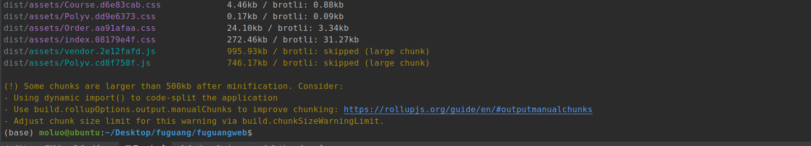

## 项目部署的相关概念

关于企业项目上线的部署流程，主要包含以下3个方面：

1. 落实并调整部署方案[1.0/2.0/3.0/]
2. 确认与完善部署环境
3. 确定部署架构与服务器节点

### 部署方案

```
1. 分析项目的产品需求文档，定好部署方案的方向
2. 分析项目开发文档，按照功能边界，设计部署的结点
3. 分析项目功能软件，合理的取舍，选符合当前业务场景的
4. 梳理项目部署涉及到的部署软件实现方案，根据上面第2点确定的结点，确定初版部署方案
5. 根据项目实际情况，调整优化并确定项目部署方案【短期内的持续方案】
```


### 部署环境

#### 个人开发环境

```
工作人员：自己
工作平台：个人笔记本、公司配的电脑
平台特点：根据公司的项目要求，环境是自己配的，团队中不同的个人开发环境可以不一样
工作内容：项目的子模块，子功能的开发和维护
完成标准：完成领导/leeder安排的内容[项目的功能子模块开发]
```

#### 公司内部服务器环境

```
工作人员：开发团队
工作平台：公司内部服务器
平台特点：服务器环境和线上的服务器环境完全一致
工作内容：项目子模块间的功能联调
完成标准：项目阶段开发、调试完成
```

#### 项目测试环境

```
工作人员：测试团队
工作平台：公司内部服务器
平台特点：服务器环境和线上的服务器环境完全一致
工作内容：项目功能/非功能/探索等测试
完成标准：项目阶段功能正常运行
```

#### 项目预发布环境

```
工作人员：运维团队
工作平台：公司线上服务器组中的一台
平台特点：服务器环境和线上的服务器环境完全一致
工作内容：特殊功能测试(比如支付)、数据压力测试、其他安全测试等
完成标准：项目阶段功能正常运行，最后一道防线
```

#### 项目生产环境

```
工作人员：运维团队
工作平台：公司线上服务器组
平台特点：标准线上的服务器环境
工作内容：代码部署和维护、记录内部架构文档
完成标准：项目正常运行
```


### 线上项目的基本架构

单点部署：容灾性低，不够健壮。


分布式集群架构：可用性高，容灾性强，费用不低，有较高的维护成本。


### 服务器相关

服务器： 根据节点来衡量，计算需要多少台服务器才能承受指定的QPS【每秒请求数】访问压力。 

服务器类型：物理服务器，云服务器

并发瓶颈：

```python
短板原理[水桶原理]
1. 带宽：20M/40kb
2. 处理并发的能力[web服务器], nginx 客户端静态资源代理-> 4C4M上3-4W，Uwsgi/Gunicorn/Uvincorn -> 3000-5000
3. 数据库查询能力：
   mysql 默认最大连接数151个，最高可以达到16384个，处理QPS的能力，默认大概1000次/s 。    
   show variables like '%max_connections%';

   redis 默认是1W的连接数，最高可以配置到10W，并发处理能力与连接数有关，默认1W连接的话，5W/s。
   CONFIG GET maxclients

4. 物理服务器本身的承载能力[8核16G起步...]  【腾讯云、华为云、阿里云、网易云、百度云等等，找新手礼包】
当前项目要完整的跑起来，务必购买的服务器配置：2C4G2M
```


可以使用apache ab工具进行压测，根据短板原理得到系统的并发处理数的乐观数据。

```bash
# 安装命令：
# sudo apt install apache2-utils

# 基本使用命令
ab -n 1000 -c 100 -w https://www.luffycity.com/ >> ~/ab.html
# -n 表示本次压测的总请求执行数
# -c 表示本次压测的并发数
# -w 表示以HTML格式输出压测结果

# ab命令会创建多个并发访问线程，模拟多个访问者同时对某一URL地址进行访问。它的测试目标是基于URL的，因此，它既可以用来测试apache的负载压力，也可以测试nginx、lighthttp、tomcat、IIS等其它Web服务器的压力。
```


### 域名相关

域名要正常使用必须要绑定服务器以后，进行ICP（工信部）备案和公安部备案，否则会出现无法通过域名访问站点的情况。

服务器与域名尽量在同一家公司购买，另外服务器要备份务必要三个月以上。

热门的域名商：`.com`，`.cn`，`.net`，`.org`、`com.cn`。

域名在工信部备案的周期：首次备案15个工作日，再次备案10个工作日。

网站在公安部备案的周期：2个工作日。


| 域名等级 | 例子                                                         |
| -------- | ------------------------------------------------------------ |
| 顶级域名 | `luffycity.com`，`sina.com.cn`，`baidu.com`                  |
| 二级域名 | `www.luffycity.com`，`study.luffycity.com`，`www.sina.com.cn`，`www.baidu.com` |
| 三级域名 | `abc.www.luffycity.com`，                                    |
| 四级域名 | `pic.zhuxian.tiebai.baidu.com`                               |


#### 域名映射

```bash
114.115.200.1 api.luffycity.dabanyu.com    api服务端
114.115.200.1 www.luffycity.dabanyu.com    web客户端
```


## 使用docker进行容器化集成部署

### 远程服务器更新源

更新ubuntu的apt源

```shell
sudo apt-get update
```

安装包允许apt通过HTTPS使用仓库

```shell
sudo dpkg --configure -a
sudo apt-get install -y apt-transport-https ca-certificates curl software-properties-common
```

添加Docker官方GPG key【这个是国外服务器地址，所以网路不好的时候，会失败！在网路好的情况下，多执行几次就没问题了，如果下一行结果不是OK，则执行多几遍】

```shell
curl -fsSL https://download.docker.com/linux/ubuntu/gpg | sudo apt-key add -
```

设置Docker稳定版仓库

```shell
sudo add-apt-repository "deb [arch=amd64] https://download.docker.com/linux/ubuntu $(lsb_release -cs) stable"
```

添加仓库后，更新apt源索引

```shell
sudo apt-get update
```

前面的准备工作完成以后，接下来安装最新版Docker CE（社区版）

```shell
sudo apt-get install -y docker-ce
```

检查Docker CE是否安装正确

```shell
sudo docker pull ubuntu:20.04
```

要获取基础镜像可以直接去官方网站上获取: https://hub.docker.com/

 

### 启动与停止

安装完成Docker后，默认已经启动了docker服务，如需手动控制docker服务的启停，可执行如下命令

```shell
# 启动docker
sudo service docker start

# 停止docker
sudo service docker stop

# 重启docker
sudo service docker restart
```

安装docker-compose，这种安装方式是基于Linux操作系统的源来决定安装版本的，所以往往版本会比较低。

```bash
sudo apt install -y docker-compose
```


## 客户端项目部署

前端自动化项目构建工具vite提供了一个build命令给我们可以将前端项目中src目录下的所有前端资源进行打包成普通的HTML/CSS/JS，生成到项目的dist文件夹中。这个dist目录下的内容会剔除掉vite中所有的测试服务器运行相关依赖包，只保留项目本身的代码和相关文件，这样将来我们在线上服务器运行时就可以直接通过nginx来运行，而不需要依赖于vite工具。

执行build命令进行项目编译之前，先修改配置文件vite.config.js的信息，例如当前客户端的域名和api服务端的域名。`src/settings.js`，代码：

```javascript
export default {
    // api服务端所在地址
    host: "http://api.luffycity.dabanyu.com:8000", // ajax服务度地址
    // 防水墙验证码的应用ID
    captcha_app_id: "199911961",  // IP应用ID
    // 视频更新进度的时间阈值
    seed_time: 5
}
```

src/utils/http/index.js，代码：

```javascript
import axios from "axios"
import settings from "../settings";

const http = axios.create({
    // timeout: 2500,                          // 请求超时，有大文件上传需要关闭这个配置
    baseURL: settings.host,                    // 设置api服务端的默认地址[如果基于服务端实现的跨域，这里可以填写api服务端的地址，如果基于nodejs客户端测试服务器实现的跨域，则这里不能填写api服务端地址]
    withCredentials: false,                    // 是否允许客户端ajax请求时携带cookie
})
```

终端下，在前端项目的根目录下，执行以下命令：

```bash
cd ~/Desktop/luffycity/luffycityweb
yarn upgrade
rm -rf ~/Desktop/luffycity/luffycityweb/dist
vite build
```

效果：


编译完成的内容会被保存在dist目录下，并且编译出来的项目不能直接通过file://协议来访问，只能通过http服务器的运行这个项目。同时，我们之前如果通过node进行跨域代理的话，则编译后会丢失跨域代理，此时我们就需要依靠后台实现cors代理了。




通过scp上传代码到线上服务器

```bash
# scp 本地路径 账号@远程地址:线上路径 
# 本地Ubuntu终端
cd ~/Desktop/luffycity/luffycityweb
tar -zcf luffycityweb.tar.gz dist
scp ~/Desktop/luffycity/luffycityweb/luffycityweb.tar.gz root@114.115.200.1:/home/

# 线上服务器操作[远程部署终端]
cd /home
tar -zxf luffycityweb.tar.gz
mkdir /home/luffycity
mv /home/dist /home/luffycity/luffycityweb
```

因为根据我们上面的部署方案，我们需要安装nginx来运行这个前端项目。


### 目录结构

服务器，目录结构：

```bash
/home/luffycity/
├── conf/
│   └── nginx/
│       └── web.conf
├── docker-compose.yml
└── luffycityweb/
```

远程部署服务器终端操作：

```bash
mkdir -p /home/luffycity/conf/nginx/
touch /home/luffycity/conf/nginx/web.conf
vim /home/luffycity/docker-compose.yml
```

### 编排 nginx服务容器

/home/luffycity/docker-compose.yml，代码：

```python
version: '3.8'
services:
  nginx:
    image: nginx:1.21.4
    restart: always
    ports:
      - "80:80"
    container_name: "nginx"
    volumes:
      - ./luffycityweb:/home/luffycityweb
      - ./conf/nginx/web.conf:/etc/nginx/conf.d/nginx.conf
    networks:
      - default
networks:
  default:
```

/home/luffycity/conf/nginx/web.conf，这个文件是准备给nginx容器内部的虚拟主机配置文件

```bash
vim /home/luffycity/conf/nginx/web.conf
```

web.conf，代码：

```bash
server {
    listen       80;
    server_name  luffycity.chengkanghua.top/;
    # client_max_body_size    1000M;
    # root         /opt/dist;

    # client_max_body_size 20M;

    # Load configuration files for the default server block.

    location / {
        root  /home/luffycityweb;
        index index.html;
        # 单入口的url路径转发
        try_files $uri $uri/ /index.html;
    }
}
```

在远程部署终端启动容器服务

```bash
cd /home/luffycity
docker-compose -f docker-compose.yml up -d
```


小问题：

```bash
# 启动之后访问显示的nginx欢迎页面  原因是 nginx默认的配置文件default.conf 存在
root@VM-4-16-ubuntu:/home/luffycity# docker exec -it nginx /bin/bash
root@426cdccbd8c2:/# rm /etc/nginx/conf.d/default.conf
root@426cdccbd8c2:/# exit
exit

root@VM-4-16-ubuntu:/home/luffycity# docker-compose -f docker-compose.yml restart
```


## 服务端项目部署

根据我们之前分析的项目部署架构，后端需要调用mysql、redis和elasticsearch。因此我们需要先把这些外部软件先预装。

### 目录结构

```bash
/home/luffycity/
├── conf/
│   ├── redis/
│   │   └── master.conf
│   ├── mysql/
│   └── nginx/
│       └── web.conf
├── data/
│   ├── redis/
│   ├── elastic/
│   └── mysql/
├── docker-compose.yml
├── luffycityweb/
├── initdb/
│   └── luffycity.sql
├── logs/
│   └── mysql
└── plugins/
```

### 编排mysql服务容器

在远程部署服务器上进行终端操作，创建目录结构

```bash
cd /home/luffycity
mkdir -p data/mysql
mkdir -p logs/mysql
mkdir -p initdb
vim /home/luffycity/docker-compose.yml
```

/home/luffycity/docker-compose.yml，代码：

```python
version: '3.8'
services:
  nginx:
    image: nginx:1.21.4
    restart: always
    ports:
      - "80:80"
    container_name: "nginx"
    volumes:
      - ./luffycityweb:/home/luffycityweb
      - ./conf/nginx/web.conf:/etc/nginx/conf.d/nginx.conf
    networks:
      - default

  mysql_master:
    image: mysql:8.0.30
    restart: always
    container_name: "mysql_master"
    networks:
      - default
    environment:
      - "MYSQL_ROOT_PASSWORD=root2022"
      - "MYSQL_USER=luffycity"
      - "MYSQL_PASSWORD=luffycity"
      - "MYSQL_DATABASE=luffycity"
      - "TZ=Asia/Shanghai"
    command:
      --default-authentication-plugin=mysql_native_password
      --character-set-server=utf8mb4
      --collation-server=utf8mb4_general_ci
      --explicit_defaults_for_timestamp=true
    ports:
      - 3306:3306
    volumes:
      - ./data/mysql:/var/lib/mysql
      - ./logs/mysql:/logs
      - ./initdb:/docker-entrypoint-initdb.d/

networks:
  default:

```


#### 把本地的数据导入到SQL文件并上传到服务器

```python
# 把本地的数据库导出到桌面
mysqldump -uroot -p123 luffycity > ~/Desktop/luffycity/luffycityapi/luffycity.sql

# 把luffycityapi目录下导出的数据库文件luffycity.sql导入到远程阿里元服务器下的docker容器中的mysql数据库
scp ~/Desktop/luffycity/luffycityapi/luffycity.sql root@114.115.200.1:/home/luffycity/initdb/
```

重新启动docker-compose的容器服务

```bash
cd /home/luffycity
docker-compose -f docker-compose.yml down
docker-compose -f docker-compose.yml up -d

# 注意：如果mysql容器要初始化数据库，则必须要保证在运行mysql容器之前，data目录是没有任何内容的！！！
# rm -rf /home/luffycity/data/

# 可以通过以下命令进入mysql容器
docker exec -it mysql_master mysql -uroot -proot2022
use luffycity
show tables;
```


### 编排redis服务容器

创建目录和必须的文件

```bash
cd /home/luffycity
mkdir -p conf/redis
touch conf/redis/master.conf
mkdir -p data/redis/master
vim conf/redis/master.conf
```

conf/redis/master.conf，主库配置文件，代码：

```bash
# 连接认证密码
requirepass 123456
# 从库连接主库认证密码
masterauth 123456
bind 0.0.0.0

# RDB快照
save 900 1
save 300 10
save 60 10000
dir "/data"
rdbcompression yes
dbfilename dump.rdb

# AOF日志
appendonly yes
appendfilename "appendonly.aof"
appendfsync everysec
```

保存redis配置文件，并编辑/home/luffycity/docker-compose.yml。

```bash
cd /home/luffycity
vim /home/luffycity/docker-compose.yml
```


代码：

```python
version: '3.8'
services:
  nginx:
    image: nginx:1.21.4
    restart: always
    ports:
      - "80:80"
    container_name: "nginx"
    volumes:
      - ./luffycityweb:/home/luffycityweb
      - ./conf/nginx/web.conf:/etc/nginx/conf.d/nginx.conf
    networks:
      - default

  mysql_master:
    image: mysql:8.0.30
    restart: always
    container_name: "mysql_master"
    networks:
      - default
    environment:
      - "MYSQL_ROOT_PASSWORD=root2022"
      - "MYSQL_USER=luffycity"
      - "MYSQL_PASSWORD=luffycity"
      - "MYSQL_DATABASE=luffycity"
      - "TZ=Asia/Shanghai"
    command:
      --default-authentication-plugin=mysql_native_password
      --character-set-server=utf8mb4
      --collation-server=utf8mb4_general_ci
      --explicit_defaults_for_timestamp=true
    ports:
      - 3306:3306
    volumes:
      - ./data/mysql:/var/lib/mysql
      - ./logs/mysql:/logs
      - ./initdb:/docker-entrypoint-initdb.d/


  redis_master:
    image: redis:6.2.6-alpine3.15
    restart: always
    networks:
      - default
    ports:
      - "6379:6379"
    command:
      ["redis-server", "/usr/local/etc/redis/redis.conf"]
    container_name: "redis_master"
    volumes:
      - ./conf/redis/master.conf:/usr/local/etc/redis/redis.conf
      - ./data/redis/master:/data

networks:
  default:

```

启动服务

```bash
docker-compose -f docker-compose.yml down

docker-compose -f docker-compose.yml up -d
# 测试
docker exec -it redis_master redis-cli -a 123456
```


### 编排elasticsearch搜索引擎服务容器

在网络安全组中，开放9200,9300这2个端口


编辑/home/luffycity/docker-compose.yml，

```bash
vim /home/luffycity/docker-compose.yml
```

代码：

```python
version: '3.8'
services:
  nginx:
    image: nginx:1.21.4
    restart: always
    ports:
      - "80:80"
    container_name: "nginx"
    volumes:
      - ./luffycityweb:/home/luffycityweb
      - ./conf/nginx/web.conf:/etc/nginx/conf.d/nginx.conf
    networks:
      - default

  mysql_master:
    image: mysql:8.0.30
    restart: always
    container_name: "mysql_master"
    networks:
      - default
    environment:
      - "MYSQL_ROOT_PASSWORD=root2022"
      - "MYSQL_USER=luffycity"
      - "MYSQL_PASSWORD=luffycity"
      - "MYSQL_DATABASE=luffycity"
      - "TZ=Asia/Shanghai"
    command:
      --default-authentication-plugin=mysql_native_password
      --character-set-server=utf8mb4
      --collation-server=utf8mb4_general_ci
      --explicit_defaults_for_timestamp=true
    ports:
      - 3306:3306
    volumes:
      - ./data/mysql:/var/lib/mysql
      - ./logs/mysql:/logs
      - ./initdb:/docker-entrypoint-initdb.d/


  redis_master:
    image: redis:6.2.6-alpine3.15
    restart: always
    networks:
      - default
    ports:
      - "6379:6379"
    command:
      ["redis-server", "/usr/local/etc/redis/redis.conf"]
    container_name: "redis_master"
    volumes:
      - ./conf/redis/master.conf:/usr/local/etc/redis/redis.conf
      - ./data/redis/master:/data

  elasticsearch_1:
    image: elasticsearch:7.16.1
    restart: always
    container_name: "elasticsearch_1"
    environment:
      - "discovery.type=single-node"
      - "bootstrap.memory_lock=true"
      - "ES_JAVA_OPTS=-Xms512m -Xmx512m"
      - "xpack.security.enabled=false"
      - "http.cors.enabled=true"
      - "http.cors.allow-origin=*"
    ulimits:
      memlock:
        soft: -1
        hard: -1
    volumes:
      - ./data/elastic:/usr/share/elasticsearch/data
      - ./logs/elastic:/var/log/elasticsearch
      - ./plugins:/usr/share/elasticsearch/plugins
    ports:
      - 9200:9200
    networks:
      - default

networks:
  default:

```

把ik分词器下载解压到/home/luffycity/plugins/目录下。

```bash
mkdir -p /home/luffycity/data/elastic
mkdir -p /home/luffycity/plugins
chmod 777 /home/luffycity/data/elastic

# 下载ik中文分词插件
wget https://github.com/medcl/elasticsearch-analysis-ik/releases/download/v7.16.1/elasticsearch-analysis-ik-7.16.1.zip

# 解压保存到es的插件目录
unzip elasticsearch-analysis-ik-7.16.1.zip -d /home/luffycity/plugins/ik-7.16.1

docker-compose -f docker-compose.yml up

# postman中测试访问
post http://114.115.200.1:9200/_analyze?pretty

{
  "analyzer": "ik_max_word",
  "text": "我是中国人，我来自北京。"
}
```

启动服务

```bash
docker-compose -f docker-compose.yml down
docker-compose -f docker-compose.yml up -d
# 监控docker-compose的所有容器运行的日志信息
docker-compose logs -f
```

es索引的生成是要结合django项目的ORM来生成，所以暂时先不用执行其他操作，先完成django项目的部署先。


### 编排uwsgi运行服务端项目容器服务

#### 基于Dockerfile定制服务端项目镜像

##### 把luffycityapi服务端项目进行部署前的修改和调整

```txt
1. 本地的项目配置，保存在dev.py中，不管mysql数据库密码或者redis的地址或者配置信息都是属于开发阶段，
   项目上线以后肯定换成公司的。所以mysql数据库等信息一定会修改，因为将来还需要本地继续开发新的功能业务，
   所以不能直接修改dev.py，因此我们需要把dev.py的配置内容复制粘贴一份到pro.py中，并修改对应的配置信息，
   改成公司的。

2. 在本地开发时，我们使用的django框架运行在debug模式下的，但是项目上线采用uwsgi运行时肯定会关闭debug模式的，
   而如果关闭了debug模式，则django框架就不再提供静态文件的浏览服务，也就是之前simpleUI，drf的接
   口调试页面的css/js/图片都不能访问了。我们需要使用django提供的命令提前收集这些静态文件到项目的
   指定目录下，后面通过nginx来对外提供http浏览服务

3. 原来的drf项目是运行在python内置的提供的web服务器中，wsgiref
   在项目上线的时候，我们不能使用这个模块来提供对外服务!
   wsgiref不支持多线程多进程，本身性能不好，本身在安全性上并不完善，
   python提供wsgiref这个模块仅供学习和开发测试使用。
   runserver 不能用于生产, 改成uwsgi, gunicorn, uvicorn

4. 原来drf项目在本地开发时，其实要运行这个项目，我们是安装了很多的第三方依赖模块。
   现在项目上线了，我们也肯定需要把本地的模块同步到线上服务器！否则项目跑不起来。
   因此需要使用pip freeze > requirements.txt 把项目运行的模块列表以及它们的版本
   记录到requirements.txt文件中，然后在线上服务器对requirements.txt执行重新安装模块
```


###### 修改现有的django配置文件

在项目中复制开发配置文件dev.py 到生产配置pro.py

修改配置中的IP地址为公网地址，所有的127.0.0.1全部换成公网地址，所有域名替换成真实域名。

所有的第三方接口账号全部换成公司的账号信息。

**修改的地方**

```py
DEBUG = False

DATABASES = {
    # 'default': {
    #     'ENGINE': 'django.db.backends.sqlite3',
    #     'NAME': BASE_DIR / 'db.sqlite3',
    # }
    'default': {
        # 'ENGINE': 'django.db.backends.mysql',
        'ENGINE': 'dj_db_conn_pool.backends.mysql',
        'NAME': 'luffycity',
        'PORT': 3306,
        'HOST': '121.5.37.237',
        'USER': 'luffycity',
        'PASSWORD': 'luffycity',
        'OPTIONS': {
            'charset': 'utf8mb4',  # 连接选项配置,mysql8.0以上无需配置
        },
        'POOL_OPTIONS': {  # 连接池的配置信息
            'POOL_SIZE': 10,  # 连接池默认创建的链接对象的数量
            'MAX_OVERFLOW': 10  # 连接池默认创建的链接对象的最大数量
        }
    },
    'read1': {
        # 'ENGINE': 'django.db.backends.mysql',
        'ENGINE': 'dj_db_conn_pool.backends.mysql',
        'NAME': 'luffycity',
        'PORT': 3306,
        'HOST': '121.5.37.237',
        'USER': 'luffycity',
        'PASSWORD': 'luffycity',
        'OPTIONS': {
            'charset': 'utf8mb4',  # 连接选项配置,mysql8.0以上无需配置
        },
        'POOL_OPTIONS': {  # 连接池的配置信息
            'POOL_SIZE': 10,  # 连接池默认创建的链接对象的数量
            'MAX_OVERFLOW': 10  # 连接池默认创建的链接对象的最大数量
        }
    }
}

# 自动数据库路由   增加的 
DATABASE_ROUTERS = ["luffycityapi.db_router.DBRouter"]
# redis configration
# 设置redis缓存
CACHES = {
    # 默认缓存
    "default": {
        "BACKEND": "django_redis.cache.RedisCache",
        # 项目上线时,需要调整这里的路径
        # "LOCATION": "redis://:密码@IP地址:端口/库编号",
        "LOCATION": "redis//:123456@121.5.37.237:6379/0",
        "OPTIONS": {
            "CLIENT_CLASS": "django_redis.client.DefaultClient",
            "CONNECTION_POOL_KWARGS": {"max_connections": 100},
        }
    },
    # 提供给admin运营站点的session存储
    "session": {
        "BACKEND": "django_redis.cache.RedisCache",
        "LOCATION": "redis//:123456@121.5.37.237:6379/1",
        "OPTIONS": {
            "CLIENT_CLASS": "django_redis.client.DefaultClient",
            "CONNECTION_POOL_KWARGS": {"max_connections": 100},
        }
    },
    # 提供存储短信验证码
    "sms_code": {
        "BACKEND": "django_redis.cache.RedisCache",
        "LOCATION": "redis//:123456@121.5.37.237:6379/2",
        "OPTIONS": {
            "CLIENT_CLASS": "django_redis.client.DefaultClient",
            "CONNECTION_POOL_KWARGS": {"max_connections": 100},
        }
    },
    # 提供存储搜索热门关键字
    "hot_word": {
        "BACKEND": "django_redis.cache.RedisCache",
        "LOCATION": "redis//:123456@121.5.37.237:6379/3",
        "OPTIONS": {
            "CLIENT_CLASS": "django_redis.client.DefaultClient",
        }
    },
    # 提供存储购物车课程商品
    "cart": {
        "BACKEND": "django_redis.cache.RedisCache",
        "LOCATION": "redis//:123456@121.5.37.237:6379/4",
        "OPTIONS": {
            "CLIENT_CLASS": "django_redis.client.DefaultClient",
        }
    },
    # 提供存储优惠券
    "coupon": {
        "BACKEND": "django_redis.cache.RedisCache",
        "LOCATION": "redis//:123456@121.5.37.237:6379/5",
        "OPTIONS": {
            "CLIENT_CLASS": "django_redis.client.DefaultClient",
        }
    },
}

# Celery异步任务队列框架的配置项[注意：django的配置项必须大写，所以这里的所有配置项必须全部大写]
# 任务队列
CELERY_BROKER_URL = 'redis//:123456@121.5.37.237:6379/14'
# 结果队列
CELERY_RESULT_BACKEND = 'redis//:123456@121.5.37.237:6379/15'

# 首页图标地址
SIMPLEUI_INDEX = 'http://www.luffycity.chengkanghua.top/'
```


settings/pro.py，代码：

```python
"""
Django settings for luffycityapi project.

Generated by 'django-admin startproject' using Django 3.2.9.

For more information on this file, see
https://docs.djangoproject.com/en/3.2/topics/settings/

For the full list of settings and their values, see
https://docs.djangoproject.com/en/3.2/ref/settings/
"""

from pathlib import Path

# Build paths inside the project like this: BASE_DIR / 'subdir'.
# 主应用目录
BASE_DIR = Path(__file__).resolve().parent.parent

import sys
sys.path.insert(0, str(BASE_DIR / "apps"))
sys.path.insert(0, str( BASE_DIR / "utils") )

# Quick-start development settings - unsuitable for production
# See https://docs.djangoproject.com/en/3.2/howto/deployment/checklist/

# SECURITY WARNING: keep the secret key used in production secret!
SECRET_KEY = 'django-insecure-n)zr+vbuap+s%zd*d6b2@nhpaox_3ii^zv3e9bsgp+2-oicwry'

# SECURITY WARNING: don't run with debug turned on in production!
DEBUG = False
# 允许客户端使用任意域名访问django站点
ALLOWED_HOSTS = ["*"]


# Application definition

INSTALLED_APPS = [
    'simpleui', # admin界面美化,必须写在admin上面
    'django.contrib.admin',
    'django.contrib.auth',
    'django.contrib.contenttypes',
    'django.contrib.sessions',
    'django.contrib.messages',
    'django.contrib.staticfiles',

    "rest_framework",  # 注意：记得加入 rest_framework
    'corsheaders',  # cors跨域子应用
    'ckeditor',   # 富文本编辑器
    'ckeditor_uploader',  # 富文本编辑器上传文件子用用
    'stdimage',  # 生成缩略图
    'haystack',  # 搜索引擎框架

    "home",
    'users',
    'courses',
    'cart',
    'orders',
    'coupon',
    'payments',
]

MIDDLEWARE = [
    'corsheaders.middleware.CorsMiddleware',  # cors跨域的中间件
    'django.middleware.security.SecurityMiddleware',
    'django.contrib.sessions.middleware.SessionMiddleware',
    'django.middleware.common.CommonMiddleware',
    # 'django.middleware.csrf.CsrfViewMiddleware',
    'django.contrib.auth.middleware.AuthenticationMiddleware',
    'django.contrib.messages.middleware.MessageMiddleware',
    'django.middleware.clickjacking.XFrameOptionsMiddleware',
]


# CORS_ORIGIN_WHITELIST = (
#     'http://www.luffycity.cn:3000',
# )
# CORS_ALLOW_CREDENTIALS = False  # 不允许ajax跨域请求时携带cookie

CORS_ALLOW_ALL_ORIGINS = True

ROOT_URLCONF = 'luffycityapi.urls'

TEMPLATES = [
    {
        'BACKEND': 'django.template.backends.django.DjangoTemplates',
        'DIRS': [
            BASE_DIR / "templates",  # BASE_DIR 是apps的父级目录，是主应用目录，templates需要手动创建
        ],
        'APP_DIRS': True,
        'OPTIONS': {
            'context_processors': [
                'django.template.context_processors.debug',
                'django.template.context_processors.request',
                'django.contrib.auth.context_processors.auth',
                'django.contrib.messages.context_processors.messages',
            ],
        },
    },
]

WSGI_APPLICATION = 'luffycityapi.wsgi.application'


# Database
# https://docs.djangoproject.com/en/3.2/ref/settings/#databases

DATABASES = {
    # 'default': {
    #     'ENGINE': 'django.db.backends.sqlite3',
    #     'NAME': BASE_DIR / 'db.sqlite3',
    # }
    'default': {
        # 'ENGINE': 'django.db.backends.mysql',
        'ENGINE': 'dj_db_conn_pool.backends.mysql',
        'NAME': 'luffycity',
        'PORT': 3306,
        'HOST': '114.115.200.1',
        'USER': 'luffycity',
        'PASSWORD': 'luffycity',
        'OPTIONS': {
            'charset': 'utf8mb4',  # 连接选项配置,mysql8.0以上无需配置
        },
        'POOL_OPTIONS': {  # 连接池的配置信息
            'POOL_SIZE': 10,    # 连接池默认创建的链接对象的数量
            'MAX_OVERFLOW': 10  # 连接池默认创建的链接对象的最大数量
        }
    },
    'read1': {
        # 'ENGINE': 'django.db.backends.mysql',
        'ENGINE': 'dj_db_conn_pool.backends.mysql',
        'NAME': 'luffycity',
        'PORT': 3306,
        'HOST': '114.115.200.1',
        'USER': 'luffycity',
        'PASSWORD': 'luffycity',
        'OPTIONS': {
            'charset': 'utf8mb4',  # 连接选项配置,mysql8.0以上无需配置
        },
        'POOL_OPTIONS': {  # 连接池的配置信息
            'POOL_SIZE': 10,  # 连接池默认创建的链接对象的数量
            'MAX_OVERFLOW': 10  # 连接池默认创建的链接对象的最大数量
        }
    }
}

# 自动数据库路由
DATABASE_ROUTERS = ["luffycityapi.db_router.DBRouter"]

# redis configration
# 设置redis缓存
CACHES = {
    # 默认缓存
    "default": {
        "BACKEND": "django_redis.cache.RedisCache",
        # 项目上线时,需要调整这里的路径
        # "LOCATION": "redis://:密码@IP地址:端口/库编号",
        "LOCATION": "redis://:123456@114.115.200.1:6379/0",
        "OPTIONS": {
            "CLIENT_CLASS": "django_redis.client.DefaultClient",
            "CONNECTION_POOL_KWARGS": {"max_connections": 10},  # 连接池
        }
    },
    # 提供给admin运营站点的session存储
    "session": {
        "BACKEND": "django_redis.cache.RedisCache",
        "LOCATION": "redis://:123456@114.115.200.1:6379/1",
        "OPTIONS": {
            "CLIENT_CLASS": "django_redis.client.DefaultClient",
            "CONNECTION_POOL_KWARGS": {"max_connections": 10},
        }
    },
    # 提供存储短信验证码
    "sms_code": {
        "BACKEND": "django_redis.cache.RedisCache",
        "LOCATION": "redis://:123456@114.115.200.1:6379/2",
        "OPTIONS": {
            "CLIENT_CLASS": "django_redis.client.DefaultClient",
            "CONNECTION_POOL_KWARGS": {"max_connections": 10},
        }
    },
    # 提供存储搜索热门关键字
    "hot_word": {
        "BACKEND": "django_redis.cache.RedisCache",
        "LOCATION": "redis://:123456@114.115.200.1:6379/3",
        "OPTIONS": {
            "CLIENT_CLASS": "django_redis.client.DefaultClient",
        }
    },
    # 提供存储购物车课程商品
    "cart": {
        "BACKEND": "django_redis.cache.RedisCache",
        "LOCATION": "redis://:123456@114.115.200.1:6379/4",
        "OPTIONS": {
            "CLIENT_CLASS": "django_redis.client.DefaultClient",
        }
    },
    # 提供存储优惠券
    "coupon": {
        "BACKEND": "django_redis.cache.RedisCache",
        "LOCATION": "redis://:123456@114.115.200.1:6379/5",
        "OPTIONS": {
            "CLIENT_CLASS": "django_redis.client.DefaultClient",
        }
    },
}

# 设置用户登录admin站点时,记录登录状态的session保存到redis缓存中
SESSION_ENGINE = "django.contrib.sessions.backends.cache"
# 设置session保存的位置对应的缓存配置项
SESSION_CACHE_ALIAS = "session"


# haystack连接elasticsearch的配置信息
HAYSTACK_CONNECTIONS = {
    'default': {
        # haystack操作es的核心模块
        'ENGINE': 'haystack.backends.elasticsearch7_backend.Elasticsearch7SearchEngine',
        # es服务端地址
        'URL': 'http://114.115.200.1:9200/',
        # es索引仓库
        'INDEX_NAME': 'haystack',
    },
}


# 当mysqlORM操作数据库改变(添加、删除、修改）时，自动更新es的索引，否则es的索引会找不到新增的数据
HAYSTACK_SIGNAL_PROCESSOR = 'haystack.signals.RealtimeSignalProcessor'


# Password validation
# https://docs.djangoproject.com/en/3.2/ref/settings/#auth-password-validators

AUTH_PASSWORD_VALIDATORS = [
    {
        'NAME': 'django.contrib.auth.password_validation.UserAttributeSimilarityValidator',
    },
    {
        'NAME': 'django.contrib.auth.password_validation.MinimumLengthValidator',
    },
    {
        'NAME': 'django.contrib.auth.password_validation.CommonPasswordValidator',
    },
    {
        'NAME': 'django.contrib.auth.password_validation.NumericPasswordValidator',
    },
]


# Internationalization
# https://docs.djangoproject.com/en/3.2/topics/i18n/

LANGUAGE_CODE = 'zh-hans'

TIME_ZONE = 'Asia/Shanghai'

USE_I18N = True

USE_L10N = True

USE_TZ = False # 关闭时区转换以后，django会默认使用TIME_ZONE作为时区。


# Static files (CSS, JavaScript, Images)
# https://docs.djangoproject.com/en/3.2/howto/static-files/

STATIC_URL = '/static/'
# 设置django的静态文件目录[手动创建]
STATICFILES_DIRS = [
    BASE_DIR / "static",
]

# 项目中存储上传文件的根目录[手动创建]，注意，uploads目录需要手动创建否则上传文件时报错
MEDIA_ROOT = BASE_DIR / "uploads"
# 访问上传文件的url地址前缀
MEDIA_URL = "/uploads/"


# Default primary key field type
# https://docs.djangoproject.com/en/3.2/ref/settings/#default-auto-field

DEFAULT_AUTO_FIELD = 'django.db.models.BigAutoField'

# 日志配置
LOGGING = {
    'version': 1,  # 使用的日志模块的版本，目前官方提供的只有版本1，但是官方有可能会升级，为了避免升级出现的版本问题，所以这里固定为1
    'disable_existing_loggers': False,  # 是否禁用其他的已经存在的日志功能？肯定不能，有可能有些第三方模块在调用，所以禁用了以后，第三方模块无法捕获自身出现的异常了。
    'formatters': { # 日志格式设置，verbose或者simple都是自定义的
        'verbose': { # 详细格式，适合用于开发人员不在场的情况下的日志记录。
            # 格式定义：https://docs.python.org/3/library/logging.html#logrecord-attributes
            # levelname 日志等级
            # asctime   发生时间
            # module    文件名
            # process   进程ID
            # thread    线程ID
            # message   异常信息
            'format': '{levelname} {asctime} {module} {process:d} {thread:d} {message}',
            'style': '{', # 变量格式分隔符
        },
        'simple': { # 简单格式，适合用于开发人员在场的情况下的终端输出
            'format': '{levelname} {message}',
            'style': '{',
        },
    },
    'filters': {  # 过滤器
        'require_debug_true': {
            '()': 'django.utils.log.RequireDebugTrue',
        },
    },
    'handlers': { # 日志处理流程，console或者mail_admins都是自定义的。
        'console': {
            'level': 'DEBUG', # 设置当前日志处理流程中的日志最低等级
            'filters': ['require_debug_true'], # 当前日志处理流程的日志过滤
            'class': 'logging.StreamHandler',  # 当前日志处理流程的核心类，StreamHandler可以帮我们把日志信息输出到终端下
            'formatter': 'simple'              # 当前日志处理流程的日志格式
        },
        # 'mail_admins': {
        #     'level': 'ERROR',                  # 设置当前日志处理流程中的日志最低等级
        #     'class': 'django.utils.log.AdminEmailHandler',  # AdminEmailHandler可以帮我们把日志信息输出到管理员邮箱中。
        #     'filters': ['special']             # 当前日志处理流程的日志过滤
        # }
        'file': {
            'level': 'INFO',
            'class': 'logging.handlers.RotatingFileHandler',
            # 日志位置,日志文件名，日志保存目录logs必须手动创建
            'filename': BASE_DIR.parent / "logs/luffycity.log",
            # 单个日志文件的最大值，这里我们设置300M ~ 500M
            'maxBytes': 300 * 1024 * 1024,
            # 备份日志文件的数量，设置最大日志数量为10
            'backupCount': 10,
            # 日志格式:详细格式
            'formatter': 'verbose'
        },
    },
    'loggers': {  # 日志处理的命名空间
        'django': {
            'handlers': ['console','file'], # 当基于django命名空间写入日志时，调用那几个日志处理流程
            'propagate': True,   # 是否在django命名空间对应的日志处理流程结束以后，冒泡通知其他的日志功能。True表示允许
        },
    }
}

# drf配置
REST_FRAMEWORK = {
    # 自定义异常处理
    'EXCEPTION_HANDLER': 'luffycityapi.utils.exceptions.custom_exception_handler',
    # 自定义认证
    'DEFAULT_AUTHENTICATION_CLASSES': (
        'rest_framework_jwt.authentication.JSONWebTokenAuthentication',  # jwt认证
        'rest_framework.authentication.SessionAuthentication',  # session认证
        'rest_framework.authentication.BasicAuthentication',
    ),
}


import datetime
# jwt认证相关配置项
JWT_AUTH = {
    # 设置jwt的有效期
    # 如果内部站点，例如：运维开发系统，OA，往往配置的access_token有效期基本就是15分钟，30分钟，1~2个小时
    'JWT_EXPIRATION_DELTA': datetime.timedelta(weeks=1),  # 一周有效
    # 自定义载荷
    'JWT_PAYLOAD_HANDLER': 'luffycityapi.utils.authenticate.jwt_payload_handler',
    # 自定义响应数据
    'JWT_RESPONSE_PAYLOAD_HANDLER': 'luffycityapi.utils.authenticate.jwt_response_payload_handler'
}


# 告诉django，系统认证相关的功能，采用我们自定义的用户模型类，格式：
# AUTH_USER_MODEL = "子应用目录名.模型类"
AUTH_USER_MODEL = 'users.User'


# django自定义认证
# AUTHENTICATION_BACKENDS django.conf.global_settings中
AUTHENTICATION_BACKENDS = ['luffycityapi.utils.authenticate.CustomAuthBackend', ]


# 腾讯云API接口配置[改成公司的]
TENCENTCLOUD = {
    # 腾讯云访问秘钥ID
    "SecretId": "AKID0sjfDbliV4OUXPYUBD3f2Qn10kGYcTAd",
    # 腾讯云访问秘钥key
    "SecretKey": "HKgplTwEI7i7MPMAl8G8mETUGnnbBk7Q",
    # 验证码API配置
    "Captcha": {
        "endpoint": "captcha.tencentcloudapi.com", # 验证码校验服务端域名
        "CaptchaType": 9,  # 验证码类型，固定为9
        "CaptchaAppId": 199911961,  # 验证码应用ID，务必保证和客户端一致！！！
        "AppSecretKey": "iOvn8DnejVq0iAgVB4dsl0iib",  # 验证码应用key
    },
}


# 容联云短信[改成公司的]
RONGLIANYUN = {
    "accId": '8a216da863f8e6c20164139687e80c1b',  # 主账户ID
    "accToken": '6dd01b2b60104b3dbc88b2b74158bac6',  # 账户授权令牌
    "appId": '8a216da863f8e6c20164139688400c21',  # APP应用ID
    "reg_tid": 1,      # 注册短信验证码的模板ID
    "sms_expire": 300, # 短信有效期，单位：秒(s)
    "sms_interval": 60,# 短信发送的冷却时间，单位：秒(s)
}


"""Celery异步任务队列框架的配置项[注意：django的配置项必须大写，所以这里的所有配置项必须全部大写]"""
# 任务队列
CELERY_BROKER_URL = 'redis://:123456@114.115.200.1:6379/14'
# 结果队列
CELERY_RESULT_BACKEND = 'redis://:123456@114.115.200.1:6379/15'
# 时区，与django的时区同步
CELERY_TIMEZONE = TIME_ZONE
# 防止死锁
CELERY_FORCE_EXECV = True
# 设置并发的worker数量
CELERYD_CONCURRENCY = 200

# 设置失败允许重试[这个慎用，如果失败任务无法再次执行成功，会产生指数级别的失败记录]
# 如果设置了True，必须在异步任务中指定失败重试的次数
CELERY_ACKS_LATE = True
# 每个worker工作进程最多执行500个任务被销毁，可以防止内存泄漏，500是举例，根据自己的服务器的性能可以调整数值
CELERYD_MAX_TASKS_PER_CHILD = 500
# 单个任务的最大运行时间，超时会被杀死[慎用，有大文件操作、长时间上传、下载任务时，需要关闭这个选项，或者设置更长时间]
CELERYD_TIME_LIMIT = 10 * 60
# 任务发出后，经过一段时间还未收到acknowledge, 就将任务重新交给其他worker执行
CELERY_DISABLE_RATE_LIMITS = True
# celery的任务结果内容格式
CELERY_ACCEPT_CONTENT = ['json', 'pickle']

# 之前定时任务（定时一次调用），使用了apply_async({}, countdown=30);
# 设置定时任务（定时多次调用）的调用列表，需要单独运行SCHEDULE命令才能让celery执行定时任务：celery -A mycelery.main beat，当然worker还是要启动的
# https://docs.celeryproject.org/en/stable/userguide/periodic-tasks.html
from celery.schedules import crontab
CELERY_BEAT_SCHEDULE = {
    # "user-send_sms1": {  # 定时任务的注册标记符[必须唯一的]
    #     "task": "send_sms1",   # 定时任务的任务名称
    #     "schedule": 10,  # 定时任务的调用时间，10表示每隔10秒调用一次add任务
    #     # "schedule": crontab(hour=7, minute=30, day_of_week=1),,  # 定时任务的调用时间，每周一早上7点30分调用一次add任务
    # },
}

# ckeditor富文本编辑器配置
# 上传文件的存储路径
CKEDITOR_UPLOAD_PATH = "ckeditor/"

# 工具条配置
CKEDITOR_CONFIGS = {
    'default': {
        # 'toolbar': 'full', # full 显示全部工具
        # 'toolbar': 'Basic', # Basic 显示基本工具
        'toolbar': 'Custom',  # 自定义工具条的显示数量
        'toolbar_Custom': [
            ['Bold', 'Italic', 'Underline', 'Image', 'Styles', 'Format', 'Font', 'Fontsize'],
            ['NumberedList', 'BulletedList', '-', 'Outdent', 'Indent', '-', 'JustifyLeft', 'JustifyCenter',
             'JustifyRight', 'JustifyBlock'],
            ['Link', 'Unlink', 'Table'],
            ['RemoveFormat', 'Source', 'Smiley']
        ],
        # 设置编辑器的高度
        'height': 120,
    },
}


# admin站点公共配置
from django.contrib import admin
admin.AdminSite.site_header = '路飞2.0在线教育'
admin.AdminSite.site_title = '路飞2.0在线教育站点管理'
# 登录界面logo
SIMPLEUI_LOGO = '/uploads/logo.svg'
# 快速操作
SIMPLEUI_HOME_QUICK = True
# 服务器信息
SIMPLEUI_HOME_INFO = True
# 关闭simpleui内置的使用分析
SIMPLEUI_ANALYSIS = False
# 离线模式
SIMPLEUI_STATIC_OFFLINE = True
# 首页图标地址
SIMPLEUI_INDEX = 'http://www.luffycity.dabanyu.com/'


# 阿里云OSS云存储[改成公司的]
OSS_ACCESS_KEY_ID = "LTAI5t991uBJjk8TunKooM7M"
OSS_ACCESS_KEY_SECRET = "oEDvV9RaoCf6rHIZXlJCJAmk0phub2"
OSS_ENDPOINT = "oss-cn-beijing.aliyuncs.com"    # 访问域名, 根据服务器上的实际配置修改
OSS_BUCKET_NAME = "luffycityoline"    # oss 创建的 BUCKET 名称

# 添加下面配置后 Django admin 后台上传的 ImageField, FileField 类型的字段都会被自动上传到 oss 的服务器中, 访问路径也会自动替换
# 如果注释掉的话 oss 的配置会失效, 上传文件会存储到本地, 且访问路径也会变成本地
DEFAULT_FILE_STORAGE = 'django_oss_storage.backends.OssMediaStorage'


# 支付宝相关配置[改成公司的]
ALIPAY = {
    # 'gateway': 'https://openapi.alipay.com/gateway.do',   # 真实网关地址
    'gateway': 'https://openapi.alipaydev.com/gateway.do',  # 沙箱网关地址
    'appid': '2016091600523592',  # 支付应用ID，要修改成自己的
    'sign_type': 'RSA2',  # 签证的加密算法
    'debug': True,  # 沙箱模式下必须设置为True
    'verbose': True,  # 是否在调试模式下输出调试数据
    'timeout': 15,  # 请求超时时间，单位：秒
    "app_private_key_path": BASE_DIR / "apps/payments/keys/app_private_key.pem",  # 应用私钥路径
    "alipay_public_key_path": BASE_DIR / "apps/payments/keys/alipay_public_key.pem",  # 支付宝公钥路径
    "return_url": "http://www.luffycity.dabanyu.com/alipay",  # 同步回调结果通知地址
    "notify_url": "hhttp://api.luffycity.dabanyu.com/payments/alipay/notify",  # 异步回调结果通知地址
}


# 保利威视频加密服务[改成公司的]
POLYV = {
    "userId": "fce2712a86",
    "writeToken": "2f802363-1d15-4278-848d-29a9eda0d320",
    "readToken": "5dc202ca-0838-411e-b3ab-1659ae007dad",
    "secretkey": "uqlJtarKuJ",
    "tokenUrl": "https://hls.videocc.net/service/v1/token",
}
```

luffycityapi/luffycityapi/db_router.py，代码：

```python
import random

class DBRouter(object):
    def db_for_read(self, model, **hints):
        """
        Reads go to a randomly-chosen replica.
        """
        return random.choice(['read1',])

    def db_for_write(self, model, **hints):
        """
        Writes always go to primary.
        """
        return 'default'

```


###### 从服务端项目中收集静态文件

当Django运行在生产环境中，我们会关闭debug调试，那么项目将不再提供静态文件的支持，需要将静态文件交给静态文件的nginx服务器来提供访问支持。

我们先收集所有静态文件。项目中的静态文件除了我们使用的上传文件之外，django本身还有自己的静态文件，如rest_framework、simpleUI、admin、ckeditor等。我们需要收集这些静态文件，集中一起放到静态文件服务器中。

**我们要将收集的静态文件放到项目的static目录中，所以先创建目录static。**

Django提供了收集静态文件的方法。先在配置文件中配置收集之后存放的目录

settings/dev.py 和settings/pro.py，追加以下代码：

```python
# 收集到的静态文件存储目录
STATIC_ROOT = BASE_DIR.parent / 'static'
```

因为目前在本地我们依然使用了dev.py配置文件通过manage.py运行项目，所以我们在本地项目收集静态文件就需要把配置信息同步到dev.py

在本地终端下luffycityapi根目录下执行收集命令

```shell
cd ~/Desktop/luffycity/luffycityapi
python manage.py collectstatic
```

执行收集命令以后，效果如下：


###### django项目通常使用uwsgi服务器或者gunicorn来运行

uwsgi/gunicorn服务器 同步模式运行项目

uvicorn服务器 异步模式运行项目

先修改luffycityapi/wsgi.py，加载线上的pro配置文件：(本地测试时候先写成dev)

```python
os.environ.setdefault('DJANGO_SETTINGS_MODULE', 'luffycityapi.settings.pro')
```

我们目前针对uwsgi服务器的了解还少，所以我们可以先在本地环境中先安装uwsgi模块进行使用，然后成功使用uwsgi启动项目，后面再一并上传到服务器上面重新安装并运行。

```python
# 添加-c conda-forge参数即在conda-forge仓库里使用conda安装或者搜索包。
# 当conda install *某个模块或者包失败时，直接去conda主页里面搜索：https://anaconda.org/
conda install -c conda-forge uwsgi
uwsgi --version    # 查看 uwsgi 版本
```


在项目根目录下创建uwsgi配置文件uwsgi.ini

```bash
cd ~/Desktop/luffycity/luffycityapi
touch uwsgi.ini
```

注意：在manage.py的同级目录下创建uwsgi.ini配置文件。

```ini
[uwsgi]
# 使用nginx连接时使用，Django程序所在服务器地址[反向代理】
# socket=0.0.0.0:8000
# 直接做web服务器使用，Django程序所在服务器地址
http=0.0.0.0:8000
# 项目根目录[一定要使用绝对路径，否则无法访问]
chdir=/home/moluo/Desktop/luffycity/luffycityapi
# 项目中主应用下的wsgi.py文件的路径[相对于项目根目录]
wsgi-file=luffycityapi/wsgi.py
# 进程数[CPU逻辑核数]
processes=4
# 线程数[CPU线程数]
threads=4
# uwsgi服务器的角色[是否开启主进程管理模式]
master=True
# 存放进程编号的文件[相对于项目根目录]
pidfile=uwsgi.pid
# 日志文件，因为uwsgi可以脱离终端在后台运行，日志看不见。我们以前的runserver是依赖终端的[相对于项目根目录]
daemonize=uwsgi.log
# 指定依赖的虚拟环境[聚堆路径，写到虚拟环境目录名]
virtualenv=/home/moluo/anaconda3/envs/luffycity
```

启动uwsgi服务器，必须在uwsgi.ini配置文件所在的目录中运行下面的命令

注意，在本地环境中必须先把runserver关闭

```shell
uwsgi --ini uwsgi.ini
```

停止uwsgi服务器，还可以通过使用kill命令停止

```
uwsgi --stop uwsgi.pid
```

访问项目** http://127.0.0.1:8000/home/nav/header/


###### 把django项目代码上传部署到服务器并使用uwsgi服务器运行

在本地导出当前虚拟环境中的模块包列表到requirements.txt文件中

```bash
cd ~/Desktop/luffycity/luffycityapi
pip freeze > requirements.txt

# 注意：在requirements.txt中有conda安装的模块以 file://开头的，务必删除，否则将来报错。
# PyMySQL @ file:///home/conda/feedstock_root/build_artifacts/pymysql_1610208984992/work
# uWSGI @ file:///home/conda/feedstock_root/build_artifacts/uwsgi_1640027751896/work

# 另外，把django-haystack==3.2.1 改为 django-haystack==3.1.1
```

本地把服务端项目打包成luffycityapi.tar.gz，并在远程部署服务器中解压。

```bash
# 本地终端，执行打包命令并上传压缩包
cd ~/Desktop/luffycity/
tar -zcf luffycityapi.tar.gz luffycityapi
scp ~/Desktop/luffycity/luffycityapi.tar.gz root@114.115.200.1:/home/luffycity/

# 远程部署服务器终端，删除原来就api服务端代码
cd /home/luffycity
rm -rf luffycityapi
# 把上传到服务端的压缩包进行解压
tar -zxf luffycityapi.tar.gz
```


##### 编写Dockerfile定制服务端项目的镜像

————————————————————————————————华丽分割线 以下内容忽略——————————————————————————————

把素材目录下的Miniconda3-py38_4.10.3-Linux-x86_64.sh上传到远程部署服务器，代码操作：

```bash
scp /home/moluo/Desktop/luffycity/Miniconda3-py38_4.10.3-Linux-x86_64.sh root@114.115.200.1:/home/luffycity/
```

创建Dockerfile文件：

```bash
vim /home/luffycity/Dockerfile
```

/home/luffycity/Dockerfile，代码：  

conda 软件安装搜索地址 [:: Anaconda.org](https://anaconda.org/)

```dockerfile
FROM ubuntu:20.04
LABEL maintainer="luffycity.Edu"

ENV PYTHONUNBUFFERED 1

COPY ./Miniconda3-py38_4.10.3-Linux-x86_64.sh /opt/
COPY ./sources.list /etc/apt/sources.list
COPY ./luffycityapi /luffycityapi
COPY ./luffycityapi/requirements.txt /requirements.txt

RUN apt-get update \
    && apt-get -y install wget \
    && mkdir /root/.conda \
    && bash /opt/Miniconda3-py38_4.10.3-Linux-x86_64.sh -b \
    && rm -f /opt/Miniconda3-py38_4.10.3-Linux-x86_64.sh

ENV PATH /root/miniconda3/bin:$PATH

RUN conda install pymysql -c conda-forge \
    && conda install uwsgi -c conda-forge \
    && pip install -r /requirements.txt -i https://pypi.tuna.tsinghua.edu.cn/simple \
    && pip install django-haystack==3.1.1 -i https://pypi.tuna.tsinghua.edu.cn/simple \
    && chmod -R 755 /luffycityapi

WORKDIR /luffycityapi

EXPOSE 8000

VOLUME /luffycityapi
```


注释版：

```python
# 设置当前镜像的基础镜像,FROM指令只能使用一次，而且在Dockerfile顶部第一个使用
FROM ubuntu:20.04
# 设置描述信息
LABEL maintainer="luffycity.Edu"
# 设置环境变量，PYTHONUNBUFFERED设置python解析器在终端下stdout错误信息，一次性输出，要不在暂存区积攒
ENV PYTHONUNBUFFERED 1

# 复制文件    容器外部:容器内部
COPY ./Miniconda3-py38_4.10.3-Linux-x86_64.sh /opt/
COPY ./sources.list /etc/apt/sources.list
COPY ./luffycityapi /luffycityapi
COPY ./luffycityapi/requirements.txt /requirements.txt

# 运行系统命令
RUN apt-get update \  # 更新源
    && apt-get -y install wget \  # 安装wget下载工具
    && mkdir /root/.conda \
    && bash /opt/Miniconda3-py38_4.10.3-Linux-x86_64.sh -b \
    && rm -f /opt/Miniconda3-py38_4.10.3-Linux-x86_64.sh  # 设置环境变量

ENV PATH /root/miniconda3/bin:$PATH  # 设置环境变量

# 给conda全局base虚拟环境安装pymysql和uwsgi
RUN conda install -y pymysql -c conda-forge \
    && conda install -y uwsgi -c conda-forge \
    # 递归安装requirements.txt中的所有依赖模块
    && pip install -r /requirements.txt -i https://pypi.tuna.tsinghua.edu.cn/simple \
    # 因为drf-haystack安装以后，会自动帮django-haystack降版本到3.1.0，但是django-haystack没有支持es7版本的类，所以在requirements.txt文件执行完成以后，重新把 django-haystack更新到3.1.1版本，实现兼容
    && pip install django-haystack==3.1.1 -i https://pypi.tuna.tsinghua.edu.cn/simple \
    # 设置目录权限
    && chmod -R 755 /luffycityapi

# 设置进入容器的默认工作目录
WORKDIR /luffycityapi
# 暴露容器的端口
EXPOSE 8000
# 设置/luffycityapi目录为逻辑卷，方便创建容器时，可以把当前目录的内容映射到容器外面进行持久化存储
VOLUME /luffycityapi
```


在线下载版本

```bash
FROM ubuntu:20.04
LABEL maintainer="luffycity.Edu"

ENV PYTHONUNBUFFERED 1

COPY ./sources.list /etc/apt/sources.list
COPY ./luffycityapi /luffycityapi
COPY ./luffycityapi/requirements.txt /requirements.txt

RUN apt-get update \
    && apt-get -y install wget \
    && wget -P /opt https://repo.anaconda.com/miniconda/Miniconda3-py39_4.12.0-Linux-x86_64.sh \
    && mkdir /root/.conda \
    && bash /opt/Miniconda3-py39_4.12.0-Linux-x86_64.sh -b \
    && rm -f /opt/Miniconda3-py39_4.12.0-Linux-x86_64.sh

ENV PATH /root/miniconda3/bin:$PATH

RUN conda install -y pymysql -c conda-forge \
    && conda install -y uwsgi -c conda-forge \
    && pip install -r /requirements.txt -i https://pypi.tuna.tsinghua.edu.cn/simple \
    && pip install django-haystack==3.1.1 -i https://pypi.tuna.tsinghua.edu.cn/simple \
    && chmod -R 755 /luffycityapi

WORKDIR /luffycityapi

EXPOSE 8000

VOLUME /luffycityapi
```


```bash
vim /home/luffycity/sources.list
```

/home/luffycity/sources.list，代码：这个地方腾讯云就换成系统上腾讯云的地址

```bash
deb http://repo.huaweicloud.com/ubuntu/ focal main restricted
deb http://repo.huaweicloud.com/ubuntu/ focal-updates main restricted
deb http://repo.huaweicloud.com/ubuntu/ focal universe
deb http://repo.huaweicloud.com/ubuntu/ focal-updates universe
deb http://repo.huaweicloud.com/ubuntu/ focal multiverse
deb http://repo.huaweicloud.com/ubuntu/ focal-updates multiverse
deb http://repo.huaweicloud.com/ubuntu/ focal-backports main restricted universe multiverse
deb http://repo.huaweicloud.com/ubuntu focal-security main restricted
deb http://repo.huaweicloud.com/ubuntu focal-security universe
deb http://repo.huaweicloud.com/ubuntu focal-security multiverse
```

问题：  这个dockerfile 在运行时候一直不成功

```
# 环境 腾讯云。ubuntu 1804.
# 报错 原因： conda install -y uwsgi -c conda-forge
Solving environment: ...working... failed with initial frozen solve. Retrying with flexible solve.
Solving environment: ...working... failed with repodata from current_repodata.json, will retry with next repodata source.

# 试过很多方法一直不成功。 无解。   3天了没解决 头疼

```


————————————————————————————————华丽分割线 以上内容忽略——————————————————————————————

##### 编写Dockerfile 定制服务器项目的镜像 第二版本

修改基础镜像解决上面报错问题

> 上面问题解决不了就不解决了， 我上个厕所想了一下， 上面是基于Ubuntu镜像安装conda，安装特别麻烦不就是为了弄一个python环境嘛。
>
> 不如直接使用python:3.9的镜像。 这个方法多简单实用。完美搞定

```bash
FROM python:3.9
LABEL maintainer="luffycity.Edu"

COPY ./luffycityapi /luffycityapi
COPY ./luffycityapi/requirements.txt /requirements.txt

RUN pip install --no-cache-dir -r /requirements.txt -i https://pypi.tuna.tsinghua.edu.cn/simple \
    && pip install uwsgi -i https://pypi.tuna.tsinghua.edu.cn/simple \
    && chmod -R 755 /luffycityapi

WORKDIR /luffycityapi

EXPOSE 8000

VOLUME /luffycityapi
```


通过docker-compose启动luffycityapi镜像，docker-compose.yml，代码：

```bash
vim /home/luffycity/docker-compose.yml
```


```yaml
version: '3.8'
services:
  web1:
    image: nginx:1.21.4
    restart: always
    ports:
      - "80:80"
    container_name: "web1"
    volumes:
      - ./luffycityweb:/home/luffycityweb
      - ./conf/nginx/web.conf:/etc/nginx/conf.d/nginx.conf
    networks:
      - default

  mysql_master:
    image: mysql:8.0.26
    restart: always
    container_name: mysql_master
    networks:
      - default
    environment:
      - "MYSQL_ROOT_PASSWORD=root2022"
      - "MYSQL_USER=luffycity"
      - "MYSQL_PASSWORD=luffycity"
      - "MYSQL_DATABASE=luffycity"
      - "TZ=Asia/Shanghai"
    command:
      --default-authentication-plugin=mysql_native_password
      --character-set-server=utf8mb4
      --collation-server=utf8mb4_general_ci
      --explicit_defaults_for_timestamp=true
    ports:
      - 3306:3306
    volumes:
      - ./data/mysql:/var/lib/mysql
      - ./logs/mysql:/logs
      - ./initdb:/docker-entrypoint-initdb.d/

  redis_master:
    image: redis:6.2.6-alpine3.15
    restart: always
    networks:
      - default
    ports:
      - "6379:6379"
    command:
      ["redis-server", "/usr/local/etc/redis/redis.conf"]
    container_name: redis_master
    volumes:
      - ./conf/redis/master.conf:/usr/local/etc/redis/redis.conf
      - ./data/redis/master:/data

  elasticsearch_1:
    image: elasticsearch:7.16.1
    restart: always
    environment:
      - "discovery.type=single-node"
      - "bootstrap.memory_lock=true"
      - "ES_JAVA_OPTS=-Xms256m -Xmx256m"
      - "xpack.security.enabled=false"
      - "http.cors.enabled=true"
      - "http.cors.allow-origin=*"
    ulimits:
      memlock:
        soft: -1
        hard: -1
    volumes:
      - ./data/elastic:/usr/share/elasticsearch/data
      - ./logs/elastic:/var/log/elasticsearch
      - ./plugins:/usr/share/elasticsearch/plugins
    ports:
      - 9200:9200
    networks:
      - default

  api1:
    build: .
    image: luffycityapi:1.0.0
    container_name: api1
    restart: always
    ports:
      - 8000:8000
    networks:
      - default
    volumes:
      - ./luffycityapi:/luffycityapi
    command: >
      sh -c "uwsgi --http :8000 --workers 4 --master --enable-threads --module luffycityapi.wsgi"
    environment:
      - "DJANGO_SETTINGS_MODULE=luffycityapi.settings.pro"
    depends_on:
      - mysql_master
      - redis_master
      - elasticsearch_1

networks:
  default:
```

**注意： 这里uwsgi.ini 文件配置都要一起传到服务器上， 配置修改**

> 这里老师视频中没有特别说明。 经过实践，这里容器启动改成了uwsgi --http :8000 --workers 4 --master --enable-threads --module luffycityapi.wsgi
>
> 但是 uwsgi.ini 的配置文件还是需要的

```bash
root@VM-4-16-ubuntu:/home/luffycity/luffycityapi# cat uwsgi.ini
[uwsgi]
http=0.0.0.0:8000
chdir=/luffycity/luffycityapi
wsgi-file=luffycityapi/wsgi.py
processes=2
threads=2
master=True
pidfile=uwsgi.pid
daemonize=uwsgi.log
```


启动服务

```bash
docker-compose -f docker-compose.yml down

docker-compose -f docker-compose.yml up -d
# 等待1分钟后给elasticsearch构建索引
docker exec -it api1 python manage.py rebuild_index
```

可以看到api已经启动了，但是我们通过浏览器`http://api.chengkanghua.top:8000`访问发现，访问不了，我们尝试访问到后台运营站点admin，`http://luffycity.chengkanghua.top:8000/admin`。  `http://luffycity.chengkanghua.top:8000/home/nav/header/`


### 使用nginx对uwsgi进行反向代理

接下来，我们就需要把api1服务端容器里面的uwsgi的运行模式从http改成socket模式。

docker-compose.yml，修改如下。

```yaml
version: '3.8'
services:
  nginx:
    image: nginx:1.21.4
    restart: always
    ports:
      - "80:80"
    container_name: "nginx"
    volumes:
      - ./luffycityweb:/home/luffycityweb
      - ./conf/nginx/web.conf:/etc/nginx/conf.d/nginx.conf
    networks:
      - default

  mysql_master:
    image: mysql:8.0.30
    restart: always
    container_name: "mysql_master"
    networks:
      - default
    environment:
      - "MYSQL_ROOT_PASSWORD=root2022"
      - "MYSQL_USER=luffycity"
      - "MYSQL_PASSWORD=luffycity"
      - "MYSQL_DATABASE=luffycity"
      - "TZ=Asia/Shanghai"
    command:
      --default-authentication-plugin=mysql_native_password
      --character-set-server=utf8mb4
      --collation-server=utf8mb4_general_ci
      --explicit_defaults_for_timestamp=true
    ports:
      - 3306:3306
    volumes:
      - ./data/mysql:/var/lib/mysql
      - ./logs/mysql:/logs
      - ./initdb:/docker-entrypoint-initdb.d/


  redis_master:
    image: redis:6.2.6-alpine3.15
    restart: always
    networks:
      - default
    ports:
      - "6379:6379"
    command:
      ["redis-server", "/usr/local/etc/redis/redis.conf"]
    container_name: "redis_master"
    volumes:
      - ./conf/redis/master.conf:/usr/local/etc/redis/redis.conf
      - ./data/redis/master:/data

  elasticsearch_1:
    image: elasticsearch:7.16.1
    restart: always
    container_name: "elasticsearch_1"
    environment:
      - "discovery.type=single-node"
      - "bootstrap.memory_lock=true"
      - "ES_JAVA_OPTS=-Xms512m -Xmx512m"
      - "xpack.security.enabled=false"
      - "http.cors.enabled=true"
      - "http.cors.allow-origin=*"
    ulimits:
      memlock:
        soft: -1
        hard: -1
    volumes:
      - ./data/elastic:/usr/share/elasticsearch/data
      - ./logs/elastic:/var/log/elasticsearch
      - ./plugins:/usr/share/elasticsearch/plugins
    ports:
      - 9200:9200
    networks:
      - default

  api1:
    build: .
    image: luffycityapi:1.0.0
    container_name: api1
    restart: always
    ports:
      - 8000:8000
    networks:
      - default
    volumes:
      - ./luffycityapi:/luffycityapi
    command: >
      sh -c "uwsgi --socket :8000 --workers 4 --master --enable-threads --module luffycityapi.wsgi"
    environment:
      - "DJANGO_SETTINGS_MODULE=luffycityapi.settings.pro"
    depends_on:
      - mysql_master
      - redis_master
      - elasticsearch_1

networks:
  default:
```

修改nginx配置文件

```bash
vim conf/nginx/web.conf
```

conf/nginx/web.conf，如下：

```bash
upstream luffycity {
    server 121.5.37.237:8000;
    # server 114.115.200.1:8001;
}

server {
    listen  80;
    server_name api.luffycity.chengkanghua.top;

    location / {
        include uwsgi_params;
        uwsgi_pass luffycity;
    }
}

server {
    listen       80;
    server_name  luffycity.chengkanghua.top;
    # client_max_body_size    1000M;
    # root         /opt/dist;

    # client_max_body_size 20M;

    # Load configuration files for the default server block.

    location / {
        root  /home/luffycityweb;
        index index.html;
        try_files $uri $uri/ /index.html;
    }
}
```

重启docker-compose

```bash
docker-compose -f docker-compose.yml down
docker-compose -f docker-compose.yml up -d
# 接下来，我们直接在浏览器中，通过如下地址访问：
http://api.luffycity.dabanyu.com/home/nav/header/
http://www.luffycity.dabanyu.com/
```


### 针对后端服务器的运营站点提供静态文件的访问支持

直接让前端的nginx容器同时提供服务端静态文件的访问支持。

修改docker-compose.yml，把服务端的静态文件目录映射到nginx容器中。代码：

```python
version: '3.8'
services:
  web1:
    image: nginx:1.21.4
    restart: always
    ports:
      - "80:80"
    container_name: "web1"
    volumes:
      - ./luffycityapi/static:/home/luffycityapi/static
      - ./luffycityweb:/home/luffycityweb
      - ./conf/nginx/web.conf:/etc/nginx/conf.d/default.conf
    networks:
      - default

  mysql_master:
    image: mysql:8.0.30
    restart: always
    container_name: "mysql_master"
    networks:
      - default
    environment:
      - "MYSQL_ROOT_PASSWORD=root2022"
      - "MYSQL_USER=luffycity"
      - "MYSQL_PASSWORD=luffycity"
      - "MYSQL_DATABASE=luffycity"
      - "TZ=Asia/Shanghai"
    command:
      --default-authentication-plugin=mysql_native_password
      --character-set-server=utf8mb4
      --collation-server=utf8mb4_general_ci
      --explicit_defaults_for_timestamp=true
    ports:
      - 3306:3306
    volumes:
      - ./data/mysql:/var/lib/mysql
      - ./logs/mysql:/logs
      - ./initdb:/docker-entrypoint-initdb.d/

  redis_master:
    image: redis:6.2.6-alpine3.15
    restart: always
    networks:
      - default
    ports:
      - "6379:6379"
    command:
      ["redis-server", "/usr/local/etc/redis/redis.conf"]
    container_name: "redis_master"
    volumes:
      - ./conf/redis/master.conf:/usr/local/etc/redis/redis.conf
      - ./data/redis/master:/data

  elasticsearch_1:
    image: elasticsearch:7.16.1
    restart: always
    container_name: "elasticsearch_1"
    environment:
      - "discovery.type=single-node"
      - "bootstrap.memory_lock=true"
      - "ES_JAVA_OPTS=-Xms256m -Xmx256m"
      - "xpack.security.enabled=false"
      - "http.cors.enabled=true"
      - "http.cors.allow-origin=*"
    ulimits:
      memlock:
        soft: -1
        hard: -1
    volumes:
      - ./data/elastic:/usr/share/elasticsearch/data
      - ./logs/elastic:/var/log/elasticsearch
      - ./plugins:/usr/share/elasticsearch/plugins
    ports:
      - 9200:9200
    networks:
      - default

  api1:
    build: .
    image: luffycityapi:1.0.0
    container_name: api1
    restart: always
    ports:
      - 8000:8000
    networks:
      - default
    volumes:
      - ./luffycityapi:/luffycityapi
    command: >
      sh -c "uwsgi --socket :8000 --workers 4 --master --enable-threads --module luffycityapi.wsgi"
    environment:
      - "DJANGO_SETTINGS_MODULE=luffycityapi.settings.pro"
    depends_on:
      - mysql_master
      - redis_master
      - elasticsearch_1

networks:
  default:
```


修改nginx配置文件web.conf，服务端对应的server配置项中增加一个location配置信息。conf/nginx/web.conf，如下：

```bash
upstream luffycity {
    server 121.5.37.237:8000;
    # server 114.115.200.1:8001;
}

server {
    listen  80;
    server_name api.luffycity.chengkanghua.top;

    location / {
        include uwsgi_params;
        uwsgi_pass luffycity;
    }

    location /static {
        root /home/luffycityapi;
    }
}

server {
    listen       80;
    server_name  luffycity.chengkanghua.top;
    # client_max_body_size    1000M;
    # root         /opt/dist;

    # client_max_body_size 20M;

    # Load configuration files for the default server block.

    location / {
        root  /home/luffycityweb;
        index index.html;
        # 单入口的url路径转发
        try_files $uri $uri/ /index.html;
    }
}


```

完成上面操作以后，我们可以看到当前api服务端的静态文件就提供了http正常浏览了。

```bash
docker-compose -f docker-compose.yml down
docker-compose -f docker-compose.yml up -d
```

因为服务端的访问端口从8000变成了80，所以此处我们需要重新调整下客户端的settings.js中的url路径的值。

终端下，在前端项目的根目录下，执行以下命令：

```bash
cd /home/moluo/Desktop/luffycity/luffycityweb
rm -rf /home/moluo/Desktop/luffycity/luffycityweb/dist
vite build

# 线上服务器操作[远程部署终端]
rm -rf /home/luffycityweb.tar.gz

# 本地ubuntu终端，通过scp上传客户端代码到线上服务器
tar -zcf luffycityweb.tar.gz dist
scp ~/Desktop/luffycity/luffycityweb/luffycityweb.tar.gz root@114.115.200.1:/home/

# 线上服务器操作[远程部署终端]
cd /home
tar -zxf luffycityweb.tar.gz
rm -rf /home/luffycity/luffycityweb
mv /home/dist /home/luffycity/luffycityweb
```

再次重启docker-compose

```bash
cd /home/luffycity
docker-compose -f docker-compose.yml down
docker-compose -f docker-compose.yml up -d
```


### 启动celery

关于celery的启动，因为需要依赖于django项目的。所以celery的启动自然也就和当前api容器一并运行。

修改celery的启动配置文件

```bash
vim /home/luffycity/luffycityapi/luffycityapi/scripts/luffycity_celery_worker.ini
```

代码：

````ini
[program:luffycity_celery_worker]
# 启动命令 which celery
command=/usr/local/bin/celery -A luffycityapi worker -l info -n worker1
# 以管理员身份执行运行celery
user=root
numprocs=1
# 项目根目录的绝对路径，通过pwd查看
directory=/luffycityapi
# 项目虚拟环境
# enviroment=PATH="/usr/local/bin/"
# 输出日志绝对路径
stdout_logfile=/luffycityapi/logs/celery.worker.info.log
# 错误日志绝对路径
stderr_logfile=/luffycityapi/logs/celery.worker.error.log
# 自动启动，开机自启
autostart=true
# 重启
autorestart=true

# 进程启动后跑了几秒钟，才被认定为成功启动，默认1
startsecs=10
# 进程结束后60秒才被认定结束
stopwatisecs=60

# 优先级
priority=999
````

```bash
vim /home/luffycity/luffycityapi/luffycityapi/scripts/luffycity_celery_beat.ini
```

代码：

```ini
[program:luffycity_celery_beat]
# 启动命令 which celery
command=/usr/local/bin/celery -A luffycityapi  beat -l info
# 项目根目录的绝对路径，通过pwd查看
directory=/luffycityapi
# 项目虚拟环境
# enviroment=PATH="/usr/local/bin/"
# 输出日志绝对路径
stdout_logfile=/luffycityapi/logs/celery.beat.info.log
# 错误日志绝对路径
stderr_logfile=/luffycityapi/logs/celery.beat.error.log
# 自动启动，开机自启
autostart=true
# 重启
autorestart=true

# 进程启动后跑了几秒钟，才被认定为成功启动，默认1
startsecs=10

# 进程结束后60秒才被认定结束
stopwatisecs=60

# 优先级
priority=998
```

```bash
vim /home/luffycity/luffycityapi/luffycityapi/scripts/luffycity_celery_flower.ini
```

代码：

```ini
[program:luffycity_celery_flower]
# 启动命令 which celery
command=/usr/local/bin/celery -A luffycityapi flower --port=5555
# 项目根目录的绝对路径，通过pwd查看
directory=/luffycityapi
# 项目虚拟环境
# enviroment=PATH="/usr/local/bin"
# 输出日志绝对路径
stdout_logfile=/luffycityapi/logs/celery.flower.info.log
# 错误日志绝对路径
stderr_logfile=/luffycityapi/logs/celery.flower.error.log
# 自动启动，开机自启
autostart=true
# 重启
autorestart=true

# 进程启动后跑了几秒钟，才被认定为成功启动，默认1
startsecs=10

# 进程结束后60秒才被认定结束
stopwatisecs=60

# 优先级
priority=990
```

```bash
vim /home/luffycity/luffycityapi/luffycityapi/scripts/supervisor.service
```

代码：

```shell
[Unit]
Description=supervisor
After=network.target

[Service]
Type=forking
ExecStart=/usr/local/bin/supervisord -n -c /luffycityapi/scripts/supervisord.conf
ExecStop=/usr/local/bin/supervisorctl $OPTIONS shutdown
ExecReload=/usr/local/bin/supervisorctl $OPTIONS reload
KillMode=process
Restart=on-failure
RestartSec=42s

[Install]
WantedBy=multi-user.target
```

记得开启服务端的安全组，开发5555端口。


docker-compose，代码：

```yaml
version: '3.8'
services:
  web1:
    image: nginx:1.21.4
    restart: always
    ports:
      - "80:80"
    container_name: "web1"
    volumes:
      - ./luffycityapi/static:/home/luffycityapi/static
      - ./luffycityweb:/home/luffycityweb
      - ./conf/nginx/web.conf:/etc/nginx/conf.d/nginx.conf
    networks:
      - default

  mysql_master:
    image: mysql:8.0.26
    restart: always
    container_name: mysql_master
    networks:
      - default
    environment:
      - "MYSQL_ROOT_PASSWORD=root2022"
      - "MYSQL_USER=luffycity"
      - "MYSQL_PASSWORD=luffycity"
      - "MYSQL_DATABASE=luffycity"
      - "TZ=Asia/Shanghai"
    command:
      --default-authentication-plugin=mysql_native_password
      --character-set-server=utf8mb4
      --collation-server=utf8mb4_general_ci
      --explicit_defaults_for_timestamp=true
    ports:
      - 3306:3306
    volumes:
      - ./data/mysql:/var/lib/mysql
      - ./logs/mysql:/logs
      - ./initdb:/docker-entrypoint-initdb.d/

  redis_master:
    image: redis:6.2.6-alpine3.15
    restart: always
    networks:
      - default
    ports:
      - "6379:6379"
    command:
      ["redis-server", "/usr/local/etc/redis/redis.conf"]
    container_name: redis_master
    volumes:
      - ./conf/redis/master.conf:/usr/local/etc/redis/redis.conf
      - ./data/redis/master:/data

  elasticsearch_1:
    image: elasticsearch:7.16.1
    restart: always
    environment:
      - "discovery.type=single-node"
      - "bootstrap.memory_lock=true"
      - "ES_JAVA_OPTS=-Xms256m -Xmx256m"
      - "xpack.security.enabled=false"
      - "http.cors.enabled=true"
      - "http.cors.allow-origin=*"
    ulimits:
      memlock:
        soft: -1
        hard: -1
    volumes:
      - ./data/elastic:/usr/share/elasticsearch/data
      - ./logs/elastic:/var/log/elasticsearch
      - ./plugins:/usr/share/elasticsearch/plugins
    ports:
      - 9200:9200
    networks:
      - default

  api1:
    build: .
    image: luffycityapi:1.0.0
    container_name: api1
    restart: always
    ports:
      - 8000:8000
      - 5555:5555
    networks:
      - default
    volumes:
      - ./luffycityapi:/luffycityapi
    command: >
      sh -c "/usr/local/bin/supervisord -c luffycityapi/scripts/supervisord.conf && uwsgi --socket :8000 --workers 2 --master --enable-threads --module luffycityapi.wsgi"
    environment:
      - "DJANGO_SETTINGS_MODULE=luffycityapi.settings.pro"
      - "C_FORCE_ROOT=1"
    depends_on:
      - mysql_master
      - redis_master
      - elasticsearch_1

networks:
  default:
```


启动服务

```bash
docker-compose -f docker-compose.yml down
docker-compose -f docker-compose.yml up -d
```


注意：

```
这个部署案例把 5555 3306 6379 9100 9200 端口都暴露在外网了， 真实的线上环境 只把80 443端口提供给用户访问 其他端口都走内网连接
这里可以都改成内网 localhost  127.0.0.1
```

