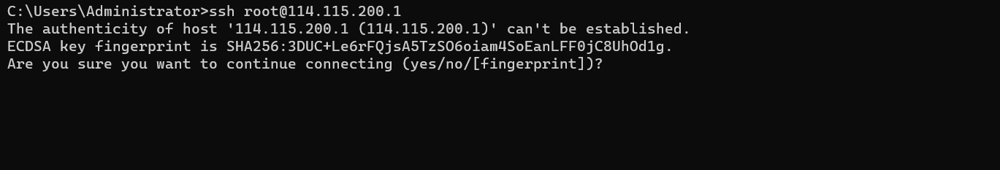

### SSH

ssh（ Secure Shell，安全外壳协议），是一种可靠的，专为远程登录会话和其他网络服务提供安全性的协议。最初是UNIX系统上的一个程序，后来又迅速扩展到其他操作平台。简而言之，就是说白了，就是一种网络协议，**用于计算机之间的加密登录**。当然基于ssh协议实现的程序有商业收费的，也有社区免费的。我们可以在windows下安装putty、xshell来帮助我们远程登录，也可以ssh命令来操作。
SSH的默认端口是22，在实际工作中，有些运维人员在安装配置ssh服务端时为了增强隐蔽性会更改端口。

```bash
# 语法：
ssh 用户名@主机地址  # 有时为安全考虑，运维人员会修改ssh端口，则客户端需要指定端口：ssh -p 端口 用户名@主机地址
# 退出ssh远程登录
exit
```

注意，首次使用ssh登录到远程主机，需要手动输入yes记录主机的指纹信息，如下图所示（windows系统终端效果）：




#### 基于ssh实现免密登录

所谓的免密登录就是基于rsa加密算法生成一对成对的秘钥对。然后当前主机保管私钥，把公钥上传到远程主机，这样以后登陆时仅需要验证公私钥即可，不再需要密码登陆了。

```bash
# 第一步：生成秘钥对。私钥和公钥成对才能匹配成功，秘钥文件默认保存在~/.ssh/目录下。
# 私钥文件名：id_rsa 
# 公钥文件名：id_rsa.pub
ssh-keygen # 连续三下回车

# 第二步： 将公钥文件信息上传到需要被管理的主机上，远程服务器中的公钥保存目录就在该服务器的家目录下~/.ssh/authorized_keys
ssh-copy-id root@114.115.200.1
```


#### 基于ssh实现文件上传下载

scp（secure copy）是一个基于 SSH 协议在网络之间文件进行安全传输的命令。

```bash
# 语法：
# scp 【可选参数】 源目录/目标文件  新目录/目标文件
    # 可选参数：
    # -r：递归复制整个目录【强烈建议尽量是采用压缩包的上传】
    # -v：详细方式输出
    # -q：不显示传输进度条
    # -C：允许压缩
    # -6：使用 IPv6 协议

# 上传本地文件到远程地址
    # scp 本地目录/本地文件  远程用户名@远程ip:远程目录/               # 不修改文件名，直接上传
    # scp 本地目录/本地文件  远程用户名@远程ip:远程目录/远程文件名      # 修改文件名，再上传
    # scp -r 本地目录  远程用户名@远程ip:远程目录
scp /home/moluo/Desoktop/luffycity.zip  root@114.115.200.1:/home/

# 下载远程文件到本地
    # scp 远程用户名@远程ip:远程目录/远程文件名 本地目录/              # 不修改文件名，直接下载
    # scp 远程用户名@远程ip:远程目录/远程文件名 本地目录/本地文件       # 修改文件名，再下载
    # scp -r 远程用户名@远程ip:远程目录 本地目录
scp -r root@114.115.200.1:/home/abc.html /home/moluo/Desoktop/
```

